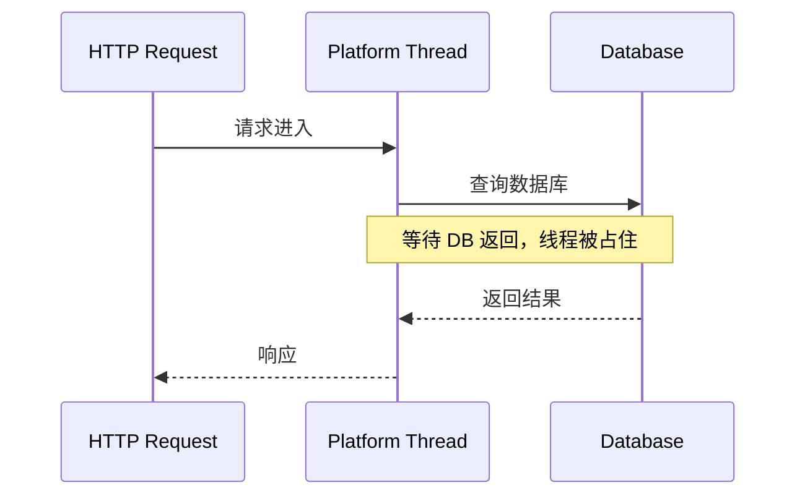
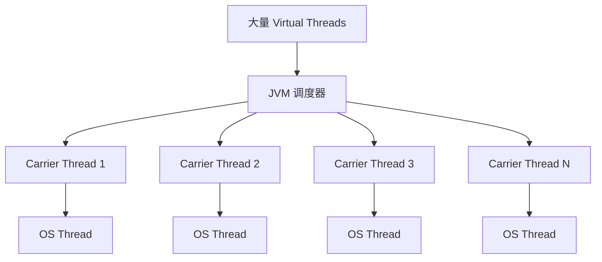
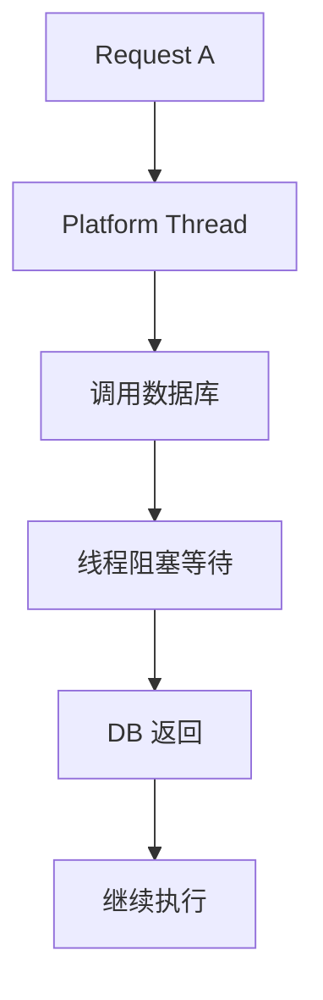
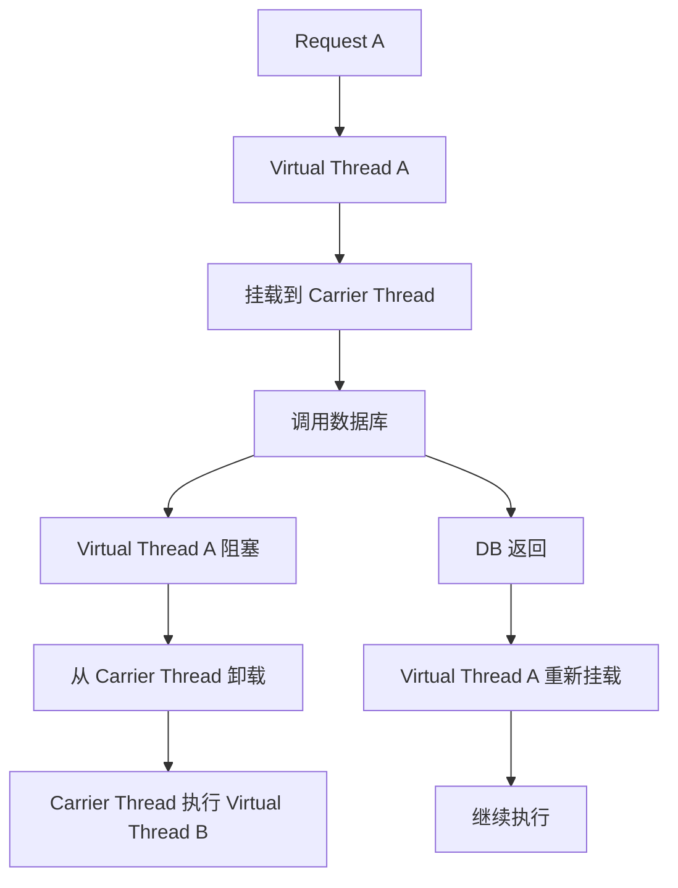
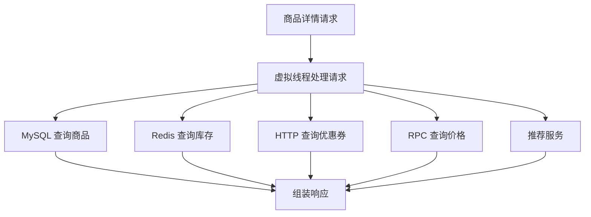
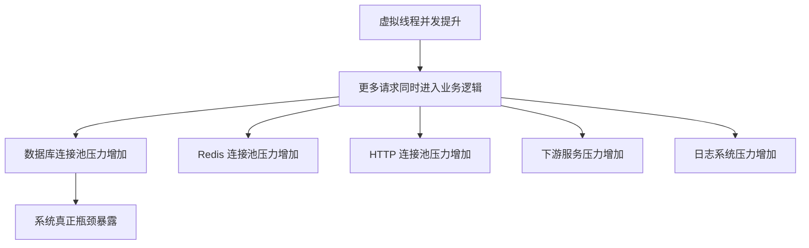
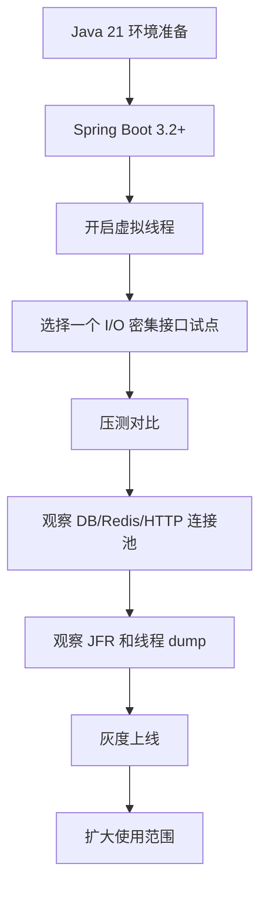

从 **Virtual Threads（虚拟线程）** 开始。

它是 Java 21 最值得优先掌握的新特性123，也是后续理解：

- Structured Concurrency
    
- Scoped Values
    
- Spring Boot 高并发改造
    
- Java 21 服务端架构变化
    

的基础。

下面正式展开。

---

# 1. 结论：虚拟线程解决了什么问题？

一句话：

> **虚拟线程让 Java 可以用“同步阻塞代码”的写法，支撑更高规模的 I/O 并发。**

它不是为了让单个任务跑得更快，而是为了让服务端系统在面对大量阻塞 I/O 时，能承载更多并发请求。

典型场景：

```text
HTTP 请求
DB 查询
Redis 查询
RPC 调用
第三方 API 调用
文件 I/O
消息处理
批量任务调度
```

传统 Java 后端最大的问题不是不会写并发，而是：

> 线程太贵，阻塞太浪费。

虚拟线程的目标就是降低“线程”这个并发单位的成本。

---

# 2. 传统平台线程的问题

Java 以前的线程，本质上是对 **操作系统线程** 的封装。

也就是：

```text
Java Thread ≈ OS Thread
```

这种线程也叫：

> **Platform Thread，平台线程**

---

## 2.1 平台线程为什么贵？

平台线程由操作系统调度，每个线程都需要：

- 独立的线程栈
    
- OS 内核调度
    
- 上下文切换成本
    
- 内存占用
    
- 创建和销毁成本
    

所以传统 Java 后端不会给每个请求随便创建新线程，而是用线程池。

例如 Tomcat 默认工作线程池：

```text
maxThreads = 200
```

这意味着：

> 同一时间最多大约 200 个请求在业务线程里执行。

---

## 2.2 阻塞 I/O 为什么浪费线程？

假设一个接口逻辑是：

```text
1. 查询用户信息：50ms
2. 查询订单列表：80ms
3. 调用优惠券服务：100ms
4. 组装结果：5ms
```

实际 CPU 真正工作的时间可能只有几毫秒，大多数时间都在等：

```text
等数据库
等 Redis
等 HTTP 响应
等 RPC 返回
```

传统平台线程模型中，请求阻塞时，这个 OS 线程也被占住了。



问题在于：

> 线程没有真正干活，但也不能让给别人用。

这就是传统阻塞式 Java 服务端的核心瓶颈。

---

# 3. 虚拟线程是什么？

虚拟线程是 Java 21 正式引入的轻量级线程。

它仍然是 `java.lang.Thread`，但是它不是一对一绑定操作系统线程。

```text
Virtual Thread ≠ OS Thread
Virtual Thread 是 JVM 管理的轻量线程
```

你可以理解为：

> 平台线程是“真实员工”，虚拟线程是“任务单”。  
> 虚拟线程执行时，会被 JVM 临时安排到少量平台线程上运行。

---

## 3.1 核心模型



其中：

|概念|含义|
|---|---|
|Virtual Thread|JVM 管理的轻量线程|
|Platform Thread|传统 Java 线程|
|Carrier Thread|承载虚拟线程运行的平台线程|
|Mount|虚拟线程挂载到 Carrier Thread 上执行|
|Unmount|虚拟线程遇到阻塞时从 Carrier Thread 卸载|
|Scheduler|JVM 内部调度虚拟线程的机制|

---

# 4. 虚拟线程的关键机制：阻塞时自动让出载体线程

虚拟线程真正厉害的地方不是“创建便宜”，而是：

> 当虚拟线程执行阻塞 I/O 时，JVM 可以把它从 Carrier Thread 上卸载，让 Carrier Thread 去执行其他虚拟线程。

---

## 4.1 平台线程阻塞模型



平台线程的问题：

```text
线程阻塞 = OS 线程被占用
```

---

## 4.2 虚拟线程阻塞模型



虚拟线程的优势：

```text
虚拟线程阻塞 ≠ Carrier Thread 阻塞
```

这就是它能提升 I/O 并发能力的根本原因。

---

# 5. 第一个基础 Demo

## 5.1 创建虚拟线程

```java
public class VirtualThreadBasicDemo {

    public static void main(String[] args) throws InterruptedException {

        Thread virtualThread = Thread.ofVirtual()
                .name("order-query-vt")
                .start(() -> {
                    System.out.println("当前线程: " + Thread.currentThread());
                    System.out.println("是否虚拟线程: " + Thread.currentThread().isVirtual());
                });

        virtualThread.join();
    }
}
```

输出类似：

```text
当前线程: VirtualThread[#21,order-query-vt]/runnable@ForkJoinPool-1-worker-1
是否虚拟线程: true
```

注意这一段：

```text
VirtualThread[...]@ForkJoinPool-1-worker-1
```

它说明：

- 当前任务是虚拟线程
    
- 底层由 JVM 调度
    
- 运行时挂载在某个 worker 平台线程上
    

---

## 5.2 批量创建虚拟线程

```java
import java.time.Duration;

public class VirtualThreadMassiveDemo {

    public static void main(String[] args) throws InterruptedException {

        for (int i = 0; i < 100_000; i++) {
            int taskId = i;

            Thread.ofVirtual()
                    .name("task-" + taskId)
                    .start(() -> {
                        try {
                            // 模拟 I/O 阻塞，例如 DB / Redis / HTTP 调用
                            Thread.sleep(Duration.ofSeconds(1));
                        } catch (InterruptedException e) {
                            Thread.currentThread().interrupt();
                        }
                    });
        }

        Thread.sleep(Duration.ofSeconds(3));
        System.out.println("任务提交完成");
    }
}
```

如果用平台线程创建 10 万个线程，大概率会出现：

```text
OutOfMemoryError
unable to create native thread
```

但虚拟线程可以轻松创建大量线程。

不过要注意：

> 能创建 10 万个虚拟线程，不等于你的系统能承载 10 万个真实业务请求。

因为后端瓶颈可能转移到：

- 数据库连接池
    
- Redis 连接池
    
- HTTP 连接池
    
- 下游服务限流
    
- CPU
    
- 内存
    
- 网卡
    
- 日志系统
    

这是企业落地时必须记住的点。

---

# 6. 虚拟线程 vs 平台线程

|对比项|平台线程|虚拟线程|
|---|---|---|
|管理者|OS + JVM|JVM|
|成本|高|低|
|数量级|通常几百到几千|可以几十万甚至更多|
|适合场景|CPU 任务、传统线程池|I/O 密集型任务|
|阻塞代价|高|低|
|是否替代所有线程池|否|否|
|是否适合 CPU 密集任务|适合有限并行|不适合无限创建|
|编程模型|同步 / 异步都可|更适合同步阻塞代码|

---

# 7. 虚拟线程适合什么场景？

## 7.1 适合：I/O 密集型接口

例如商品详情接口：

```text
商品基础信息：MySQL
库存信息：Redis
价格信息：Price Service
优惠券信息：Coupon Service
推荐商品：Recommend Service
```

这种接口大部分时间在等待外部系统返回，很适合虚拟线程。



---

## 7.2 适合：批量 I/O 任务

例如后台任务：

```text
批量同步 10 万个用户画像
每个用户都要调用外部画像服务
```

传统线程池需要谨慎设置线程数。

虚拟线程可以让代码更接近业务直觉：

```java
try (var executor = Executors.newVirtualThreadPerTaskExecutor()) {
    for (Long userId : userIds) {
        executor.submit(() -> syncUserProfile(userId));
    }
}
```

---

## 7.3 不适合：CPU 密集型任务

例如：

```text
大规模加密计算
图片压缩
视频转码
复杂排序
Embedding 本地计算
机器学习推理
```

这些任务主要消耗 CPU。

虚拟线程不会让 CPU 变多。

错误示例：

```java
for (int i = 0; i < 1_000_000; i++) {
    Thread.ofVirtual().start(() -> {
        // CPU 密集计算
        calculateHash();
    });
}
```

这类代码会导致：

- CPU 上下文切换严重
    
- 调度成本上升
    
- 吞吐下降
    
- 延迟变差
    

CPU 密集型任务仍然应该使用固定大小线程池：

```java
ExecutorService cpuExecutor =
        Executors.newFixedThreadPool(Runtime.getRuntime().availableProcessors());
```

---

# 8. 企业级场景：订单详情聚合接口

下面用一个真实后端场景理解虚拟线程。

## 8.1 场景描述

订单详情页需要聚合：

|数据|来源|
|---|---|
|订单基础信息|MySQL|
|支付信息|支付服务|
|物流信息|物流服务|
|商品信息|商品服务|
|用户信息|用户服务|

传统写法如果串行查询：

```text
订单 80ms
支付 120ms
物流 150ms
商品 100ms
用户 70ms
总耗时 ≈ 520ms
```

如果并发查询：

```text
总耗时 ≈ max(80, 120, 150, 100, 70) = 150ms 左右
```

虚拟线程适合这种并发 I/O 聚合。

---

## 8.2 DTO 定义

```java
import java.math.BigDecimal;
import java.time.LocalDateTime;
import java.util.List;

public record OrderDetailResponse(
        Long orderId,
        Long userId,
        String username,
        BigDecimal payAmount,
        String payStatus,
        String logisticsStatus,
        List<OrderItemDTO> items,
        LocalDateTime createdAt
) {
}

public record OrderItemDTO(
        Long skuId,
        String skuName,
        Integer quantity,
        BigDecimal price
) {
}
```

使用 `record` 的原因：

- DTO 本质是数据载体
    
- 不需要复杂状态变化
    
- 自动生成构造器、getter、equals、hashCode、toString
    
- 与 Java 21 的模式匹配体系更契合
    

---

## 8.3 Service 示例：虚拟线程并发查询

```java
import java.math.BigDecimal;
import java.time.LocalDateTime;
import java.util.List;
import java.util.concurrent.*;

public class OrderDetailService {

    private final OrderRepository orderRepository;
    private final PaymentClient paymentClient;
    private final LogisticsClient logisticsClient;
    private final ProductClient productClient;
    private final UserClient userClient;

    public OrderDetailService(
            OrderRepository orderRepository,
            PaymentClient paymentClient,
            LogisticsClient logisticsClient,
            ProductClient productClient,
            UserClient userClient
    ) {
        this.orderRepository = orderRepository;
        this.paymentClient = paymentClient;
        this.logisticsClient = logisticsClient;
        this.productClient = productClient;
        this.userClient = userClient;
    }

    public OrderDetailResponse getOrderDetail(Long orderId) {
        /*
         * newVirtualThreadPerTaskExecutor：
         * 每提交一个任务，就创建一个新的虚拟线程。
         *
         * 注意：
         * 1. 虚拟线程创建成本很低
         * 2. 适合 I/O 密集型任务
         * 3. try-with-resources 会在退出时关闭 executor
         * 4. 关闭时会等待已提交任务完成
         */
        try (ExecutorService executor = Executors.newVirtualThreadPerTaskExecutor()) {

            Future<OrderInfo> orderFuture = executor.submit(() -> {
                // 模拟 MySQL 查询
                return orderRepository.queryOrder(orderId);
            });

            Future<PaymentInfo> paymentFuture = executor.submit(() -> {
                // 模拟 HTTP/RPC 调用支付服务
                return paymentClient.queryPayment(orderId);
            });

            Future<LogisticsInfo> logisticsFuture = executor.submit(() -> {
                // 模拟 HTTP/RPC 调用物流服务
                return logisticsClient.queryLogistics(orderId);
            });

            /*
             * 注意：
             * 商品和用户查询依赖订单基础信息中的 skuIds/userId。
             * 所以这里先获取 orderInfo。
             */
            OrderInfo orderInfo = orderFuture.get(300, TimeUnit.MILLISECONDS);

            Future<List<OrderItemDTO>> itemsFuture = executor.submit(() -> {
                return productClient.querySkuItems(orderInfo.skuIds());
            });

            Future<UserInfo> userFuture = executor.submit(() -> {
                return userClient.queryUser(orderInfo.userId());
            });

            PaymentInfo paymentInfo = paymentFuture.get(300, TimeUnit.MILLISECONDS);
            LogisticsInfo logisticsInfo = logisticsFuture.get(300, TimeUnit.MILLISECONDS);
            List<OrderItemDTO> items = itemsFuture.get(300, TimeUnit.MILLISECONDS);
            UserInfo userInfo = userFuture.get(300, TimeUnit.MILLISECONDS);

            return new OrderDetailResponse(
                    orderInfo.orderId(),
                    orderInfo.userId(),
                    userInfo.username(),
                    paymentInfo.payAmount(),
                    paymentInfo.payStatus(),
                    logisticsInfo.status(),
                    items,
                    orderInfo.createdAt()
            );

        } catch (TimeoutException e) {
            /*
             * 企业项目中不能无限等待下游服务。
             * 必须有超时控制。
             */
            throw new OrderQueryTimeoutException("查询订单详情超时，orderId=" + orderId, e);

        } catch (InterruptedException e) {
            /*
             * 被中断时必须恢复中断标记。
             * 这是 Java 并发编程基本规范。
             */
            Thread.currentThread().interrupt();
            throw new OrderQueryInterruptedException("查询订单详情被中断，orderId=" + orderId, e);

        } catch (ExecutionException e) {
            /*
             * Future 内部任务抛出的异常会被包装成 ExecutionException。
             * 企业项目中应统一转换为业务异常或系统异常。
             */
            throw new OrderQueryException("查询订单详情失败，orderId=" + orderId, e.getCause());
        }
    }
}
```

---

## 8.4 上面代码的问题

这段代码能体现虚拟线程价值，但还不是最优雅的 Java 21 写法。

主要问题：

1. `Future.get()` 写法仍然偏传统。
    
2. 失败传播不够自然。
    
3. 子任务之间的生命周期关系不够清晰。
    
4. 某个任务失败时，其他任务是否取消不够明确。
    
5. 超时控制分散。
    

所以 Java 21 还提供了一个配套方向：

> Structured Concurrency，结构化并发。

但它在 Java 21 中还是预览特性，所以我们后面单独讲。

当前阶段你先建立这个认知：

```text
虚拟线程解决“线程便宜、阻塞不浪费”的问题。
结构化并发解决“多个并发任务如何管理生命周期”的问题。
```

---

# 9. Spring Boot 中如何使用虚拟线程

在 Spring Boot 3.2+ 中，可以通过配置开启虚拟线程支持。

```yaml
spring:
  threads:
    virtual:
      enabled: true
```

开启后，Spring Boot 会尽量让 Web 请求处理、异步任务等使用虚拟线程。

---

## 9.1 Controller 示例

```java
import org.springframework.web.bind.annotation.GetMapping;
import org.springframework.web.bind.annotation.RestController;

@RestController
public class ThreadCheckController {

    @GetMapping("/thread/check")
    public String checkThread() {
        Thread currentThread = Thread.currentThread();

        return """
                threadName = %s
                isVirtual = %s
                """
                .formatted(
                        currentThread.toString(),
                        currentThread.isVirtual()
                );
    }
}
```

如果启用成功，可能看到：

```text
isVirtual = true
```

---

## 9.2 企业项目中的注意点

开启虚拟线程不是一句配置就完事。

你必须重新审视这些资源池：



最典型问题：

> 开了虚拟线程后，请求线程不再是瓶颈，数据库连接池先被打爆。

例如 HikariCP：

```yaml
spring:
  datasource:
    hikari:
      maximum-pool-size: 30
      connection-timeout: 1000
```

即使你有 10 万个虚拟线程，同时能访问 MySQL 的也只有 30 个连接。

所以正确理解是：

```text
虚拟线程提高的是请求调度能力，
不是无限放大后端资源能力。
```

---

# 10. 虚拟线程的常见坑点

## 10.1 坑一：把虚拟线程当成无限并发

错误理解：

```text
虚拟线程很轻，所以可以无限创建。
```

正确理解：

```text
虚拟线程很轻，但业务资源不轻。
```

需要控制：

- 数据库连接数
    
- Redis QPS
    
- 下游接口 QPS
    
- JVM 内存
    
- 队列长度
    
- 超时时间
    
- 限流策略
    

---

## 10.2 坑二：CPU 密集任务滥用虚拟线程

虚拟线程适合 I/O，不适合大规模 CPU 计算。

错误示例：

```java
try (ExecutorService executor = Executors.newVirtualThreadPerTaskExecutor()) {
    for (int i = 0; i < 100_000; i++) {
        executor.submit(() -> heavyCpuTask());
    }
}
```

更合理：

```java
ExecutorService cpuExecutor =
        Executors.newFixedThreadPool(Runtime.getRuntime().availableProcessors());
```

---

## 10.3 坑三：忽略 pinning

某些情况下，虚拟线程会被固定在 Carrier Thread 上，无法卸载。

这叫：

> Pinning，线程钉住。

常见原因：

- 在 `synchronized` 块中执行阻塞 I/O
    
- 某些 native 方法调用
    
- 某些底层库不兼容
    

错误示例：

```java
public synchronized OrderInfo queryOrder(Long orderId) {
    // 不建议在 synchronized 方法中执行阻塞 I/O
    return remoteClient.query(orderId);
}
```

更合理：

```java
private final ReentrantLock lock = new ReentrantLock();

public OrderInfo queryOrder(Long orderId) {
    lock.lock();
    try {
        // 临界区只保护真正需要同步的内存状态
        validateState();
    } finally {
        lock.unlock();
    }

    // 阻塞 I/O 放在锁外
    return remoteClient.query(orderId);
}
```

核心原则：

> 不要在 synchronized 临界区里做慢 I/O。

---

## 10.4 坑四：ThreadLocal 滥用

传统 Java Web 项目经常用：

```java
ThreadLocal<UserContext>
ThreadLocal<TenantContext>
ThreadLocal<TraceContext>
```

虚拟线程数量巨大，如果滥用 ThreadLocal，容易造成：

- 内存占用增加
    
- 上下文泄漏
    
- 生命周期混乱
    
- 排查困难
    

Java 21 引入 Scoped Values，就是为了解决这个方向的问题。

这部分后面单独展开。

---

## 10.5 坑五：以为虚拟线程会替代 WebFlux

虚拟线程和 WebFlux 不是简单的替代关系。

|对比项|虚拟线程|WebFlux / Reactor|
|---|---|---|
|编程模型|同步阻塞|异步非阻塞|
|可读性|更接近传统代码|学习成本更高|
|适合场景|大量阻塞 I/O|全链路非阻塞、高流式场景|
|调试难度|较低|较高|
|生态兼容|更容易接入传统 JDBC/MyBatis|需要响应式驱动配合|
|背压模型|不强调|原生支持|

工程判断：

```text
普通 Spring MVC + JDBC/MyBatis 项目：
优先考虑虚拟线程。

全链路响应式、流式处理、高并发长连接：
WebFlux 仍然有价值。
```

---

# 11. 企业级落地建议

## 11.1 推荐落地路径



---

## 11.2 适合试点的接口

优先选择：

- 查询型接口
    
- I/O 密集
    
- 无复杂锁
    
- 下游服务稳定
    
- 有明确超时控制
    
- 有压测基线
    

例如：

```text
商品详情页
订单详情页
用户主页聚合接口
后台批量同步任务
报表数据聚合接口
```

不建议一开始选择：

```text
支付扣款
库存扣减
高频写接口
强事务接口
复杂分布式锁接口
```

---

# 12. 面试怎么讲虚拟线程？

可以这样回答：

> Java 21 的虚拟线程是 Project Loom 的核心成果，它不是 OS 线程，而是 JVM 管理的轻量级线程。它的主要价值是让阻塞式 I/O 编程模型在高并发场景下重新具备可伸缩性。虚拟线程遇到可感知的阻塞操作时，可以从底层 Carrier Thread 上卸载，让 Carrier Thread 去执行其他虚拟线程，从而减少传统平台线程阻塞带来的资源浪费。

继续补充：

> 但虚拟线程不是银弹。它不适合 CPU 密集型任务，也不能绕过数据库连接池、Redis 连接池、下游限流这些真实瓶颈。企业落地时需要配合超时、限流、连接池调优、JFR 观测和灰度压测。

---

# 13. Keyword

```text
Java 21
Virtual Thread
Project Loom
Platform Thread
Carrier Thread
Mount
Unmount
Blocking I/O
I/O-bound
CPU-bound
Thread Pool
ExecutorService
newVirtualThreadPerTaskExecutor
Spring Boot Virtual Threads
Pinning
synchronized
ThreadLocal
ScopedValue
Structured Concurrency
JFR
HikariCP
Concurrency
Throughput
Latency
```

---

# 14. 可扩展知识点

后续可以继续展开：

1. 虚拟线程底层调度原理
    
2. 虚拟线程和 OS 线程的关系
    
3. 虚拟线程与 Tomcat 线程模型
    
4. Spring Boot 开启虚拟线程后的请求处理链路
    
5. 虚拟线程与 JDBC / MyBatis 的关系
    
6. 虚拟线程与数据库连接池瓶颈
    
7. 虚拟线程与 Redis 连接池
    
8. 虚拟线程与 WebFlux 的取舍
    
9. 虚拟线程与 CompletableFuture 对比
    
10. 虚拟线程与 Structured Concurrency 组合使用
    
11. 虚拟线程中的 ThreadLocal 问题
    
12. 如何用 JFR 定位虚拟线程 pinning
    
13. Java 21 虚拟线程压测方案
    
14. Java 21 虚拟线程生产环境上线 checklist
    

---

# 15. 面试加分项

## 15.1 不要只说“虚拟线程更轻”

更好的表述是：

> 虚拟线程的关键不只是创建成本低，而是在阻塞 I/O 时可以被 JVM 卸载，释放底层 Carrier Thread，从而提高阻塞式服务端程序的并发承载能力。

---

## 15.2 明确虚拟线程的边界

可以强调：

> 虚拟线程提升的是线程模型的伸缩性，不是数据库、Redis、下游服务的吞吐能力。开了虚拟线程后，系统瓶颈通常会从 Web 容器线程池转移到连接池、下游服务、CPU 或限流策略上。

---

## 15.3 能说出 pinning

这是明显加分点：

> 虚拟线程在某些场景会发生 pinning，比如在 synchronized 临界区内执行阻塞 I/O，导致虚拟线程无法从 Carrier Thread 上卸载。生产代码中应避免在 synchronized 中做慢 I/O，并通过 JFR 观察相关事件。

---

## 15.4 能结合 Spring Boot

可以说：

> 在 Spring Boot 3.2+ 中，可以通过 `spring.threads.virtual.enabled=true` 开启虚拟线程支持。但上线前需要针对典型 I/O 密集接口做压测，并重新评估 HikariCP、Redis、HTTP Client 的连接池参数和超时策略。

---

# 16. 本节核心总结

虚拟线程的本质：

```text
让 Java 用更低成本的线程模型承载大量阻塞 I/O 任务。
```

它最适合：

```text
高并发 + 阻塞 I/O + 同步代码模型
```

它不适合：

```text
CPU 密集型计算 + 无限制并发 + 忽略资源池约束
```

你可以先把虚拟线程记成一句工程判断：

> **传统 Spring MVC + JDBC/MyBatis 项目，在升级 Java 21 后，虚拟线程是比全面改 WebFlux 更现实、更低成本的高并发改造路径。**