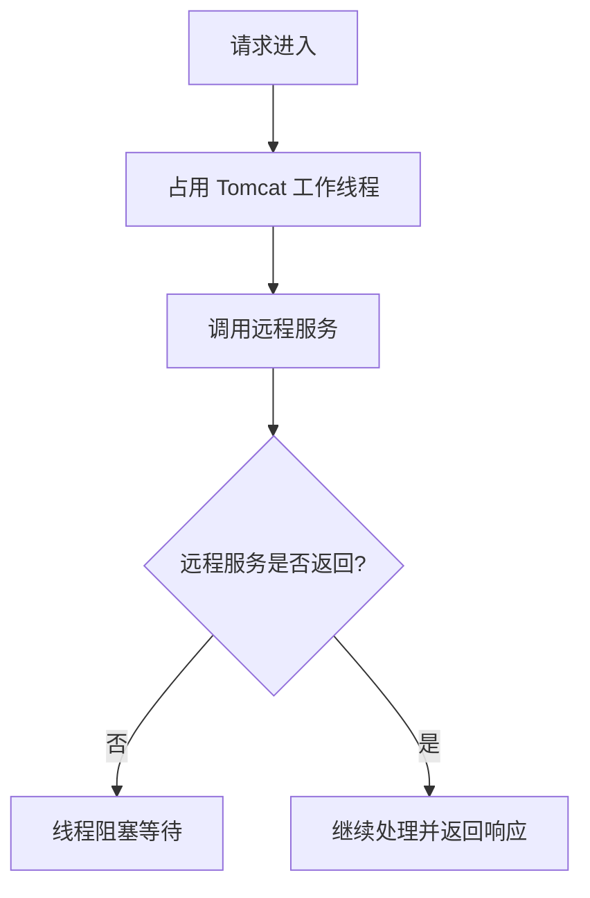
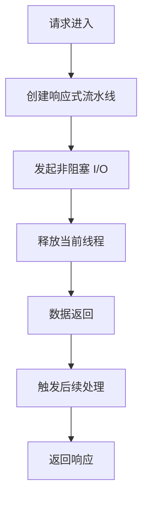
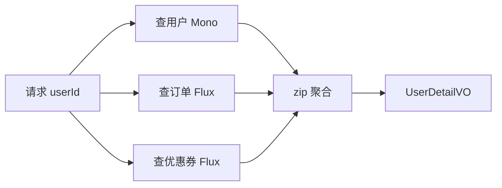
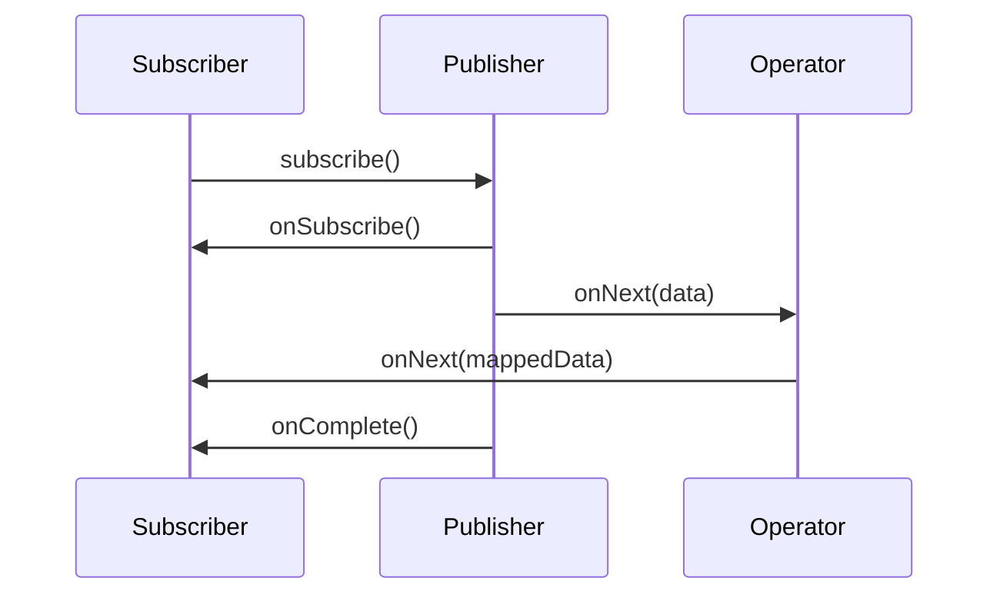
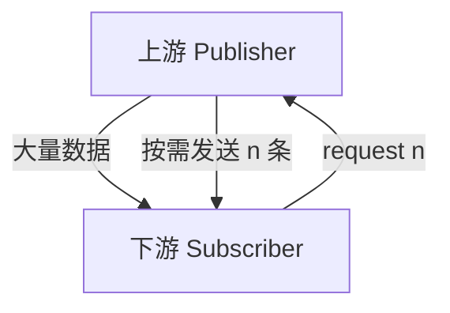

# 1. 响应式编程是什么？

**响应式编程，Reactive Programming**，本质上是一种：

> 面向异步数据流的编程范式。

传统编程通常是：

```java
String result = callRemoteApi();
System.out.println(result);
```

含义是：

> 当前线程等待 `callRemoteApi()` 执行完成，拿到结果后继续往下走。

响应式编程则更像是：

```java
Mono<String> result = callRemoteApi();

result.subscribe(value -> System.out.println(value));
```

含义是：

> 我先声明一条数据处理流水线。等数据将来到了，再触发后续逻辑。

---

# 2. 先用一句话抓住核心

响应式编程解决的核心问题是：

> 在高并发、I/O 密集型场景下，减少线程阻塞，用更少的线程处理更多请求。

典型场景：

|场景|是否适合响应式|
|---|---|
|调用数据库|适合，但需要响应式数据库驱动|
|调用远程 HTTP 服务|很适合|
|文件上传下载|适合|
|消息流处理|很适合|
|CPU 密集计算|不适合优先使用响应式|
|传统 CRUD 小项目|不一定需要|
|高并发网关、聚合接口、AI 流式响应|很适合|

---

# 3. 从传统阻塞模型说起

## 3.1 传统 Spring MVC 模型

Spring MVC 默认是：

```text
一个请求 -> 一个线程 -> 执行业务逻辑 -> 等待 DB / Redis / HTTP -> 返回响应
```

例如：

```java
@GetMapping("/user/{id}")
public UserVO getUser(@PathVariable Long id) {
    User user = userService.getById(id);
    Order order = orderService.getLatestOrder(id);
    return new UserVO(user, order);
}
```

这段代码很好理解，但问题是：

```text
线程大部分时间不是在计算，而是在等待 I/O。
```

例如一次请求：

```text
查用户：20ms
查订单：50ms
组装数据：1ms
```

线程真正工作的时间可能只有 1ms，大部分时间都在等。

---

## 3.2 高并发下的问题

假设 Tomcat 线程池有 200 个线程。

如果 200 个请求都在等待远程服务返回，那么第 201 个请求就可能排队。



问题不是 CPU 不够，而是：

> 线程被 I/O 等待浪费掉了。

---

# 4. 响应式模型如何解决？

响应式模型不会让线程一直等。

它更像这样：

```text
请求进入
  -> 注册回调 / 订阅关系
  -> 线程释放
  -> 数据回来后
  -> 再由事件循环线程继续处理
```



所以响应式编程的关键词是：

```text
异步
非阻塞
数据流
事件驱动
背压
声明式流水线
```

---

# 5. Java 里的响应式技术栈

Java 里常见的响应式技术主要有：

|技术|说明|
|---|---|
|Reactive Streams|JVM 响应式流规范|
|Project Reactor|Spring 官方主推响应式库|
|RxJava|老牌响应式库，Android 和部分服务端项目常见|
|Spring WebFlux|Spring 的响应式 Web 框架|
|WebClient|Spring 的非阻塞 HTTP 客户端|
|R2DBC|响应式关系型数据库访问|
|Reactive Redis|响应式 Redis 客户端|
|Reactor Netty|Spring WebFlux 默认底层网络框架|

对于 Java 后端开发者，优先掌握：

```text
Project Reactor + Spring WebFlux + WebClient
```

---

# 6. Project Reactor 的两个核心类型

Reactor 里最核心的是两个类型：

```java
Mono<T>
Flux<T>
```

## 6.1 Mono

`Mono<T>` 表示：

> 0 或 1 个异步结果。

类似：

```text
Future<T>
Optional<T>
Promise<T>
```

但它比这些更强，因为它支持完整的数据流操作。

示例：

```java
Mono<String> mono = Mono.just("hello");

mono.subscribe(value -> System.out.println(value));
```

输出：

```text
hello
```

常见使用场景：

```java
Mono<User>
Mono<Order>
Mono<ResponseEntity<UserVO>>
Mono<Void>
```

例如：

```java
public Mono<User> getUserById(Long id) {
    return userRepository.findById(id);
}
```

---

## 6.2 Flux

`Flux<T>` 表示：

> 0 到 N 个异步结果。

类似：

```text
List<T>
Stream<T>
消息流
事件流
```

示例：

```java
Flux<String> flux = Flux.just("Java", "Spring", "Reactor");

flux.subscribe(value -> System.out.println(value));
```

输出：

```text
Java
Spring
Reactor
```

常见使用场景：

```java
Flux<User>
Flux<Order>
Flux<ServerSentEvent<String>>
```

例如：

```java
public Flux<Product> listProducts() {
    return productRepository.findAll();
}
```

---

# 7. Mono / Flux 与传统类型的对比

|传统类型|响应式类型|含义|
|---|---|---|
|`User`|`Mono<User>`|将来产生一个 User|
|`List<User>`|`Flux<User>`|将来产生一批 User|
|`void`|`Mono<Void>`|将来完成一个无返回操作|
|`Optional<User>`|`Mono<User>`|可能有，也可能没有|
|`Stream<User>`|`Flux<User>`|数据流，但 Flux 可以异步、非阻塞、背压|

关键点：

> `Mono<User>` 不是 User。  
> `Flux<User>` 也不是 List`。

它们代表的是：

> 尚未执行或尚未完成的数据流描述。

---

# 8. 响应式编程的基本操作

## 8.1 map：同步转换

```java
Mono<String> mono = Mono.just("java")
        .map(String::toUpperCase);

mono.subscribe(System.out::println);
```

输出：

```text
JAVA
```

`map` 适合普通对象转换：

```java
Mono<UserVO> voMono = userMono.map(user -> {
    UserVO vo = new UserVO();
    vo.setId(user.getId());
    vo.setName(user.getName());
    return vo;
});
```

---

## 8.2 flatMap：异步转换

`flatMap` 是响应式编程里非常核心的操作。

如果转换逻辑返回的是 `Mono`，就应该用 `flatMap`。

错误示例：

```java
Mono<Mono<Order>> result = userMono.map(user -> orderService.getOrder(user.getId()));
```

正确示例：

```java
Mono<Order> result = userMono.flatMap(user -> orderService.getOrder(user.getId()));
```

区别：

|方法|适合场景|
|---|---|
|`map`|`T -> R`|
|`flatMap`|`T -> Mono<R>`|
|`flatMapMany`|`Mono<T> -> Flux<R>`|

---

## 8.3 filter：过滤数据

```java
Flux<Integer> flux = Flux.just(1, 2, 3, 4, 5)
        .filter(num -> num % 2 == 0);

flux.subscribe(System.out::println);
```

输出：

```text
2
4
```

---

## 8.4 collectList：Flux 转 Mono

```java
Mono<List<String>> listMono = Flux.just("A", "B", "C")
        .collectList();
```

注意：

```java
Flux<User>
```

表示一个个用户陆续产生。

```java
Mono<List<User>>
```

表示最终一次性得到一个用户列表。

---

## 8.5 zip：并行组合多个异步结果

这是企业项目里非常常见的场景。

例如一个用户详情页需要：

```text
用户基本信息
用户订单信息
用户优惠券信息
```

传统写法：

```java
User user = userService.getUser(userId);
List<Order> orders = orderService.getOrders(userId);
List<Coupon> coupons = couponService.getCoupons(userId);

return new UserDetailVO(user, orders, coupons);
```

响应式写法：

```java
public Mono<UserDetailVO> getUserDetail(Long userId) {
    Mono<User> userMono = userService.getUser(userId);
    Mono<List<Order>> ordersMono = orderService.getOrders(userId).collectList();
    Mono<List<Coupon>> couponsMono = couponService.getCoupons(userId).collectList();

    return Mono.zip(userMono, ordersMono, couponsMono)
            .map(tuple -> {
                User user = tuple.getT1();
                List<Order> orders = tuple.getT2();
                List<Coupon> coupons = tuple.getT3();

                return new UserDetailVO(user, orders, coupons);
            });
}
```

执行模型：



这里的优势是：

> 多个 I/O 可以并发执行，而不是串行等待。

---

# 9. subscribe 是什么？

很多初学者会写：

```java
Mono<String> mono = Mono.just("hello")
        .map(String::toUpperCase);
```

然后发现没有任何输出。

原因是：

> 响应式流默认是懒执行的。没人订阅，就不会执行。

需要：

```java
mono.subscribe(System.out::println);
```

完整生命周期是：

```text
声明数据流
  -> 订阅
  -> 数据产生
  -> 数据转换
  -> 数据消费
```



---

# 10. Reactive Streams 四大角色

Java 响应式的底层规范是 **Reactive Streams**。

核心接口有四个：

|接口|作用|
|---|---|
|`Publisher`|数据发布者|
|`Subscriber`|数据订阅者|
|`Subscription`|订阅关系，可控制请求数量|
|`Processor`|既是订阅者，也是发布者|

简化理解：

```text
Publisher 生产数据
Subscriber 消费数据
Subscription 控制消费节奏
Processor 负责中间转换
```

---

# 11. 背压 Backpressure

背压是响应式编程的核心概念之一。

## 11.1 什么是背压？

背压就是：

> 下游消费不过来时，可以向上游施加压力，控制上游生产速度。

例如：

```text
生产者每秒生产 10000 条消息
消费者每秒只能处理 1000 条消息
```

如果没有背压：

```text
内存堆积
队列爆炸
OOM
服务雪崩
```

有背压后：

```text
消费者告诉生产者：我现在只要 100 条
生产者按需发送
```

---

## 11.2 背压示意图



这也是 Reactive Streams 和普通异步回调的关键区别：

> 响应式流不仅是异步，还支持流量控制。

---

# 12. Java 中如何实际运用？

## 12.1 WebClient 调用远程接口

在现代 Spring 项目里，响应式最常见的入口是 `WebClient`。

它是 Spring 推荐的非阻塞 HTTP 客户端。

### Maven 依赖

```xml
<dependency>
    <groupId>org.springframework.boot</groupId>
    <artifactId>spring-boot-starter-webflux</artifactId>
</dependency>
```

---

### 配置 WebClient

```java
@Configuration
public class WebClientConfig {

    @Bean
    public WebClient userServiceWebClient(WebClient.Builder builder) {
        return builder
                .baseUrl("http://user-service")
                .defaultHeader(HttpHeaders.CONTENT_TYPE, MediaType.APPLICATION_JSON_VALUE)
                .build();
    }
}
```

---

### 调用远程用户服务

```java
@Service
@RequiredArgsConstructor
public class UserClient {

    private final WebClient userServiceWebClient;

    public Mono<UserDTO> getUserById(Long userId) {
        return userServiceWebClient.get()
                .uri("/api/users/{id}", userId)
                .retrieve()
                .bodyToMono(UserDTO.class);
    }
}
```

这里返回的是：

```java
Mono<UserDTO>
```

意思是：

> 将来会得到一个 UserDTO。

---

## 12.2 聚合多个远程接口

假设一个 BFF 接口需要聚合：

```text
用户服务
订单服务
积分服务
```

可以这样写：

```java
@Service
@RequiredArgsConstructor
public class UserProfileService {

    private final UserClient userClient;
    private final OrderClient orderClient;
    private final PointClient pointClient;

    public Mono<UserProfileVO> getUserProfile(Long userId) {
        Mono<UserDTO> userMono = userClient.getUserById(userId);

        Mono<List<OrderDTO>> ordersMono = orderClient.listOrders(userId)
                .collectList();

        Mono<PointDTO> pointMono = pointClient.getPoint(userId);

        return Mono.zip(userMono, ordersMono, pointMono)
                .map(tuple -> {
                    UserDTO user = tuple.getT1();
                    List<OrderDTO> orders = tuple.getT2();
                    PointDTO point = tuple.getT3();

                    return UserProfileVO.builder()
                            .userId(user.getId())
                            .username(user.getUsername())
                            .orders(orders)
                            .point(point.getAvailablePoint())
                            .build();
                });
    }
}
```

Controller：

```java
@RestController
@RequestMapping("/api/profile")
@RequiredArgsConstructor
public class UserProfileController {

    private final UserProfileService userProfileService;

    @GetMapping("/{userId}")
    public Mono<UserProfileVO> getUserProfile(@PathVariable Long userId) {
        return userProfileService.getUserProfile(userId);
    }
}
```

注意：

> 在 WebFlux Controller 中，不需要自己 `subscribe()`。  
> Spring WebFlux 会帮你订阅并把结果写回 HTTP 响应。

---

# 13. WebFlux Controller 示例

## 13.1 返回 Mono

```java
@GetMapping("/users/{id}")
public Mono<UserVO> getUser(@PathVariable Long id) {
    return userService.getUser(id);
}
```

适合返回单个对象。

---

## 13.2 返回 Flux

```java
@GetMapping("/users")
public Flux<UserVO> listUsers() {
    return userService.listUsers();
}
```

适合返回多个对象。

---

## 13.3 Server-Sent Events 流式返回

这在 AI 应用里非常常见，例如大模型流式输出。

```java
@GetMapping(value = "/chat/stream", produces = MediaType.TEXT_EVENT_STREAM_VALUE)
public Flux<String> streamChat(@RequestParam String prompt) {
    return aiService.streamChat(prompt);
}
```

Service：

```java
@Service
public class AiService {

    public Flux<String> streamChat(String prompt) {
        return Flux.just("你好，", "这是", "一个", "流式", "响应")
                .delayElements(Duration.ofMillis(300));
    }
}
```

浏览器会陆续收到：

```text
你好，
这是
一个
流式
响应
```

这类场景非常适合响应式。

---

# 14. 错误处理

## 14.1 onErrorReturn

出错时返回默认值：

```java
public Mono<String> getUsername(Long userId) {
    return userClient.getUserById(userId)
            .map(UserDTO::getUsername)
            .onErrorReturn("anonymous");
}
```

---

## 14.2 onErrorResume

出错时走降级逻辑：

```java
public Mono<UserDTO> getUserWithFallback(Long userId) {
    return userClient.getUserById(userId)
            .onErrorResume(ex -> {
                UserDTO fallback = new UserDTO();
                fallback.setId(userId);
                fallback.setUsername("unknown");
                return Mono.just(fallback);
            });
}
```

---

## 14.3 timeout

给远程调用设置超时：

```java
public Mono<UserDTO> getUserById(Long userId) {
    return userServiceWebClient.get()
            .uri("/api/users/{id}", userId)
            .retrieve()
            .bodyToMono(UserDTO.class)
            .timeout(Duration.ofSeconds(2));
}
```

更完整一些：

```java
public Mono<UserDTO> getUserById(Long userId) {
    return userServiceWebClient.get()
            .uri("/api/users/{id}", userId)
            .retrieve()
            .bodyToMono(UserDTO.class)
            .timeout(Duration.ofSeconds(2))
            .onErrorResume(TimeoutException.class, ex -> {
                UserDTO fallback = new UserDTO();
                fallback.setId(userId);
                fallback.setUsername("timeout-user");
                return Mono.just(fallback);
            });
}
```

---

# 15. 重试机制

远程接口偶发失败时，可以使用 `retryWhen`。

```java
public Mono<UserDTO> getUserById(Long userId) {
    return userServiceWebClient.get()
            .uri("/api/users/{id}", userId)
            .retrieve()
            .bodyToMono(UserDTO.class)
            .timeout(Duration.ofSeconds(2))
            .retryWhen(
                    Retry.backoff(3, Duration.ofMillis(200))
                            .maxBackoff(Duration.ofSeconds(2))
            );
}
```

含义：

```text
最多重试 3 次
第一次间隔 200ms
后续指数退避
最大间隔 2s
```

生产中建议：

```java
.retryWhen(
        Retry.backoff(3, Duration.ofMillis(200))
                .filter(this::isRetryableException)
)
```

```java
private boolean isRetryableException(Throwable throwable) {
    return throwable instanceof TimeoutException
            || throwable instanceof ConnectException;
}
```

不要对所有异常无脑重试。

例如：

|异常|是否适合重试|
|---|---|
|网络超时|适合|
|连接失败|适合|
|500|谨慎|
|400|不适合|
|参数错误|不适合|
|权限错误|不适合|

---

# 16. 线程调度：publishOn 与 subscribeOn

响应式编程并不等于没有线程。

它只是：

> 更精细地控制任务在哪些线程上执行。

Reactor 里常用调度器：

|Scheduler|适合场景|
|---|---|
|`Schedulers.parallel()`|CPU 密集型计算|
|`Schedulers.boundedElastic()`|阻塞 I/O 包装|
|`Schedulers.single()`|单线程顺序执行|
|`Schedulers.immediate()`|当前线程执行|

---

## 16.1 subscribeOn

`subscribeOn` 影响上游订阅和数据生产线程。

```java
Mono.fromCallable(() -> blockingQuery())
        .subscribeOn(Schedulers.boundedElastic());
```

常见用途：

> 把阻塞调用丢到专门的弹性线程池，避免阻塞事件循环线程。

---

## 16.2 publishOn

`publishOn` 影响它之后的操作在哪个线程执行。

```java
Mono.just("hello")
        .map(value -> {
            System.out.println("step1: " + Thread.currentThread().getName());
            return value.toUpperCase();
        })
        .publishOn(Schedulers.parallel())
        .map(value -> {
            System.out.println("step2: " + Thread.currentThread().getName());
            return value;
        });
```

简化理解：

|方法|影响范围|
|---|---|
|`subscribeOn`|影响上游|
|`publishOn`|影响下游|

---

# 17. 响应式中的阻塞问题

这是初学者最容易踩的坑。

## 17.1 错误示例

```java
@GetMapping("/users/{id}")
public Mono<UserVO> getUser(@PathVariable Long id) {
    User user = userMapper.selectById(id); // MyBatis 阻塞调用
    return Mono.just(convert(user));
}
```

这不是真正的响应式。

因为：

```text
Controller 返回 Mono
但内部已经阻塞了线程
```

---

## 17.2 兼容阻塞代码的写法

如果你暂时还在用 MyBatis / JDBC，可以这样包装：

```java
@GetMapping("/users/{id}")
public Mono<UserVO> getUser(@PathVariable Long id) {
    return Mono.fromCallable(() -> {
                User user = userMapper.selectById(id);
                return convert(user);
            })
            .subscribeOn(Schedulers.boundedElastic());
}
```

含义：

```text
阻塞查询放到 boundedElastic 线程池
不要阻塞 Netty 事件循环线程
```

但注意：

> 这只是过渡方案，不是真正的端到端响应式。

真正的响应式链路应该是：

```text
WebFlux
  -> WebClient
  -> Reactive Redis
  -> R2DBC
  -> Reactive MQ
```

---

# 18. Spring MVC + WebClient 是否有价值？

有。

很多项目不需要全量迁移 WebFlux，但可以先使用 `WebClient` 替代 `RestTemplate`。

例如在 Spring MVC 项目中：

```java
@Service
@RequiredArgsConstructor
public class RemoteUserService {

    private final WebClient webClient;

    public UserDTO getUser(Long userId) {
        return webClient.get()
                .uri("http://user-service/api/users/{id}", userId)
                .retrieve()
                .bodyToMono(UserDTO.class)
                .block();
    }
}
```

这里用了 `.block()`，所以最终还是阻塞。

但是 `WebClient` 仍然有价值：

```text
更现代
支持流式响应
支持响应式链路
支持更好的连接池和过滤器机制
可以作为后续迁移 WebFlux 的基础
```

不过要记住：

> 在 WebFlux 响应式链路中，尽量不要使用 `.block()`。

---

# 19. `.block()` 为什么危险？

在响应式代码中写：

```java
User user = userMono.block();
```

本质是：

> 强行把异步非阻塞流程变回同步阻塞流程。

尤其在 WebFlux 的事件循环线程中调用 `.block()`，可能导致：

```text
线程阻塞
吞吐下降
死锁风险
响应延迟升高
```

错误示例：

```java
@GetMapping("/users/{id}")
public Mono<UserVO> getUser(@PathVariable Long id) {
    UserDTO user = userClient.getUserById(id).block(); // 不推荐
    return Mono.just(convert(user));
}
```

正确示例：

```java
@GetMapping("/users/{id}")
public Mono<UserVO> getUser(@PathVariable Long id) {
    return userClient.getUserById(id)
            .map(this::convert);
}
```

---

# 20. 响应式和 Java 21 虚拟线程的关系

你最近在学 Java 21，这里要重点区分。

## 20.1 响应式编程

特点：

```text
非阻塞
事件驱动
链式 API
背压
学习成本高
代码风格变化大
```

---

## 20.2 虚拟线程

特点：

```text
仍然是同步阻塞代码风格
但线程极其轻量
适合 I/O 密集型并发
学习成本低
兼容传统 Spring MVC / JDBC / MyBatis
```

示例：

```java
@GetMapping("/users/{id}")
public UserVO getUser(@PathVariable Long id) {
    User user = userMapper.selectById(id);
    List<Order> orders = orderService.listByUserId(id);
    return new UserVO(user, orders);
}
```

在虚拟线程下，这种代码仍然可以有较好的并发能力。

---

## 20.3 怎么选？

|场景|建议|
|---|---|
|传统企业 CRUD|Spring MVC + 虚拟线程|
|已有 MyBatis / JDBC 项目|优先考虑虚拟线程|
|高并发网关|WebFlux / Reactor|
|BFF 聚合多个远程服务|WebFlux 很适合|
|AI 流式响应|WebFlux / Reactor 很适合|
|SSE / WebSocket / 长连接|WebFlux 很适合|
|端到端响应式数据库访问|WebFlux + R2DBC|
|团队响应式经验不足|谨慎全量 WebFlux|

一句话：

> 虚拟线程降低了响应式在普通业务系统里的必要性，但没有取代响应式在流式、高并发、背压、事件驱动场景中的价值。

---

# 21. 企业项目里的典型用法

## 21.1 网关层

例如 Spring Cloud Gateway 本身就是基于 WebFlux / Reactor 的。

典型场景：

```text
请求路由
鉴权
限流
灰度
熔断
日志
Header 改写
响应改写
```

因为网关主要是 I/O 转发，不应该为每个请求占用阻塞线程。

---

## 21.2 BFF 聚合层

例如：

```text
移动端首页接口
用户中心接口
商品详情接口
订单详情接口
```

一个接口需要调用多个下游服务。

响应式很适合并发聚合。

```java
public Mono<HomePageVO> getHomePage(Long userId) {
    Mono<UserDTO> userMono = userClient.getUser(userId);
    Mono<List<ProductDTO>> recommendMono = productClient.recommend(userId).collectList();
    Mono<List<CouponDTO>> couponMono = couponClient.listCoupons(userId).collectList();

    return Mono.zip(userMono, recommendMono, couponMono)
            .map(tuple -> HomePageVO.builder()
                    .user(tuple.getT1())
                    .products(tuple.getT2())
                    .coupons(tuple.getT3())
                    .build());
}
```

---

## 21.3 AI 流式输出

Spring AI、LLM API、SSE、WebSocket 这类场景天然适合响应式。

```java
@GetMapping(value = "/ai/chat", produces = MediaType.TEXT_EVENT_STREAM_VALUE)
public Flux<String> chat(@RequestParam String prompt) {
    return chatClient.stream(prompt);
}
```

这比一次性等待完整回答更适合用户体验。

---

# 22. 进阶：冷流与热流

## 22.1 冷流 Cold Publisher

默认大部分 `Mono` / `Flux` 是冷流。

意思是：

> 每次订阅，都会重新执行一次数据生产逻辑。

```java
Flux<Integer> flux = Flux.range(1, 3)
        .doOnSubscribe(s -> System.out.println("开始订阅"));

flux.subscribe(System.out::println);
flux.subscribe(System.out::println);
```

输出：

```text
开始订阅
1
2
3
开始订阅
1
2
3
```

---

## 22.2 热流 Hot Publisher

热流类似直播：

> 数据一直在产生，订阅者只能收到订阅之后的数据。

例如：

```text
消息广播
股票行情
日志流
传感器数据
聊天室消息
```

Reactor 中可以用 `Sinks` 创建热流。

```java
Sinks.Many<String> sink = Sinks.many()
        .multicast()
        .onBackpressureBuffer();

Flux<String> flux = sink.asFlux();

flux.subscribe(msg -> System.out.println("消费者1: " + msg));
flux.subscribe(msg -> System.out.println("消费者2: " + msg));

sink.tryEmitNext("hello");
sink.tryEmitNext("reactor");
```

---

# 23. 进阶：Sinks 的作用

`Sinks` 可以理解为：

> 手动向响应式流里推送数据的入口。

典型场景：

```text
WebSocket 消息推送
聊天室
事件广播
任务进度通知
AI 流式中转
```

示例：任务进度推送。

```java
@Service
public class TaskProgressService {

    private final Sinks.Many<String> progressSink = Sinks.many()
            .multicast()
            .onBackpressureBuffer();

    public Flux<String> subscribeProgress() {
        return progressSink.asFlux();
    }

    public void publishProgress(String message) {
        progressSink.tryEmitNext(message);
    }
}
```

Controller：

```java
@RestController
@RequestMapping("/tasks")
@RequiredArgsConstructor
public class TaskController {

    private final TaskProgressService taskProgressService;

    @GetMapping(value = "/progress", produces = MediaType.TEXT_EVENT_STREAM_VALUE)
    public Flux<String> progress() {
        return taskProgressService.subscribeProgress();
    }

    @PostMapping("/run")
    public Mono<Void> runTask() {
        return Mono.fromRunnable(() -> {
                    taskProgressService.publishProgress("任务开始");
                    taskProgressService.publishProgress("正在处理数据");
                    taskProgressService.publishProgress("任务完成");
                })
                .then();
    }
}
```

---

# 24. 进阶：Context 上下文传递

传统代码里，经常用 `ThreadLocal` 保存：

```text
用户ID
traceId
tenantId
requestId
```

但响应式编程中，线程可能不断切换，`ThreadLocal` 不可靠。

Reactor 提供了 `Context`。

```java
Mono<String> mono = Mono.deferContextual(contextView -> {
    String traceId = contextView.get("traceId");
    return Mono.just("traceId = " + traceId);
}).contextWrite(context -> context.put("traceId", "abc-123"));
```

输出：

```text
traceId = abc-123
```

在响应式系统里：

> 不要默认依赖 ThreadLocal，要理解 Reactor Context。

---

# 25. 测试响应式代码

Reactor 提供 `StepVerifier`。

```java
@Test
void testMono() {
    Mono<String> mono = Mono.just("java")
            .map(String::toUpperCase);

    StepVerifier.create(mono)
            .expectNext("JAVA")
            .verifyComplete();
}
```

测试 Flux：

```java
@Test
void testFlux() {
    Flux<Integer> flux = Flux.just(1, 2, 3)
            .map(num -> num * 2);

    StepVerifier.create(flux)
            .expectNext(2)
            .expectNext(4)
            .expectNext(6)
            .verifyComplete();
}
```

测试异常：

```java
@Test
void testError() {
    Mono<String> mono = Mono.error(new RuntimeException("failed"));

    StepVerifier.create(mono)
            .expectError(RuntimeException.class)
            .verify();
}
```

---

# 26. 响应式编程的常见坑

## 坑 1：在 WebFlux 里调用阻塞代码

错误：

```java
userMapper.selectById(id);
```

修正：

```java
Mono.fromCallable(() -> userMapper.selectById(id))
        .subscribeOn(Schedulers.boundedElastic());
```

---

## 坑 2：乱用 block

错误：

```java
User user = userMono.block();
```

修正：

```java
userMono.map(this::convert);
```

---

## 坑 3：map 和 flatMap 分不清

口诀：

```text
返回普通对象，用 map
返回 Mono / Flux，用 flatMap
```

---

## 坑 4：以为写了 Mono 就是非阻塞

错误：

```java
Mono.just(userMapper.selectById(id));
```

这行代码在创建 `Mono` 之前就已经执行了查询。

修正：

```java
Mono.fromCallable(() -> userMapper.selectById(id))
        .subscribeOn(Schedulers.boundedElastic());
```

---

## 坑 5：在 subscribe 里写核心业务逻辑

不推荐：

```java
userService.getUser(id).subscribe(user -> {
    orderService.createOrder(user);
});
```

推荐：

```java
userService.getUser(id)
        .flatMap(user -> orderService.createOrder(user));
```

在 Spring WebFlux 业务代码里，通常应该返回 `Mono` / `Flux`，而不是手动 `subscribe()`。

---

# 27. 响应式编程适合你的学习路线

你是 Java 后端方向，建议这样学：

## 第一阶段：Reactor 基础

重点掌握：

```text
Mono
Flux
map
flatMap
filter
zip
collectList
onErrorResume
timeout
retryWhen
subscribe
```

练习目标：

> 能读懂响应式链式代码。

---

## 第二阶段：WebClient

重点掌握：

```text
GET / POST 请求
bodyToMono
bodyToFlux
错误处理
超时
重试
filter 拦截器
连接池配置
```

这阶段对实际工作帮助很大。

---

## 第三阶段：Spring WebFlux

重点掌握：

```text
返回 Mono
返回 Flux
SSE 流式响应
全局异常处理
参数校验
WebFlux Filter
```

---

## 第四阶段：响应式数据访问

了解即可，不一定马上重度使用：

```text
R2DBC
Reactive Redis
Reactive MongoDB
```

原因：

> 很多 Java 企业项目仍然是 MyBatis / JDBC / JPA，端到端响应式改造成本较高。

---

## 第五阶段：进阶原理

重点掌握：

```text
Reactive Streams 规范
背压
调度器
冷流 / 热流
Sinks
Reactor Context
事件循环模型
Netty
```

---

# 28. 推荐你先写的练习 Demo

建议你不要一上来就写完整 WebFlux 项目。

可以先写一个小型练习：

```text
reactor-demo
├── MonoDemo
├── FluxDemo
├── MapFlatMapDemo
├── ZipDemo
├── ErrorHandlingDemo
├── RetryTimeoutDemo
├── SchedulerDemo
└── StepVerifierTest
```

然后再写一个：

```text
webflux-user-profile-demo
```

功能：

```text
GET /profile/{userId}

并发调用：
- user-service
- order-service
- point-service

最终返回用户画像。
```

这样能真正理解响应式的价值。

---

# 29. 面试加分项

面试时可以这样表达：

## 29.1 响应式编程的本质

> 响应式编程是一种面向异步数据流的编程模型。在 Java 生态中，Reactive Streams 提供了标准规范，Project Reactor 是 Spring 体系的主流实现。它通过非阻塞 I/O、事件驱动和背压机制，让系统在高并发 I/O 场景下用更少线程处理更多请求。

---

## 29.2 Mono 和 Flux 的区别

> Mono 表示 0 到 1 个元素的异步序列，Flux 表示 0 到 N 个元素的异步序列。业务上，查询单个对象通常返回 Mono，查询列表或流式数据通常返回 Flux。

---

## 29.3 map 和 flatMap 的区别

> map 用于同步转换，函数签名是 `T -> R`；flatMap 用于异步转换，函数签名通常是 `T -> Mono<R>` 或 `T -> Flux<R>`，它会把嵌套的响应式类型展开。

---

## 29.4 WebFlux 和 Spring MVC 的区别

> Spring MVC 基于 Servlet 阻塞模型，通常一个请求占用一个工作线程。WebFlux 基于非阻塞事件循环模型，请求发起 I/O 后不会一直占用工作线程，更适合高并发 I/O、网关、流式响应、BFF 聚合等场景。

---

## 29.5 响应式和虚拟线程怎么选？

> 虚拟线程保留同步阻塞编程模型，降低高并发 I/O 的线程成本，适合传统 MVC、JDBC、MyBatis 项目。响应式编程提供非阻塞、背压、流式处理能力，适合网关、WebFlux、SSE、WebSocket、AI 流式响应等场景。两者不是简单替代关系，而是适用于不同系统边界。

---

# 30. 总结

响应式编程可以浓缩成这几句话：

```text
1. 它是面向异步数据流的编程范式。
2. Java 里主流实现是 Project Reactor。
3. Reactor 的核心类型是 Mono 和 Flux。
4. Spring WebFlux 是基于 Reactor 的响应式 Web 框架。
5. 响应式适合高并发 I/O、网关、接口聚合、流式响应。
6. 普通 CRUD 项目不一定要全量响应式。
7. Java 21 虚拟线程削弱了普通业务系统使用响应式的必要性。
8. 但响应式在背压、流处理、事件驱动、AI 流式输出中仍然很有价值。
```

---

# 31. Keywords

```text
Reactive Programming
Reactive Streams
Project Reactor
Mono
Flux
Publisher
Subscriber
Subscription
Backpressure
Spring WebFlux
WebClient
R2DBC
Reactive Redis
Sinks
Scheduler
publishOn
subscribeOn
Event Loop
Netty
SSE
Virtual Threads
```

下一步最适合继续学：

> **Project Reactor 核心 API：Mono / Flux / map / flatMap / zip / error handling / scheduler。**