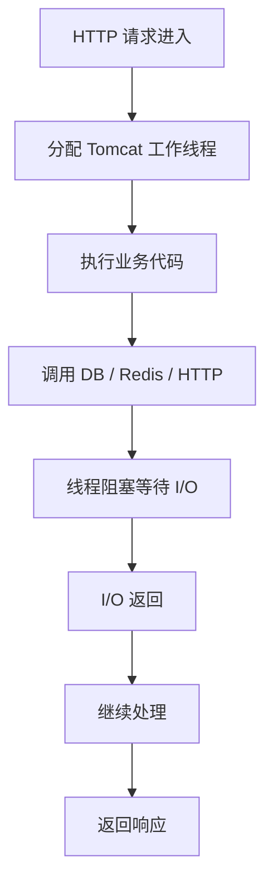
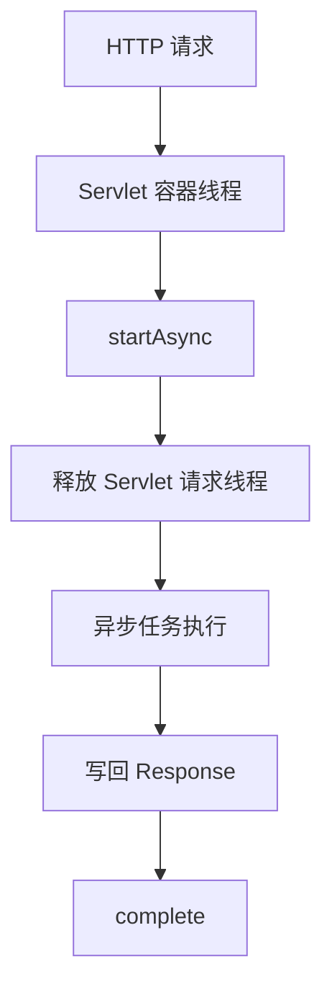
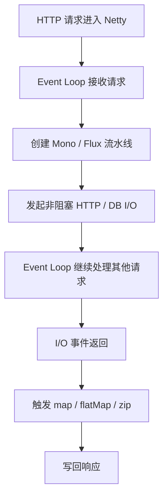
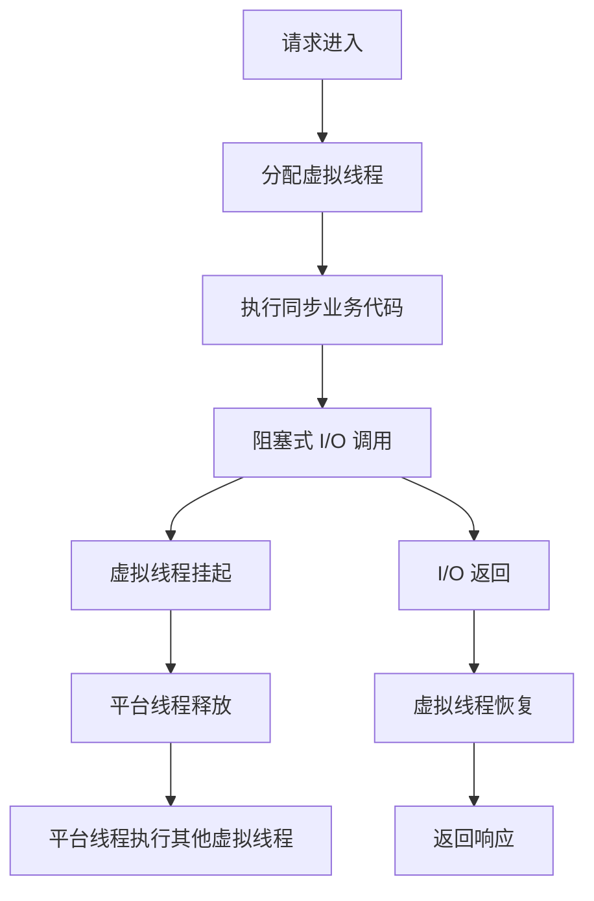
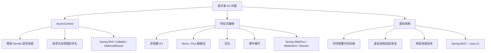

这是同一类问题的三条技术路线：

> **高并发 I/O 场景下，如何避免“平台线程被白白占着等 I/O”？**

但它们的抽象层级不同。
[[响应式编程基础指南]]
[[虚拟线程学习指南]]
[[AsyncContext详解]]

---

# 1. 先给结论

| 技术               | 核心目标           | 编程模型                 | 线程是否被阻塞                | 主要适用层       |
| ---------------- | -------------- | -------------------- | ---------------------- | ----------- |
| **AsyncContext** | Servlet 请求异步化  | 回调 / 异步 Servlet      | 容器请求线程释放，但后续逻辑仍可能用其他线程 | Servlet 容器层 |
| **响应式编程**        | 端到端非阻塞数据流      | `Mono` / `Flux` 链式组合 | 理想情况下全链路非阻塞            | 应用架构 / 框架层  |
| **Java 21 虚拟线程** | 用同步代码承载高并发 I/O | 普通阻塞写法               | 虚拟线程阻塞，平台线程不长期阻塞       | JVM 线程模型层   |

一句话区分：

```text
AsyncContext：释放 Servlet 请求线程。
响应式编程：把业务建模成非阻塞异步数据流。
虚拟线程：让阻塞代码变得足够便宜。
```

---

# 2. 它们面对的是同一个矛盾

传统模型是：



核心问题：

> 请求线程在等待 I/O 时，没有干活，但仍然占着宝贵的平台线程。

这在低并发下没问题。

高并发时就会出现：

```text
线程池打满
请求排队
上下文切换增加
内存占用上升
吞吐下降
延迟变高
```

AsyncContext、响应式编程、虚拟线程，都是围绕这个问题展开的。

---

# 3. AsyncContext：Servlet 时代的“请求线程解耦”

## 3.1 它解决什么？

`AsyncContext` 是 Servlet 3.0 引入的异步请求处理机制。

它的核心不是让业务天然非阻塞，而是：

> 让 HTTP 请求的生命周期不再绑定当前 Servlet 容器线程。

传统 Servlet：

```text
请求进来
  -> Tomcat 线程处理
  -> Tomcat 线程一直等到响应写完
  -> Tomcat 线程释放
```

AsyncContext：

```text
请求进来
  -> Tomcat 线程开启 async
  -> Tomcat 线程返回线程池
  -> 业务结果将来完成
  -> 再写回响应
```

---

## 3.2 示例代码

```java
@WebServlet(value = "/async-order", asyncSupported = true)
public class AsyncOrderServlet extends HttpServlet {

    private final ExecutorService executor = Executors.newFixedThreadPool(100);

    @Override
    protected void doGet(HttpServletRequest request, HttpServletResponse response) {
        AsyncContext asyncContext = request.startAsync();

        executor.submit(() -> {
            try {
                // 模拟远程 I/O
                Thread.sleep(1000);

                response.setContentType("application/json;charset=UTF-8");
                response.getWriter().write("{\"status\":\"ok\"}");
            } catch (Exception e) {
                response.setStatus(500);
            } finally {
                asyncContext.complete();
            }
        });
    }
}
```

这段代码的本质是：

```text
Tomcat 请求线程没有等 Thread.sleep(1000)
但 executor 里的线程仍然在阻塞等待
```

所以 AsyncContext 只是释放了**容器请求线程**。

它没有自动让你的数据库、HTTP 调用、业务逻辑变成非阻塞。

---

## 3.3 AsyncContext 的位置



它是比较底层的机制。

Spring MVC 里的这些能力都和它相关：

```text
Callable
DeferredResult
WebAsyncTask
SseEmitter
StreamingResponseBody
```

例如：

```java
@GetMapping("/async")
public Callable<String> async() {
    return () -> {
        Thread.sleep(1000);
        return "ok";
    };
}
```

Spring MVC 底层可以通过 Servlet 异步机制释放请求线程。

---

# 4. 响应式编程：端到端非阻塞数据流

响应式编程更进一步。

它不只是释放请求线程，而是希望：

> 从 HTTP 接入、业务编排、远程调用、数据库访问、响应输出，尽可能全部非阻塞。

典型技术栈：

```text
Spring WebFlux
Reactor
Netty
WebClient
Reactive Redis
R2DBC
Reactive MongoDB
```

---

## 4.1 响应式代码长什么样？

```java
@GetMapping("/profile/{userId}")
public Mono<UserProfileVO> getProfile(@PathVariable Long userId) {
    Mono<UserDTO> userMono = userClient.getUser(userId);
    Mono<List<OrderDTO>> ordersMono = orderClient.listOrders(userId).collectList();
    Mono<PointDTO> pointMono = pointClient.getPoint(userId);

    return Mono.zip(userMono, ordersMono, pointMono)
            .map(tuple -> new UserProfileVO(
                    tuple.getT1(),
                    tuple.getT2(),
                    tuple.getT3()
            ));
}
```

这里的核心不是“开很多线程”，而是：

```text
声明异步数据流
I/O 不阻塞事件循环线程
数据回来后触发后续操作
```

---

## 4.2 响应式模型示意



这里线程没有“睡觉等结果”。

线程做的是：

```text
注册 I/O 事件
处理 I/O 事件
执行短小回调
继续处理其他事件
```

---

## 4.3 响应式比 AsyncContext 强在哪里？

AsyncContext 主要解决：

```text
不要占着 Servlet 请求线程
```

响应式解决的是：

```text
整个数据链路都不要阻塞线程
```

对比：

|维度|AsyncContext|响应式编程|
|---|---|---|
|抽象层级|Servlet API 层|应用编程模型 / 框架层|
|主要目的|请求生命周期异步化|端到端非阻塞数据流|
|是否内置背压|否|是，Reactive Streams|
|编程方式|回调、异步结果|`Mono` / `Flux`|
|典型框架|Servlet MVC|WebFlux|
|数据流组合能力|弱|强|
|学习成本|中|高|

---

# 5. Java 21 虚拟线程：让阻塞变便宜

虚拟线程走的是另一条路线。

它不强迫你把代码改成 `Mono` / `Flux`。

它的目标是：

> 保留同步阻塞代码风格，但让每个请求占用的线程成本大幅下降。

传统平台线程：

```text
一个请求 -> 一个 OS 线程 / 平台线程
```

虚拟线程：

```text
一个请求 -> 一个虚拟线程
大量虚拟线程 -> 少量平台线程承载
```

---

## 5.1 虚拟线程代码仍然很普通

```java
@GetMapping("/profile/{userId}")
public UserProfileVO getProfile(@PathVariable Long userId) {
    UserDTO user = userClient.getUser(userId);
    List<OrderDTO> orders = orderClient.listOrders(userId);
    PointDTO point = pointClient.getPoint(userId);

    return new UserProfileVO(user, orders, point);
}
```

这就是普通同步代码。

在 Java 21 + Spring Boot 支持下，可以让每个请求运行在虚拟线程上。

配置示例：

```properties
spring.threads.virtual.enabled=true
```

然后请求处理可以使用虚拟线程。

---

## 5.2 虚拟线程为什么有效？

传统阻塞：

```text
平台线程调用阻塞 I/O
平台线程卡住
不能干别的事
```

虚拟线程阻塞：

```text
虚拟线程调用阻塞 I/O
虚拟线程被挂起
底层平台线程释放出来去运行其他虚拟线程
I/O 返回后虚拟线程恢复执行
```

示意：



所以虚拟线程不是让 I/O 变成非阻塞。

而是：

> 让“阻塞等待”不再长期占用昂贵的平台线程。

---

# 6. 三者的本质区别

## 6.1 AsyncContext：请求生命周期层面的异步

```text
关注点：HTTP 请求别绑死 Servlet 线程。
```

它回答的是：

> 请求还没处理完，Servlet 线程能不能先还给线程池？

答案：可以。

---

## 6.2 响应式编程：数据流层面的非阻塞

```text
关注点：整个业务链路用异步非阻塞流组织起来。
```

它回答的是：

> 能不能从入口到出口都不阻塞线程，并且支持流量控制？

答案：可以，但需要响应式技术栈配合。

---

## 6.3 虚拟线程：线程模型层面的降本

```text
关注点：阻塞代码能不能继续写，但线程成本大幅降低？
```

它回答的是：

> 我能不能继续写同步阻塞代码，还支撑大量并发？

答案：可以，尤其适合 I/O 密集型业务。

---

# 7. 用一个电商详情页例子对比

场景：

```text
GET /product-detail/{productId}

需要调用：
1. 商品服务
2. 库存服务
3. 价格服务
4. 推荐服务
```

---

## 7.1 传统 Spring MVC

```java
@GetMapping("/product-detail/{productId}")
public ProductDetailVO detail(@PathVariable Long productId) {
    Product product = productClient.getProduct(productId);
    Stock stock = stockClient.getStock(productId);
    Price price = priceClient.getPrice(productId);
    List<Product> recommends = recommendClient.getRecommend(productId);

    return new ProductDetailVO(product, stock, price, recommends);
}
```

问题：

```text
调用串行执行
请求线程全程占用
总耗时约等于所有远程调用耗时之和
```

---

## 7.2 Spring MVC + AsyncContext / Callable

```java
@GetMapping("/product-detail/{productId}")
public Callable<ProductDetailVO> detail(@PathVariable Long productId) {
    return () -> {
        Product product = productClient.getProduct(productId);
        Stock stock = stockClient.getStock(productId);
        Price price = priceClient.getPrice(productId);
        List<Product> recommends = recommendClient.getRecommend(productId);

        return new ProductDetailVO(product, stock, price, recommends);
    };
}
```

改善点：

```text
Servlet 请求线程可以释放
业务在线程池中执行
```

但问题仍然存在：

```text
业务线程仍然阻塞
如果线程池满了，仍然会排队
```

---

## 7.3 Java 21 虚拟线程

```java
@GetMapping("/product-detail/{productId}")
public ProductDetailVO detail(@PathVariable Long productId) {
    Product product = productClient.getProduct(productId);
    Stock stock = stockClient.getStock(productId);
    Price price = priceClient.getPrice(productId);
    List<Product> recommends = recommendClient.getRecommend(productId);

    return new ProductDetailVO(product, stock, price, recommends);
}
```

代码几乎不变。

但执行载体变成虚拟线程后：

```text
阻塞等待远程调用时，虚拟线程挂起
平台线程可以执行其他请求
```

问题：

```text
如果还是串行调用，总耗时没有降低
只是并发承载能力提高了
```

可以结合结构化并发并行调用：

```java
public ProductDetailVO detail(Long productId) throws Exception {
    try (var scope = new StructuredTaskScope.ShutdownOnFailure()) {
        Subtask<Product> productTask = scope.fork(() -> productClient.getProduct(productId));
        Subtask<Stock> stockTask = scope.fork(() -> stockClient.getStock(productId));
        Subtask<Price> priceTask = scope.fork(() -> priceClient.getPrice(productId));
        Subtask<List<Product>> recommendTask = scope.fork(() -> recommendClient.getRecommend(productId));

        scope.join();
        scope.throwIfFailed();

        return new ProductDetailVO(
                productTask.get(),
                stockTask.get(),
                priceTask.get(),
                recommendTask.get()
        );
    }
}
```

这时：

```text
代码仍是同步风格
但多个 I/O 可以并发执行
```

---

## 7.4 响应式 WebFlux

```java
@GetMapping("/product-detail/{productId}")
public Mono<ProductDetailVO> detail(@PathVariable Long productId) {
    Mono<Product> productMono = productClient.getProduct(productId);
    Mono<Stock> stockMono = stockClient.getStock(productId);
    Mono<Price> priceMono = priceClient.getPrice(productId);
    Mono<List<Product>> recommendMono = recommendClient.getRecommend(productId).collectList();

    return Mono.zip(productMono, stockMono, priceMono, recommendMono)
            .map(tuple -> new ProductDetailVO(
                    tuple.getT1(),
                    tuple.getT2(),
                    tuple.getT3(),
                    tuple.getT4()
            ));
}
```

特点：

```text
多个远程 I/O 并发发起
线程不阻塞等待
数据回来后组合结果
适合网关 / BFF / 流式场景
```

---

# 8. 三者之间的关系图



---

# 9. 一个关键问题：它们到底谁更“先进”？

不能简单说谁先进。

应该按抽象目标判断。

## 9.1 AsyncContext 是底层能力

它更像 Servlet 体系里的基础设施。

你平时不一定直接写它，但 Spring MVC 的异步返回能力会用到它。

适合：

```text
老 Servlet 项目
异步长轮询
SSE
请求挂起等待外部事件
```

但新项目通常不会直接围绕 `AsyncContext` 设计架构。

---

## 9.2 响应式是架构范式

响应式适合：

```text
高并发网关
接口聚合层
SSE / WebSocket
AI token stream
事件流处理
需要背压的流式系统
```

缺点也明显：

```text
学习成本高
调试成本高
调用链复杂
团队容易乱用 block
和传统 JDBC / MyBatis 不天然匹配
```

---

## 9.3 虚拟线程是 JVM 层面的范式修正

虚拟线程最大的价值是：

> 让 Java 回到简单的同步代码，同时保留很高的 I/O 并发能力。

适合：

```text
传统 Spring MVC
MyBatis / JDBC / JPA
大多数企业 CRUD 系统
I/O 密集型同步业务
结构化并发
```

缺点：

```text
不等于非阻塞 I/O
没有天然背压语义
对 CPU 密集型任务无特殊收益
遇到 synchronized / native / 某些阻塞点可能 pin 住平台线程
```

---

# 10. 如何选择？

## 10.1 普通 Java 后端业务系统

例如：

```text
Spring Boot
MyBatis-Plus
MySQL
Redis
OpenFeign
业务 CRUD
管理后台
订单系统
权限系统
```

优先：

```text
Spring MVC + Java 21 虚拟线程
```

理由：

```text
代码简单
团队容易维护
兼容现有生态
收益明显
迁移成本低
```

---

## 10.2 网关层

例如：

```text
Spring Cloud Gateway
鉴权
限流
路由
灰度
熔断
协议转换
```

优先：

```text
响应式编程 / WebFlux / Reactor
```

理由：

```text
网关主要是 I/O 转发
高并发连接多
响应式事件循环模型非常匹配
Spring Cloud Gateway 本身就是 WebFlux 栈
```

---

## 10.3 BFF 聚合层

例如：

```text
首页接口
商品详情页
用户画像
订单详情页
多服务聚合
```

两种都可以。

如果团队熟 Reactor：

```text
WebFlux + WebClient + Mono.zip
```

如果团队主要是传统 Java：

```text
Spring MVC + 虚拟线程 + Structured Concurrency
```

我更建议你现阶段重点掌握后者，因为你正在学 Java 21。

---

## 10.4 AI 流式响应

例如：

```text
LLM token stream
SSE
WebSocket
任务进度推送
Agent 执行过程输出
```

优先：

```text
WebFlux / Reactor / Flux
```

理由：

```text
Flux 天然适合表示 0 到 N 个持续产生的数据片段
SSE 和响应式流非常匹配
```

当然，Spring MVC 也能用 `SseEmitter` 做，但响应式表达更自然。

---

# 11. 最重要的本质区别：阻塞在哪里？

可以用这张表记住。

|模型|请求线程|业务等待 I/O 时|代码风格|
|---|---|---|---|
|传统 MVC|被占用|平台线程阻塞|同步|
|AsyncContext|可释放|其他业务线程可能阻塞|回调 / Future|
|WebFlux|事件循环线程不阻塞|非阻塞 I/O 等事件|响应式链|
|虚拟线程|每请求一个虚拟线程|虚拟线程阻塞，平台线程释放|同步|

一句话：

```text
AsyncContext 是“别占 Servlet 请求线程”。
WebFlux 是“尽量别阻塞任何线程”。
虚拟线程是“阻塞可以，但别占昂贵的平台线程”。
```

---

# 12. 和你的技术路线怎么结合？

你现在的学习路线是 Java 后端 + Spring AI + 微服务 + Java 21。

建议这样理解优先级：

## 第一优先级：虚拟线程

因为它和你现有技术栈最匹配：

```text
Spring Boot
Spring MVC
MyBatis-Plus
OpenFeign
JDBC
Redis
普通企业项目
```

你应该掌握：

```text
虚拟线程适用场景
虚拟线程与连接池关系
虚拟线程与 synchronized pinning
虚拟线程与 ThreadLocal
虚拟线程与结构化并发
```

---

## 第二优先级：WebClient + Reactor 基础

即使你不全量用 WebFlux，也应该懂：

```text
Mono
Flux
map
flatMap
zip
timeout
retry
onErrorResume
```

因为这些在以下地方会出现：

```text
Spring Cloud Gateway
Spring AI 流式响应
WebClient
Reactive Redis
R2DBC
部分中间件客户端
```

---

## 第三优先级：AsyncContext 理解即可

不建议你重度投入原生 `AsyncContext`。

你需要知道：

```text
它是 Servlet 异步请求的底层机制
Spring MVC 的 Callable / DeferredResult / SseEmitter 与它有关
它解决的是请求线程和请求生命周期解耦
```

日常开发中更常用 Spring 封装。

---

# 13. 最后给你一个判断口诀

## 13.1 是否需要端到端流式 / 背压？

需要：

```text
响应式编程
```

不需要：

```text
继续判断
```

---

## 13.2 是否是传统阻塞生态？

例如 JDBC、MyBatis、OpenFeign、老 SDK。

是：

```text
虚拟线程优先
```

---

## 13.3 是否只是想释放 Servlet 请求线程？

例如异步等待任务结果、长轮询、老项目改造。

是：

```text
AsyncContext / DeferredResult / Callable / SseEmitter
```

---

## 13.4 是否是网关？

是：

```text
WebFlux / Reactor
```

---

# 14. 总结成一句完整的话

> **AsyncContext、响应式编程、虚拟线程都在解决高并发 I/O 下线程资源浪费的问题。AsyncContext 从 Servlet 请求生命周期入手，让请求不再绑定容器线程；响应式编程从应用模型入手，把业务建模为非阻塞数据流，并支持背压；虚拟线程从 JVM 线程模型入手，让同步阻塞代码也能低成本承载大量并发。**

对你现在的学习重点，我建议排序是：

```text
Java 21 虚拟线程 / 结构化并发
    >
Reactor / WebClient / WebFlux 基础
    >
AsyncContext / Servlet 异步机制
```

这三者不是互斥关系，而是不同层级的并发 I/O 解法。