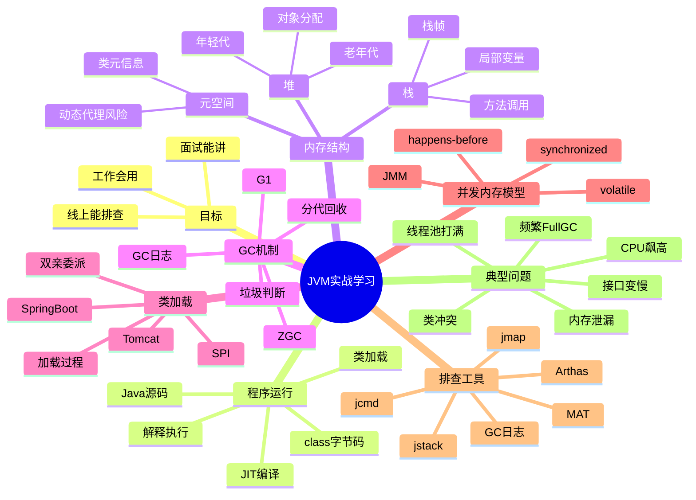

## 0. 先给结论

对 Java 后端工程师来说，JVM 学习不应该一上来就钻进虚拟机规范、字节码指令、HotSpot 源码。

更合理的学习目标是：

> **知道 Java 程序是怎么跑起来的；知道内存、线程、GC、类加载出了问题怎么判断；知道面试时如何用工程语言讲清楚 JVM。**

所以 JVM 的学习重点不是“背概念”，而是建立这条主线：

```text
Java 代码
  ↓
编译成 class 字节码
  ↓
类加载器加载到 JVM
  ↓
JVM 分配内存、创建对象、执行方法
  ↓
线程运行、对象不断产生
  ↓
GC 回收无用对象
  ↓
如果出问题，用日志、命令、Arthas、jmap、jstack、MAT 等工具排查
```

你最终需要达到的能力是：

|能力|具体表现|
|---|---|
|面试能讲|能解释 JVM 内存结构、GC、类加载、JMM、调优思路|
|工作会用|会配置基础 JVM 参数，会看 GC 日志，会用 Arthas 排查问题|
|线上能定位|CPU 飙高、Full GC、OOM、线程阻塞、类冲突时知道从哪里下手|
|不过度内卷|知道哪些是必须掌握，哪些只需要了解|

---

# 1. JVM 学习总览图



这张图要记住的不是每个词，而是它背后的学习顺序：

> **先知道 JVM 怎么运行 Java 程序，再学内存和 GC，然后学类加载和并发内存模型，最后用工具解决真实问题。**

---

# 2. JVM 到底是什么？

## 2.1 结论

JVM，全称 Java Virtual Machine，Java 虚拟机。

它的核心作用是：

> **把 Java 编译后的字节码运行起来，并负责内存管理、线程调度协作、类加载、垃圾回收、运行时优化等工作。**

从 Java 后端开发角度看，JVM 不是一个抽象概念，而是你的 Spring Boot 服务真正运行的环境。

你写的代码：

```java
@RestController
public class UserController {

    @GetMapping("/users/{id}")
    public UserDTO getUser(@PathVariable Long id) {
        return userService.getUser(id);
    }
}
```

最终不是直接被操作系统执行，而是大致经历：

```text
UserController.java
  ↓ javac 编译
UserController.class
  ↓ 类加载器加载
进入 JVM
  ↓
JVM 创建对象、分配内存、执行方法、管理线程
  ↓
服务对外提供接口
```

所以你线上看到的这些问题，本质上都和 JVM 有关系：

|线上现象|JVM 相关点|
|---|---|
|服务突然变慢|GC、线程阻塞、JIT、锁竞争|
|CPU 飙高|死循环、频繁 GC、线程过多|
|内存不断上涨|堆内存泄漏、缓存未清理、对象堆积|
|服务 OOM|堆溢出、元空间溢出、直接内存溢出|
|接口偶发超时|Full GC、线程池耗尽、锁等待|
|发布后类冲突|类加载机制、依赖版本冲突|
|容器频繁重启|JVM 内存参数和容器限制不匹配|

---

# 3. JVM、JDK、JRE、HotSpot、OpenJDK 是什么关系？

这一块面试经常问，但不要背得太学术。你按下面这样理解就够了。

## 3.1 JDK

JDK 是 Java Development Kit，Java 开发工具包。

它面向开发者，包含：

```text
JDK
 ├── javac        编译器
 ├── java         启动 Java 程序
 ├── jar          打包工具
 ├── jstack       查看线程栈
 ├── jmap         查看内存
 ├── jcmd         综合诊断工具
 ├── jconsole     图形化监控工具
 └── JVM          Java 虚拟机
```

实际开发中，你本地安装 Java 17、Java 21，本质上装的是 JDK。

---

## 3.2 JRE

JRE 是 Java Runtime Environment，Java 运行环境。

它主要用于运行 Java 程序。

过去经常说：

```text
JDK = JRE + 开发工具
JRE = JVM + 基础类库
```

但现在 Java 9 之后模块化引入，独立 JRE 的概念在工程实践中已经弱化。现在后端开发一般直接安装 JDK。

---

## 3.3 JVM

JVM 是真正执行 Java 字节码的运行时环境。

它负责：

|职责|说明|
|---|---|
|类加载|把 `.class` 文件加载进内存|
|字节码执行|执行 Java 编译后的字节码|
|内存管理|管理堆、栈、元空间等|
|垃圾回收|自动回收不再使用的对象|
|线程协作|支持 Java 多线程运行|
|运行时优化|JIT 编译、逃逸分析、锁优化等|

---

## 3.4 HotSpot

HotSpot 是最常用的 JVM 实现。

你日常使用的 Oracle JDK、OpenJDK，大多数默认使用的都是 HotSpot JVM。

所以面试里说“JVM 调优”，大部分时候实际说的是：

> **HotSpot JVM 的内存、GC、线程和参数调优。**

---

## 3.5 OpenJDK

OpenJDK 是 Java 平台的开源实现。

现在主流 JDK 发行版大多基于 OpenJDK，例如：

|JDK 发行版|说明|
|---|---|
|Oracle JDK|Oracle 提供|
|Eclipse Temurin|Adoptium 提供，企业使用较多|
|Amazon Corretto|AWS 提供|
|Azul Zulu|Azul 提供|
|Microsoft Build of OpenJDK|Microsoft 提供|
|Alibaba Dragonwell|阿里维护的 OpenJDK 发行版|

对于普通 Java 后端工程师来说，不需要过度纠结这些发行版内部差异。

实际重点是：

> **项目用 Java 8、Java 11、Java 17 还是 Java 21，以及对应 JVM 参数、GC 行为、容器支持是否匹配。**

---

# 4. 一个 Java 程序是怎么跑起来的？

## 4.1 整体流程

以 Spring Boot 项目为例，启动命令通常是：

```bash
java -jar app.jar
```

背后大致发生：

```text
1. java 命令启动 JVM 进程
2. JVM 读取 jar 包中的入口类
3. 类加载器加载 main class
4. 执行 main 方法
5. Spring Boot 启动容器
6. 加载 Bean、创建对象、初始化线程池
7. Tomcat / Netty 启动端口监听
8. 请求进来后，线程执行 Controller、Service、Mapper 等方法
9. 运行过程中不断创建对象
10. GC 周期性回收无用对象
```

对应代码：

```java
@SpringBootApplication
public class Application {

    public static void main(String[] args) {
        // 这里是 Java 程序入口。
        // JVM 启动后，会找到并执行这个 main 方法。
        SpringApplication.run(Application.class, args);
    }
}
```

这行代码背后不只是“启动 Spring Boot”，而是：

|阶段|发生了什么|
|---|---|
|JVM 启动|创建一个 Java 进程|
|类加载|加载 Application、SpringApplication 等类|
|对象创建|创建 Spring 容器、Bean、配置对象|
|线程启动|启动主线程、Web 容器线程、后台线程|
|内存分配|大量对象进入堆内存|
|GC 介入|当对象越来越多，GC 开始工作|

---

# 5. JVM 学习应该重点掌握什么？

## 5.1 P0：必须掌握

这些是 Java 后端工程师必须会的，面试和工作都高频。

|模块|必须掌握的内容|
|---|---|
|JVM 内存结构|堆、栈、元空间、程序计数器的作用|
|对象分配|对象主要分配在堆上，方法调用进入栈|
|GC 基础|什么对象会被回收，Minor GC、Full GC 是什么|
|常见 GC|G1、ZGC 的基本特点和适用场景|
|OOM 类型|堆溢出、元空间溢出、栈溢出、直接内存溢出|
|JVM 参数|`-Xms`、`-Xmx`、`-Xss`、GC 参数|
|GC 日志|会开启，会看基本指标|
|线程排查|会用 `jstack`、Arthas `thread`|
|内存排查|会用 `jmap`、Arthas `heapdump`、MAT|
|类加载|类加载过程、双亲委派、类冲突排查|
|JMM|volatile、synchronized、happens-before 的实际含义|

---

## 5.2 P1：建议掌握

这些是加分项，能体现你不是只会背八股。

|模块|建议掌握的内容|
|---|---|
|G1 原理|Region、停顿目标、Mixed GC|
|ZGC|低延迟 GC 的适用场景|
|JIT|解释执行、即时编译、方法内联|
|逃逸分析|栈上分配、锁消除、标量替换|
|容器 JVM|Docker / Kubernetes 下的内存识别|
|直接内存|Netty、NIO、ByteBuffer 相关问题|
|Arthas|dashboard、thread、watch、trace、jad、vmoption|
|MAT 分析|dominator tree、GC Roots、泄漏嫌疑|
|线上调优|从现象到证据，而不是直接改参数|

---

## 5.3 P2：了解即可

这些不建议初学阶段过度深入。

|模块|为什么了解即可|
|---|---|
|JVM 字节码指令全集|面试少问，工作中很少直接用|
|HotSpot C++ 源码|对普通后端性价比低|
|GC 算法源码细节|了解思想即可，不必研究实现|
|JVM 规范逐章阅读|更适合虚拟机研发，不适合当前目标|
|JIT 编译器内部优化细节|知道对性能有影响即可|
|手写类加载器复杂实现|了解场景，比硬写 demo 更重要|

---

# 6. JVM 和后端工作的真实关系

## 6.1 关系一：服务性能问题绕不开 JVM

比如线上接口突然变慢，常见原因可能是：

```text
接口变慢
 ├── 数据库慢查询
 ├── Redis / MQ / RPC 超时
 ├── 线程池耗尽
 ├── 锁竞争严重
 ├── CPU 飙高
 ├── 频繁 GC
 └── Full GC 暂停
```

其中后面几项都离不开 JVM。

你不能只会说：

> “可能是服务器压力大。”

更工程化的表达应该是：

> “我会先看监控确认 CPU、内存、GC、线程数是否异常。如果 CPU 高，会用 top 定位进程，再用 jstack 或 Arthas thread 找到高 CPU 线程栈；如果接口有明显停顿，会检查 GC 日志，看是否存在频繁 Young GC 或 Full GC。”

这就是面试官想听的“排查思路”。

---

## 6.2 关系二：内存泄漏不是 C++ 才有

Java 有 GC，但不等于不会内存泄漏。

Java 内存泄漏的本质是：

> **对象已经没有业务价值，但仍然被某些引用链持有，导致 GC 无法回收。**

常见场景：

|场景|泄漏原因|
|---|---|
|静态 Map 缓存|只放不删|
|ThreadLocal|用完没有 remove|
|监听器|注册后没有取消|
|线程池任务队列|任务堆积过多|
|本地缓存|无过期策略|
|大对象集合|查询过多数据一次性放入内存|
|动态代理过多|类元信息膨胀，可能影响元空间|

典型错误代码：

```java
public class UserCache {

    // 静态 Map 生命周期跟随 JVM 进程。
    // 如果只放入数据、不设置上限、不清理，就可能造成内存持续增长。
    private static final Map<Long, UserDTO> CACHE = new ConcurrentHashMap<>();

    public void put(UserDTO user) {
        CACHE.put(user.getId(), user);
    }
}
```

这个例子不是说静态缓存不能用，而是说：

> **任何长生命周期对象持有短生命周期数据，都要警惕内存泄漏。**

---

## 6.3 关系三：容器化之后 JVM 参数更重要

以前物理机部署时，经常这样启动：

```bash
java -Xms2g -Xmx2g -jar app.jar
```

但在 Docker / Kubernetes 里，如果容器限制是 2G，你还给堆设置 2G，就可能出问题。

原因是 JVM 进程占用的不只有堆：

```text
JVM 进程总内存
 ├── Java Heap 堆
 ├── Metaspace 元空间
 ├── Thread Stack 线程栈
 ├── Direct Memory 直接内存
 ├── Code Cache
 ├── GC 内部数据结构
 └── JVM Native Memory
```

所以容器限制 2G 时，`-Xmx2g` 往往太激进。

更合理的思路是：

```text
容器内存 = 堆内存 + 元空间 + 线程栈 + 直接内存 + JVM自身开销 + 系统余量
```

这也是为什么生产环境 JVM 参数不能只会一个 `-Xmx`。

---

# 7. 面试中怎么讲 JVM？

## 7.1 面试官问：你了解 JVM 吗？

不要回答成：

> “JVM 有堆、栈、方法区、程序计数器……”

这太像背书。

更好的回答结构是：

```text
我对 JVM 的理解主要分四块：

第一，JVM 是 Java 程序的运行时环境，负责加载 class 字节码、执行代码、管理内存和垃圾回收。

第二，工作中最常接触的是运行时内存结构，比如堆、栈、元空间。堆主要放对象实例，栈对应线程的方法调用，元空间保存类元信息。

第三，JVM 的核心工程问题是内存和 GC。线上如果出现频繁 Full GC、OOM、接口停顿，就需要结合 GC 日志、jmap、jstack、Arthas、MAT 等工具排查。

第四，除了内存和 GC，类加载和 JMM 也很重要。类加载关系到依赖冲突、SPI、Tomcat 隔离；JMM 关系到 volatile、synchronized 和并发可见性问题。

所以我学习 JVM 的重点不是研究虚拟机源码，而是能在项目里定位性能、内存、线程和类加载问题。
```

这个回答有几个优点：

|优点|说明|
|---|---|
|有分层|不是散点背诵|
|有工程感|直接关联线上问题|
|有工具意识|提到了排查工具|
|有边界感|表明不做虚拟机源码研究，但能解决后端问题|

---

# 8. JVM 学习路线设计

这个专题建议分成 9 篇，不要一次性学完。

## 8.1 专题目录

|篇章|主题|目标|
|---|---|---|
|第 1 篇|JVM 学习总览|建立学习地图和工程视角|
|第 2 篇|JVM 内存结构|搞清楚堆、栈、元空间和 OOM|
|第 3 篇|对象创建与内存分配|搞清楚对象怎么进入内存|
|第 4 篇|GC 基础与常见回收器|搞清楚 GC 解决什么问题|
|第 5 篇|GC 日志与 JVM 参数|会看日志，会配置基础参数|
|第 6 篇|类加载机制|会讲双亲委派，会理解类冲突|
|第 7 篇|JMM 与并发可见性|会讲 volatile、synchronized|
|第 8 篇|JIT 与性能优化|理解 JVM 运行时优化，不乱调|
|第 9 篇|Arthas + JVM 线上排查|用工具解决真实问题|

---

# 9. 这篇你需要记住什么？

## 9.1 核心关键词

```text
JVM
JDK
JRE
HotSpot
OpenJDK
class 字节码
类加载
堆
栈
元空间
GC
Full GC
OOM
JMM
JIT
Arthas
jstack
jmap
GC 日志
```

---

## 9.2 本篇结论

这一篇不要求你掌握细节，只要求建立正确认知：

1. **JVM 是 Java 程序真正运行的环境。**
    
2. **Java 后端学习 JVM，重点是内存、GC、线程、类加载、调优和排查。**
    
3. **不要一开始就钻 JVM 规范和 HotSpot 源码。**
    
4. **JVM 能力最终要落到线上问题处理能力上。**
    
5. **面试回答 JVM，要从运行机制、内存结构、GC、工具排查、工程场景几个层次展开。**
    

---

# 10. 下一篇建议

下一篇进入真正核心：

> **第二篇：JVM 内存结构——堆、栈、元空间到底怎么理解？**

重点会讲：

```text
1. JVM 运行时数据区到底有哪些
2. 堆、栈、元空间分别放什么
3. 方法调用时栈帧怎么变化
4. 对象为什么主要在堆上
5. 常见 OOM 分别对应哪个区域
6. 面试怎么回答 JVM 内存结构
7. 工作中怎么结合 Arthas / jmap 排查内存问题
```