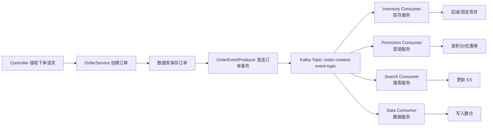

# 结论先说：Kafka 实际使用要抓住 5 件事

实际开发里先掌握这条链路：

```text
Topic 设计
  ↓
Producer 发送消息
  ↓
Consumer Group 消费消息
  ↓
Offset 提交
  ↓
失败重试 / 死信 / 幂等 / 监控
```

在 Spring 后端里，Kafka 最常见的开发模型就是：

```text
KafkaTemplate 发送消息
@KafkaListener 消费消息
```

Spring Kafka 官方也明确提供了这两个核心抽象：`KafkaTemplate` 用于发送消息，消息驱动 POJO / `@KafkaListener` 用于消费消息。([Home](https://docs.spring.io/spring-kafka/reference/index.html?utm_source=chatgpt.com "Overview :: Spring Kafka")) Spring Boot 也提供了 Kafka 自动配置，常用 producer、consumer、admin、streams 配置都可以通过 `spring.kafka.*` 管理。([Home](https://docs.spring.io/spring-boot/reference/messaging/kafka.html?utm_source=chatgpt.com "Apache Kafka Support :: Spring Boot"))

---

# 1. Kafka 和 RabbitMQ / RocketMQ 的使用心智差异

你可以先这样理解：

|维度|RabbitMQ|RocketMQ|Kafka|
|---|---|---|---|
|核心模型|Exchange + Queue|Topic + Tag + ConsumerGroup|Topic + Partition + ConsumerGroup|
|更偏向|业务消息队列|业务消息 + 分布式事务消息|日志流 / 事件流 / 高吞吐消息|
|消费方式|队列投递|拉取为主|拉取为主|
|消息保留|消费后通常删除|可配置保留|天然按日志保留|
|常见场景|订单通知、异步解耦|电商交易链路、延迟消息|用户行为、日志、埋点、数据同步、事件流|

Kafka 的 Producer API 用于发布 records，Consumer API 用于订阅 topic 并处理 records；Kafka Streams API 则用于消费输入流并生成输出流。([kafka.apache.org](https://kafka.apache.org/10/getting-started/introduction/?utm_source=chatgpt.com "Introduction | Apache Kafka"))

你实际写代码时，最重要的是别把 Kafka 当成 RabbitMQ 的“换皮版”。Kafka 更像：

```text
一个可持久化、可回放、可水平扩展的事件日志系统
```

---

# 2. 先搭一个最小可用 Kafka 环境

## 2.1 docker-compose.yml

本地学习可以直接用单节点 Kafka。这里用 KRaft 模式，不依赖 ZooKeeper。

```yaml
services:
  kafka:
    image: apache/kafka:3.9.0
    container_name: kafka
    ports:
      - "9092:9092"
    environment:
      KAFKA_NODE_ID: 1
      KAFKA_PROCESS_ROLES: broker,controller
      KAFKA_CONTROLLER_QUORUM_VOTERS: 1@kafka:9093

      KAFKA_LISTENERS: PLAINTEXT://:9092,CONTROLLER://:9093
      KAFKA_ADVERTISED_LISTENERS: PLAINTEXT://localhost:9092
      KAFKA_CONTROLLER_LISTENER_NAMES: CONTROLLER
      KAFKA_LISTENER_SECURITY_PROTOCOL_MAP: PLAINTEXT:PLAINTEXT,CONTROLLER:PLAINTEXT

      KAFKA_INTER_BROKER_LISTENER_NAME: PLAINTEXT

      KAFKA_OFFSETS_TOPIC_REPLICATION_FACTOR: 1
      KAFKA_TRANSACTION_STATE_LOG_REPLICATION_FACTOR: 1
      KAFKA_TRANSACTION_STATE_LOG_MIN_ISR: 1
```

启动：

```bash
docker compose up -d
```

---

# 3. Spring Boot 项目依赖

## Maven

```xml
<dependencies>
    <!-- Web 接口，方便写测试发送 API -->
    <dependency>
        <groupId>org.springframework.boot</groupId>
        <artifactId>spring-boot-starter-web</artifactId>
    </dependency>

    <!-- Spring Kafka 核心依赖 -->
    <dependency>
        <groupId>org.springframework.kafka</groupId>
        <artifactId>spring-kafka</artifactId>
    </dependency>

    <!-- Lombok，可选 -->
    <dependency>
        <groupId>org.projectlombok</groupId>
        <artifactId>lombok</artifactId>
        <optional>true</optional>
    </dependency>
</dependencies>
```

---

# 4. application.yml：最小生产感配置

```yaml
spring:
  application:
    name: kafka-demo

  kafka:
    bootstrap-servers: localhost:9092

    producer:
      # key 序列化方式
      key-serializer: org.apache.kafka.common.serialization.StringSerializer
      # value 序列化方式，先用 String，后面再换 JSON
      value-serializer: org.apache.kafka.common.serialization.StringSerializer

      # 发送确认机制
      # all 表示 leader + ISR 副本确认，可靠性更高
      acks: all

      # 失败重试次数
      retries: 3

      properties:
        # 开启幂等生产者，避免生产端重试导致重复写入
        enable.idempotence: true

        # 批量发送等待时间，提升吞吐
        linger.ms: 10

        # 批大小
        batch.size: 16384

    consumer:
      group-id: order-service-group

      key-deserializer: org.apache.kafka.common.serialization.StringDeserializer
      value-deserializer: org.apache.kafka.common.serialization.StringDeserializer

      # earliest：没有 offset 时从最早消息开始消费
      # latest：没有 offset 时从最新消息开始消费
      auto-offset-reset: earliest

      # 建议实际项目关闭自动提交，改为手动 ack
      enable-auto-commit: false

    listener:
      # 手动提交 offset
      ack-mode: manual
```

几个关键点：

|配置|作用|实战建议|
|---|---|---|
|`bootstrap-servers`|Kafka 地址|本地 `localhost:9092`，生产多个 broker|
|`group-id`|消费者组|一个业务服务一个明确 group|
|`auto-offset-reset`|没有 offset 时从哪里消费|开发用 `earliest`，生产谨慎|
|`enable-auto-commit`|是否自动提交 offset|生产建议 false|
|`ack-mode`|Spring Kafka 提交模式|生产建议 manual 或 manual_immediate|
|`acks=all`|生产端确认级别|重要业务建议 all|
|`enable.idempotence=true`|生产端幂等|建议开启|

---

# 5. 案例一：发送普通字符串消息

## 5.1 Producer

```java
package com.example.kafka.producer;

import lombok.RequiredArgsConstructor;
import org.springframework.kafka.core.KafkaTemplate;
import org.springframework.stereotype.Component;

@Component
@RequiredArgsConstructor
public class OrderMessageProducer {

    private final KafkaTemplate<String, String> kafkaTemplate;

    private static final String TOPIC = "order-created-topic";

    public void sendOrderCreatedMessage(String orderId) {
        String message = "订单已创建，orderId=" + orderId;

        // key 一般用于决定消息进入哪个 partition
        // 相同 key 默认会进入同一个 partition，有利于保证同一订单维度的顺序性
        kafkaTemplate.send(TOPIC, orderId, message);
    }
}
```

## 5.2 Controller 测试接口

```java
package com.example.kafka.controller;

import com.example.kafka.producer.OrderMessageProducer;
import lombok.RequiredArgsConstructor;
import org.springframework.web.bind.annotation.*;

@RestController
@RequestMapping("/orders")
@RequiredArgsConstructor
public class OrderController {

    private final OrderMessageProducer orderMessageProducer;

    @PostMapping("/{orderId}/create")
    public String createOrder(@PathVariable String orderId) {
        // 模拟订单创建成功后发送事件
        orderMessageProducer.sendOrderCreatedMessage(orderId);
        return "订单创建消息已发送：" + orderId;
    }
}
```

## 5.3 Consumer

```java
package com.example.kafka.consumer;

import lombok.extern.slf4j.Slf4j;
import org.springframework.kafka.annotation.KafkaListener;
import org.springframework.kafka.support.Acknowledgment;
import org.springframework.stereotype.Component;

@Slf4j
@Component
public class OrderMessageConsumer {

    @KafkaListener(
            topics = "order-created-topic",
            groupId = "order-service-group"
    )
    public void listen(String message, Acknowledgment acknowledgment) {
        try {
            log.info("收到订单创建消息：{}", message);

            // 这里写真实业务逻辑
            // 例如：初始化订单扩展信息、通知库存服务、写入搜索索引等

            // 业务处理成功后，手动提交 offset
            acknowledgment.acknowledge();

        } catch (Exception e) {
            log.error("订单创建消息处理失败，message={}", message, e);

            // 不 ack，消息后续可能会被重新消费
            // 生产项目不要无限重试，需要配合重试主题 / 死信主题
            throw e;
        }
    }
}
```

这个就是 Kafka 最基础的使用闭环：

```text
HTTP 请求
  → Controller
  → KafkaTemplate.send()
  → Kafka Topic
  → @KafkaListener
  → 业务处理
  → acknowledgment.acknowledge()
```

---

# 6. 案例二：发送 JSON 业务事件

字符串消息只是入门。实际项目里更常见的是发送结构化事件。

## 6.1 定义事件对象

```java
package com.example.kafka.event;

import java.math.BigDecimal;
import java.time.LocalDateTime;

public record OrderCreatedEvent(
        String eventId,
        String orderId,
        Long userId,
        BigDecimal amount,
        LocalDateTime createdAt
) {
}
```

## 6.2 application.yml 改成 JSON 序列化

```yaml
spring:
  kafka:
    producer:
      key-serializer: org.apache.kafka.common.serialization.StringSerializer
      value-serializer: org.springframework.kafka.support.serializer.JsonSerializer

    consumer:
      key-deserializer: org.apache.kafka.common.serialization.StringDeserializer
      value-deserializer: org.springframework.kafka.support.serializer.JsonDeserializer

      properties:
        spring.json.trusted.packages: "com.example.kafka.event"
```

注意：

```yaml
spring.json.trusted.packages
```

这个配置是 Spring Kafka JSON 反序列化的安全限制。开发阶段可以写：

```yaml
spring.json.trusted.packages: "*"
```

但生产环境不建议这么粗暴，最好限定包名。

---

## 6.3 JSON Producer

```java
package com.example.kafka.producer;

import com.example.kafka.event.OrderCreatedEvent;
import lombok.RequiredArgsConstructor;
import org.springframework.kafka.core.KafkaTemplate;
import org.springframework.stereotype.Component;

import java.math.BigDecimal;
import java.time.LocalDateTime;
import java.util.UUID;

@Component
@RequiredArgsConstructor
public class OrderEventProducer {

    private final KafkaTemplate<String, OrderCreatedEvent> kafkaTemplate;

    private static final String TOPIC = "order-created-event-topic";

    public void sendOrderCreatedEvent(String orderId, Long userId, BigDecimal amount) {
        OrderCreatedEvent event = new OrderCreatedEvent(
                UUID.randomUUID().toString(),
                orderId,
                userId,
                amount,
                LocalDateTime.now()
        );

        // key 使用 orderId，保证同一订单相关事件进入同一分区
        kafkaTemplate.send(TOPIC, orderId, event);
    }
}
```

---

## 6.4 JSON Consumer

```java
package com.example.kafka.consumer;

import com.example.kafka.event.OrderCreatedEvent;
import lombok.extern.slf4j.Slf4j;
import org.springframework.kafka.annotation.KafkaListener;
import org.springframework.kafka.support.Acknowledgment;
import org.springframework.stereotype.Component;

@Slf4j
@Component
public class OrderEventConsumer {

    @KafkaListener(
            topics = "order-created-event-topic",
            groupId = "order-event-consumer-group"
    )
    public void listen(OrderCreatedEvent event, Acknowledgment ack) {
        try {
            log.info("收到订单创建事件：eventId={}, orderId={}, userId={}, amount={}",
                    event.eventId(),
                    event.orderId(),
                    event.userId(),
                    event.amount());

            // 业务处理
            // 例如：更新用户行为表、初始化订单履约流程、发送 BI 统计事件

            ack.acknowledge();

        } catch (Exception e) {
            log.error("处理订单创建事件失败，event={}", event, e);
            throw e;
        }
    }
}
```

---

# 7. 案例三：同一个 Topic，多消费者组

Kafka 的 Consumer Group 是实际开发里最重要的使用点之一。

假设有一个 topic：

```text
order-created-event-topic
```

你可以让不同系统各自用不同 group 消费它：

```text
order-created-event-topic
    ↓
库存服务 group: inventory-service-group
    ↓
营销服务 group: promotion-service-group
    ↓
数据服务 group: data-warehouse-group
```

代码示例：

```java
@Slf4j
@Component
public class InventoryConsumer {

    @KafkaListener(
            topics = "order-created-event-topic",
            groupId = "inventory-service-group"
    )
    public void listen(OrderCreatedEvent event, Acknowledgment ack) {
        log.info("库存服务消费订单事件，准备扣减库存：{}", event.orderId());

        // 扣减库存 / 锁定库存

        ack.acknowledge();
    }
}
```

```java
@Slf4j
@Component
public class PromotionConsumer {

    @KafkaListener(
            topics = "order-created-event-topic",
            groupId = "promotion-service-group"
    )
    public void listen(OrderCreatedEvent event, Acknowledgment ack) {
        log.info("营销服务消费订单事件，准备发放积分：{}", event.orderId());

        // 发积分 / 发优惠券 / 统计活动效果

        ack.acknowledge();
    }
}
```

这里有个非常关键的区别：

|场景|groupId 是否相同|效果|
|---|--:|---|
|多个实例共同分摊消费|相同 groupId|一条消息只被组内一个实例消费|
|多个业务系统都要收到消息|不同 groupId|每个 group 都能收到一份消息|

这和 RabbitMQ 的多个队列绑定同一个 Exchange 有点像，但 Kafka 是通过：

```text
Topic + Consumer Group + Offset
```

来实现的。

---

# 8. 案例四：手动提交 offset 的正确姿势

你要重点记住一句话：

```text
业务成功，再提交 offset。
```

不建议这样：

```java
@KafkaListener(topics = "xxx")
public void listen(String message) {
    // 自动提交 offset
    // 业务还没处理完，offset 可能已经提交了
}
```

更建议这样：

```java
@KafkaListener(topics = "payment-success-topic", groupId = "order-service-group")
public void listen(String message, Acknowledgment ack) {
    try {
        // 1. 解析消息
        // 2. 执行业务逻辑
        // 3. 落库成功
        // 4. 再提交 offset
        ack.acknowledge();
    } catch (Exception e) {
        // 不提交 offset
        // 让 Kafka / Spring Kafka 重试机制处理
        throw e;
    }
}
```

实际语义是：

```text
提交 offset = 我承认这条消息已经处理完成
```

如果你在业务成功之前提交 offset，服务突然宕机，就可能造成：

```text
消息已经被标记为消费成功
但业务其实没执行成功
```

这就是典型的数据不一致。

---

# 9. 案例五：失败重试 + 死信 Topic

实际项目里不能让消息无限重试。常见策略是：

```text
正常 Topic
  ↓ 消费失败
重试 Topic
  ↓ 多次失败
死信 Topic
```

Spring Kafka 支持错误处理器和死信发布器。示例配置：

```java
package com.example.kafka.config;

import org.apache.kafka.common.TopicPartition;
import org.springframework.context.annotation.Bean;
import org.springframework.context.annotation.Configuration;
import org.springframework.kafka.core.KafkaOperations;
import org.springframework.kafka.listener.DefaultErrorHandler;
import org.springframework.kafka.listener.DeadLetterPublishingRecoverer;
import org.springframework.util.backoff.FixedBackOff;

@Configuration
public class KafkaErrorHandlerConfig {

    @Bean
    public DefaultErrorHandler defaultErrorHandler(KafkaOperations<Object, Object> kafkaTemplate) {

        DeadLetterPublishingRecoverer recoverer = new DeadLetterPublishingRecoverer(
                kafkaTemplate,
                // 失败后发送到原 topic + ".DLT"
                (record, exception) -> new TopicPartition(record.topic() + ".DLT", record.partition())
        );

        // 每隔 1 秒重试一次，最多重试 3 次
        FixedBackOff fixedBackOff = new FixedBackOff(1000L, 3L);

        return new DefaultErrorHandler(recoverer, fixedBackOff);
    }
}
```

如果原 topic 是：

```text
order-created-event-topic
```

那么失败多次后会进入：

```text
order-created-event-topic.DLT
```

然后你可以专门写一个死信消费者：

```java
@Slf4j
@Component
public class OrderDeadLetterConsumer {

    @KafkaListener(
            topics = "order-created-event-topic.DLT",
            groupId = "order-dlt-consumer-group"
    )
    public void listenDlt(String message, Acknowledgment ack) {
        log.error("收到死信消息，需要人工排查：{}", message);

        // 这里可以：
        // 1. 记录到异常消息表
        // 2. 发送告警
        // 3. 后台人工补偿
        // 4. 修复数据后重新投递

        ack.acknowledge();
    }
}
```

---

# 10. 案例六：发送结果回调

生产中不能只写：

```java
kafkaTemplate.send(topic, message);
```

然后就不管了。重要业务最好处理发送结果。

```java
package com.example.kafka.producer;

import com.example.kafka.event.OrderCreatedEvent;
import lombok.RequiredArgsConstructor;
import lombok.extern.slf4j.Slf4j;
import org.springframework.kafka.core.KafkaTemplate;
import org.springframework.stereotype.Component;

@Slf4j
@Component
@RequiredArgsConstructor
public class ReliableOrderEventProducer {

    private final KafkaTemplate<String, OrderCreatedEvent> kafkaTemplate;

    public void send(OrderCreatedEvent event) {
        String topic = "order-created-event-topic";
        String key = event.orderId();

        kafkaTemplate.send(topic, key, event)
                .whenComplete((result, ex) -> {
                    if (ex != null) {
                        log.error("Kafka 消息发送失败，topic={}, key={}, event={}",
                                topic, key, event, ex);

                        // 生产项目中可以：
                        // 1. 落本地消息表
                        // 2. 触发补偿任务
                        // 3. 告警
                        return;
                    }

                    log.info("Kafka 消息发送成功，topic={}, partition={}, offset={}",
                            result.getRecordMetadata().topic(),
                            result.getRecordMetadata().partition(),
                            result.getRecordMetadata().offset());
                });
    }
}
```

---

# 11. 案例七：保证同一业务 ID 的顺序消费

Kafka 只能保证：

```text
同一个 partition 内有序
```

所以如果你想保证同一个订单的事件顺序：

```text
OrderCreated
OrderPaid
OrderShipped
OrderCompleted
```

必须让它们使用相同 key：

```java
kafkaTemplate.send("order-event-topic", orderId, event);
```

这样同一个 `orderId` 默认会进入同一个 partition。

错误写法：

```java
kafkaTemplate.send("order-event-topic", UUID.randomUUID().toString(), event);
```

这样同一个订单的不同事件可能进入不同 partition，消费顺序就没保证了。

---

# 12. 案例八：消费者幂等处理

Kafka 即使配置得很好，也不要假设消息只会被消费一次。

实际项目里你要默认：

```text
Kafka 消费至少一次
业务必须幂等
```

## 12.1 事件表

可以建一张消费记录表：

```sql
CREATE TABLE message_consume_record (
    id BIGINT PRIMARY KEY AUTO_INCREMENT,
    event_id VARCHAR(64) NOT NULL,
    consumer_group VARCHAR(128) NOT NULL,
    status VARCHAR(32) NOT NULL,
    created_at DATETIME NOT NULL,
    updated_at DATETIME NOT NULL,
    UNIQUE KEY uk_event_group (event_id, consumer_group)
);
```

## 12.2 消费端幂等代码

```java
@Slf4j
@Component
@RequiredArgsConstructor
public class IdempotentOrderConsumer {

    private final MessageConsumeRecordService recordService;

    @KafkaListener(
            topics = "order-created-event-topic",
            groupId = "inventory-service-group"
    )
    public void listen(OrderCreatedEvent event, Acknowledgment ack) {
        String eventId = event.eventId();
        String group = "inventory-service-group";

        try {
            // 1. 判断是否已经消费过
            if (recordService.hasConsumed(eventId, group)) {
                log.info("消息已经消费过，直接 ack，eventId={}", eventId);
                ack.acknowledge();
                return;
            }

            // 2. 先插入消费记录，利用唯一索引防并发重复
            recordService.markConsuming(eventId, group);

            // 3. 执行业务逻辑
            // 例如：扣减库存
            log.info("开始处理库存扣减，orderId={}", event.orderId());

            // 4. 标记消费成功
            recordService.markSuccess(eventId, group);

            // 5. 提交 offset
            ack.acknowledge();

        } catch (DuplicateMessageException e) {
            log.info("重复消息，eventId={}", eventId);
            ack.acknowledge();

        } catch (Exception e) {
            log.error("消息处理失败，eventId={}", eventId, e);
            throw e;
        }
    }
}
```

这个逻辑比“相信 Kafka 不重复”靠谱得多。

---

# 13. Kafka 在 Java 后端项目里的典型场景

## 场景一：订单事件广播

```text
订单服务创建订单
  ↓ Kafka: order-created-topic
库存服务消费：锁库存
营销服务消费：发积分
搜索服务消费：更新索引
数据服务消费：写入数仓
```

适合 Kafka。

---

## 场景二：用户行为日志

```text
用户点击
用户浏览
用户搜索
用户收藏
用户下单
  ↓
Kafka
  ↓
Flink / Spark / ClickHouse / Elasticsearch
```

非常适合 Kafka。

---

## 场景三：异步数据同步

```text
商品服务修改商品
  ↓
Kafka: product-changed-topic
  ↓
搜索服务更新 ES
推荐服务更新特征
缓存服务刷新 Redis
```

适合 Kafka。

---

## 场景四：业务状态流转

```text
OrderCreated
OrderPaid
OrderDelivered
OrderCompleted
```

可以用 Kafka，但要注意顺序性和幂等。

---

## 场景五：削峰填谷

```text
秒杀请求
  ↓
先落请求 / 预校验
  ↓
Kafka 排队
  ↓
后端消费者慢慢处理
```

可以用 Kafka，但交易核心链路要谨慎。对于强一致、高实时扣库存场景，不要无脑把 Kafka 放进核心事务链路。

---

# 14. 一个比较完整的工程调用链



---

# 15. Kafka 使用时最容易踩的坑

## 坑一：以为 Kafka 消息不会重复

错。

实际项目必须做幂等：

```text
eventId + consumerGroup 唯一索引
```

或者业务天然幂等：

```text
订单状态机控制
库存扣减流水唯一约束
支付回调幂等表
```

---

## 坑二：以为 Kafka 全局有序

错。

Kafka 只保证：

```text
同一个 partition 内有序
```

想保证同一个订单有序，就用：

```java
kafkaTemplate.send(topic, orderId, event);
```

---

## 坑三：消费者处理成功前就提交 offset

错。

建议：

```text
业务成功 → ack
业务失败 → 不 ack / 抛异常 / 进入重试
```

---

## 坑四：一个 topic 承载太多不同业务语义

不要设计成：

```text
common-event-topic
```

然后里面塞订单、支付、库存、营销、用户注册、商品修改。

更推荐：

```text
order-created-topic
order-paid-topic
product-changed-topic
inventory-deducted-topic
```

Topic 名称应该表达业务语义。

---

## 坑五：消息体没有版本号

建议事件里带上：

```java
public record OrderCreatedEvent(
        String eventId,
        String eventVersion,
        String orderId,
        Long userId,
        BigDecimal amount,
        LocalDateTime createdAt
) {
}
```

后续事件结构升级时，不至于消费者直接崩。

---

# 16. 一个生产级事件对象建议

```java
package com.example.kafka.event;

import java.time.LocalDateTime;

public record DomainEvent<T>(
        String eventId,
        String eventType,
        String eventVersion,
        String sourceService,
        String traceId,
        String bizId,
        LocalDateTime occurredAt,
        T data
) {
}
```

订单创建 payload：

```java
public record OrderCreatedPayload(
        String orderId,
        Long userId,
        String amount,
        String currency
) {
}
```

发送：

```java
DomainEvent<OrderCreatedPayload> event = new DomainEvent<>(
        UUID.randomUUID().toString(),
        "OrderCreated",
        "v1",
        "order-service",
        traceId,
        orderId,
        LocalDateTime.now(),
        new OrderCreatedPayload(orderId, userId, amount.toPlainString(), "CNY")
);

kafkaTemplate.send("order-created-topic", orderId, event);
```

这样比裸发一个 `OrderDTO` 更像生产系统。

---

# 17. Kafka 实战学习路线

你这次不纠结原理的话，建议按这个顺序练：

|阶段|要练什么|目标|
|---|---|---|
|第一阶段|`KafkaTemplate` + `@KafkaListener`|跑通生产消费|
|第二阶段|JSON 消息|掌握业务事件发送|
|第三阶段|Consumer Group|理解广播消费和集群消费|
|第四阶段|手动 ack|控制 offset 提交时机|
|第五阶段|重试 + 死信|处理消费失败|
|第六阶段|幂等消费|防止重复消息造成脏数据|
|第七阶段|顺序消费|用 key 控制分区|
|第八阶段|监控 lag|发现消费者积压|
|第九阶段|本地消息表 / Outbox|保证数据库和消息发送一致性|

---

# 18. 和你之前学 RabbitMQ 的类比

你之前写过 RabbitMQ：

```java
@RabbitListener(
    bindings = @QueueBinding(
        value = @Queue(value = "routeQueue1"),
        exchange = @Exchange(value = "routeExchange", type = ExchangeTypes.DIRECT),
        key = "routeKey1"
    )
)
public void listener01(String msg) {
    log.info("接收消息【路由模式】：{}", msg);
}
```

Kafka 里没有 Exchange 这层。Kafka 更直接：

```java
@KafkaListener(
    topics = "order-created-topic",
    groupId = "order-service-group"
)
public void listen(String msg, Acknowledgment ack) {
    log.info("接收 Kafka 消息：{}", msg);
    ack.acknowledge();
}
```

对应关系粗略是：

|RabbitMQ|Kafka|
|---|---|
|Exchange|无直接等价，Topic 自身承担核心路由|
|Queue|Topic + Partition|
|RoutingKey|Message Key / Topic 设计|
|Consumer|Consumer|
|Queue 绑定|Consumer 订阅 Topic|
|ack|offset commit / acknowledgment|
|DLX|DLT / Dead Letter Topic|

---

# 19. 最小记忆版

你先把 Kafka 实际开发记成这几句话：

```text
1. Producer 用 KafkaTemplate 发送消息。
2. Consumer 用 @KafkaListener 消费消息。
3. 一个业务事件对应一个语义清晰的 Topic。
4. 相同 groupId 表示多个实例共同分摊消费。
5. 不同 groupId 表示多个业务系统各自消费一份。
6. 业务成功后再 ack，避免消息丢失。
7. Kafka 可能重复消费，所以业务必须幂等。
8. 同一个 key 进入同一个 partition，才能保证局部顺序。
9. 消费失败要有重试和死信 Topic。
10. 生产环境必须监控 consumer lag。
```

---

# 面试加分项

## 1. Kafka 为什么适合事件驱动架构？

因为 Kafka 的消息不是简单“投递完就消失”，而是以日志形式保留。消费者通过 offset 记录自己的消费进度，不同消费者组可以独立消费同一份事件流。

可以这样说：

```text
Kafka 更适合做企业内部的事件总线和数据流管道，而不仅仅是一个传统消息队列。
```

---

## 2. Kafka 如何避免重复消费造成问题？

不要依赖 MQ 保证绝对不重复，而是业务层做幂等：

```text
eventId + consumerGroup 唯一索引
业务状态机
流水表唯一约束
天然覆盖式更新
```

---

## 3. Kafka 如何保证顺序？

回答要谨慎：

```text
Kafka 不保证全局顺序，只保证同一个 partition 内的顺序。
如果要保证同一个订单的事件顺序，应使用 orderId 作为 message key，让同一订单的事件进入同一个 partition。
```

---

## 4. Kafka 消息丢失通常发生在哪些地方？

```text
Producer 发送失败
Broker 未充分副本确认
Consumer 业务未成功但 offset 已提交
```

对应治理：

```text
acks=all
enable.idempotence=true
手动提交 offset
失败重试
死信 Topic
业务补偿
```

---

## 5. Kafka 和 RabbitMQ 怎么选？

可以这样回答：

```text
RabbitMQ 更适合传统业务消息、灵活路由、低延迟任务分发；
Kafka 更适合高吞吐事件流、日志采集、数据同步、用户行为、可回放消息场景；
RocketMQ 在电商交易、延迟消息、事务消息等业务消息场景里也很常见。
```

对于 Java 后端开发者，不是“谁替代谁”，而是：

```text
RabbitMQ：业务队列
RocketMQ：交易型业务消息
Kafka：事件流 / 数据流 / 日志流
```