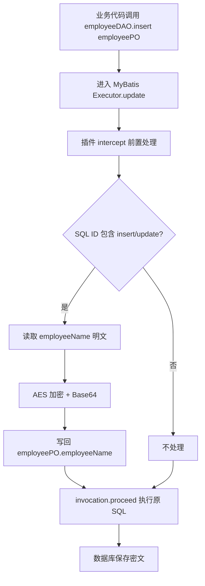
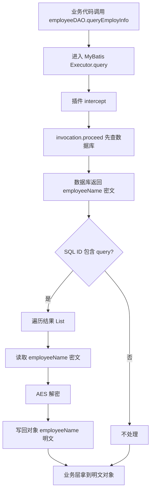

原文：[xfg](https://bugstack.cn/md/road-map/mybatis.html)

[[Mybatis加密插件（生产版）]]

这篇里的 MyBatis 加密插件，本质上是：

> **在 MyBatis 执行 insert/update 前，把参数对象里的敏感字段加密；在 query 返回后，把结果对象里的敏感字段解密。**

它不是改 SQL，也不是改 Mapper，而是在 MyBatis 执行链路中插了一层拦截器。

---

# 1. 它拦截了 MyBatis 的哪个点？
																																																																																																					
文章里的插件类是：

```java
FieldEncryptionAndDecryptionMybatisPlugin implements Interceptor
```

并通过 `@Intercepts + @Signature` 声明拦截点：

```java
@Intercepts({
    @Signature(
        type = Executor.class,
        method = "update",
        args = {MappedStatement.class, Object.class}
    ),
    @Signature(
        type = Executor.class,
        method = "query",
        args = {MappedStatement.class, Object.class, RowBounds.class, ResultHandler.class}
    )
})
public class FieldEncryptionAndDecryptionMybatisPlugin implements Interceptor {
}
```

也就是说，它拦截的是 MyBatis 的 `Executor`：

|拦截方法|对应场景|插件做什么|
|---|---|---|
|`Executor.update(...)`|insert / update / delete|在 SQL 执行前处理入参|
|`Executor.query(...)`|select|在查询完成后处理返回值|

MyBatis 官方插件机制也是这个思路：实现 `Interceptor`，在 `intercept()` 里做前置处理、调用 `invocation.proceed()` 继续执行、再做后置处理。官方示例也展示了通过 `<plugins>` 或配置对象注册插件的方式。([MyBatis](https://mybatis.org/mybatis-3/configuration.html?utm_source=chatgpt.com "MyBatis 3 | Configuration"))

文章中明确说，这里用插件实现“数据的加解密、路由、日志”等扩展，并针对 `employeeName` 这类字段做加解密处理。([BugStack](https://bugstack.cn/md/road-map/mybatis.html "MyBatis | 小傅哥 bugstack 虫洞栈"))

---

# 2. insert/update 前：怎么加密？

核心代码逻辑大概是：

```java
Object[] args = invocation.getArgs();

MappedStatement mappedStatement = (MappedStatement) args[0];
Object parameter = args[1];

String sqlId = mappedStatement.getId();

if (parameter != null && (sqlId.contains("insert") || sqlId.contains("update"))) {
    String columnName = "employeeName";

    if (parameter instanceof Map) {
        List<Object> parameterList = (List<Object>) ((Map<?, ?>) parameter).get("list");

        for (Object obj : parameterList) {
            if (hasField(obj, columnName)) {
                String fieldValue = BeanUtils.getProperty(obj, columnName);
                String encryptedValue = encrypt(fieldValue);
                BeanUtils.setProperty(obj, columnName, encryptedValue);
            }
        }
    } else {
        if (hasField(parameter, columnName)) {
            String fieldValue = BeanUtils.getProperty(parameter, columnName);
            String encryptedValue = encrypt(fieldValue);
            BeanUtils.setProperty(parameter, columnName, encryptedValue);
        }
    }
}
```

它干了几件事：

## 2.1 先拿到当前执行的 Mapper 方法

```java
MappedStatement mappedStatement = (MappedStatement) args[0];
String sqlId = mappedStatement.getId();
```

`MappedStatement.getId()` 通常类似：

```text
cn.bugstack.xfg.dev.tech.infrastructure.dao.IEmployeeDAO.insert
cn.bugstack.xfg.dev.tech.infrastructure.dao.IEmployeeDAO.update
cn.bugstack.xfg.dev.tech.infrastructure.dao.IEmployeeDAO.queryEmployInfo
```

然后它用：

```java
sqlId.contains("insert") || sqlId.contains("update")
```

判断当前是不是写操作。

这个判断比较粗糙，但学习案例里够用。

---

## 2.2 再拿到 Mapper 入参对象

```java
Object parameter = args[1];
```

例如你调用：

```java
employeeDAO.insert(employeePO);
```

那么 `parameter` 就是 `employeePO`。

如果是批量插入：

```java
employeeDAO.insertList(employeePOList);
```

MyBatis 可能会把集合参数包装成一个 `Map`，里面常见 key 是：

```java
"list"
```

所以文章里的代码针对两种情况分别处理：

|参数类型|场景|处理方式|
|---|---|---|
|普通对象|单条 insert/update|直接反射改字段|
|`Map`|批量 insert|从 `map.get("list")` 拿集合，逐个处理|

文章里对应的 XML 批量插入使用了 `<foreach collection="list" item="item">`，所以插件里从 `Map` 里取 `"list"` 是配套的。([BugStack](https://bugstack.cn/md/road-map/mybatis.html "MyBatis | 小傅哥 bugstack 虫洞栈"))

---

## 2.3 找到字段 `employeeName`，加密后写回对象

```java
String columnName = "employeeName";

String fieldValue = BeanUtils.getProperty(obj, columnName);
String encryptedValue = encrypt(fieldValue);
BeanUtils.setProperty(obj, columnName, encryptedValue);
```

这一步的关键点是：

> **插件不是修改 SQL，而是修改 SQL 参数对象。**

例如业务层传进来的是：

```java
employeeName = "小傅哥"
```

在真正执行 SQL 前，插件把它改成：

```java
employeeName = "AES加密后再Base64的字符串"
```

于是 Mapper XML 里还是正常写：

```xml
INSERT INTO employee(employee_number, employee_name, ...)
VALUES(#{employeeNumber}, #{employeeName}, ...)
```

但是 `#{employeeName}` 实际取到的已经是密文了。

---

# 3. query 后：怎么解密？

写操作前加密，读操作后解密。

核心代码是：

```java
Object result = invocation.proceed();

if (result != null && sqlId.contains("query")) {
    String columnName = "employeeName";

    if (result instanceof List) {
        List<Object> resultList = (List<Object>) result;

        for (Object obj : resultList) {
            if (!hasField(obj, columnName)) continue;

            String fieldValue = BeanUtils.getProperty(obj, columnName);
            if (StringUtils.isBlank(fieldValue)) continue;

            String decryptedValue = decrypt(fieldValue);
            BeanUtils.setProperty(obj, columnName, decryptedValue);
        }
    }
}

return result;
```

注意这里的顺序：

```java
Object result = invocation.proceed();
```

`invocation.proceed()` 表示继续执行 MyBatis 原本的查询。

也就是说：

```text
业务调用 Mapper 查询
    ↓
进入插件
    ↓
invocation.proceed()
    ↓
真正查数据库，拿到密文结果
    ↓
插件遍历结果集，把 employeeName 解密
    ↓
返回给业务层
```

最终业务层拿到的还是明文：

```json
{
  "employeeName": "小傅哥"
}
```

文章测试结果里也能看到，查询接口最终打印出的 `employeeName` 是明文。([BugStack](https://bugstack.cn/md/road-map/mybatis.html "MyBatis | 小傅哥 bugstack 虫洞栈"))

---

# 4. 加解密本身怎么做？

文章里用的是：

```java
AES/CBC/PKCS5Padding
```

加密：

```java
public String encrypt(String content) throws Exception {
    Cipher cipher = Cipher.getInstance("AES/CBC/PKCS5Padding");

    byte[] raw = KEY.getBytes();
    SecretKeySpec secretKeySpec = new SecretKeySpec(raw, "AES");
    IvParameterSpec ivParameterSpec = new IvParameterSpec(IV.getBytes());

    cipher.init(Cipher.ENCRYPT_MODE, secretKeySpec, ivParameterSpec);

    byte[] encrypted = cipher.doFinal(content.getBytes());

    return Base64.getEncoder().encodeToString(encrypted);
}
```

解密：

```java
public String decrypt(String content) throws Exception {
    Cipher cipher = Cipher.getInstance("AES/CBC/PKCS5Padding");

    byte[] raw = KEY.getBytes();
    SecretKeySpec secretKeySpec = new SecretKeySpec(raw, "AES");
    IvParameterSpec ivParameterSpec = new IvParameterSpec(IV.getBytes());

    cipher.init(Cipher.DECRYPT_MODE, secretKeySpec, ivParameterSpec);

    byte[] encrypted = Base64.getDecoder().decode(content);
    byte[] original = cipher.doFinal(encrypted);

    return new String(original);
}
```

其中：

```java
private static final String KEY = "1898794876567654";
private static final String IV = "1233214566547891";
```

`KEY` 是 AES 密钥，`IV` 是 CBC 模式的初始化向量。文章里也标注了二者都必须是 16 位。([BugStack](https://bugstack.cn/md/road-map/mybatis.html "MyBatis | 小傅哥 bugstack 虫洞栈"))

整体链路是：

```text
明文：小傅哥
  ↓ AES/CBC/PKCS5Padding
二进制密文
  ↓ Base64
可存储字符串
  ↓ 存入 employee_name 字段
```

读取时反过来：

```text
数据库中的 Base64 密文
  ↓ Base64 decode
二进制密文
  ↓ AES decrypt
明文：小傅哥
```

---

# 5. `hasField()` 是干什么的？

```java
public boolean hasField(Object obj, String fieldName) {
    Class<?> clazz = obj.getClass();

    while (clazz != null) {
        try {
            Field field = clazz.getDeclaredField(fieldName);
            return true;
        } catch (NoSuchFieldException e) {
            clazz = clazz.getSuperclass();
        }
    }

    return false;
}
```

它的作用是：

> 判断当前对象或父类里有没有 `employeeName` 字段。

因为插件会拦截所有 insert/update/query，不是每个 Mapper 参数对象、返回对象都有 `employeeName`。

例如：

```java
EmployeePO 有 employeeName
EmployeeSalaryPO 没有 employeeName
EmployeeSalaryAdjustPO 没有 employeeName
```

所以它要先判断字段是否存在，存在才加解密，避免反射报错。

---

# 6. 一张图看懂执行链路



查询链路：



---

# 7. 插件写好后，实际怎么使用？

## 方式一：Spring Boot 项目里注册为 Bean

最常见做法：

```java
@Configuration
public class MyBatisPluginConfig {

    @Bean
    public FieldEncryptionAndDecryptionMybatisPlugin fieldEncryptionAndDecryptionMybatisPlugin() {
        return new FieldEncryptionAndDecryptionMybatisPlugin();
    }
}
```

或者直接：

```java
@Component
@Intercepts({
    @Signature(type = Executor.class, method = "update",
            args = {MappedStatement.class, Object.class}),
    @Signature(type = Executor.class, method = "query",
            args = {MappedStatement.class, Object.class, RowBounds.class, ResultHandler.class})
})
public class FieldEncryptionAndDecryptionMybatisPlugin implements Interceptor {
}
```

在 Spring Boot + MyBatis Starter 场景下，推荐用配置类注册，或者通过 `ConfigurationCustomizer` 把插件加进 MyBatis Configuration。MyBatis Spring Boot Starter 官方也提供了通过 Java Config 定制 MyBatis Configuration 的方式。([MyBatis](https://mybatis.org/spring-boot-starter/mybatis-spring-boot-autoconfigure/?utm_source=chatgpt.com "Introduction – mybatis-spring-boot-autoconfigure"))

例如：

```java
@Configuration
public class MyBatisConfig {

    @Bean
    public ConfigurationCustomizer mybatisConfigurationCustomizer(
            FieldEncryptionAndDecryptionMybatisPlugin plugin) {
        return configuration -> configuration.addInterceptor(plugin);
    }

    @Bean
    public FieldEncryptionAndDecryptionMybatisPlugin fieldEncryptionAndDecryptionMybatisPlugin() {
        return new FieldEncryptionAndDecryptionMybatisPlugin();
    }
}
```

这个方式比较稳。

---

## 方式二：传统 MyBatis XML 里注册插件

如果你有 `mybatis-config.xml`，可以这样：

```xml
<configuration>
    <plugins>
        <plugin interceptor="cn.bugstack.xfg.dev.tech.plugin.FieldEncryptionAndDecryptionMybatisPlugin"/>
    </plugins>
</configuration>
```

这是 MyBatis 官方文档里的标准注册方式。([MyBatis](https://mybatis.org/mybatis-3/configuration.html?utm_source=chatgpt.com "MyBatis 3 | Configuration"))

然后在 Spring Boot 配置里指定：

```yaml
mybatis:
  config-location: classpath:mybatis-config.xml
```

---

# 8. 业务代码怎么写？需要手动加密吗？

不需要。

插件接入后，业务代码还是正常写：

```java
EmployeePO employeePO = EmployeePO.builder()
        .employeeNumber("10000001")
        .employeeName("小傅哥")
        .employeeLevel("T3")
        .employeeTitle("中级工程师")
        .build();

employeeDAO.insert(employeePO);
```

Mapper XML 也正常写：

```xml
<insert id="insert" parameterType="cn.bugstack.xfg.dev.tech.infrastructure.po.EmployeePO">
    INSERT INTO employee(
        employee_number,
        employee_name,
        employee_level,
        employee_title,
        create_time,
        update_time
    )
    VALUES(
        #{employeeNumber},
        #{employeeName},
        #{employeeLevel},
        #{employeeTitle},
        now(),
        now()
    )
</insert>
```

你不用在 Service 里写：

```java
employeePO.setEmployeeName(encrypt(employeePO.getEmployeeName()));
```

也不用在查询后写：

```java
employeePO.setEmployeeName(decrypt(employeePO.getEmployeeName()));
```

插件会自动做。

---

# 9. 这个方案的优点

## 优点一：业务代码无感知

业务层看到的是：

```java
employeeName = "小傅哥"
```

数据库里存的是：

```text
Vf0s7M1xxxxxx==
```

加解密逻辑被集中在插件里。

---

## 优点二：Mapper XML 不需要改

原来的：

```xml
#{employeeName}
```

不用变。

---

## 优点三：适合统一治理敏感字段

比如：

|字段|是否适合加密|
|---|---|
|手机号|适合|
|身份证号|适合|
|银行卡号|适合|
|姓名|视业务而定|
|地址|适合|
|密码|不应该可逆加密，应该哈希|

---

# 10. 这篇代码的几个实际问题

学习案例没问题，但生产环境不能原样照搬。

## 问题一：用 `sqlId.contains("insert")` 判断太脆弱

比如你的 Mapper 方法叫：

```java
saveEmployee()
modifyEmployee()
selectEmployee()
```

那这个插件就不生效了。

更稳的方式是判断 MyBatis 的 SQL 类型：

```java
SqlCommandType sqlCommandType = mappedStatement.getSqlCommandType();

if (sqlCommandType == SqlCommandType.INSERT 
        || sqlCommandType == SqlCommandType.UPDATE) {
    // 加密
}

if (sqlCommandType == SqlCommandType.SELECT) {
    // 解密
}
```

---

## 问题二：字段名写死为 `employeeName`

文章里写的是：

```java
String columnName = "employeeName";
```

这只能处理一个字段。

生产里更好的方式是自定义注解：

```java
@EncryptField
private String employeeName;
```

然后插件扫描所有带 `@EncryptField` 的字段。

---

## 问题三：只处理了 `List` 查询结果

文章查询解密部分只判断了：

```java
if (result instanceof List)
```

如果 Mapper 返回单个对象：

```java
EmployeePO queryById(String employeeNumber);
```

那插件不会解密。

应该补上：

```java
if (result instanceof List<?>) {
    for (Object item : (List<?>) result) {
        decryptObject(item);
    }
} else {
    decryptObject(result);
}
```

---

## 问题四：AES Key 和 IV 写死在代码里

```java
private static final String KEY = "1898794876567654";
private static final String IV = "1233214566547891";
```

生产环境不应该这么写。

更合理的是：

```yaml
security:
  encrypt:
    key: ${DATA_ENCRYPT_KEY}
    iv: ${DATA_ENCRYPT_IV}
```

然后通过配置注入。

---

## 问题五：CBC 固定 IV 会泄露模式信息

文章里固定 IV 是为了教学简单。

生产上要根据安全要求选择更合适的方案，例如：

- AES-GCM
    
- 随机 IV
    
- 密文中附带 IV
    
- KMS 管理密钥
    
- 密钥轮换机制
    

---

# 11. 更像生产可用的写法

## 11.1 定义字段注解

```java
@Target(ElementType.FIELD)
@Retention(RetentionPolicy.RUNTIME)
public @interface EncryptField {
}
```

---

## 11.2 PO 上标记敏感字段

```java
@Data
public class EmployeePO {

    private String employeeNumber;

    @EncryptField
    private String employeeName;

    private String employeeLevel;

    private String employeeTitle;
}
```

---

## 11.3 插件不再写死字段名

伪代码：

```java
private void encryptObject(Object obj) {
    for (Field field : getAllFields(obj.getClass())) {
        if (!field.isAnnotationPresent(EncryptField.class)) {
            continue;
        }

        field.setAccessible(true);

        Object value = field.get(obj);
        if (value == null) {
            continue;
        }

        String encrypted = encrypt(value.toString());
        field.set(obj, encrypted);
    }
}
```

这样你想加密哪个字段，就在哪个字段上加注解。

---

# 12. 最终你应该这样理解它

这篇文章里的插件不是一个“加密工具类”，而是一个 **MyBatis 执行链路拦截器**：

```text
写入前：
业务明文对象 → MyBatis 插件 → 修改参数为密文 → SQL 入库

查询后：
数据库密文结果 → MyBatis 插件 → 修改结果为明文 → 返回业务层
```

它的核心价值是：

> **把敏感字段加解密从业务代码里剥离出去，统一沉到 MyBatis 基础设施层处理。**

这和你最近学的 DDD 分层也能对上：

|层|是否应该关心加密细节|
|---|---|
|domain|不应该|
|application|不应该|
|repository 接口|不应该|
|infrastructure / MyBatis 插件|应该|

所以这个设计的真正意义是：

> 业务模型里保持正常语义，数据库里保存安全密文，加解密作为基础设施横切能力统一处理。