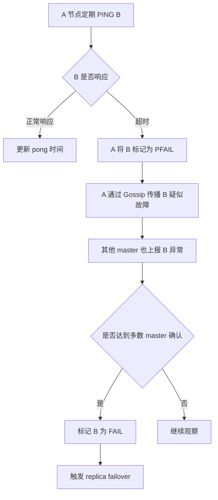

## 1. Redis Cluster Gossip 协议解决什么问题

Redis Cluster 是一个**去中心化分片集群**。它没有 ZooKeeper、Etcd、NameServer 这类中心协调节点，所以每个 Redis 节点都必须自己维护一份集群视图：

```text
有哪些节点？
谁是 master？
谁是 replica？
16384 个 slot 分别归谁？
哪些节点疑似下线？
哪些节点确认下线？
当前配置版本是多少？
```

Redis Cluster 使用 **Gossip 协议**在节点之间传播这些信息。官方文档明确说明：Cluster 节点通过 Cluster Bus 使用二进制协议互联，并用 Gossip 传播集群信息、发现新节点、发送 ping、检测节点状态、传递特定集群消息。([Redis](https://redis.io/docs/latest/operate/oss_and_stack/reference/cluster-spec/?utm_source=chatgpt.com "Redis cluster specification | Docs"))

---

## 2. 一句话理解 Gossip

Gossip 协议本质上是：

> 每个节点周期性地和部分节点交换自己知道的集群状态，信息像“流言”一样逐步扩散，最终让整个集群趋于一致。

它不是强一致协议，不像 Raft / Paxos 那样每次状态变化都要达成严格多数派日志一致。

Redis Cluster Gossip 追求的是：

```text
低中心化
低通信成本
最终一致的集群状态传播
足够快的故障发现
```

---

## 3. Redis Cluster 的通信通道：Cluster Bus

Redis Cluster 有两类端口：

|端口|作用|
|---|---|
|普通 Redis 端口，例如 `6379`|客户端读写命令|
|Cluster Bus 端口，默认 `6379 + 10000 = 16379`|节点间通信、Gossip、故障检测、Failover 消息|

Cluster Bus 不是给业务客户端用的，而是 Redis 节点之间用的内部通信通道。Redis 官方文档指出，集群节点通过 TCP bus 和二进制协议互联；客户端则通过 `MOVED`、`ASK` 等重定向访问正确节点。([Redis](https://redis.io/docs/latest/operate/oss_and_stack/reference/cluster-spec/?utm_source=chatgpt.com "Redis cluster specification | Docs"))

所以生产环境里经常有这个坑：

```text
6379 通了，但 16379 没通
```

结果就是：

```text
客户端能连 Redis
但 Redis Cluster 节点之间互相看不见
集群状态异常
故障检测误判
failover 异常
```

---

## 4. Gossip 传播哪些核心信息

Redis Cluster Gossip 主要传播这些信息：

|信息类型|说明|
|---|---|
|节点 ID|每个节点唯一标识，不依赖 IP|
|IP / Port|节点通信地址|
|角色|master / replica|
|Slot 归属|哪个 master 负责哪些 hash slot|
|节点状态|正常、疑似下线、确认下线|
|配置纪元|`configEpoch`，用于判断配置新旧|
|复制关系|replica 跟随哪个 master|
|故障报告|某节点被哪些节点认为异常|

重点是：  
Gossip 不只是“心跳”，它还承担了**集群元数据扩散**的职责。

---

## 5. Redis Cluster 的节点视图

每个 Redis Cluster 节点内部都会维护一份类似这样的结构：

```text
clusterState
 ├── myself
 ├── nodes
 │    ├── nodeA: master, slots 0-5460
 │    ├── nodeB: master, slots 5461-10922
 │    ├── nodeC: master, slots 10923-16383
 │    ├── nodeD: replica of nodeA
 │    └── ...
 ├── slots[16384]
 ├── currentEpoch
 └── state: ok / fail
```

这份视图不是从中心节点拉取的，而是通过节点之间持续交换 Gossip 消息逐步收敛出来的。

---

## 6. 常见 Cluster 消息类型

Redis Cluster Bus 上有多种消息，核心包括：

|消息|作用|
|---|---|
|`MEET`|将一个新节点引入集群|
|`PING`|节点间心跳，携带 Gossip 信息|
|`PONG`|响应心跳，也携带 Gossip 信息|
|`FAIL`|广播某节点已被确认下线|
|`PUBLISH`|集群内 Pub/Sub 传播|
|`FAILOVER_AUTH_REQUEST`|replica 请求故障转移授权|
|`FAILOVER_AUTH_ACK`|master 授权 replica 发起 failover|
|`UPDATE`|传播更新后的 slot / epoch 配置|

其中和 Gossip 最相关的是：

```text
MEET
PING
PONG
FAIL
UPDATE
```

---

## 7. MEET：节点加入集群

假设现在有三个节点：

```text
A  B  C
```

新节点 D 要加入集群，通常执行：

```bash
redis-cli -h A -p 6379 CLUSTER MEET <D_IP> <D_PORT>
```

执行后：

```text
A 知道 D
A 通过 Gossip 把 D 的信息传给 B、C
B、C 逐渐也知道 D
D 也逐渐知道 A、B、C
```

这就是去中心化发现。

你不需要分别告诉每个节点：

```bash
B meet D
C meet D
```

因为 Gossip 会扩散这个节点信息。

---

## 8. PING / PONG：不只是心跳

Redis Cluster 中的 `PING` / `PONG` 不只是：

```text
你活着吗？
我活着。
```

它们还会携带部分 Gossip 信息。

可以抽象理解为：

```text
A -> B: PING
{
  sender: A,
  sender_config_epoch: 10,
  sender_slots: ...,
  gossip: [
    C 的状态,
    D 的状态,
    E 的状态
  ]
}
```

B 收到后，会更新自己对 C、D、E 的认知。

所以一次 PING/PONG，实际上同时完成：

```text
心跳检测
节点状态扩散
slot 元数据传播
故障信息传播
epoch 信息传播
```

---

## 9. 为什么 Redis 不让每个节点每次都广播给所有节点

如果集群有 N 个节点，每次状态变化都全量广播，通信成本会很高。

Redis Cluster 虽然节点之间通常是 full mesh 连接，但不是每次都把所有信息完整发给所有节点。官方说明中也提到，Cluster 使用 Gossip 和配置更新机制，避免正常情况下产生指数级消息交换。([MyGraphQL Blog](https://blog.mygraphql.com/zh/notes/redis/redis-cluster/redis-cluster-design/?utm_source=chatgpt.com "– Mark 的滿紙方糖言"))

Gossip 的好处是：

```text
每次只传播一部分信息
多轮传播后全局收敛
避免中心节点瓶颈
避免全量广播风暴
```

这和现实中的“传话”很像：

```text
A 告诉 B 一部分消息
B 再告诉 C、D
C 又告诉 E
最终大家都知道了
```

---

## 10. 节点状态：PFAIL 与 FAIL

Redis Cluster 故障检测里有两个非常重要的状态：

|状态|含义|
|---|---|
|`PFAIL`|Possible Fail，当前节点主观认为某节点疑似下线|
|`FAIL`|多数 master 确认该节点下线|

### PFAIL：主观下线

如果 A 在超过 `cluster-node-timeout` 后仍然无法联系 B，A 会把 B 标记为：

```text
PFAIL
```

意思是：

```text
我认为 B 可能挂了，但这只是我的判断。
```

### FAIL：客观下线

如果多个 master 都报告 B 异常，并达到多数派条件，B 会被标记为：

```text
FAIL
```

这才是集群层面的确认故障。

---

## 11. 故障发现流程

简化流程如下：



这里要注意：  
**PFAIL 是单节点视角，FAIL 是集群多数派视角。**

这和 Sentinel 的“主观下线 / 客观下线”很像，但 Redis Cluster 是集群内部通过 Gossip 和多数 master 判断完成的。

---

## 12. Gossip 与 Failover 的关系

Gossip 本身不直接完成主从切换，但它为 Failover 提供基础信息。

当某个 master 被标记为 FAIL 后，它的 replica 会尝试发起故障转移：

```text
1. replica 发现自己的 master 已 FAIL
2. replica 增加 epoch
3. replica 向其他 master 请求投票
4. 获得多数 master 授权
5. replica 晋升为新 master
6. 新 master 接管原 master 的 slots
7. 新配置通过 Gossip / UPDATE 传播出去
```

所以完整链路是：

```text
Gossip 发现故障
多数派确认 FAIL
replica 发起选举
新 master 接管 slots
新拓扑继续通过 Gossip 扩散
```

---

## 13. Gossip 与 Slot 映射

Redis Cluster 把 key 映射到 `0 ~ 16383` 共 16384 个 hash slot。

客户端访问时：

```text
key -> CRC16(key) % 16384 -> slot -> node
```

每个节点都知道：

```text
哪个 slot 属于哪个 master
```

这个映射也会随着 Gossip 和配置更新在集群内传播。

当客户端访问错节点时，会收到：

```text
-MOVED 3999 192.168.1.10:6379
```

意思是：

```text
slot 3999 已经归 192.168.1.10:6379 管了
```

所以 Gossip 是 Redis Cluster 节点间的元数据同步机制；  
`MOVED` / `ASK` 是客户端侧的路由纠偏机制。

两者配合起来，Cluster 才能工作。

---

## 14. Gossip 的最终一致性问题

Redis Cluster Gossip 不是强一致协议，所以短时间内可能出现：

```text
A 认为 slot 1000 属于 node1
B 认为 slot 1000 属于 node2
客户端访问 A、B 得到不同重定向
```

这通常发生在：

```text
reshard 迁移中
failover 刚完成
网络抖动
节点刚加入或刚恢复
```

Redis 通过这些机制缓解：

```text
configEpoch 判断配置新旧
MOVED / ASK 重定向客户端
cluster-node-timeout 控制故障判定敏感度
多数 master 投票避免单点误判
```

核心原则是：

> 节点状态最终收敛，客户端通过重定向适应短暂不一致。

---

## 15. configEpoch：判断谁的配置更新

在分布式系统里，经常会出现两个节点都声称自己是某些 slots 的 owner。

Redis Cluster 使用 `configEpoch` 解决配置新旧问题。

可以简单理解为：

```text
epoch 越大，配置越新，优先级越高
```

例如：

```text
nodeA: 我负责 slot 1，configEpoch = 10
nodeB: 我负责 slot 1，configEpoch = 12
```

集群更倾向认为：

```text
nodeB 的配置更新
```

这对 failover 非常关键，因为新 master 晋升后要用更高 epoch 宣告：

```text
这些 slots 现在归我了
```

然后其他节点逐步接受这个新拓扑。

---

## 16. 生产环境重点参数：cluster-node-timeout

`cluster-node-timeout` 是 Redis Cluster 故障检测中最关键的参数之一。

示例：

```conf
cluster-enabled yes
cluster-config-file nodes.conf
cluster-node-timeout 15000
```

含义大致是：

```text
如果一个节点在指定时间内不可达，就可能被标记为 PFAIL
```

它不是越小越好。

|设置|风险|
|---|---|
|太小|网络抖动就误判故障，频繁 failover|
|太大|真故障发现慢，恢复时间变长|

生产经验：

```text
低延迟内网：可以适当小
跨机房 / Kubernetes / 网络不稳定：不要过小
```

在 K8s 环境尤其要注意 Cluster Bus 端口、Pod 网络延迟、NetworkPolicy、防火墙规则。Redis Cluster 节点间除了普通端口，还需要 Cluster Bus 端口；一些生产指南也强调 Redis Cluster 通常需要开放客户端端口和 cluster bus 端口，否则 Gossip、健康检查和 failover 信号会受影响。([Plural](https://www.plural.sh/blog/redis-cluster-on-kubernetes/?utm_source=chatgpt.com "Redis Cluster on Kubernetes: The Ultimate Guide"))

---

## 17. Redis Cluster Gossip 的优缺点

### 优点

```text
去中心化，没有单点协调节点
通信成本较低
节点自动发现
支持故障检测
适合中小规模 Redis 分片集群
实现相对简单
```

### 缺点

```text
状态是最终一致，不是强一致
大规模节点下 Gossip 仍有额外通信成本
网络抖动可能导致误判
依赖 cluster-node-timeout 调参
客户端需要理解 MOVED / ASK
不适合跨地域高延迟集群
```

Redis Cluster 更适合：

```text
同机房 / 同可用区 / 低延迟网络内的分片高可用 Redis
```

不适合把多个高延迟地域硬凑成一个 Cluster。

---

## 18. 和 Sentinel 的区别

|对比项|Redis Sentinel|Redis Cluster|
|---|---|---|
|核心目标|主从高可用|分片 + 高可用|
|数据分片|不支持|支持 16384 slots|
|故障检测|Sentinel 节点检测 Redis|Cluster 节点互相检测|
|协议|Sentinel 监控 + Pub/Sub|Cluster Bus + Gossip|
|客户端路由|一般连当前 master|需要 slot 路由 / MOVED|
|扩容能力|不负责分片扩容|支持 reshard|

简单说：

```text
Sentinel 解决“一个主从组谁是 master”
Cluster 解决“多个分片，每个 slot 在哪里，以及分片故障后怎么恢复”
```

---

## 19. 面试回答模板

可以这样回答：

> Redis Cluster 使用 Gossip 协议在节点之间传播集群元数据，包括节点状态、slot 归属、master-replica 关系、epoch 和故障报告。节点之间通过 Cluster Bus 通信，常见消息包括 MEET、PING、PONG、FAIL、UPDATE。PING/PONG 不只是心跳，还会携带部分 Gossip 信息，使集群状态逐步扩散并最终收敛。故障检测中，单个节点超时会把目标标记为 PFAIL；当多数 master 都认为该节点异常后，才会升级为 FAIL，并触发 replica failover。Redis Cluster 通过 configEpoch 判断配置新旧，通过 MOVED / ASK 让客户端处理短暂的 slot 路由变化。

---

## 20. 可扩展点

后续可以继续展开这些主题：

```text
1. Redis Cluster failover 详细选举流程
2. configEpoch / currentEpoch 的源码级理解
3. Redis Cluster slot 迁移与 ASK / MOVED 区别
4. cluster-node-timeout 生产调优
5. Redis Cluster 在 Kubernetes 中的网络坑
6. Redis Cluster 与 Codis / Twemproxy 对比
7. Redis Cluster 为什么不适合强一致场景
8. Redis Cluster 脑裂问题与 majority 机制
9. CLUSTER NODES / CLUSTER SLOTS 输出解读
10. Jedis / Lettuce / Redisson 如何感知 Cluster 拓扑
```

核心记忆：

```text
Redis Cluster Gossip = 去中心化的集群元数据传播机制
PING/PONG = 心跳 + Gossip 信息载体
PFAIL = 单点主观怀疑
FAIL = 多数 master 客观确认
configEpoch = 判断配置新旧
Cluster Bus = 节点间通信通道
MOVED / ASK = 客户端路由纠偏
```