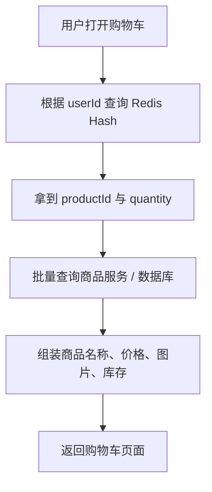
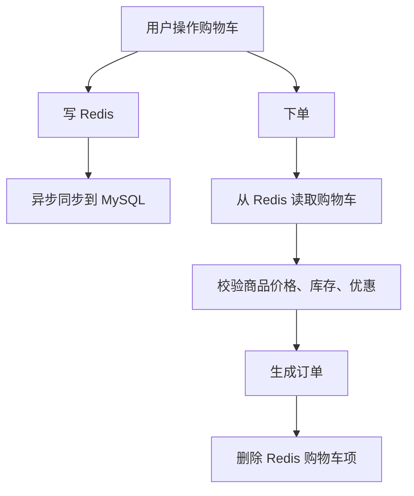
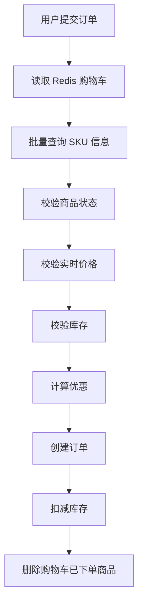

Redis 的 Hash 很适合做**购物车**，因为购物车天然就是这种结构：

```text
一个用户 -> 多个商品 -> 每个商品对应数量 / 商品信息
```

Redis Hash 正好是：

```text
key -> field -> value
```

所以购物车可以建模为：

```text
cart:{userId}
    productId1 -> quantity
    productId2 -> quantity
    productId3 -> quantity
```

例如用户 `1001` 的购物车：

```text
cart:1001
    101 -> 2
    102 -> 1
    205 -> 5
```

含义是：

```text
用户 1001 的购物车中：
商品 101 有 2 件
商品 102 有 1 件
商品 205 有 5 件
```

---

# 1. 为什么用 Redis Hash 做购物车？

因为购物车有几个特点：

|特点|Redis Hash 是否适合|
|---|---|
|按用户隔离|适合，一个用户一个 Hash|
|商品数量频繁修改|适合，`HINCRBY` 原子增减|
|经常查看整个购物车|适合，`HGETALL`|
|经常删除某个商品|适合，`HDEL`|
|数据可以短期缓存|适合，配合 `EXPIRE`|
|不一定要求强持久化|适合，最终可落库|

核心优势是：

> 一个用户的购物车可以作为一个 Redis Hash，商品 ID 作为 field，商品数量作为 value。

---

# 2. 基础命令设计

## 添加商品

```bash
HINCRBY cart:1001 101 1
```

表示：

```text
用户 1001 的购物车中，商品 101 数量 +1
```

如果商品不存在，会自动创建：

```text
cart:1001
    101 -> 1
```

再次执行：

```bash
HINCRBY cart:1001 101 1
```

结果变成：

```text
cart:1001
    101 -> 2
```

---

## 减少商品数量

```bash
HINCRBY cart:1001 101 -1
```

表示商品 `101` 数量减 1。

但是这里要注意：  
不能让数量减成负数。

所以实际业务里不能只靠一条命令，需要配合 Lua 脚本或者应用层校验。

---

## 修改商品数量

```bash
HSET cart:1001 101 3
```

表示直接把商品 `101` 的数量设置为 3。

---

## 查看某个商品数量

```bash
HGET cart:1001 101
```

返回：

```text
3
```

---

## 查看整个购物车

```bash
HGETALL cart:1001
```

返回类似：

```text
101 3
102 1
205 5
```

---

## 删除某个商品

```bash
HDEL cart:1001 101
```

---

## 清空购物车

```bash
DEL cart:1001
```

---

## 统计购物车商品种类数

```bash
HLEN cart:1001
```

注意，这统计的是**商品种类数**，不是商品总件数。

例如：

```text
101 -> 3
102 -> 1
205 -> 5
```

`HLEN` 返回 `3`，不是 `9`。

---

# 3. Java 中怎么做？

假设使用 Spring Boot + `StringRedisTemplate`。

## Redis Key 设计

```java
private String cartKey(Long userId) {
    return "cart:" + userId;
}
```

---

## 添加商品

```java
@Service
public class CartService {

    private final StringRedisTemplate redisTemplate;

    public CartService(StringRedisTemplate redisTemplate) {
        this.redisTemplate = redisTemplate;
    }

    public void addItem(Long userId, Long productId, int quantity) {
        if (quantity <= 0) {
            throw new IllegalArgumentException("quantity must be positive");
        }

        String key = cartKey(userId);
        String field = String.valueOf(productId);

        redisTemplate.opsForHash().increment(key, field, quantity);

        // 购物车长期不操作可以自动过期，例如 30 天
        redisTemplate.expire(key, Duration.ofDays(30));
    }

    private String cartKey(Long userId) {
        return "cart:" + userId;
    }
}
```

这里底层对应 Redis 命令：

```bash
HINCRBY cart:{userId} {productId} {quantity}
EXPIRE cart:{userId} 2592000
```

---

## 修改商品数量

```java
public void updateItemQuantity(Long userId, Long productId, int quantity) {
    String key = cartKey(userId);
    String field = String.valueOf(productId);

    if (quantity <= 0) {
        redisTemplate.opsForHash().delete(key, field);
        return;
    }

    redisTemplate.opsForHash().put(key, field, String.valueOf(quantity));
    redisTemplate.expire(key, Duration.ofDays(30));
}
```

设计习惯上：

```text
quantity <= 0 视为删除商品
quantity > 0 视为设置数量
```

---

## 删除商品

```java
public void removeItem(Long userId, Long productId) {
    String key = cartKey(userId);
    String field = String.valueOf(productId);

    redisTemplate.opsForHash().delete(key, field);
}
```

---

## 查询购物车

```java
public Map<Long, Integer> getCart(Long userId) {
    String key = cartKey(userId);

    Map<Object, Object> entries = redisTemplate.opsForHash().entries(key);

    Map<Long, Integer> result = new HashMap<>();

    for (Map.Entry<Object, Object> entry : entries.entrySet()) {
        Long productId = Long.valueOf(entry.getKey().toString());
        Integer quantity = Integer.valueOf(entry.getValue().toString());

        result.put(productId, quantity);
    }

    return result;
}
```

结果类似：

```json
{
  "101": 2,
  "102": 1,
  "205": 5
}
```

但这只是购物车里的**商品 ID 和数量**。

真正给前端展示时，还要去查商品服务或数据库，补充商品名称、价格、图片、库存等信息。

---

# 4. 完整购物车展示流程

Redis 购物车里只建议存：

```text
productId -> quantity
```

不要把完整商品信息全部塞进去。

展示购物车时流程是：



例如 Redis 里是：

```text
cart:1001
    101 -> 2
    102 -> 1
```

商品服务返回：

```text
101 -> MacBook Pro, 12999, img1
102 -> AirPods Pro, 1899, img2
```

最终返回给前端：

```json
[
  {
    "productId": 101,
    "name": "MacBook Pro",
    "price": 12999,
    "quantity": 2,
    "subtotal": 25998
  },
  {
    "productId": 102,
    "name": "AirPods Pro",
    "price": 1899,
    "quantity": 1,
    "subtotal": 1899
  }
]
```

---

# 5. 为什么不建议把商品详情也存在 Redis Hash 里？

比如这样：

```text
cart:1001
    101 -> {"name":"MacBook Pro","price":12999,"quantity":2}
```

这不是不行，但一般不推荐。

原因：

## 第一，商品价格可能变化

购物车里存了旧价格，商品服务里是新价格，就会出现不一致。

## 第二，商品状态可能变化

商品可能：

```text
下架
库存不足
改价
限购
变更图片
参加活动
```

如果 Redis 里缓存了完整商品快照，展示时可能过期。

## 第三，购物车只应该保存“用户意图”

用户购物车本质上表达的是：

```text
我想买商品 101，数量 2
```

至于商品当前价格、库存、优惠、状态，应该以商品系统和交易系统为准。

所以更合理的是：

```text
Redis 购物车保存：
productId -> quantity

商品详情展示：
实时或缓存查询商品服务
```

---

# 6. 减少商品数量时的原子问题

减少商品数量不能简单写：

```java
redisTemplate.opsForHash().increment(key, field, -1);
```

因为可能变成：

```text
101 -> -1
```

更严谨的做法是使用 Lua 脚本：

```lua
local key = KEYS[1]
local field = ARGV[1]
local delta = tonumber(ARGV[2])

local current = redis.call('HGET', key, field)

if not current then
    return -1
end

current = tonumber(current)
local nextValue = current + delta

if nextValue <= 0 then
    redis.call('HDEL', key, field)
    return 0
else
    redis.call('HSET', key, field, nextValue)
    return nextValue
end
```

含义：

```text
如果商品不存在，返回 -1
如果减少后 <= 0，删除该商品
否则更新为新数量
```

这样可以避免并发下出现数量错误。

---

# 7. Java 调用 Lua 脚本

```java
private static final String UPDATE_CART_ITEM_SCRIPT = """
    local key = KEYS[1]
    local field = ARGV[1]
    local delta = tonumber(ARGV[2])

    local current = redis.call('HGET', key, field)

    if not current then
        return -1
    end

    current = tonumber(current)
    local nextValue = current + delta

    if nextValue <= 0 then
        redis.call('HDEL', key, field)
        return 0
    else
        redis.call('HSET', key, field, nextValue)
        return nextValue
    end
    """;
```

调用：

```java
public Long decreaseItem(Long userId, Long productId, int quantity) {
    if (quantity <= 0) {
        throw new IllegalArgumentException("quantity must be positive");
    }

    String key = cartKey(userId);
    String field = String.valueOf(productId);

    DefaultRedisScript<Long> script = new DefaultRedisScript<>();
    script.setScriptText(UPDATE_CART_ITEM_SCRIPT);
    script.setResultType(Long.class);

    return redisTemplate.execute(
            script,
            Collections.singletonList(key),
            field,
            String.valueOf(-quantity)
    );
}
```

---

# 8. 是否需要设置过期时间？

一般建议设置。

例如：

```bash
EXPIRE cart:1001 2592000
```

表示 30 天过期。

每次用户操作购物车时刷新过期时间：

```java
redisTemplate.expire("cart:" + userId, Duration.ofDays(30));
```

这样可以避免大量长期不活跃用户的购物车占用内存。

但要看业务：

|业务类型|建议|
|---|---|
|游客购物车|一定要设置过期|
|登录用户购物车|Redis 可设置较长过期，同时定期落库|
|强业务要求保留购物车|需要 MySQL 持久化|
|秒杀临时购物车|设置较短 TTL|

---

# 9. 登录用户购物车要不要落库？

看业务要求。

## 只放 Redis

适合：

```text
轻量商城
购物车丢失影响不大
成本敏感
MVP 项目
```

优点：

```text
简单
快
开发成本低
```

缺点：

```text
Redis 数据可能丢失
不适合长期保存
不方便做历史分析
```

---

## Redis + MySQL

适合正式电商业务。

推荐模型：

```text
Redis：承载高频读写
MySQL：承载最终持久化
```

常见方案：



更稳妥的方案是：

```text
用户每次操作：
1. 写 Redis
2. 发消息到 MQ
3. 异步更新 MySQL
```

或者低并发系统里直接：

```text
先写 MySQL，再删 Redis / 更新 Redis
```

---

# 10. 游客购物车和登录购物车合并

实际电商里常见：

```text
未登录时：用 tempCart:{token}
登录后：合并到 cart:{userId}
```

例如游客购物车：

```text
cart:guest:abc123
    101 -> 1
    102 -> 2
```

登录后用户购物车：

```text
cart:user:1001
    101 -> 3
    205 -> 1
```

合并后：

```text
cart:user:1001
    101 -> 4
    102 -> 2
    205 -> 1
```

可以用 `HGETALL` 读取游客购物车，然后逐个 `HINCRBY` 合并到登录用户购物车。

Java 示例：

```java
public void mergeGuestCartToUserCart(String guestToken, Long userId) {
    String guestKey = "cart:guest:" + guestToken;
    String userKey = "cart:user:" + userId;

    Map<Object, Object> guestCart = redisTemplate.opsForHash().entries(guestKey);

    for (Map.Entry<Object, Object> entry : guestCart.entrySet()) {
        String productId = entry.getKey().toString();
        int quantity = Integer.parseInt(entry.getValue().toString());

        redisTemplate.opsForHash().increment(userKey, productId, quantity);
    }

    redisTemplate.delete(guestKey);
    redisTemplate.expire(userKey, Duration.ofDays(30));
}
```

---

# 11. Key 设计建议

推荐：

```text
cart:user:{userId}
cart:guest:{token}
```

例如：

```text
cart:user:1001
cart:guest:7d9f8a2c
```

不要只写：

```text
cart:1001
```

因为以后可能需要区分：

```text
用户购物车
游客购物车
活动购物车
店铺购物车
B端采购车
```

更清晰的 key 设计是：

```text
业务域:实体类型:实体ID
```

例如：

```text
mall:cart:user:1001
mall:cart:guest:7d9f8a2c
```

---

# 12. 一个更完整的购物车 Redis 设计

```text
mall:cart:user:{userId}
    {skuId} -> {quantity}
```

注意这里我更推荐使用 `skuId`，而不是 `productId`。

因为电商中真正购买的通常不是商品，而是 SKU。

例如：

```text
商品：iPhone 15
SKU：
    iPhone 15 黑色 128G
    iPhone 15 黑色 256G
    iPhone 15 白色 128G
```

购物车应该存：

```text
skuId -> quantity
```

而不是：

```text
productId -> quantity
```

因此更准确的结构是：

```text
mall:cart:user:1001
    90001 -> 2
    90002 -> 1
```

含义：

```text
用户 1001 想购买 SKU 90001 两件，SKU 90002 一件
```

---

# 13. 下单时要重新校验

购物车里的数据不能直接信任。

下单时必须重新校验：

```text
1. 商品是否存在
2. SKU 是否有效
3. 是否已下架
4. 库存是否充足
5. 价格是否变化
6. 活动是否有效
7. 用户是否满足购买条件
8. 是否超过限购数量
```

流程：



Redis 购物车只是保存用户选择，不是交易系统的权威数据源。

---

# 14. 面试里怎么说？

可以这样回答：

> Redis Hash 很适合实现购物车。通常一个用户对应一个 Hash，key 是 `cart:user:{userId}`，field 使用 `skuId`，value 保存购买数量。添加商品用 `HINCRBY`，修改数量用 `HSET`，删除商品用 `HDEL`，查看购物车用 `HGETALL`。购物车中只保存 skuId 和 quantity，商品名称、价格、库存等实时信息应该从商品服务查询，避免缓存脏数据。对于减少商品数量、防止负数，可以使用 Lua 脚本保证原子性。正式电商系统中 Redis 主要承担高频读写，MySQL 负责最终持久化，下单时必须重新校验价格、库存、上下架状态和限购规则。

---

# 15. 最小可用方案

如果只是做一个练手项目，购物车可以这样做：

```text
Redis Hash:
mall:cart:user:{userId}
    skuId -> quantity
```

核心命令：

```bash
# 添加商品
HINCRBY mall:cart:user:1001 90001 1

# 设置数量
HSET mall:cart:user:1001 90001 3

# 删除商品
HDEL mall:cart:user:1001 90001

# 查看购物车
HGETALL mall:cart:user:1001

# 清空购物车
DEL mall:cart:user:1001

# 设置过期
EXPIRE mall:cart:user:1001 2592000
```

这就是 Redis Hash 做购物车的核心逻辑。

最关键的设计原则是：

> Redis Hash 里只存 `skuId -> quantity`，不要把购物车当商品数据库。下单时重新查商品、价格、库存，Redis 只表达用户的购买意图。