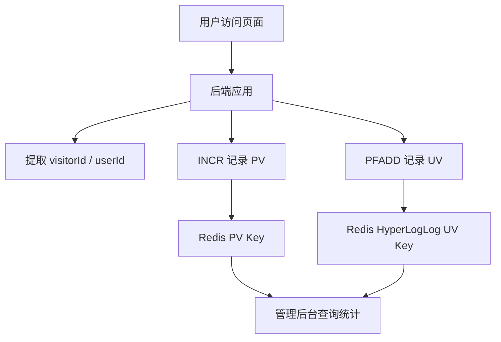

Redis 的 **HyperLogLog** 适合做 **UV 统计**，因为 UV 的本质是：

```text
统计某段时间内有多少“去重后的用户”
```

例如：

```text
今天访问文章 1001 的独立用户数是多少？
今天网站首页的独立访客数是多少？
本周 App 活跃用户数是多少？
```

这些问题都不是统计访问次数，而是统计 **去重后的用户数量**。

---

# 1. PV 和 UV 的区别

先区分两个概念。

|指标|含义|是否去重|Redis 常用结构|
|---|---|--:|---|
|PV|Page View，页面访问次数|不去重|String / INCR|
|UV|Unique Visitor，独立访客数|去重|HyperLogLog / Set / Bitmap|

例如：

```text
用户 A 访问 5 次
用户 B 访问 3 次
用户 C 访问 1 次
```

那么：

```text
PV = 5 + 3 + 1 = 9
UV = A、B、C = 3
```

PV 很简单：

```bash
INCR article:1001:pv:2026-05-07
```

UV 不能简单 `INCR`，因为同一个用户访问多次只能算一次。

---

# 2. 如果不用 HyperLogLog，怎么做 UV？

最直接的方式是用 Redis Set。

```bash
SADD article:1001:uv:2026-05-07 user:1001
SADD article:1001:uv:2026-05-07 user:1002
SADD article:1001:uv:2026-05-07 user:1001
SCARD article:1001:uv:2026-05-07
```

结果是：

```text
2
```

因为 `user:1001` 重复添加不会重复计数。

Set 的优点是：

```text
准确
可以知道具体有哪些用户
```

但缺点很明显：

```text
占内存大
UV 越高，内存越大
```

假设一天有 1000 万 UV，Set 要保存 1000 万个用户 ID，内存压力很高。

这时 HyperLogLog 就有价值了。

---

# 3. HyperLogLog 是什么？

HyperLogLog 是一种**基数统计算法**。

基数就是：

```text
去重后的元素数量
```

例如：

```text
[A, B, C, A, B, D]
```

基数是：

```text
4
```

因为去重后是：

```text
A, B, C, D
```

Redis 的 HyperLogLog 可以用极小的内存估算一个集合的基数。

它适合回答：

```text
这个集合里大约有多少个不同元素？
```

例如：

```text
今天大约有多少个不同用户访问过首页？
```

---

# 4. Redis HyperLogLog 的核心命令

Redis HyperLogLog 常用命令只有三个：

|命令|作用|
|---|---|
|`PFADD`|添加元素|
|`PFCOUNT`|统计基数|
|`PFMERGE`|合并多个 HyperLogLog|

---

## 添加 UV

```bash
PFADD uv:site:2026-05-07 user:1001
PFADD uv:site:2026-05-07 user:1002
PFADD uv:site:2026-05-07 user:1001
```

虽然 `user:1001` 添加了两次，但 UV 只会近似算一次。

---

## 统计 UV

```bash
PFCOUNT uv:site:2026-05-07
```

返回类似：

```text
2
```

注意：这个值是**估算值**，不是绝对精确值。

---

## 合并多天 UV

例如统计 2026-05-01 到 2026-05-07 的周 UV：

```bash
PFMERGE uv:site:week:2026-W19 \
  uv:site:2026-05-01 \
  uv:site:2026-05-02 \
  uv:site:2026-05-03 \
  uv:site:2026-05-04 \
  uv:site:2026-05-05 \
  uv:site:2026-05-06 \
  uv:site:2026-05-07
```

然后：

```bash
PFCOUNT uv:site:week:2026-W19
```

得到这一周的去重 UV 估算值。

---

# 5. 用 HyperLogLog 做网站 UV

## Key 设计

网站整体每日 UV：

```text
uv:site:{yyyy-MM-dd}
```

例如：

```text
uv:site:2026-05-07
```

某篇文章每日 UV：

```text
uv:article:{articleId}:{yyyy-MM-dd}
```

例如：

```text
uv:article:1001:2026-05-07
```

某个接口每日 UV：

```text
uv:api:{apiName}:{yyyy-MM-dd}
```

例如：

```text
uv:api:getProductDetail:2026-05-07
```

---

# 6. 访问页面时怎么记录？

用户访问文章详情页：

```text
GET /articles/1001
```

后端可以做两件事：

```bash
INCR pv:article:1001:2026-05-07
PFADD uv:article:1001:2026-05-07 user:9527
```

对应关系：

|指标|Redis 命令|
|---|---|
|PV|`INCR`|
|UV|`PFADD`|

---

# 7. Java 示例：Spring Boot + StringRedisTemplate

## 统计文章访问

```java
@Service
public class ArticleStatsService {

    private final StringRedisTemplate redisTemplate;

    public ArticleStatsService(StringRedisTemplate redisTemplate) {
        this.redisTemplate = redisTemplate;
    }

    public void recordArticleVisit(Long articleId, Long userId) {
        LocalDate today = LocalDate.now();

        String pvKey = "pv:article:" + articleId + ":" + today;
        String uvKey = "uv:article:" + articleId + ":" + today;

        // PV：访问一次加一次
        redisTemplate.opsForValue().increment(pvKey);

        // UV：同一个用户多次访问，近似只算一次
        redisTemplate.opsForHyperLogLog().add(uvKey, "user:" + userId);

        // 设置过期时间，避免统计 key 永久占用内存
        redisTemplate.expire(pvKey, Duration.ofDays(90));
        redisTemplate.expire(uvKey, Duration.ofDays(90));
    }

    public Long getArticlePv(Long articleId, LocalDate date) {
        String pvKey = "pv:article:" + articleId + ":" + date;
        String value = redisTemplate.opsForValue().get(pvKey);
        return value == null ? 0L : Long.parseLong(value);
    }

    public Long getArticleUv(Long articleId, LocalDate date) {
        String uvKey = "uv:article:" + articleId + ":" + date;
        return redisTemplate.opsForHyperLogLog().size(uvKey);
    }
}
```

---

# 8. 游客用户怎么办？

UV 的关键是：

```text
你用什么标识一个“独立访客”
```

登录用户可以用：

```text
userId
```

未登录用户可以用：

```text
visitorId
```

例如第一次访问时给浏览器写一个 Cookie：

```text
visitor_id=8f4a6b2c-xxxx-xxxx
```

然后统计 UV 时使用：

```bash
PFADD uv:site:2026-05-07 visitor:8f4a6b2c
```

如果既支持登录用户，也支持游客，可以这样设计：

```text
登录用户：user:{userId}
游客用户：visitor:{visitorId}
```

例如：

```bash
PFADD uv:site:2026-05-07 user:1001
PFADD uv:site:2026-05-07 visitor:abc123
```

---

# 9. 一个现实问题：游客登录后怎么算？

比如用户未登录时：

```text
visitor:abc123
```

登录后变成：

```text
user:1001
```

如果当天都记录了：

```bash
PFADD uv:site:2026-05-07 visitor:abc123
PFADD uv:site:2026-05-07 user:1001
```

那么从统计视角看，可能会被算成两个独立访客。

这就是 UV 统计中的身份归并问题。

简单系统可以接受这个误差。  
复杂系统需要做用户身份映射，例如：

```text
visitorId -> userId
```

然后在登录后统一使用 `userId`，或者在离线数仓中做更精确的归并。

对于普通业务系统，Redis HyperLogLog 通常用于实时趋势统计，允许一定误差。

---

# 10. HyperLogLog 的最大特点：省内存，但有误差

Redis HyperLogLog 的优势是内存占用非常小。

不管你添加多少个不同用户，一个 HyperLogLog key 的空间基本是固定量级。

这很适合：

```text
千万级 UV
亿级 UV
大量页面的 UV 统计
长期留存趋势统计
```

但是它不是精确统计。

它的代价是：

```text
不能返回具体用户列表
统计结果有误差
不能删除单个用户
不能判断某个用户是否访问过
```

---

# 11. HyperLogLog vs Set vs Bitmap

## 对比表

|方案|是否精确|内存占用|能否列出用户|能否删除用户|适合场景|
|---|--:|--:|--:|--:|---|
|Set|精确|高|可以|可以|小规模精确 UV|
|Bitmap|精确|低到中|不方便|可以置 0，但语义复杂|用户 ID 连续的签到/活跃统计|
|HyperLogLog|近似|极低|不可以|不可以|大规模 UV 趋势统计|

---

## 什么时候用 Set？

适合：

```text
UV 不大
需要精确去重
需要知道具体用户
```

例如：

```text
某活动页面有多少人报名
某篇内部文章有哪些员工看过
某优惠券有哪些用户领取过
```

---

## 什么时候用 Bitmap？

适合：

```text
用户 ID 是数字且相对连续
需要按天统计活跃、签到、打卡
```

例如：

```bash
SETBIT active:2026-05-07 1001 1
BITCOUNT active:2026-05-07
```

但是如果用户 ID 很稀疏，比如：

```text
1000000000001
9999999999999
```

Bitmap 会浪费空间。

---

## 什么时候用 HyperLogLog？

适合：

```text
只关心大概有多少个独立用户
不关心具体是谁
允许小误差
数据规模很大
```

例如：

```text
网站每日 UV
App 每日活跃设备数
文章阅读 UV
接口访问 UV
广告曝光 UV
活动页面 UV
```

---

# 12. HyperLogLog 做 UV 的典型架构



---

# 13. 日 UV、周 UV、月 UV 怎么做？

有两种做法。

---

## 方案一：每天一个 HLL，查询时合并

每日 UV：

```text
uv:site:2026-05-01
uv:site:2026-05-02
uv:site:2026-05-03
```

查询周 UV 时：

```bash
PFMERGE uv:site:tmp:week:2026-W19 \
  uv:site:2026-05-01 \
  uv:site:2026-05-02 \
  uv:site:2026-05-03 \
  uv:site:2026-05-04 \
  uv:site:2026-05-05 \
  uv:site:2026-05-06 \
  uv:site:2026-05-07

PFCOUNT uv:site:tmp:week:2026-W19
```

优点：

```text
灵活，可以临时统计任意时间范围
```

缺点：

```text
查询时需要合并，范围越大成本越高
```

---

## 方案二：写入时同时写日、周、月

用户访问时同时写：

```bash
PFADD uv:site:day:2026-05-07 user:1001
PFADD uv:site:week:2026-W19 user:1001
PFADD uv:site:month:2026-05 user:1001
```

优点：

```text
查询快
```

缺点：

```text
写入放大，一次访问写多个 key
```

普通业务可以用方案二，后台统计体验更好。

---

# 14. Java 示例：同时统计日、周、月 UV

```java
@Service
public class SiteUvService {

    private final StringRedisTemplate redisTemplate;

    public SiteUvService(StringRedisTemplate redisTemplate) {
        this.redisTemplate = redisTemplate;
    }

    public void recordVisit(String visitorIdentity) {
        LocalDate today = LocalDate.now();

        WeekFields weekFields = WeekFields.ISO;
        int week = today.get(weekFields.weekOfWeekBasedYear());
        int weekYear = today.get(weekFields.weekBasedYear());

        String dayKey = "uv:site:day:" + today;
        String weekKey = "uv:site:week:" + weekYear + "-W" + week;
        String monthKey = "uv:site:month:" + today.getYear() + "-" +
                String.format("%02d", today.getMonthValue());

        redisTemplate.opsForHyperLogLog().add(dayKey, visitorIdentity);
        redisTemplate.opsForHyperLogLog().add(weekKey, visitorIdentity);
        redisTemplate.opsForHyperLogLog().add(monthKey, visitorIdentity);

        redisTemplate.expire(dayKey, Duration.ofDays(90));
        redisTemplate.expire(weekKey, Duration.ofDays(180));
        redisTemplate.expire(monthKey, Duration.ofDays(730));
    }

    public Long getDailyUv(LocalDate date) {
        return redisTemplate.opsForHyperLogLog()
                .size("uv:site:day:" + date);
    }

    public Long getMonthlyUv(YearMonth month) {
        String monthKey = "uv:site:month:" + month;
        return redisTemplate.opsForHyperLogLog().size(monthKey);
    }
}
```

---

# 15. 文章 UV 统计怎么设计？

对博客系统来说，可以这样设计。

## 每篇文章每日 UV

```text
uv:article:{articleId}:day:{yyyy-MM-dd}
```

例如：

```text
uv:article:272:day:2026-05-07
```

访问文章时：

```bash
PFADD uv:article:272:day:2026-05-07 user:1001
```

查询：

```bash
PFCOUNT uv:article:272:day:2026-05-07
```

---

## 每篇文章总 UV

可以写一个累计 key：

```text
uv:article:{articleId}:total
```

访问时同时写：

```bash
PFADD uv:article:272:day:2026-05-07 user:1001
PFADD uv:article:272:total user:1001
```

这样可以快速查询文章累计 UV：

```bash
PFCOUNT uv:article:272:total
```

缺点是：

```text
total key 会长期存在
如果文章很多，会增加 key 数量
```

但 HyperLogLog 本身内存很小，所以一般可以接受。

---

# 16. HyperLogLog 的注意事项

## 第一，不能用于精确计费

例如广告扣费：

```text
每一个独立用户曝光一次就要扣钱
```

这种场景不能只用 HyperLogLog，因为它有误差。

更适合：

```text
Set
Bitmap
数据库去重
离线数仓精确计算
```

---

## 第二，不能判断用户是否访问过

HyperLogLog 只能统计数量，不能查：

```text
user:1001 是否访问过？
```

没有类似这样的命令：

```bash
PFEXISTS uv:site:2026-05-07 user:1001
```

如果你需要判断用户是否访问过，要用 Set 或 Bitmap。

---

## 第三，不能删除单个元素

如果用户访问后又要撤销记录，HyperLogLog 做不到。

例如：

```text
把 user:1001 从 UV 里删除
```

这不是 HyperLogLog 的适用场景。

---

## 第四，低基数时误差可能比较明显

如果你的 UV 本来就很小，比如：

```text
5
10
20
```

那用 HyperLogLog 的意义不大。

小规模精确统计直接用 Set 更好。

---

# 17. 生产级建议

## 普通实时统计

```text
PV：Redis String + INCR
UV：Redis HyperLogLog + PFADD
定期落库：MySQL / ClickHouse / Doris / PostgreSQL
```

例如每日凌晨把统计结果落到表里：

```text
article_stats_daily
    article_id
    stat_date
    pv
    uv
    like_count
    comment_count
```

Redis 负责实时，数据库负责报表和历史查询。

---

## 高精度数据分析

如果是严肃的数据分析系统，建议：

```text
前端/后端埋点
  ↓
Kafka / MQ
  ↓
Flink / Spark
  ↓
ClickHouse / Doris / Hive
  ↓
BI 报表
```

Redis HyperLogLog 更适合做：

```text
实时看板
近似趋势
轻量统计
业务后台快速展示
```

不适合替代完整的数据仓库。

---

# 18. 面试里怎么说？

可以这样回答：

> Redis HyperLogLog 适合做 UV 统计，因为 UV 本质是统计去重后的访问用户数量，也就是基数统计。我们可以按照日期设计 key，例如 `uv:article:{articleId}:day:{date}`，用户访问时使用 `PFADD` 把 `userId` 或 `visitorId` 加进去，查询时用 `PFCOUNT` 得到 UV。它的优点是内存占用非常小，适合大规模 UV 近似统计；缺点是结果有误差，不能返回具体用户，不能判断某个用户是否访问过，也不能删除单个用户。因此它适合实时趋势统计，不适合精确计费、风控判重等强精确场景。

---

# 19. 最小实现模型

## Redis Key

```text
uv:site:day:2026-05-07
pv:site:day:2026-05-07
```

## 访问时

```bash
INCR pv:site:day:2026-05-07
PFADD uv:site:day:2026-05-07 user:1001
```

## 查询时

```bash
GET pv:site:day:2026-05-07
PFCOUNT uv:site:day:2026-05-07
```

核心就是：

```text
PV 用 INCR
UV 用 PFADD + PFCOUNT
```

再压缩成一句话：

> Redis HyperLogLog 做 UV，就是把每天访问过的 `userId / visitorId` 放进对应日期的 HLL key 里，用 `PFCOUNT` 近似统计去重人数，用极低内存换取可接受误差。