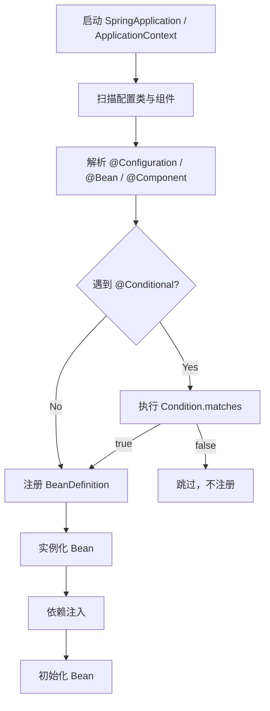

[[ChatGPT生成内容更具可读性]]
[[Spring Condition第二版]]
试试有没有用，这次还加上了/study and learn 模式

---
# Spring Condition 机制：一句话先抓住本质

**Spring Condition 机制 = 在 Bean 注册阶段，根据某些条件决定“这个 Bean / 配置类要不要进入 Spring 容器”。**

它不是控制对象运行逻辑的 `if else`，而是控制：

```text
这个 BeanDefinition 要不要注册？
这个 @Configuration 要不要生效？
这个自动配置类要不要加载？
```

Spring 官方对 `@Conditional` 的定义就是：当指定的所有条件都匹配时，组件才有资格被注册；条件判断发生在 BeanDefinition 注册之前。([Home](https://docs.spring.io/spring-framework/docs/current/javadoc-api/org/springframework/context/annotation/Conditional.html?utm_source=chatgpt.com "Conditional (Spring Framework 7.0.5 API)"))

---

# 1. 你应该先把 Condition 放在 Spring 生命周期里的位置

很多人学 Condition 会绕晕，是因为不知道它发生在哪个阶段。



关键点：

> **Condition 判断发生在 Bean 实例化之前。**

所以它判断的是：

```text
配置属性是否存在
classpath 里有没有某个类
容器里是否已经有某个 BeanDefinition
当前 profile 是什么
当前运行环境是什么
```

而不是判断：

```text
某个 Bean 运行时状态是什么
某个业务对象字段值是什么
某个用户请求参数是什么
```

---

# 2. Condition 解决的核心问题

它主要解决这类问题：

```text
同一套代码，在不同环境、不同依赖、不同配置下，自动启用不同 Bean。
```

常见场景：

|场景|不用 Condition 的问题|用 Condition 的效果|
|---|---|---|
|开关功能|代码里到处 `if enabled`|启动时直接决定 Bean 是否存在|
|多环境切换|dev/test/prod 配置混乱|按环境加载不同 Bean|
|自动配置|starter 一引入就可能冲突|只有满足条件才装配|
|默认实现兜底|用户自定义 Bean 会被覆盖|用户没定义时才提供默认 Bean|
|可选依赖|缺少 class 就启动失败|class 存在才加载相关配置|

Spring Boot 的自动配置大量依赖这套机制。Boot 官方也明确建议，在自定义 auto-configuration 时通常要配合一个或多个 `@Conditional` 注解，典型例子是 `@ConditionalOnMissingBean`，让开发者可以覆盖默认配置。([Home](https://docs.spring.io/spring-boot/docs/2.0.6.RELEASE/reference/html/boot-features-developing-auto-configuration.html?utm_source=chatgpt.com "47. Creating Your Own Auto-configuration - Spring"))

---

# 3. 最底层用法：`@Conditional + Condition`

## 3.1 需求：只有开启配置时才注册 Bean

假设你有一个短信服务：

```java
public interface SmsService {
    void send(String phone, String content);
}
```

默认实现：

```java
public class AliyunSmsService implements SmsService {
    @Override
    public void send(String phone, String content) {
        System.out.println("Send SMS by Aliyun");
    }
}
```

你希望只有配置了：

```yaml
sms:
  enabled: true
```

才注册这个 Bean。

---

## 3.2 自定义 Condition

```java
import org.springframework.context.annotation.Condition;
import org.springframework.context.annotation.ConditionContext;
import org.springframework.core.type.AnnotatedTypeMetadata;

public class SmsEnabledCondition implements Condition {

    @Override
    public boolean matches(
            ConditionContext context,
            AnnotatedTypeMetadata metadata
    ) {
        String enabled = context.getEnvironment()
                .getProperty("sms.enabled");

        return "true".equalsIgnoreCase(enabled);
    }
}
```

这里的核心是 `matches()`。

```java
return true;  // 注册 Bean
return false; // 不注册 Bean
```

---

## 3.3 使用 `@Conditional`

```java
import org.springframework.context.annotation.Bean;
import org.springframework.context.annotation.Conditional;
import org.springframework.context.annotation.Configuration;

@Configuration
public class SmsConfig {

    @Bean
    @Conditional(SmsEnabledCondition.class)
    public SmsService smsService() {
        return new AliyunSmsService();
    }
}
```

效果：

```yaml
sms:
  enabled: true
```

容器里有：

```text
SmsService -> AliyunSmsService
```

如果配置是：

```yaml
sms:
  enabled: false
```

或者没配置：

```text
SmsService 不会被注册
```

---

# 4. 但实际开发中：不要一上来就自己写 Condition

实际项目里，**优先使用 Spring Boot 提供的条件注解**。

因为 Spring Boot 已经把常见判断封装好了。

## 常用 Condition 注解速查

| 注解                                | 判断条件               | 常见用途          |
| --------------------------------- | ------------------ | ------------- |
| `@ConditionalOnProperty`          | 配置项是否存在 / 是否等于指定值  | 功能开关          |
| `@ConditionalOnClass`             | classpath 是否存在某个类  | starter 自动配置  |
| `@ConditionalOnMissingClass`      | classpath 是否不存在某个类 | 兼容可选依赖        |
| `@ConditionalOnBean`              | 容器中是否已有某个 Bean     | 依赖其他 Bean 才加载 |
| `@ConditionalOnMissingBean`       | 容器中是否没有某个 Bean     | 默认实现兜底        |
| `@ConditionalOnExpression`        | SpEL 表达式是否成立       | 复杂条件，不建议滥用    |
| `@ConditionalOnWebApplication`    | 是否 Web 应用          | Web 场景配置      |
| `@ConditionalOnNotWebApplication` | 是否非 Web 应用         | CLI / 后台任务配置  |
| `@Profile`                        | 当前 profile 是否匹配    | 环境隔离          |

Spring Boot 这些注解本质上也是基于 Spring Framework 的 `@Conditional` 扩展出来的。([Home](https://docs.spring.io/spring-boot/docs/2.0.6.RELEASE/reference/html/boot-features-developing-auto-configuration.html?utm_source=chatgpt.com "47. Creating Your Own Auto-configuration - Spring"))

---

# 5. 用法一：`@ConditionalOnProperty` 做功能开关

这是业务项目里最常用的。

## 场景

是否开启短信功能：

```yaml
sms:
  enabled: true
```

代码：

```java
import org.springframework.boot.autoconfigure.condition.ConditionalOnProperty;
import org.springframework.context.annotation.Bean;
import org.springframework.context.annotation.Configuration;

@Configuration
public class SmsConfig {

    @Bean
    @ConditionalOnProperty(
            prefix = "sms",
            name = "enabled",
            havingValue = "true",
            matchIfMissing = false
    )
    public SmsService smsService() {
        return new AliyunSmsService();
    }
}
```

含义：

```text
读取 sms.enabled
如果值是 true，则注册 smsService
否则不注册
```

## 参数解释

|参数|含义|
|---|---|
|`prefix`|配置前缀|
|`name`|配置名|
|`havingValue`|期望值|
|`matchIfMissing`|配置缺失时是否匹配|

推荐写法：

```java
@ConditionalOnProperty(
    prefix = "feature.payment",
    name = "enabled",
    havingValue = "true",
    matchIfMissing = false
)
```

不推荐：

```java
@ConditionalOnProperty("feature.payment.enabled")
```

因为语义不够清楚。

---

# 6. 用法二：`@ConditionalOnMissingBean` 做默认实现

这是写 starter、组件库、基础设施代码时最常用的。

## 场景

你写了一个支付组件，默认提供 `DefaultPayClient`。

但如果业务方自己定义了 `PayClient`，就应该优先使用业务方的。

```java
public interface PayClient {
    void pay(String orderId);
}
```

默认实现：

```java
public class DefaultPayClient implements PayClient {
    @Override
    public void pay(String orderId) {
        System.out.println("Default pay: " + orderId);
    }
}
```

配置类：

```java
import org.springframework.boot.autoconfigure.condition.ConditionalOnMissingBean;
import org.springframework.context.annotation.Bean;
import org.springframework.context.annotation.Configuration;

@Configuration
public class PayAutoConfiguration {

    @Bean
    @ConditionalOnMissingBean(PayClient.class)
    public PayClient payClient() {
        return new DefaultPayClient();
    }
}
```

效果：

```text
如果用户没定义 PayClient：
    注册 DefaultPayClient

如果用户自己定义了 PayClient：
    跳过 DefaultPayClient
```

这就是 Spring Boot starter 的典型设计思想：

> **框架给默认值，用户可覆盖。**

---

# 7. 用法三：`@ConditionalOnClass` 做可选依赖适配

## 场景

如果项目引入了 Redis，就启用 Redis 缓存实现。

如果没有 Redis 依赖，就不要加载 Redis 相关 Bean，避免启动报错。

```java
import org.springframework.boot.autoconfigure.condition.ConditionalOnClass;
import org.springframework.context.annotation.Bean;
import org.springframework.context.annotation.Configuration;
import org.springframework.data.redis.core.RedisTemplate;

@Configuration
@ConditionalOnClass(RedisTemplate.class)
public class RedisCacheConfig {

    @Bean
    public CacheService redisCacheService(RedisTemplate<String, Object> redisTemplate) {
        return new RedisCacheService(redisTemplate);
    }
}
```

含义：

```text
classpath 中存在 RedisTemplate
=> 说明项目引入了 spring-data-redis
=> 启用 RedisCacheConfig
```

这类用法特别适合 starter：

```text
用户引入了某个依赖，自动启用相关能力；
用户没引入，就什么都不做。
```

---

# 8. 用法四：`@ConditionalOnBean` 表示“依赖某个 Bean 才启用”

## 场景

只有系统中存在 `DataSource`，才启用数据库审计功能。

```java
import javax.sql.DataSource;

import org.springframework.boot.autoconfigure.condition.ConditionalOnBean;
import org.springframework.context.annotation.Bean;
import org.springframework.context.annotation.Configuration;

@Configuration
public class AuditConfig {

    @Bean
    @ConditionalOnBean(DataSource.class)
    public AuditService auditService(DataSource dataSource) {
        return new DbAuditService(dataSource);
    }
}
```

语义：

```text
没有 DataSource，就别创建 AuditService。
```

这种设计适合：

```text
某个能力依赖另一个基础设施能力。
```

比如：

```text
有 DataSource 才启用 DB 审计
有 RedisTemplate 才启用 Redis 分布式锁
有 MeterRegistry 才启用监控埋点
有 ObjectMapper 才启用 JSON 序列化扩展
```

---

# 9. 用法五：`@Profile` 做环境隔离

`@Profile` 也可以理解成一种条件装配。

## 场景

开发环境用 mock 支付，生产环境用真实支付。

```java
import org.springframework.context.annotation.Bean;
import org.springframework.context.annotation.Configuration;
import org.springframework.context.annotation.Profile;

@Configuration
public class PayConfig {

    @Bean
    @Profile("dev")
    public PayClient mockPayClient() {
        return new MockPayClient();
    }

    @Bean
    @Profile("prod")
    public PayClient realPayClient() {
        return new RealPayClient();
    }
}
```

配置：

```yaml
spring:
  profiles:
    active: dev
```

效果：

```text
dev  环境：注册 MockPayClient
prod 环境：注册 RealPayClient
```

## 什么时候用 `@Profile`，什么时候用 `@ConditionalOnProperty`？

|需求|推荐|
|---|---|
|dev/test/prod 环境切换|`@Profile`|
|某个功能是否开启|`@ConditionalOnProperty`|
|用户可配置组件行为|`@ConditionalOnProperty`|
|starter 默认装配|`@ConditionalOnMissingBean`|
|判断依赖是否存在|`@ConditionalOnClass`|

---

# 10. 自定义组合注解：让业务语义更清楚

如果项目里大量使用：

```java
@ConditionalOnProperty(
    prefix = "sms",
    name = "enabled",
    havingValue = "true",
    matchIfMissing = false
)
```

可以封装成业务注解：

```java
import org.springframework.boot.autoconfigure.condition.ConditionalOnProperty;

import java.lang.annotation.*;

@Target({ElementType.TYPE, ElementType.METHOD})
@Retention(RetentionPolicy.RUNTIME)
@Documented
@ConditionalOnProperty(
        prefix = "sms",
        name = "enabled",
        havingValue = "true",
        matchIfMissing = false
)
public @interface ConditionalOnSmsEnabled {
}
```

使用：

```java
@Configuration
public class SmsConfig {

    @Bean
    @ConditionalOnSmsEnabled
    public SmsService smsService() {
        return new AliyunSmsService();
    }
}
```

这样代码语义更业务化：

```text
不是“当 sms.enabled = true 时注册”
而是“当短信功能开启时注册”
```

这在中大型项目里很有价值。

---

# 11. Condition 和普通 `if else` 的区别

这是容易混淆的点。

## 普通 if else

```java
if (smsEnabled) {
    smsService.send(...);
}
```

特点：

```text
Bean 已经存在
运行时判断
业务代码里到处出现开关判断
```

## Condition

```java
@ConditionalOnProperty(...)
@Bean
public SmsService smsService() { ... }
```

特点：

```text
Bean 可能根本不存在
启动阶段判断
业务代码不关心这个 Bean 是否应该被创建
```

对比：

|维度|`if else`|`Condition`|
|---|---|---|
|发生阶段|运行时|容器启动时|
|控制对象|业务逻辑|Bean 注册|
|Bean 是否存在|一般存在|可能不存在|
|适合场景|请求级、业务级判断|环境级、配置级、依赖级判断|
|代码位置|Service 方法内部|Configuration / Bean 定义处|

判断标准：

> **如果条件决定“某段业务逻辑怎么执行”，用 if。  
> 如果条件决定“某个 Bean 要不要存在”，用 Condition。**

---

# 12. Condition 的常见坑

## 坑一：在 Condition 里依赖 Bean 实例

错误倾向：

```java
public boolean matches(ConditionContext context, AnnotatedTypeMetadata metadata) {
    MyService myService = context.getBeanFactory().getBean(MyService.class);
    return myService.isEnabled();
}
```

不建议这样做。

原因是 Condition 执行时 Bean 可能还没实例化。Spring 官方也提醒，Condition 要遵守类似 `BeanFactoryPostProcessor` 的限制，不应与 Bean 实例交互。([Home](https://docs.spring.io/spring-framework/docs/current/javadoc-api/org/springframework/context/annotation/Condition.html?utm_source=chatgpt.com "Condition (Spring Framework 7.0.6 API)"))

Condition 适合读取：

```text
Environment
BeanDefinitionRegistry
ClassLoader
ResourceLoader
Annotation metadata
```

不适合读取：

```text
业务 Bean 的运行状态
数据库里的配置
远程接口返回值
当前用户请求
```

---

## 坑二：以为 Condition 是动态开关

例如：

```yaml
sms:
  enabled: false
```

应用启动后，`SmsService` 没有注册。

你运行时把配置中心里的值改成：

```yaml
sms:
  enabled: true
```

不代表 Bean 会自动出现。

因为 Condition 是启动阶段判断，不是每次调用时判断。

如果需要运行时动态开关，应该考虑：

```text
配置中心 + RefreshScope
Feature Flag
业务侧开关判断
策略路由
```

不要单纯依赖 Condition。

---

## 坑三：多个条件都要满足

```java
@Bean
@ConditionalOnClass(RedisTemplate.class)
@ConditionalOnProperty(prefix = "cache.redis", name = "enabled", havingValue = "true")
@ConditionalOnMissingBean(CacheService.class)
public CacheService redisCacheService() {
    return new RedisCacheService();
}
```

这表示：

```text
classpath 有 RedisTemplate
并且 cache.redis.enabled=true
并且容器里没有 CacheService
=> 才注册 RedisCacheService
```

多个 `@Conditional` 类注解通常是 **AND 关系**。

---

# 13. 项目里应该怎么用：推荐分层

我建议你把 Condition 用法分成三层。

```mermaid
flowchart TD
    A[业务项目] --> B[功能开关]
    A --> C[环境隔离]
    A --> D[默认实现]

    B --> B1[@ConditionalOnProperty]
    C --> C1[@Profile]
    D --> D1[@ConditionalOnMissingBean]

    E[基础组件 / Starter] --> F[可选依赖]
    E --> G[默认 Bean]
    E --> H[组合条件]

    F --> F1[@ConditionalOnClass]
    G --> G1[@ConditionalOnMissingBean]
    H --> H1[自定义组合注解]

    I[特殊复杂场景] --> J[自定义 Condition]
```

实际优先级：

```text
1. 能用 Spring Boot 内置条件注解，就别自己写 Condition
2. 重复条件多了，封装组合注解
3. 只有内置注解表达不了，才自定义 Condition
```

---

# 14. 一个接近真实项目的例子：通知模块

假设系统有通知能力：

```text
通知方式：
- 邮件
- 短信
- 企业微信
```

配置：

```yaml
notify:
  email:
    enabled: true
  sms:
    enabled: false
  wecom:
    enabled: true
```

接口：

```java
public interface Notifier {
    void notify(String target, String content);
}
```

邮件通知：

```java
public class EmailNotifier implements Notifier {
    @Override
    public void notify(String target, String content) {
        System.out.println("Email notify");
    }
}
```

短信通知：

```java
public class SmsNotifier implements Notifier {
    @Override
    public void notify(String target, String content) {
        System.out.println("SMS notify");
    }
}
```

企业微信通知：

```java
public class WecomNotifier implements Notifier {
    @Override
    public void notify(String target, String content) {
        System.out.println("WeCom notify");
    }
}
```

配置类：

```java
@Configuration
public class NotifyConfig {

    @Bean
    @ConditionalOnProperty(
            prefix = "notify.email",
            name = "enabled",
            havingValue = "true"
    )
    public Notifier emailNotifier() {
        return new EmailNotifier();
    }

    @Bean
    @ConditionalOnProperty(
            prefix = "notify.sms",
            name = "enabled",
            havingValue = "true"
    )
    public Notifier smsNotifier() {
        return new SmsNotifier();
    }

    @Bean
    @ConditionalOnProperty(
            prefix = "notify.wecom",
            name = "enabled",
            havingValue = "true"
    )
    public Notifier wecomNotifier() {
        return new WecomNotifier();
    }
}
```

业务服务：

```java
import java.util.List;

public class NotifyService {

    private final List<Notifier> notifiers;

    public NotifyService(List<Notifier> notifiers) {
        this.notifiers = notifiers;
    }

    public void send(String target, String content) {
        for (Notifier notifier : notifiers) {
            notifier.notify(target, content);
        }
    }
}
```

效果：

```text
notify.email.enabled=true  => EmailNotifier 进入 List
notify.sms.enabled=false   => SmsNotifier 不进入 List
notify.wecom.enabled=true  => WecomNotifier 进入 List
```

这就是 Condition 的实际价值：

> **业务代码只依赖 List，不关心哪些实现被启用。  
> 哪些实现进入容器，由配置和条件装配决定。**

---

# 15. 一句话总结

Spring Condition 机制的核心不是“条件判断”，而是：

```text
把 Bean 是否注册这件事，从业务代码里剥离出来，
交给 Spring 容器在启动阶段根据环境、配置、依赖、已有 Bean 来决定。
```

你可以这样记：

```text
if else：控制代码怎么跑
Condition：控制 Bean 是否存在
```

## 实战选择口诀

```text
功能开关：@ConditionalOnProperty
环境切换：@Profile
默认兜底：@ConditionalOnMissingBean
依赖存在才启用：@ConditionalOnClass
依赖 Bean 才启用：@ConditionalOnBean
表达不了：自定义 Condition
重复太多：封装组合注解
```

给你一个小检查题：  
如果你在写一个 Redis 分布式锁 starter，希望“项目引入 Redis 依赖时才启用，并且用户自定义 LockClient 时不要覆盖”，你觉得应该组合哪两个条件注解？