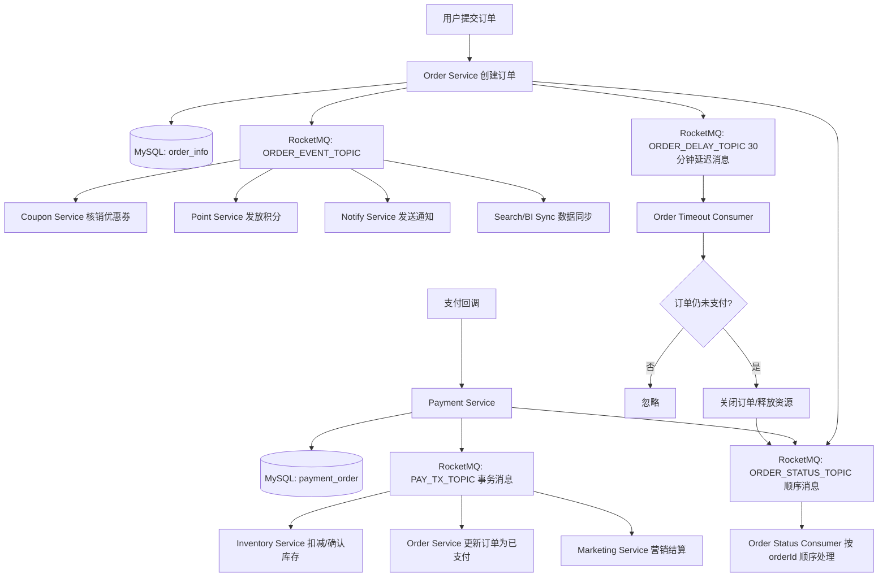

# 0. 先给结论

这个案例不要把 RocketMQ 当成“发个消息就完事”的工具，而要按**分布式业务事件基础设施**设计。

电商订单系统里 RocketMQ 的核心职责是：

|场景|RocketMQ 能解决什么|RocketMQ 不能替你解决什么|
|---|---|---|
|订单创建后异步处理|解耦优惠券、积分、通知、数据同步|下游业务幂等、业务回滚|
|支付成功事务消息|保证“本地支付状态更新”和“消息投递”最终一致|不保证下游消费一定成功，需要消费重试和补偿|
|30 分钟未支付关闭订单|用延迟消息替代部分定时轮询|不适合做精确到毫秒的强实时调度|
|同订单状态顺序处理|保证同一个订单维度的事件有序|不能保证全局所有订单有序|
|消费端可靠性|重试、死信、消费位点管理|业务幂等、告警、人工补偿仍要自己做|

RocketMQ 官方明确支持同步/异步/单向发送、顺序消息、事务消息、延迟消息、Tag 过滤、消息轨迹等能力；Spring Boot 集成通常使用 `rocketmq-spring-boot-starter`。([GitHub](https://github.com/apache/rocketmq-spring "GitHub - apache/rocketmq-spring: Apache RocketMQ Spring Integration · GitHub"))

---

# 1. 整体架构设计

## 1.1 业务链路



## 1.2 核心设计原则

### 原则 1：业务事件要有唯一事件 ID

每条消息必须带：

```text
eventId
bizNo，例如 orderNo / payNo
eventType
occurredAt
traceId
```

`eventId` 用于消息幂等，`bizNo` 用于业务查询和顺序路由。

---

### 原则 2：消费者必须幂等

RocketMQ 消息语义不是“业务层 exactly-once”。生产环境要按**至少一次投递**来设计，所以消费者必须能接受重复消息。

典型幂等方式：

```text
先插入 consume_message_log
插入成功 → 说明第一次消费 → 执行业务
插入失败 → 说明已消费过 → 直接返回成功
```

---

### 原则 3：事务消息只保证“本地事务 + 发消息”的最终一致

RocketMQ 事务消息的机制是：先发送半消息，Broker 保存但不投递；Producer 执行本地事务；本地事务成功后提交消息，失败则回滚；如果 Producer 异常，Broker 会回查本地事务状态。官方文档也明确事务消息用于保证消息生产和本地事务之间的最终一致性。([rocketmq.apache.org](https://rocketmq.apache.org/docs/featureBehavior/04transactionmessage/ "Transaction Message | RocketMQ"))

注意：事务消息**不保证下游消费成功**。下游仍然需要幂等、重试、死信和补偿。

---

### 原则 4：延迟消息适合“超时检查”，不是直接“强制关闭”

30 分钟未支付关闭订单的正确姿势不是：

```text
延迟消息到了 → 直接关闭订单
```

而是：

```text
延迟消息到了 → 查询订单当前状态 → 仍是待支付才关闭
```

因为用户可能已经支付成功，只是支付消息、订单状态消息存在时间差。

---

### 原则 5：顺序消息只做“局部有序”

订单系统不需要所有订单全局有序，只需要：

```text
同一个 orderNo 的状态变更有序
```

RocketMQ 顺序消息依赖 MessageQueue / MessageGroup 维度。官方文档强调顺序消息按消息组实现 FIFO，不同消息组之间不保证顺序。([rocketmq.apache.org](https://rocketmq.apache.org/docs/featureBehavior/03fifomessage/ "Ordered Message | RocketMQ"))

---

# 2. Topic / Tag / ConsumerGroup 设计

## 2.1 Topic 设计

|Topic|类型|用途|
|---|---|---|
|`ORDER_EVENT_TOPIC`|普通消息|订单创建后的异步业务事件|
|`PAY_TX_TOPIC`|事务消息|支付成功事件|
|`ORDER_DELAY_TOPIC`|延迟消息|订单超时关闭、支付超时检查|
|`ORDER_STATUS_TOPIC`|顺序消息|同一订单状态流转事件|
|`%DLQ%xxx`|死信队列|消费失败超过重试次数后的消息|

---

## 2.2 Tag 设计

### `ORDER_EVENT_TOPIC`

|Tag|说明|消费方|
|---|---|---|
|`ORDER_CREATED`|订单创建成功|优惠券、积分、通知、数据同步|
|`ORDER_CANCELLED`|订单取消|优惠券返还、库存释放|
|`ORDER_COMPLETED`|订单完成|售后、积分确认|

### `PAY_TX_TOPIC`

|Tag|说明|
|---|---|
|`PAY_SUCCESS`|支付成功|
|`PAY_REFUND`|退款成功|

### `ORDER_DELAY_TOPIC`

|Tag|说明|
|---|---|
|`ORDER_PAY_TIMEOUT`|订单 30 分钟未支付关闭|
|`PAY_COMPENSATION_CHECK`|支付超时补偿检查|

### `ORDER_STATUS_TOPIC`

|Tag|说明|
|---|---|
|`ORDER_STATUS_CHANGED`|订单状态变更|

---

## 2.3 ConsumerGroup 设计

|ConsumerGroup|订阅 Topic|作用|
|---|---|---|
|`coupon-order-created-cg`|`ORDER_EVENT_TOPIC:ORDER_CREATED`|优惠券核销|
|`point-order-created-cg`|`ORDER_EVENT_TOPIC:ORDER_CREATED`|积分发放|
|`notify-order-created-cg`|`ORDER_EVENT_TOPIC:ORDER_CREATED`|通知服务|
|`sync-order-created-cg`|`ORDER_EVENT_TOPIC:ORDER_CREATED`|数据同步|
|`inventory-pay-success-cg`|`PAY_TX_TOPIC:PAY_SUCCESS`|库存确认|
|`order-pay-success-cg`|`PAY_TX_TOPIC:PAY_SUCCESS`|订单支付状态确认|
|`marketing-pay-success-cg`|`PAY_TX_TOPIC:PAY_SUCCESS`|营销结算|
|`order-timeout-cg`|`ORDER_DELAY_TOPIC:ORDER_PAY_TIMEOUT`|订单超时关闭|
|`pay-compensation-cg`|`ORDER_DELAY_TOPIC:PAY_COMPENSATION_CHECK`|支付补偿|
|`order-status-cg`|`ORDER_STATUS_TOPIC:ORDER_STATUS_CHANGED`|顺序处理订单状态|

---

# 3. 数据库表设计

以下表以 MySQL 8 为例。

## 3.1 订单主表

```sql
CREATE TABLE order_info (
    id BIGINT UNSIGNED NOT NULL AUTO_INCREMENT COMMENT '主键',
    order_no VARCHAR(64) NOT NULL COMMENT '订单号',
    user_id BIGINT UNSIGNED NOT NULL COMMENT '用户ID',
    total_amount DECIMAL(18,2) NOT NULL COMMENT '订单总金额',
    pay_amount DECIMAL(18,2) NOT NULL COMMENT '应付金额',
    order_status VARCHAR(32) NOT NULL COMMENT '订单状态: CREATED, PAID, CLOSED, CANCELLED, FINISHED',
    pay_status VARCHAR(32) NOT NULL COMMENT '支付状态: UNPAID, PAID, REFUNDING, REFUNDED',
    coupon_id BIGINT UNSIGNED DEFAULT NULL COMMENT '优惠券ID',
    version INT NOT NULL DEFAULT 0 COMMENT '乐观锁版本号',
    created_at DATETIME NOT NULL,
    updated_at DATETIME NOT NULL,
    paid_at DATETIME DEFAULT NULL,
    closed_at DATETIME DEFAULT NULL,
    PRIMARY KEY (id),
    UNIQUE KEY uk_order_no (order_no),
    KEY idx_user_created (user_id, created_at),
    KEY idx_status_created (order_status, created_at)
) ENGINE=InnoDB DEFAULT CHARSET=utf8mb4 COMMENT='订单表';
```

---

## 3.2 支付单表

```sql
CREATE TABLE payment_order (
    id BIGINT UNSIGNED NOT NULL AUTO_INCREMENT,
    pay_no VARCHAR(64) NOT NULL COMMENT '支付单号',
    order_no VARCHAR(64) NOT NULL COMMENT '订单号',
    user_id BIGINT UNSIGNED NOT NULL,
    pay_amount DECIMAL(18,2) NOT NULL,
    pay_status VARCHAR(32) NOT NULL COMMENT 'INIT, SUCCESS, FAILED, CLOSED',
    channel_trade_no VARCHAR(128) DEFAULT NULL COMMENT '三方支付流水号',
    paid_at DATETIME DEFAULT NULL,
    version INT NOT NULL DEFAULT 0,
    created_at DATETIME NOT NULL,
    updated_at DATETIME NOT NULL,
    PRIMARY KEY (id),
    UNIQUE KEY uk_pay_no (pay_no),
    UNIQUE KEY uk_order_no (order_no),
    KEY idx_channel_trade_no (channel_trade_no)
) ENGINE=InnoDB DEFAULT CHARSET=utf8mb4 COMMENT='支付单表';
```

---

## 3.3 消息幂等表

```sql
CREATE TABLE mq_consume_log (
    id BIGINT UNSIGNED NOT NULL AUTO_INCREMENT,
    consumer_group VARCHAR(128) NOT NULL COMMENT '消费者组',
    topic VARCHAR(128) NOT NULL,
    tag VARCHAR(64) NOT NULL,
    msg_key VARCHAR(128) NOT NULL COMMENT '业务消息key，通常为eventId',
    biz_no VARCHAR(64) NOT NULL COMMENT '业务单号',
    consume_status VARCHAR(32) NOT NULL COMMENT 'CONSUMING, SUCCESS, FAILED',
    retry_count INT NOT NULL DEFAULT 0,
    error_message VARCHAR(1024) DEFAULT NULL,
    consumed_at DATETIME DEFAULT NULL,
    created_at DATETIME NOT NULL,
    updated_at DATETIME NOT NULL,
    PRIMARY KEY (id),
    UNIQUE KEY uk_group_msg_key (consumer_group, msg_key),
    KEY idx_biz_no (biz_no),
    KEY idx_status_created (consume_status, created_at)
) ENGINE=InnoDB DEFAULT CHARSET=utf8mb4 COMMENT='MQ消费幂等表';
```

设计要点：

```text
consumer_group + msg_key 唯一
```

同一条消息被同一个消费组重复投递时，只允许第一次真正执行业务。

---

## 3.4 业务流水表：优惠券核销流水

```sql
CREATE TABLE coupon_use_flow (
    id BIGINT UNSIGNED NOT NULL AUTO_INCREMENT,
    flow_no VARCHAR(64) NOT NULL COMMENT '流水号',
    order_no VARCHAR(64) NOT NULL,
    coupon_id BIGINT UNSIGNED NOT NULL,
    user_id BIGINT UNSIGNED NOT NULL,
    use_status VARCHAR(32) NOT NULL COMMENT 'USED, ROLLBACK',
    source_event_id VARCHAR(128) NOT NULL COMMENT '来源事件ID',
    created_at DATETIME NOT NULL,
    updated_at DATETIME NOT NULL,
    PRIMARY KEY (id),
    UNIQUE KEY uk_order_coupon (order_no, coupon_id),
    UNIQUE KEY uk_source_event (source_event_id),
    KEY idx_user_id (user_id)
) ENGINE=InnoDB DEFAULT CHARSET=utf8mb4 COMMENT='优惠券核销流水';
```

---

## 3.5 订单状态流水表

```sql
CREATE TABLE order_status_flow (
    id BIGINT UNSIGNED NOT NULL AUTO_INCREMENT,
    order_no VARCHAR(64) NOT NULL,
    from_status VARCHAR(32) NOT NULL,
    to_status VARCHAR(32) NOT NULL,
    event_id VARCHAR(128) NOT NULL,
    remark VARCHAR(255) DEFAULT NULL,
    created_at DATETIME NOT NULL,
    PRIMARY KEY (id),
    UNIQUE KEY uk_event_id (event_id),
    KEY idx_order_no_created (order_no, created_at)
) ENGINE=InnoDB DEFAULT CHARSET=utf8mb4 COMMENT='订单状态变更流水';
```

---

## 3.6 补偿任务表

```sql
CREATE TABLE mq_compensation_task (
    id BIGINT UNSIGNED NOT NULL AUTO_INCREMENT,
    task_no VARCHAR(64) NOT NULL,
    biz_type VARCHAR(64) NOT NULL COMMENT 'ORDER_TIMEOUT, PAY_SUCCESS_SYNC, COUPON_USE',
    biz_no VARCHAR(64) NOT NULL,
    task_status VARCHAR(32) NOT NULL COMMENT 'INIT, PROCESSING, SUCCESS, FAILED',
    next_retry_time DATETIME NOT NULL,
    retry_count INT NOT NULL DEFAULT 0,
    max_retry_count INT NOT NULL DEFAULT 10,
    error_message VARCHAR(1024) DEFAULT NULL,
    created_at DATETIME NOT NULL,
    updated_at DATETIME NOT NULL,
    PRIMARY KEY (id),
    UNIQUE KEY uk_task_no (task_no),
    KEY idx_status_retry_time (task_status, next_retry_time),
    KEY idx_biz_no (biz_no)
) ENGINE=InnoDB DEFAULT CHARSET=utf8mb4 COMMENT='MQ补偿任务表';
```

补偿任务表用于处理：

```text
消息发送失败
消费死信后的人工/自动补偿
支付状态和订单状态不一致
延迟消息丢失或异常滞后时的兜底扫描
```

---

# 4. Spring Boot 项目结构

```text
mall-order/
├── pom.xml
└── src/main/java/com/example/mall/order
    ├── MallOrderApplication.java
    ├── common
    │   ├── exception/BizException.java
    │   ├── trace/TraceContext.java
    │   └── util/JacksonUtils.java
    ├── config
    │   └── RocketMqTopicProperties.java
    ├── mq
    │   ├── constant/MqConstants.java
    │   ├── dto/BaseEvent.java
    │   ├── dto/OrderCreatedEvent.java
    │   ├── dto/PaymentSuccessEvent.java
    │   ├── dto/OrderTimeoutEvent.java
    │   ├── dto/OrderStatusChangedEvent.java
    │   ├── producer/OrderEventProducer.java
    │   ├── producer/PaymentTransactionProducer.java
    │   ├── consumer/CouponOrderCreatedConsumer.java
    │   ├── consumer/OrderTimeoutConsumer.java
    │   ├── consumer/OrderStatusChangedConsumer.java
    │   ├── tx/PaymentTransactionListener.java
    │   └── idempotent/MqIdempotentService.java
    ├── order
    │   ├── controller/OrderController.java
    │   ├── service/OrderService.java
    │   ├── service/impl/OrderServiceImpl.java
    │   ├── repository/OrderRepository.java
    │   └── entity/OrderInfo.java
    ├── payment
    │   ├── controller/PaymentController.java
    │   ├── service/PaymentService.java
    │   └── service/impl/PaymentServiceImpl.java
    └── infra
        ├── mapper/OrderInfoMapper.java
        ├── mapper/PaymentOrderMapper.java
        ├── mapper/MqConsumeLogMapper.java
        └── mapper/MqCompensationTaskMapper.java
```

说明：真实生产项目建议拆成多个服务：`order-service`、`payment-service`、`coupon-service`、`inventory-service`、`notify-service`。这里为了教学放在一个工程里，但包结构按服务边界拆开。

---

# 5. Maven 依赖

```xml
<dependencies>
    <!-- Web -->
    <dependency>
        <groupId>org.springframework.boot</groupId>
        <artifactId>spring-boot-starter-web</artifactId>
    </dependency>

    <!-- Validation -->
    <dependency>
        <groupId>org.springframework.boot</groupId>
        <artifactId>spring-boot-starter-validation</artifactId>
    </dependency>

    <!-- MyBatis Plus，也可以换成 MyBatis / JPA -->
    <dependency>
        <groupId>com.baomidou</groupId>
        <artifactId>mybatis-plus-spring-boot3-starter</artifactId>
        <version>3.5.9</version>
    </dependency>

    <!-- MySQL Driver -->
    <dependency>
        <groupId>com.mysql</groupId>
        <artifactId>mysql-connector-j</artifactId>
        <scope>runtime</scope>
    </dependency>

    <!-- RocketMQ Spring Boot Starter -->
    <dependency>
        <groupId>org.apache.rocketmq</groupId>
        <artifactId>rocketmq-spring-boot-starter</artifactId>
        <version>2.3.1</version>
    </dependency>

    <!-- Jackson JSR310 时间序列化 -->
    <dependency>
        <groupId>com.fasterxml.jackson.datatype</groupId>
        <artifactId>jackson-datatype-jsr310</artifactId>
    </dependency>

    <!-- Lombok，生产环境可用，但团队需统一规范 -->
    <dependency>
        <groupId>org.projectlombok</groupId>
        <artifactId>lombok</artifactId>
        <optional>true</optional>
    </dependency>

    <!-- Actuator 监控 -->
    <dependency>
        <groupId>org.springframework.boot</groupId>
        <artifactId>spring-boot-starter-actuator</artifactId>
    </dependency>
</dependencies>
```

说明：

- `rocketmq-spring-boot-starter` 是 RocketMQ 官方 Spring 集成项目提供的 Starter。
    
- 官方 RocketMQ Spring 项目支持同步发送、异步发送、顺序消息、事务消息、延迟级别消息、消费模式、Tag 过滤、消息轨迹等能力。([GitHub](https://github.com/apache/rocketmq-spring "GitHub - apache/rocketmq-spring: Apache RocketMQ Spring Integration · GitHub"))
    
- 如果你使用 RocketMQ 5.x 新客户端，需要评估 `rocketmq-v5-client-spring-boot-starter`。本文为了贴近大量 Java 后端项目实践，使用经典 RocketMQ Spring Boot Starter 写法。
    

---

# 6. application.yml

```yaml
server:
  port: 8080

spring:
  application:
    name: mall-order-service

  datasource:
    url: jdbc:mysql://127.0.0.1:3306/mall_order?useUnicode=true&characterEncoding=utf8&serverTimezone=Asia/Shanghai
    username: root
    password: root
    driver-class-name: com.mysql.cj.jdbc.Driver

mybatis-plus:
  mapper-locations: classpath*:/mapper/**/*.xml
  configuration:
    map-underscore-to-camel-case: true

rocketmq:
  name-server: 127.0.0.1:9876

  producer:
    group: mall-order-producer-group
    send-message-timeout: 3000
    retry-times-when-send-failed: 2
    retry-times-when-send-async-failed: 2
    max-message-size: 4194304

logging:
  level:
    com.example.mall.order: info

management:
  endpoints:
    web:
      exposure:
        include: health,info,metrics,prometheus
```

生产建议：

```yaml
rocketmq:
  name-server: rmq-ns-1:9876;rmq-ns-2:9876
```

不要单点 NameServer。

---

# 7. 消息 DTO 设计

## 7.1 基础事件

```java
package com.example.mall.order.mq.dto;

import lombok.Data;

import java.io.Serializable;
import java.time.LocalDateTime;

/**
 * 所有 MQ 事件的基础字段。
 *
 * 设计重点：
 * 1. eventId 用于消息幂等。
 * 2. traceId 用于日志追踪。
 * 3. occurredAt 用于排查消息延迟。
 * 4. eventType 用于业务识别。
 */
@Data
public abstract class BaseEvent implements Serializable {

    private String eventId;

    private String eventType;

    private String traceId;

    private LocalDateTime occurredAt;

    private String sourceService;
}
```

---

## 7.2 订单创建事件

```java
package com.example.mall.order.mq.dto;

import lombok.Data;
import lombok.EqualsAndHashCode;

import java.math.BigDecimal;

/**
 * 订单创建成功事件。
 */
@Data
@EqualsAndHashCode(callSuper = true)
public class OrderCreatedEvent extends BaseEvent {

    private String orderNo;

    private Long userId;

    private BigDecimal totalAmount;

    private BigDecimal payAmount;

    private Long couponId;
}
```

设计意图：

- 不要把整个订单表对象塞进消息。
    
- 消息只传递下游需要的最小字段。
    
- 下游如需强一致的最新状态，应根据 `orderNo` 回查订单服务或查询自身同步库。
    

---

## 7.3 支付成功事件

```java
package com.example.mall.order.mq.dto;

import lombok.Data;
import lombok.EqualsAndHashCode;

import java.math.BigDecimal;
import java.time.LocalDateTime;

/**
 * 支付成功事件。
 */
@Data
@EqualsAndHashCode(callSuper = true)
public class PaymentSuccessEvent extends BaseEvent {

    private String payNo;

    private String orderNo;

    private Long userId;

    private BigDecimal payAmount;

    private String channelTradeNo;

    private LocalDateTime paidAt;
}
```

---

## 7.4 订单超时事件

```java
package com.example.mall.order.mq.dto;

import lombok.Data;
import lombok.EqualsAndHashCode;

import java.time.LocalDateTime;

/**
 * 订单支付超时检查事件。
 */
@Data
@EqualsAndHashCode(callSuper = true)
public class OrderTimeoutEvent extends BaseEvent {

    private String orderNo;

    private Long userId;

    private LocalDateTime expectedCloseAt;
}
```

---

## 7.5 订单状态变更事件

```java
package com.example.mall.order.mq.dto;

import lombok.Data;
import lombok.EqualsAndHashCode;

/**
 * 订单状态变更事件。
 *
 * 用于顺序消息。
 */
@Data
@EqualsAndHashCode(callSuper = true)
public class OrderStatusChangedEvent extends BaseEvent {

    private String orderNo;

    private String fromStatus;

    private String toStatus;

    private String reason;
}
```

---

# 8. MQ 常量

```java
package com.example.mall.order.mq.constant;

public final class MqConstants {

    private MqConstants() {
    }

    public static final String ORDER_EVENT_TOPIC = "ORDER_EVENT_TOPIC";
    public static final String PAY_TX_TOPIC = "PAY_TX_TOPIC";
    public static final String ORDER_DELAY_TOPIC = "ORDER_DELAY_TOPIC";
    public static final String ORDER_STATUS_TOPIC = "ORDER_STATUS_TOPIC";

    public static final String TAG_ORDER_CREATED = "ORDER_CREATED";
    public static final String TAG_PAY_SUCCESS = "PAY_SUCCESS";
    public static final String TAG_ORDER_PAY_TIMEOUT = "ORDER_PAY_TIMEOUT";
    public static final String TAG_PAY_COMPENSATION_CHECK = "PAY_COMPENSATION_CHECK";
    public static final String TAG_ORDER_STATUS_CHANGED = "ORDER_STATUS_CHANGED";

    public static final String CG_COUPON_ORDER_CREATED = "coupon-order-created-cg";
    public static final String CG_ORDER_TIMEOUT = "order-timeout-cg";
    public static final String CG_ORDER_STATUS = "order-status-cg";

    public static String destination(String topic, String tag) {
        return topic + ":" + tag;
    }
}
```

---

# 9. Producer：订单创建成功后发送普通消息

## 9.1 OrderEventProducer

```java
package com.example.mall.order.mq.producer;

import com.example.mall.order.mq.constant.MqConstants;
import com.example.mall.order.mq.dto.OrderCreatedEvent;
import com.example.mall.order.mq.dto.OrderStatusChangedEvent;
import com.example.mall.order.mq.dto.OrderTimeoutEvent;
import lombok.RequiredArgsConstructor;
import lombok.extern.slf4j.Slf4j;
import org.apache.rocketmq.spring.core.RocketMQTemplate;
import org.springframework.messaging.support.MessageBuilder;
import org.springframework.stereotype.Component;

import java.time.LocalDateTime;

@Slf4j
@Component
@RequiredArgsConstructor
public class OrderEventProducer {

    private final RocketMQTemplate rocketMQTemplate;

    /**
     * 发送订单创建事件。
     */
    public void sendOrderCreatedEvent(OrderCreatedEvent event) {
        String destination = MqConstants.destination(
                MqConstants.ORDER_EVENT_TOPIC,
                MqConstants.TAG_ORDER_CREATED
        );

        rocketMQTemplate.syncSend(destination, MessageBuilder.withPayload(event)
                .setHeader("KEYS", event.getEventId())
                .setHeader("TRACE_ID", event.getTraceId())
                .build());

        log.info("订单创建事件发送成功, orderNo={}, eventId={}, traceId={}",
                event.getOrderNo(), event.getEventId(), event.getTraceId());
    }

    /**
     * 发送订单30分钟超时关闭延迟消息。
     *
     * RocketMQ 4.x 延迟消息使用 delay level。
     * 官方文档中 level=16 表示 30min。
     */
    public void sendOrderPayTimeoutDelayMessage(OrderTimeoutEvent event) {
        String destination = MqConstants.destination(
                MqConstants.ORDER_DELAY_TOPIC,
                MqConstants.TAG_ORDER_PAY_TIMEOUT
        );

        int delayLevel30Min = 16;

        rocketMQTemplate.syncSend(
                destination,
                MessageBuilder.withPayload(event)
                        .setHeader("KEYS", event.getEventId())
                        .setHeader("TRACE_ID", event.getTraceId())
                        .build(),
                3000,
                delayLevel30Min
        );

        log.info("订单超时延迟消息发送成功, orderNo={}, expectedCloseAt={}, eventId={}",
                event.getOrderNo(), event.getExpectedCloseAt(), event.getEventId());
    }

    /**
     * 发送同一个订单维度的顺序消息。
     *
     * hashKey 使用 orderNo，保证同一订单进入同一个队列。
     */
    public void sendOrderStatusChangedOrderedMessage(OrderStatusChangedEvent event) {
        String destination = MqConstants.destination(
                MqConstants.ORDER_STATUS_TOPIC,
                MqConstants.TAG_ORDER_STATUS_CHANGED
        );

        String hashKey = event.getOrderNo();

        rocketMQTemplate.syncSendOrderly(
                destination,
                MessageBuilder.withPayload(event)
                        .setHeader("KEYS", event.getEventId())
                        .setHeader("TRACE_ID", event.getTraceId())
                        .build(),
                hashKey
        );

        log.info("订单状态顺序消息发送成功, orderNo={}, from={}, to={}, eventId={}",
                event.getOrderNo(), event.getFromStatus(), event.getToStatus(), event.getEventId());
    }
}
```

设计意图：

- `destination = topic:tag` 是 RocketMQ Spring 常用写法。
    
- 普通订单事件用 `syncSend`，可靠性优先。
    
- 延迟消息用 `syncSend(destination, message, timeout, delayLevel)`。
    
- 顺序消息用 `syncSendOrderly(destination, message, hashKey)`。
    
- `hashKey = orderNo`，保证同一订单的状态消息落到同一队列。
    

RocketMQ 4.x 延迟消息默认支持 18 个延迟级别，其中 level 16 是 30 分钟。([rocketmq.apache.org](https://rocketmq.apache.org/zh/docs/4.x/producer/04message3/ "延迟消息发送 | RocketMQ"))

---

# 10. 订单创建业务代码

## 10.1 OrderService

```java
package com.example.mall.order.order.service;

import java.math.BigDecimal;

public interface OrderService {

    String createOrder(Long userId, BigDecimal totalAmount, Long couponId);

    void closeOrderIfUnpaid(String orderNo, String sourceEventId);

    void markOrderPaid(String orderNo, String sourceEventId);
}
```

---

## 10.2 OrderServiceImpl

```java
package com.example.mall.order.order.service.impl;

import com.example.mall.order.mq.dto.OrderCreatedEvent;
import com.example.mall.order.mq.dto.OrderStatusChangedEvent;
import com.example.mall.order.mq.dto.OrderTimeoutEvent;
import com.example.mall.order.mq.producer.OrderEventProducer;
import com.example.mall.order.order.entity.OrderInfo;
import com.example.mall.order.order.mapper.OrderInfoMapper;
import com.example.mall.order.order.service.OrderService;
import lombok.RequiredArgsConstructor;
import org.springframework.stereotype.Service;
import org.springframework.transaction.annotation.Transactional;

import java.math.BigDecimal;
import java.time.LocalDateTime;
import java.util.UUID;

@Service
@RequiredArgsConstructor
public class OrderServiceImpl implements OrderService {

    private final OrderInfoMapper orderInfoMapper;
    private final OrderEventProducer orderEventProducer;

    @Override
    @Transactional(rollbackFor = Exception.class)
    public String createOrder(Long userId, BigDecimal totalAmount, Long couponId) {
        String orderNo = generateOrderNo();

        OrderInfo order = new OrderInfo();
        order.setOrderNo(orderNo);
        order.setUserId(userId);
        order.setTotalAmount(totalAmount);
        order.setPayAmount(totalAmount);
        order.setCouponId(couponId);
        order.setOrderStatus("CREATED");
        order.setPayStatus("UNPAID");
        order.setCreatedAt(LocalDateTime.now());
        order.setUpdatedAt(LocalDateTime.now());

        orderInfoMapper.insert(order);

        String traceId = UUID.randomUUID().toString();

        OrderCreatedEvent createdEvent = new OrderCreatedEvent();
        createdEvent.setEventId(UUID.randomUUID().toString());
        createdEvent.setEventType("ORDER_CREATED");
        createdEvent.setTraceId(traceId);
        createdEvent.setOccurredAt(LocalDateTime.now());
        createdEvent.setSourceService("mall-order-service");
        createdEvent.setOrderNo(orderNo);
        createdEvent.setUserId(userId);
        createdEvent.setTotalAmount(totalAmount);
        createdEvent.setPayAmount(totalAmount);
        createdEvent.setCouponId(couponId);

        orderEventProducer.sendOrderCreatedEvent(createdEvent);

        OrderTimeoutEvent timeoutEvent = new OrderTimeoutEvent();
        timeoutEvent.setEventId(UUID.randomUUID().toString());
        timeoutEvent.setEventType("ORDER_PAY_TIMEOUT");
        timeoutEvent.setTraceId(traceId);
        timeoutEvent.setOccurredAt(LocalDateTime.now());
        timeoutEvent.setSourceService("mall-order-service");
        timeoutEvent.setOrderNo(orderNo);
        timeoutEvent.setUserId(userId);
        timeoutEvent.setExpectedCloseAt(LocalDateTime.now().plusMinutes(30));

        orderEventProducer.sendOrderPayTimeoutDelayMessage(timeoutEvent);

        OrderStatusChangedEvent statusEvent = new OrderStatusChangedEvent();
        statusEvent.setEventId(UUID.randomUUID().toString());
        statusEvent.setEventType("ORDER_STATUS_CHANGED");
        statusEvent.setTraceId(traceId);
        statusEvent.setOccurredAt(LocalDateTime.now());
        statusEvent.setSourceService("mall-order-service");
        statusEvent.setOrderNo(orderNo);
        statusEvent.setFromStatus("NONE");
        statusEvent.setToStatus("CREATED");
        statusEvent.setReason("用户创建订单");

        orderEventProducer.sendOrderStatusChangedOrderedMessage(statusEvent);

        return orderNo;
    }

    @Override
    @Transactional(rollbackFor = Exception.class)
    public void closeOrderIfUnpaid(String orderNo, String sourceEventId) {
        OrderInfo order = orderInfoMapper.selectByOrderNo(orderNo);
        if (order == null) {
            return;
        }

        if (!"CREATED".equals(order.getOrderStatus()) || !"UNPAID".equals(order.getPayStatus())) {
            return;
        }

        int updated = orderInfoMapper.closeUnpaidOrder(orderNo, order.getVersion(), LocalDateTime.now());
        if (updated == 0) {
            throw new IllegalStateException("关闭订单失败，可能发生并发状态变更, orderNo=" + orderNo);
        }
    }

    @Override
    @Transactional(rollbackFor = Exception.class)
    public void markOrderPaid(String orderNo, String sourceEventId) {
        OrderInfo order = orderInfoMapper.selectByOrderNo(orderNo);
        if (order == null) {
            throw new IllegalArgumentException("订单不存在, orderNo=" + orderNo);
        }

        if ("PAID".equals(order.getOrderStatus()) && "PAID".equals(order.getPayStatus())) {
            return;
        }

        if (!"CREATED".equals(order.getOrderStatus())) {
            throw new IllegalStateException("订单状态不允许支付, orderNo=" + orderNo);
        }

        int updated = orderInfoMapper.markPaid(orderNo, order.getVersion(), LocalDateTime.now());
        if (updated == 0) {
            throw new IllegalStateException("更新订单支付状态失败, orderNo=" + orderNo);
        }
    }

    private String generateOrderNo() {
        return "O" + System.currentTimeMillis() + UUID.randomUUID().toString().replace("-", "").substring(0, 8);
    }
}
```

设计意图：

- 订单创建后同步发送普通消息和延迟消息。
    
- 严格来说，`createOrder()` 里“本地事务提交”和“普通消息发送”之间仍可能不一致。
    
- 更严谨的生产做法是使用**本地消息表 Outbox**，订单事务内插入本地消息表，再由后台任务投递 RocketMQ。
    
- 这里为了突出 RocketMQ 使用方式，先展示直接发送；支付场景会用事务消息解决本地事务与消息发送一致性。
    

---

# 11. 消费端幂等处理代码

## 11.1 MqIdempotentService

```java
package com.example.mall.order.mq.idempotent;

public interface MqIdempotentService {

    boolean beginConsume(String consumerGroup, String topic, String tag, String msgKey, String bizNo);

    void markSuccess(String consumerGroup, String msgKey);

    void markFailed(String consumerGroup, String msgKey, Exception exception);
}
```

---

## 11.2 MqIdempotentServiceImpl

```java
package com.example.mall.order.mq.idempotent;

import com.example.mall.order.infra.entity.MqConsumeLog;
import com.example.mall.order.infra.mapper.MqConsumeLogMapper;
import lombok.RequiredArgsConstructor;
import lombok.extern.slf4j.Slf4j;
import org.springframework.dao.DuplicateKeyException;
import org.springframework.stereotype.Service;

import java.time.LocalDateTime;

@Slf4j
@Service
@RequiredArgsConstructor
public class MqIdempotentServiceImpl implements MqIdempotentService {

    private final MqConsumeLogMapper mqConsumeLogMapper;

    @Override
    public boolean beginConsume(String consumerGroup, String topic, String tag, String msgKey, String bizNo) {
        MqConsumeLog logEntity = new MqConsumeLog();
        logEntity.setConsumerGroup(consumerGroup);
        logEntity.setTopic(topic);
        logEntity.setTag(tag);
        logEntity.setMsgKey(msgKey);
        logEntity.setBizNo(bizNo);
        logEntity.setConsumeStatus("CONSUMING");
        logEntity.setRetryCount(0);
        logEntity.setCreatedAt(LocalDateTime.now());
        logEntity.setUpdatedAt(LocalDateTime.now());

        try {
            mqConsumeLogMapper.insert(logEntity);
            return true;
        } catch (DuplicateKeyException duplicateKeyException) {
            MqConsumeLog existing = mqConsumeLogMapper.selectByGroupAndMsgKey(consumerGroup, msgKey);

            if (existing != null && "SUCCESS".equals(existing.getConsumeStatus())) {
                log.info("消息已消费成功，跳过重复消费, consumerGroup={}, msgKey={}", consumerGroup, msgKey);
                return false;
            }

            log.warn("消息正在消费或之前失败，将交给 RocketMQ 重试, consumerGroup={}, msgKey={}, status={}",
                    consumerGroup, msgKey, existing == null ? null : existing.getConsumeStatus());

            throw duplicateKeyException;
        }
    }

    @Override
    public void markSuccess(String consumerGroup, String msgKey) {
        mqConsumeLogMapper.updateStatus(
                consumerGroup,
                msgKey,
                "SUCCESS",
                null,
                LocalDateTime.now(),
                LocalDateTime.now()
        );
    }

    @Override
    public void markFailed(String consumerGroup, String msgKey, Exception exception) {
        String errorMessage = exception.getMessage();
        if (errorMessage != null && errorMessage.length() > 1000) {
            errorMessage = errorMessage.substring(0, 1000);
        }

        mqConsumeLogMapper.updateFailed(
                consumerGroup,
                msgKey,
                "FAILED",
                errorMessage,
                LocalDateTime.now()
        );
    }
}
```

设计意图：

- 利用数据库唯一键做幂等，简单可靠。
    
- 已成功消费的重复消息直接跳过，并返回消费成功。
    
- 之前失败或正在消费的消息，可以让 RocketMQ 继续重试。
    
- 生产环境还可以增加 `CONSUMING` 超时恢复逻辑，避免服务宕机后状态卡死。
    

---

# 12. Consumer：订单创建后优惠券核销

```java
package com.example.mall.order.mq.consumer;

import com.example.mall.order.mq.constant.MqConstants;
import com.example.mall.order.mq.dto.OrderCreatedEvent;
import com.example.mall.order.mq.idempotent.MqIdempotentService;
import com.example.mall.order.promotion.service.CouponService;
import lombok.RequiredArgsConstructor;
import lombok.extern.slf4j.Slf4j;
import org.apache.rocketmq.spring.annotation.ConsumeMode;
import org.apache.rocketmq.spring.annotation.MessageModel;
import org.apache.rocketmq.spring.annotation.RocketMQMessageListener;
import org.apache.rocketmq.spring.core.RocketMQListener;
import org.springframework.stereotype.Component;
import org.springframework.transaction.annotation.Transactional;

@Slf4j
@Component
@RequiredArgsConstructor
@RocketMQMessageListener(
        topic = MqConstants.ORDER_EVENT_TOPIC,
        selectorExpression = MqConstants.TAG_ORDER_CREATED,
        consumerGroup = MqConstants.CG_COUPON_ORDER_CREATED,
        consumeMode = ConsumeMode.CONCURRENTLY,
        messageModel = MessageModel.CLUSTERING
)
public class CouponOrderCreatedConsumer implements RocketMQListener<OrderCreatedEvent> {

    private final MqIdempotentService mqIdempotentService;
    private final CouponService couponService;

    @Override
    @Transactional(rollbackFor = Exception.class)
    public void onMessage(OrderCreatedEvent event) {
        String consumerGroup = MqConstants.CG_COUPON_ORDER_CREATED;

        boolean firstConsume = mqIdempotentService.beginConsume(
                consumerGroup,
                MqConstants.ORDER_EVENT_TOPIC,
                MqConstants.TAG_ORDER_CREATED,
                event.getEventId(),
                event.getOrderNo()
        );

        if (!firstConsume) {
            return;
        }

        try {
            if (event.getCouponId() != null) {
                couponService.useCoupon(
                        event.getUserId(),
                        event.getCouponId(),
                        event.getOrderNo(),
                        event.getEventId()
                );
            }

            mqIdempotentService.markSuccess(consumerGroup, event.getEventId());

            log.info("优惠券核销消费成功, orderNo={}, couponId={}, eventId={}",
                    event.getOrderNo(), event.getCouponId(), event.getEventId());

        } catch (Exception ex) {
            mqIdempotentService.markFailed(consumerGroup, event.getEventId(), ex);

            log.error("优惠券核销消费失败, orderNo={}, eventId={}",
                    event.getOrderNo(), event.getEventId(), ex);

            throw ex;
        }
    }
}
```

设计意图：

- 优惠券核销必须幂等，避免重复扣券。
    
- `CouponService.useCoupon()` 内部还要有业务唯一键，例如 `uk_order_coupon(order_no, coupon_id)`。
    
- MQ 幂等表解决“消息维度重复”，业务流水唯一键解决“业务动作重复”。
    

---

# 13. CouponService 示例

```java
package com.example.mall.order.promotion.service.impl;

import com.example.mall.order.promotion.entity.CouponUseFlow;
import com.example.mall.order.promotion.mapper.CouponUseFlowMapper;
import com.example.mall.order.promotion.service.CouponService;
import lombok.RequiredArgsConstructor;
import org.springframework.stereotype.Service;

import java.time.LocalDateTime;
import java.util.UUID;

@Service
@RequiredArgsConstructor
public class CouponServiceImpl implements CouponService {

    private final CouponUseFlowMapper couponUseFlowMapper;

    @Override
    public void useCoupon(Long userId, Long couponId, String orderNo, String sourceEventId) {
        CouponUseFlow existing = couponUseFlowMapper.selectByOrderNoAndCouponId(orderNo, couponId);
        if (existing != null) {
            return;
        }

        CouponUseFlow flow = new CouponUseFlow();
        flow.setFlowNo("CUF" + UUID.randomUUID().toString().replace("-", ""));
        flow.setUserId(userId);
        flow.setCouponId(couponId);
        flow.setOrderNo(orderNo);
        flow.setUseStatus("USED");
        flow.setSourceEventId(sourceEventId);
        flow.setCreatedAt(LocalDateTime.now());
        flow.setUpdatedAt(LocalDateTime.now());

        couponUseFlowMapper.insert(flow);

        // 真实项目中这里还会更新 coupon 表状态：
        // UPDATE user_coupon SET status='USED' WHERE user_id=? AND coupon_id=? AND status='UNUSED'
        // 如果 affected rows = 0，需要判断是重复消费还是非法状态。
    }
}
```

设计意图：

- 不能只依赖 MQ 幂等。
    
- 优惠券表本身也要有状态机和唯一约束。
    
- 真正扣券应该使用条件更新：
    

```sql
UPDATE user_coupon
SET status = 'USED', used_at = NOW()
WHERE user_id = ?
  AND coupon_id = ?
  AND status = 'UNUSED';
```

---

# 14. 支付成功事务消息

## 14.1 PaymentTransactionProducer

```java
package com.example.mall.order.mq.producer;

import com.example.mall.order.mq.constant.MqConstants;
import com.example.mall.order.mq.dto.PaymentSuccessEvent;
import lombok.RequiredArgsConstructor;
import lombok.extern.slf4j.Slf4j;
import org.apache.rocketmq.client.producer.TransactionSendResult;
import org.apache.rocketmq.spring.core.RocketMQTemplate;
import org.springframework.messaging.Message;
import org.springframework.messaging.support.MessageBuilder;
import org.springframework.stereotype.Component;

@Slf4j
@Component
@RequiredArgsConstructor
public class PaymentTransactionProducer {

    private final RocketMQTemplate rocketMQTemplate;

    public TransactionSendResult sendPaymentSuccessTransactionMessage(PaymentSuccessEvent event) {
        String destination = MqConstants.destination(
                MqConstants.PAY_TX_TOPIC,
                MqConstants.TAG_PAY_SUCCESS
        );

        Message<PaymentSuccessEvent> message = MessageBuilder.withPayload(event)
                .setHeader("KEYS", event.getEventId())
                .setHeader("TRACE_ID", event.getTraceId())
                .build();

        TransactionSendResult result = rocketMQTemplate.sendMessageInTransaction(
                destination,
                message,
                event
        );

        log.info("支付成功事务消息发送完成, orderNo={}, payNo={}, eventId={}, localTxState={}",
                event.getOrderNo(), event.getPayNo(), event.getEventId(), result.getLocalTransactionState());

        return result;
    }
}
```

设计意图：

- `sendMessageInTransaction()` 先发送半消息。
    
- 真正的本地事务在 `RocketMQLocalTransactionListener` 中执行。
    
- 事务监听器负责提交、回滚、回查。
    

RocketMQ Spring 的 `@RocketMQTransactionListener` 注解用于标记实现 `RocketMQLocalTransactionListener` 的类，底层会转换成 RocketMQ Producer 侧的事务监听器。([GitHub](https://github.com/apache/rocketmq-spring/blob/master/rocketmq-spring-boot/src/main/java/org/apache/rocketmq/spring/annotation/RocketMQTransactionListener.java "rocketmq-spring/rocketmq-spring-boot/src/main/java/org/apache/rocketmq/spring/annotation/RocketMQTransactionListener.java at master · apache/rocketmq-spring · GitHub"))

---

## 14.2 PaymentService

```java
package com.example.mall.order.payment.service;

public interface PaymentService {

    void handlePaymentCallback(String payNo, String channelTradeNo);

    boolean isPaymentSuccess(String payNo);
}
```

---

## 14.3 PaymentController

```java
package com.example.mall.order.payment.controller;

import com.example.mall.order.payment.service.PaymentService;
import lombok.RequiredArgsConstructor;
import org.springframework.web.bind.annotation.*;

@RestController
@RequestMapping("/api/payments")
@RequiredArgsConstructor
public class PaymentController {

    private final PaymentService paymentService;

    @PostMapping("/{payNo}/callback/success")
    public String paymentSuccessCallback(@PathVariable String payNo,
                                         @RequestParam String channelTradeNo) {
        paymentService.handlePaymentCallback(payNo, channelTradeNo);
        return "OK";
    }
}
```

---

## 14.4 PaymentServiceImpl

```java
package com.example.mall.order.payment.service.impl;

import com.example.mall.order.mq.dto.PaymentSuccessEvent;
import com.example.mall.order.mq.producer.PaymentTransactionProducer;
import com.example.mall.order.payment.entity.PaymentOrder;
import com.example.mall.order.payment.mapper.PaymentOrderMapper;
import com.example.mall.order.payment.service.PaymentService;
import lombok.RequiredArgsConstructor;
import org.springframework.stereotype.Service;

import java.time.LocalDateTime;
import java.util.UUID;

@Service
@RequiredArgsConstructor
public class PaymentServiceImpl implements PaymentService {

    private final PaymentOrderMapper paymentOrderMapper;
    private final PaymentTransactionProducer paymentTransactionProducer;

    @Override
    public void handlePaymentCallback(String payNo, String channelTradeNo) {
        PaymentOrder payment = paymentOrderMapper.selectByPayNo(payNo);
        if (payment == null) {
            throw new IllegalArgumentException("支付单不存在, payNo=" + payNo);
        }

        if ("SUCCESS".equals(payment.getPayStatus())) {
            return;
        }

        PaymentSuccessEvent event = new PaymentSuccessEvent();
        event.setEventId(UUID.randomUUID().toString());
        event.setEventType("PAY_SUCCESS");
        event.setTraceId(UUID.randomUUID().toString());
        event.setOccurredAt(LocalDateTime.now());
        event.setSourceService("mall-payment-service");
        event.setPayNo(payment.getPayNo());
        event.setOrderNo(payment.getOrderNo());
        event.setUserId(payment.getUserId());
        event.setPayAmount(payment.getPayAmount());
        event.setChannelTradeNo(channelTradeNo);
        event.setPaidAt(LocalDateTime.now());

        paymentTransactionProducer.sendPaymentSuccessTransactionMessage(event);
    }

    @Override
    public boolean isPaymentSuccess(String payNo) {
        PaymentOrder payment = paymentOrderMapper.selectByPayNo(payNo);
        return payment != null && "SUCCESS".equals(payment.getPayStatus());
    }
}
```

设计意图：

- Controller 不直接改支付状态。
    
- 支付状态更新放到事务消息的本地事务阶段。
    
- 如果本地事务成功，RocketMQ 提交支付成功消息。
    
- 如果本地事务失败，消息回滚，下游不会收到支付成功事件。
    

---

## 14.5 PaymentTransactionListener

```java
package com.example.mall.order.mq.tx;

import com.example.mall.order.mq.dto.PaymentSuccessEvent;
import com.example.mall.order.payment.entity.PaymentOrder;
import com.example.mall.order.payment.mapper.PaymentOrderMapper;
import lombok.RequiredArgsConstructor;
import lombok.extern.slf4j.Slf4j;
import org.apache.rocketmq.client.producer.LocalTransactionState;
import org.apache.rocketmq.spring.annotation.RocketMQTransactionListener;
import org.apache.rocketmq.spring.core.RocketMQLocalTransactionListener;
import org.springframework.messaging.Message;
import org.springframework.stereotype.Component;
import org.springframework.transaction.annotation.Transactional;

import java.time.LocalDateTime;

@Slf4j
@Component
@RequiredArgsConstructor
@RocketMQTransactionListener(
        corePoolSize = 4,
        maximumPoolSize = 8,
        blockingQueueSize = 2000
)
public class PaymentTransactionListener implements RocketMQLocalTransactionListener {

    private final PaymentOrderMapper paymentOrderMapper;

    /**
     * 执行本地事务。
     *
     * 这里完成支付单状态更新。
     */
    @Override
    @Transactional(rollbackFor = Exception.class)
    public LocalTransactionState executeLocalTransaction(Message message, Object arg) {
        PaymentSuccessEvent event = (PaymentSuccessEvent) arg;

        try {
            PaymentOrder payment = paymentOrderMapper.selectByPayNo(event.getPayNo());
            if (payment == null) {
                log.error("支付单不存在，本地事务回滚, payNo={}", event.getPayNo());
                return LocalTransactionState.ROLLBACK_MESSAGE;
            }

            if ("SUCCESS".equals(payment.getPayStatus())) {
                return LocalTransactionState.COMMIT_MESSAGE;
            }

            int updated = paymentOrderMapper.markSuccess(
                    event.getPayNo(),
                    event.getChannelTradeNo(),
                    event.getPaidAt(),
                    payment.getVersion(),
                    LocalDateTime.now()
            );

            if (updated == 1) {
                log.info("支付本地事务执行成功, payNo={}, orderNo={}",
                        event.getPayNo(), event.getOrderNo());
                return LocalTransactionState.COMMIT_MESSAGE;
            }

            log.warn("支付本地事务更新行数为0，可能并发更新，等待回查, payNo={}", event.getPayNo());
            return LocalTransactionState.UNKNOW;

        } catch (Exception ex) {
            log.error("支付本地事务异常, payNo={}, orderNo={}",
                    event.getPayNo(), event.getOrderNo(), ex);

            return LocalTransactionState.UNKNOW;
        }
    }

    /**
     * 事务状态回查。
     *
     * Broker 不确定本地事务状态时，会回调该方法。
     */
    @Override
    public LocalTransactionState checkLocalTransaction(Message message) {
        PaymentSuccessEvent event = extractEvent(message);

        PaymentOrder payment = paymentOrderMapper.selectByPayNo(event.getPayNo());
        if (payment == null) {
            return LocalTransactionState.ROLLBACK_MESSAGE;
        }

        if ("SUCCESS".equals(payment.getPayStatus())) {
            return LocalTransactionState.COMMIT_MESSAGE;
        }

        if ("FAILED".equals(payment.getPayStatus()) || "CLOSED".equals(payment.getPayStatus())) {
            return LocalTransactionState.ROLLBACK_MESSAGE;
        }

        return LocalTransactionState.UNKNOW;
    }

    private PaymentSuccessEvent extractEvent(Message message) {
        Object payload = message.getPayload();
        if (payload instanceof PaymentSuccessEvent event) {
            return event;
        }

        throw new IllegalStateException("无法解析事务消息Payload, payloadType=" + payload.getClass());
    }
}
```

设计意图：

- `executeLocalTransaction()` 负责更新本地支付状态。
    
- `checkLocalTransaction()` 通过数据库状态判断应该 Commit 还是 Rollback。
    
- 回查逻辑必须只依赖本地可靠存储，不要调用远程接口。
    
- `UNKNOW` 不能长期存在，否则 Broker 会持续回查，最终可能回滚或进入异常状态，具体取决于 Broker 参数。
    

---

# 15. 支付成功消费者：更新订单状态

```java
package com.example.mall.order.mq.consumer;

import com.example.mall.order.mq.constant.MqConstants;
import com.example.mall.order.mq.dto.OrderStatusChangedEvent;
import com.example.mall.order.mq.dto.PaymentSuccessEvent;
import com.example.mall.order.mq.idempotent.MqIdempotentService;
import com.example.mall.order.mq.producer.OrderEventProducer;
import com.example.mall.order.order.service.OrderService;
import lombok.RequiredArgsConstructor;
import lombok.extern.slf4j.Slf4j;
import org.apache.rocketmq.spring.annotation.ConsumeMode;
import org.apache.rocketmq.spring.annotation.MessageModel;
import org.apache.rocketmq.spring.annotation.RocketMQMessageListener;
import org.apache.rocketmq.spring.core.RocketMQListener;
import org.springframework.stereotype.Component;
import org.springframework.transaction.annotation.Transactional;

import java.time.LocalDateTime;
import java.util.UUID;

@Slf4j
@Component
@RequiredArgsConstructor
@RocketMQMessageListener(
        topic = MqConstants.PAY_TX_TOPIC,
        selectorExpression = MqConstants.TAG_PAY_SUCCESS,
        consumerGroup = "order-pay-success-cg",
        consumeMode = ConsumeMode.CONCURRENTLY,
        messageModel = MessageModel.CLUSTERING
)
public class OrderPaySuccessConsumer implements RocketMQListener<PaymentSuccessEvent> {

    private static final String CONSUMER_GROUP = "order-pay-success-cg";

    private final MqIdempotentService mqIdempotentService;
    private final OrderService orderService;
    private final OrderEventProducer orderEventProducer;

    @Override
    @Transactional(rollbackFor = Exception.class)
    public void onMessage(PaymentSuccessEvent event) {
        boolean firstConsume = mqIdempotentService.beginConsume(
                CONSUMER_GROUP,
                MqConstants.PAY_TX_TOPIC,
                MqConstants.TAG_PAY_SUCCESS,
                event.getEventId(),
                event.getOrderNo()
        );

        if (!firstConsume) {
            return;
        }

        try {
            orderService.markOrderPaid(event.getOrderNo(), event.getEventId());

            OrderStatusChangedEvent statusEvent = new OrderStatusChangedEvent();
            statusEvent.setEventId(UUID.randomUUID().toString());
            statusEvent.setEventType("ORDER_STATUS_CHANGED");
            statusEvent.setTraceId(event.getTraceId());
            statusEvent.setOccurredAt(LocalDateTime.now());
            statusEvent.setSourceService("mall-order-service");
            statusEvent.setOrderNo(event.getOrderNo());
            statusEvent.setFromStatus("CREATED");
            statusEvent.setToStatus("PAID");
            statusEvent.setReason("支付成功");

            orderEventProducer.sendOrderStatusChangedOrderedMessage(statusEvent);

            mqIdempotentService.markSuccess(CONSUMER_GROUP, event.getEventId());

            log.info("支付成功消息消费成功，订单已更新为已支付, orderNo={}, payNo={}",
                    event.getOrderNo(), event.getPayNo());

        } catch (Exception ex) {
            mqIdempotentService.markFailed(CONSUMER_GROUP, event.getEventId(), ex);
            log.error("支付成功消息消费失败, orderNo={}, payNo={}",
                    event.getOrderNo(), event.getPayNo(), ex);
            throw ex;
        }
    }
}
```

设计意图：

- 支付成功消息消费失败时，抛异常，让 RocketMQ 重试。
    
- 订单状态更新使用状态机校验，避免已关闭订单被错误改成已支付。
    
- 极端场景下可能出现“支付成功消息”和“订单超时关闭消息”并发，需要订单状态机保证合法转移。
    

---

# 16. 延迟消息：30 分钟未支付关闭订单

```java
package com.example.mall.order.mq.consumer;

import com.example.mall.order.mq.constant.MqConstants;
import com.example.mall.order.mq.dto.OrderStatusChangedEvent;
import com.example.mall.order.mq.dto.OrderTimeoutEvent;
import com.example.mall.order.mq.idempotent.MqIdempotentService;
import com.example.mall.order.mq.producer.OrderEventProducer;
import com.example.mall.order.order.service.OrderService;
import lombok.RequiredArgsConstructor;
import lombok.extern.slf4j.Slf4j;
import org.apache.rocketmq.spring.annotation.ConsumeMode;
import org.apache.rocketmq.spring.annotation.MessageModel;
import org.apache.rocketmq.spring.annotation.RocketMQMessageListener;
import org.apache.rocketmq.spring.core.RocketMQListener;
import org.springframework.stereotype.Component;
import org.springframework.transaction.annotation.Transactional;

import java.time.LocalDateTime;
import java.util.UUID;

@Slf4j
@Component
@RequiredArgsConstructor
@RocketMQMessageListener(
        topic = MqConstants.ORDER_DELAY_TOPIC,
        selectorExpression = MqConstants.TAG_ORDER_PAY_TIMEOUT,
        consumerGroup = MqConstants.CG_ORDER_TIMEOUT,
        consumeMode = ConsumeMode.CONCURRENTLY,
        messageModel = MessageModel.CLUSTERING
)
public class OrderTimeoutConsumer implements RocketMQListener<OrderTimeoutEvent> {

    private final MqIdempotentService mqIdempotentService;
    private final OrderService orderService;
    private final OrderEventProducer orderEventProducer;

    @Override
    @Transactional(rollbackFor = Exception.class)
    public void onMessage(OrderTimeoutEvent event) {
        boolean firstConsume = mqIdempotentService.beginConsume(
                MqConstants.CG_ORDER_TIMEOUT,
                MqConstants.ORDER_DELAY_TOPIC,
                MqConstants.TAG_ORDER_PAY_TIMEOUT,
                event.getEventId(),
                event.getOrderNo()
        );

        if (!firstConsume) {
            return;
        }

        try {
            orderService.closeOrderIfUnpaid(event.getOrderNo(), event.getEventId());

            OrderStatusChangedEvent statusEvent = new OrderStatusChangedEvent();
            statusEvent.setEventId(UUID.randomUUID().toString());
            statusEvent.setEventType("ORDER_STATUS_CHANGED");
            statusEvent.setTraceId(event.getTraceId());
            statusEvent.setOccurredAt(LocalDateTime.now());
            statusEvent.setSourceService("mall-order-service");
            statusEvent.setOrderNo(event.getOrderNo());
            statusEvent.setFromStatus("CREATED");
            statusEvent.setToStatus("CLOSED");
            statusEvent.setReason("订单30分钟未支付自动关闭");

            orderEventProducer.sendOrderStatusChangedOrderedMessage(statusEvent);

            mqIdempotentService.markSuccess(MqConstants.CG_ORDER_TIMEOUT, event.getEventId());

            log.info("订单超时检查完成, orderNo={}, eventId={}",
                    event.getOrderNo(), event.getEventId());

        } catch (Exception ex) {
            mqIdempotentService.markFailed(MqConstants.CG_ORDER_TIMEOUT, event.getEventId(), ex);
            log.error("订单超时关闭消费失败, orderNo={}, eventId={}",
                    event.getOrderNo(), event.getEventId(), ex);
            throw ex;
        }
    }
}
```

设计意图：

- 延迟消息只触发检查。
    
- `closeOrderIfUnpaid()` 内部再次判断订单状态。
    
- 这样可以避免“订单已支付但延迟消息仍关闭订单”的事故。
    

---

# 17. 支付超时补偿检查

支付补偿通常不是只靠一条延迟消息，而是：

```text
支付回调未收到
支付单长时间 INIT
主动查询三方支付渠道
如果三方已支付 → 补发支付成功事务消息
如果三方未支付 → 关闭支付单或继续等待
```

## 17.1 补偿消息 DTO

可以复用 `OrderTimeoutEvent`，也可以单独设计：

```java
package com.example.mall.order.mq.dto;

import lombok.Data;
import lombok.EqualsAndHashCode;

@Data
@EqualsAndHashCode(callSuper = true)
public class PaymentCompensationCheckEvent extends BaseEvent {

    private String payNo;

    private String orderNo;

    private Long userId;
}
```

## 17.2 Consumer 逻辑伪代码

```java
@RocketMQMessageListener(
        topic = MqConstants.ORDER_DELAY_TOPIC,
        selectorExpression = MqConstants.TAG_PAY_COMPENSATION_CHECK,
        consumerGroup = "pay-compensation-cg"
)
public class PaymentCompensationConsumer implements RocketMQListener<PaymentCompensationCheckEvent> {

    @Override
    public void onMessage(PaymentCompensationCheckEvent event) {
        // 1. 幂等检查
        // 2. 查询本地 payment_order
        // 3. 如果本地已 SUCCESS，直接返回
        // 4. 查询支付渠道
        // 5. 如果渠道已支付，走支付成功事务消息
        // 6. 如果渠道未支付，根据业务策略继续延迟检查或关闭支付单
    }
}
```

设计意图：

- 支付系统不能完全相信“支付回调一定到达”。
    
- 支付补偿要有独立表记录补偿次数、下次补偿时间、失败原因。
    
- 三方支付查询需要限流，不能因为 MQ 重试把支付渠道打爆。
    

---

# 18. 顺序消息：同一订单状态变更按顺序消费

## 18.1 发送端关键点

前面已经使用：

```java
rocketMQTemplate.syncSendOrderly(destination, message, orderNo);
```

`orderNo` 是顺序键。

官方文档中，顺序消息需要基于消息组或队列维度保证同组消息 FIFO；同一消息组之外不保证顺序，这正适合“同订单有序，不同订单并发”的业务。([rocketmq.apache.org](https://rocketmq.apache.org/docs/featureBehavior/03fifomessage/ "Ordered Message | RocketMQ"))

---

## 18.2 顺序消费 Consumer

```java
package com.example.mall.order.mq.consumer;

import com.example.mall.order.mq.constant.MqConstants;
import com.example.mall.order.mq.dto.OrderStatusChangedEvent;
import com.example.mall.order.mq.idempotent.MqIdempotentService;
import com.example.mall.order.order.service.OrderStatusFlowService;
import lombok.RequiredArgsConstructor;
import lombok.extern.slf4j.Slf4j;
import org.apache.rocketmq.spring.annotation.ConsumeMode;
import org.apache.rocketmq.spring.annotation.MessageModel;
import org.apache.rocketmq.spring.annotation.RocketMQMessageListener;
import org.apache.rocketmq.spring.core.RocketMQListener;
import org.springframework.stereotype.Component;
import org.springframework.transaction.annotation.Transactional;

@Slf4j
@Component
@RequiredArgsConstructor
@RocketMQMessageListener(
        topic = MqConstants.ORDER_STATUS_TOPIC,
        selectorExpression = MqConstants.TAG_ORDER_STATUS_CHANGED,
        consumerGroup = MqConstants.CG_ORDER_STATUS,
        consumeMode = ConsumeMode.ORDERLY,
        messageModel = MessageModel.CLUSTERING
)
public class OrderStatusChangedConsumer implements RocketMQListener<OrderStatusChangedEvent> {

    private final MqIdempotentService mqIdempotentService;
    private final OrderStatusFlowService orderStatusFlowService;

    @Override
    @Transactional(rollbackFor = Exception.class)
    public void onMessage(OrderStatusChangedEvent event) {
        boolean firstConsume = mqIdempotentService.beginConsume(
                MqConstants.CG_ORDER_STATUS,
                MqConstants.ORDER_STATUS_TOPIC,
                MqConstants.TAG_ORDER_STATUS_CHANGED,
                event.getEventId(),
                event.getOrderNo()
        );

        if (!firstConsume) {
            return;
        }

        try {
            orderStatusFlowService.recordStatusChanged(
                    event.getOrderNo(),
                    event.getFromStatus(),
                    event.getToStatus(),
                    event.getEventId(),
                    event.getReason()
            );

            mqIdempotentService.markSuccess(MqConstants.CG_ORDER_STATUS, event.getEventId());

            log.info("订单状态顺序消息消费成功, orderNo={}, from={}, to={}, eventId={}",
                    event.getOrderNo(), event.getFromStatus(), event.getToStatus(), event.getEventId());

        } catch (Exception ex) {
            mqIdempotentService.markFailed(MqConstants.CG_ORDER_STATUS, event.getEventId(), ex);

            log.error("订单状态顺序消息消费失败, orderNo={}, eventId={}",
                    event.getOrderNo(), event.getEventId(), ex);

            throw ex;
        }
    }
}
```

设计意图：

- `ConsumeMode.ORDERLY` 表示顺序消费。
    
- 顺序消费吞吐量低于并发消费，不要滥用。
    
- 只对订单状态流这种确实需要顺序的业务使用。
    
- 同一个订单的消息处理失败，会阻塞该队列后续消息，因此业务逻辑必须尽量短、稳定、可重试。
    

---

# 19. 消费失败、重试、死信队列方案

## 19.1 消费失败怎么处理

消费者代码中：

```java
try {
    // 业务处理
} catch (Exception ex) {
    // 记录失败日志
    // 标记消费失败
    // 抛出异常
    throw ex;
}
```

关键点：

```text
不要吞异常。
吞异常 = 告诉 RocketMQ 消费成功。
```

如果业务失败但你返回成功，RocketMQ 不会重试。

---

## 19.2 哪些异常应该重试

|异常类型|是否重试|说明|
|---|---|---|
|数据库短暂不可用|是|网络抖动、连接池满|
|Redis 短暂不可用|是|可重试|
|下游 HTTP 503|是|需要限流和退避|
|参数非法|否|重试无意义，应记录异常表|
|订单状态非法|通常否|需要进入补偿/人工排查|
|幂等冲突且已成功|否|直接返回成功|
|幂等冲突但状态未知|是|让 RocketMQ 重试或补偿任务处理|

---

## 19.3 死信队列处理

RocketMQ 消费失败超过最大重试次数后，会进入死信队列。生产环境不要只依赖控制台人工看，需要做：

```text
1. 监控 DLQ 消息堆积
2. 定时扫描死信 Topic
3. 解析原始消息
4. 写入 mq_compensation_task
5. 支持后台管理页面人工重放
```

死信处理建议：

|步骤|动作|
|---|---|
|发现死信|监控 `%DLQ%consumerGroup`|
|落库|写入补偿任务表|
|分类|参数错误 / 状态冲突 / 下游故障 / 未知异常|
|处理|自动重放或人工修复|
|审计|记录处理人、处理时间、处理结果|

---

# 20. 日志追踪和告警

## 20.1 日志字段规范

每条 MQ 日志至少包含：

```text
traceId
eventId
topic
tag
consumerGroup
orderNo / payNo
msgId
reconsumeTimes
```

Spring RocketMQ Listener 如果需要拿到原始消息元数据，可以使用 `RocketMQMessageListener` + 扩展消息对象，或者接收 `MessageExt`，例如：

```java
public class RawMessageConsumer implements RocketMQListener<MessageExt> {
    @Override
    public void onMessage(MessageExt messageExt) {
        String msgId = messageExt.getMsgId();
        int reconsumeTimes = messageExt.getReconsumeTimes();
        byte[] body = messageExt.getBody();
    }
}
```

不过业务 DTO 方式更简单，原始消息方式更适合底层基础设施封装。

---

## 20.2 告警指标

|指标|告警条件|
|---|---|
|消费失败率|5 分钟内失败率 > 1%|
|消费堆积量|ConsumerGroup lag 持续增长|
|消费延迟|最早未消费消息延迟 > 3 分钟|
|死信数量|DLQ 出现消息|
|事务消息回查次数|突然升高|
|发送失败数|连续失败|
|消费耗时|P95 / P99 异常升高|

---

# 21. 生产环境参数建议

## 21.1 Producer 参数

|参数|建议|
|---|---|
|`send-message-timeout`|3000ms 起步，跨机房需要更高|
|`retry-times-when-send-failed`|2 或 3|
|`max-message-size`|默认 4MB 通常够，但业务消息建议远小于 1MB|
|ProducerGroup|按业务域划分，不要全公司共用一个|
|Topic|按业务事件域划分，不要一个 Topic 塞所有业务|

---

## 21.2 Consumer 参数

|参数|建议|
|---|---|
|`consumeThreadMin`|根据业务耗时设置，IO 型可适当增大|
|`consumeThreadMax`|不要盲目调大，避免打爆 DB|
|`consumeMessageBatchMaxSize`|普通业务建议 1～16|
|重试次数|核心链路谨慎设置，避免无意义重试|
|消费模式|默认并发消费，确实有序才用顺序消费|
|消息模型|大部分业务用集群消费 `CLUSTERING`|

---

## 21.3 Topic 队列数建议

|场景|建议|
|---|---|
|低并发测试|4 队列|
|普通业务|8～16 队列|
|高并发订单事件|16～64 队列|
|顺序消息|队列数不要过小，否则吞吐上不去；也不要过大，否则运维复杂|

顺序消息要特别注意：

```text
队列数影响并发度。
同一个 orderNo 只能落一个队列。
不同 orderNo 可以并发。
```

---

# 22. 常见故障排查方法

## 22.1 消息发出去了，但消费者没收到

排查顺序：

```text
1. Topic 是否存在
2. Tag 是否匹配
3. ConsumerGroup 是否启动
4. NameServer 地址是否一致
5. 消费模式是否集群消费
6. 消费位点是否已经在最新位置
7. 消息是否进入死信队列
8. Broker 是否有堆积或磁盘问题
```

---

## 22.2 消息重复消费

结论：

```text
这是正常现象，不是 RocketMQ 异常。
```

处理方式：

```text
1. 检查 mq_consume_log 唯一键是否生效
2. 检查业务流水唯一键是否生效
3. 检查消费者是否超时
4. 检查业务是否处理成功但最后抛异常
5. 检查是否手工重置过消费位点
```

---

## 22.3 事务消息一直回查

常见原因：

```text
1. executeLocalTransaction 返回 UNKNOW
2. 本地事务执行过慢
3. 事务监听器异常
4. checkLocalTransaction 查不到本地事务状态
5. 支付单状态设计不完整
```

正确做法：

```text
事务回查只查本地数据库。
不要在回查里调用支付渠道、订单服务、库存服务。
```

---

## 22.4 延迟消息没有按时到

原因可能是：

```text
1. 使用了错误 delayLevel
2. Broker 堆积严重
3. 延迟消息 Topic / Broker 参数配置异常
4. 消费者处理慢
5. 期望过于精确
```

注意：RocketMQ 4.x 延迟消息是等级制，不是任意时间点调度。官方 4.x 文档列出了 18 个延迟等级，30 分钟对应 level 16。([rocketmq.apache.org](https://rocketmq.apache.org/zh/docs/4.x/producer/04message3/ "延迟消息发送 | RocketMQ"))

---

## 22.5 顺序消息乱序

排查：

```text
1. 发送端是否使用 syncSendOrderly
2. hashKey 是否稳定，例如 orderNo
3. 同一订单是否由多个 Producer 并发发送
4. Consumer 是否使用 ConsumeMode.ORDERLY
5. 消费逻辑中是否异步处理后立即返回成功
```

官方文档强调，生产顺序要求单 Producer 或串行发送条件；如果多个线程并发发送同一消息组，RocketMQ 无法判断不同线程之间的业务顺序。([rocketmq.apache.org](https://rocketmq.apache.org/docs/featureBehavior/03fifomessage/ "Ordered Message | RocketMQ"))

---

# 23. 工程取舍：这套方案还有哪些不足？

## 23.1 订单创建普通消息仍有一致性风险

当前代码：

```text
插入订单成功 → 发送 ORDER_CREATED 消息
```

风险：

```text
订单提交成功，但消息发送失败
订单事务回滚，但消息已经发出
```

更生产级的方案：

```text
订单事务内插入 order_info + local_message
后台任务扫描 local_message 发送 RocketMQ
发送成功后标记 SENT
失败重试
```

这就是 Outbox Pattern。

如果订单创建后的异步业务非常关键，例如优惠券必须核销成功，建议用：

```text
本地消息表 + RocketMQ
```

而不是直接在事务里发普通消息。

---

## 23.2 消费幂等表会变大

`mq_consume_log` 增长很快，需要：

```text
1. 按月分表
2. 定期归档
3. 只保留 3～6 个月热数据
4. eventId 设计要足够短
5. 索引不能过多
```

---

## 23.3 顺序消息不能滥用

顺序消费会降低并发度。

适合：

```text
订单状态流转
账户流水
库存流水
支付状态同步
```

不适合：

```text
通知发送
日志同步
积分发放
搜索索引同步
```

---

## 23.4 延迟消息不是唯一兜底

订单超时关闭不能只靠延迟消息，还需要：

```text
定时扫描 CREATED + UNPAID + created_at < now - 30min 的订单
```

原因：

```text
1. 消息可能发送失败
2. 消费者可能长期不可用
3. Broker 可能异常
4. 人工改数据可能破坏流程
```

生产上一般是：

```text
延迟消息负责实时触发
定时任务负责兜底补偿
```

---

# 24. 最终落地版本建议

如果你要把这个案例做成真正的练手项目，我建议按这个优先级实现：

## P0：先跑通核心链路

```text
1. 创建订单
2. 发送 ORDER_CREATED 普通消息
3. 消费端幂等表
4. 优惠券核销消费者
5. 延迟消息关闭未支付订单
```

## P1：加入支付事务消息

```text
1. 支付回调
2. 支付单本地事务更新
3. PAY_SUCCESS 事务消息
4. 订单服务消费支付成功消息
5. 库存/营销模拟消费者
```

## P2：加入顺序消息和状态流水

```text
1. ORDER_STATUS_TOPIC
2. orderNo 顺序键
3. 订单状态流水表
4. 状态机校验
```

## P3：加入生产治理

```text
1. 死信队列处理
2. 补偿任务表
3. 消费堆积监控
4. 统一 traceId 日志
5. Outbox 本地消息表
6. 后台管理页支持消息重放
```

---

# 25. 面试表达版总结

可以这样表达这个项目：

> 我在电商订单系统中使用 RocketMQ 承载订单事件、支付成功事务消息、订单超时延迟消息和订单状态顺序消息。订单创建后通过普通消息异步触发优惠券、积分、通知和数据同步；支付成功使用事务消息保证支付单本地状态更新和支付成功事件投递最终一致；订单超时关闭使用 30 分钟延迟消息触发检查，同时用定时任务兜底；订单状态流转使用 orderNo 作为顺序键保证同一订单状态有序。消费端统一通过 `consumerGroup + eventId` 幂等表防重复消费，并在业务流水表中增加唯一约束，避免重复扣券、重复发积分、重复通知。对于消费失败，保留 RocketMQ 重试机制，超过重试次数进入死信队列，再落入补偿任务表进行自动或人工处理。
> 
> 这套方案的关键不是“会发消息”，而是围绕消息可靠性、业务幂等、最终一致、状态机、补偿和可观测性做完整工程闭环。