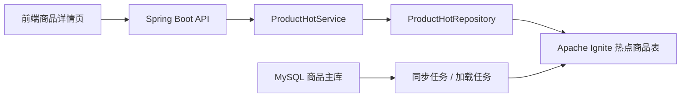
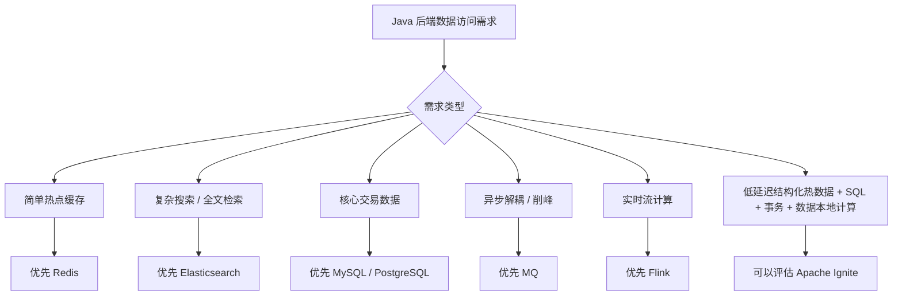

## 0. 先给结论

**Apache Ignite 不是 Redis 的平替。**

更准确地说：

> **Redis 更像高性能缓存与数据结构服务器；Apache Ignite 更像一个带 SQL、事务、持久化、分布式计算能力的内存优先分布式数据平台。**

Apache Ignite 官方当前的定位是：面向高吞吐、低延迟场景的 **distributed database**，强调 **memory-first distributed SQL database**，既支持内存性能，也支持磁盘持久化、SQL、事务和分布式计算。([Apache Ignite](https://ignite.apache.org/?utm_source=chatgpt.com "Distributed Database - Apache Ignite | Apache Ignite"))

所以学习 Ignite 时，不能只问：

> “它是不是另一个 Redis？”

更应该问：

> “当 Redis + MySQL + Elasticsearch + MQ + 分布式计算组件组合起来都开始变复杂时，Ignite 试图解决哪些问题？”

但也要先明确：**大多数普通 Java 后端项目不需要 Apache Ignite。Redis、MySQL、Elasticsearch、MQ 这些常规组合已经足够覆盖绝大多数业务。Ignite 是扩展视野型技术，不是当前阶段必学主线。**

---

# 1. Apache Ignite 到底是什么？

## 1.1 一句话定位

**Apache Ignite 是一个内存优先的分布式数据库 / 分布式数据平台，核心能力包括分布式缓存、SQL 查询、事务、持久化和分布式计算。**

它既能像缓存一样把热点数据放在内存里，也能像数据库一样支持 SQL、事务和持久化，还能把计算任务下发到数据所在节点执行。

这也是它和 Redis 最大的不同。

Redis 的核心心智是：

```text
应用服务 → Redis → MySQL
          ↑
       缓存层 / 数据结构层
```

Ignite 的核心心智更接近：

```text
应用服务 → Ignite Cluster
              ├── 内存数据
              ├── 分布式 SQL
              ├── 事务
              ├── 持久化
              └── 计算下推
```

Redis 是一个极其优秀的缓存和数据结构系统。

Ignite 则更重，目标也更大：它希望把一部分缓存、分布式数据库、计算网格能力整合在一个集群里。

---

# 2. 为什么不能把 Ignite 理解成 Redis 替代品？

## 2.1 Redis 的优势是简单、成熟、通用

Java 后端里，Redis 的典型定位非常清晰：

- 缓存热点数据
    
- 分布式锁
    
- 限流
    
- 去重
    
- 排行榜
    
- 延迟队列
    
- Stream 异步任务
    
- Session 存储
    
- 布隆过滤器
    
- 秒杀库存扣减
    

它的优势是：

|维度|Redis 特点|
|---|---|
|学习成本|低|
|接入成本|低|
|运维成熟度|高|
|社区资料|极多|
|Java 生态|非常成熟|
|业务适配性|极强|
|故障排查|相对容易|

所以在普通后端项目里，Redis 是默认优先级更高的方案。

## 2.2 Ignite 的能力更重，但成本也更高

Ignite 不只是做缓存。它还关心：

- 数据分区
    
- 数据副本
    
- SQL 查询
    
- 分布式事务
    
- 数据亲和性
    
- 持久化
    
- 计算任务调度
    
- 客户端连接模型
    
- 集群拓扑变化
    
- 节点发现与重平衡
    

这意味着它的使用复杂度和运维复杂度明显高于 Redis。

所以你可以这样理解：

```text
Redis：简单、锋利、专注，适合作为通用缓存和数据结构中间件。

Ignite：能力更综合，但更重，适合少数对低延迟、分布式 SQL、数据本地计算、事务一致性有特殊要求的系统。
```

---

# 3. 从 Redis 迁移认知到 Ignite

## 3.1 数据模型：Key-Value vs 表 / SQL / 分布式数据结构

Redis 的主要数据模型是 Key-Value 加丰富数据结构：

```text
String
Hash
List
Set
ZSet
Stream
Bitmap
HyperLogLog
Geo
```

你通常会这样建模：

```text
product:1001 → JSON 字符串
stock:1001   → 库存数量
user:coupon:1001 → Set
```

Ignite 不只支持 Key-Value，它更强调表、Schema、SQL 和分布式数据访问。

在 Ignite 3 中，官方文档已经明显强化了 SQL、Table API 和统一 Schema 的方向。([Apache Ignite](https://ignite.apache.org/docs/ignite3/latest/quick-start/getting-started-guide?utm_source=chatgpt.com "Getting Started With Apache Ignite 3 | Ignite Documentation"))

对 Java 后端来说，这意味着：

|对比项|Redis|Ignite|
|---|---|---|
|建模方式|Key 设计为核心|表结构 / Schema / 分区为核心|
|查询方式|命令式访问|SQL + API|
|复杂查询|弱|强|
|数据关系|通常由应用维护|可以部分交给 SQL 表达|
|开发心智|缓存设计|分布式数据库设计|

Redis 更像：

```java
redisTemplate.opsForValue().get("product:1001");
```

Ignite 更像：

```sql
SELECT id, name, price, stock
FROM product_hot
WHERE category_id = 10
AND stock > 0;
```

这就是两者心智的差异。

---

## 3.2 使用定位：缓存加速 vs 分布式内存数据平台

Redis 最常见的定位是：

```text
MySQL 太慢 → Redis 缓存热点数据 → 减少数据库压力
```

Ignite 的定位更复杂：

```text
数据量大、访问快、查询复杂、需要 SQL、需要事务、需要数据本地计算
→ 用 Ignite 构建分布式内存数据平台
```

Redis 常见于：

- 电商商品详情缓存
    
- 登录态缓存
    
- 秒杀库存预扣
    
- 验证码
    
- 分布式锁
    
- 延迟任务
    
- 排行榜
    

Ignite 更可能出现在：

- 高性能风控规则计算
    
- 金融交易低延迟查询
    
- 复杂热数据聚合
    
- 分布式 SQL 查询
    
- 内存化数据服务
    
- 需要事务一致性的高性能数据访问
    

---

## 3.3 持久化：Redis RDB/AOF vs Ignite Native Persistence

Redis 的持久化主要是：

- RDB：快照
    
- AOF：追加日志
    
- 混合持久化
    

但很多业务使用 Redis 时，本质上仍把 Redis 当缓存：

```text
Redis 丢了可以从 MySQL 恢复
```

Ignite 的 Native Persistence 则更接近数据库存储层。官方说明中，Native Persistence 是分布式、ACID、SQL-compliant 的磁盘存储，并作为多层存储中的磁盘层；启用后，Ignite 会把数据全集保存在磁盘上，并尽可能把热点数据缓存到内存里。([Apache Ignite](https://ignite.apache.org/arch/native-persistence.html?utm_source=chatgpt.com "Native Persistence - Apache Ignite"))

这对 Java 后端意味着：

```text
Redis 持久化常常是缓存系统的安全兜底；
Ignite 持久化更像分布式数据库能力的一部分。
```

当然，这也意味着 Ignite 的故障恢复、磁盘规划、WAL、Checkpoint、重平衡等问题会更复杂。

---

## 3.4 一致性：Redis 最终一致实践 vs Ignite 事务

Redis 在 Java 项目中常见的一致性方案是：

```text
先写数据库，再删缓存
延迟双删
Binlog 订阅
MQ 异步修复
缓存过期兜底
```

这些方案大多是工程上的最终一致性设计。

Ignite 则提供事务能力。Ignite 3 官方文档说明：所有查询都是事务性的；如果不显式提供事务，每次调用会创建隐式事务。([Apache Ignite](https://ignite.apache.org/docs/ignite3/latest/developers-guide/transactions?utm_source=chatgpt.com "Performing Transactions | Ignite Documentation - Apache Ignite"))

这意味着 Ignite 可以承载一些比 Redis 更强一致的数据访问场景。

但注意：**有事务能力不代表你应该随便使用分布式事务。**

分布式事务意味着：

- 锁冲突
    
- 网络延迟
    
- 协调成本
    
- 重试复杂
    
- 死锁与超时处理
    
- 性能下降
    
- 运维排查难度上升
    

所以工程判断是：

```text
Redis 场景下，优先用最终一致性。
Ignite 场景下，可以考虑事务，但必须明确性能和复杂度成本。
```

---

## 3.5 查询能力：Redis 命令模型 vs Ignite SQL

Redis 是命令模型：

```bash
GET product:1001
HGETALL product:1001
ZREVRANGE product:rank 0 10
XREADGROUP ...
```

它擅长明确 Key 的高性能访问。

但如果你要做：

```sql
查询所有库存大于 100、价格在 50 到 200、类目为 3 的商品
```

Redis 就不自然了。

你要么：

- 维护多个索引结构
    
- 把查询逻辑放应用层
    
- 使用 RediSearch
    
- 换 Elasticsearch / MySQL
    

Ignite 的优势是 SQL 查询能力。

它更适合：

```sql
SELECT id, name, price, stock
FROM product_hot
WHERE category_id = ?
AND price BETWEEN ? AND ?
AND stock > 0;
```

对后端工程师来说，这意味着：

> Redis 适合“我知道 Key，直接取数据”；Ignite 更适合“我要对分布式热数据做结构化查询”。

---

## 3.6 集群模型：Redis Cluster 分片 vs Ignite 分区 / 副本 / 亲和性

Redis Cluster 的核心是 Slot：

```text
16384 个 slot
key 根据 hash 映射到 slot
slot 分布到不同 Redis 节点
```

Java 后端开发者主要关心：

- Key 是否均匀
    
- 是否出现 hot key
    
- 跨 slot 操作是否受限
    
- 主从切换
    
- 数据迁移
    
- 客户端路由
    

Ignite 的核心更偏向分布式数据库：

- Partition：分区
    
- Replica：副本
    
- Affinity：数据亲和性
    
- Colocation：相关数据放到同一节点
    
- Rebalance：节点变化后的数据重平衡
    

Ignite 的数据亲和性非常关键。它关心的不只是“Key 分到哪台机器”，还关心：

```text
相关数据能不能放在一起？
计算能不能在数据所在节点执行？
跨节点 JOIN / 跨节点事务能不能减少？
```

这是 Redis 和 Ignite 思维差异很大的地方。

---

## 3.7 计算能力：Redis Lua / Function vs Ignite Compute Grid

Redis 可以通过 Lua 或 Redis Functions 把少量逻辑放到服务端执行，比如秒杀扣库存：

```lua
-- 判断库存
-- 判断是否重复购买
-- 扣减库存
-- 写入购买记录
```

这类逻辑通常是轻量级、原子化、围绕 Key 操作的。

Ignite 的 Compute Grid 更像分布式计算能力，可以把计算任务分发到集群节点执行。Ignite 2 的 JavaDoc 中也能看到 compute grid 相关 API，用于在集群节点上执行任务或闭包。([javadoc.io](https://www.javadoc.io/doc/org.apache.ignite/ignite-core/2.17.0/org/apache/ignite/package-summary.html?utm_source=chatgpt.com "org.apache.ignite (Ignite 2.17.0)"))

简单理解：

```text
Redis Lua：把小逻辑推到 Redis 执行，减少网络往返，保证局部原子性。

Ignite Compute：把计算任务推到数据所在节点执行，减少数据搬运，适合更重的分布式计算。
```

Java 后端实际很少一上来就用 Ignite Compute，但这个概念值得知道。

---

# 4. Apache Ignite 解决的典型问题

## 4.1 高性能分布式缓存

### 业务背景

商品详情、用户画像、风控规则、账户状态等数据访问频率极高，MySQL 扛不住高 QPS。

### Redis 通常怎么做

```text
MySQL → Redis Cache → Application
```

典型代码：

```java
ProductDTO product = redisCache.get(productId);
if (product == null) {
    product = mysql.query(productId);
    redisCache.set(productId, product, 10, TimeUnit.MINUTES);
}
return product;
```

### Ignite 可以怎么做

Ignite 可以把热点数据加载到分布式内存表里，应用直接访问 Ignite。

```text
MySQL → Ignite Hot Table → Application
```

它不只是缓存 Key，还可以让你用 SQL 查询热点数据。

### Ignite 的优势

- 支持分布式缓存
    
- 支持结构化查询
    
- 支持分区和副本
    
- 支持数据本地计算
    
- 可以和持久化结合
    

### Ignite 的代价

- 集群复杂度更高
    
- 运维门槛更高
    
- Java 团队需要理解分区、事务、SQL 执行
    
- 不适合简单缓存场景
    

### 工程判断

如果只是商品详情缓存：

```text
Redis 足够。
```

如果是大规模热数据、复杂查询、强一致要求：

```text
才有必要考虑 Ignite。
```

---

## 4.2 分布式 SQL 查询

### 业务背景

大量热点数据被分散在多个节点，需要低延迟查询，并且查询条件不是单一 Key。

例如：

```text
查询某类目下价格在 100~300、库存大于 0、近期销量较高的商品。
```

### Redis 通常怎么做

Redis 原生命令并不适合复杂条件查询。

你可能会：

- 维护多个 ZSet / Set 索引
    
- 组合多个 Key
    
- 在应用层做过滤
    
- 引入 Elasticsearch
    
- 回查 MySQL
    

### Ignite 可以怎么做

Ignite 支持 SQL：

```sql
SELECT id, name, price, stock
FROM product_hot
WHERE category_id = 10
AND price BETWEEN 100 AND 300
AND stock > 0;
```

### Ignite 的优势

- SQL 表达能力强
    
- 数据分布在多个节点
    
- 可以在内存中处理热点查询
    
- 更接近数据库使用方式
    

### Ignite 的代价

- SQL 优化复杂
    
- 索引设计复杂
    
- 跨分区查询可能有性能问题
    
- 分布式 JOIN 需要谨慎
    

### 工程判断

如果是搜索系统：

```text
优先 Elasticsearch。
```

如果是结构化热数据、高一致性、低延迟 SQL：

```text
Ignite 才有讨论价值。
```

---

## 4.3 热数据内存化

### 业务背景

某些业务数据不是简单缓存，而是整个业务链路都依赖低延迟访问。

例如：

- 实时风控规则
    
- 实时报价
    
- 用户实时权益
    
- 交易状态
    
- 高并发计费数据
    

### Redis 通常怎么做

Redis 可以存热点数据，但复杂关系通常要应用自己维护。

```text
user:profile:{userId}
user:risk:{userId}
user:quota:{userId}
```

### Ignite 可以怎么做

Ignite 可以把这些数据建成表，并按用户 ID、账户 ID、商品 ID 等分区。

```text
USER_PROFILE
USER_RISK
USER_QUOTA
```

通过数据亲和性，让同一个用户相关数据尽量落到同一节点。

### Ignite 的优势

- 热数据结构化
    
- 查询能力强
    
- 支持数据亲和性
    
- 可以减少跨节点计算
    

### Ignite 的代价

- 模型设计要求更高
    
- 分区键选择很关键
    
- 集群规划复杂
    

---

## 4.4 缓存 + 持久化一体化

### 业务背景

业务不希望 Redis 只是缓存，而希望内存系统本身具备数据库式的持久化能力。

### Redis 通常怎么做

Redis 开启 RDB/AOF，但主数据仍然通常在 MySQL。

```text
MySQL 是准数据源
Redis 是缓存副本
```

### Ignite 可以怎么做

Ignite Native Persistence 可以让数据全集在磁盘，热点部分在内存。官方对 Native Persistence 的描述就是：磁盘层保存数据全集，内存层尽可能缓存数据以提升性能。([Apache Ignite](https://ignite.apache.org/arch/native-persistence.html?utm_source=chatgpt.com "Native Persistence - Apache Ignite"))

### Ignite 的优势

- 数据不只是临时缓存
    
- 具备数据库式持久化能力
    
- 可以同时利用内存和磁盘
    

### Ignite 的代价

- 磁盘规划、恢复、Checkpoint、WAL 更复杂
    
- 故障恢复不如 Redis 缓存模式简单
    
- 运维要求更接近数据库系统
    

---

## 4.5 分布式事务

### 业务背景

多个数据项需要一起更新，并且对一致性要求较高。

比如：

```text
账户余额扣减
冻结金额增加
交易流水写入
风控状态更新
```

### Redis 通常怎么做

Redis 可以用 Lua 保证单节点内多个 Key 的原子性，但跨节点、跨系统事务并不擅长。

常见方案是：

```text
本地事务 + MQ + 补偿任务 + 幂等设计
```

### Ignite 可以怎么做

Ignite 提供事务能力。Ignite 3 文档中明确说明 Table 和 SQL API 调用可以传入显式事务，不传则创建隐式事务。([Apache Ignite](https://ignite.apache.org/docs/ignite3/latest/developers-guide/transactions?utm_source=chatgpt.com "Performing Transactions | Ignite Documentation - Apache Ignite"))

### Ignite 的优势

- 支持更强的一致性表达
    
- 对某些金融、交易类场景更友好
    
- 不完全依赖应用层补偿
    

### Ignite 的代价

- 分布式事务性能成本高
    
- 锁冲突和超时复杂
    
- 对开发和运维要求更高
    

### 工程判断

能不用分布式事务，就尽量不用。

如果业务可以接受最终一致：

```text
本地事务 + MQ + 幂等 + 补偿
```

通常更稳定、更常见。

---

## 4.6 计算下推 / 数据本地计算

### 业务背景

数据量很大，如果全部拉回应用服务计算，网络成本和序列化成本很高。

### Redis 通常怎么做

Redis Lua 可以把小逻辑推到 Redis 执行。

但 Lua 不适合复杂业务计算。

### Ignite 可以怎么做

Ignite 可以把计算任务分发到数据所在节点执行。

```text
不是把数据拉到应用算，
而是把计算发到数据所在节点。
```

### Ignite 的优势

- 减少数据搬运
    
- 适合数据密集型计算
    
- 可以利用集群资源并行执行
    

### Ignite 的代价

- 代码复杂
    
- 调试复杂
    
- 任务失败、超时、重试需要设计
    
- 对团队要求高
    

---

# 5. Ignite 核心概念：只讲够用部分

## 5.1 Cluster / Node

### 是什么？

Ignite Cluster 是由多个 Ignite Node 组成的分布式集群。

```text
Ignite Cluster
├── Node 1
├── Node 2
└── Node 3
```

### 为什么需要？

为了水平扩展：

- 数据分散到多个节点
    
- 查询可以并行执行
    
- 计算可以分发
    
- 节点故障可以通过副本恢复
    

### 和 Redis 类比

Redis Cluster 也有多个节点。

但 Redis Cluster 更强调 Key Slot 分布；Ignite Cluster 更强调分布式数据库式的数据分区、SQL、事务和计算。

---

## 5.2 Cache / Table

### 是什么？

在 Ignite 2 里，Cache 是很核心的概念。

在 Ignite 3 里，Table / SQL / Schema 的地位更突出，官方也强调 Table API 和统一 Schema。([Apache Ignite](https://ignite.apache.org/blog/whats-new-in-apache-ignite-3-0.html?utm_source=chatgpt.com "What's New in Apache Ignite 3.0"))

### 为什么需要？

因为 Ignite 不只是 Key-Value，它还希望你以结构化方式管理数据。

### 和 Redis 类比

Redis：

```text
product:1001 → JSON
```

Ignite：

```sql
CREATE TABLE product_hot (
    id BIGINT PRIMARY KEY,
    name VARCHAR,
    price DECIMAL,
    stock INT
);
```

### 实际开发怎么感知？

Redis 开发更关心 Key 命名规范。

Ignite 开发更关心：

- 表结构
    
- 主键
    
- 分区键
    
- 索引
    
- SQL 查询
    
- 事务边界
    

---

## 5.3 Partition / Replication

### 是什么？

Partition 是数据分区。

Replication 是副本。

一个表的数据会被切成多个分区，分布到不同节点上，并可配置副本增强可用性。

### 为什么需要？

为了：

- 扩展容量
    
- 提高并发
    
- 避免单点
    
- 支持故障恢复
    

### 和 Redis 类比

Redis Cluster 通过 slot 分片。

Ignite 通过分区和副本管理分布式数据。

### 实际开发怎么感知？

你要关心：

```text
哪个字段适合作为分区键？
查询是否会跨很多分区？
相关数据是否能放在一起？
```

例如订单系统中，`order_id`、`user_id` 的选择会直接影响查询性能。

---

## 5.4 Affinity / 数据亲和性

### 是什么？

数据亲和性指的是：**让相关数据尽量落在同一个节点上。**

例如：

```text
user_profile
user_account
user_risk
```

如果都按 `user_id` 分区，那么同一个用户的数据更可能在同一个节点。

### 为什么需要？

为了减少：

- 跨节点查询
    
- 跨节点 JOIN
    
- 跨节点事务
    
- 网络传输
    

### 和 Redis 类比

Redis Cluster 里也有 hash tag：

```text
user:{1001}:profile
user:{1001}:quota
```

这样可以让多个 Key 落到同一个 slot。

Ignite 的 affinity 是更数据库化、更系统化的数据亲和设计。

### 实际开发怎么感知？

你要提前设计分区键。

这和 MySQL 分库分表非常像：

```text
分片键选错，后面全是灾难。
```

---

## 5.5 SQL Engine

### 是什么？

Ignite 支持 SQL 查询分布式数据。

### 为什么需要？

因为很多业务数据不是简单 Key 查询，而是需要条件过滤、聚合、排序、Join。

### 和 Redis 类比

Redis 原生不是 SQL 系统。

Ignite 更接近分布式 SQL 数据库。

### 实际开发怎么感知？

你会写：

```sql
SELECT *
FROM product_hot
WHERE category_id = ?
AND stock > 0;
```

而不是：

```java
redisTemplate.opsForValue().get("product:1001");
```

---

## 5.6 Native Persistence

### 是什么？

Native Persistence 是 Ignite 的原生持久化能力。

启用后，数据全集可以保存在磁盘，热点数据保存在内存。官方描述中，它是分布式、ACID、SQL-compliant 的磁盘存储能力。([Apache Ignite](https://ignite.apache.org/arch/native-persistence.html?utm_source=chatgpt.com "Native Persistence - Apache Ignite"))

### 为什么需要？

为了让 Ignite 不只是缓存，而可以作为更完整的数据平台。

### 和 Redis 类比

Redis 的 RDB/AOF 通常是缓存系统的持久化保障。

Ignite Native Persistence 更接近数据库存储层。

### 实际开发怎么感知？

你需要关心：

- 数据目录
    
- WAL
    
- Checkpoint
    
- 磁盘容量
    
- 恢复时间
    
- 节点重启
    
- 数据重平衡
    

这已经是数据库运维问题，不是简单缓存问题。

---

## 5.7 Transaction

### 是什么？

Ignite 支持事务。Ignite 3 中 Table 和 SQL API 调用都可以处于显式或隐式事务中。([Apache Ignite](https://ignite.apache.org/docs/ignite3/latest/developers-guide/transactions?utm_source=chatgpt.com "Performing Transactions | Ignite Documentation - Apache Ignite"))

### 为什么需要？

为了在多个数据操作之间保证一致性。

### 和 Redis 类比

Redis 有 MULTI/EXEC、Lua、单线程原子执行模型。

但 Redis 的事务能力和 Ignite 这种分布式数据库事务不是一个层级的问题。

### 实际开发怎么感知？

你需要考虑：

- 事务范围
    
- 锁粒度
    
- 超时时间
    
- 重试策略
    
- 死锁风险
    
- 跨分区事务成本
    

---

## 5.8 Compute Grid

### 是什么？

Compute Grid 是 Ignite 的分布式计算能力，可以把任务分发到集群节点执行。

### 为什么需要？

为了让计算靠近数据。

### 和 Redis 类比

Redis Lua 是轻量级服务端脚本。

Ignite Compute 更像分布式任务执行框架。

### 实际开发怎么感知？

普通业务基本不需要优先使用 Compute Grid。

它更适合：

- 数据密集型计算
    
- 风控规则批量计算
    
- 分布式聚合
    
- 低延迟本地计算
    

---

## 5.9 Thin Client / Thick Client

### 是什么？

客户端连接 Ignite 有不同模式。

粗略理解：

|客户端|特点|
|---|---|
|Thin Client|轻量，不参与集群拓扑，适合普通应用接入|
|Thick Client|更重，可能参与更多集群能力，复杂度更高|

### Java 后端怎么选？

大多数业务应用优先考虑 Thin Client。

因为它更像普通数据库 / 中间件客户端，不把应用服务变成 Ignite 集群的一部分。

---

## 5.10 Ignite 2 与 Ignite 3 的差异

Ignite 2 和 Ignite 3 不是简单小版本差异。

Apache Ignite 的 GitHub 仓库说明中也明确区分：`apache/ignite` 是 Ignite 2，`apache/ignite-3` 是 Ignite 3，并说明两个版本都在活跃开发。([GitHub](https://github.com/apache/ignite?utm_source=chatgpt.com "Apache Ignite"))

粗略理解：

|维度|Ignite 2|Ignite 3|
|---|---|---|
|历史定位|In-memory data grid / cache grid 色彩更强|Distributed SQL database 色彩更强|
|核心心智|Cache、Data Grid、Compute Grid|Table、SQL、Schema、Database|
|API 风格|历史包袱较多|更现代化|
|架构|成熟但复杂|新架构，仍需关注生态成熟度|
|学习建议|看历史资料时会大量遇到|新学习更应该关注 Ignite 3|

对你来说，现阶段不需要深入研究迁移差异，只要记住：

```text
网上很多 Ignite 资料是 Ignite 2 时代的；
现在学习时要注意 Ignite 3 的官方定位已经更偏分布式数据库。
```

---

# 6. 一个最小 Java 后端案例：商品价格与库存热点查询系统

下面这个案例不是完整生产项目，只是为了建立工程直觉。

## 6.1 业务场景

电商系统中，商品价格和库存查询频率很高。

原始数据在 MySQL：

```text
product
product_stock
product_price
```

但前台查询接口 QPS 很高，直接查 MySQL 压力大。

普通方案：

```text
Spring Boot → Redis → MySQL
```

Ignite 方案：

```text
Spring Boot → Ignite Hot Product Table → MySQL
```

Ignite 在这里扮演：

```text
热点商品数据承载层 + 简单 SQL 查询层
```

---

## 6.2 项目结构

```text
ignite-product-demo
├── pom.xml
└── src/main/java/com/example/igniteproduct
    ├── IgniteProductApplication.java
    ├── config
    │   └── IgniteClientConfig.java
    ├── controller
    │   └── ProductHotController.java
    ├── dto
    │   └── ProductHotDTO.java
    ├── repository
    │   └── ProductHotRepository.java
    └── service
        └── ProductHotService.java
```

---

## 6.3 Maven 依赖示意

> 注意：Ignite 2 和 Ignite 3 的依赖、API 有差异。下面以教学方式展示结构，不建议直接复制到生产环境。真实项目请以当前官方文档和版本 BOM 为准。

```xml
<dependencies>
    <!-- Spring Boot Web，用于提供 HTTP API -->
    <dependency>
        <groupId>org.springframework.boot</groupId>
        <artifactId>spring-boot-starter-web</artifactId>
    </dependency>

    <!-- Ignite Client：实际版本请以官方文档为准 -->
    <dependency>
        <groupId>org.apache.ignite</groupId>
        <artifactId>ignite-client</artifactId>
        <version>${ignite.version}</version>
    </dependency>

    <!-- Lombok：简化 DTO 代码，生产中是否使用按团队规范决定 -->
    <dependency>
        <groupId>org.projectlombok</groupId>
        <artifactId>lombok</artifactId>
        <optional>true</optional>
    </dependency>
</dependencies>
```

---

## 6.4 DTO

```java
package com.example.igniteproduct.dto;

import java.math.BigDecimal;

/**
 * 热点商品数据 DTO。
 *
 * 教学简化：
 * 1. 这里只保留前台查询最常用字段。
 * 2. 实际项目中应区分 DO / DTO / VO。
 * 3. 金额字段使用 BigDecimal，避免 double 精度问题。
 */
public class ProductHotDTO {

    private Long id;

    private String name;

    private Long categoryId;

    private BigDecimal price;

    private Integer stock;

    public ProductHotDTO() {
    }

    public ProductHotDTO(Long id, String name, Long categoryId, BigDecimal price, Integer stock) {
        this.id = id;
        this.name = name;
        this.categoryId = categoryId;
        this.price = price;
        this.stock = stock;
    }

    public Long getId() {
        return id;
    }

    public String getName() {
        return name;
    }

    public Long getCategoryId() {
        return categoryId;
    }

    public BigDecimal getPrice() {
        return price;
    }

    public Integer getStock() {
        return stock;
    }
}
```

---

## 6.5 Ignite 客户端配置

```java
package com.example.igniteproduct.config;

import org.apache.ignite.client.IgniteClient;
import org.springframework.context.annotation.Bean;
import org.springframework.context.annotation.Configuration;

/**
 * Ignite 客户端配置。
 *
 * 教学目标：
 * 1. 让 Spring Boot 应用通过 Client 方式访问 Ignite 集群。
 * 2. 不让业务应用直接变成 Ignite 集群节点，降低复杂度。
 *
 * 注意：
 * 具体 API 会因 Ignite 2 / Ignite 3 版本不同而变化。
 * 这里重点看接入思路，而不是死记 API。
 */
@Configuration
public class IgniteClientConfig {

    @Bean
    public IgniteClient igniteClient() {
        // 伪代码：实际创建方式请按当前 Ignite 版本文档调整。
        // 推荐从 application.yml 读取地址，而不是硬编码。
        return IgniteClient.builder()
                .addresses("127.0.0.1:10800")
                .build();
    }
}
```

---

## 6.6 Repository：按商品 ID 查询

```java
package com.example.igniteproduct.repository;

import com.example.igniteproduct.dto.ProductHotDTO;
import org.apache.ignite.client.IgniteClient;
import org.springframework.stereotype.Repository;

import java.math.BigDecimal;
import java.util.Optional;

/**
 * Ignite 热点商品数据访问层。
 *
 * 教学简化：
 * 1. 这里用伪代码表达 Table / SQL 查询思路。
 * 2. 实际项目应根据 Ignite 版本选择 Table API、SQL API 或 JDBC。
 */
@Repository
public class ProductHotRepository {

    private final IgniteClient igniteClient;

    public ProductHotRepository(IgniteClient igniteClient) {
        this.igniteClient = igniteClient;
    }

    /**
     * 根据商品 ID 查询热点商品。
     *
     * Redis 心智：
     * GET product:{id}
     *
     * Ignite 心智：
     * SELECT ... FROM product_hot WHERE id = ?
     */
    public Optional<ProductHotDTO> findById(Long productId) {
        // 伪代码：表达 SQL 查询意图。
        // 实际实现需要根据 Ignite 当前版本 SQL API 调整。
        String sql = """
                SELECT id, name, category_id, price, stock
                FROM product_hot
                WHERE id = ?
                """;

        // 这里为了教学直接返回模拟数据。
        // 真实项目中应执行 igniteClient.sql().execute(...) 并映射结果。
        if (productId == 1001L) {
            return Optional.of(new ProductHotDTO(
                    1001L,
                    "机械键盘",
                    10L,
                    new BigDecimal("299.00"),
                    120
            ));
        }

        return Optional.empty();
    }

    /**
     * 扣减热点库存。
     *
     * 注意：
     * 真实秒杀库存扣减需要考虑并发、事务、幂等、防超卖、回滚补偿。
     * 这里不展开，避免把 Ignite 学习变成秒杀系统专题。
     */
    public boolean decreaseStock(Long productId, int quantity) {
        String sql = """
                UPDATE product_hot
                SET stock = stock - ?
                WHERE id = ?
                AND stock >= ?
                """;

        // 伪代码：
        // int affectedRows = executeUpdate(sql, quantity, productId, quantity);
        // return affectedRows == 1;

        return true;
    }
}
```

---

## 6.7 Service：封装业务语义

```java
package com.example.igniteproduct.service;

import com.example.igniteproduct.dto.ProductHotDTO;
import com.example.igniteproduct.repository.ProductHotRepository;
import org.springframework.stereotype.Service;

/**
 * 热点商品服务。
 *
 * Service 层负责表达业务语义：
 * 1. 查询热点商品。
 * 2. 不把 Ignite 的访问细节暴露给 Controller。
 */
@Service
public class ProductHotService {

    private final ProductHotRepository productHotRepository;

    public ProductHotService(ProductHotRepository productHotRepository) {
        this.productHotRepository = productHotRepository;
    }

    public ProductHotDTO getHotProduct(Long productId) {
        return productHotRepository.findById(productId)
                .orElseThrow(() -> new IllegalArgumentException("商品不存在或未加载到热点数据层"));
    }

    public boolean decreaseStock(Long productId, int quantity) {
        if (quantity <= 0) {
            throw new IllegalArgumentException("扣减数量必须大于 0");
        }

        return productHotRepository.decreaseStock(productId, quantity);
    }
}
```

---

## 6.8 Controller

```java
package com.example.igniteproduct.controller;

import com.example.igniteproduct.dto.ProductHotDTO;
import com.example.igniteproduct.service.ProductHotService;
import org.springframework.web.bind.annotation.*;

/**
 * 热点商品查询 API。
 *
 * 这里的接口面向前台业务：
 * 1. 查询商品热点数据。
 * 2. 演示库存扣减入口。
 */
@RestController
@RequestMapping("/api/hot-products")
public class ProductHotController {

    private final ProductHotService productHotService;

    public ProductHotController(ProductHotService productHotService) {
        this.productHotService = productHotService;
    }

    @GetMapping("/{productId}")
    public ProductHotDTO getHotProduct(@PathVariable Long productId) {
        return productHotService.getHotProduct(productId);
    }

    @PostMapping("/{productId}/stock/decrease")
    public boolean decreaseStock(@PathVariable Long productId,
                                 @RequestParam int quantity) {
        return productHotService.decreaseStock(productId, quantity);
    }
}
```

---

## 6.9 这个案例里的数据流



这个案例的重点不是代码 API，而是理解 Ignite 在架构里的角色：

```text
MySQL：原始业务数据源
Ignite：热点数据承载层 / 分布式 SQL 查询层
Spring Boot：业务访问入口
```

---

# 7. Ignite 不适合什么场景？

这一部分非常重要。

## 7.1 只做普通缓存，不适合优先引入 Ignite

如果你的需求是：

- 商品详情缓存
    
- 用户信息缓存
    
- 验证码缓存
    
- Token 缓存
    
- 分布式锁
    
- 简单排行榜
    
- 接口限流
    

直接用 Redis。

不要为了“技术高级”引入 Ignite。

原因很简单：

```text
Redis 更轻、更熟、更便宜、更容易招人维护。
```

---

## 7.2 中小型业务，不适合过早引入 Ignite

很多项目的问题根本不是缺 Ignite，而是：

- MySQL 索引没设计好
    
- SQL 写得差
    
- Redis 缓存没做好
    
- MQ 解耦没做好
    
- 服务拆分过度
    
- 监控告警缺失
    
- 慢查询没人管
    
- 缓存一致性没治理
    

这种情况下引入 Ignite，只会增加复杂度。

工程上的优先级通常应该是：

```text
MySQL 优化
→ Redis 缓存
→ MQ 异步解耦
→ Elasticsearch 搜索
→ 本地缓存 / 多级缓存
→ 分库分表
→ 再考虑 Ignite 这类更重的平台
```

---

## 7.3 团队没有分布式数据库经验，不适合贸然引入

Ignite 涉及：

- 分区设计
    
- 副本策略
    
- 数据重平衡
    
- SQL 优化
    
- 事务冲突
    
- 持久化恢复
    
- 集群部署
    
- JVM 调优
    
- 网络分区
    
- 节点故障
    
- 数据一致性
    

这不是一个“加个 starter 就能解决”的组件。

如果团队没有足够经验，很容易出现：

```text
开发阶段看起来很快；
生产阶段排障非常痛苦。
```

---

## 7.4 搜索场景不要优先用 Ignite 替代 Elasticsearch

如果你要做的是：

- 全文检索
    
- 分词
    
- 相关性排序
    
- 模糊搜索
    
- 商品搜索
    
- 日志检索
    
- 聚合分析
    

优先 Elasticsearch / OpenSearch。

Ignite 的 SQL 能力不等于搜索引擎能力。

---

## 7.5 流式计算场景不要优先用 Ignite 替代 Flink

如果你要做：

- 实时 ETL
    
- 流式窗口
    
- 事件时间
    
- Watermark
    
- 状态计算
    
- 实时数仓
    

优先 Flink。

Ignite 的 Compute Grid 不等于专业流计算引擎。

---

# 8. Ignite 和常见技术选型的关系

## 8.1 Ignite vs Redis

|对比|Redis|Ignite|
|---|---|---|
|核心定位|缓存 / 数据结构服务器|分布式内存数据平台 / 分布式数据库|
|查询模型|Key 命令|SQL / Table API / Key-Value|
|复杂查询|弱|强|
|事务能力|有限|更强|
|运维复杂度|较低|较高|
|普通项目优先级|高|低|

### 判断

```text
普通缓存：Redis
复杂热数据 SQL + 分布式事务 + 数据本地计算：考虑 Ignite
```

---

## 8.2 Ignite vs MySQL

|对比|MySQL|Ignite|
|---|---|---|
|定位|关系型数据库|分布式内存优先数据库|
|成熟度|极高|场景更窄|
|SQL|强|支持分布式 SQL|
|事务|成熟|支持但复杂|
|存储|磁盘为主|内存优先，可持久化|
|常规业务|首选|非首选|

### 判断

```text
核心交易数据：MySQL 优先
低延迟分布式热数据：Ignite 可作为特殊方案
```

---

## 8.3 Ignite vs Elasticsearch

|对比|Elasticsearch|Ignite|
|---|---|---|
|定位|搜索 / 分析引擎|分布式 SQL 数据平台|
|全文检索|强|不是主场|
|结构化查询|可以|强|
|事务|弱|更强|
|数据一致性|偏最终一致|可更强|
|典型场景|搜索、日志、聚合|热数据 SQL、事务、计算|

### 判断

```text
搜索：Elasticsearch
低延迟结构化热数据查询：Ignite
```

---

## 8.4 Ignite vs Hazelcast

|对比|Hazelcast|Ignite|
|---|---|---|
|定位|In-memory data grid|Distributed database / data grid|
|Java 生态|强|强|
|缓存能力|强|强|
|SQL / 数据库能力|有|Ignite 更强调数据库化|
|复杂度|中高|高|

### 判断

```text
Java 内存网格 / 分布式缓存：Hazelcast 和 Ignite 都可考虑
更强调 SQL、事务、持久化：Ignite 更值得看
```

---

## 8.5 Ignite vs Cassandra

|对比|Cassandra|Ignite|
|---|---|---|
|定位|宽列分布式数据库|内存优先分布式数据库|
|写入扩展|强|强调低延迟和内存性能|
|查询模型|按数据模型设计查询|SQL 能力更明显|
|一致性|可调一致性|支持事务能力|
|典型场景|海量写入、宽表|热数据、SQL、计算|

### 判断

```text
海量写入、宽列模型：Cassandra
内存优先、SQL、低延迟：Ignite
```

---

## 8.6 Ignite vs Spark

|对比|Spark|Ignite|
|---|---|---|
|定位|批处理 / 大数据计算|分布式内存数据平台|
|数据处理|离线 / 准实时|在线低延迟|
|查询延迟|通常较高|低延迟|
|业务系统在线访问|不是主场|可以|
|Java 后端集成|偏大数据|偏在线系统|

### 判断

```text
离线批处理：Spark
在线低延迟数据访问：Ignite
```

---

## 8.7 Ignite vs Flink

|对比|Flink|Ignite|
|---|---|---|
|定位|流计算引擎|分布式内存数据平台|
|事件流处理|强|不是主场|
|状态计算|强|有数据和计算能力|
|在线查询|不是核心|强|
|典型场景|实时数仓、实时风控流|热数据服务、分布式 SQL|

### 判断

```text
流式计算：Flink
热数据服务：Ignite
```

---

# 9. Java 后端面试表达

如果面试里被问到 Apache Ignite，可以这样说：

> 我了解 Apache Ignite，但我不会把它简单理解成 Redis 的替代品。Redis 在 Java 后端里更常见，主要解决缓存、分布式锁、限流、排行榜、消息流等问题，接入和运维成本相对低，生态也非常成熟。
> 
> Ignite 的定位更重，它更像一个内存优先的分布式数据平台，除了缓存能力，还提供分布式 SQL、事务、持久化和计算下推能力。它适合一些对低延迟、结构化热数据查询、分布式事务或者数据本地计算有要求的场景。
> 
> 但从工程选型上，我不会在普通业务里优先引入 Ignite。大多数系统用 MySQL、Redis、MQ、Elasticsearch 就能解决问题。只有当 Redis 的 Key-Value 模型已经难以表达复杂查询，或者需要在分布式热数据上做 SQL、事务和本地计算时，才会评估 Ignite。
> 
> 所以我对 Ignite 的态度是：它是一个值得了解的扩展型中间件，但不是 Java 后端当前阶段的默认必选项。真正引入前，需要评估团队能力、运维成本、数据一致性要求和性能收益。

这段表达的好处是：

- 不装熟
    
- 不贬低 Redis
    
- 不盲目吹 Ignite
    
- 能体现技术视野
    
- 能体现工程判断
    

---

# 10. 用一张图建立整体认知



这张图基本说明了 Ignite 的位置：

```text
它不是 Redis 的默认替代品；
它是在常规组合解决不了某些复杂热数据问题时，才进入评估区。
```

---

# 11. 学习 Apache Ignite 应该掌握到什么程度？

因为 Ignite 不是当前必学内容，所以学习深度建议控制。

## 第一层：必须知道

|内容|要求|
|---|---|
|Ignite 是什么|能说清它是内存优先分布式数据平台|
|和 Redis 区别|能说清 Redis 是缓存 / 数据结构，Ignite 更重|
|典型场景|热数据 SQL、事务、持久化、计算下推|
|不适合场景|普通缓存、普通中小型项目|
|工程成本|知道它运维复杂，不轻易引入|

## 第二层：需要理解

|内容|要求|
|---|---|
|Cluster / Node|知道 Ignite 是多节点集群|
|Partition|知道数据会分区|
|Replication|知道副本用于可用性|
|Affinity|知道相关数据要尽量放一起|
|SQL|知道 Ignite 支持分布式 SQL|
|Transaction|知道有事务，但成本高|
|Native Persistence|知道可持久化，不只是缓存|

## 第三层：暂时不必深入

|内容|当前建议|
|---|---|
|Ignite 源码|不学|
|SQL 优化器细节|不学|
|分布式事务协议|不学|
|WAL / Checkpoint 细节|不学|
|生产压测调优|暂时不学|
|Ignite 2 到 Ignite 3 迁移|暂时不学|

---

# 12. 需要深入扩展的方向

后续如果真的要深入 Ignite，可以按这个优先级扩展：

|优先级|方向|一句话说明|
|---|---|---|
|P1|Ignite 架构与集群原理|理解节点、分区、副本、拓扑变化和数据分布。|
|P1|分区与数据亲和性|决定查询、Join、事务是否会跨节点，是 Ignite 性能设计的核心。|
|P1|Ignite 2 vs Ignite 3|避免被旧资料误导，明确 Cache Grid 到 Distributed Database 的定位变化。|
|P2|Native Persistence|理解 Ignite 如何把内存和磁盘结合起来承载数据。|
|P2|分布式事务|理解事务边界、锁冲突、超时、重试和性能成本。|
|P2|SQL 查询优化|学习索引、执行计划、分布式 Join、跨分区查询。|
|P3|Compute Grid|理解数据本地计算和任务下发机制。|
|P3|Spring Boot 集成|掌握 Java 应用如何通过 Client、SQL、Table API 访问 Ignite。|
|P3|生产部署与运维|关注节点规划、数据目录、监控、扩缩容、故障恢复。|
|P3|性能压测与故障排查|通过真实压测判断 Ignite 是否真的带来收益。|

---

# 13. 总结

## 核心结论

**Apache Ignite 值得了解，但不值得在当前阶段深挖。**

你已经学过 Redis，所以理解 Ignite 的最好方式不是重新从零学一个中间件，而是从 Redis 的边界出发：

```text
当 Redis 的 Key-Value 模型不够表达复杂热数据查询，
当业务希望在分布式热数据上使用 SQL，
当系统需要更强事务、一体化持久化、数据本地计算，
Ignite 才开始有价值。
```

但普通 Java 后端项目中，技术选型优先级仍然是：

```text
MySQL / PostgreSQL
Redis
MQ
Elasticsearch
本地缓存 / 多级缓存
分库分表
Flink / Spark
最后才是 Ignite 这类更重的分布式内存数据平台
```

## 关键词

```text
Apache Ignite
Redis
分布式缓存
分布式 SQL
内存优先数据库
Native Persistence
分布式事务
Compute Grid
数据亲和性
Partition
Replication
Java 后端技术选型
```

## 面试加分项

你可以记住这句话：

> **Redis 是 Java 后端的常规武器，Apache Ignite 是特殊场景下的重型装备。普通缓存优先 Redis，复杂热数据 SQL、事务和数据本地计算场景，才考虑 Ignite。**