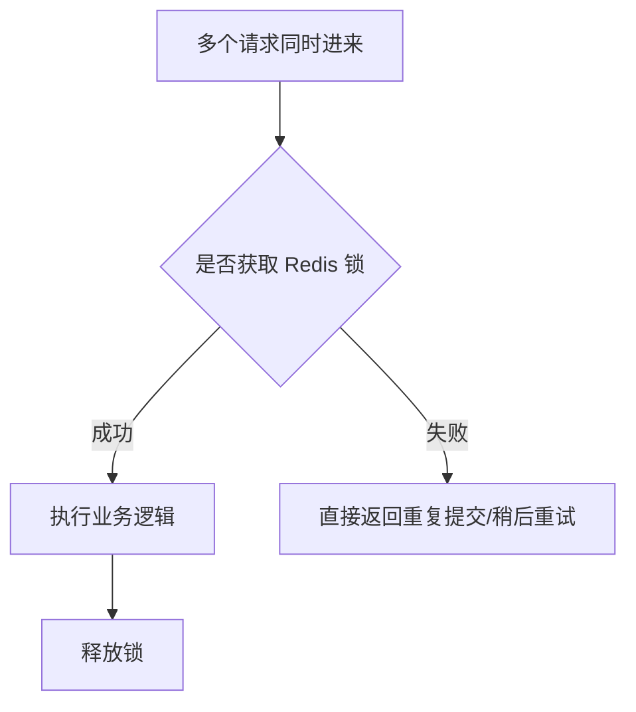

 **Redis 独占锁** 和 **Redis 分段锁** 都属于 Redis 分布式锁的使用形态，但解决的问题不一样。结合当前 Redis 实战教学方案，这一块可以放在“优惠券领取防重复 / 秒杀库存扣减 / 高并发状态控制”专题里展开。
[[Redis 深度案例 2：优惠券领取防重复]]
[[Redis 深度案例 3：秒杀库存扣减]]

---

# 1. 先给结论

## 独占锁

**独占锁就是：同一时刻，只允许一个线程 / 一个服务实例处理某个资源。**

典型 Redis Key：

```text
lock:coupon:user:10001:coupon:20001
```

含义：

> 用户 10001 领取优惠券 20001 时，只有一个请求能进入领取逻辑。

适合解决：

- 防重复提交
    
- 防止同一订单重复支付
    
- 防止同一用户重复领取优惠券
    
- 防止多个服务实例同时修改同一份业务资源
    

---

## 分段锁

**分段锁就是：不要把所有请求都锁在同一把锁上，而是把资源拆成多个段，每个段独立加锁，从而提高并发度。**

典型 Redis Key：

```text
lock:stock:sku:10001:segment:0
lock:stock:sku:10001:segment:1
lock:stock:sku:10001:segment:2
...
lock:stock:sku:10001:segment:15
```

含义：

> 商品 SKU 10001 的库存被拆成 16 个库存段，不同请求可以命中不同段，并发扣减。

适合解决：

- 热点商品秒杀
    
- 高并发库存扣减
    
- 单 Key 竞争过于激烈
    
- 全局锁导致吞吐量低的问题
    

---

# 2. 独占锁：解决“同一资源只能被一个请求处理”的问题

## 2.1 独占锁的核心语义

Redis 独占锁的核心命令一般是：

```bash
SET lock:key requestId NX EX 10
```

含义：

|参数|含义|
|---|---|
|`lock:key`|锁 Key|
|`requestId`|当前请求唯一标识|
|`NX`|只有 Key 不存在时才设置成功|
|`EX 10`|10 秒后自动过期，防止死锁|

成功返回：

```text
OK
```

失败返回：

```text
nil
```

所以它本质上是：

> 谁先成功写入这个锁 Key，谁获得执行权。

---

# 3. 独占锁的业务案例：优惠券领取防重复

假设业务规则是：

> 同一个用户只能领取同一张优惠券一次。

如果没有锁，高并发下可能出现：

```text
请求 A：查询用户没领过
请求 B：查询用户没领过
请求 A：插入领取记录
请求 B：插入领取记录
```

结果：重复领取。

所以可以加 Redis 独占锁：

```java
public CouponReceiveResult receiveCoupon(Long userId, Long couponId) {
    String lockKey = "lock:coupon:user:" + userId + ":coupon:" + couponId;
    String requestId = UUID.randomUUID().toString();

    Boolean locked = stringRedisTemplate.opsForValue()
            .setIfAbsent(lockKey, requestId, Duration.ofSeconds(10));

    if (Boolean.FALSE.equals(locked)) {
        throw new BusinessException("请勿重复提交");
    }

    try {
        // 1. 查询是否已经领取
        boolean received = couponRecordRepository.exists(userId, couponId);
        if (received) {
            return CouponReceiveResult.alreadyReceived();
        }

        // 2. 插入领取记录
        couponRecordRepository.insert(userId, couponId);

        return CouponReceiveResult.success();

    } finally {
        // 释放锁：必须校验 requestId，防止误删别人的锁
        releaseLock(lockKey, requestId);
    }
}
```

释放锁不能简单写：

```java
redisTemplate.delete(lockKey);
```

因为可能发生这个问题：

```text
线程 A 获取锁，业务执行超时，锁自动过期
线程 B 获取到同一把锁
线程 A 执行 finally，删除了线程 B 的锁
```

所以必须用 Lua 脚本保证：

> 只有锁的持有者才能释放锁。

```java
private void releaseLock(String lockKey, String requestId) {
    String luaScript = """
            if redis.call('get', KEYS[1]) == ARGV[1] then
                return redis.call('del', KEYS[1])
            else
                return 0
            end
            """;

    stringRedisTemplate.execute(
            new DefaultRedisScript<>(luaScript, Long.class),
            Collections.singletonList(lockKey),
            requestId
    );
}
```

---

# 4. 独占锁的工程本质

独占锁不是为了“提高性能”，而是为了：

> **牺牲一部分并发，换取同一资源修改的互斥安全。**

它的核心目标是控制并发修改：



---

# 5. 独占锁常见坑

## 5.1 锁粒度过粗

错误设计：

```text
lock:coupon
```

这意味着：

> 所有用户领取所有优惠券，都抢同一把锁。

并发性能会很差。

更合理：

```text
lock:coupon:user:{userId}:coupon:{couponId}
```

这样只有同一个用户领取同一张券才互斥。

---

## 5.2 锁过期时间太短

如果锁 3 秒过期，但业务执行了 5 秒：

```text
A 获取锁
A 业务还没执行完
锁过期
B 获取锁
A 和 B 同时执行业务
```

锁就失效了。

解决方式：

- 合理设置锁 TTL
    
- 业务逻辑尽量短
    
- 使用 Redisson WatchDog 自动续期
    
- 数据库唯一索引兜底
    

---

## 5.3 只依赖 Redis 锁，没有数据库兜底

这是非常常见的错误。

Redis 锁只能降低并发冲突概率，不能作为最终一致性的唯一防线。

优惠券领取表应该加唯一索引：

```sql
CREATE UNIQUE INDEX uk_user_coupon 
ON coupon_receive_record(user_id, coupon_id);
```

最终兜底逻辑是：

```text
Redis 锁：挡住大部分重复请求
数据库唯一索引：保证最终不能重复写入
```

---

# 6. 分段锁：解决“单把锁竞争太激烈”的问题

## 6.1 为什么需要分段锁？

假设一个热点商品库存有 10 万件，秒杀时所有请求都抢这一把锁：

```text
lock:stock:sku:10001
```

那么所有扣减库存请求都会串行化：

```text
请求 1 获取锁
请求 2 等待
请求 3 等待
请求 4 等待
...
```

这会严重限制吞吐量。

于是可以把库存拆成多个段：

```text
stock:sku:10001:segment:0 = 6250
stock:sku:10001:segment:1 = 6250
stock:sku:10001:segment:2 = 6250
...
stock:sku:10001:segment:15 = 6250
```

每个段有自己的锁：

```text
lock:stock:sku:10001:segment:0
lock:stock:sku:10001:segment:1
...
lock:stock:sku:10001:segment:15
```

这样不同请求可以并发扣不同段的库存。

---

# 7. 分段锁的业务案例：秒杀库存扣减

## 7.1 库存预热

假设商品总库存是 16000，拆成 16 段：

```java
public void initSegmentStock(Long skuId, int totalStock, int segmentCount) {
    int stockPerSegment = totalStock / segmentCount;

    for (int i = 0; i < segmentCount; i++) {
        String stockKey = "stock:sku:" + skuId + ":segment:" + i;
        stringRedisTemplate.opsForValue().set(stockKey, String.valueOf(stockPerSegment));
    }
}
```

Redis 中的数据类似：

```text
stock:sku:10001:segment:0  = 1000
stock:sku:10001:segment:1  = 1000
...
stock:sku:10001:segment:15 = 1000
```

---

## 7.2 请求如何选择库存段？

常见方式：

### 方式一：按用户 ID 取模

```java
int segmentIndex = Math.abs(userId.hashCode()) % segmentCount;
```

优点：

- 简单
    
- 同一个用户固定命中同一个段
    
- 有利于做一人一单校验
    

缺点：

- 如果用户分布不均，可能某些段压力更大
    

---

### 方式二：随机选择段

```java
int segmentIndex = ThreadLocalRandom.current().nextInt(segmentCount);
```

优点：

- 更容易打散热点
    

缺点：

- 某个段扣完后，需要重试其他段
    

---

# 8. 分段锁扣减库存代码示例

示例逻辑：

```java
public boolean deductStock(Long skuId, Long userId) {
    int segmentCount = 16;
    int segmentIndex = Math.abs(userId.hashCode()) % segmentCount;

    String lockKey = "lock:stock:sku:" + skuId + ":segment:" + segmentIndex;
    String stockKey = "stock:sku:" + skuId + ":segment:" + segmentIndex;
    String requestId = UUID.randomUUID().toString();

    Boolean locked = stringRedisTemplate.opsForValue()
            .setIfAbsent(lockKey, requestId, Duration.ofSeconds(3));

    if (Boolean.FALSE.equals(locked)) {
        return false;
    }

    try {
        Integer stock = Integer.valueOf(
                Objects.requireNonNull(stringRedisTemplate.opsForValue().get(stockKey))
        );

        if (stock <= 0) {
            return false;
        }

        stringRedisTemplate.opsForValue().decrement(stockKey);
        return true;

    } finally {
        releaseLock(lockKey, requestId);
    }
}
```

不过，这段代码只是教学上容易理解。

在秒杀库存扣减里，更推荐用 **Lua 脚本原子扣减**，减少加锁和释放锁的成本：

```lua
local stock = tonumber(redis.call('get', KEYS[1]))

if stock == nil then
    return -1
end

if stock <= 0 then
    return 0
end

redis.call('decr', KEYS[1])
return 1
```

Java 调用：

```java
public boolean deductStockByLua(Long skuId, Long userId) {
    int segmentCount = 16;
    int segmentIndex = Math.abs(userId.hashCode()) % segmentCount;

    String stockKey = "stock:sku:" + skuId + ":segment:" + segmentIndex;

    String luaScript = """
            local stock = tonumber(redis.call('get', KEYS[1]))
            if stock == nil then
                return -1
            end
            if stock <= 0 then
                return 0
            end
            redis.call('decr', KEYS[1])
            return 1
            """;

    Long result = stringRedisTemplate.execute(
            new DefaultRedisScript<>(luaScript, Long.class),
            Collections.singletonList(stockKey)
    );

    return Objects.equals(result, 1L);
}
```

严格来说：

> 秒杀库存扣减场景里，Lua 原子扣减通常比“Redis 分段锁 + Java 读写库存”更合适。

分段锁的思想仍然有价值，但具体实现上可以演进成：

```text
分段库存 Key + Lua 原子扣减
```

而不是：

```text
分段锁 Key + Java 查询库存 + Java 扣库存
```

---

# 9. 独占锁 vs 分段锁

|对比项|独占锁|分段锁|
|---|---|---|
|核心目标|保证同一资源互斥访问|降低单锁竞争，提高并发|
|锁粒度|一个资源一把锁|一个资源拆成多段，多把锁|
|并发能力|较低|更高|
|实现复杂度|中|较高|
|典型场景|防重复提交、优惠券领取、订单支付|秒杀库存、热点账户、热点计数|
|风险|锁过期、误删锁、死锁|分段不均、库存汇总复杂、补偿复杂|
|是否需要 DB 兜底|需要|需要|
|是否适合初学者|适合|进阶场景|

---

# 10. 怎么判断该用哪一种？

## 用独占锁的场景

只要你的业务语义是：

> 某一个具体业务资源，同一时间只能被一个请求处理。

就用独占锁。

例如：

```text
同一个用户领取同一张优惠券
同一个订单只能支付一次
同一个用户资料不能并发修改
同一个任务不能被多个节点同时执行
```

锁 Key 设计：

```text
lock:{业务}:{资源唯一标识}
```

例如：

```text
lock:order:pay:202605170001
lock:coupon:user:10001:coupon:20001
lock:job:daily-settlement:20260517
```

---

## 用分段锁的场景

只要你的问题是：

> 一个热点资源并发太高，单把锁扛不住。

才考虑分段锁。

例如：

```text
热点商品库存扣减
热点活动参与人数计数
热点账户余额变更
热点排行榜分桶统计
```

Key 设计：

```text
lock:{业务}:{资源ID}:segment:{segmentIndex}
```

例如：

```text
lock:stock:sku:10001:segment:0
lock:stock:sku:10001:segment:1
lock:stock:sku:10001:segment:2
```

---

# 11. 分段锁的隐藏复杂度

分段锁不是免费的。它会引入几个工程问题。

## 11.1 分段库存如何汇总？

如果库存分成 16 段：

```text
stock:sku:10001:segment:0
stock:sku:10001:segment:1
...
stock:sku:10001:segment:15
```

那么总剩余库存需要汇总：

```text
totalStock = segment0 + segment1 + ... + segment15
```

这比单 Key 库存复杂。

---

## 11.2 某个段扣完了怎么办？

如果用户按 userId 取模固定命中 segment 3，而 segment 3 扣完了，但其他段还有库存。

这时有两种策略：

### 策略一：直接失败

简单，但可能少卖。

```text
segment 3 没库存 → 返回售罄
```

### 策略二：尝试其他段

更合理，但更复杂。

```text
segment 3 没库存 → 尝试 segment 4 → segment 5 → segment 6
```

示例：

```java
public boolean deductStockWithFallback(Long skuId, Long userId) {
    int segmentCount = 16;
    int startIndex = Math.abs(userId.hashCode()) % segmentCount;

    for (int i = 0; i < segmentCount; i++) {
        int segmentIndex = (startIndex + i) % segmentCount;

        boolean success = deductSegmentStockByLua(skuId, segmentIndex);
        if (success) {
            return true;
        }
    }

    return false;
}
```

---

## 11.3 分段数量怎么设置？

不是越多越好。

|分段数|特点|
|--:|---|
|4|简单，但打散能力有限|
|16|常见折中|
|32|适合较高并发|
|64+|管理复杂度上升|

一般教学案例可以用：

```text
16 段
```

生产中需要结合：

- 并发量
    
- Redis QPS
    
- 热点 Key 压力
    
- 库存规模
    
- 业务容忍复杂度
    

---

# 12. 最推荐的工程组合

## 普通防重复场景

推荐：

```text
Redis 独占锁 + requestId 防误删 + 数据库唯一索引兜底
```

例如优惠券领取：

```text
Redis 锁：lock:coupon:user:{userId}:coupon:{couponId}
DB 唯一索引：uk_user_coupon(user_id, coupon_id)
```

---

## 秒杀库存场景

推荐：

```text
分段库存 Key + Lua 原子扣减 + 用户购买记录幂等 + MQ 异步落库
```

不要把全部压力打到一个 Key：

```text
stock:sku:10001
```

而是拆成：

```text
stock:sku:10001:segment:0
stock:sku:10001:segment:1
...
stock:sku:10001:segment:15
```

扣减时用 Lua 保证原子性。

---

# 13. 最后总结

Redis 独占锁和分段锁的区别可以浓缩成一句话：

> **独占锁解决正确性问题，分段锁解决热点并发问题。**

更准确地说：

```text
独占锁：
  让同一个业务资源同一时刻只能被一个请求处理。

分段锁：
  把一个热点资源拆成多个独立片段，让请求分散到不同锁上，提高吞吐量。
```

教学顺序建议：

```text
先讲独占锁
  ↓
再讲锁粒度
  ↓
再讲热点锁竞争
  ↓
最后引出分段锁
  ↓
进一步演进到分段库存 + Lua 原子扣减
```

这样学生能自然理解：

> Redis 锁不是只有“加锁 / 解锁”这么简单，真正的难点在于锁粒度、并发模型、业务兜底和热点拆分。