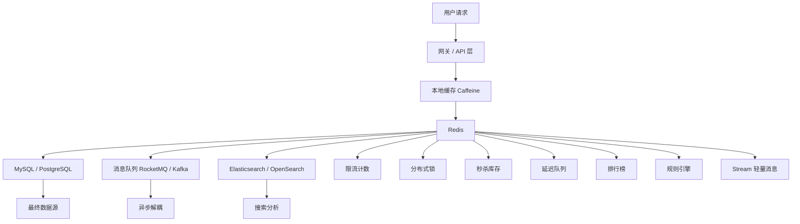

这是**第一篇 Redis 总览篇**。定位是系列开篇：**建立 Redis 的工程认知地图，不急着堆代码**。后续再进入商品缓存、分布式锁、秒杀库存、延迟队列、Stream 等专题案例。

[[Redis 深度案例 1：商品详情缓存系统]]
[[Redis 深度案例 2：优惠券领取防重复]]
[[Redis 深度案例 3：秒杀库存扣减]]
[[Redis 深度案例 4：订单延迟队列]]
[[Redis 深度案例 5：Redis Stream 异步任务]]
[[Redis 深度案例 6：Redis 规则引擎]]

---

## Redis 不是缓存工具，而是互联网系统里的内存加速层

## 1. 结论先说

很多 Java 后端工程师学习 Redis，第一反应是：

> Redis = 缓存。

这个理解不能说错，但明显太窄。

在真实互联网系统里，Redis 至少承担两类核心职责：

|类型|Redis 的作用|解决的问题|
|---|---|---|
|数据库保护层|缓存、布隆过滤器、限流、分布式锁|减少数据库压力，保护核心资源|
|内存业务引擎|秒杀库存、延迟队列、排行榜、Stream、规则引擎|用内存数据结构承载高频、低延迟业务逻辑|

所以，Redis 的工程定位不是：

> 一个简单的 key-value 缓存。

而更应该理解为：

> **基于内存数据结构的高性能业务加速层。**

如果只把 Redis 当缓存学，就会停留在“查缓存、查数据库、写缓存”这种入门层面；但如果把 Redis 放到互联网系统架构里看，就会发现它经常站在**数据库、消息队列、限流系统、任务调度系统、业务规则引擎**之间，承担非常关键的中间层能力。

---

## 2. 为什么 Redis 在后端系统里这么重要？

互联网后端系统的核心矛盾之一是：

> 请求越来越多，但数据库不能无限扛。

MySQL、PostgreSQL 这类关系型数据库适合做可靠存储、事务处理、复杂查询、数据一致性兜底，但它们不适合直接承受所有高频访问。

例如：

- 商品详情页被大量用户访问；
    
- 首页配置、活动规则被反复读取；
    
- 用户频繁点击领取优惠券；
    
- 秒杀活动瞬间涌入几十万请求；
    
- 接口被恶意刷请求；
    
- 订单超时关闭任务需要低延迟调度；
    
- 排行榜需要实时更新排名；
    
- 业务系统之间需要轻量事件通知。
    

这些场景如果全部直接压到数据库，会出现几个问题：

|问题|表现|
|---|---|
|查询压力过大|慢 SQL 增多，连接池被打满|
|写入竞争严重|行锁、间隙锁、唯一索引冲突|
|热点数据集中|某些商品、活动、用户反复访问|
|响应时间变长|接口 RT 上升，用户体验下降|
|系统雪崩风险|DB 扛不住后，上游服务连锁失败|

Redis 的价值就在于：

> 把一部分高频、简单、可内存化、低延迟的数据访问和状态计算，从数据库前面拦下来。

它不是替代数据库，而是帮数据库挡住不该由数据库承担的压力。

---

## 3. Redis 的第一类价值：保护数据库

Redis 最经典的用法，是作为数据库前面的保护层。

### 3.1 商品详情缓存：减少重复查询

典型场景：

用户访问商品详情页。

如果每次请求都查 MySQL：

```text
用户请求 → 商品服务 → MySQL 查询商品详情
```

当商品成为热点时，数据库会承受大量重复查询。

加入 Redis 后：

```text
用户请求
  ↓
先查 Redis
  ↓ 命中
直接返回商品详情

  ↓ 未命中
查 MySQL → 写入 Redis → 返回结果
```

这就是最常见的 **Cache Aside** 模式。

它的核心思想是：

> 应用程序先读缓存，缓存没有再读数据库，读到数据库结果后再写入缓存。

这类场景适合缓存：

- 商品详情；
    
- 博客文章详情；
    
- 用户基础资料；
    
- 首页配置；
    
- 字典数据；
    
- 活动规则；
    
- 热门评论；
    
- 类目导航。
    

但要注意，缓存不是简单加一层 Redis 就完事了。真正的生产问题在后面：

|问题|含义|
|---|---|
|缓存穿透|查询不存在的数据，请求绕过缓存打到数据库|
|缓存击穿|热点 key 过期，大量请求同时打到数据库|
|缓存雪崩|大量 key 同时过期，数据库瞬间被打爆|
|数据一致性|数据库更新后，缓存如何同步更新|
|热点 key|单个 key 请求量过高，Redis 节点压力过大|
|大 key|value 太大，影响网络传输和 Redis 性能|

所以第一篇深入案例，最适合做：

> 商品详情缓存系统：从 Cache Aside 到防穿透、防击穿、防雪崩。

这也是 Redis 实战系列里最应该优先掌握的内容。

---

### 3.2 布隆过滤器：提前拦截无效请求

缓存穿透的典型例子是：

```text
GET /product/999999999
```

这个商品 ID 根本不存在。

如果攻击者不断请求不存在的商品 ID，Redis 查不到，应用就会继续查数据库。最终结果是：

```text
Redis 没有 → MySQL 也没有 → 每次都打 DB
```

这就是缓存穿透。

一种常见解决方案是**空值缓存**：

```text
数据库查不到 → Redis 缓存一个空对象，设置较短 TTL
```

但如果攻击者每次都换一个不存在的 ID，空值缓存也会膨胀。

这时可以引入布隆过滤器：

```text
请求商品 ID
  ↓
先问布隆过滤器：这个 ID 是否可能存在？
  ↓
一定不存在：直接拒绝
  ↓
可能存在：继续查 Redis / MySQL
```

布隆过滤器的特点是：

|特点|说明|
|---|---|
|可以判断“一定不存在”|如果布隆过滤器说不存在，那就一定不存在|
|不能判断“一定存在”|它只能说“可能存在”|
|空间占用小|适合存大量 ID 集合|
|有误判率|可能把不存在的数据判断为可能存在|

在 Redis 场景里，布隆过滤器通常用于：

- 商品 ID 合法性过滤；
    
- 用户 ID 合法性过滤；
    
- 爬虫恶意请求拦截；
    
- 防止重复注册、重复提交的前置过滤；
    
- 大规模黑名单判断。
    

它的定位不是最终一致性保障，而是：

> 在数据库之前加一道低成本过滤网。

---

### 3.3 分布式锁：控制跨实例并发

单体应用里可以用 Java 的 `synchronized` 或 `ReentrantLock` 控制并发。

但在微服务或多实例部署下，请求可能落到不同机器：

```text
用户请求 A → 应用实例 1
用户请求 B → 应用实例 2
用户请求 C → 应用实例 3
```

这时 JVM 本地锁只在单个进程内有效，无法控制多个实例之间的并发。

Redis 分布式锁解决的是：

> 多个应用实例访问同一份业务资源时，如何实现跨进程互斥。

典型业务场景：

- 用户重复领取优惠券；
    
- 防止订单重复提交；
    
- 防止库存重复扣减；
    
- 防止定时任务多实例重复执行；
    
- 防止缓存重建时多个线程同时查数据库。
    

但分布式锁不是银弹。它有很多工程风险：

|风险|说明|
|---|---|
|锁过期时间太短|业务没执行完，锁先过期|
|锁过期时间太长|业务异常后，其他请求长时间无法执行|
|误删锁|A 的锁过期后 B 加锁，A 执行完误删 B 的锁|
|主从切换问题|Redis 主从复制延迟可能造成锁状态不一致|
|锁粒度过大|并发度下降|
|只靠锁防重|一旦锁失效，可能出现数据重复|

所以生产上的正确认知是：

> Redis 分布式锁可以降低并发冲突，但不能作为最终一致性的唯一保障。

例如优惠券领取场景，比较可靠的设计应该是：

```text
Redis 分布式锁：降低并发冲突
数据库唯一索引：做最终防重复兜底
业务幂等表：记录处理状态
```

也就是说：

> Redis 锁负责挡流量，数据库约束负责兜底。

---

### 3.4 限流计数：防止接口被打爆

Redis 的 `INCR`、`EXPIRE`、Lua 脚本可以实现简单的接口限流。

例如：

```text
同一个用户 1 分钟内最多请求 60 次
同一个 IP 10 秒内最多请求 20 次
同一个接口整体 QPS 不超过 1000
```

常见实现思路：

```text
key = rate_limit:user:{userId}:api:{apiName}:minute:{yyyyMMddHHmm}

INCR key
首次创建时设置 EXPIRE 60 秒
超过阈值则拒绝请求
```

这种方式适合做：

- 登录接口防刷；
    
- 短信验证码限流；
    
- 评论发布限流；
    
- 秒杀接口前置限流；
    
- 文件上传限流；
    
- 开放 API 调用频率控制。
    

但要注意，Redis 限流也要考虑：

|问题|说明|
|---|---|
|固定窗口突刺|窗口边界可能出现瞬时双倍流量|
|Redis 热点 key|全局限流可能集中打一个 key|
|多机时间差|时间窗口依赖服务端时间|
|限流策略误伤|不能只按 IP，有些用户共享出口 IP|
|降级策略|被限流后返回什么、是否排队、是否重试|

生产系统里，限流往往不只靠 Redis，还可能结合：

- 网关限流；
    
- Sentinel；
    
- Nginx 限流；
    
- 本地令牌桶；
    
- Redis 全局计数；
    
- 风控策略。
    

Redis 在这里更适合作为：

> 跨实例共享的计数与状态存储。

---

## 4. Redis 的第二类价值：承载高性能业务能力

Redis 更高级的用法，不只是帮数据库挡请求，而是直接承载一部分业务逻辑。

这也是很多人学习 Redis 容易忽略的地方。

---

### 4.1 秒杀库存：用 Redis 扛住瞬时高并发

秒杀是 Redis 的经典场景。

如果秒杀请求全部直接查数据库、扣数据库库存：

```text
用户请求 → MySQL 查询库存 → MySQL 扣减库存 → 创建订单
```

高并发下会有几个问题：

- 数据库行锁竞争严重；
    
- 库存表成为热点；
    
- 大量无效请求进入数据库；
    
- 容易超卖、少卖；
    
- 请求 RT 急剧上升。
    

更常见的做法是：

```text
活动开始前：
MySQL 库存 → 预热到 Redis

用户抢购时：
Redis Lua 原子判断库存 + 扣减库存 + 记录用户抢购标记

扣减成功后：
发送 MQ 异步创建订单 / 落库
```

Lua 脚本的价值是：

> 把“判断库存是否充足”和“扣减库存”放在 Redis 内部一次性执行，避免并发中间态。

简化逻辑如下：

```lua
-- 伪代码
local stock = tonumber(redis.call('GET', stockKey))
if stock <= 0 then
    return 0
end

local exists = redis.call('SISMEMBER', userSetKey, userId)
if exists == 1 then
    return 2
end

redis.call('DECR', stockKey)
redis.call('SADD', userSetKey, userId)
return 1
```

这个场景体现了 Redis 的一个核心能力：

> Redis 不只是存数据，还可以通过原子操作承载高并发状态变更。

但秒杀系统不能只靠 Redis。完整链路还要考虑：

|问题|解决思路|
|---|---|
|防超卖|Redis 原子扣减 + DB 库存最终校验|
|防重复下单|Redis 用户标记 + DB 唯一索引|
|异步落库失败|MQ 重试 + 补偿任务|
|Redis 库存与 DB 不一致|活动结束后对账|
|用户支付超时|延迟任务关闭订单并回补库存|
|恶意刷接口|网关限流 + 风控 + 验证码|

所以秒杀库存适合做 Redis 进阶案例，而不是第一篇入门案例。

---

### 4.2 延迟队列：用 ZSet 做任务调度

Redis 的 ZSet 可以天然支持按分数排序。

如果我们把任务执行时间作为 score：

```text
key: delay:order:close
member: orderId
score: 订单超时关闭时间戳
```

那么就可以通过 ZSet 实现延迟队列：

```text
定时扫描 score <= 当前时间 的任务
  ↓
抢占任务
  ↓
执行业务逻辑
  ↓
成功后删除任务
```

典型业务场景：

- 订单 30 分钟未支付自动关闭；
    
- 优惠券到期提醒；
    
- 活动开始前通知；
    
- 支付超时补偿检查；
    
- 任务失败后延迟重试；
    
- 轻量级定时任务调度。
    

ZSet 延迟队列的核心优势是：

|优势|说明|
|---|---|
|实现简单|不需要引入完整 MQ|
|延迟精度可控|取决于扫描频率|
|查询方便|按 score 范围取到期任务|
|适合轻量任务|中小规模任务调度很实用|

但它也有明显边界：

|问题|说明|
|---|---|
|多实例并发抢任务|需要 Lua 原子领取|
|任务失败处理|需要重试次数和死信队列|
|消费幂等|关闭订单必须可重复执行|
|延迟精度有限|扫描间隔决定精度|
|大规模任务堆积|Redis 内存和扫描压力变大|
|不适合复杂消息系统|大规模消息仍应考虑 RocketMQ / Kafka|

所以 Redis 延迟队列适合教学，但必须讲清楚边界：

> 它适合轻量任务调度，不适合替代专业 MQ 的全部能力。

---

### 4.3 排行榜：ZSet 的天然业务场景

排行榜是 Redis ZSet 最典型的业务应用。

例如：

```text
key: rank:article:hot
member: articleId
score: hotScore
```

常见操作：

```text
文章阅读量 +1 → ZINCRBY
查询 Top 100 → ZREVRANGE
查询某文章排名 → ZREVRANK
查询某用户积分排名 → ZREVRANK
```

适合场景：

- 文章热榜；
    
- 商品销量榜；
    
- 用户积分榜；
    
- 游戏排行榜；
    
- 活动助力榜；
    
- 直播间贡献榜。
    

ZSet 排行榜的价值在于：

> 它把排序这件事从数据库中拿出来，放到内存数据结构里实时维护。

如果用 MySQL 实时查排行榜，通常会写：

```sql
SELECT article_id, hot_score
FROM article_stat
ORDER BY hot_score DESC
LIMIT 100;
```

在数据量和更新频率很高时，这种排序压力很容易变大。

Redis ZSet 则适合高频更新、高频查询的实时排名。

但排行榜也有风险：

|问题|说明|
|---|---|
|分数设计|热度分不能只看阅读量，可能需要时间衰减|
|数据持久化|Redis 排行榜需要定期落库|
|冷热榜拆分|全量排行榜可能过大|
|防刷|阅读量、点赞数可能被刷|
|多维榜单|日榜、周榜、总榜需要不同 key 设计|

---

### 4.4 Pub/Sub：适合通知，不适合核心消息链路

Redis Pub/Sub 是发布订阅模型。

```text
服务 A 发布消息 → Redis Channel → 服务 B / C / D 收到消息
```

适合场景：

- 本地缓存刷新通知；
    
- 配置变更广播；
    
- 非核心事件通知；
    
- WebSocket 消息转发；
    
- 管理后台操作通知。
    

但 Pub/Sub 有一个关键问题：

> 它不持久化消息。

如果消费者不在线，消息就丢了。

所以 Pub/Sub 不适合：

- 订单创建；
    
- 支付成功；
    
- 库存扣减；
    
- 积分发放；
    
- 优惠券核销；
    
- 任何要求可靠投递的核心业务链路。
    

这类场景应该优先考虑：

- RocketMQ；
    
- Kafka；
    
- RabbitMQ；
    
- Redis Stream。
    

Pub/Sub 的工程定位应该是：

> 轻量通知机制，而不是可靠消息队列。

---

### 4.5 Redis Stream：轻量级消息队列

Redis Stream 是比 Pub/Sub 更适合生产教学的消息能力。

它支持：

- 消息持久化；
    
- Consumer Group；
    
- ACK；
    
- Pending List；
    
- 消费者重试；
    
- 多消费者分摊消息。
    

典型场景：

- 轻量异步任务；
    
- 操作日志异步处理；
    
- 站内通知；
    
- 积分发放；
    
- 用户行为事件收集；
    
- 小规模事件驱动系统。
    

简化链路：

```text
订单服务 XADD order:event
  ↓
积分消费者组读取消息
  ↓
通知消费者组读取消息
  ↓
消费成功后 XACK
```

和 Pub/Sub 相比：

|能力|Pub/Sub|Stream|
|---|---|---|
|消息持久化|不支持|支持|
|消费组|不支持|支持|
|ACK|不支持|支持|
|离线消费|不支持|支持|
|适合核心链路|不适合|轻量场景可用|

但 Redis Stream 也不能无脑替代 RocketMQ / Kafka。

|对比项|Redis Stream|RocketMQ / Kafka|
|---|---|---|
|部署复杂度|低|中高|
|消息吞吐|中高|高|
|消息治理能力|中|强|
|事务消息|弱|RocketMQ 强|
|延迟消息|需自行设计|RocketMQ 原生支持|
|消息堆积能力|受 Redis 内存影响|更适合大规模堆积|
|适合场景|轻量异步任务|核心业务消息链路|

所以 Stream 的合理定位是：

> 在不想引入完整 MQ 的轻量场景下，提供比 Pub/Sub 更可靠的消息能力。

---

### 4.6 规则引擎：Redis 的高级业务用法

规则引擎不是 Redis 入门场景。

它更像是把业务规则预加载到 Redis，通过 Redis 数据结构做快速匹配。

例如营销活动：

```text
规则 1：用户等级 >= 3 可参与
规则 2：商品属于手机类目可参与
规则 3：活动时间在 2026-05-01 到 2026-05-31
规则 4：用户必须拥有某个标签
```

可能用到的数据结构：

|数据结构|用法|
|---|---|
|Hash|存储活动规则详情|
|Set|存储活动可参与商品集合|
|Set|存储用户标签|
|ZSet|存储活动时间窗口|
|String|存储规则开关|
|Pub/Sub|通知本地缓存刷新|

典型链路：

```text
规则后台配置活动
  ↓
规则数据写入数据库
  ↓
同步到 Redis
  ↓
业务请求到来
  ↓
从 Redis 快速读取规则并匹配
  ↓
返回是否命中活动
```

这个场景体现的是：

> Redis 可以作为业务规则的高速读取和匹配层。

但它的难点不是 Redis 命令，而是业务建模：

- 规则如何抽象；
    
- 规则如何版本化；
    
- 规则如何灰度发布；
    
- 规则如何回滚；
    
- Redis 和数据库如何一致；
    
- 本地缓存和 Redis 如何配合；
    
- 规则命中结果如何审计。
    

所以规则引擎适合放到 Redis 系列后期，不适合作为第一篇案例。

---

## 5. Redis 常见数据结构与业务场景映射

学习 Redis，不要只背命令，要建立“数据结构 → 业务模型”的映射。

|Redis 数据结构|核心能力|典型业务场景|
|---|---|---|
|String|简单 KV、计数、缓存|商品详情缓存、验证码、访问计数|
|Hash|对象字段存储|用户资料、商品摘要、活动规则|
|List|队列、栈|简单任务队列、最新消息列表|
|Set|去重、集合运算|用户标签、点赞去重、黑名单|
|ZSet|排序、延迟调度|排行榜、延迟队列、时间窗口|
|Bitmap|位图统计|签到、活跃用户统计|
|HyperLogLog|基数估算|UV 统计|
|Stream|持久化消息流|轻量消息队列、异步任务|
|Pub/Sub|实时广播|缓存刷新、配置变更通知|
|Lua|原子组合操作|秒杀扣库存、原子抢任务|

真正的 Redis 实战能力，不是知道这些命令怎么写，而是能判断：

> 当前业务状态适合用哪种 Redis 数据结构表达。

例如：

|业务问题|更适合的数据结构|
|---|---|
|判断用户是否领取过优惠券|Set / String|
|实时维护文章热榜|ZSet|
|缓存商品详情对象|String / Hash|
|记录用户每日签到|Bitmap|
|统计网站 UV|HyperLogLog|
|订单 30 分钟后关闭|ZSet|
|轻量异步任务|Stream|
|秒杀库存原子扣减|String + Set + Lua|

---

## 6. Redis 适合什么，不适合什么？

### 6.1 适合 Redis 的场景

Redis 适合处理这类问题：

|特征|说明|
|---|---|
|高频访问|同一类数据被大量重复读取|
|低延迟要求|希望毫秒级甚至亚毫秒级响应|
|数据结构简单|KV、集合、排序、计数、状态标记|
|可接受最终一致|不要求每一步都强事务一致|
|适合内存存储|数据量可控，热数据明显|
|业务状态短期有效|验证码、token、限流窗口、活动状态|
|需要原子操作|扣库存、抢任务、计数器|

---

### 6.2 不适合 Redis 的场景

Redis 不适合处理这些问题：

|场景|原因|
|---|---|
|复杂 SQL 查询|Redis 不是关系型数据库|
|多表关联分析|不适合 join 和复杂聚合|
|强事务一致性|Redis 事务能力有限|
|海量冷数据存储|内存成本高|
|长期可靠消息堆积|应考虑 MQ|
|大对象频繁读写|容易产生大 key 问题|
|核心账务余额唯一来源|应以数据库为准|
|全文检索|应使用 Elasticsearch / OpenSearch|

一个重要原则：

> Redis 适合作为加速层、状态层、缓冲层，不适合作为所有核心数据的最终事实来源。

在大多数业务中，MySQL 仍然是最终数据源，Redis 是高性能辅助层。

---

## 7. Redis 的生产风险：这部分比命令更重要

很多人会用 Redis，但写出来的系统一上线就出问题，原因通常不是不会命令，而是不理解生产风险。

---

### 7.1 缓存一致性风险

典型问题：

```text
数据库更新成功了，但缓存没删掉
缓存删除成功了，但数据库更新失败了
缓存先删，后面旧请求又把旧数据写回缓存
```

常见策略：

|策略|说明|
|---|---|
|更新数据库后删除缓存|最常见|
|延迟双删|降低旧数据回写风险|
|Binlog 同步缓存|Canal 等方案|
|设置 TTL|避免脏数据永久存在|
|查询时重建缓存|Cache Aside 模式|

核心原则：

> 缓存一致性通常追求最终一致，不要轻易承诺强一致。

如果业务真的要求强一致，就不应该完全依赖缓存读结果。

---

### 7.2 热点 key 风险

热点 key 是指某个 key 被极高频访问。

例如：

```text
product:detail:10001
activity:rule:618
homepage:config
```

热点 key 可能导致：

- 单个 Redis 节点 CPU 飙高；
    
- 网络出口压力过大；
    
- 请求排队；
    
- Redis 响应变慢；
    
- 上游服务线程堆积。
    

常见解决方案：

|方案|说明|
|---|---|
|本地缓存|Caffeine + Redis 二级缓存|
|热点 key 拆分|多副本 key 分散读压力|
|提前预热|活动前加载热点数据|
|TTL 随机化|避免同时过期|
|限流降级|极端情况下保护系统|

---

### 7.3 大 key 风险

大 key 不是指 key 名字很长，而是 value 很大。

例如：

- 一个 String 存几 MB JSON；
    
- 一个 Hash 有几十万个 field；
    
- 一个 Set 存几百万用户 ID；
    
- 一个 ZSet 存超大排行榜。
    

大 key 的问题：

|问题|说明|
|---|---|
|网络传输慢|一次返回大量数据|
|阻塞 Redis|删除、读取大 key 可能阻塞|
|内存倾斜|某个节点内存占用异常|
|主从同步压力|大 key 复制成本高|
|集群迁移困难|slot 迁移时成本高|

治理思路：

- 控制 value 大小；
    
- 拆分 key；
    
- 分页读取；
    
- 使用 `UNLINK` 异步删除；
    
- 监控 bigkey；
    
- 避免一次性 `HGETALL` 超大 Hash。
    

---

### 7.4 缓存雪崩风险

缓存雪崩指大量 key 同时失效，大量请求瞬间打到数据库。

常见原因：

- TTL 设置成相同时间；
    
- Redis 宕机；
    
- 活动缓存统一过期；
    
- 批量缓存刷新失败。
    

解决方案：

|方案|说明|
|---|---|
|TTL 随机化|避免大量 key 同时过期|
|多级缓存|本地缓存 + Redis|
|熔断降级|DB 压力过高时返回兜底数据|
|缓存预热|活动前提前加载|
|Redis 高可用|Sentinel / Cluster|
|请求合并|同一 key 只允许一个线程重建缓存|

---

### 7.5 Redis 不是最终一致性的唯一保障

这点非常关键。

很多 Redis 方案都需要数据库兜底。

|Redis 方案|数据库兜底|
|---|---|
|分布式锁防重复领取|唯一索引兜底|
|秒杀一人一单|订单唯一约束兜底|
|Redis 预扣库存|DB 库存最终校验|
|布隆过滤器判断存在性|DB 仍是最终数据源|
|延迟队列关闭订单|订单状态幂等更新|
|Stream 消费消息|消费记录表防重复|

工程上要形成一个认知：

> Redis 是高性能路径，数据库是最终事实来源。

---

## 8. Redis 在系统架构里的位置

可以用一张图理解 Redis 的位置：



从架构视角看，Redis 通常处在：

```text
应用服务 和 数据库 / MQ / 搜索系统 之间
```

它负责：

- 加速读取；
    
- 缓冲写入；
    
- 维护短期状态；
    
- 承担高频计数；
    
- 控制并发；
    
- 支撑轻量消息；
    
- 辅助任务调度；
    
- 降低核心存储压力。
    

---

## 9. 一名 Java 后端应该如何学习 Redis？

不要从命令大全开始学，也不要一上来就背八股文。

更好的路径是：

```text
第一层：理解 Redis 工程定位
  ↓
第二层：掌握核心数据结构
  ↓
第三层：学习缓存模式和数据库保护
  ↓
第四层：学习分布式锁、Lua、限流等并发控制能力
  ↓
第五层：学习延迟队列、Stream、排行榜等业务引擎能力
  ↓
第六层：学习高可用、集群、监控、故障治理
```

对应到实战专题，可以这样安排：

|顺序|专题|核心能力|
|--:|---|---|
|0|Redis 总览篇|建立工程认知地图|
|1|商品详情缓存系统|Cache Aside、防穿透、防击穿、防雪崩|
|2|优惠券领取防重复|分布式锁、Redisson、DB 唯一索引兜底|
|3|秒杀库存扣减|Lua 原子操作、预扣库存、一人一单|
|4|订单超时关闭|ZSet 延迟队列、任务抢占、幂等关闭|
|5|Redis Stream 异步任务|消费组、ACK、Pending、重试|
|6|Redis 规则引擎|Hash / Set / ZSet 组合建模|
|7|Redis 生产治理|热点 key、大 key、集群、监控、降级|

---

## 10. Redis 面试表达：不要只说“缓存”

如果面试官问：

> 你项目里 Redis 怎么用的？

普通回答：

> 我们用 Redis 缓存商品详情，减少数据库查询。

这个回答太浅。

更好的回答应该是：

> 我们项目里 Redis 主要承担两类职责。第一类是数据库保护层，比如商品详情缓存、热点数据缓存、布隆过滤器防穿透、限流计数，核心目标是减少 MySQL 压力。第二类是高并发状态处理，比如优惠券领取防重复、秒杀库存预扣减、订单超时关闭延迟队列，这类场景利用 Redis 的内存数据结构和原子操作承载短期状态。
> 
> 但我们不会把 Redis 当成最终数据源。比如分布式锁只负责降低并发冲突，最终防重复还是靠数据库唯一索引；秒杀库存 Redis 预扣成功后还要异步落库和对账；缓存数据也会通过 TTL、删除缓存、延迟双删等方式保证最终一致。

这段表达体现了几个能力：

- 知道 Redis 不只是缓存；
    
- 知道 Redis 和数据库的关系；
    
- 知道 Redis 的生产风险；
    
- 知道最终一致性和兜底设计；
    
- 知道不同业务场景的数据结构选型。
    

---

## 11. 本篇总结

Redis 的核心价值，不是“快”这么简单。

更准确地说：

> Redis 用高性能内存数据结构，把数据库不擅长承受的高频访问、短期状态、实时计数、轻量调度和原子并发控制，从核心存储系统前面拆出来。

它在互联网系统里的两条主线是：

|主线|典型场景|核心目标|
|---|---|---|
|保护数据库|缓存、布隆过滤器、限流、分布式锁|减少数据库压力|
|承载业务能力|秒杀、延迟队列、排行榜、Stream、规则引擎|提升业务响应和吞吐|

但 Redis 也有明确边界：

- 不适合复杂查询；
    
- 不适合做强事务系统；
    
- 不适合承载无限冷数据；
    
- 不适合作为核心账务唯一数据源；
    
- 不适合无脑替代专业 MQ；
    
- 不适合忽略一致性和兜底设计。
    

学习 Redis，最重要的不是背命令，而是建立这套判断能力：

> 什么场景该用 Redis？  
> 用 Redis 的哪个数据结构？  
> Redis 承担主链路还是辅助链路？  
> 失败后谁兜底？  
> 数据最终以谁为准？  
> 高并发下会不会击穿数据库？  
> 出现热点 key、大 key、缓存雪崩时怎么办？

这才是 Java 后端真正需要掌握的 Redis 实战能力。

---

## 12. 关键词

`Redis`、`缓存`、`Cache Aside`、`布隆过滤器`、`分布式锁`、`Redisson`、`Lua`、`秒杀库存`、`ZSet 延迟队列`、`Redis Stream`、`Pub/Sub`、`排行榜`、`规则引擎`、`缓存穿透`、`缓存击穿`、`缓存雪崩`、`热点 Key`、`大 Key`、`最终一致性`
