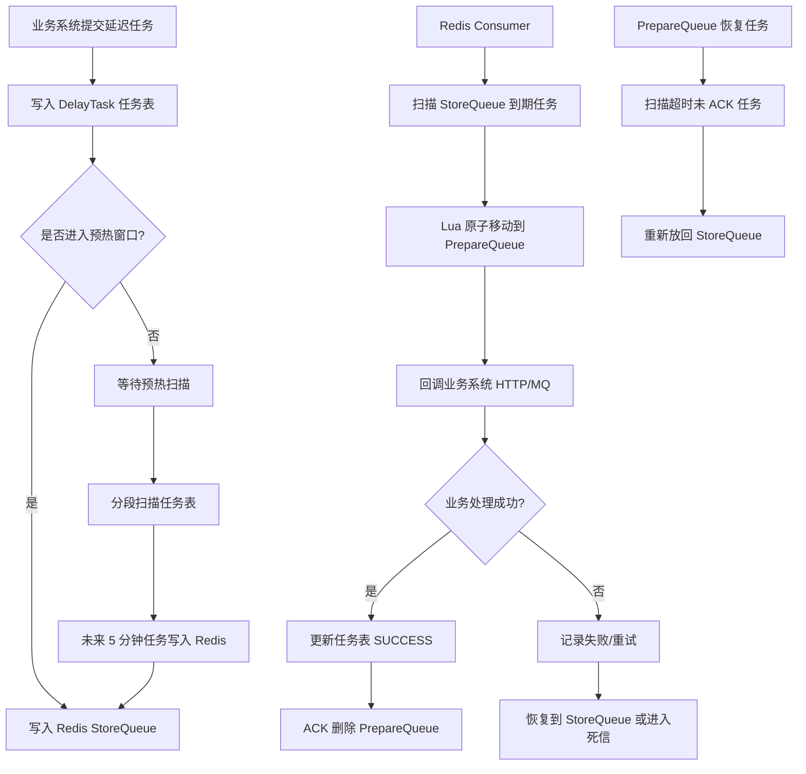

[xfg原文](https://mp.weixin.qq.com/s/jJ0vxdeKXHiYZLrwDEBOcQ)
[[Redis 深度案例 4：订单延迟队列]]

> **基于任务表分段扫描 + Redis 近端预热，优化分布式延迟任务的触达时效性**

这是一个更通用的**低延迟超时任务中心设计**：先用任务表承接全量延迟任务，再把即将到期的任务预热到 Redis 队列中，提升触发时效；同时通过StoreQueue / PrepareQueue 的二阶段消费方式保障至少消费一次。

---

# Redis 延迟任务中心设计：从库表扫描到低延迟触达

## 1. 结论先说

很多延迟任务一开始都可以用简单定时任务解决：

```text
每隔一段时间扫描数据库
  ↓
找到到期任务
  ↓
执行业务处理
  ↓
更新任务状态
```

但当任务量变大、业务类型变多、触达时效要求变高时，单纯扫库会逐渐暴露问题：

|问题|说明|
|---|---|
|扫描延迟高|任务可能已经到期，但要等下一轮扫描才处理|
|数据库压力大|大量任务集中在数据库中，频繁扫描成本高|
|扩展性差|单表、单任务扫描很难支撑大规模任务|
|业务耦合重|调度逻辑和业务处理逻辑混在一起|
|重复消费风险|多实例扫描同一批任务，可能重复处理|
|可靠性不足|任务领取后失败，可能丢失或重复执行|

所以更合理的方案不是简单地“用 Redis 替代数据库”，而是：

```text
任务表负责长期存储和可靠兜底
Redis 负责临近到期任务的低延迟触达
Worker 负责消费任务并回调业务系统
```

可以概括为一句话：

> **库表承接全量任务，Redis 承接即将到期的热任务。**

---

# 2. 什么是延迟任务？

延迟任务指的是：

> 当前不立即执行，而是在未来某个时间点执行的任务。

常见业务场景包括：

|业务场景|延迟任务|
|---|---|
|电商订单|30 分钟未支付自动关闭|
|活动系统|活动开始前切换状态|
|金融系统|T+1 对账|
|贷款系统|到期生成息费|
|营销系统|优惠券过期提醒|
|拼团系统|拼团超时失败退款|
|售后系统|超时自动确认收货或关闭售后|

这些场景本质都一样：

```text
业务系统提交任务
  ↓
任务中心保存任务
  ↓
到达执行时间
  ↓
任务中心触发业务动作
```

---

# 3. 最简单的做法：业务表定时扫描

最初级的方案是直接在业务表里加字段：

```sql
CREATE TABLE t_order (
    id BIGINT PRIMARY KEY AUTO_INCREMENT,
    order_no VARCHAR(64) NOT NULL,
    status VARCHAR(32) NOT NULL,
    expire_time DATETIME NOT NULL,
    created_at DATETIME NOT NULL,
    updated_at DATETIME NOT NULL
);
```

然后定时任务扫描：

```sql
SELECT order_no
FROM t_order
WHERE status = 'WAIT_PAY'
  AND expire_time <= NOW()
LIMIT 100;
```

处理完成后更新状态：

```sql
UPDATE t_order
SET status = 'CLOSED',
    updated_at = NOW()
WHERE order_no = ?
  AND status = 'WAIT_PAY';
```

这个方案适合小规模场景。

## 3.1 优点

|优点|说明|
|---|---|
|实现简单|只需要业务表 + 定时任务|
|成本低|不需要引入额外中间件|
|易理解|业务和任务状态都在一张表里|

## 3.2 缺点

|缺点|说明|
|---|---|
|不通用|每个业务系统都要自己写一套|
|扫描压力大|任务量大时频繁扫库|
|延迟不可控|扫描间隔决定触达延迟|
|耦合严重|调度逻辑和业务逻辑混在一起|
|扩展困难|多业务、多任务类型时难维护|

如果只是一个后台小功能，这样做没问题。

但如果延迟任务成为多个系统都要使用的基础能力，就应该抽象成**延迟任务中心**。

---

# 4. 任务中心方案：用任务表承接全量任务

## 4.1 为什么需要任务表？

当延迟任务越来越多时，不应该继续把任务逻辑散落在各个业务表里。

更合理的是设计一张通用任务表：

```sql
CREATE TABLE delay_task (
    id BIGINT PRIMARY KEY AUTO_INCREMENT COMMENT '主键ID',
    topic VARCHAR(64) NOT NULL COMMENT '任务主题',
    task_id VARCHAR(128) NOT NULL COMMENT '业务任务ID',
    execute_time DATETIME NOT NULL COMMENT '计划执行时间',
    status VARCHAR(32) NOT NULL COMMENT '任务状态：INIT/READY/PROCESSING/SUCCESS/FAILED/CANCELED',
    callback_type VARCHAR(32) NOT NULL COMMENT '回调类型：HTTP/MQ',
    callback_value VARCHAR(512) NOT NULL COMMENT '回调地址或MQ Topic',
    body TEXT COMMENT '任务参数',
    shard_no INT NOT NULL DEFAULT 0 COMMENT '扫描分片号',
    retry_count INT NOT NULL DEFAULT 0 COMMENT '重试次数',
    created_at DATETIME NOT NULL DEFAULT CURRENT_TIMESTAMP COMMENT '创建时间',
    updated_at DATETIME NOT NULL DEFAULT CURRENT_TIMESTAMP ON UPDATE CURRENT_TIMESTAMP COMMENT '更新时间',
    UNIQUE KEY uk_topic_task_id (topic, task_id),
    KEY idx_status_execute_time (status, execute_time),
    KEY idx_shard_execute_time (shard_no, status, execute_time)
) ENGINE=InnoDB DEFAULT CHARSET=utf8mb4 COMMENT='延迟任务表';
```

这张表的作用是：

```text
记录什么任务
记录什么时候执行
记录任务状态
记录如何回调业务系统
记录重试和失败信息
```

---

## 4.2 任务表的核心字段

|字段|含义|
|---|---|
|topic|任务类型，例如 ORDER_CLOSE、COUPON_EXPIRE|
|task_id|业务任务 ID，例如订单号|
|execute_time|任务应该执行的时间|
|status|任务状态|
|callback_type|触达方式，HTTP 或 MQ|
|callback_value|回调地址或消息 Topic|
|body|业务参数|
|shard_no|分片号，用于分段扫描|
|retry_count|重试次数|

这样设计后，业务系统只需要提交任务：

```text
订单服务：提交 ORDER_CLOSE 任务
优惠券服务：提交 COUPON_EXPIRE 任务
对账服务：提交 RECONCILE 任务
```

调度系统负责统一触达。

---

# 5. 分段扫描：解决大表扫描问题

## 5.1 为什么需要分段扫描？

如果所有任务都在一张表里，简单扫描会有性能问题：

```sql
SELECT *
FROM delay_task
WHERE status = 'INIT'
  AND execute_time <= NOW()
LIMIT 100;
```

任务量大时，即使有索引，多个扫描 worker 也容易争抢同一批数据。

所以需要引入**分片号**：

```text
shard_no = hash(task_id) % shardCount
```

例如：

```java
public int calculateShardNo(String taskId, int shardCount) {
    // 根据任务ID计算分片，避免所有任务集中到一个扫描范围
    return Math.abs(taskId.hashCode()) % shardCount;
}
```

写入任务时带上分片号：

```java
DelayTaskEntity task = new DelayTaskEntity();
task.setTopic("ORDER_CLOSE");
task.setTaskId(orderNo);
task.setExecuteTime(LocalDateTime.now().plusMinutes(30));
task.setStatus("INIT");
task.setShardNo(calculateShardNo(orderNo, 16));
delayTaskMapper.insert(task);
```

---

## 5.2 每个扫描 worker 负责一部分分片

比如一共有 16 个分片：

```text
shard_no = 0 ~ 15
```

可以让不同 worker 扫描不同分片：

```sql
SELECT *
FROM delay_task
WHERE shard_no = ?
  AND status = 'INIT'
  AND execute_time <= ?
ORDER BY execute_time ASC
LIMIT 100;
```

这样可以避免所有 worker 都扫同一批数据。

---

## 5.3 分段扫描的价值

|设计|作用|
|---|---|
|shard_no|把任务拆成多个扫描范围|
|多 worker|并发扫描不同分片|
|ORDER BY execute_time|优先处理最早到期任务|
|LIMIT|控制单次扫描数量|
|status 条件|避免重复扫描已处理任务|

分段扫描解决的是：

> **如何从任务表中高效找出即将到期的任务。**

但它还没有解决低延迟问题。

因为数据库扫描仍然是周期性的。

---

# 6. 为什么还需要 Redis 预热？

假设数据库扫描每 1 分钟执行一次。

一个任务在 10:00:01 到期，但扫描任务刚好在 10:00:00 执行过。

那么它可能要等到 10:01:00 才被处理。

这就有接近 1 分钟的额外延迟。

对于很多场景，这可以接受。

但如果任务要求低延迟触达，例如：

```text
订单超时关闭
活动状态准点切换
贷款息费及时生成
支付补偿查询
```

就不能完全依赖大间隔扫库。

因此可以引入 Redis 做近端队列。

核心思路是：

```text
较远期任务：先存在 MySQL 任务表
即将到期任务：提前预热到 Redis
真正到期后：从 Redis 快速消费
```

---

# 7. Redis 低延迟队列模型

## 7.1 Redis 队列不是存全量任务

一个常见误区是：

> 既然 Redis 快，那所有延迟任务都放 Redis 不就行了？

不建议这么做。

原因：

|问题|说明|
|---|---|
|Redis 内存成本高|大量长期任务不适合全部放内存|
|可靠性弱于 DB|Redis 不适合做唯一任务存储|
|任务跨度大|几天、几个月后的任务没必要常驻 Redis|
|运维风险高|大 Key、内存膨胀、持久化压力|

更合理的方式是：

```text
MySQL 保存全量任务
Redis 只保存即将执行的任务
```

例如：

```text
当前时间：10:00
预热窗口：未来 5 分钟
扫描任务：把 10:00 ~ 10:05 要执行的任务放入 Redis
```

---

## 7.2 Redis ZSet 设计

Redis 使用 ZSet 存储即将到期任务：

```text
key    = delay:queue:{topic}:{slot}
member = taskId
score  = executeTimestampMillis
```

例如：

```text
delay:queue:ORDER_CLOSE:0
delay:queue:ORDER_CLOSE:1
...
delay:queue:ORDER_CLOSE:7
```

写入示例：

```redis
ZADD delay:queue:ORDER_CLOSE:3 1715900000000 ORDER_10001
```

其中：

|元素|含义|
|---|---|
|ORDER_CLOSE|任务主题|
|3|Redis 队列槽位|
|ORDER_10001|任务 ID|
|1715900000000|任务执行时间戳|

---

# 8. Slot 分槽：避免单个 Redis Key 过大

原文提到一种方式：

```text
index = CRC32 & 7
```

本质是把任务分散到多个 Redis 队列中。

比如 8 个 slot：

```text
delay:queue:ORDER_CLOSE:0
delay:queue:ORDER_CLOSE:1
delay:queue:ORDER_CLOSE:2
delay:queue:ORDER_CLOSE:3
delay:queue:ORDER_CLOSE:4
delay:queue:ORDER_CLOSE:5
delay:queue:ORDER_CLOSE:6
delay:queue:ORDER_CLOSE:7
```

Java 示例：

```java
public final class DelayQueueSlotRouter {

    private static final int SLOT_COUNT = 8;

    private DelayQueueSlotRouter() {
    }

    /**
     * 根据 taskId 计算 Redis 队列槽位。
     * 这里用 hashCode 演示，生产中可以使用 CRC32、MurmurHash 等更稳定的哈希算法。
     */
    public static int route(String taskId) {
        return Math.abs(taskId.hashCode()) % SLOT_COUNT;
    }

    public static String buildStoreQueueKey(String topic, String taskId) {
        int slot = route(taskId);
        return "delay:queue:store:" + topic + ":" + slot;
    }

    public static String buildPrepareQueueKey(String topic, String taskId) {
        int slot = route(taskId);
        return "delay:queue:prepare:" + topic + ":" + slot;
    }
}
```

分槽的意义是：

|不分槽|分槽后|
|---|---|
|一个 ZSet 容纳所有任务|多个 ZSet 分摊任务|
|单 Key 容易变大|降低大 Key 风险|
|单 worker 扫描压力大|多 worker 可并行消费|
|横向扩展困难|可以按 slot 分配消费者|

---

# 9. StoreQueue 和 PrepareQueue：二阶段消费

## 9.1 为什么不能直接 pop？

如果消费者直接从 StoreQueue 删除任务，然后执行业务：

```text
从 Redis 删除任务
  ↓
执行业务回调
```

中间如果应用宕机，就会出现：

```text
Redis 任务已经没了
业务还没处理成功
任务丢失
```

所以原文提到使用二阶段消费：

```text
StoreQueue -> PrepareQueue -> 消费成功后删除
```

这是一种“至少消费一次”的设计。

---

## 9.2 两个队列的职责

|队列|作用|
|---|---|
|StoreQueue|存储待执行任务|
|PrepareQueue|存储已领取但未确认完成的任务|

流程如下：

```text
1. 任务到期，消费者从 StoreQueue 领取
2. 不直接删除，而是移动到 PrepareQueue
3. 消费者执行业务回调
4. 回调成功，从 PrepareQueue 删除
5. 如果失败或超时，再从 PrepareQueue 恢复到 StoreQueue
```

---

## 9.3 流程图

```mermaid
flowchart TD
    A[任务进入 StoreQueue] --> B{是否到期?}
    B -- 否 --> A
    B -- 是 --> C[原子移动到 PrepareQueue]
    C --> D[返回任务给消费者]
    D --> E[执行业务回调]
    E --> F{执行成功?}
    F -- 是 --> G[从 PrepareQueue 删除任务]
    F -- 否 --> H[重新放回 StoreQueue]
    H --> A

    I[PrepareQueue 超时扫描] --> J[找出长时间未确认任务]
    J --> H
```



---

# 10. Lua 实现原子移动

消费者领取任务时，需要保证：

```text
从 StoreQueue 查询到期任务
从 StoreQueue 删除
写入 PrepareQueue
```

这三个动作必须原子执行。

可以用 Lua 脚本实现。

```lua
-- KEYS[1] = StoreQueue key
-- KEYS[2] = PrepareQueue key
-- ARGV[1] = 当前时间戳
-- ARGV[2] = PrepareQueue 超时时间戳
-- ARGV[3] = 每次领取数量

local items = redis.call(
    'ZRANGEBYSCORE',
    KEYS[1],
    0,
    ARGV[1],
    'LIMIT',
    0,
    ARGV[3]
)

if #items == 0 then
    return items
end

for i = 1, #items do
    local item = items[i]

    redis.call('ZREM', KEYS[1], item)

    -- PrepareQueue 的 score 不是任务执行时间，而是领取超时时间
    redis.call('ZADD', KEYS[2], ARGV[2], item)
end

return items
```

Java 加载脚本：

```java
@Configuration
public class DelayQueueLuaConfig {

    /**
     * 原子领取任务：
     * StoreQueue -> PrepareQueue
     */
    @Bean
    public DefaultRedisScript<List> moveDueTaskToPrepareScript() {
        DefaultRedisScript<List> script = new DefaultRedisScript<>();

        script.setScriptText("""
            local items = redis.call(
                'ZRANGEBYSCORE',
                KEYS[1],
                0,
                ARGV[1],
                'LIMIT',
                0,
                ARGV[3]
            )

            if #items == 0 then
                return items
            end

            for i = 1, #items do
                local item = items[i]
                redis.call('ZREM', KEYS[1], item)
                redis.call('ZADD', KEYS[2], ARGV[2], item)
            end

            return items
            """);

        script.setResultType(List.class);
        return script;
    }
}
```

Java 调用：

```java
@Component
@RequiredArgsConstructor
public class RedisDelayQueueConsumer {

    private final StringRedisTemplate stringRedisTemplate;
    private final DefaultRedisScript<List> moveDueTaskToPrepareScript;

    /**
     * 从 StoreQueue 领取到期任务，并移动到 PrepareQueue。
     *
     * @param topic 任务主题
     * @param slot  队列槽位
     */
    @SuppressWarnings("unchecked")
    public List<String> poll(String topic, int slot) {
        String storeKey = "delay:queue:store:" + topic + ":" + slot;
        String prepareKey = "delay:queue:prepare:" + topic + ":" + slot;

        long now = System.currentTimeMillis();

        // 如果消费者 60 秒内没有 ack，则认为任务可能处理失败，可以被恢复
        long prepareExpireAt = now + 60_000L;

        List<String> taskIds = stringRedisTemplate.execute(
                moveDueTaskToPrepareScript,
                List.of(storeKey, prepareKey),
                String.valueOf(now),
                String.valueOf(prepareExpireAt),
                String.valueOf(100)
        );

        if (taskIds == null || taskIds.isEmpty()) {
            return List.of();
        }

        return taskIds;
    }
}
```

---

# 11. ACK：消费成功后确认删除

业务处理成功后，从 PrepareQueue 删除任务：

```java
@Service
@RequiredArgsConstructor
public class DelayTaskAckService {

    private final StringRedisTemplate stringRedisTemplate;

    /**
     * 消费成功后确认任务。
     */
    public void ack(String topic, String taskId) {
        String prepareKey = DelayQueueSlotRouter.buildPrepareQueueKey(topic, taskId);

        // 从 PrepareQueue 删除，表示任务完成
        stringRedisTemplate.opsForZSet().remove(prepareKey, taskId);
    }
}
```

这个动作的含义是：

```text
任务已经成功触达业务方
可以从待确认队列中彻底删除
```

---

# 12. PrepareQueue 恢复：防止任务卡死

如果消费者领取任务后宕机，任务会停留在 PrepareQueue。

所以需要一个恢复 worker：

```text
扫描 PrepareQueue 中 score <= 当前时间的任务
  ↓
说明任务领取后长时间没有 ack
  ↓
重新移动回 StoreQueue
```

Lua 脚本：

```lua
-- KEYS[1] = PrepareQueue key
-- KEYS[2] = StoreQueue key
-- ARGV[1] = 当前时间戳
-- ARGV[2] = 重新投递时间戳
-- ARGV[3] = 每次恢复数量

local items = redis.call(
    'ZRANGEBYSCORE',
    KEYS[1],
    0,
    ARGV[1],
    'LIMIT',
    0,
    ARGV[3]
)

if #items == 0 then
    return items
end

for i = 1, #items do
    local item = items[i]

    redis.call('ZREM', KEYS[1], item)

    -- 重新放回 StoreQueue，score 设置为当前时间，尽快重新消费
    redis.call('ZADD', KEYS[2], ARGV[2], item)
end

return items
```

Java 逻辑：

```java
@Component
@RequiredArgsConstructor
public class PrepareQueueRecoverWorker {

    private final StringRedisTemplate stringRedisTemplate;
    private final DefaultRedisScript<List> recoverPrepareTaskScript;

    /**
     * 定时恢复长时间未 ACK 的任务。
     */
    @Scheduled(fixedDelay = 10_000)
    public void recover() {
        String topic = "ORDER_CLOSE";

        for (int slot = 0; slot < 8; slot++) {
            recoverSlot(topic, slot);
        }
    }

    @SuppressWarnings("unchecked")
    private void recoverSlot(String topic, int slot) {
        String prepareKey = "delay:queue:prepare:" + topic + ":" + slot;
        String storeKey = "delay:queue:store:" + topic + ":" + slot;

        long now = System.currentTimeMillis();

        List<String> recoveredTaskIds = stringRedisTemplate.execute(
                recoverPrepareTaskScript,
                List.of(prepareKey, storeKey),
                String.valueOf(now),
                String.valueOf(now),
                String.valueOf(100)
        );

        if (recoveredTaskIds == null || recoveredTaskIds.isEmpty()) {
            return;
        }

        // 这里可以记录日志或指标，观察任务恢复频率
    }
}
```

这样就实现了：

```text
任务至少会被消费一次
失败或宕机后可以重新投递
```

注意：这是**至少一次**，不是**恰好一次**。

所以业务侧必须幂等。

---

# 13. 业务幂等：至少一次消费的必然要求

二阶段消费可以降低任务丢失概率，但会带来重复消费可能。

比如：

```text
消费者处理业务成功
  ↓
ACK 前应用宕机
  ↓
任务从 PrepareQueue 恢复到 StoreQueue
  ↓
任务再次被消费
```

因此业务处理必须幂等。

以订单关闭为例：

```sql
UPDATE t_order
SET status = 'CLOSED',
    close_time = NOW()
WHERE order_no = ?
  AND status = 'WAIT_PAY';
```

这个 SQL 天然幂等：

|当前状态|执行结果|
|---|---|
|WAIT_PAY|成功关闭|
|PAID|更新 0 行，忽略|
|CLOSED|更新 0 行，忽略|
|CANCELED|更新 0 行，忽略|

业务代码：

```java
@Service
@RequiredArgsConstructor
public class OrderTimeoutCloseHandler {

    private final OrderMapper orderMapper;

    /**
     * 处理订单超时关闭。
     * 注意：该方法必须幂等。
     */
    @Transactional(rollbackFor = Exception.class)
    public void handle(String orderNo) {
        int affectedRows = orderMapper.closeTimeoutOrder(orderNo);

        if (affectedRows == 0) {
            // 订单可能已经支付、关闭或取消，直接忽略
            return;
        }

        // 关闭成功后，可以释放库存、释放优惠券等
        // 这些动作同样建议做幂等设计
    }
}
```

---

# 14. 从任务表预热到 Redis

现在串起来。

## 14.1 提交任务

业务系统提交延迟任务：

```java
@Service
@RequiredArgsConstructor
public class DelayTaskSubmitService {

    private final DelayTaskMapper delayTaskMapper;
    private final RedisDelayTaskPreheatService preheatService;

    /**
     * 提交延迟任务。
     */
    @Transactional(rollbackFor = Exception.class)
    public void submit(DelayTaskSubmitCommand command) {
        int shardNo = Math.abs(command.taskId().hashCode()) % 16;

        DelayTaskEntity task = new DelayTaskEntity();
        task.setTopic(command.topic());
        task.setTaskId(command.taskId());
        task.setExecuteTime(command.executeTime());
        task.setStatus("INIT");
        task.setShardNo(shardNo);
        task.setCallbackType(command.callbackType());
        task.setCallbackValue(command.callbackValue());
        task.setBody(command.body());

        delayTaskMapper.insert(task);

        /*
         * 如果任务很快就要执行，可以直接写入 Redis。
         * 如果任务很久以后才执行，先只存在 MySQL，后续由预热任务扫描进入 Redis。
         */
        preheatService.tryPreheat(task);
    }
}
```

---

## 14.2 判断是否进入 Redis

```java
@Service
@RequiredArgsConstructor
public class RedisDelayTaskPreheatService {

    private final StringRedisTemplate stringRedisTemplate;

    /**
     * 预热窗口：未来 5 分钟内要执行的任务，写入 Redis。
     */
    private static final Duration PREHEAT_WINDOW = Duration.ofMinutes(5);

    public void tryPreheat(DelayTaskEntity task) {
        LocalDateTime now = LocalDateTime.now();

        if (task.getExecuteTime().isAfter(now.plus(PREHEAT_WINDOW))) {
            // 执行时间还很远，暂时只放 MySQL
            return;
        }

        writeToRedis(task);
    }

    private void writeToRedis(DelayTaskEntity task) {
        String queueKey = DelayQueueSlotRouter.buildStoreQueueKey(
                task.getTopic(),
                task.getTaskId()
        );

        long executeTimestamp = task.getExecuteTime()
                .atZone(ZoneId.systemDefault())
                .toInstant()
                .toEpochMilli();

        // 写入 Redis StoreQueue
        stringRedisTemplate.opsForZSet().add(
                queueKey,
                task.getTaskId(),
                executeTimestamp
        );
    }
}
```

---

## 14.3 定时预热任务

对于未来较远的任务，需要定时扫描任务表，把即将到期的任务推入 Redis。

```java
@Component
@RequiredArgsConstructor
public class DelayTaskPreheatWorker {

    private final DelayTaskMapper delayTaskMapper;
    private final RedisDelayTaskPreheatService preheatService;

    /**
     * 每 30 秒预热未来 5 分钟要执行的任务。
     */
    @Scheduled(fixedDelay = 30_000)
    public void preheat() {
        LocalDateTime now = LocalDateTime.now();
        LocalDateTime preheatEnd = now.plusMinutes(5);

        for (int shardNo = 0; shardNo < 16; shardNo++) {
            preheatShard(shardNo, now, preheatEnd);
        }
    }

    private void preheatShard(int shardNo, LocalDateTime now, LocalDateTime preheatEnd) {
        List<DelayTaskEntity> tasks = delayTaskMapper.selectPreheatTasks(
                shardNo,
                now,
                preheatEnd,
                200
        );

        for (DelayTaskEntity task : tasks) {
            preheatService.tryPreheat(task);

            // 标记为 READY，避免重复预热
            delayTaskMapper.markReady(task.getId());
        }
    }
}
```

Mapper 示例：

```java
@Mapper
public interface DelayTaskMapper extends BaseMapper<DelayTaskEntity> {

    /**
     * 查询即将到期、需要预热到 Redis 的任务。
     */
    @Select("""
        SELECT *
        FROM delay_task
        WHERE shard_no = #{shardNo}
          AND status = 'INIT'
          AND execute_time > #{now}
          AND execute_time <= #{preheatEnd}
        ORDER BY execute_time ASC
        LIMIT #{limit}
        """)
    List<DelayTaskEntity> selectPreheatTasks(
            @Param("shardNo") int shardNo,
            @Param("now") LocalDateTime now,
            @Param("preheatEnd") LocalDateTime preheatEnd,
            @Param("limit") int limit
    );

    /**
     * 标记任务已经预热到 Redis。
     */
    @Update("""
        UPDATE delay_task
        SET status = 'READY',
            updated_at = NOW()
        WHERE id = #{id}
          AND status = 'INIT'
        """)
    int markReady(@Param("id") Long id);
}
```

---

# 15. 消费成功后更新任务表状态

Redis 只负责低延迟触达，任务最终状态仍然需要回写任务表。

```java
@Service
@RequiredArgsConstructor
public class DelayTaskCompleteService {

    private final DelayTaskMapper delayTaskMapper;
    private final DelayTaskAckService ackService;

    /**
     * 任务执行成功后完成任务。
     */
    @Transactional(rollbackFor = Exception.class)
    public void complete(String topic, String taskId) {
        // 1. 更新数据库任务状态
        delayTaskMapper.markSuccess(topic, taskId);

        // 2. 从 Redis PrepareQueue 删除
        ackService.ack(topic, taskId);
    }
}
```

SQL：

```java
@Update("""
    UPDATE delay_task
    SET status = 'SUCCESS',
        updated_at = NOW()
    WHERE topic = #{topic}
      AND task_id = #{taskId}
      AND status IN ('READY', 'PROCESSING')
    """)
int markSuccess(@Param("topic") String topic,
                @Param("taskId") String taskId);
```

这里有一个细节：

> 如果 Redis ACK 成功但 DB 更新失败，或者 DB 成功但 Redis ACK 失败，都可能产生不一致。

生产里需要结合：

```text
幂等更新
补偿任务
状态巡检
失败重试
监控告警
```

不要指望 Redis 队列本身解决所有一致性问题。

---

# 16. 整体架构图



---

# 17. 和 Redisson DelayedQueue 的关系

原文里给了一个 Redisson 的简单案例：

```java
RBlockingQueue<Object> blockingQueue = redissonClient.getBlockingQueue("TASK");
RDelayedQueue<Object> delayedQueue = redissonClient.getDelayedQueue(blockingQueue);

delayedQueue.offerAsync("测试" + ++i, 100L, TimeUnit.MILLISECONDS);
```

这个例子适合帮助理解：

```text
延迟写入
到期进入阻塞队列
消费者 take 消费
```

但教学上要注意：

> Redisson DelayedQueue 可以简化 Redis 延迟队列的使用，但它不能替你解决完整的业务可靠性问题。

你仍然要考虑：

|问题|是否仍需处理|
|---|---|
|业务幂等|需要|
|消费失败重试|需要|
|死信任务|需要|
|任务状态落库|需要|
|多业务统一调度|需要|
|监控告警|需要|
|Redis 丢失后的补偿|需要|

所以 Redisson 更像是一个工具封装，而不是完整的延迟任务中心。

---

# 18. 这个方案和订单延迟队列有什么关系？

如果只做订单 30 分钟未支付关闭，可以简化成：

```text
订单创建成功
  ↓
写入 Redis ZSet
  ↓
30 分钟后消费
  ↓
关闭订单
```

但原文讨论的是更通用的延迟任务中心：

```text
多个业务系统
多种任务类型
任务表统一承接
分库分表支持大规模
Redis 预热降低触达延迟
二阶段消费保证至少一次触达
```

所以它比单纯的“订单延迟队列”更通用。

可以这样理解：

|层级|方案|
|---|---|
|小型订单系统|Redis ZSet 直接实现订单延迟队列|
|中型业务系统|任务表 + Redis ZSet|
|大型通用平台|分库分表任务表 + Redis 分槽队列 + 二阶段消费 + 注册中心 + 监控告警|

---

# 19. 生产落地时的关键风险

## 19.1 任务重复执行

原因：

```text
至少一次消费机制
消费者 ACK 前宕机
PrepareQueue 恢复后再次消费
```

解决：

```text
业务处理必须幂等
```

例如订单关闭：

```sql
UPDATE t_order
SET status = 'CLOSED'
WHERE order_no = ?
  AND status = 'WAIT_PAY';
```

---

## 19.2 任务丢失

原因：

```text
Redis 数据丢失
应用领取后宕机
任务状态更新失败
```

解决：

```text
任务表兜底
PrepareQueue 恢复
数据库补偿扫描
```

---

## 19.3 Redis 大 Key

原因：

```text
某一个 topic 的任务全部写入一个 ZSet
```

解决：

```text
topic + slot 分槽
```

---

## 19.4 数据库扫描压力

原因：

```text
任务表过大
扫描条件不合理
没有分片字段
```

解决：

```text
分库分表
shard_no 分段扫描
status + execute_time 索引
LIMIT 控制批量
```

---

## 19.5 调度系统和业务系统耦合

错误做法：

```text
调度系统直接写订单状态
直接释放库存
直接调用优惠券服务
```

更合理做法：

```text
调度系统只负责触达
业务系统负责具体处理
```

调度系统可以通过：

```text
HTTP 回调
MQ 消息
RPC 调用
```

触发业务系统。

---

# 20. Redis 延迟任务中心和 MQ 怎么选？

|方案|适用场景|
|---|---|
|数据库定时扫描|小规模、低频、低时效要求|
|Redis ZSet 延迟队列|中小规模、低延迟、已有 Redis|
|任务表 + Redis 预热|多业务、多任务类型、需要通用任务中心|
|RocketMQ 延迟消息|已有 MQ，核心链路可靠性要求高|
|XXL-JOB|定时调度、批处理、周期性任务|
|专业调度中心|大规模、多租户、复杂任务治理|

不是所有延迟任务都要上复杂架构。

判断标准是：

```text
任务量有多大？
是否要求低延迟？
是否需要统一任务中心？
是否允许重复消费？
是否有补偿机制？
是否已有 MQ 或调度平台？
```

---

# 21. 面试表达版本

如果面试官问：

> 如何设计一个低延迟的分布式延迟任务系统？

可以这样回答：

```text
我会把这个系统分成两层。

第一层是任务表，负责保存全量延迟任务，包括 topic、taskId、executeTime、status、callbackType、callbackValue、shardNo 等字段。任务表是可靠存储和最终兜底。

第二层是 Redis 近端队列，负责低延迟触达。不是所有任务都放 Redis，而是通过预热任务把未来几分钟即将执行的任务从任务表加载到 Redis ZSet。ZSet 的 member 是任务 ID，score 是执行时间戳。

为了避免单个 Redis Key 过大，会按照 topic + slot 分槽，比如 slot = CRC32(taskId) % 8，不同 slot 可以由不同消费者并行处理。

消费时不直接从 StoreQueue 删除任务，而是用 Lua 脚本把到期任务从 StoreQueue 原子移动到 PrepareQueue。业务处理成功后再 ACK，从 PrepareQueue 删除。如果消费者宕机，PrepareQueue 中超时未 ACK 的任务会被恢复回 StoreQueue，这样可以保证至少消费一次。

但至少一次意味着任务可能重复执行，所以业务侧必须幂等。比如订单关闭必须使用状态机更新：

UPDATE t_order
SET status = 'CLOSED'
WHERE order_no = ?
  AND status = 'WAIT_PAY';

此外，还要有数据库补偿扫描、重试机制、死信队列、监控告警。Redis 负责低延迟触达，任务表负责可靠兜底，业务系统负责幂等处理。
```

---

# 22. 最终总结

这篇原文真正值得学习的地方，不是 Redisson DelayedQueue 的简单用法，而是它背后的工程设计思路：

```text
任务表保存全量任务
分库分表和分段扫描提升扫描能力
Redis 只承接即将到期的热任务
StoreQueue 按执行时间排序
PrepareQueue 承接已领取未确认任务
二阶段消费保证至少一次触达
业务幂等保证重复消费不出错
补偿任务保证最终可靠
```

可以浓缩成一句话：

> **延迟任务系统的核心不是“怎么延迟”，而是如何在大规模任务下兼顾触达时效、消费可靠性、系统扩展性和业务幂等性。**

学习 Redis 延迟队列时，不要只停留在：

```text
ZADD
ZRANGEBYSCORE
ZREM
```

更应该进一步理解：

```text
为什么要有任务表？
为什么要分段扫描？
为什么要 Redis 预热？
为什么要 StoreQueue / PrepareQueue？
为什么只能保证至少一次？
为什么业务必须幂等？
为什么还需要补偿？
```

这才是这个案例真正的技术价值。