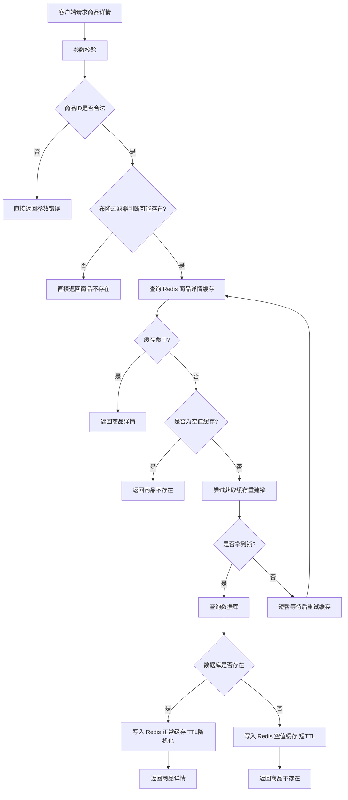

## 从 Cache Aside 到防穿透、防击穿、防雪崩、热点 Key

## 0. 先给结论

**第一个深度案例应该从“商品详情缓存系统”开始**。原因很直接：它是 Redis 最基础、最高频、最能体现“保护数据库”的场景。我们之前的教学方案里也明确把它排在第一个专题案例，并且核心内容包括 Cache Aside、缓存穿透、空值缓存、布隆过滤器、缓存击穿、互斥锁重建缓存、缓存雪崩、TTL 随机化和热点 Key。

这篇案例的目标不是写一个简单的：

```java
redis.get();
if (null) {
    db.get();
    redis.set();
}
```

而是设计一个接近真实业务的缓存查询链路：

```text
请求商品详情
  ↓
参数校验
  ↓
布隆过滤器判断商品 ID 是否可能存在
  ↓
查 Redis 商品缓存
  ↓
命中：直接返回
  ↓
未命中：尝试获取重建锁
  ↓
拿到锁：查询数据库，重建缓存
  ↓
没拿到锁：短暂等待后重试缓存
  ↓
数据库不存在：写入空值缓存，防止穿透
```

---

# 1. 业务场景：电商商品详情页

## 1.1 为什么选择商品详情？

商品详情页是典型高频读场景：

|访问对象|特点|
|---|---|
|商品标题|读多写少|
|商品价格|有变化，但不一定秒级强一致|
|商品图片|静态资源，通常走 CDN|
|商品状态|上架、下架、售罄，需要关注一致性|
|商品描述|读多写少|
|库存|高频变化，不建议直接放在普通详情缓存里|

一个真实商品详情接口通常不能每次都打数据库。否则首页推荐、搜索跳转、活动页曝光、详情页访问都会把数据库压垮。

所以 Redis 在这里的核心价值是：

> **把高频商品详情读请求从数据库前面挡下来。**

---

# 2. 本案例要解决的 5 个核心问题

## 2.1 普通缓存查询：Cache Aside

这是最基础模式：

```text
应用先查缓存
缓存没有再查数据库
查到数据库后写回缓存
```

它的优点是简单、通用、工程上最常见。

缺点是：如果处理不好，会引入穿透、击穿、雪崩、一致性问题。

---

## 2.2 缓存穿透

### 现象

用户请求一个数据库里根本不存在的商品 ID：

```text
/product/999999999
```

缓存没有，数据库也没有。

如果大量请求都打这种不存在 ID：

```text
Redis 未命中
  ↓
MySQL 查询不存在
  ↓
下一次请求还是 Redis 未命中
  ↓
继续打 MySQL
```

这就是缓存穿透。

### 解决方式

常见方案：

|方案|说明|
|---|---|
|参数校验|明显非法 ID 直接拦截|
|空值缓存|DB 不存在时，Redis 缓存一个空对象|
|布隆过滤器|提前判断 ID 是否可能存在|

本案例会组合使用：

```text
参数校验 + 布隆过滤器 + 空值缓存
```

---

## 2.3 缓存击穿

### 现象

某个热点商品缓存刚好过期，大量请求同时进来：

```text
热点商品缓存过期
  ↓
10000 个请求同时未命中 Redis
  ↓
10000 个请求同时查 MySQL
  ↓
数据库瞬间被打爆
```

这就是缓存击穿。

### 解决方式

使用 Redis 分布式互斥锁：

```text
只有一个请求拿到锁去查 DB 并重建缓存
其他请求等待一小段时间后重试缓存
```

---

## 2.4 缓存雪崩

### 现象

大量缓存 Key 在同一时间过期：

```text
product:detail:1  10:00:00 过期
product:detail:2  10:00:00 过期
product:detail:3  10:00:00 过期
...
```

结果某个时间点大量请求同时打数据库。

### 解决方式

TTL 随机化：

```text
基础过期时间 30 分钟
随机偏移 0 ~ 10 分钟
最终 TTL = 30 ~ 40 分钟
```

---

## 2.5 缓存一致性

商品数据更新时，缓存和数据库可能短暂不一致。

常见策略：

```text
更新数据库
  ↓
删除缓存
```

而不是：

```text
更新数据库
  ↓
更新缓存
```

因为“更新缓存”容易受并发写覆盖影响。

本案例采用：

> **更新数据库后删除缓存，下次查询时再重建。**

---

# 3. 系统架构设计

## 3.1 查询链路



---

## 3.2 核心 Key 设计

```text
product:detail:{productId}          商品详情缓存
product:detail:null:{productId}     可选：空值缓存，也可以和详情 Key 共用
lock:product:detail:{productId}     商品缓存重建锁
bf:product:id                       商品 ID 布隆过滤器
```

实际项目里可以统一加业务前缀：

```text
mall:product:detail:{productId}
mall:lock:product:detail:{productId}
mall:bf:product:id
```

---

# 4. 表结构设计

## 4.1 商品表

```sql
CREATE TABLE product (
    id BIGINT UNSIGNED NOT NULL AUTO_INCREMENT COMMENT '主键ID',
    product_code VARCHAR(64) NOT NULL COMMENT '商品编码',
    name VARCHAR(128) NOT NULL COMMENT '商品名称',
    subtitle VARCHAR(255) DEFAULT NULL COMMENT '商品副标题',
    price DECIMAL(10,2) NOT NULL COMMENT '商品价格',
    status TINYINT NOT NULL COMMENT '商品状态：0-下架，1-上架',
    detail TEXT DEFAULT NULL COMMENT '商品详情',
    version INT NOT NULL DEFAULT 0 COMMENT '版本号',
    create_time DATETIME NOT NULL DEFAULT CURRENT_TIMESTAMP COMMENT '创建时间',
    update_time DATETIME NOT NULL DEFAULT CURRENT_TIMESTAMP ON UPDATE CURRENT_TIMESTAMP COMMENT '更新时间',
    PRIMARY KEY (id),
    UNIQUE KEY uk_product_code (product_code),
    KEY idx_status (status)
) ENGINE=InnoDB DEFAULT CHARSET=utf8mb4 COMMENT='商品表';
```

## 4.2 示例数据

```sql
INSERT INTO product 
(product_code, name, subtitle, price, status, detail)
VALUES
('P10001', 'Java 后端进阶课程', 'Redis、MQ、MySQL、分布式系统实战', 199.00, 1, '适合 Java 后端开发者进阶学习'),
('P10002', 'Spring Boot 项目实战', '从单体应用到工程化开发', 129.00, 1, '包含接口设计、缓存、异步任务等内容'),
('P10003', 'Redis 实战专题课', '从缓存到内存业务引擎', 99.00, 1, '讲解 Redis 缓存、锁、队列、Lua 等实战场景');
```

---

# 5. 项目结构设计

```text
redis-product-cache-demo
├── controller
│   └── ProductController.java
├── service
│   ├── ProductQueryService.java
│   └── ProductCommandService.java
├── repository
│   └── ProductRepository.java
├── domain
│   └── Product.java
├── dto
│   └── ProductDetailDTO.java
├── cache
│   ├── ProductCacheService.java
│   ├── ProductCacheKey.java
│   └── ProductBloomFilter.java
├── config
│   └── RedisConfig.java
└── common
    ├── ApiResponse.java
    └── BizException.java
```

分层含义：

|层|职责|
|---|---|
|Controller|接收 HTTP 请求|
|Service|编排业务流程|
|Repository|访问数据库|
|Cache|封装 Redis 缓存细节|
|DTO|对外返回数据|
|Domain|领域对象 / 数据实体|
|Config|基础配置|

---

# 6. Maven 依赖

示例基于 Spring Boot + MyBatis-Plus + Redis + Redisson。

```xml
<dependencies>
    <!-- Web -->
    <dependency>
        <groupId>org.springframework.boot</groupId>
        <artifactId>spring-boot-starter-web</artifactId>
    </dependency>

    <!-- RedisTemplate / StringRedisTemplate -->
    <dependency>
        <groupId>org.springframework.boot</groupId>
        <artifactId>spring-boot-starter-data-redis</artifactId>
    </dependency>

    <!-- Redisson：分布式锁、布隆过滤器 -->
    <dependency>
        <groupId>org.redisson</groupId>
        <artifactId>redisson-spring-boot-starter</artifactId>
        <version>3.27.2</version>
    </dependency>

    <!-- MyBatis-Plus -->
    <dependency>
        <groupId>com.baomidou</groupId>
        <artifactId>mybatis-plus-spring-boot3-starter</artifactId>
        <version>3.5.7</version>
    </dependency>

    <!-- MySQL Driver -->
    <dependency>
        <groupId>com.mysql</groupId>
        <artifactId>mysql-connector-j</artifactId>
        <scope>runtime</scope>
    </dependency>

    <!-- Jackson -->
    <dependency>
        <groupId>com.fasterxml.jackson.core</groupId>
        <artifactId>jackson-databind</artifactId>
    </dependency>
</dependencies>
```

---

# 7. application.yml

```yaml
spring:
  datasource:
    url: jdbc:mysql://localhost:3306/redis_demo?useUnicode=true&characterEncoding=utf8&serverTimezone=Asia/Shanghai
    username: root
    password: root
    driver-class-name: com.mysql.cj.jdbc.Driver

  data:
    redis:
      host: localhost
      port: 6379
      database: 0
      timeout: 3000ms

mybatis-plus:
  configuration:
    map-underscore-to-camel-case: true

redisson:
  singleServerConfig:
    address: redis://localhost:6379
    database: 0
```

---

# 8. 核心代码实现

## 8.1 Product 实体

```java
package com.example.redis.domain;

import com.baomidou.mybatisplus.annotation.IdType;
import com.baomidou.mybatisplus.annotation.TableId;
import com.baomidou.mybatisplus.annotation.TableName;

import java.math.BigDecimal;
import java.time.LocalDateTime;

@TableName("product")
public class Product {

    @TableId(type = IdType.AUTO)
    private Long id;

    private String productCode;

    private String name;

    private String subtitle;

    private BigDecimal price;

    /**
     * 0-下架，1-上架
     */
    private Integer status;

    private String detail;

    private Integer version;

    private LocalDateTime createTime;

    private LocalDateTime updateTime;

    // getter/setter 省略
}
```

---

## 8.2 ProductDetailDTO

```java
package com.example.redis.dto;

import java.math.BigDecimal;

public class ProductDetailDTO {

    private Long id;

    private String productCode;

    private String name;

    private String subtitle;

    private BigDecimal price;

    private String detail;

    private Integer status;

    public static ProductDetailDTO from(Product product) {
        ProductDetailDTO dto = new ProductDetailDTO();
        dto.setId(product.getId());
        dto.setProductCode(product.getProductCode());
        dto.setName(product.getName());
        dto.setSubtitle(product.getSubtitle());
        dto.setPrice(product.getPrice());
        dto.setDetail(product.getDetail());
        dto.setStatus(product.getStatus());
        return dto;
    }

    // getter/setter 省略
}
```

---

## 8.3 ProductRepository

```java
package com.example.redis.repository;

import com.baomidou.mybatisplus.core.mapper.BaseMapper;
import com.example.redis.domain.Product;
import org.apache.ibatis.annotations.Mapper;

@Mapper
public interface ProductRepository extends BaseMapper<Product> {
}
```

---

## 8.4 ProductCacheKey

```java
package com.example.redis.cache;

public final class ProductCacheKey {

    private static final String PRODUCT_DETAIL_KEY_PREFIX = "mall:product:detail:";
    private static final String PRODUCT_DETAIL_LOCK_PREFIX = "mall:lock:product:detail:";
    public static final String PRODUCT_ID_BLOOM_FILTER = "mall:bf:product:id";

    private ProductCacheKey() {
    }

    public static String productDetailKey(Long productId) {
        return PRODUCT_DETAIL_KEY_PREFIX + productId;
    }

    public static String productDetailLockKey(Long productId) {
        return PRODUCT_DETAIL_LOCK_PREFIX + productId;
    }
}
```

---

# 9. 商品查询核心逻辑

## 9.1 查询 Service 总体设计

```java
package com.example.redis.service;

import com.example.redis.cache.ProductBloomFilter;
import com.example.redis.cache.ProductCacheService;
import com.example.redis.domain.Product;
import com.example.redis.dto.ProductDetailDTO;
import com.example.redis.repository.ProductRepository;
import org.springframework.stereotype.Service;

@Service
public class ProductQueryService {

    private final ProductCacheService productCacheService;
    private final ProductBloomFilter productBloomFilter;
    private final ProductRepository productRepository;

    public ProductQueryService(ProductCacheService productCacheService,
                               ProductBloomFilter productBloomFilter,
                               ProductRepository productRepository) {
        this.productCacheService = productCacheService;
        this.productBloomFilter = productBloomFilter;
        this.productRepository = productRepository;
    }

    public ProductDetailDTO queryProductDetail(Long productId) {
        if (productId == null || productId <= 0) {
            throw new IllegalArgumentException("商品ID不合法");
        }

        // 第一步：布隆过滤器提前拦截明显不存在的商品ID
        if (!productBloomFilter.mightContain(productId)) {
            return null;
        }

        // 第二步：走缓存查询主链路
        return productCacheService.queryProductDetail(
                productId,
                this::loadProductDetailFromDatabase
        );
    }

    private ProductDetailDTO loadProductDetailFromDatabase(Long productId) {
        Product product = productRepository.selectById(productId);

        if (product == null) {
            return null;
        }

        // 下架商品是否返回，要看业务。
        // 本案例假设下架商品前台不可见。
        if (product.getStatus() == null || product.getStatus() != 1) {
            return null;
        }

        return ProductDetailDTO.from(product);
    }
}
```

这里有一个关键点：

> `ProductQueryService` 不直接操作 Redis，而是把缓存细节交给 `ProductCacheService`。

这样做的好处是：

|设计|好处|
|---|---|
|QueryService 只关心业务|查询商品详情|
|CacheService 只关心缓存|Redis、TTL、锁、空值|
|Repository 只关心 DB|查询数据库|
|BloomFilter 独立封装|方便重建、扩容、初始化|

---

# 10. ProductCacheService：缓存主逻辑

## 10.1 缓存对象包装

为了区分“缓存没有”和“缓存了空值”，建议缓存一个包装对象。

```java
package com.example.redis.cache;

public class CacheValue<T> {

    /**
     * 是否为空值缓存。
     * true 表示数据库中不存在该对象。
     */
    private boolean empty;

    private T data;

    public static <T> CacheValue<T> of(T data) {
        CacheValue<T> value = new CacheValue<>();
        value.setEmpty(false);
        value.setData(data);
        return value;
    }

    public static <T> CacheValue<T> empty() {
        CacheValue<T> value = new CacheValue<>();
        value.setEmpty(true);
        value.setData(null);
        return value;
    }

    public boolean isEmpty() {
        return empty;
    }

    public T getData() {
        return data;
    }

    public void setEmpty(boolean empty) {
        this.empty = empty;
    }

    public void setData(T data) {
        this.data = data;
    }
}
```

---

## 10.2 缓存查询实现

```java
package com.example.redis.cache;

import com.example.redis.dto.ProductDetailDTO;
import com.fasterxml.jackson.core.type.TypeReference;
import com.fasterxml.jackson.databind.ObjectMapper;
import org.redisson.api.RLock;
import org.redisson.api.RedissonClient;
import org.springframework.data.redis.core.StringRedisTemplate;
import org.springframework.stereotype.Service;

import java.time.Duration;
import java.util.concurrent.ThreadLocalRandom;
import java.util.function.Function;

@Service
public class ProductCacheService {

    private static final Duration EMPTY_CACHE_TTL = Duration.ofMinutes(3);
    private static final Duration BASE_PRODUCT_CACHE_TTL = Duration.ofMinutes(30);
    private static final int RANDOM_TTL_MINUTES = 10;

    private static final Duration LOCK_WAIT_TIME = Duration.ofMillis(200);
    private static final Duration LOCK_LEASE_TIME = Duration.ofSeconds(5);

    private final StringRedisTemplate stringRedisTemplate;
    private final RedissonClient redissonClient;
    private final ObjectMapper objectMapper;

    public ProductCacheService(StringRedisTemplate stringRedisTemplate,
                               RedissonClient redissonClient,
                               ObjectMapper objectMapper) {
        this.stringRedisTemplate = stringRedisTemplate;
        this.redissonClient = redissonClient;
        this.objectMapper = objectMapper;
    }

    public ProductDetailDTO queryProductDetail(Long productId,
                                               Function<Long, ProductDetailDTO> dbLoader) {
        String cacheKey = ProductCacheKey.productDetailKey(productId);

        // 1. 先查 Redis
        CacheValue<ProductDetailDTO> cachedValue = getCacheValue(cacheKey);

        if (cachedValue != null) {
            if (cachedValue.isEmpty()) {
                return null;
            }
            return cachedValue.getData();
        }

        // 2. 缓存未命中，尝试获取缓存重建锁
        String lockKey = ProductCacheKey.productDetailLockKey(productId);
        RLock lock = redissonClient.getLock(lockKey);

        boolean locked = false;

        try {
            locked = lock.tryLock(
                    LOCK_WAIT_TIME.toMillis(),
                    LOCK_LEASE_TIME.toMillis(),
                    java.util.concurrent.TimeUnit.MILLISECONDS
            );

            if (!locked) {
                // 没拿到锁，说明其他线程可能正在重建缓存。
                // 当前线程短暂等待后重试缓存，避免直接打 DB。
                sleepQuietly(80);
                CacheValue<ProductDetailDTO> retryValue = getCacheValue(cacheKey);

                if (retryValue == null) {
                    // 降级策略：仍然没有缓存时，可以返回系统繁忙，也可以有限次重试。
                    // 教学案例里选择再等待一次，避免逻辑过度复杂。
                    sleepQuietly(120);
                    retryValue = getCacheValue(cacheKey);
                }

                if (retryValue == null || retryValue.isEmpty()) {
                    return null;
                }

                return retryValue.getData();
            }

            // 3. 拿到锁后必须 double check，防止重复重建
            CacheValue<ProductDetailDTO> doubleCheckValue = getCacheValue(cacheKey);
            if (doubleCheckValue != null) {
                if (doubleCheckValue.isEmpty()) {
                    return null;
                }
                return doubleCheckValue.getData();
            }

            // 4. 查询数据库
            ProductDetailDTO productDetail = dbLoader.apply(productId);

            if (productDetail == null) {
                // 5. 数据库也不存在，写入空值缓存，防止缓存穿透
                setCacheValue(cacheKey, CacheValue.empty(), EMPTY_CACHE_TTL);
                return null;
            }

            // 6. 数据库存在，写入正常缓存，TTL随机化，防止雪崩
            setCacheValue(cacheKey, CacheValue.of(productDetail), randomProductCacheTtl());

            return productDetail;

        } catch (InterruptedException e) {
            Thread.currentThread().interrupt();
            throw new RuntimeException("获取商品缓存重建锁被中断", e);
        } finally {
            if (locked && lock.isHeldByCurrentThread()) {
                lock.unlock();
            }
        }
    }

    private CacheValue<ProductDetailDTO> getCacheValue(String cacheKey) {
        String json = stringRedisTemplate.opsForValue().get(cacheKey);

        if (json == null || json.isBlank()) {
            return null;
        }

        try {
            return objectMapper.readValue(
                    json,
                    new TypeReference<CacheValue<ProductDetailDTO>>() {}
            );
        } catch (Exception e) {
            // 生产环境建议记录错误日志，并删除脏缓存
            stringRedisTemplate.delete(cacheKey);
            return null;
        }
    }

    private void setCacheValue(String cacheKey,
                               CacheValue<ProductDetailDTO> value,
                               Duration ttl) {
        try {
            String json = objectMapper.writeValueAsString(value);
            stringRedisTemplate.opsForValue().set(cacheKey, json, ttl);
        } catch (Exception e) {
            throw new RuntimeException("写入商品详情缓存失败", e);
        }
    }

    private Duration randomProductCacheTtl() {
        int randomMinutes = ThreadLocalRandom.current().nextInt(RANDOM_TTL_MINUTES + 1);
        return BASE_PRODUCT_CACHE_TTL.plusMinutes(randomMinutes);
    }

    private void sleepQuietly(long millis) {
        try {
            Thread.sleep(millis);
        } catch (InterruptedException e) {
            Thread.currentThread().interrupt();
        }
    }
}
```

---

# 11. 这段代码解决了什么问题？

## 11.1 防穿透

```java
if (productDetail == null) {
    setCacheValue(cacheKey, CacheValue.empty(), EMPTY_CACHE_TTL);
    return null;
}
```

数据库不存在时，不是什么都不做，而是写入一个短 TTL 的空值缓存。

效果：

```text
第一次请求不存在商品：
Redis miss → DB miss → 写入空值缓存

后续请求：
Redis 命中空值 → 直接返回不存在
```

---

## 11.2 防击穿

```java
locked = lock.tryLock(...);
```

热点 Key 失效后，只有拿到锁的线程可以查数据库。

其他线程：

```java
sleepQuietly(80);
CacheValue<ProductDetailDTO> retryValue = getCacheValue(cacheKey);
```

短暂等待后再查缓存。

这样可以避免大量线程同时打数据库。

---

## 11.3 防雪崩

```java
private Duration randomProductCacheTtl() {
    int randomMinutes = ThreadLocalRandom.current().nextInt(RANDOM_TTL_MINUTES + 1);
    return BASE_PRODUCT_CACHE_TTL.plusMinutes(randomMinutes);
}
```

商品缓存不会统一在 30 分钟后过期，而是在 30 ~ 40 分钟之间随机过期。

---

## 11.4 防止重复重建缓存

拿到锁后还有一次 double check：

```java
CacheValue<ProductDetailDTO> doubleCheckValue = getCacheValue(cacheKey);
```

原因是：

```text
线程 A 拿锁 → 查询 DB → 写缓存 → 释放锁
线程 B 等到锁 → 如果不 double check，就会重复查 DB
```

所以拿锁后必须再查一次 Redis。

---

# 12. 布隆过滤器设计

## 12.1 ProductBloomFilter

```java
package com.example.redis.cache;

import org.redisson.api.RBloomFilter;
import org.redisson.api.RedissonClient;
import org.springframework.stereotype.Component;

@Component
public class ProductBloomFilter {

    private final RedissonClient redissonClient;

    public ProductBloomFilter(RedissonClient redissonClient) {
        this.redissonClient = redissonClient;
    }

    public boolean mightContain(Long productId) {
        RBloomFilter<Long> bloomFilter = getBloomFilter();
        return bloomFilter.contains(productId);
    }

    public void add(Long productId) {
        RBloomFilter<Long> bloomFilter = getBloomFilter();
        bloomFilter.add(productId);
    }

    private RBloomFilter<Long> getBloomFilter() {
        RBloomFilter<Long> bloomFilter =
                redissonClient.getBloomFilter(ProductCacheKey.PRODUCT_ID_BLOOM_FILTER);

        // expectedInsertions：预计插入数量
        // falseProbability：误判率
        bloomFilter.tryInit(1_000_000L, 0.01);

        return bloomFilter;
    }
}
```

## 12.2 布隆过滤器的作用边界

布隆过滤器不是判断“商品一定存在”。

它只能判断：

```text
不存在：一定不存在
存在：可能存在
```

所以：

```java
if (!productBloomFilter.mightContain(productId)) {
    return null;
}
```

这一步只能提前拦截明显不存在的商品 ID，不能替代数据库查询。

---

# 13. 布隆过滤器初始化

## 13.1 启动时初始化

```java
package com.example.redis.cache;

import com.baomidou.mybatisplus.core.conditions.query.LambdaQueryWrapper;
import com.example.redis.domain.Product;
import com.example.redis.repository.ProductRepository;
import org.springframework.boot.CommandLineRunner;
import org.springframework.stereotype.Component;

import java.util.List;

@Component
public class ProductBloomFilterInitializer implements CommandLineRunner {

    private final ProductRepository productRepository;
    private final ProductBloomFilter productBloomFilter;

    public ProductBloomFilterInitializer(ProductRepository productRepository,
                                         ProductBloomFilter productBloomFilter) {
        this.productRepository = productRepository;
        this.productBloomFilter = productBloomFilter;
    }

    @Override
    public void run(String... args) {
        List<Product> products = productRepository.selectList(
                new LambdaQueryWrapper<Product>()
                        .select(Product::getId)
        );

        for (Product product : products) {
            productBloomFilter.add(product.getId());
        }
    }
}
```

## 13.2 生产环境注意点

启动时全量加载只适合教学和中小规模数据。

生产环境更推荐：

|方案|说明|
|---|---|
|离线任务构建|定时从 DB 扫描商品 ID 构建|
|增量更新|新增商品时同步写布隆过滤器|
|分片布隆过滤器|商品量极大时拆分|
|定期重建|解决删除数据无法从布隆过滤器移除的问题|

布隆过滤器有一个经典限制：

> **普通布隆过滤器支持新增，不支持准确删除。**

所以如果商品被删除，布隆过滤器里可能仍然认为它“可能存在”。这不是大问题，因为后面还有 Redis 和 DB 兜底。

---

# 14. 商品更新时如何处理缓存？

## 14.1 Command Service

```java
package com.example.redis.service;

import com.example.redis.cache.ProductBloomFilter;
import com.example.redis.cache.ProductCacheKey;
import com.example.redis.domain.Product;
import com.example.redis.repository.ProductRepository;
import org.springframework.data.redis.core.StringRedisTemplate;
import org.springframework.stereotype.Service;
import org.springframework.transaction.annotation.Transactional;

@Service
public class ProductCommandService {

    private final ProductRepository productRepository;
    private final StringRedisTemplate stringRedisTemplate;
    private final ProductBloomFilter productBloomFilter;

    public ProductCommandService(ProductRepository productRepository,
                                 StringRedisTemplate stringRedisTemplate,
                                 ProductBloomFilter productBloomFilter) {
        this.productRepository = productRepository;
        this.stringRedisTemplate = stringRedisTemplate;
        this.productBloomFilter = productBloomFilter;
    }

    @Transactional(rollbackFor = Exception.class)
    public void updateProduct(Product product) {
        if (product == null || product.getId() == null) {
            throw new IllegalArgumentException("商品信息不合法");
        }

        int updated = productRepository.updateById(product);

        if (updated <= 0) {
            throw new RuntimeException("商品更新失败");
        }

        // 更新数据库成功后删除缓存。
        // 不建议直接更新缓存，避免并发覆盖旧值。
        stringRedisTemplate.delete(ProductCacheKey.productDetailKey(product.getId()));
    }

    @Transactional(rollbackFor = Exception.class)
    public Long createProduct(Product product) {
        productRepository.insert(product);

        // 新增商品后写入布隆过滤器
        productBloomFilter.add(product.getId());

        // 新增商品一般不必立即写详情缓存。
        // 等第一次查询时再按 Cache Aside 模式加载。
        return product.getId();
    }

    @Transactional(rollbackFor = Exception.class)
    public void offlineProduct(Long productId) {
        Product product = new Product();
        product.setId(productId);
        product.setStatus(0);

        int updated = productRepository.updateById(product);

        if (updated <= 0) {
            throw new RuntimeException("商品下架失败");
        }

        // 下架后删除缓存，避免继续返回旧的上架商品详情
        stringRedisTemplate.delete(ProductCacheKey.productDetailKey(productId));
    }
}
```

---

# 15. 为什么是“更新数据库后删除缓存”？

## 15.1 推荐顺序

```text
先更新数据库
再删除缓存
```

原因：

|动作|说明|
|---|---|
|更新 DB|数据最终落到权威存储|
|删除缓存|让后续请求重新加载最新数据|

## 15.2 为什么不直接更新缓存？

直接更新缓存的问题是并发覆盖。

假设两个线程：

```text
线程 A：更新商品价格 100 → 120
线程 B：更新商品价格 120 → 130
```

如果它们都更新缓存，可能出现：

```text
DB 最终是 130
缓存却被线程 A 后写成 120
```

删除缓存比更新缓存更安全。

---

# 16. Controller 接口

```java
package com.example.redis.controller;

import com.example.redis.common.ApiResponse;
import com.example.redis.dto.ProductDetailDTO;
import com.example.redis.service.ProductQueryService;
import org.springframework.web.bind.annotation.*;

@RestController
@RequestMapping("/api/products")
public class ProductController {

    private final ProductQueryService productQueryService;

    public ProductController(ProductQueryService productQueryService) {
        this.productQueryService = productQueryService;
    }

    @GetMapping("/{productId}")
    public ApiResponse<ProductDetailDTO> getProductDetail(@PathVariable Long productId) {
        ProductDetailDTO detail = productQueryService.queryProductDetail(productId);

        if (detail == null) {
            return ApiResponse.success(null, "商品不存在或已下架");
        }

        return ApiResponse.success(detail);
    }
}
```

---

# 17. ApiResponse

```java
package com.example.redis.common;

public class ApiResponse<T> {

    private boolean success;
    private String message;
    private T data;

    public static <T> ApiResponse<T> success(T data) {
        ApiResponse<T> response = new ApiResponse<>();
        response.setSuccess(true);
        response.setMessage("success");
        response.setData(data);
        return response;
    }

    public static <T> ApiResponse<T> success(T data, String message) {
        ApiResponse<T> response = new ApiResponse<>();
        response.setSuccess(true);
        response.setMessage(message);
        response.setData(data);
        return response;
    }

    public static <T> ApiResponse<T> fail(String message) {
        ApiResponse<T> response = new ApiResponse<>();
        response.setSuccess(false);
        response.setMessage(message);
        response.setData(null);
        return response;
    }

    // getter/setter 省略
}
```

---

# 18. 接口测试路径

## 18.1 第一次查询

```http
GET /api/products/1
```

链路：

```text
Redis miss
  ↓
布隆过滤器可能存在
  ↓
获取锁
  ↓
查询 MySQL
  ↓
写入 Redis
  ↓
返回商品详情
```

## 18.2 第二次查询

```http
GET /api/products/1
```

链路：

```text
Redis hit
  ↓
直接返回
```

## 18.3 查询不存在商品

```http
GET /api/products/999999999
```

链路：

```text
布隆过滤器判断不存在
  ↓
直接返回商品不存在
```

如果布隆过滤器误判为“可能存在”：

```text
Redis miss
  ↓
MySQL miss
  ↓
写入空值缓存
  ↓
返回商品不存在
```

---

# 19. 这个案例的生产级改进点

## 19.1 缓存预热

对于首页、活动页、爆款商品，可以在活动开始前预热缓存：

```text
活动商品列表
  ↓
批量查询 DB
  ↓
批量写入 Redis
  ↓
活动开始后直接命中缓存
```

示例：

```java
public void warmUpProductCache(List<Long> productIds) {
    for (Long productId : productIds) {
        productCacheService.queryProductDetail(
                productId,
                this::loadProductDetailFromDatabase
        );
    }
}
```

---

## 19.2 热点 Key 本地缓存

对于极端热点商品，仅靠 Redis 可能也不够。

可以增加本地缓存，例如 Caffeine：

```text
请求
  ↓
本地缓存 Caffeine
  ↓
Redis
  ↓
MySQL
```

适合：

|场景|是否适合本地缓存|
|---|---|
|商品基础信息|适合|
|商品库存|不适合|
|商品价格|看一致性要求|
|商品状态|谨慎|

本地缓存的问题是：

> **多实例之间本地缓存不一致，需要额外的失效通知机制。**

可以用 Redis Pub/Sub 或 MQ 做缓存删除广播。

---

## 19.3 热点 Key 永不过期 + 异步刷新

普通商品：

```text
设置 TTL，过期后重建
```

超级热点商品：

```text
缓存逻辑不过期
后台线程异步刷新
```

缓存结构里加一个逻辑过期时间：

```json
{
  "data": {
    "id": 1,
    "name": "Redis 实战课"
  },
  "expireTime": "2026-05-17T12:00:00"
}
```

查询时：

```text
缓存存在 → 先返回旧数据
发现逻辑过期 → 后台异步刷新
```

优点：

> 用户请求几乎不会被缓存重建阻塞。

缺点：

> 可能短暂返回旧数据。

适合读多写少、允许短暂不一致的热点详情页。

---

# 20. 常见错误写法

## 20.1 错误一：缓存未命中直接查 DB，没有防击穿

```java
String json = redis.get(key);
if (json == null) {
    Product product = productMapper.selectById(id);
    redis.set(key, product);
}
```

问题：

> 热点缓存过期时，大量请求会同时打数据库。

---

## 20.2 错误二：不存在数据不缓存

```java
Product product = productMapper.selectById(id);
if (product == null) {
    return null;
}
```

问题：

> 不存在商品 ID 会持续穿透到数据库。

---

## 20.3 错误三：所有缓存 TTL 一样

```java
redis.set(key, value, Duration.ofMinutes(30));
```

问题：

> 批量缓存可能同时过期，造成缓存雪崩。

---

## 20.4 错误四：商品更新后不删除缓存

```java
productMapper.updateById(product);
```

问题：

> 数据库已经更新，Redis 还返回旧数据。

---

## 20.5 错误五：把库存放进商品详情缓存

商品库存是高频变化数据。

不建议这样设计：

```json
{
  "id": 1,
  "name": "Redis 实战课",
  "stock": 99
}
```

因为库存变化频繁，会导致详情缓存频繁失效。

更合理：

```text
商品基础详情缓存：product:detail:{id}
商品库存缓存：product:stock:{id}
```

---

# 21. 面试表达

## 21.1 面试官问：你们项目里 Redis 怎么用？

可以这样回答：

> 我们在商品详情查询里使用 Redis 做 Cache Aside 缓存。请求进来后先做参数校验，再通过布隆过滤器判断商品 ID 是否可能存在，避免大量非法 ID 穿透到数据库。然后查询 Redis 商品详情缓存，命中直接返回。未命中时使用 Redis 分布式锁控制缓存重建，只有一个线程查询数据库并写回缓存，其他线程短暂等待后重试缓存，避免热点 Key 失效造成缓存击穿。对于数据库不存在的商品，我们写入短 TTL 的空值缓存；对于正常商品缓存，我们使用基础 TTL 加随机偏移，降低缓存雪崩风险。商品更新时采用先更新数据库、再删除缓存的策略，保证最终一致性。

---

## 21.2 面试官问：缓存和数据库如何保证一致性？

可以这样回答：

> 商品详情属于读多写少场景，我们没有追求强一致，而是采用最终一致性。写操作先更新数据库，成功后删除 Redis 缓存。后续读请求如果发现缓存不存在，会重新从数据库加载最新数据并写入缓存。这样可以避免直接更新缓存带来的并发覆盖问题。对于极端一致性要求更高的场景，可以结合消息队列做缓存删除重试，或者通过 binlog 订阅做异步失效补偿。

---

## 21.3 面试官问：为什么要用布隆过滤器？只用空值缓存不行吗？

可以这样回答：

> 空值缓存可以解决一部分缓存穿透问题，但如果攻击请求的 ID 每次都不一样，就会产生大量空值 Key，Redis 内存也会被污染。布隆过滤器可以在访问 Redis 和数据库之前提前判断商品 ID 是否可能存在。它有误判率，但不会漏判，也就是说判断不存在时可以直接拦截，判断存在时再继续走缓存和数据库链路。实际项目里一般会组合使用布隆过滤器和空值缓存。

---

# 22. 本案例的核心价值

这个案例本质上不是教你“Redis 怎么 set/get”。

而是让你理解互联网后端里最常见的一条缓存工程链路：

```text
Redis 不是数据库的简单副本
Redis 是数据库前面的抗压层
```

真正要掌握的是：

|问题|解决方案|
|---|---|
|数据库压力大|Cache Aside|
|非法 ID 打爆 DB|布隆过滤器|
|不存在数据反复查 DB|空值缓存|
|热点 Key 过期打爆 DB|互斥锁重建|
|大量 Key 同时过期|TTL 随机化|
|更新后读到旧数据|更新 DB 后删除缓存|
|超热点商品 Redis 压力大|本地缓存 / 逻辑过期 / 预热|

---

# 23. 学习小结

## 关键词

```text
Cache Aside
缓存穿透
空值缓存
布隆过滤器
缓存击穿
互斥锁重建缓存
缓存雪崩
TTL 随机化
热点 Key
缓存预热
逻辑过期
最终一致性
```

## 本篇结论

商品详情缓存系统是 Redis 实战的最佳入口。

它能把 Redis 缓存体系中最重要的几个问题串起来：

```text
普通缓存查询
  ↓
缓存穿透
  ↓
缓存击穿
  ↓
缓存雪崩
  ↓
热点 Key
  ↓
缓存一致性
```

下一篇深度案例建议进入：

> **优惠券领取防重复：Redis 分布式锁 + 数据库唯一索引兜底**

这个案例会把 Redis 从“读请求保护数据库”推进到“高并发写请求控制”。