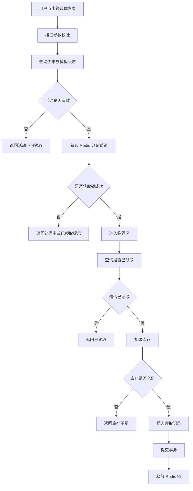
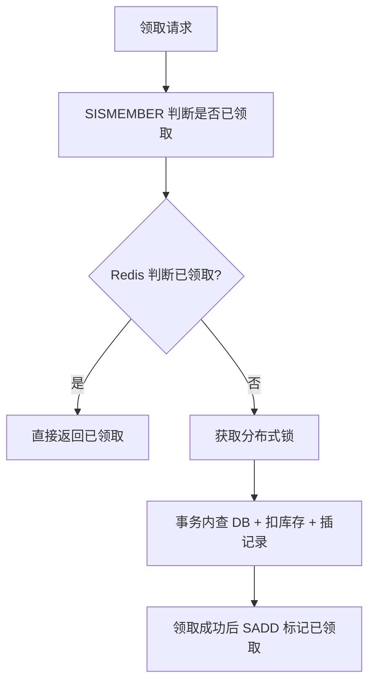

[[Redis 深度案例 3：秒杀库存扣减]]
**分布式锁不是最终防线，数据库唯一索引才是兜底

核心主线：

```text
业务重复领取问题
  ↓
单机锁为什么不行
  ↓
Redis 分布式锁如何控制并发
  ↓
Redisson 如何降低锁实现复杂度
  ↓
数据库唯一索引如何兜底
  ↓
幂等返回如何提升用户体验
  ↓
锁超时、误删、粒度、事务边界等生产风险
```

一句话总结：

> **优惠券领取防重复的正确姿势，不是“用 Redis 锁住就完了”，而是用 Redis 锁削峰控并发，用数据库唯一索引兜底正确性，用幂等设计稳定接口语义。**

## 0. 结论先说

**优惠券领取防重复，不应该只靠 Redis 分布式锁。**

更合理的生产级设计是：

```text
前端防抖
  ↓
接口参数校验
  ↓
Redis 分布式锁：降低并发冲突，保护数据库
  ↓
数据库唯一索引：最终防重复兜底
  ↓
幂等返回：重复请求不一定报错，而是返回“已领取”
```

这个案例正好对应我们之前 Redis 教学设计里的第 2 个深度专题：**Redis 分布式锁、Redisson、防重复提交、数据库唯一索引兜底、幂等设计、锁粒度设计、锁失效风险**。教学方案里也明确提到，这个案例适合讲清楚“Redis 锁不是最终防线，数据库唯一索引才是最终一致性兜底”。

---

# 1. 业务场景：用户领取优惠券

假设有一个营销活动：

> 用户可以在活动页领取一张满 100 减 20 的优惠券。  
> 每个用户对同一个优惠券模板只能领取一次。

接口大概是：

```http
POST /api/coupons/{templateId}/receive
Authorization: Bearer xxx
```

业务规则：

|规则|说明|
|---|---|
|活动未开始不能领|校验优惠券模板时间|
|活动已结束不能领|校验优惠券模板时间|
|库存不足不能领|防止超发|
|每人限领一次|本案例核心|
|重复请求要幂等|不要让用户因为网络重试拿到多张|
|数据库必须兜底|Redis 锁失效时仍不能重复发券|

---

# 2. 为什么这个场景一定会出问题？

用户点击“领取”时，可能出现这些并发情况：

```text
场景一：用户连续点击按钮
用户点了 3 次领取按钮，前端发出 3 个请求。

场景二：网络重试
网关、App、浏览器、客户端 SDK 发生重试。

场景三：恶意刷接口
用户用脚本并发请求领取接口。

场景四：服务多实例部署
请求 1 打到应用 A，请求 2 打到应用 B。
```

如果代码只是这样写：

```java
if (!hasReceived(userId, templateId)) {
    insertCouponRecord(userId, templateId);
}
```

在高并发下会有典型的 **check-then-act 并发漏洞**：

```text
请求 A：查询用户没有领取
请求 B：查询用户没有领取
请求 A：插入领取记录
请求 B：插入领取记录
```

结果：同一个用户领到了两张券。

---

# 3. 错误方案：只在 Java 代码里判断是否已领取

## 3.1 伪代码

```java
public void receiveCoupon(Long userId, Long templateId) {
    boolean received = couponRecordMapper.existsByUserIdAndTemplateId(userId, templateId);
    if (received) {
        throw new BizException("您已经领取过该优惠券");
    }

    couponRecordMapper.insert(new CouponRecord(userId, templateId));
}
```

## 3.2 问题

这段代码在单线程下没问题，但在并发下不可靠。

原因是：

```text
查询是否领取 和 插入领取记录 不是一个原子操作。
```

这类问题不是 Redis 特有问题，而是所有高并发业务里都会遇到的典型问题：

> **先查再写，只要中间没有强约束，就有并发穿透风险。**

---

# 4. 正确架构：Redis 锁 + 数据库唯一索引

## 4.1 整体流程



## 4.2 核心设计原则

|层次|作用|
|---|---|
|前端防抖|减少无意义重复点击|
|Redis 分布式锁|降低并发进入数据库的概率|
|数据库唯一索引|最终防止重复领取|
|事务|保证库存扣减和领取记录一致|
|幂等返回|让重复请求有稳定结果|

重点：

> **Redis 锁是性能优化和并发控制手段，不是最终一致性保证。**

最终防重复必须靠数据库唯一索引。

---

# 5. 数据库表设计

## 5.1 优惠券模板表

```sql
CREATE TABLE coupon_template (
    id BIGINT UNSIGNED NOT NULL AUTO_INCREMENT COMMENT '主键ID',
    template_name VARCHAR(128) NOT NULL COMMENT '优惠券名称',
    total_stock INT NOT NULL COMMENT '总库存',
    available_stock INT NOT NULL COMMENT '可用库存',
    receive_start_time DATETIME NOT NULL COMMENT '领取开始时间',
    receive_end_time DATETIME NOT NULL COMMENT '领取结束时间',
    status TINYINT NOT NULL COMMENT '状态：1启用，0禁用',
    create_time DATETIME NOT NULL DEFAULT CURRENT_TIMESTAMP COMMENT '创建时间',
    update_time DATETIME NOT NULL DEFAULT CURRENT_TIMESTAMP ON UPDATE CURRENT_TIMESTAMP COMMENT '更新时间',
    PRIMARY KEY (id),
    KEY idx_status_time (status, receive_start_time, receive_end_time)
) ENGINE=InnoDB DEFAULT CHARSET=utf8mb4 COMMENT='优惠券模板表';
```

## 5.2 用户优惠券领取记录表

```sql
CREATE TABLE user_coupon_record (
    id BIGINT UNSIGNED NOT NULL AUTO_INCREMENT COMMENT '主键ID',
    user_id BIGINT UNSIGNED NOT NULL COMMENT '用户ID',
    template_id BIGINT UNSIGNED NOT NULL COMMENT '优惠券模板ID',
    coupon_code VARCHAR(64) NOT NULL COMMENT '优惠券编码',
    status TINYINT NOT NULL COMMENT '状态：1未使用，2已使用，3已过期',
    receive_time DATETIME NOT NULL COMMENT '领取时间',
    use_time DATETIME NULL COMMENT '使用时间',
    create_time DATETIME NOT NULL DEFAULT CURRENT_TIMESTAMP COMMENT '创建时间',
    update_time DATETIME NOT NULL DEFAULT CURRENT_TIMESTAMP ON UPDATE CURRENT_TIMESTAMP COMMENT '更新时间',
    PRIMARY KEY (id),
    UNIQUE KEY uk_user_template (user_id, template_id),
    UNIQUE KEY uk_coupon_code (coupon_code),
    KEY idx_template_id (template_id),
    KEY idx_user_status (user_id, status)
) ENGINE=InnoDB DEFAULT CHARSET=utf8mb4 COMMENT='用户优惠券领取记录表';
```

这里最关键的是：

```sql
UNIQUE KEY uk_user_template (user_id, template_id)
```

它表达的是：

> 同一个用户，对同一个优惠券模板，只能有一条领取记录。

这才是最终防重复的硬约束。

---

# 6. 项目代码结构

建议用接近企业项目的分层结构：

```text
coupon-demo
├── controller
│   └── CouponReceiveController.java
├── application
│   └── CouponReceiveService.java
├── domain
│   ├── CouponTemplate.java
│   └── UserCouponRecord.java
├── mapper
│   ├── CouponTemplateMapper.java
│   └── UserCouponRecordMapper.java
├── infrastructure
│   └── RedisLockClient.java
├── common
│   ├── BizException.java
│   ├── ErrorCode.java
│   └── Result.java
└── config
    └── RedissonConfig.java
```

为了教学清晰，不搞太复杂的 DDD 分层，但保留企业项目的基本边界：

|层|职责|
|---|---|
|controller|接收 HTTP 请求|
|application/service|编排业务流程|
|mapper|数据库访问|
|infrastructure|Redis、Redisson 等基础设施封装|
|domain|业务对象|

---

# 7. Maven 依赖

```xml
<dependencies>
    <!-- Spring Web -->
    <dependency>
        <groupId>org.springframework.boot</groupId>
        <artifactId>spring-boot-starter-web</artifactId>
    </dependency>

    <!-- Spring Data Redis -->
    <dependency>
        <groupId>org.springframework.boot</groupId>
        <artifactId>spring-boot-starter-data-redis</artifactId>
    </dependency>

    <!-- Redisson -->
    <dependency>
        <groupId>org.redisson</groupId>
        <artifactId>redisson-spring-boot-starter</artifactId>
        <version>3.27.2</version>
    </dependency>

    <!-- MyBatis Plus，教学中也可以换成 MyBatis -->
    <dependency>
        <groupId>com.baomidou</groupId>
        <artifactId>mybatis-plus-spring-boot3-starter</artifactId>
        <version>3.5.7</version>
    </dependency>

    <!-- MySQL Driver -->
    <dependency>
        <groupId>com.mysql</groupId>
        <artifactId>mysql-connector-j</artifactId>
        <scope>runtime</scope>
    </dependency>
</dependencies>
```

---

# 8. Redis 锁 Key 设计

## 8.1 错误锁粒度

### 错误一：全局锁

```text
lock:coupon:receive
```

问题：

> 所有用户领取所有优惠券都串行化，吞吐量极差。

---

### 错误二：只按用户加锁

```text
lock:coupon:receive:user:{userId}
```

问题：

> 同一个用户领取不同优惠券也被串行化，粒度偏大。

---

### 错误三：只按优惠券模板加锁

```text
lock:coupon:receive:template:{templateId}
```

问题：

> 所有用户领取同一个券都被串行化，高并发活动下吞吐量很差。

---

## 8.2 推荐锁粒度

```text
lock:coupon:receive:{templateId}:{userId}
```

含义：

> 同一个用户领取同一张券时互斥。

这样不会影响：

```text
用户 A 领取券 1
用户 B 领取券 1
用户 A 领取券 2
```

只限制：

```text
用户 A 同时领取券 1 的多个重复请求
```

代码：

```java
private String buildReceiveLockKey(Long templateId, Long userId) {
    return "lock:coupon:receive:" + templateId + ":" + userId;
}
```

---

# 9. Controller 层

```java
@RestController
@RequestMapping("/api/coupons")
public class CouponReceiveController {

    private final CouponReceiveService couponReceiveService;

    public CouponReceiveController(CouponReceiveService couponReceiveService) {
        this.couponReceiveService = couponReceiveService;
    }

    @PostMapping("/{templateId}/receive")
    public Result<CouponReceiveResponse> receive(
            @PathVariable Long templateId,
            @RequestHeader("X-User-Id") Long userId
    ) {
        CouponReceiveResponse response = couponReceiveService.receive(userId, templateId);
        return Result.success(response);
    }
}
```

这里为了教学简单，用：

```http
X-User-Id: 10001
```

真实项目里应该从登录态、JWT、Session 或网关透传中拿用户 ID。

---

# 10. Response 设计：重复领取不一定是异常

```java
public record CouponReceiveResponse(
        Long templateId,
        Long userId,
        String couponCode,
        String receiveStatus,
        String message
) {
    public static CouponReceiveResponse success(Long templateId, Long userId, String couponCode) {
        return new CouponReceiveResponse(templateId, userId, couponCode, "SUCCESS", "领取成功");
    }

    public static CouponReceiveResponse alreadyReceived(Long templateId, Long userId, String couponCode) {
        return new CouponReceiveResponse(templateId, userId, couponCode, "ALREADY_RECEIVED", "您已经领取过该优惠券");
    }
}
```

这里有一个工程细节：

> 重复领取请求，不一定要抛异常。  
> 对用户来说，“已经领取过”也是一种稳定业务结果。

这就是幂等设计。

---

# 11. Service 核心代码

## 11.1 主流程

```java
@Service
public class CouponReceiveService {

    private final RedissonClient redissonClient;
    private final CouponTemplateMapper couponTemplateMapper;
    private final UserCouponRecordMapper userCouponRecordMapper;

    public CouponReceiveService(
            RedissonClient redissonClient,
            CouponTemplateMapper couponTemplateMapper,
            UserCouponRecordMapper userCouponRecordMapper
    ) {
        this.redissonClient = redissonClient;
        this.couponTemplateMapper = couponTemplateMapper;
        this.userCouponRecordMapper = userCouponRecordMapper;
    }

    public CouponReceiveResponse receive(Long userId, Long templateId) {
        if (userId == null || templateId == null) {
            throw new BizException("参数错误");
        }

        String lockKey = buildReceiveLockKey(templateId, userId);
        RLock lock = redissonClient.getLock(lockKey);

        boolean locked = false;
        try {
            /*
             * waitTime：最多等待 200 毫秒获取锁。
             * leaseTime：锁持有 3 秒后自动释放。
             *
             * 注意：
             * 这里设置 leaseTime 后，Redisson WatchDog 不会自动续期。
             * 如果业务耗时不确定，可以不传 leaseTime，使用 WatchDog。
             */
            locked = lock.tryLock(200, 3_000, TimeUnit.MILLISECONDS);

            if (!locked) {
                /*
                 * 没拿到锁，通常说明同一用户同一优惠券正在被处理。
                 * 不建议直接返回“系统繁忙”，可以返回“处理中，请勿重复提交”。
                 */
                throw new BizException("请求处理中，请勿重复提交");
            }

            return doReceiveInTransaction(userId, templateId);

        } catch (InterruptedException e) {
            Thread.currentThread().interrupt();
            throw new BizException("领取请求被中断");
        } finally {
            if (locked && lock.isHeldByCurrentThread()) {
                lock.unlock();
            }
        }
    }

    private String buildReceiveLockKey(Long templateId, Long userId) {
        return "lock:coupon:receive:" + templateId + ":" + userId;
    }

    @Transactional(rollbackFor = Exception.class)
    public CouponReceiveResponse doReceiveInTransaction(Long userId, Long templateId) {
        // 具体实现见下一节
        return null;
    }
}
```

这里有一个容易忽略的点：

```java
if (locked && lock.isHeldByCurrentThread()) {
    lock.unlock();
}
```

不要直接：

```java
lock.unlock();
```

原因：

> 锁可能因为超时已经释放，当前线程再 unlock 可能产生异常，甚至误操作。

Redisson 会校验锁归属，但工程代码里仍建议显式判断。

---

# 12. 事务内业务逻辑

```java
@Transactional(rollbackFor = Exception.class)
public CouponReceiveResponse doReceiveInTransaction(Long userId, Long templateId) {
    LocalDateTime now = LocalDateTime.now();

    // 1. 查询优惠券模板
    CouponTemplate template = couponTemplateMapper.selectById(templateId);
    if (template == null) {
        throw new BizException("优惠券不存在");
    }

    // 2. 校验模板状态
    if (!template.isEnabled()) {
        throw new BizException("优惠券已停用");
    }

    if (now.isBefore(template.getReceiveStartTime())) {
        throw new BizException("优惠券领取尚未开始");
    }

    if (now.isAfter(template.getReceiveEndTime())) {
        throw new BizException("优惠券领取已结束");
    }

    // 3. 幂等查询：用户是否已经领取
    UserCouponRecord existing = userCouponRecordMapper.selectByUserIdAndTemplateId(userId, templateId);
    if (existing != null) {
        return CouponReceiveResponse.alreadyReceived(
                templateId,
                userId,
                existing.getCouponCode()
        );
    }

    // 4. 扣减库存：用 SQL 条件保证不会扣成负数
    int affected = couponTemplateMapper.decreaseStock(templateId);
    if (affected == 0) {
        throw new BizException("优惠券已被领完");
    }

    // 5. 插入领取记录
    String couponCode = generateCouponCode(templateId, userId);

    UserCouponRecord record = new UserCouponRecord();
    record.setUserId(userId);
    record.setTemplateId(templateId);
    record.setCouponCode(couponCode);
    record.setStatus(1);
    record.setReceiveTime(now);

    try {
        userCouponRecordMapper.insert(record);
    } catch (DuplicateKeyException e) {
        /*
         * 数据库唯一索引兜底。
         * 即使 Redis 锁失效、服务异常、并发穿透，这里仍能挡住重复发券。
         *
         * 注意：
         * 前面已经扣减库存了，如果 insert 失败，事务会回滚，库存扣减也会回滚。
         */
        UserCouponRecord existing = userCouponRecordMapper.selectByUserIdAndTemplateId(userId, templateId);
        if (existing != null) {
            return CouponReceiveResponse.alreadyReceived(
                    templateId,
                    userId,
                    existing.getCouponCode()
            );
        }
        throw e;
    }

    return CouponReceiveResponse.success(templateId, userId, couponCode);
}
```

这一段是本案例的核心。

注意这里的防线有两层：

```text
第一层：Redis 锁
减少重复请求进入事务逻辑

第二层：数据库唯一索引
即使 Redis 锁失效，也不能重复插入
```

---

# 13. Mapper 设计

## 13.1 UserCouponRecordMapper

```java
@Mapper
public interface UserCouponRecordMapper extends BaseMapper<UserCouponRecord> {

    @Select("""
        SELECT id, user_id, template_id, coupon_code, status, receive_time, use_time,
               create_time, update_time
        FROM user_coupon_record
        WHERE user_id = #{userId}
          AND template_id = #{templateId}
        LIMIT 1
        """)
    UserCouponRecord selectByUserIdAndTemplateId(
            @Param("userId") Long userId,
            @Param("templateId") Long templateId
    );
}
```

## 13.2 CouponTemplateMapper

```java
@Mapper
public interface CouponTemplateMapper extends BaseMapper<CouponTemplate> {

    @Update("""
        UPDATE coupon_template
        SET available_stock = available_stock - 1
        WHERE id = #{templateId}
          AND available_stock > 0
          AND status = 1
        """)
    int decreaseStock(@Param("templateId") Long templateId);
}
```

这里的库存扣减不要写成：

```java
CouponTemplate template = selectById(templateId);
if (template.getAvailableStock() > 0) {
    template.setAvailableStock(template.getAvailableStock() - 1);
    updateById(template);
}
```

这也是典型并发问题。

正确做法是用数据库条件更新：

```sql
UPDATE coupon_template
SET available_stock = available_stock - 1
WHERE id = ?
  AND available_stock > 0;
```

这样可以保证库存不会扣成负数。

---

# 14. Entity 示例

## 14.1 CouponTemplate

```java
@TableName("coupon_template")
public class CouponTemplate {

    @TableId(type = IdType.AUTO)
    private Long id;

    private String templateName;

    private Integer totalStock;

    private Integer availableStock;

    private LocalDateTime receiveStartTime;

    private LocalDateTime receiveEndTime;

    private Integer status;

    private LocalDateTime createTime;

    private LocalDateTime updateTime;

    public boolean isEnabled() {
        return Objects.equals(this.status, 1);
    }

    // getter / setter 省略
}
```

## 14.2 UserCouponRecord

```java
@TableName("user_coupon_record")
public class UserCouponRecord {

    @TableId(type = IdType.AUTO)
    private Long id;

    private Long userId;

    private Long templateId;

    private String couponCode;

    private Integer status;

    private LocalDateTime receiveTime;

    private LocalDateTime useTime;

    private LocalDateTime createTime;

    private LocalDateTime updateTime;

    // getter / setter 省略
}
```

---

# 15. Redisson 配置

```yaml
spring:
  data:
    redis:
      host: localhost
      port: 6379
      password:
      database: 0

redisson:
  address: redis://localhost:6379
```

如果不用 `redisson-spring-boot-starter` 自动装配，也可以手写配置：

```java
@Configuration
public class RedissonConfig {

    @Bean(destroyMethod = "shutdown")
    public RedissonClient redissonClient(
            @Value("${spring.data.redis.host}") String host,
            @Value("${spring.data.redis.port}") int port
    ) {
        Config config = new Config();
        config.useSingleServer()
                .setAddress("redis://" + host + ":" + port)
                .setConnectionMinimumIdleSize(4)
                .setConnectionPoolSize(16);

        return Redisson.create(config);
    }
}
```

---

# 16. 为什么推荐 Redisson，而不是自己 setnx？

## 16.1 手写 setnx 的基本形式

很多人会写：

```java
Boolean success = stringRedisTemplate.opsForValue()
        .setIfAbsent(lockKey, requestId, Duration.ofSeconds(3));

if (Boolean.TRUE.equals(success)) {
    try {
        // 执行业务
    } finally {
        // 删除锁
        stringRedisTemplate.delete(lockKey);
    }
}
```

这段代码有明显问题：

|问题|说明|
|---|---|
|误删锁|A 锁过期，B 获取锁，A finally 删除 B 的锁|
|不可重入|同一线程嵌套调用可能死锁|
|续期困难|业务超过锁过期时间会释放锁|
|实现复杂|需要 Lua 校验 value 后删除|
|维护成本高|生产代码容易写出边界 bug|

## 16.2 正确释放锁至少要 Lua

```lua
if redis.call("get", KEYS[1]) == ARGV[1] then
    return redis.call("del", KEYS[1])
else
    return 0
end
```

Java 代码：

```java
private static final DefaultRedisScript<Long> UNLOCK_SCRIPT =
        new DefaultRedisScript<>("""
            if redis.call("get", KEYS[1]) == ARGV[1] then
                return redis.call("del", KEYS[1])
            else
                return 0
            end
            """, Long.class);
```

但教学上没必要一开始就鼓励手写锁。

更合理的是：

```text
理解 set nx px + Lua 解锁原理
生产项目优先使用 Redisson
```

---

# 17. 锁超时问题：这是本案例必须讲透的坑

假设代码这样写：

```java
lock.tryLock(200, 3_000, TimeUnit.MILLISECONDS);
```

意思是：

```text
最多等待 200ms 获取锁
获取成功后 3 秒自动释放
```

如果业务执行超过 3 秒，会发生什么？

```text
线程 A 获取锁
线程 A 执行业务超过 3 秒
Redis 锁自动过期
线程 B 获取同一把锁
线程 A 和线程 B 同时进入临界区
```

这说明：

> Redis 锁并不能天然保证业务绝对串行。

所以本案例必须有数据库唯一索引兜底。

---

# 18. Redisson WatchDog 是什么？

如果使用：

```java
lock.lock();
```

或者：

```java
lock.tryLock(waitTime, TimeUnit.MILLISECONDS);
```

不指定 `leaseTime`，Redisson 会启用 WatchDog 自动续期。

大致逻辑：

```text
线程持有锁
  ↓
Redisson 后台定期检查锁是否仍由当前线程持有
  ↓
如果业务还没执行完，自动延长锁过期时间
  ↓
业务完成后主动 unlock
```

这能降低“业务没执行完锁先过期”的风险。

但 WatchDog 也不是万能的：

|风险|说明|
|---|---|
|JVM Full GC|续期线程可能暂停|
|应用宕机|锁最终靠 TTL 释放|
|Redis 主从切换|极端情况下可能出现锁状态不一致|
|网络抖动|续期可能失败|
|业务超长事务|不应该长期占用分布式锁|

所以，结论仍然是：

> Redisson 可以降低锁实现复杂度，但不能替代数据库强约束。

---

# 19. 幂等设计：重复请求应该返回什么？

重复领取有两种处理方式。

## 19.1 方式一：返回业务异常

```json
{
  "code": "COUPON_ALREADY_RECEIVED",
  "message": "您已经领取过该优惠券"
}
```

适合：

```text
明确告诉用户不能重复领取
```

## 19.2 方式二：返回已领取结果

```json
{
  "code": "SUCCESS",
  "data": {
    "receiveStatus": "ALREADY_RECEIVED",
    "couponCode": "CP202605170001"
  }
}
```

适合：

```text
接口幂等
客户端重试
用户体验更稳定
```

我更推荐第二种。

因为用户点击“领取”时，真正关心的是：

```text
我有没有拿到这张券？
```

而不是：

```text
这次请求是不是第一次请求？
```

所以重复请求返回“已领取”更符合业务语义。

---

# 20. 事务边界：锁和事务谁在外面？

推荐结构：

```java
获取 Redis 锁
  ↓
开启数据库事务
  ↓
执行业务
  ↓
提交事务
  ↓
释放 Redis 锁
```

也就是：

```text
锁在事务外面
事务在锁里面
```

不要这样：

```text
开启事务
  ↓
获取 Redis 锁
  ↓
执行业务
  ↓
释放锁
  ↓
提交事务
```

原因：

|问题|说明|
|---|---|
|事务持有时间变长|等锁期间数据库连接也被占用|
|更容易拖垮连接池|高并发下大量事务等待锁|
|锁释放早于事务提交|其他线程可能看到未提交状态|
|死锁风险上升|数据库锁和 Redis 锁交织|

最佳实践：

> 先拿 Redis 锁，再开启数据库事务；事务提交后，再释放 Redis 锁。

在 Spring 里要注意：

```java
同类方法内部调用 @Transactional 方法，事务可能不生效。
```

上面示例把 `doReceiveInTransaction` 放在同一个类里，在真实项目里建议拆成两个 Bean：

```text
CouponReceiveService
  调用
CouponReceiveTransactionService
```

---

# 21. 更严谨的 Service 拆分版本

## 21.1 外层负责锁

```java
@Service
public class CouponReceiveService {

    private final RedissonClient redissonClient;
    private final CouponReceiveTransactionService transactionService;

    public CouponReceiveService(
            RedissonClient redissonClient,
            CouponReceiveTransactionService transactionService
    ) {
        this.redissonClient = redissonClient;
        this.transactionService = transactionService;
    }

    public CouponReceiveResponse receive(Long userId, Long templateId) {
        String lockKey = "lock:coupon:receive:" + templateId + ":" + userId;
        RLock lock = redissonClient.getLock(lockKey);

        boolean locked = false;
        try {
            locked = lock.tryLock(200, 3_000, TimeUnit.MILLISECONDS);

            if (!locked) {
                throw new BizException("请求处理中，请勿重复提交");
            }

            return transactionService.receiveWithTransaction(userId, templateId);

        } catch (InterruptedException e) {
            Thread.currentThread().interrupt();
            throw new BizException("领取请求被中断");
        } finally {
            if (locked && lock.isHeldByCurrentThread()) {
                lock.unlock();
            }
        }
    }
}
```

## 21.2 内层负责事务

```java
@Service
public class CouponReceiveTransactionService {

    private final CouponTemplateMapper couponTemplateMapper;
    private final UserCouponRecordMapper userCouponRecordMapper;

    public CouponReceiveTransactionService(
            CouponTemplateMapper couponTemplateMapper,
            UserCouponRecordMapper userCouponRecordMapper
    ) {
        this.couponTemplateMapper = couponTemplateMapper;
        this.userCouponRecordMapper = userCouponRecordMapper;
    }

    @Transactional(rollbackFor = Exception.class)
    public CouponReceiveResponse receiveWithTransaction(Long userId, Long templateId) {
        LocalDateTime now = LocalDateTime.now();

        CouponTemplate template = couponTemplateMapper.selectById(templateId);
        if (template == null) {
            throw new BizException("优惠券不存在");
        }

        if (!template.isEnabled()) {
            throw new BizException("优惠券已停用");
        }

        if (now.isBefore(template.getReceiveStartTime())) {
            throw new BizException("优惠券领取尚未开始");
        }

        if (now.isAfter(template.getReceiveEndTime())) {
            throw new BizException("优惠券领取已结束");
        }

        UserCouponRecord existing =
                userCouponRecordMapper.selectByUserIdAndTemplateId(userId, templateId);

        if (existing != null) {
            return CouponReceiveResponse.alreadyReceived(
                    templateId,
                    userId,
                    existing.getCouponCode()
            );
        }

        int affected = couponTemplateMapper.decreaseStock(templateId);
        if (affected == 0) {
            throw new BizException("优惠券已被领完");
        }

        String couponCode = CouponCodeGenerator.generate(templateId, userId);

        UserCouponRecord record = new UserCouponRecord();
        record.setUserId(userId);
        record.setTemplateId(templateId);
        record.setCouponCode(couponCode);
        record.setStatus(1);
        record.setReceiveTime(now);

        try {
            userCouponRecordMapper.insert(record);
        } catch (DuplicateKeyException e) {
            UserCouponRecord recordInDb =
                    userCouponRecordMapper.selectByUserIdAndTemplateId(userId, templateId);

            if (recordInDb != null) {
                return CouponReceiveResponse.alreadyReceived(
                        templateId,
                        userId,
                        recordInDb.getCouponCode()
                );
            }

            throw e;
        }

        return CouponReceiveResponse.success(templateId, userId, couponCode);
    }
}
```

这个版本更接近生产项目。

---

# 22. 为什么不能只用数据库唯一索引？

有人会问：

> 既然数据库唯一索引已经能防重复，Redis 锁是不是多余？

答案是：**不是绝对必要，但有工程价值。**

只靠数据库唯一索引也能保证不重复发券，但高并发下会有这些问题：

|问题|说明|
|---|---|
|大量重复请求打到数据库|DB 承担无意义查询和插入冲突|
|唯一索引冲突成本高|并发 insert 失败也是数据库压力|
|用户体验差|大量请求表现为异常|
|库存扣减事务压力大|重复请求进入事务后再失败|
|难以做前置拦截|Redis 锁能在应用层快速挡住重复请求|

所以更准确的判断是：

```text
数据库唯一索引：正确性底线
Redis 分布式锁：性能和并发治理手段
```

---

# 23. 为什么不能只用 Redis Set 记录已领取？

例如：

```text
SADD coupon:received:{templateId} {userId}
```

`SADD` 天然有去重能力：

```text
返回 1：第一次添加
返回 0：已经存在
```

看上去很适合防重复领取。

但单独使用它有严重问题：

|问题|说明|
|---|---|
|Redis 数据可能丢失|RDB/AOF 配置、故障恢复都可能影响|
|DB 和 Redis 不一致|Redis 记录成功，但 DB 插入失败|
|缺少完整领取记录|只存 userId 不够表达券状态|
|后续查询复杂|我的优惠券列表仍要查数据库|
|数据审计不足|营销、财务、风控都依赖 DB 记录|

所以 Redis Set 可以做辅助优化，但不能替代数据库。

例如可以作为快速判断：

```text
coupon:received:{templateId}
```

但最终仍然要写：

```sql
UNIQUE KEY uk_user_template (user_id, template_id)
```

---

# 24. 进阶优化：Redis Set 做快速幂等标记

在高并发活动中，可以增加一个 Redis Set：

```text
coupon:received:{templateId}
```

领取成功后：

```text
SADD coupon:received:{templateId} {userId}
```

请求进来时先判断：

```text
SISMEMBER coupon:received:{templateId} {userId}
```

流程变成：



但是这个优化要谨慎。

因为如果 Redis Set 丢失或过期，不应该影响正确性。

所以它只能是：

```text
加速判断
不能作为最终依据
```

---

# 25. 更高级方案：Lua 一次性完成库存和去重？

秒杀场景里常见做法是：

```text
Redis 中预加载库存
Redis Set 记录已下单用户
Lua 原子判断：
  1. 是否已领取
  2. 库存是否充足
  3. 扣减库存
  4. 标记用户已领取
```

Lua 示例：

```lua
-- KEYS[1] = stockKey
-- KEYS[2] = receivedSetKey
-- ARGV[1] = userId

if redis.call('sismember', KEYS[2], ARGV[1]) == 1 then
    return 2
end

local stock = tonumber(redis.call('get', KEYS[1]))
if stock == nil or stock <= 0 then
    return 0
end

redis.call('decr', KEYS[1])
redis.call('sadd', KEYS[2], ARGV[1])

return 1
```

返回值：

|返回值|含义|
|--:|---|
|1|领取资格成功|
|2|已领取|
|0|库存不足|

这个方案适合：

```text
秒杀券
大促券
瞬时高并发抢券
```

但它已经进入下一个深度案例“秒杀库存扣减”的范围了。

本篇重点还是：

```text
普通优惠券领取防重复：
Redis 分布式锁 + DB 唯一索引兜底
```

不要提前把秒杀复杂度塞进来。

---

# 26. 测试用例设计

## 26.1 初始化数据

```sql
INSERT INTO coupon_template (
    id,
    template_name,
    total_stock,
    available_stock,
    receive_start_time,
    receive_end_time,
    status
) VALUES (
    1001,
    '满100减20优惠券',
    100,
    100,
    '2026-05-01 00:00:00',
    '2026-06-01 00:00:00',
    1
);
```

## 26.2 单用户重复领取

请求：

```bash
curl -X POST http://localhost:8080/api/coupons/1001/receive \
  -H "X-User-Id: 90001"
```

第一次返回：

```json
{
  "code": 0,
  "message": "success",
  "data": {
    "templateId": 1001,
    "userId": 90001,
    "couponCode": "CP100190001202605170001",
    "receiveStatus": "SUCCESS",
    "message": "领取成功"
  }
}
```

第二次返回：

```json
{
  "code": 0,
  "message": "success",
  "data": {
    "templateId": 1001,
    "userId": 90001,
    "couponCode": "CP100190001202605170001",
    "receiveStatus": "ALREADY_RECEIVED",
    "message": "您已经领取过该优惠券"
  }
}
```

## 26.3 数据库验证

```sql
SELECT id, user_id, template_id, coupon_code, status, receive_time
FROM user_coupon_record
WHERE user_id = 90001
  AND template_id = 1001;
```

预期只有一条记录。

```sql
SELECT id, total_stock, available_stock
FROM coupon_template
WHERE id = 1001;
```

预期库存只减少一次。

---

# 27. 并发测试思路

可以用 JUnit + CountDownLatch 模拟同一个用户并发领取。

```java
@SpringBootTest
class CouponReceiveConcurrencyTest {

    @Autowired
    private CouponReceiveService couponReceiveService;

    @Test
    void sameUserReceiveSameCouponConcurrently() throws InterruptedException {
        Long userId = 90001L;
        Long templateId = 1001L;

        int threadCount = 20;
        CountDownLatch readyLatch = new CountDownLatch(threadCount);
        CountDownLatch startLatch = new CountDownLatch(1);
        CountDownLatch finishLatch = new CountDownLatch(threadCount);

        ExecutorService executorService = Executors.newFixedThreadPool(threadCount);

        List<CouponReceiveResponse> responses = new CopyOnWriteArrayList<>();
        List<Throwable> errors = new CopyOnWriteArrayList<>();

        for (int i = 0; i < threadCount; i++) {
            executorService.submit(() -> {
                try {
                    readyLatch.countDown();
                    startLatch.await();

                    CouponReceiveResponse response =
                            couponReceiveService.receive(userId, templateId);

                    responses.add(response);
                } catch (Throwable e) {
                    errors.add(e);
                } finally {
                    finishLatch.countDown();
                }
            });
        }

        readyLatch.await();
        startLatch.countDown();
        finishLatch.await();

        executorService.shutdown();

        long successCount = responses.stream()
                .filter(r -> "SUCCESS".equals(r.receiveStatus()))
                .count();

        long alreadyReceivedCount = responses.stream()
                .filter(r -> "ALREADY_RECEIVED".equals(r.receiveStatus()))
                .count();

        System.out.println("successCount = " + successCount);
        System.out.println("alreadyReceivedCount = " + alreadyReceivedCount);
        System.out.println("errors = " + errors.size());

        assertThat(successCount).isEqualTo(1);
    }
}
```

这个测试要看你的业务返回策略。

如果拿不到锁直接抛：

```text
请求处理中，请勿重复提交
```

那么结果可能是：

```text
成功 1 个
已领取 N 个
处理中 M 个
```

如果你希望所有重复请求最终都返回“已领取”，可以在未获取锁时短暂等待后查一次数据库：

```java
if (!locked) {
    UserCouponRecord existing =
        userCouponRecordMapper.selectByUserIdAndTemplateId(userId, templateId);
    if (existing != null) {
        return CouponReceiveResponse.alreadyReceived(
            templateId,
            userId,
            existing.getCouponCode()
        );
    }
    throw new BizException("请求处理中，请勿重复提交");
}
```

---

# 28. 这个案例的生产风险清单

## 28.1 Redis 锁不是绝对可靠

风险：

```text
锁过期
服务宕机
Redis 主从切换
网络抖动
GC 停顿
```

应对：

```text
Redisson 降低实现风险
数据库唯一索引兜底
业务幂等
补偿校验
```

---

## 28.2 锁粒度不能太粗

错误：

```text
lock:coupon:receive:{templateId}
```

会导致所有用户领取同一个券串行化。

推荐：

```text
lock:coupon:receive:{templateId}:{userId}
```

---

## 28.3 事务不能太长

锁内逻辑要尽量短：

```text
不要调用远程服务
不要发送 MQ 后等待结果
不要做复杂计算
不要访问慢接口
```

锁内只做核心数据库操作：

```text
查状态
查幂等
扣库存
插记录
提交事务
```

---

## 28.4 库存扣减必须是条件更新

不要：

```text
先查库存，再 Java 里减库存，再 update
```

要：

```sql
UPDATE coupon_template
SET available_stock = available_stock - 1
WHERE id = ?
  AND available_stock > 0;
```

---

## 28.5 唯一索引异常要转成业务语义

不要把数据库异常原样返回给用户。

应该把：

```text
Duplicate entry '90001-1001' for key 'uk_user_template'
```

转换成：

```text
您已经领取过该优惠券
```

---

# 29. 面试表达

可以这样讲：

> 在优惠券领取防重复场景里，我不会只依赖 Redis 分布式锁。Redis 锁主要用于降低同一用户重复请求进入数据库的概率，减少数据库压力。真正的防重复兜底应该放在数据库唯一索引上，比如对 user_id 和 template_id 建联合唯一索引。
> 
> 业务流程上，我会先按照 templateId + userId 维度加 Redis 锁，锁粒度控制在“同一个用户领取同一张券”。拿到锁后，在事务内校验优惠券状态、判断是否已领取、条件扣减库存、插入领取记录。库存扣减使用 `available_stock > 0` 的条件更新，防止库存扣成负数。领取记录表用唯一索引防止重复插入。
> 
> 如果出现 Redis 锁过期、服务重启、网络抖动等异常情况，数据库唯一索引仍然能保证不会重复发券。对于重复请求，我会做幂等返回，返回“已领取”而不是直接暴露数据库唯一键冲突异常。

---

# 30. 本案例的教学价值

这个案例不是为了证明 Redis 分布式锁多强，而是要让学习者建立正确工程判断：

|认知点|说明|
|---|---|
|Redis 锁解决什么|降低并发冲突，减少 DB 压力|
|Redis 锁不解决什么|不提供最终一致性保证|
|数据库唯一索引的作用|作为最终防重复兜底|
|幂等的作用|让重复请求返回稳定业务结果|
|条件更新的作用|防止库存被扣成负数|
|锁粒度的作用|在正确性和吞吐量之间平衡|
|Redisson 的作用|降低分布式锁实现复杂度|
|WatchDog 的边界|能续期，但不能替代强约束|
