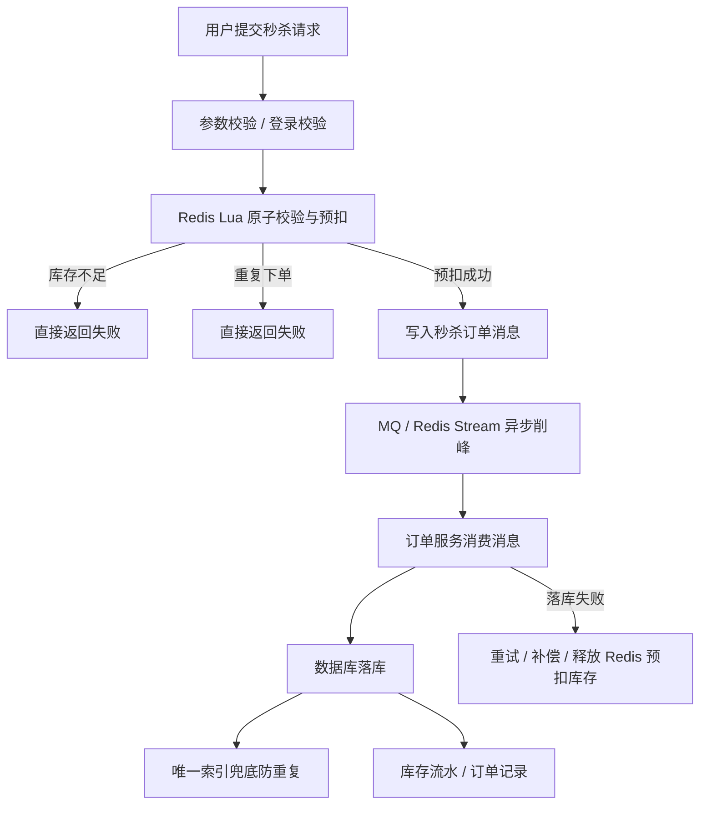
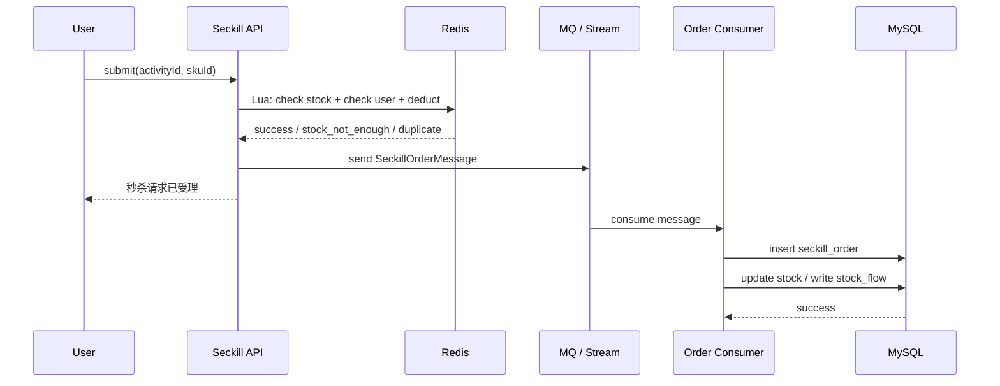
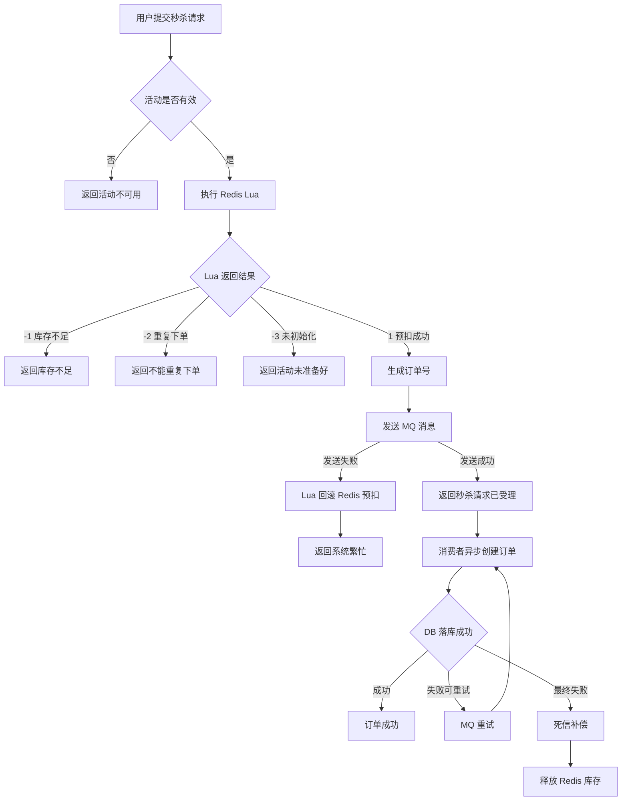

[[Redis 深度案例 4：订单延迟队列]]

> 主题定位：**Redis 预扣库存 + Lua 原子扣减 + 一人一单校验 + 异步落库 + MQ 削峰 + 补偿任务**。  
> 这正好承接前面 Redis 教学方案里对“秒杀库存扣减”的定位：它属于 Redis 作为“高并发状态控制引擎”的典型案例，而不是普通缓存案例。

---

## 1. 结论先说

秒杀库存扣减不是简单的：

```java
if (stock > 0) {
    stock--;
}
```

也不是简单加一个分布式锁就完事。

一个接近生产的秒杀扣减链路应该是：



核心思想：

> **高并发入口用 Redis 做原子预扣，数据库只承接削峰后的最终落库。**

Redis 负责：

- 快速判断库存是否足够；
    
- 快速判断用户是否已经买过；
    
- 原子完成“扣库存 + 标记用户已购买”；
    
- 扛住秒杀瞬时流量。
    

数据库负责：

- 最终订单记录；
    
- 唯一索引兜底；
    
- 真实库存账务；
    
- 后续对账和补偿。
    

---

# 2. 为什么秒杀不能直接扣数据库库存？

假设有一张商品库存表：

```sql
CREATE TABLE seckill_stock (
    id BIGINT UNSIGNED PRIMARY KEY AUTO_INCREMENT COMMENT '主键ID',
    activity_id BIGINT UNSIGNED NOT NULL COMMENT '活动ID',
    sku_id BIGINT UNSIGNED NOT NULL COMMENT '商品ID',
    total_stock INT NOT NULL COMMENT '总库存',
    available_stock INT NOT NULL COMMENT '可售库存',
    sold_stock INT NOT NULL DEFAULT 0 COMMENT '已售库存',
    version INT NOT NULL DEFAULT 0 COMMENT '乐观锁版本号',
    create_time DATETIME NOT NULL,
    update_time DATETIME NOT NULL,
    UNIQUE KEY uk_activity_sku (activity_id, sku_id)
) COMMENT='秒杀库存表';
```

你可能会写：

```sql
UPDATE seckill_stock
SET available_stock = available_stock - 1,
    sold_stock = sold_stock + 1
WHERE activity_id = 1001
  AND sku_id = 2001
  AND available_stock > 0;
```

这个 SQL 本身有防超卖能力，因为 `available_stock > 0` 是数据库层面的条件扣减。

但问题是：

## 2.1 数据库会被瞬时流量打爆

秒杀瞬间可能有：

```text
10 万用户同时请求
库存只有 100 件
最终只有 100 个请求需要成功
但数据库可能要承接 10 万次 UPDATE
```

大量失败请求也会访问数据库。

这很浪费。

## 2.2 行锁竞争严重

所有请求都更新同一行库存：

```text
activity_id = 1001, sku_id = 2001
```

这会导致大量线程阻塞在同一行锁上。

秒杀的瓶颈不是 SQL 写得不够好，而是：

> **热点库存行被极端并发反复争抢。**

## 2.3 无法快速拦截重复下单

一人一单如果也查数据库：

```sql
SELECT id FROM seckill_order 
WHERE activity_id = ? AND user_id = ?;
```

高并发下又会制造一批数据库读压力。

所以秒杀系统的核心不是“数据库能不能扣”，而是：

> **不要让数据库承接秒杀入口的无效流量。**

---

# 3. 本案例业务目标

我们设计一个“优惠商品秒杀”案例。

业务规则：

|规则|说明|
|---|---|
|活动有库存|库存卖完后，用户不能继续下单|
|一人一单|同一个用户同一个活动只能买一次|
|不允许超卖|实际成功订单数不能超过库存|
|尽量不允许少卖|Redis 预扣成功但数据库落库失败时，要有补偿|
|高并发入口快速返回|不让所有请求都打到数据库|
|数据库最终一致|Redis 只是预扣，DB 是最终事实记录|

---

# 4. 系统架构设计

## 4.1 核心链路



## 4.2 Redis 在这里不是缓存，而是“秒杀状态机”

Redis 维护两个核心状态：

```text
seckill:{activityId}:stock:{skuId}        当前可预扣库存
seckill:{activityId}:users:{skuId}        已成功预扣的用户集合
```

例如：

```text
seckill:{1001}:stock:{2001} = 100
seckill:{1001}:users:{2001} = Set(101, 102, 103)
```

注意 `{1001}` 这种写法。

在 Redis Cluster 中，Lua 脚本访问的多个 Key 必须落在同一个 hash slot。  
所以建议用 hash tag：

```text
seckill:{1001}:stock:2001
seckill:{1001}:users:2001
```

这样两个 key 都包含 `{1001}`，在 Redis Cluster 中会被路由到同一个 slot。

---

# 5. 数据库表设计

## 5.1 秒杀活动表

```sql
CREATE TABLE seckill_activity (
    id BIGINT UNSIGNED PRIMARY KEY AUTO_INCREMENT COMMENT '活动ID',
    activity_name VARCHAR(128) NOT NULL COMMENT '活动名称',
    start_time DATETIME NOT NULL COMMENT '开始时间',
    end_time DATETIME NOT NULL COMMENT '结束时间',
    status TINYINT NOT NULL COMMENT '状态：0未开始，1进行中，2已结束',
    create_time DATETIME NOT NULL,
    update_time DATETIME NOT NULL
) COMMENT='秒杀活动表';
```

## 5.2 秒杀库存表

```sql
CREATE TABLE seckill_stock (
    id BIGINT UNSIGNED PRIMARY KEY AUTO_INCREMENT COMMENT '主键ID',
    activity_id BIGINT UNSIGNED NOT NULL COMMENT '活动ID',
    sku_id BIGINT UNSIGNED NOT NULL COMMENT '商品ID',
    total_stock INT NOT NULL COMMENT '总库存',
    available_stock INT NOT NULL COMMENT '数据库可售库存',
    frozen_stock INT NOT NULL DEFAULT 0 COMMENT 'Redis预扣未落库库存',
    sold_stock INT NOT NULL DEFAULT 0 COMMENT '已售库存',
    create_time DATETIME NOT NULL,
    update_time DATETIME NOT NULL,
    UNIQUE KEY uk_activity_sku (activity_id, sku_id)
) COMMENT='秒杀库存表';
```

字段解释：

|字段|含义|
|---|---|
|`total_stock`|活动开始前配置的总库存|
|`available_stock`|DB 中理论可售库存|
|`frozen_stock`|Redis 已预扣、但订单还没最终落库的库存|
|`sold_stock`|已经成功生成订单的库存|

在简化版教学中，也可以只保留：

```text
total_stock
available_stock
sold_stock
```

但生产设计里，`frozen_stock` 对补偿和对账更友好。

---

## 5.3 秒杀订单表

```sql
CREATE TABLE seckill_order (
    id BIGINT UNSIGNED PRIMARY KEY AUTO_INCREMENT COMMENT '主键ID',
    order_no VARCHAR(64) NOT NULL COMMENT '订单号',
    activity_id BIGINT UNSIGNED NOT NULL COMMENT '活动ID',
    sku_id BIGINT UNSIGNED NOT NULL COMMENT '商品ID',
    user_id BIGINT UNSIGNED NOT NULL COMMENT '用户ID',
    order_status TINYINT NOT NULL COMMENT '订单状态：0待支付，1已支付，2已取消',
    create_time DATETIME NOT NULL,
    update_time DATETIME NOT NULL,
    UNIQUE KEY uk_order_no (order_no),
    UNIQUE KEY uk_activity_sku_user (activity_id, sku_id, user_id)
) COMMENT='秒杀订单表';
```

重点是这个唯一索引：

```sql
UNIQUE KEY uk_activity_sku_user (activity_id, sku_id, user_id)
```

它是最终的一人一单兜底。

Redis 可以拦重复，但 Redis 不是最终防线。

---

## 5.4 库存流水表

```sql
CREATE TABLE seckill_stock_flow (
    id BIGINT UNSIGNED PRIMARY KEY AUTO_INCREMENT COMMENT '主键ID',
    request_id VARCHAR(64) NOT NULL COMMENT '请求ID/幂等ID',
    activity_id BIGINT UNSIGNED NOT NULL COMMENT '活动ID',
    sku_id BIGINT UNSIGNED NOT NULL COMMENT '商品ID',
    user_id BIGINT UNSIGNED NOT NULL COMMENT '用户ID',
    change_type TINYINT NOT NULL COMMENT '变更类型：1预扣成功，2落库成功，3释放库存',
    change_count INT NOT NULL COMMENT '变更数量',
    remark VARCHAR(255) DEFAULT NULL COMMENT '备注',
    create_time DATETIME NOT NULL,
    UNIQUE KEY uk_request_type (request_id, change_type),
    KEY idx_activity_sku (activity_id, sku_id)
) COMMENT='秒杀库存流水表';
```

库存流水的价值：

- 方便排查库存异常；
    
- 支持补偿任务；
    
- 支持对账；
    
- 避免只看最终库存而不知道中间发生过什么。
    

---

# 6. Redis Key 设计

```java
public final class SeckillRedisKeys {

    private SeckillRedisKeys() {}

    public static String stockKey(Long activityId, Long skuId) {
        return "seckill:{" + activityId + "}:stock:" + skuId;
    }

    public static String userSetKey(Long activityId, Long skuId) {
        return "seckill:{" + activityId + "}:users:" + skuId;
    }

    public static String requestKey(String requestId) {
        return "seckill:request:" + requestId;
    }
}
```

Key 说明：

|Key|类型|作用|
|---|---|---|
|`seckill:{activityId}:stock:{skuId}`|String|秒杀可预扣库存|
|`seckill:{activityId}:users:{skuId}`|Set|已经预扣成功的用户|
|`seckill:request:{requestId}`|String|请求幂等控制，可选|

---

# 7. 活动开始前：库存预热

秒杀前，不能等用户请求来了再查数据库初始化库存。

应该在活动发布或活动开始前，把库存加载到 Redis。

```java
@Service
@RequiredArgsConstructor
public class SeckillStockPreheatService {

    private final StringRedisTemplate redisTemplate;
    private final SeckillStockMapper seckillStockMapper;

    public void preheat(Long activityId, Long skuId) {
        SeckillStock stock = seckillStockMapper.selectByActivityIdAndSkuId(activityId, skuId);
        if (stock == null) {
            throw new IllegalArgumentException("秒杀库存不存在");
        }

        String stockKey = SeckillRedisKeys.stockKey(activityId, skuId);
        String userSetKey = SeckillRedisKeys.userSetKey(activityId, skuId);

        redisTemplate.opsForValue().set(stockKey, String.valueOf(stock.getAvailableStock()));

        // 活动开始前清理旧用户集合，避免测试数据或上轮活动数据污染。
        redisTemplate.delete(userSetKey);
    }
}
```

生产注意点：

|问题|建议|
|---|---|
|重复预热|需要后台控制，不能活动中随便重置 Redis 库存|
|Redis 预热失败|活动不能开放|
|Redis 库存与 DB 不一致|活动开始前必须做校验|
|活动结束后|清理 Redis Key 或保留一段时间用于对账|

---

# 8. Lua 脚本：原子扣减库存 + 一人一单

这是本案例的核心。

## 8.1 为什么必须用 Lua？

如果不用 Lua，Java 代码可能这样写：

```java
Boolean hasBought = redisTemplate.opsForSet().isMember(userSetKey, userId);
String stock = redisTemplate.opsForValue().get(stockKey);
redisTemplate.opsForValue().decrement(stockKey);
redisTemplate.opsForSet().add(userSetKey, userId);
```

问题是：

```text
判断是否买过
判断库存是否足够
扣减库存
记录用户已购买
```

这几个操作不是原子的。

在高并发下可能出现：

- 多个请求同时看到库存大于 0；
    
- 多个请求同时通过一人一单校验；
    
- 扣减和写用户集合中途失败；
    
- 库存扣了，但用户标记没写；
    
- 用户标记写了，但库存没扣。
    

所以要把核心校验和修改放进 Lua 脚本，由 Redis 单线程执行，保证原子性。

---

## 8.2 Lua 脚本

```lua
-- KEYS[1] = stockKey
-- KEYS[2] = userSetKey
-- ARGV[1] = userId

local stock = tonumber(redis.call('GET', KEYS[1]))

if stock == nil then
    return -3
end

if stock <= 0 then
    return -1
end

local exists = redis.call('SISMEMBER', KEYS[2], ARGV[1])
if exists == 1 then
    return -2
end

redis.call('DECR', KEYS[1])
redis.call('SADD', KEYS[2], ARGV[1])

return 1
```

返回码设计：

|返回码|含义|
|--:|---|
|`1`|预扣成功|
|`-1`|库存不足|
|`-2`|用户重复下单|
|`-3`|库存未初始化|

---

## 8.3 Spring Boot 加载 Lua 脚本

```java
@Configuration
public class SeckillLuaConfig {

    @Bean
    public DefaultRedisScript<Long> seckillDeductScript() {
        DefaultRedisScript<Long> script = new DefaultRedisScript<>();
        script.setResultType(Long.class);
        script.setScriptText("""
            local stock = tonumber(redis.call('GET', KEYS[1]))

            if stock == nil then
                return -3
            end

            if stock <= 0 then
                return -1
            end

            local exists = redis.call('SISMEMBER', KEYS[2], ARGV[1])
            if exists == 1 then
                return -2
            end

            redis.call('DECR', KEYS[1])
            redis.call('SADD', KEYS[2], ARGV[1])

            return 1
            """);
        return script;
    }
}
```

---

# 9. 秒杀请求接口设计

## 9.1 请求 DTO

```java
@Data
public class SeckillSubmitRequest {

    /**
     * 活动ID
     */
    private Long activityId;

    /**
     * 商品ID
     */
    private Long skuId;
}
```

## 9.2 返回对象

```java
@Data
@AllArgsConstructor
public class SeckillSubmitResponse {

    /**
     * 是否受理成功。
     * 注意：这里不是订单最终成功，而是秒杀请求进入后续处理链路。
     */
    private Boolean accepted;

    /**
     * 订单号。
     * 只有预扣成功时才返回。
     */
    private String orderNo;

    /**
     * 提示信息。
     */
    private String message;

    public static SeckillSubmitResponse success(String orderNo) {
        return new SeckillSubmitResponse(true, orderNo, "秒杀请求已受理");
    }

    public static SeckillSubmitResponse fail(String message) {
        return new SeckillSubmitResponse(false, null, message);
    }
}
```

---

# 10. 应用服务：执行 Redis 预扣 + 发送消息

```java
@Service
@RequiredArgsConstructor
public class SeckillApplicationService {

    private final StringRedisTemplate redisTemplate;
    private final DefaultRedisScript<Long> seckillDeductScript;
    private final SeckillMessageProducer seckillMessageProducer;

    public SeckillSubmitResponse submit(Long userId, SeckillSubmitRequest request) {
        Long activityId = request.getActivityId();
        Long skuId = request.getSkuId();

        // 1. 基础参数校验
        if (activityId == null || skuId == null) {
            return SeckillSubmitResponse.fail("参数错误");
        }

        // 2. 此处真实项目还应校验活动时间、活动状态、用户资格等。
        // 为了突出 Redis 扣减主线，这里省略。

        String stockKey = SeckillRedisKeys.stockKey(activityId, skuId);
        String userSetKey = SeckillRedisKeys.userSetKey(activityId, skuId);

        // 3. Redis Lua 原子预扣库存 + 一人一单校验
        Long result = redisTemplate.execute(
                seckillDeductScript,
                List.of(stockKey, userSetKey),
                String.valueOf(userId)
        );

        if (result == null) {
            return SeckillSubmitResponse.fail("系统繁忙，请稍后再试");
        }

        if (result == -1) {
            return SeckillSubmitResponse.fail("库存不足");
        }

        if (result == -2) {
            return SeckillSubmitResponse.fail("不能重复下单");
        }

        if (result == -3) {
            return SeckillSubmitResponse.fail("活动库存未初始化");
        }

        if (result != 1) {
            return SeckillSubmitResponse.fail("秒杀失败");
        }

        // 4. 生成订单号
        String orderNo = generateOrderNo(activityId, skuId, userId);

        // 5. 发送异步落库消息
        SeckillOrderMessage message = new SeckillOrderMessage();
        message.setOrderNo(orderNo);
        message.setActivityId(activityId);
        message.setSkuId(skuId);
        message.setUserId(userId);

        try {
            seckillMessageProducer.send(message);
        } catch (Exception ex) {
            // 重要：消息发送失败时，Redis 已经预扣成功。
            // 这里不能假装没发生，需要释放 Redis 库存，或者写入本地失败表/补偿队列。
            rollbackRedisPreDeduct(activityId, skuId, userId);
            return SeckillSubmitResponse.fail("系统繁忙，请稍后再试");
        }

        return SeckillSubmitResponse.success(orderNo);
    }

    private String generateOrderNo(Long activityId, Long skuId, Long userId) {
        return "SK" + activityId + skuId + userId + System.currentTimeMillis();
    }

    private void rollbackRedisPreDeduct(Long activityId, Long skuId, Long userId) {
        String stockKey = SeckillRedisKeys.stockKey(activityId, skuId);
        String userSetKey = SeckillRedisKeys.userSetKey(activityId, skuId);

        // 教学简化版：回滚库存和用户集合。
        // 生产中建议也用 Lua 保证释放库存 + 删除用户标记的原子性。
        redisTemplate.opsForValue().increment(stockKey);
        redisTemplate.opsForSet().remove(userSetKey, String.valueOf(userId));
    }
}
```

这里有一个关键点：

> 接口返回“秒杀请求已受理”，不等于订单最终创建成功。

这就是异步削峰模型的典型特征。

如果业务要求“用户必须立即看到订单创建成功”，也可以同步落库，但吞吐量会明显下降。

---

# 11. 更严谨的释放库存 Lua 脚本

刚才的 Java 回滚：

```java
increment(stockKey);
remove(userSetKey, userId);
```

不是原子的。

更稳妥的做法是用 Lua：

```lua
-- KEYS[1] = stockKey
-- KEYS[2] = userSetKey
-- ARGV[1] = userId

local exists = redis.call('SISMEMBER', KEYS[2], ARGV[1])

if exists == 0 then
    return 0
end

redis.call('SREM', KEYS[2], ARGV[1])
redis.call('INCR', KEYS[1])

return 1
```

对应 Java：

```java
@Configuration
public class SeckillRollbackLuaConfig {

    @Bean
    public DefaultRedisScript<Long> seckillRollbackScript() {
        DefaultRedisScript<Long> script = new DefaultRedisScript<>();
        script.setResultType(Long.class);
        script.setScriptText("""
            local exists = redis.call('SISMEMBER', KEYS[2], ARGV[1])

            if exists == 0 then
                return 0
            end

            redis.call('SREM', KEYS[2], ARGV[1])
            redis.call('INCR', KEYS[1])

            return 1
            """);
        return script;
    }
}
```

---

# 12. 消息对象设计

```java
@Data
public class SeckillOrderMessage {

    /**
     * 订单号，作为业务幂等键之一。
     */
    private String orderNo;

    private Long activityId;

    private Long skuId;

    private Long userId;
}
```

消息中必须包含：

|字段|作用|
|---|---|
|`orderNo`|订单幂等|
|`activityId`|活动维度|
|`skuId`|商品维度|
|`userId`|一人一单维度|

不要只传 `userId` 和 `skuId`，否则后续排查和补偿会很痛苦。

---

# 13. 消费端：数据库落库

## 13.1 核心消费逻辑

```java
@Component
@RequiredArgsConstructor
public class SeckillOrderConsumer {

    private final SeckillOrderService seckillOrderService;
    private final SeckillRedisRollbackService redisRollbackService;

    public void consume(SeckillOrderMessage message) {
        try {
            seckillOrderService.createOrder(message);
        } catch (DuplicateSeckillOrderException ex) {
            // 用户重复订单，说明数据库唯一索引兜底生效。
            // 通常不需要重试。
        } catch (Exception ex) {
            // 消费失败：可以交给 MQ 重试。
            // 如果最终进入死信，需要补偿释放 Redis 预扣库存。
            throw ex;
        }
    }
}
```

---

## 13.2 订单创建服务

```java
@Service
@RequiredArgsConstructor
public class SeckillOrderService {

    private final SeckillOrderMapper seckillOrderMapper;
    private final SeckillStockMapper seckillStockMapper;
    private final SeckillStockFlowMapper stockFlowMapper;

    @Transactional(rollbackFor = Exception.class)
    public void createOrder(SeckillOrderMessage message) {
        // 1. 插入订单
        SeckillOrder order = new SeckillOrder();
        order.setOrderNo(message.getOrderNo());
        order.setActivityId(message.getActivityId());
        order.setSkuId(message.getSkuId());
        order.setUserId(message.getUserId());
        order.setOrderStatus(0);
        order.setCreateTime(LocalDateTime.now());
        order.setUpdateTime(LocalDateTime.now());

        try {
            seckillOrderMapper.insert(order);
        } catch (DuplicateKeyException ex) {
            // 数据库唯一索引兜底：同一活动、同一商品、同一用户只能有一条订单。
            throw new DuplicateSeckillOrderException("重复秒杀订单", ex);
        }

        // 2. 更新数据库库存
        int affectedRows = seckillStockMapper.confirmSold(
                message.getActivityId(),
                message.getSkuId()
        );

        if (affectedRows != 1) {
            // 理论上 Redis 已经预扣成功，这里不应该失败。
            // 如果失败，说明 Redis 和 DB 库存状态发生不一致，需要抛异常进入重试或补偿。
            throw new IllegalStateException("确认秒杀库存失败");
        }

        // 3. 写库存流水
        SeckillStockFlow flow = new SeckillStockFlow();
        flow.setRequestId(message.getOrderNo());
        flow.setActivityId(message.getActivityId());
        flow.setSkuId(message.getSkuId());
        flow.setUserId(message.getUserId());
        flow.setChangeType(2);
        flow.setChangeCount(1);
        flow.setRemark("秒杀订单落库成功");
        flow.setCreateTime(LocalDateTime.now());

        stockFlowMapper.insert(flow);
    }
}
```

---

## 13.3 数据库库存确认 SQL

```sql
UPDATE seckill_stock
SET 
    frozen_stock = frozen_stock - 1,
    sold_stock = sold_stock + 1,
    update_time = NOW()
WHERE activity_id = #{activityId}
  AND sku_id = #{skuId}
  AND frozen_stock > 0;
```

但这里有个设计分歧。

如果你在 Redis 预扣时，没有同步增加 DB 的 `frozen_stock`，那么消费端不能直接：

```sql
frozen_stock = frozen_stock - 1
```

所以教学版可以采用更简单的 SQL：

```sql
UPDATE seckill_stock
SET 
    available_stock = available_stock - 1,
    sold_stock = sold_stock + 1,
    update_time = NOW()
WHERE activity_id = #{activityId}
  AND sku_id = #{skuId}
  AND available_stock > 0;
```

这会让 DB 也做一次防超卖兜底。

但是要注意：

> Redis 已经防超卖了，DB 条件扣减是第二道保险，不应该成为主要流量承接点。

---

# 14. MyBatis Mapper 示例

```java
@Mapper
public interface SeckillStockMapper {

    @Select("""
        SELECT id, activity_id, sku_id, total_stock, available_stock, sold_stock, create_time, update_time
        FROM seckill_stock
        WHERE activity_id = #{activityId}
          AND sku_id = #{skuId}
        """)
    SeckillStock selectByActivityIdAndSkuId(@Param("activityId") Long activityId,
                                            @Param("skuId") Long skuId);

    @Update("""
        UPDATE seckill_stock
        SET available_stock = available_stock - 1,
            sold_stock = sold_stock + 1,
            update_time = NOW()
        WHERE activity_id = #{activityId}
          AND sku_id = #{skuId}
          AND available_stock > 0
        """)
    int confirmSold(@Param("activityId") Long activityId,
                    @Param("skuId") Long skuId);
}
```

订单 Mapper：

```java
@Mapper
public interface SeckillOrderMapper {

    @Insert("""
        INSERT INTO seckill_order (
            order_no,
            activity_id,
            sku_id,
            user_id,
            order_status,
            create_time,
            update_time
        ) VALUES (
            #{orderNo},
            #{activityId},
            #{skuId},
            #{userId},
            #{orderStatus},
            #{createTime},
            #{updateTime}
        )
        """)
    int insert(SeckillOrder order);
}
```

---

# 15. Controller 示例

```java
@RestController
@RequestMapping("/api/seckill")
@RequiredArgsConstructor
public class SeckillController {

    private final SeckillApplicationService seckillApplicationService;

    @PostMapping("/submit")
    public SeckillSubmitResponse submit(@RequestBody SeckillSubmitRequest request) {
        // 教学简化：假设从登录上下文中拿到用户ID。
        Long userId = UserContext.getCurrentUserId();

        return seckillApplicationService.submit(userId, request);
    }
}
```

---

# 16. 为什么不建议用分布式锁做秒杀库存扣减？

很多初学者会这样想：

```text
秒杀并发高 → 加锁 → 一个一个扣库存
```

于是设计：

```java
RLock lock = redissonClient.getLock("seckill:lock:" + skuId);
lock.lock();
try {
    // 查库存
    // 判断用户是否下单
    // 扣库存
    // 创建订单
} finally {
    lock.unlock();
}
```

这个方案可以防并发问题，但不适合作为秒杀主链路。

原因：

|问题|说明|
|---|---|
|性能差|所有请求串行化，吞吐量低|
|锁竞争严重|热点商品会形成巨大锁等待|
|锁粒度难设计|按商品加锁太粗，按用户加锁不能防库存超卖|
|异常风险高|锁超时、业务超时、GC、网络抖动都可能影响稳定性|
|不适合入口削峰|锁只是互斥，不是高并发状态机|

秒杀库存扣减更适合：

```text
Redis Lua 原子校验 + 原子扣减
```

而不是：

```text
Redis 分布式锁包住一大段业务逻辑
```

一句话：

> 分布式锁适合控制低频并发修改；Lua 原子扣减更适合高频秒杀库存状态变更。

---

# 17. 防超卖如何保证？

防超卖至少三层。

## 17.1 第一层：Redis Lua 原子扣减

Lua 中有：

```lua
if stock <= 0 then
    return -1
end

redis.call('DECR', KEYS[1])
```

由于 Lua 脚本在 Redis 中原子执行，所以不会出现多个请求同时通过库存判断的问题。

## 17.2 第二层：数据库条件扣减

```sql
UPDATE seckill_stock
SET available_stock = available_stock - 1,
    sold_stock = sold_stock + 1
WHERE activity_id = #{activityId}
  AND sku_id = #{skuId}
  AND available_stock > 0;
```

即使 Redis 出现异常数据，数据库也不会把库存扣成负数。

## 17.3 第三层：订单唯一索引

```sql
UNIQUE KEY uk_activity_sku_user (activity_id, sku_id, user_id)
```

即使 Redis 的用户集合丢失或重复消息消费，数据库仍然可以阻止同一个用户重复下单。

---

# 18. 防少卖如何处理？

防超卖相对容易，防少卖更麻烦。

少卖通常发生在：

```text
Redis 预扣成功
↓
消息发送失败 / 消息丢失 / 消费失败 / DB 落库失败
↓
Redis 库存少了
但数据库订单没有生成
```

结果就是：

```text
明明还有库存，却被 Redis 预扣占住了
```

这就是少卖。

解决思路：

## 18.1 消息发送失败立即回滚

在 API 层：

```java
try {
    seckillMessageProducer.send(message);
} catch (Exception ex) {
    rollbackRedisPreDeduct(activityId, skuId, userId);
}
```

这是第一道补救。

## 18.2 MQ 消费失败重试

消费端落库失败时，不能立即释放 Redis 库存。

因为可能只是数据库临时抖动。

应该先让 MQ 重试：

```text
第 1 次失败 → 延迟重试
第 2 次失败 → 延迟重试
第 N 次失败 → 进入死信队列
死信队列 → 补偿任务释放库存
```

## 18.3 死信补偿释放库存

当消息最终失败时，执行：

```text
SREM seckill:{activityId}:users:{skuId} userId
INCR seckill:{activityId}:stock:{skuId}
```

并记录补偿流水。

## 18.4 定时对账

活动结束后做对账：

```text
Redis 已预扣用户数
DB 成功订单数
DB 库存流水数
活动配置总库存
```

检查：

```text
total_stock = redis_remaining_stock + db_success_order_count + failed_reserved_count
```

如果不一致，进入人工或自动修复流程。

---

# 19. 幂等设计

秒杀系统必须考虑重复请求和重复消费。

## 19.1 用户重复点击

用户连续点击按钮，入口可能收到多次请求。

Redis Set 解决：

```lua
local exists = redis.call('SISMEMBER', KEYS[2], ARGV[1])
if exists == 1 then
    return -2
end
```

## 19.2 MQ 重复投递

MQ 至少一次投递时，消费端可能重复收到消息。

数据库唯一索引解决：

```sql
UNIQUE KEY uk_order_no (order_no)
UNIQUE KEY uk_activity_sku_user (activity_id, sku_id, user_id)
```

消费端捕获重复异常：

```java
catch (DuplicateKeyException ex) {
    throw new DuplicateSeckillOrderException("重复秒杀订单", ex);
}
```

## 19.3 库存流水重复写入

库存流水加唯一索引：

```sql
UNIQUE KEY uk_request_type (request_id, change_type)
```

避免同一个请求重复写同一种库存变更流水。

---

# 20. 接口返回设计：同步成功还是异步受理？

秒杀接口有两种返回模式。

## 20.1 同步订单模式

```text
用户请求
↓
Redis 预扣
↓
数据库落库
↓
返回订单创建成功
```

优点：

- 用户体验直观；
    
- 状态明确。
    

缺点：

- DB 仍在请求链路上；
    
- 高并发下吞吐量低；
    
- 请求容易超时。
    

## 20.2 异步受理模式

```text
用户请求
↓
Redis 预扣
↓
发送 MQ
↓
返回“请求已受理”
↓
后台异步创建订单
```

优点：

- 秒杀入口极快；
    
- 数据库压力被 MQ 削峰；
    
- 更适合高并发。
    

缺点：

- 用户需要查询订单结果；
    
- 系统复杂度更高；
    
- 必须做好补偿。
    

本案例采用：

> **异步受理模式。**

这更符合高并发秒杀场景。

---

# 21. 查询秒杀结果

既然接口返回“已受理”，用户后续需要查询结果。

可以提供：

```http
GET /api/seckill/result?activityId=1001&skuId=2001
```

查询逻辑：

```java
@Service
@RequiredArgsConstructor
public class SeckillResultService {

    private final SeckillOrderMapper seckillOrderMapper;

    public String queryResult(Long userId, Long activityId, Long skuId) {
        SeckillOrder order = seckillOrderMapper.selectByUserAndActivityAndSku(
                userId, activityId, skuId
        );

        if (order != null) {
            return "秒杀成功，订单号：" + order.getOrderNo();
        }

        // 教学简化：真实项目中可以查询 Redis 预扣状态、失败状态、排队状态。
        return "处理中或未抢到";
    }
}
```

真实项目可以增加一个 Redis 状态 Key：

```text
seckill:{activityId}:result:{userId}
```

状态：

|状态|含义|
|---|---|
|`PROCESSING`|已预扣，订单处理中|
|`SUCCESS`|订单创建成功|
|`FAILED`|秒杀失败|
|`SOLD_OUT`|库存不足|
|`DUPLICATE`|重复下单|

---

# 22. 完整流程图



---

# 23. 生产级风险点

## 23.1 Redis 宕机怎么办？

秒杀主链路依赖 Redis。

如果 Redis 不可用，通常有三种策略：

|策略|说明|
|---|---|
|直接熔断|返回“活动火爆，请稍后再试”|
|降级到 DB|不推荐，高并发下会打爆数据库|
|限流后走 DB|只允许极少流量进入 DB|

秒杀系统一般选择：

> Redis 不可用时，秒杀入口直接熔断，而不是放量打数据库。

## 23.2 Redis 数据丢失怎么办？

如果 Redis 没开持久化或发生主从切换数据丢失，可能出现：

- 用户集合丢失；
    
- 库存恢复异常；
    
- 重复下单风险。
    

应对：

- DB 唯一索引兜底；
    
- 活动开始前预热；
    
- 活动中限制重建库存；
    
- 秒杀结束后对账；
    
- Redis 集群高可用部署。
    

## 23.3 Lua 脚本太复杂怎么办？

Lua 只放核心原子逻辑：

```text
判断库存
判断用户
扣库存
记录用户
```

不要在 Lua 里塞：

- 活动时间判断；
    
- 用户资格复杂规则；
    
- 黑名单逻辑；
    
- 优惠计算；
    
- 订单创建。
    

Lua 脚本应该短、小、稳定。

## 23.4 热点 Key 压力怎么办？

秒杀天然会产生热点 Key：

```text
seckill:{activityId}:stock:{skuId}
```

优化方向：

|方案|说明|
|---|---|
|前端限流|按钮置灰、验证码、排队页|
|网关限流|Nginx / Gateway 限流|
|用户分层|资格校验前置|
|库存分桶|将库存拆成多个桶，降低单 Key 热点|
|本地预过滤|活动状态、本地缓存减少 Redis 请求|

库存分桶示例：

```text
seckill:{1001}:stock:2001:bucket:0
seckill:{1001}:stock:2001:bucket:1
seckill:{1001}:stock:2001:bucket:2
...
```

但库存分桶会增加复杂度，不建议作为初版教学主线。

---

# 24. 压测时应该看什么指标？

不要只看 QPS。

秒杀库存扣减压测应该关注：

|指标|说明|
|---|---|
|接口 QPS|秒杀入口吞吐|
|Redis RT|Lua 脚本响应时间|
|Redis CPU|是否被热点 Key 打满|
|Redis rejected connections|是否连接数不足|
|MQ 积压量|消费端是否跟得上|
|DB TPS|落库压力|
|订单成功数|是否等于库存数|
|Redis 剩余库存|是否与 DB 对账一致|
|重复订单数|是否被唯一索引拦截|
|少卖数量|预扣成功但未落库数量|

最核心的验收标准：

```text
库存 100
并发请求 10000
最终成功订单数 <= 100
同一用户不会有多条成功订单
Redis 剩余库存 + DB 成功订单数 = 初始库存
```

---

# 25. 面试表达

可以这样回答：

> 秒杀库存扣减不能直接打数据库，因为热点库存行会产生严重行锁竞争，并且大量失败请求也会消耗数据库资源。更合理的做法是活动开始前把库存预热到 Redis，用 Lua 脚本在 Redis 内原子完成库存判断、一人一单校验、库存扣减和用户标记。Lua 成功后发送 MQ 消息异步创建订单，数据库通过唯一索引和条件扣减做最终兜底。这样 Redis 承接高并发入口，MQ 做削峰，数据库只处理已经预筛选后的有效请求。系统还需要处理消息发送失败、消费失败、死信补偿、库存回滚和活动结束后的对账，避免超卖和少卖。

再高级一点：

> Redis 这里不是普通缓存，而是秒杀入口的高并发状态控制层；数据库不是被绕过，而是从实时抗压角色退到最终一致性和事实记录角色。这个架构的关键不是“用 Redis 扣库存”，而是把同步热点写改造成 Redis 原子预扣 + 异步落库 + 幂等补偿的完整链路。

---

# 26. 本案例的工程本质

秒杀库存扣减表面是在学 Redis Lua。

但本质上是在学：

```text
如何把数据库承受不了的瞬时热点写压力，前移到 Redis 的内存原子操作中处理。
```

它解决的不是单一代码问题，而是系统架构问题：

|层次|作用|
|---|---|
|前端 / 网关|限流、削峰、过滤无效请求|
|Redis|原子预扣库存、一人一单|
|MQ / Stream|异步削峰、缓冲流量|
|MySQL|最终订单、库存事实、唯一索引兜底|
|补偿任务|修复少卖、消息失败、状态不一致|
|对账系统|活动结束后校验数据一致性|

所以这篇案例的关键词不是“Redis 扣库存”，而是：

> **高并发状态控制 + 最终一致性落库。**

---

## 关键词总结

```text
Redis 预扣库存
Lua 原子操作
一人一单
防超卖
防少卖
异步落库
MQ 削峰
唯一索引兜底
幂等消费
死信补偿
库存对账
Redis Cluster hash tag
热点 Key
```

---
