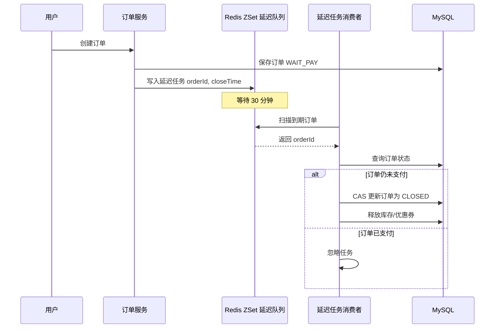
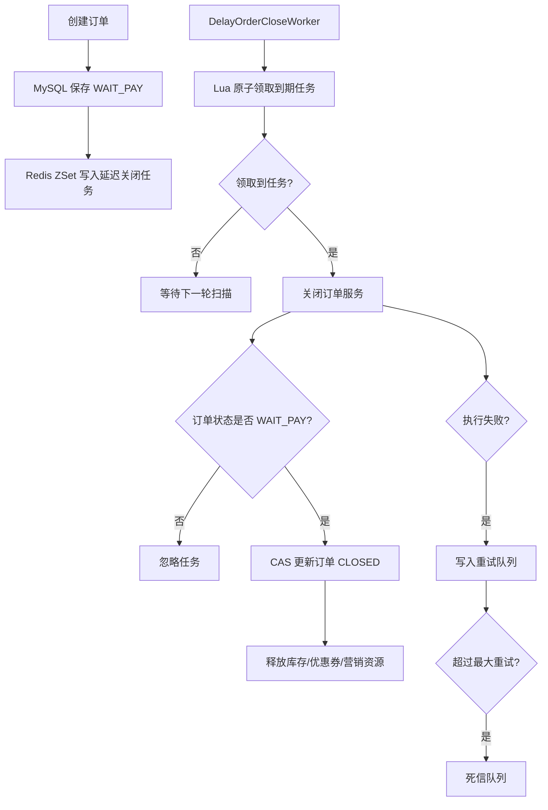
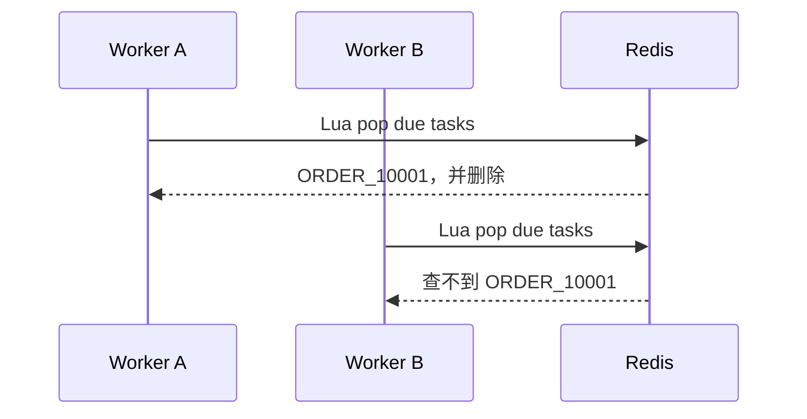
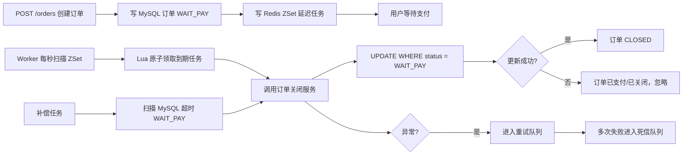

这一篇对应的是：

> **订单 30 分钟未支付自动关闭：Redis ZSet 延迟队列实现**

教学重点包括：ZSet 延迟队列、任务扫描、Lua 原子抢占任务、幂等关闭订单、重试机制、死信队列，以及和 RocketMQ 延迟消息的对比。

---

# Redis 深度案例 4：订单超时关闭延迟队列

## 0. 结论先说

订单延迟队列要解决的问题是：

> 用户下单后，如果 30 分钟内没有支付，系统需要自动关闭订单，释放库存、释放优惠券、恢复营销资源。

Redis 可以用 **ZSet** 实现轻量级延迟队列：

```text
ZSet key  : delay:order:close
member    : orderId
score     : 订单应该被处理的时间戳
```

例如：

```text
ZADD delay:order:close 1715900000000 ORDER_10001
```

当当前时间大于等于 score 时，说明这个订单已经到期，可以被扫描出来处理。

但生产级实现不能只写一个 `zrangebyscore`，还要处理：

|问题|必须解决|
|---|---|
|多实例同时扫描|需要原子抢占任务|
|订单可能已经支付|关闭订单前必须查库确认状态|
|消费失败|需要重试队列|
|多次执行|关闭逻辑必须幂等|
|Redis 数据丢失|数据库状态和补偿任务兜底|
|任务堆积|限制每次扫描数量|
|长时间失败|进入死信队列|

所以本案例的核心不是“Redis 能不能做延迟队列”，而是：

> **如何把 Redis ZSet 延迟队列做成一个接近生产可用的订单超时关闭组件。**

---

# 1. 业务场景：订单 30 分钟未支付自动关闭

## 1.1 业务流程

用户创建订单后，订单状态为：

```text
WAIT_PAY
```

系统同时写入一个延迟任务：

```text
订单创建时间 + 30 分钟
```

30 分钟后，延迟队列扫描到该任务，执行订单关闭逻辑。



---

# 2. 为什么不用普通定时任务直接扫数据库？

最简单的方案是：

```sql
SELECT id
FROM orders
WHERE status = 'WAIT_PAY'
  AND expire_time <= NOW()
LIMIT 100;
```

然后定时关闭这些订单。

这个方案能用，但在高并发订单系统中有几个问题。

## 2.1 数据库扫描压力大

如果每分钟扫一次数据库，订单量大时会频繁命中：

```sql
status + expire_time
```

虽然可以加索引，但依然会持续给 MySQL 制造压力。

Redis 延迟队列的优势是：

> 到期任务先放在 Redis，调度侧主要打 Redis，数据库只处理真正到期的订单。

---

## 2.2 延迟精度差

如果定时任务每 5 分钟扫一次，订单可能在 30 分钟后到 35 分钟才被关闭。

Redis ZSet 可以做到秒级甚至更低粒度扫描。

---

## 2.3 不适合多种延迟任务统一调度

订单关闭只是其中一种延迟任务。

实际业务里还可能有：

|延迟任务|示例|
|---|---|
|订单超时关闭|30 分钟未支付|
|支付补偿检查|支付后 2 分钟查三方状态|
|优惠券过期提醒|到期前 1 天提醒|
|售后超时自动确认|商家 48 小时未处理|
|拼团失败退款|到期未成团|

如果全部靠数据库扫描，会越来越混乱。

---

# 3. Redis 延迟队列的核心模型

## 3.1 为什么选 ZSet？

Redis ZSet 同时具备两个能力：

|能力|对延迟队列的意义|
|---|---|
|member 唯一|一个任务可以用一个唯一业务 ID 表示|
|score 排序|用执行时间戳作为 score|
|按 score 范围查询|查询当前已经到期的任务|
|删除 member|任务领取后从队列移除|

延迟队列天然适合这个结构：

```text
ZSet:
  key    = delay:order:close
  member = orderId
  score  = executeAtMillis
```

---

## 3.2 数据示例

假设订单 `10001` 在 10:00 创建，30 分钟后超时关闭。

```text
orderId = 10001
executeAt = 10:30:00
```

写入 Redis：

```redis
ZADD delay:order:close 1715913000000 10001
```

消费者扫描：

```redis
ZRANGEBYSCORE delay:order:close 0 当前时间戳 LIMIT 0 100
```

如果当前时间已经超过 `1715913000000`，订单 `10001` 就会被扫描出来。

---

# 4. 生产级流程设计

## 4.1 整体架构



---

## 4.2 关键设计点

|设计点|说明|
|---|---|
|延迟任务写入时机|订单创建成功后写入|
|任务执行时间|`createTime + 30min`|
|扫描方式|定时扫描 Redis ZSet|
|任务领取方式|Lua 脚本原子读取并删除|
|订单关闭方式|MySQL 状态机 + CAS 更新|
|幂等保障|只允许 `WAIT_PAY -> CLOSED`|
|失败处理|重试队列|
|最终兜底|数据库补偿扫描|

---

# 5. 数据库表设计

## 5.1 订单表

```sql
CREATE TABLE `t_order` (
  `id` bigint unsigned NOT NULL AUTO_INCREMENT COMMENT '主键ID',
  `order_no` varchar(64) NOT NULL COMMENT '订单号',
  `user_id` bigint unsigned NOT NULL COMMENT '用户ID',
  `status` varchar(32) NOT NULL COMMENT '订单状态：WAIT_PAY/PAID/CLOSED/CANCELED',
  `total_amount` decimal(10,2) NOT NULL COMMENT '订单金额',
  `expire_time` datetime NOT NULL COMMENT '订单支付过期时间',
  `pay_time` datetime DEFAULT NULL COMMENT '支付时间',
  `close_time` datetime DEFAULT NULL COMMENT '关闭时间',
  `close_reason` varchar(128) DEFAULT NULL COMMENT '关闭原因',
  `version` int NOT NULL DEFAULT 0 COMMENT '乐观锁版本号',
  `created_at` datetime NOT NULL DEFAULT CURRENT_TIMESTAMP COMMENT '创建时间',
  `updated_at` datetime NOT NULL DEFAULT CURRENT_TIMESTAMP ON UPDATE CURRENT_TIMESTAMP COMMENT '更新时间',
  PRIMARY KEY (`id`),
  UNIQUE KEY `uk_order_no` (`order_no`),
  KEY `idx_status_expire_time` (`status`, `expire_time`),
  KEY `idx_user_id_created_at` (`user_id`, `created_at`)
) ENGINE=InnoDB DEFAULT CHARSET=utf8mb4 COMMENT='订单表';
```

---

## 5.2 订单关闭日志表

```sql
CREATE TABLE `t_order_close_log` (
  `id` bigint unsigned NOT NULL AUTO_INCREMENT COMMENT '主键ID',
  `order_no` varchar(64) NOT NULL COMMENT '订单号',
  `close_type` varchar(32) NOT NULL COMMENT '关闭类型：TIMEOUT/MANUAL/SYSTEM',
  `close_result` varchar(32) NOT NULL COMMENT '关闭结果：SUCCESS/IGNORED/FAILED',
  `remark` varchar(255) DEFAULT NULL COMMENT '备注',
  `created_at` datetime NOT NULL DEFAULT CURRENT_TIMESTAMP COMMENT '创建时间',
  PRIMARY KEY (`id`),
  KEY `idx_order_no` (`order_no`)
) ENGINE=InnoDB DEFAULT CHARSET=utf8mb4 COMMENT='订单关闭日志表';
```

---

# 6. Redis Key 设计

```java
public final class RedisDelayQueueKeys {

    private RedisDelayQueueKeys() {
    }

    /**
     * 订单超时关闭延迟队列。
     *
     * ZSet:
     * - member: orderNo
     * - score : executeAtMillis
     */
    public static final String ORDER_CLOSE_DELAY_QUEUE = "delay:queue:order:close";

    /**
     * 订单关闭重试队列。
     *
     * member: orderNo
     * score : nextRetryAtMillis
     */
    public static final String ORDER_CLOSE_RETRY_QUEUE = "delay:queue:order:close:retry";

    /**
     * 订单关闭死信队列。
     *
     * Hash:
     * - field: orderNo
     * - value: dead letter reason JSON
     */
    public static final String ORDER_CLOSE_DEAD_LETTER = "delay:queue:order:close:dead";

    /**
     * 订单关闭重试次数。
     *
     * Hash:
     * - field: orderNo
     * - value: retryCount
     */
    public static final String ORDER_CLOSE_RETRY_COUNT = "delay:queue:order:close:retry-count";
}
```

---

# 7. Maven 依赖

```xml
<dependencies>
    <!-- Spring Boot Web，可选，用于接口演示 -->
    <dependency>
        <groupId>org.springframework.boot</groupId>
        <artifactId>spring-boot-starter-web</artifactId>
    </dependency>

    <!-- Spring Data Redis -->
    <dependency>
        <groupId>org.springframework.boot</groupId>
        <artifactId>spring-boot-starter-data-redis</artifactId>
    </dependency>

    <!-- MyBatis-Plus，简化 Mapper 示例 -->
    <dependency>
        <groupId>com.baomidou</groupId>
        <artifactId>mybatis-plus-spring-boot3-starter</artifactId>
        <version>3.5.9</version>
    </dependency>

    <!-- MySQL Driver -->
    <dependency>
        <groupId>com.mysql</groupId>
        <artifactId>mysql-connector-j</artifactId>
        <scope>runtime</scope>
    </dependency>

    <!-- Lombok，可选 -->
    <dependency>
        <groupId>org.projectlombok</groupId>
        <artifactId>lombok</artifactId>
        <optional>true</optional>
    </dependency>
</dependencies>
```

---

# 8. application.yml

```yaml
spring:
  application:
    name: redis-delay-order-demo

  datasource:
    url: jdbc:mysql://localhost:3306/redis_demo?useUnicode=true&characterEncoding=utf8&serverTimezone=Asia/Shanghai
    username: root
    password: root
    driver-class-name: com.mysql.cj.jdbc.Driver

  data:
    redis:
      host: localhost
      port: 6379
      database: 0
      timeout: 3000ms

mybatis-plus:
  configuration:
    map-underscore-to-camel-case: true
  mapper-locations: classpath:/mapper/*.xml

order:
  delay:
    close-after-minutes: 30
    scan-batch-size: 100
    scan-fixed-delay-ms: 1000
    max-retry-count: 5
```

---

# 9. 领域模型设计

## 9.1 订单状态枚举

```java
public enum OrderStatus {

    WAIT_PAY,
    PAID,
    CLOSED,
    CANCELED

}
```

---

## 9.2 订单实体

```java
import com.baomidou.mybatisplus.annotation.TableName;
import lombok.Data;

import java.math.BigDecimal;
import java.time.LocalDateTime;

@Data
@TableName("t_order")
public class OrderEntity {

    private Long id;

    private String orderNo;

    private Long userId;

    private String status;

    private BigDecimal totalAmount;

    private LocalDateTime expireTime;

    private LocalDateTime payTime;

    private LocalDateTime closeTime;

    private String closeReason;

    private Integer version;

    private LocalDateTime createdAt;

    private LocalDateTime updatedAt;
}
```

---

# 10. Mapper 设计

## 10.1 OrderMapper

```java
import com.baomidou.mybatisplus.core.mapper.BaseMapper;
import org.apache.ibatis.annotations.Mapper;
import org.apache.ibatis.annotations.Param;
import org.apache.ibatis.annotations.Update;

@Mapper
public interface OrderMapper extends BaseMapper<OrderEntity> {

    /**
     * 只有 WAIT_PAY 状态的订单才允许被超时关闭。
     *
     * 这是订单关闭幂等性的核心：
     * - 如果订单已支付，更新行数为 0
     * - 如果订单已关闭，更新行数为 0
     * - 只有未支付订单能从 WAIT_PAY -> CLOSED
     */
    @Update("""
        UPDATE t_order
        SET status = 'CLOSED',
            close_time = NOW(),
            close_reason = #{closeReason},
            version = version + 1
        WHERE order_no = #{orderNo}
          AND status = 'WAIT_PAY'
        """)
    int closeTimeoutOrder(
            @Param("orderNo") String orderNo,
            @Param("closeReason") String closeReason
    );
}
```

这个 SQL 是整个案例里最关键的代码之一。

因为 Redis 延迟任务可能重复执行，worker 可能重试，甚至补偿任务也可能再次触发关闭。

真正保证幂等的不是 Redis，而是数据库状态机：

```sql
WHERE order_no = ?
  AND status = 'WAIT_PAY'
```

只允许：

```text
WAIT_PAY -> CLOSED
```

不允许：

```text
PAID -> CLOSED
CLOSED -> CLOSED
CANCELED -> CLOSED
```

---

# 11. 延迟任务写入

## 11.1 DelayQueueService

```java
import lombok.RequiredArgsConstructor;
import org.springframework.data.redis.core.StringRedisTemplate;
import org.springframework.stereotype.Service;

import java.time.Duration;
import java.time.Instant;

@Service
@RequiredArgsConstructor
public class OrderDelayQueueService {

    private final StringRedisTemplate stringRedisTemplate;

    /**
     * 添加订单超时关闭任务。
     *
     * @param orderNo          订单号
     * @param delay            延迟时间，例如 30 分钟
     */
    public void addOrderCloseTask(String orderNo, Duration delay) {
        long executeAtMillis = Instant.now().plus(delay).toEpochMilli();

        stringRedisTemplate.opsForZSet().add(
                RedisDelayQueueKeys.ORDER_CLOSE_DELAY_QUEUE,
                orderNo,
                executeAtMillis
        );
    }

    /**
     * 添加订单关闭重试任务。
     *
     * @param orderNo          订单号
     * @param nextRetryDelay   下一次重试延迟
     */
    public void addOrderCloseRetryTask(String orderNo, Duration nextRetryDelay) {
        long nextRetryAtMillis = Instant.now().plus(nextRetryDelay).toEpochMilli();

        stringRedisTemplate.opsForZSet().add(
                RedisDelayQueueKeys.ORDER_CLOSE_RETRY_QUEUE,
                orderNo,
                nextRetryAtMillis
        );
    }
}
```

---

## 11.2 创建订单时写入延迟任务

```java
import lombok.RequiredArgsConstructor;
import org.springframework.beans.factory.annotation.Value;
import org.springframework.stereotype.Service;
import org.springframework.transaction.annotation.Transactional;

import java.math.BigDecimal;
import java.time.Duration;
import java.time.LocalDateTime;
import java.util.UUID;

@Service
@RequiredArgsConstructor
public class OrderCreateService {

    private final OrderMapper orderMapper;
    private final OrderDelayQueueService delayQueueService;

    @Value("${order.delay.close-after-minutes:30}")
    private long closeAfterMinutes;

    @Transactional(rollbackFor = Exception.class)
    public String createOrder(Long userId, BigDecimal amount) {
        String orderNo = generateOrderNo();

        OrderEntity order = new OrderEntity();
        order.setOrderNo(orderNo);
        order.setUserId(userId);
        order.setStatus(OrderStatus.WAIT_PAY.name());
        order.setTotalAmount(amount);
        order.setExpireTime(LocalDateTime.now().plusMinutes(closeAfterMinutes));
        order.setVersion(0);

        orderMapper.insert(order);

        /*
         * 注意：
         * 这里的 Redis 写入不在 MySQL 事务内。
         * 如果 MySQL 提交成功、Redis 写入失败，会导致订单没有延迟关闭任务。
         *
         * 生产上需要：
         * 1. 本地消息表；
         * 2. 事务后事件；
         * 3. 补偿扫描；
         * 4. MQ 延迟消息；
         * 5. 或者可靠事件机制。
         *
         * 本案例为了突出 Redis ZSet 延迟队列，先采用直接写入。
         */
        delayQueueService.addOrderCloseTask(
                orderNo,
                Duration.ofMinutes(closeAfterMinutes)
        );

        return orderNo;
    }

    private String generateOrderNo() {
        return "ORDER_" + UUID.randomUUID().toString().replace("-", "");
    }
}
```

这里要特别注意一个工程风险：

> 订单写 MySQL 成功，但 Redis 延迟任务写入失败。

这会造成订单永远不被自动关闭。

所以生产级系统必须增加兜底机制，后面会讲。

---

# 12. Lua 原子领取到期任务

## 12.1 为什么不能先查再删？

错误写法：

```java
Set<String> orderNos = redisTemplate.opsForZSet()
        .rangeByScore(queueKey, 0, now, 0, 100);

for (String orderNo : orderNos) {
    redisTemplate.opsForZSet().remove(queueKey, orderNo);
}
```

这个逻辑在单实例下看起来没问题，但多实例部署时会出问题。

假设两个 worker 同时扫描：

```text
Worker A 查到 ORDER_10001
Worker B 也查到 ORDER_10001
Worker A 删除并处理
Worker B 删除失败但可能仍然处理
```

所以要把“查询到期任务 + 删除任务”做成一个原子操作。

---

## 12.2 Lua 脚本

```lua
-- KEYS[1] = delay queue key
-- ARGV[1] = current timestamp millis
-- ARGV[2] = batch size

local items = redis.call(
    'ZRANGEBYSCORE',
    KEYS[1],
    0,
    ARGV[1],
    'LIMIT',
    0,
    ARGV[2]
)

if #items == 0 then
    return items
end

for i = 1, #items do
    redis.call('ZREM', KEYS[1], items[i])
end

return items
```

这个脚本保证：

```text
查到任务和删除任务在 Redis 内部原子完成。
```

Redis 执行 Lua 脚本期间不会被其他命令打断。

---

## 12.3 Java 加载 Lua 脚本

```java
import org.springframework.context.annotation.Bean;
import org.springframework.context.annotation.Configuration;
import org.springframework.data.redis.core.script.DefaultRedisScript;

import java.util.List;

@Configuration
public class RedisLuaConfig {

    @Bean
    public DefaultRedisScript<List> popDueTasksScript() {
        DefaultRedisScript<List> script = new DefaultRedisScript<>();
        script.setResultType(List.class);
        script.setScriptText("""
            local items = redis.call(
                'ZRANGEBYSCORE',
                KEYS[1],
                0,
                ARGV[1],
                'LIMIT',
                0,
                ARGV[2]
            )

            if #items == 0 then
                return items
            end

            for i = 1, #items do
                redis.call('ZREM', KEYS[1], items[i])
            end

            return items
            """);
        return script;
    }
}
```

---

## 12.4 RedisDelayTaskPopper

```java
import lombok.RequiredArgsConstructor;
import org.springframework.data.redis.core.StringRedisTemplate;
import org.springframework.data.redis.core.script.DefaultRedisScript;
import org.springframework.stereotype.Component;

import java.time.Instant;
import java.util.Collections;
import java.util.List;

@Component
@RequiredArgsConstructor
public class RedisDelayTaskPopper {

    private final StringRedisTemplate stringRedisTemplate;
    private final DefaultRedisScript<List> popDueTasksScript;

    @SuppressWarnings("unchecked")
    public List<String> popDueTasks(String queueKey, int batchSize) {
        Long nowMillis = Instant.now().toEpochMilli();

        List<String> result = stringRedisTemplate.execute(
                popDueTasksScript,
                Collections.singletonList(queueKey),
                String.valueOf(nowMillis),
                String.valueOf(batchSize)
        );

        if (result == null || result.isEmpty()) {
            return List.of();
        }

        return result;
    }
}
```

---

# 13. 订单关闭服务

## 13.1 OrderCloseService

```java
import lombok.RequiredArgsConstructor;
import org.springframework.stereotype.Service;
import org.springframework.transaction.annotation.Transactional;

@Service
@RequiredArgsConstructor
public class OrderCloseService {

    private final OrderMapper orderMapper;
    private final OrderCloseLogMapper orderCloseLogMapper;

    /**
     * 超时关闭订单。
     *
     * 该方法必须是幂等的。
     */
    @Transactional(rollbackFor = Exception.class)
    public CloseOrderResult closeOrderByTimeout(String orderNo) {
        int affectedRows = orderMapper.closeTimeoutOrder(
                orderNo,
                "订单超时未支付，系统自动关闭"
        );

        if (affectedRows == 1) {
            /*
             * 这里可以继续释放库存、释放优惠券、恢复活动名额。
             *
             * 在真实生产系统里，这些动作最好通过本地事件/MQ 解耦，
             * 不建议全部堆在同一个事务里。
             */
            saveCloseLog(orderNo, "SUCCESS", "订单超时关闭成功");
            return CloseOrderResult.closed(orderNo);
        }

        /*
         * affectedRows = 0 说明订单不是 WAIT_PAY。
         * 可能已经支付，也可能已经关闭。
         * 对延迟任务来说，这不是异常，而是正常幂等结果。
         */
        saveCloseLog(orderNo, "IGNORED", "订单状态不是 WAIT_PAY，忽略关闭");
        return CloseOrderResult.ignored(orderNo);
    }

    private void saveCloseLog(String orderNo, String result, String remark) {
        OrderCloseLogEntity log = new OrderCloseLogEntity();
        log.setOrderNo(orderNo);
        log.setCloseType("TIMEOUT");
        log.setCloseResult(result);
        log.setRemark(remark);
        orderCloseLogMapper.insert(log);
    }
}
```

---

## 13.2 CloseOrderResult

```java
public record CloseOrderResult(
        String orderNo,
        boolean closed,
        boolean ignored
) {

    public static CloseOrderResult closed(String orderNo) {
        return new CloseOrderResult(orderNo, true, false);
    }

    public static CloseOrderResult ignored(String orderNo) {
        return new CloseOrderResult(orderNo, false, true);
    }
}
```

---

# 14. 延迟队列 Worker

## 14.1 扫描主队列

```java
import lombok.RequiredArgsConstructor;
import lombok.extern.slf4j.Slf4j;
import org.springframework.beans.factory.annotation.Value;
import org.springframework.scheduling.annotation.Scheduled;
import org.springframework.stereotype.Component;

import java.time.Duration;
import java.util.List;

@Slf4j
@Component
@RequiredArgsConstructor
public class OrderCloseDelayWorker {

    private final RedisDelayTaskPopper taskPopper;
    private final OrderCloseService orderCloseService;
    private final OrderCloseRetryService retryService;

    @Value("${order.delay.scan-batch-size:100}")
    private int batchSize;

    /**
     * 每秒扫描一次订单关闭延迟队列。
     *
     * 注意：
     * fixedDelay 表示上一轮执行结束后，再等待指定时间执行下一轮。
     * 避免上一轮任务很慢时，下一轮并发堆积。
     */
    @Scheduled(fixedDelayString = "${order.delay.scan-fixed-delay-ms:1000}")
    public void scanOrderCloseDelayQueue() {
        List<String> orderNos = taskPopper.popDueTasks(
                RedisDelayQueueKeys.ORDER_CLOSE_DELAY_QUEUE,
                batchSize
        );

        if (orderNos.isEmpty()) {
            return;
        }

        log.info("扫描到订单超时关闭任务，count={}", orderNos.size());

        for (String orderNo : orderNos) {
            handleOrderCloseTask(orderNo);
        }
    }

    private void handleOrderCloseTask(String orderNo) {
        try {
            CloseOrderResult result = orderCloseService.closeOrderByTimeout(orderNo);

            if (result.closed()) {
                log.info("订单超时关闭成功，orderNo={}", orderNo);
            } else if (result.ignored()) {
                log.info("订单无需关闭，可能已支付或已关闭，orderNo={}", orderNo);
            }
        } catch (Exception ex) {
            log.error("订单超时关闭任务执行失败，orderNo={}", orderNo, ex);

            /*
             * 执行失败不能丢任务，需要进入重试队列。
             */
            retryService.addRetryTask(orderNo, ex);
        }
    }
}
```

---

# 15. 重试机制

## 15.1 为什么需要重试？

订单关闭可能失败：

|失败原因|示例|
|---|---|
|数据库短暂不可用|MySQL 抖动|
|下游服务异常|库存服务超时|
|网络异常|RPC 调用失败|
|死锁|并发更新订单|
|代码异常|空指针、数据异常|

如果失败后直接丢弃任务，订单可能永远不会关闭。

所以需要重试队列。

---

## 15.2 重试策略

这里采用简单策略：

|重试次数|下一次重试延迟|
|--:|--:|
|第 1 次|10 秒|
|第 2 次|30 秒|
|第 3 次|1 分钟|
|第 4 次|5 分钟|
|第 5 次|10 分钟|
|超过 5 次|死信队列|

---

## 15.3 OrderCloseRetryService

```java
import lombok.RequiredArgsConstructor;
import org.springframework.beans.factory.annotation.Value;
import org.springframework.data.redis.core.StringRedisTemplate;
import org.springframework.stereotype.Service;

import java.time.Duration;

@Service
@RequiredArgsConstructor
public class OrderCloseRetryService {

    private final StringRedisTemplate stringRedisTemplate;
    private final OrderDelayQueueService delayQueueService;
    private final DeadLetterService deadLetterService;

    @Value("${order.delay.max-retry-count:5}")
    private int maxRetryCount;

    public void addRetryTask(String orderNo, Exception ex) {
        Long retryCount = stringRedisTemplate.opsForHash().increment(
                RedisDelayQueueKeys.ORDER_CLOSE_RETRY_COUNT,
                orderNo,
                1
        );

        if (retryCount == null) {
            retryCount = 1L;
        }

        if (retryCount > maxRetryCount) {
            deadLetterService.addDeadLetter(orderNo, retryCount.intValue(), ex);
            cleanupRetryCount(orderNo);
            return;
        }

        Duration nextDelay = calculateNextDelay(retryCount.intValue());

        delayQueueService.addOrderCloseRetryTask(orderNo, nextDelay);
    }

    public void cleanupRetryCount(String orderNo) {
        stringRedisTemplate.opsForHash().delete(
                RedisDelayQueueKeys.ORDER_CLOSE_RETRY_COUNT,
                orderNo
        );
    }

    private Duration calculateNextDelay(int retryCount) {
        return switch (retryCount) {
            case 1 -> Duration.ofSeconds(10);
            case 2 -> Duration.ofSeconds(30);
            case 3 -> Duration.ofMinutes(1);
            case 4 -> Duration.ofMinutes(5);
            default -> Duration.ofMinutes(10);
        };
    }
}
```

---

## 15.4 重试队列 Worker

```java
import lombok.RequiredArgsConstructor;
import lombok.extern.slf4j.Slf4j;
import org.springframework.beans.factory.annotation.Value;
import org.springframework.scheduling.annotation.Scheduled;
import org.springframework.stereotype.Component;

import java.util.List;

@Slf4j
@Component
@RequiredArgsConstructor
public class OrderCloseRetryWorker {

    private final RedisDelayTaskPopper taskPopper;
    private final OrderCloseService orderCloseService;
    private final OrderCloseRetryService retryService;

    @Value("${order.delay.scan-batch-size:100}")
    private int batchSize;

    @Scheduled(fixedDelay = 1000)
    public void scanRetryQueue() {
        List<String> orderNos = taskPopper.popDueTasks(
                RedisDelayQueueKeys.ORDER_CLOSE_RETRY_QUEUE,
                batchSize
        );

        if (orderNos.isEmpty()) {
            return;
        }

        log.info("扫描到订单关闭重试任务，count={}", orderNos.size());

        for (String orderNo : orderNos) {
            handleRetryTask(orderNo);
        }
    }

    private void handleRetryTask(String orderNo) {
        try {
            CloseOrderResult result = orderCloseService.closeOrderByTimeout(orderNo);

            /*
             * 无论是关闭成功还是忽略，说明任务已经完成。
             * 可以清理重试次数。
             */
            if (result.closed() || result.ignored()) {
                retryService.cleanupRetryCount(orderNo);
            }
        } catch (Exception ex) {
            log.error("订单关闭重试任务执行失败，orderNo={}", orderNo, ex);
            retryService.addRetryTask(orderNo, ex);
        }
    }
}
```

---

# 16. 死信队列

## 16.1 死信队列的意义

死信队列不是为了自动修复问题，而是为了：

> 把长期失败的任务沉淀下来，方便人工排查、补偿、报警。

比如订单关闭连续失败 5 次，说明可能不是简单抖动，而是数据问题、代码问题或下游系统异常。

---

## 16.2 DeadLetterService

```java
import com.fasterxml.jackson.core.JsonProcessingException;
import com.fasterxml.jackson.databind.ObjectMapper;
import lombok.Builder;
import lombok.RequiredArgsConstructor;
import lombok.extern.slf4j.Slf4j;
import org.springframework.data.redis.core.StringRedisTemplate;
import org.springframework.stereotype.Service;

import java.time.LocalDateTime;

@Slf4j
@Service
@RequiredArgsConstructor
public class DeadLetterService {

    private final StringRedisTemplate stringRedisTemplate;
    private final ObjectMapper objectMapper;

    public void addDeadLetter(String orderNo, int retryCount, Exception ex) {
        DeadLetterRecord record = DeadLetterRecord.builder()
                .orderNo(orderNo)
                .retryCount(retryCount)
                .errorMessage(ex.getMessage())
                .deadAt(LocalDateTime.now().toString())
                .build();

        try {
            String json = objectMapper.writeValueAsString(record);

            stringRedisTemplate.opsForHash().put(
                    RedisDelayQueueKeys.ORDER_CLOSE_DEAD_LETTER,
                    orderNo,
                    json
            );

            log.error("订单关闭任务进入死信队列，orderNo={}, retryCount={}", orderNo, retryCount);
        } catch (JsonProcessingException jsonEx) {
            log.error("写入死信队列失败，orderNo={}", orderNo, jsonEx);
        }
    }

    @Builder
    public record DeadLetterRecord(
            String orderNo,
            int retryCount,
            String errorMessage,
            String deadAt
    ) {
    }
}
```

---

# 17. 支付成功时如何处理延迟任务？

订单延迟关闭任务已经写入 Redis，用户可能在 30 分钟内支付成功。

这时有两种方案。

---

## 17.1 方案一：支付成功时主动删除延迟任务

```java
public void removeOrderCloseTask(String orderNo) {
    stringRedisTemplate.opsForZSet().remove(
            RedisDelayQueueKeys.ORDER_CLOSE_DELAY_QUEUE,
            orderNo
    );

    stringRedisTemplate.opsForZSet().remove(
            RedisDelayQueueKeys.ORDER_CLOSE_RETRY_QUEUE,
            orderNo
    );
}
```

支付成功后调用：

```java
delayQueueService.removeOrderCloseTask(orderNo);
```

优点：

|优点|说明|
|---|---|
|减少无效任务|已支付订单不再被扫描|
|降低 worker 压力|到期任务数量更少|

缺点：

|缺点|说明|
|---|---|
|删除失败仍可能残留任务|所以关闭订单仍要查状态|
|不能依赖删除作为唯一保障|幂等关闭依旧必须存在|

---

## 17.2 方案二：不主动删除，消费时判断订单状态

即使用户已支付，延迟任务仍然留在 Redis。

30 分钟后 worker 扫描到任务，尝试关闭：

```sql
UPDATE t_order
SET status = 'CLOSED'
WHERE order_no = ?
  AND status = 'WAIT_PAY';
```

如果订单已支付：

```text
affectedRows = 0
```

任务被忽略。

优点：

|优点|说明|
|---|---|
|逻辑简单|不需要支付成功删除 Redis 任务|
|强依赖数据库状态机|更安全|

缺点：

|缺点|说明|
|---|---|
|无效任务较多|已支付订单仍会被扫描|
|Redis 队列更大|高订单量下有额外开销|

---

## 17.3 推荐做法

生产中建议组合使用：

```text
支付成功时主动删除 Redis 延迟任务
+
关闭订单时依然用数据库状态机幂等判断
```

也就是：

> Redis 删除是优化，数据库状态判断是正确性保障。

---

# 18. 补偿任务：防止 Redis 任务丢失

## 18.1 为什么必须有补偿？

Redis 延迟队列不是强可靠消息系统。

可能出现：

|风险|后果|
|---|---|
|订单创建成功，Redis 写入失败|订单没有关闭任务|
|Redis 宕机且未持久化|延迟任务丢失|
|Worker 领取任务后应用宕机|任务已从 Redis 删除但未执行成功|
|代码 Bug|部分任务未处理|

所以一定要有数据库补偿扫描。

---

## 18.2 补偿任务 SQL

```sql
SELECT order_no
FROM t_order
WHERE status = 'WAIT_PAY'
  AND expire_time <= NOW()
ORDER BY expire_time ASC
LIMIT 100;
```

---

## 18.3 CompensationWorker

```java
import com.baomidou.mybatisplus.core.conditions.query.LambdaQueryWrapper;
import lombok.RequiredArgsConstructor;
import lombok.extern.slf4j.Slf4j;
import org.springframework.scheduling.annotation.Scheduled;
import org.springframework.stereotype.Component;

import java.time.LocalDateTime;
import java.util.List;

@Slf4j
@Component
@RequiredArgsConstructor
public class OrderCloseCompensationWorker {

    private final OrderMapper orderMapper;
    private final OrderCloseService orderCloseService;

    /**
     * 每 1 分钟做一次兜底补偿。
     *
     * Redis 延迟队列负责实时调度；
     * MySQL 补偿任务负责最终兜底。
     */
    @Scheduled(fixedDelay = 60_000)
    public void compensateExpiredOrders() {
        List<OrderEntity> expiredOrders = orderMapper.selectList(
                new LambdaQueryWrapper<OrderEntity>()
                        .eq(OrderEntity::getStatus, OrderStatus.WAIT_PAY.name())
                        .le(OrderEntity::getExpireTime, LocalDateTime.now())
                        .orderByAsc(OrderEntity::getExpireTime)
                        .last("LIMIT 100")
        );

        if (expiredOrders.isEmpty()) {
            return;
        }

        log.warn("发现需要补偿关闭的超时订单，count={}", expiredOrders.size());

        for (OrderEntity order : expiredOrders) {
            try {
                orderCloseService.closeOrderByTimeout(order.getOrderNo());
            } catch (Exception ex) {
                log.error("补偿关闭订单失败，orderNo={}", order.getOrderNo(), ex);
            }
        }
    }
}
```

注意这里的补偿任务不是主链路。

它的定位是：

```text
Redis 延迟队列：负责准时处理大部分订单
MySQL 补偿扫描：负责兜底处理漏网订单
```

---

# 19. Worker 多实例部署问题

## 19.1 多实例为什么能工作？

因为任务领取使用 Lua 原子脚本：

```text
ZRANGEBYSCORE + ZREM
```

同一个 orderNo 只会被一个 worker 成功领取。



---

## 19.2 但是还有一个风险：领取后宕机

如果 worker 执行 Lua 脚本后，Redis 中的任务已经删除。

此时应用宕机：

```text
任务已删除，但订单没有关闭。
```

这个问题怎么解决？

有三种思路：

|方案|说明|
|---|---|
|数据库补偿扫描|最简单可靠|
|处理中队列|领取后写入 processing zset，成功后删除|
|使用专业 MQ|RocketMQ/Kafka 延迟消息或事务消息|

本教学案例采用：

```text
数据库补偿扫描兜底
```

对于订单超时关闭这种场景，这是够用且清晰的方案。

---

# 20. Redis 延迟队列和 RocketMQ 延迟消息对比

## 20.1 对比表

|维度|Redis ZSet 延迟队列|RocketMQ 延迟消息|
|---|---|---|
|实现复杂度|中等，需要自己写扫描和重试|较低，MQ 原生支持|
|延迟精度|取决于扫描频率|取决于 MQ 实现|
|可靠性|需要自己做补偿|更强|
|消费重试|需要自己实现|原生支持|
|死信队列|需要自己实现|原生支持|
|消息堆积治理|需要自己监控|MQ 更成熟|
|运维成本|Redis 已有时成本低|需要维护 MQ|
|适用场景|轻量延迟任务|核心业务事件|
|事务消息|不支持|支持|
|可观测性|自己建设|MQ 控制台更完善|

---

## 20.2 什么时候适合 Redis？

Redis ZSet 延迟队列适合：

|场景|原因|
|---|---|
|轻量订单关闭|逻辑简单，允许补偿兜底|
|本地任务调度|不想引入 MQ|
|延迟规模中等|任务量可控|
|对强可靠要求不是极端高|可接受补偿任务修复|
|已经有 Redis 基础设施|低成本落地|

---

## 20.3 什么时候不适合 Redis？

不建议用 Redis ZSet 延迟队列承载：

|场景|原因|
|---|---|
|金融支付核心通知|消息可靠性要求高|
|大规模消息堆积|Redis 内存压力大|
|复杂消费组模型|Redis ZSet 不提供消费组|
|跨系统事件总线|应该用 MQ|
|强事务一致性链路|Redis 延迟队列不支持事务消息|

---

## 20.4 工程判断

订单超时关闭可以用 Redis，但要看系统阶段：

|系统阶段|推荐方案|
|---|---|
|单体项目 / 中小规模系统|Redis ZSet 延迟队列 + DB 补偿|
|已经引入 RocketMQ|RocketMQ 延迟消息更自然|
|支付/交易强一致核心链路|RocketMQ 事务消息 + 补偿任务|
|任务调度复杂|XXL-JOB / Scheduler / MQ 组合|

不要把 Redis 延迟队列神化。

它的定位是：

> **轻量级、高性能、低成本的延迟任务调度方案，不是专业消息中间件的完整替代品。**

---

# 21. 生产风险清单

## 21.1 Redis 任务丢失

风险：

```text
订单创建成功，但 Redis 写入失败。
```

解决：

|措施|说明|
|---|---|
|事务后事件|MySQL 提交后再写 Redis|
|本地消息表|可靠记录待发送任务|
|补偿扫描|扫描超时 WAIT_PAY 订单|
|监控告警|监控超时未关闭订单数量|

---

## 21.2 任务重复消费

风险：

```text
同一个订单被多次关闭。
```

解决：

```sql
WHERE order_no = ?
  AND status = 'WAIT_PAY'
```

数据库状态机兜底。

---

## 21.3 任务堆积

风险：

```text
worker 处理速度 < 任务到期速度
```

解决：

|措施|说明|
|---|---|
|增加 batchSize|每轮处理更多任务|
|多实例部署 worker|横向扩展|
|异步处理任务|线程池并发消费|
|限制单任务耗时|避免下游阻塞|
|监控 ZSet size|队列长度告警|

---

## 21.4 大 Key 风险

如果所有订单关闭任务都放在一个 ZSet：

```text
delay:queue:order:close
```

订单量极大时，可能形成大 Key。

优化方式：

```text
delay:queue:order:close:0
delay:queue:order:close:1
delay:queue:order:close:2
...
delay:queue:order:close:15
```

按 orderNo hash 分片：

```java
int shard = Math.abs(orderNo.hashCode()) % 16;
String queueKey = "delay:queue:order:close:" + shard;
```

多个 worker 分别扫描不同分片。

---

## 21.5 时钟问题

ZSet score 使用的是应用机器时间。

如果多台机器时间不一致，会导致任务提前或延后执行。

解决：

|措施|说明|
|---|---|
|NTP 时间同步|所有机器统一时间|
|使用 Redis TIME|用 Redis 服务器时间作为基准|
|容忍小延迟|订单关闭通常不要求毫秒级|

生产上更严谨的做法是用 Redis 的 `TIME` 命令获取当前时间。

---

# 22. 可选优化：队列分片设计

## 22.1 分片 Key 设计

```java
public final class OrderDelayQueueShard {

    private static final int SHARD_COUNT = 16;

    public static String orderCloseQueueKey(String orderNo) {
        int shard = Math.abs(orderNo.hashCode()) % SHARD_COUNT;
        return "delay:queue:order:close:" + shard;
    }

    public static int shardCount() {
        return SHARD_COUNT;
    }
}
```

写入任务：

```java
String queueKey = OrderDelayQueueShard.orderCloseQueueKey(orderNo);

stringRedisTemplate.opsForZSet().add(
        queueKey,
        orderNo,
        executeAtMillis
);
```

扫描任务：

```java
for (int shard = 0; shard < OrderDelayQueueShard.shardCount(); shard++) {
    String queueKey = "delay:queue:order:close:" + shard;
    List<String> orderNos = taskPopper.popDueTasks(queueKey, batchSize);
    // process
}
```

---

## 22.2 分片的意义

|没有分片|有分片|
|---|---|
|一个大 ZSet|多个小 ZSet|
|单 Key 压力集中|压力分散|
|扫描扩展性差|可以多 worker 分片处理|
|大 Key 风险高|大 Key 风险降低|

---

# 23. 可选优化：处理线程池

当前示例中 worker 是串行处理：

```java
for (String orderNo : orderNos) {
    handleOrderCloseTask(orderNo);
}
```

如果单个订单关闭逻辑耗时较长，可以用线程池。

```java
import org.springframework.context.annotation.Bean;
import org.springframework.context.annotation.Configuration;

import java.util.concurrent.ExecutorService;
import java.util.concurrent.Executors;

@Configuration
public class OrderCloseExecutorConfig {

    @Bean
    public ExecutorService orderCloseExecutorService() {
        return Executors.newFixedThreadPool(16);
    }
}
```

Worker 改造：

```java
for (String orderNo : orderNos) {
    orderCloseExecutorService.submit(() -> handleOrderCloseTask(orderNo));
}
```

但注意：

> 引入线程池后，要监控线程池队列长度、拒绝策略、任务耗时，否则可能把问题从 Redis 转移到 JVM 内部。

---

# 24. Controller 演示接口

```java
import lombok.RequiredArgsConstructor;
import org.springframework.web.bind.annotation.*;

import java.math.BigDecimal;

@RestController
@RequestMapping("/orders")
@RequiredArgsConstructor
public class OrderController {

    private final OrderCreateService orderCreateService;

    @PostMapping
    public CreateOrderResponse createOrder(@RequestBody CreateOrderRequest request) {
        String orderNo = orderCreateService.createOrder(
                request.userId(),
                request.amount()
        );

        return new CreateOrderResponse(orderNo);
    }

    public record CreateOrderRequest(
            Long userId,
            BigDecimal amount
    ) {
    }

    public record CreateOrderResponse(
            String orderNo
    ) {
    }
}
```

---

# 25. 本案例的完整调用链



---

# 26. 面试表达

如果面试官问：

> 你怎么用 Redis 实现订单超时关闭？

可以这样回答：

```text
我们可以用 Redis ZSet 实现轻量级延迟队列。

创建订单时，订单状态是 WAIT_PAY，同时把 orderNo 写入 Redis ZSet，score 是订单过期时间戳，比如当前时间加 30 分钟。

后台 worker 定时扫描 ZSet 中 score 小于当前时间的任务。为了避免多实例重复消费，不能简单地先查再删，而是用 Lua 脚本把 ZRANGEBYSCORE 和 ZREM 做成原子操作。

拿到 orderNo 后，不能直接关闭订单，必须先通过数据库状态机做幂等判断。核心 SQL 是：

UPDATE t_order
SET status = 'CLOSED'
WHERE order_no = ?
  AND status = 'WAIT_PAY';

如果订单已经支付，更新行数就是 0，任务直接忽略。

另外 Redis 延迟队列不是强可靠消息系统，所以生产上还要做重试队列、死信队列和 MySQL 补偿扫描。补偿任务定期扫描 expire_time <= now 且 status = WAIT_PAY 的订单，避免 Redis 任务丢失导致订单无法关闭。

如果系统已经引入 RocketMQ，我会优先考虑 RocketMQ 延迟消息；如果是中小规模系统或轻量延迟任务，Redis ZSet 延迟队列是一个低成本方案。
```

---

# 27. 这篇案例的核心知识点

## 27.1 Redis 层

|知识点|作用|
|---|---|
|ZSet|存储延迟任务|
|score|表示任务执行时间|
|ZRANGEBYSCORE|查询到期任务|
|ZREM|删除已领取任务|
|Lua|保证领取任务原子性|
|Hash|记录重试次数、死信信息|

---

## 27.2 业务层

|知识点|作用|
|---|---|
|订单状态机|保证状态流转正确|
|幂等关闭|防止重复消费造成错误|
|补偿任务|防止 Redis 任务丢失|
|重试机制|处理短暂失败|
|死信队列|沉淀长期失败任务|

---

## 27.3 架构层

|知识点|作用|
|---|---|
|Redis 延迟队列|轻量任务调度|
|RocketMQ 延迟消息|更可靠的消息方案|
|DB 兜底|最终一致性保障|
|队列分片|避免大 Key|
|多实例 Worker|提升吞吐能力|

---

# 28. 最终总结

Redis ZSet 延迟队列的核心模型很简单：

```text
member = 任务 ID
score  = 执行时间戳
```

但生产可用的订单延迟队列，真正难点不在 ZSet，而在这些工程问题：

```text
多实例原子领取
订单状态幂等关闭
失败重试
死信沉淀
任务丢失补偿
大 Key 治理
监控告警
和 MQ 的边界判断
```

所以这篇案例的工程结论是：

> **Redis ZSet 可以实现订单延迟队列，但只能把它当作轻量级延迟调度组件。真正保证业务正确性的，是数据库状态机、幂等更新、重试补偿和死信治理。**

在订单超时关闭这个场景里，一个比较合理的生产级组合是：

```text
Redis ZSet 延迟队列
+
Lua 原子领取
+
MySQL WAIT_PAY -> CLOSED 状态机
+
失败重试队列
+
死信队列
+
MySQL 补偿扫描
```

这才是 Redis 延迟队列从 demo 走向工程实践的关键。