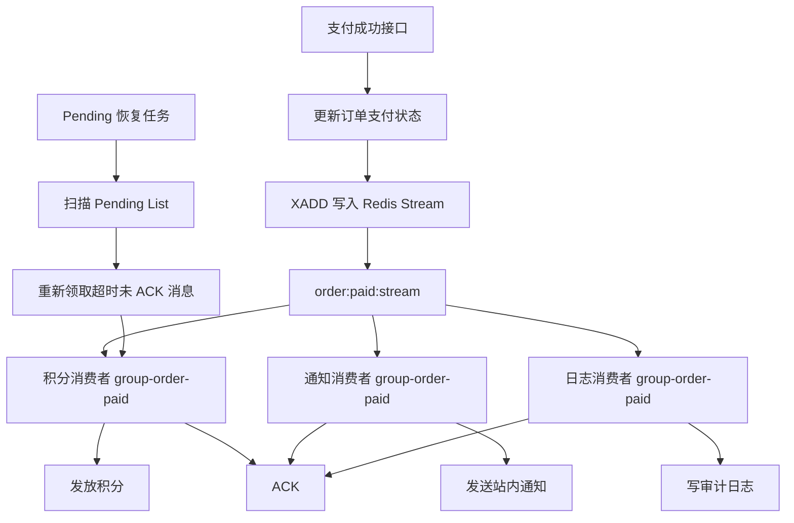
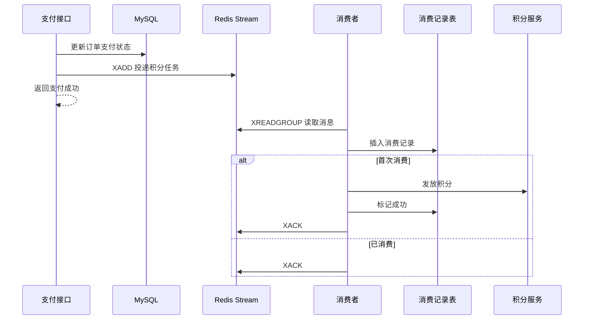
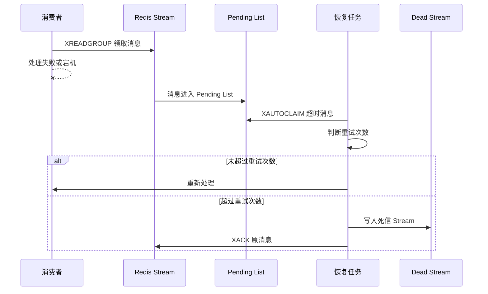

## 0. 结论先说

**Redis Stream 适合做“轻量级异步任务系统”，但不应该被误认为可以完全替代 RocketMQ / Kafka。**

它最适合的场景是：

> 单体应用、轻量微服务、小中型业务系统中，对可靠性有一定要求，但不想额外引入 MQ 中间件的异步任务处理。

例如：

- 用户注册后异步发放新人积分
    
- 订单支付成功后异步生成站内通知
    
- 博客发布后异步刷新搜索索引
    
- 操作完成后异步写审计日志
    
- 后台任务异步执行，不阻塞主流程
    

在前面的 Redis 教学规划中，Stream 被安排在“订单延迟队列”之后，作为独立深度案例，核心关注点就是：**Consumer Group、Pending List、ACK、重试、幂等，以及和 RocketMQ / Kafka 的边界** 。

---

# 1. 本案例业务场景：订单支付后的异步任务

## 1.1 业务背景

假设我们有一个电商订单系统。

用户支付成功后，主流程必须快速完成：

```text
用户支付成功
  ↓
更新订单支付状态
  ↓
返回支付成功结果
```

但是支付成功后还有很多“后置动作”：

|后置任务|是否必须同步完成|说明|
|---|--:|---|
|发放积分|否|可以异步执行|
|发送站内通知|否|不影响支付结果|
|写操作日志|否|可延迟|
|同步搜索 / 报表|否|可异步|
|推送优惠券|否|可重试|

这些任务如果全部放在支付接口里同步执行，会导致：

- 支付接口变慢
    
- 任意一个后置任务失败，影响主流程
    
- 业务耦合严重
    
- 后续新增任务需要频繁改支付代码
    

所以更合理的设计是：

> 支付成功后，只投递一个异步任务事件；后续任务由消费者慢慢处理。

---

# 2. 为什么这里选择 Redis Stream？

## 2.1 Pub/Sub 不适合

Redis Pub/Sub 很轻量，但它的问题也很明显：

|能力|Pub/Sub|
|---|---|
|消息持久化|不支持|
|消费组|不支持|
|消费失败重试|不支持|
|ACK 确认|不支持|
|消费者宕机恢复|不支持|

所以 Pub/Sub 更适合：

- 配置变更广播
    
- 本地缓存刷新通知
    
- 非关键事件提醒
    

不适合支付、积分、通知这类需要可靠处理的异步任务。

---

## 2.2 Stream 更适合轻量任务队列

Redis Stream 提供了更接近消息队列的能力：

|能力|Stream 是否支持|
|---|--:|
|消息持久化|支持|
|消费组 Consumer Group|支持|
|多消费者负载均衡|支持|
|ACK 确认|支持|
|Pending List|支持|
|失败消息重试|支持|
|消息 ID|支持|
|按 Stream 内顺序读取|支持|

所以本案例选择 Redis Stream。

---

# 3. 系统架构设计

## 3.1 总体架构



这里有一个关键点：

**如果多个任务类型都监听同一个 Stream，需要考虑消费模型。**

有两种设计方式。

---

## 3.2 设计方式一：一个 Stream，多类任务

```text
order:task:stream
```

消息字段里带 `taskType`：

```json
{
  "taskType": "GRANT_POINTS",
  "orderId": "10001",
  "userId": "20001"
}
```

优点：

- Stream 数量少
    
- 统一投递
    
- 统一治理
    

缺点：

- 消费者需要根据 taskType 分发
    
- 不同任务的消费速率会互相影响
    
- 一个 Consumer Group 中，同一条消息只会被一个消费者消费，不适合多个业务都必须处理同一个事件
    

---

## 3.3 设计方式二：一个事件，多条任务消息

支付成功后，分别写入不同 Stream：

```text
order:points:stream
order:notice:stream
order:audit:stream
```

优点：

- 每类任务独立消费
    
- 互不影响
    
- 重试策略可以不同
    
- 结构清晰
    

缺点：

- 投递逻辑稍微复杂
    
- Stream 数量增加
    

---

## 3.4 本案例采用的方案

教学案例采用第二种：

```text
支付成功
  ↓
写入积分任务 Stream
写入通知任务 Stream
写入审计任务 Stream
```

原因：

> 这更符合生产系统里“不同异步任务独立治理”的工程习惯。

---

# 4. Redis Key 设计

## 4.1 Stream Key

```text
mall:stream:order:points
mall:stream:order:notice
mall:stream:order:audit
```

## 4.2 Consumer Group

```text
mall-group-order-points
mall-group-order-notice
mall-group-order-audit
```

## 4.3 Consumer Name

建议使用：

```text
应用名 + 实例ID + 线程ID
```

例如：

```text
order-service-01-consumer-1
order-service-01-consumer-2
```

这样线上排查 Pending 消息时，能知道消息被哪个实例领取过。

---

# 5. 核心 Redis Stream 命令

## 5.1 写入消息：XADD

```bash
XADD mall:stream:order:points * orderId 10001 userId 20001 points 100
```

含义：

- `mall:stream:order:points`：Stream Key
    
- `*`：Redis 自动生成消息 ID
    
- 后面是消息字段
    

返回示例：

```text
1715900000000-0
```

---

## 5.2 创建消费组：XGROUP CREATE

```bash
XGROUP CREATE mall:stream:order:points mall-group-order-points 0 MKSTREAM
```

说明：

|参数|含义|
|---|---|
|`mall:stream:order:points`|Stream Key|
|`mall-group-order-points`|消费组|
|`0`|从头开始消费|
|`MKSTREAM`|Stream 不存在时自动创建|

如果只想消费创建消费组之后的新消息，可以使用：

```bash
XGROUP CREATE mall:stream:order:points mall-group-order-points $ MKSTREAM
```

---

## 5.3 消费消息：XREADGROUP

```bash
XREADGROUP GROUP mall-group-order-points consumer-1 COUNT 10 BLOCK 5000 STREAMS mall:stream:order:points >
```

关键点是最后的 `>`：

```text
>
```

表示读取当前消费组里**尚未投递给任何消费者的新消息**。

---

## 5.4 确认消息：XACK

```bash
XACK mall:stream:order:points mall-group-order-points 1715900000000-0
```

消费者处理成功后必须 ACK。

否则这条消息不会丢，但会进入 Pending List。

---

## 5.5 查看 Pending 消息：XPENDING

```bash
XPENDING mall:stream:order:points mall-group-order-points
```

可以看到：

- Pending 消息数量
    
- 最小消息 ID
    
- 最大消息 ID
    
- 每个消费者持有的 Pending 数量
    

---

## 5.6 转移超时 Pending 消息：XAUTOCLAIM

```bash
XAUTOCLAIM mall:stream:order:points mall-group-order-points consumer-2 60000 0-0 COUNT 10
```

含义：

> 把 60 秒以上未 ACK 的消息，重新分配给 consumer-2 处理。

这就是 Redis Stream 实现失败恢复的关键。

---

# 6. 数据库表设计：保证消费幂等

Redis Stream 提供的是消息传递能力，但它不能替你保证业务幂等。

异步任务系统必须有自己的消费记录表。

## 6.1 task_consume_record

```sql
CREATE TABLE task_consume_record (
    id BIGINT UNSIGNED NOT NULL AUTO_INCREMENT COMMENT '主键ID',
    stream_key VARCHAR(128) NOT NULL COMMENT 'Redis Stream Key',
    message_id VARCHAR(64) NOT NULL COMMENT 'Redis Stream 消息ID',
    business_key VARCHAR(128) NOT NULL COMMENT '业务幂等Key，例如 orderId + taskType',
    task_type VARCHAR(64) NOT NULL COMMENT '任务类型',
    consume_status TINYINT NOT NULL COMMENT '消费状态：0-处理中，1-成功，2-失败',
    retry_count INT NOT NULL DEFAULT 0 COMMENT '重试次数',
    error_message VARCHAR(512) DEFAULT NULL COMMENT '错误信息',
    created_at DATETIME NOT NULL DEFAULT CURRENT_TIMESTAMP COMMENT '创建时间',
    updated_at DATETIME NOT NULL DEFAULT CURRENT_TIMESTAMP ON UPDATE CURRENT_TIMESTAMP COMMENT '更新时间',
    PRIMARY KEY (id),
    UNIQUE KEY uk_stream_message (stream_key, message_id),
    UNIQUE KEY uk_business_task (business_key, task_type)
) ENGINE=InnoDB DEFAULT CHARSET=utf8mb4 COMMENT='异步任务消费记录表';
```

这里有两个唯一索引：

|唯一索引|作用|
|---|---|
|`uk_stream_message`|防止同一条 Stream 消息重复处理|
|`uk_business_task`|防止同一业务任务重复执行|

例如：

```text
business_key = order:10001
task_type = GRANT_POINTS
```

这可以保证：

> 同一个订单的积分发放任务，无论消息被重试多少次，都只能成功执行一次。

---

# 7. Spring Boot 工程结构

```text
redis-stream-task-demo
├── controller
│   └── PaymentController.java
├── service
│   ├── PaymentService.java
│   ├── OrderPointService.java
│   └── NoticeService.java
├── stream
│   ├── RedisStreamConstants.java
│   ├── RedisStreamProducer.java
│   ├── OrderPointsConsumer.java
│   ├── OrderNoticeConsumer.java
│   └── PendingMessageRecover.java
├── domain
│   └── OrderPaidTaskMessage.java
├── repository
│   └── TaskConsumeRecordRepository.java
└── config
    └── RedisStreamInitializer.java
```

---

# 8. 核心代码实现

## 8.1 常量定义

```java
public final class RedisStreamConstants {

    private RedisStreamConstants() {
    }

    public static final String ORDER_POINTS_STREAM = "mall:stream:order:points";
    public static final String ORDER_NOTICE_STREAM = "mall:stream:order:notice";

    public static final String ORDER_POINTS_GROUP = "mall-group-order-points";
    public static final String ORDER_NOTICE_GROUP = "mall-group-order-notice";
}
```

---

## 8.2 消息对象

```java
import java.math.BigDecimal;

public class OrderPaidTaskMessage {

    private Long orderId;
    private Long userId;
    private BigDecimal payAmount;
    private String taskType;

    public OrderPaidTaskMessage() {
    }

    public OrderPaidTaskMessage(Long orderId, Long userId, BigDecimal payAmount, String taskType) {
        this.orderId = orderId;
        this.userId = userId;
        this.payAmount = payAmount;
        this.taskType = taskType;
    }

    public Long getOrderId() {
        return orderId;
    }

    public Long getUserId() {
        return userId;
    }

    public BigDecimal getPayAmount() {
        return payAmount;
    }

    public String getTaskType() {
        return taskType;
    }
}
```

---

## 8.3 Stream Producer

```java
import org.springframework.data.redis.connection.stream.MapRecord;
import org.springframework.data.redis.connection.stream.RecordId;
import org.springframework.data.redis.core.StringRedisTemplate;
import org.springframework.stereotype.Component;

import java.util.HashMap;
import java.util.Map;

@Component
public class RedisStreamProducer {

    private final StringRedisTemplate stringRedisTemplate;

    public RedisStreamProducer(StringRedisTemplate stringRedisTemplate) {
        this.stringRedisTemplate = stringRedisTemplate;
    }

    public RecordId sendOrderPointsTask(OrderPaidTaskMessage message) {
        Map<String, String> body = new HashMap<>();
        body.put("orderId", String.valueOf(message.getOrderId()));
        body.put("userId", String.valueOf(message.getUserId()));
        body.put("payAmount", message.getPayAmount().toPlainString());
        body.put("taskType", "GRANT_POINTS");

        return stringRedisTemplate.opsForStream()
                .add(MapRecord.create(RedisStreamConstants.ORDER_POINTS_STREAM, body));
    }

    public RecordId sendOrderNoticeTask(OrderPaidTaskMessage message) {
        Map<String, String> body = new HashMap<>();
        body.put("orderId", String.valueOf(message.getOrderId()));
        body.put("userId", String.valueOf(message.getUserId()));
        body.put("payAmount", message.getPayAmount().toPlainString());
        body.put("taskType", "SEND_NOTICE");

        return stringRedisTemplate.opsForStream()
                .add(MapRecord.create(RedisStreamConstants.ORDER_NOTICE_STREAM, body));
    }
}
```

这里的设计是：

```text
支付成功
  ↓
写入积分任务 Stream
写入通知任务 Stream
```

不直接在支付接口里发积分、发通知。

---

## 8.4 支付成功后投递任务

```java
import org.springframework.stereotype.Service;
import org.springframework.transaction.annotation.Transactional;

import java.math.BigDecimal;

@Service
public class PaymentService {

    private final RedisStreamProducer redisStreamProducer;

    public PaymentService(RedisStreamProducer redisStreamProducer) {
        this.redisStreamProducer = redisStreamProducer;
    }

    @Transactional(rollbackFor = Exception.class)
    public void paySuccess(Long orderId, Long userId, BigDecimal payAmount) {
        // 1. 更新订单支付状态
        // orderRepository.markPaid(orderId, userId, payAmount);

        // 2. 构造支付成功任务消息
        OrderPaidTaskMessage message = new OrderPaidTaskMessage(
                orderId,
                userId,
                payAmount,
                "ORDER_PAID"
        );

        // 3. 投递积分任务
        redisStreamProducer.sendOrderPointsTask(message);

        // 4. 投递通知任务
        redisStreamProducer.sendOrderNoticeTask(message);
    }
}
```

注意一个生产风险：

> 如果订单状态更新成功，但 Redis Stream 写入失败，会导致后置任务丢失。

教学版可以先这样写，但生产中要进一步升级为：

- 本地消息表 Outbox
    
- 定时补偿投递
    
- 或直接使用 RocketMQ 事务消息
    

这一点后面会专门讲。

---

# 9. 初始化 Consumer Group

Spring Boot 启动时创建消费组。

```java
import org.springframework.boot.ApplicationRunner;
import org.springframework.context.annotation.Bean;
import org.springframework.context.annotation.Configuration;
import org.springframework.data.redis.RedisSystemException;
import org.springframework.data.redis.connection.stream.ReadOffset;
import org.springframework.data.redis.core.StringRedisTemplate;

@Configuration
public class RedisStreamInitializer {

    @Bean
    public ApplicationRunner initRedisStreamGroup(StringRedisTemplate redisTemplate) {
        return args -> {
            createGroupIfAbsent(
                    redisTemplate,
                    RedisStreamConstants.ORDER_POINTS_STREAM,
                    RedisStreamConstants.ORDER_POINTS_GROUP
            );

            createGroupIfAbsent(
                    redisTemplate,
                    RedisStreamConstants.ORDER_NOTICE_STREAM,
                    RedisStreamConstants.ORDER_NOTICE_GROUP
            );
        };
    }

    private void createGroupIfAbsent(StringRedisTemplate redisTemplate,
                                     String streamKey,
                                     String groupName) {
        try {
            redisTemplate.opsForStream().createGroup(streamKey, ReadOffset.from("0"), groupName);
        } catch (RedisSystemException ex) {
            String message = ex.getMessage();
            if (message != null && message.contains("BUSYGROUP")) {
                return;
            }
            throw ex;
        }
    }
}
```

生产项目中，建议在 Redis 初始化脚本或应用启动脚本里统一创建消费组，避免应用启动逻辑太重。

---

# 10. 消费者实现：积分发放任务

## 10.1 基础消费逻辑

```java
import org.springframework.data.redis.connection.stream.Consumer;
import org.springframework.data.redis.connection.stream.MapRecord;
import org.springframework.data.redis.connection.stream.StreamOffset;
import org.springframework.data.redis.connection.stream.ReadOffset;
import org.springframework.data.redis.connection.stream.RecordId;
import org.springframework.data.redis.core.StringRedisTemplate;
import org.springframework.data.redis.connection.stream.ConsumerOffset;
import org.springframework.data.redis.connection.stream.StreamReadOptions;
import org.springframework.scheduling.annotation.Scheduled;
import org.springframework.stereotype.Component;

import java.time.Duration;
import java.util.List;
import java.util.Map;

@Component
public class OrderPointsConsumer {

    private static final String CONSUMER_NAME = "order-service-points-consumer-1";

    private final StringRedisTemplate redisTemplate;
    private final OrderPointService orderPointService;
    private final TaskConsumeRecordRepository taskConsumeRecordRepository;

    public OrderPointsConsumer(StringRedisTemplate redisTemplate,
                               OrderPointService orderPointService,
                               TaskConsumeRecordRepository taskConsumeRecordRepository) {
        this.redisTemplate = redisTemplate;
        this.orderPointService = orderPointService;
        this.taskConsumeRecordRepository = taskConsumeRecordRepository;
    }

    @Scheduled(fixedDelay = 1000)
    public void consume() {
        List<MapRecord<String, Object, Object>> records = redisTemplate.opsForStream().read(
                Consumer.from(RedisStreamConstants.ORDER_POINTS_GROUP, CONSUMER_NAME),
                StreamReadOptions.empty()
                        .count(10)
                        .block(Duration.ofSeconds(2)),
                StreamOffset.create(RedisStreamConstants.ORDER_POINTS_STREAM, ReadOffset.lastConsumed())
        );

        if (records == null || records.isEmpty()) {
            return;
        }

        for (MapRecord<String, Object, Object> record : records) {
            handleRecord(record);
        }
    }

    private void handleRecord(MapRecord<String, Object, Object> record) {
        RecordId messageId = record.getId();
        Map<Object, Object> value = record.getValue();

        Long orderId = Long.valueOf(String.valueOf(value.get("orderId")));
        Long userId = Long.valueOf(String.valueOf(value.get("userId")));

        String businessKey = "order:" + orderId;
        String taskType = "GRANT_POINTS";

        try {
            boolean firstConsume = taskConsumeRecordRepository.tryStartConsume(
                    RedisStreamConstants.ORDER_POINTS_STREAM,
                    messageId.getValue(),
                    businessKey,
                    taskType
            );

            if (!firstConsume) {
                ack(messageId);
                return;
            }

            orderPointService.grantPoints(orderId, userId);

            taskConsumeRecordRepository.markSuccess(
                    RedisStreamConstants.ORDER_POINTS_STREAM,
                    messageId.getValue()
            );

            ack(messageId);
        } catch (Exception ex) {
            taskConsumeRecordRepository.markFailed(
                    RedisStreamConstants.ORDER_POINTS_STREAM,
                    messageId.getValue(),
                    ex.getMessage()
            );

            // 不 ACK，消息留在 Pending List，等待恢复任务重新处理
        }
    }

    private void ack(RecordId messageId) {
        redisTemplate.opsForStream().acknowledge(
                RedisStreamConstants.ORDER_POINTS_STREAM,
                RedisStreamConstants.ORDER_POINTS_GROUP,
                messageId
        );
    }
}
```

---

## 10.2 这里最关键的点

### 成功后 ACK

```java
ack(messageId);
```

表示消息处理成功，Redis 可以把它从 Pending List 中移除。

### 失败不 ACK

```java
// 不 ACK，消息留在 Pending List
```

失败消息不会丢，而是留在 Pending List，等待恢复任务处理。

### 幂等必须自己做

```java
taskConsumeRecordRepository.tryStartConsume(...)
```

即使 Redis Stream 重复投递，业务也不能重复发积分。

---

# 11. 幂等处理实现思路

## 11.1 tryStartConsume

伪代码如下：

```java
public boolean tryStartConsume(String streamKey,
                               String messageId,
                               String businessKey,
                               String taskType) {
    try {
        INSERT INTO task_consume_record (
            stream_key,
            message_id,
            business_key,
            task_type,
            consume_status
        ) VALUES (?, ?, ?, ?, 0);

        return true;
    } catch (DuplicateKeyException ex) {
        return false;
    }
}
```

核心是唯一索引：

```sql
UNIQUE KEY uk_business_task (business_key, task_type)
```

这样可以保证：

```text
同一个 orderId 的 GRANT_POINTS 任务只能执行一次
```

---

## 11.2 为什么不能只靠 Redis 消息 ID？

因为有时业务可能因为补偿逻辑产生多条消息。

例如：

```text
订单支付成功后，写入消息 A
补偿任务发现积分没发，又写入消息 B
```

这两条消息的 Redis messageId 不同，但业务本质上是同一个任务：

```text
order:10001 + GRANT_POINTS
```

所以业务幂等应该以业务键为准，而不是只以消息 ID 为准。

---

# 12. Pending 消息恢复机制

## 12.1 为什么需要 Pending 恢复？

假设消费者执行到一半宕机：

```text
XREADGROUP 领取消息
  ↓
发放积分
  ↓
服务宕机
  ↓
没有 XACK
```

这条消息会留在 Pending List。

如果没有恢复机制，它不会被新的 `>` 消费重新读取。

所以必须定期扫描 Pending List，把超时未 ACK 的消息重新领取。

---

## 12.2 Pending 恢复任务

```java
import org.springframework.data.redis.connection.stream.MapRecord;
import org.springframework.data.redis.connection.stream.RecordId;
import org.springframework.data.redis.connection.stream.StreamOffset;
import org.springframework.data.redis.core.StringRedisTemplate;
import org.springframework.scheduling.annotation.Scheduled;
import org.springframework.stereotype.Component;

import java.time.Duration;
import java.util.List;

@Component
public class PendingMessageRecover {

    private static final String RECOVER_CONSUMER = "order-service-points-recover-1";

    private final StringRedisTemplate redisTemplate;
    private final OrderPointsConsumer orderPointsConsumer;

    public PendingMessageRecover(StringRedisTemplate redisTemplate,
                                 OrderPointsConsumer orderPointsConsumer) {
        this.redisTemplate = redisTemplate;
        this.orderPointsConsumer = orderPointsConsumer;
    }

    @Scheduled(fixedDelay = 10000)
    public void recoverPointsPendingMessages() {
        List<MapRecord<String, Object, Object>> records =
                redisTemplate.opsForStream().autoClaim(
                        RedisStreamConstants.ORDER_POINTS_STREAM,
                        RedisStreamConstants.ORDER_POINTS_GROUP,
                        RECOVER_CONSUMER,
                        Duration.ofSeconds(60),
                        RecordId.of("0-0"),
                        10
                ).getClaimedRecords();

        if (records == null || records.isEmpty()) {
            return;
        }

        for (MapRecord<String, Object, Object> record : records) {
            orderPointsConsumer.handlePendingRecord(record);
        }
    }
}
```

为了让恢复任务复用处理逻辑，可以把 `handleRecord` 抽成公共方法。

---

## 12.3 恢复任务要限制重试次数

否则一个永远失败的消息会被无限重试。

建议增加：

```text
retry_count >= 5
```

之后进入死信处理。

死信可以设计为：

```text
mall:stream:order:points:dead
```

或者落库：

```text
task_dead_letter_record
```

---

# 13. 死信队列设计

## 13.1 什么是死信？

死信就是：

> 多次重试仍然失败，不能继续无限消费的消息。

例如：

- 用户不存在
    
- 订单数据异常
    
- 积分账户被冻结
    
- 下游服务一直失败
    
- 消息字段缺失
    

---

## 13.2 死信处理方式

可以把失败消息写入一个 Dead Stream：

```java
redisTemplate.opsForStream().add(
        MapRecord.create("mall:stream:order:points:dead", record.getValue())
);
```

然后 ACK 原消息：

```java
ack(messageId);
```

意思是：

> 原 Stream 不再无限重试，这条异常消息转交给人工或后台补偿系统处理。

---

# 14. 完整消费流程



失败恢复流程：



---

# 15. Redis Stream 和 RocketMQ / Kafka 的边界

## 15.1 Redis Stream 适合什么？

|场景|是否适合|
|---|--:|
|单体项目异步任务|适合|
|小型后台任务队列|适合|
|轻量通知任务|适合|
|操作日志异步写入|适合|
|低成本替代简单 MQ|适合|
|复杂事务消息|不适合|
|大规模日志流|不适合|
|高吞吐数据管道|不适合|
|跨服务复杂事件总线|不推荐|

---

## 15.2 什么时候应该用 RocketMQ？

如果你的业务有这些要求，就不要强行用 Redis Stream：

|需求|更推荐|
|---|---|
|事务消息|RocketMQ|
|延迟消息标准化|RocketMQ|
|顺序消息强治理|RocketMQ|
|大量 Topic 管理|RocketMQ|
|消息轨迹|RocketMQ|
|消费重试和死信机制成熟治理|RocketMQ|
|跨服务事件总线|RocketMQ / Kafka|
|大数据日志流|Kafka|

Redis Stream 更像：

> Redis 体系里的轻量消息队列能力。

RocketMQ / Kafka 是：

> 专业消息中间件。

二者不是同一个重量级。

---

# 16. 生产级风险点

## 16.1 Redis Stream 写入和数据库事务不一致

最典型的问题：

```text
订单状态更新成功
Redis Stream 写入失败
```

结果：

```text
订单已支付，但积分任务没有投递
```

解决方案：

|方案|说明|
|---|---|
|本地消息表 Outbox|推荐|
|定时扫描订单补偿|可作为兜底|
|RocketMQ 事务消息|更适合强一致异步链路|
|支付成功事件表|适合订单系统|

更生产级的做法：

```text
本地事务：
  1. 更新订单状态
  2. 插入本地消息表

异步投递：
  1. 扫描本地消息表
  2. XADD 到 Redis Stream
  3. 标记消息已投递
```

---

## 16.2 Pending List 堆积

如果消费者失败后不 ACK，Pending 会越来越多。

必须监控：

```text
XPENDING stream group
```

关注：

- Pending 总量
    
- 最大 idle time
    
- 每个 consumer 的 pending 数
    
- 重试次数
    
- 死信数量
    

---

## 16.3 Stream 没有限长导致内存膨胀

XADD 默认会一直追加消息。

可以使用近似裁剪：

```bash
XADD mall:stream:order:points MAXLEN ~ 100000 * orderId 10001 userId 20001
```

含义：

> Stream 长度近似控制在 100000 条左右。

但要注意：

**不能裁剪掉还没被消费的消息。**

生产中要根据消费延迟、消息量、保留时间综合设置。

---

## 16.4 消费者处理能力不足

表现：

```text
Stream 长度持续增长
Pending 持续增长
消费延迟越来越大
```

优化方式：

- 增加消费者实例
    
- 增加消费者线程
    
- 拆分 Stream
    
- 减少单条任务耗时
    
- 批量处理
    
- 下游服务限流
    
- 使用专业 MQ
    

---

## 16.5 幂等设计缺失

这是最严重的问题。

Redis Stream 只保证消息不会轻易丢，但不能保证业务只执行一次。

必须接受一个工程事实：

> 消息系统通常提供的是“至少一次投递”，业务必须自己保证幂等。

---

# 17. 本案例的工程价值

Redis Stream 异步任务系统，本质上解决的是：

> 把主流程和后置任务解耦，让主链路更短，让失败任务可以重试，让轻量业务不必一开始就引入完整 MQ。

它适合教学的原因是：

1. 能讲清楚 Redis 不只是缓存。
    
2. 能让学习者理解消息队列的核心语义。
    
3. 能自然引出 ACK、Pending、重试、死信、幂等。
    
4. 能和 Pub/Sub、RocketMQ、Kafka 做边界对比。
    
5. 代码复杂度可控，但工程含金量高。
    

---

# 18. 面试表达

可以这样说：

> 我在项目里用 Redis Stream 做过轻量级异步任务处理。比如订单支付成功后，不直接同步发积分和通知，而是把任务写入 Stream，由 Consumer Group 异步消费。消费成功后通过 XACK 确认，失败则保留在 Pending List，由后台恢复任务通过 XAUTOCLAIM 重新领取。为了避免重复消费，我没有依赖 Redis 消息 ID，而是基于业务键设计了幂等表，比如 orderId + taskType 建唯一索引。
> 
> 但我不会把 Redis Stream 当成 RocketMQ 的完全替代品。如果涉及事务消息、复杂延迟消息、大规模跨服务事件流、消息轨迹和标准化死信治理，我会优先选择 RocketMQ 或 Kafka。Redis Stream 更适合轻量异步任务、单体项目或中小型服务内部解耦。

---

# 19. 总结

## 核心关键词

```text
Redis Stream
XADD
XGROUP
XREADGROUP
XACK
XPENDING
XAUTOCLAIM
Consumer Group
Pending List
ACK
重试
死信队列
消费幂等
业务幂等键
Outbox 本地消息表
轻量异步任务系统
```

## 一句话总结

**Redis Stream 的价值不是替代专业 MQ，而是在 Redis 体系内提供一个足够可靠、足够轻量的异步任务处理能力。**

它的核心工程模型是：

```text
XADD 投递任务
  ↓
Consumer Group 消费
  ↓
业务幂等处理
  ↓
成功 XACK
  ↓
失败进入 Pending
  ↓
XAUTOCLAIM 恢复
  ↓
多次失败进入死信
```

学到这里，Redis 的能力边界就从“缓存”扩展到了“轻量消息队列”。下一步再讲 **Redis 规则引擎**，就可以进入 Redis 作为“内存业务执行引擎”的更高级用法。