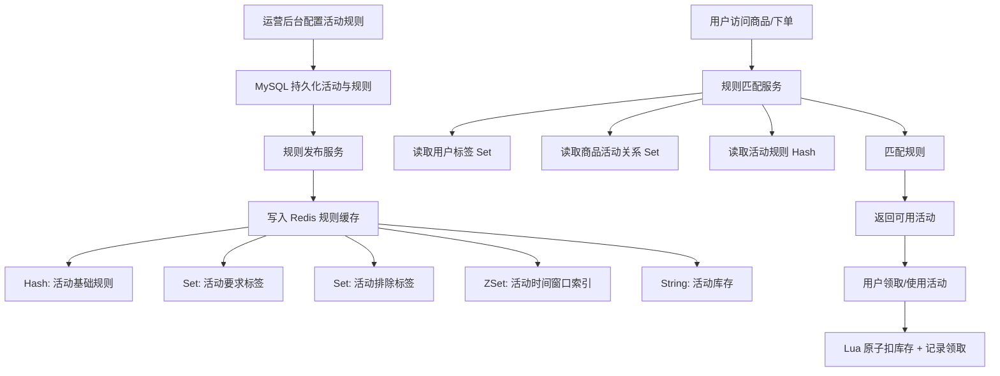
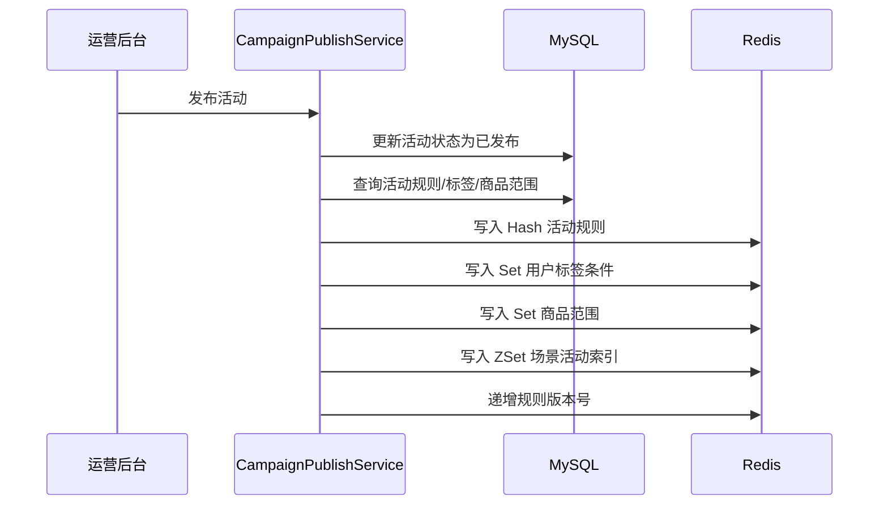

## 0. 结论先说

**Redis 规则引擎不是让 Redis 去执行复杂业务代码，而是把“高频、结构化、可快速匹配的规则条件”预加载到 Redis，用内存数据结构完成毫秒级规则筛选。**

这个案例放在 Redis 系列最后是合理的，因为它已经不是单纯缓存，而是：

> **业务规则建模 + Redis 数据结构 + 高性能匹配 + 原子领取兜底。**

这也符合前面教学方案对第 6 篇的定位：活动规则缓存、用户标签 Set、商品规则 Hash、时间窗口 ZSet、规则匹配、本地缓存 + Redis 二级缓存、规则变更通知。

---

# 1. 业务场景：营销活动规则引擎

假设电商系统里有一个营销活动模块。

用户进入商品详情页、购物车页、下单页时，系统需要快速判断：

> 当前用户、当前商品、当前订单，能匹配哪些营销活动？

例如：

|活动|规则|
|---|---|
|新人专享券|用户必须是新用户，且未领取过|
|会员满减|用户等级 >= VIP3，订单金额 >= 200|
|数码品类券|商品属于数码品类|
|限时活动|当前时间在活动时间范围内|
|黑名单过滤|风控黑名单用户不能参加|
|库存限制|活动券库存必须大于 0|
|每人限领|每个用户只能领取一次|

如果每次请求都查数据库：

```text
用户请求
  ↓
查活动表
  ↓
查规则表
  ↓
查用户标签表
  ↓
查商品类目表
  ↓
查领取记录表
  ↓
计算是否匹配
```

高并发下会出现几个问题：

1. 数据库压力大。
    
2. 活动规则读取频繁，但变更不频繁。
    
3. 用户标签、商品标签、活动规则天然适合用 Redis Set / Hash 存储。
    
4. 规则匹配需要低延迟，尤其在商品详情页、下单页这种核心链路。
    

所以这里可以引入 Redis。

---

# 2. 这个案例解决什么问题？

## 2.1 核心目标

```text
把频繁读取、结构化、低延迟要求高的规则数据，从数据库读取链路中剥离出来。
```

也就是：

|问题|Redis 解决方式|
|---|---|
|活动规则频繁查询|活动规则缓存到 Redis Hash|
|用户标签频繁读取|用户标签放 Redis Set|
|商品可参加活动频繁判断|商品活动关系放 Redis Set|
|活动时间窗口判断|活动索引放 Redis ZSet|
|活动领取并发控制|Lua 保证库存扣减 + 用户领取记录原子性|
|规则变更后如何刷新|后台发布规则后同步 Redis，并通知本地缓存失效|

---

# 3. 整体架构



---

# 4. Redis Key 设计

## 4.1 活动规则数据

|Key|类型|说明|
|---|---|---|
|`mkt:campaign:{campaignId}:rule`|Hash|活动规则主体|
|`mkt:campaign:{campaignId}:required_tags`|Set|必须具备的用户标签|
|`mkt:campaign:{campaignId}:excluded_tags`|Set|排除的用户标签|
|`mkt:campaign:{campaignId}:sku_scope`|Set|可参与商品 ID|
|`mkt:campaign:{campaignId}:category_scope`|Set|可参与类目 ID|
|`mkt:campaign:{campaignId}:claimed_users`|Set|已领取用户|
|`mkt:campaign:{campaignId}:stock`|String|活动库存|

## 4.2 索引数据

|Key|类型|说明|
|---|---|---|
|`mkt:scene:{scene}:campaigns`|ZSet|某个场景下的活动索引，score 为活动结束时间|
|`mkt:sku:{skuId}:campaigns`|Set|某个商品可参与的活动|
|`mkt:user:{userId}:tags`|Set|用户标签|
|`mkt:rule:version`|String|规则版本号|

场景 `scene` 可以是：

```text
PRODUCT_DETAIL
CART
ORDER_CONFIRM
PAY_SUCCESS
```

---

# 5. MySQL 表结构设计

Redis 不是主存储，规则必须落库。Redis 只是高速执行层。

## 5.1 活动表

```sql
CREATE TABLE marketing_campaign (
    id BIGINT UNSIGNED NOT NULL AUTO_INCREMENT COMMENT '主键ID',
    campaign_name VARCHAR(128) NOT NULL COMMENT '活动名称',
    scene VARCHAR(64) NOT NULL COMMENT '活动场景：PRODUCT_DETAIL/CART/ORDER_CONFIRM',
    start_time DATETIME NOT NULL COMMENT '开始时间',
    end_time DATETIME NOT NULL COMMENT '结束时间',
    status TINYINT NOT NULL DEFAULT 0 COMMENT '状态：0草稿 1已发布 2下线',
    stock INT NOT NULL DEFAULT 0 COMMENT '活动库存',
    min_order_amount DECIMAL(10,2) NOT NULL DEFAULT 0.00 COMMENT '最低订单金额',
    user_level_min INT NOT NULL DEFAULT 0 COMMENT '最低用户等级',
    per_user_limit INT NOT NULL DEFAULT 1 COMMENT '每个用户限制次数',
    created_at DATETIME NOT NULL DEFAULT CURRENT_TIMESTAMP,
    updated_at DATETIME NOT NULL DEFAULT CURRENT_TIMESTAMP ON UPDATE CURRENT_TIMESTAMP,
    PRIMARY KEY (id),
    KEY idx_scene_status_time (scene, status, start_time, end_time)
) ENGINE=InnoDB DEFAULT CHARSET=utf8mb4 COMMENT='营销活动表';
```

## 5.2 活动标签规则表

```sql
CREATE TABLE marketing_campaign_tag_rule (
    id BIGINT UNSIGNED NOT NULL AUTO_INCREMENT COMMENT '主键ID',
    campaign_id BIGINT UNSIGNED NOT NULL COMMENT '活动ID',
    tag_code VARCHAR(64) NOT NULL COMMENT '标签编码',
    tag_type TINYINT NOT NULL COMMENT '标签类型：1必须具备 2必须排除',
    created_at DATETIME NOT NULL DEFAULT CURRENT_TIMESTAMP,
    PRIMARY KEY (id),
    KEY idx_campaign_id (campaign_id),
    KEY idx_tag_code (tag_code)
) ENGINE=InnoDB DEFAULT CHARSET=utf8mb4 COMMENT='活动标签规则表';
```

## 5.3 活动商品范围表

```sql
CREATE TABLE marketing_campaign_sku_scope (
    id BIGINT UNSIGNED NOT NULL AUTO_INCREMENT COMMENT '主键ID',
    campaign_id BIGINT UNSIGNED NOT NULL COMMENT '活动ID',
    sku_id BIGINT UNSIGNED NOT NULL COMMENT '商品ID',
    created_at DATETIME NOT NULL DEFAULT CURRENT_TIMESTAMP,
    PRIMARY KEY (id),
    UNIQUE KEY uk_campaign_sku (campaign_id, sku_id)
) ENGINE=InnoDB DEFAULT CHARSET=utf8mb4 COMMENT='活动商品范围表';
```

---

# 6. Java 工程结构

```text
com.example.marketing
├── controller
│   └── MarketingRuleController.java
├── application
│   ├── CampaignPublishService.java
│   └── CampaignEvaluateService.java
├── domain
│   ├── CampaignRule.java
│   ├── EvaluationContext.java
│   └── EvaluationResult.java
├── infrastructure
│   ├── redis
│   │   ├── RedisMarketingKeys.java
│   │   ├── RedisCampaignRuleRepository.java
│   │   └── CampaignClaimLuaExecutor.java
│   └── mapper
│       ├── CampaignMapper.java
│       ├── CampaignTagRuleMapper.java
│       └── CampaignSkuScopeMapper.java
└── config
    └── RedisConfig.java
```

---

# 7. 核心领域模型

## 7.1 活动规则模型

```java
package com.example.marketing.domain;

import java.math.BigDecimal;
import java.time.LocalDateTime;
import java.util.Set;

public class CampaignRule {

    private Long campaignId;

    private String campaignName;

    private String scene;

    private LocalDateTime startTime;

    private LocalDateTime endTime;

    private BigDecimal minOrderAmount;

    private Integer userLevelMin;

    private Integer perUserLimit;

    private Set<String> requiredTags;

    private Set<String> excludedTags;

    private Set<Long> skuScope;

    public boolean timeMatched(LocalDateTime now) {
        return !now.isBefore(startTime) && !now.isAfter(endTime);
    }

    public boolean amountMatched(BigDecimal orderAmount) {
        return orderAmount.compareTo(minOrderAmount) >= 0;
    }

    public boolean userLevelMatched(Integer userLevel) {
        return userLevel >= userLevelMin;
    }

    public Long getCampaignId() {
        return campaignId;
    }

    public String getCampaignName() {
        return campaignName;
    }

    public String getScene() {
        return scene;
    }

    public LocalDateTime getStartTime() {
        return startTime;
    }

    public LocalDateTime getEndTime() {
        return endTime;
    }

    public BigDecimal getMinOrderAmount() {
        return minOrderAmount;
    }

    public Integer getUserLevelMin() {
        return userLevelMin;
    }

    public Integer getPerUserLimit() {
        return perUserLimit;
    }

    public Set<String> getRequiredTags() {
        return requiredTags;
    }

    public Set<String> getExcludedTags() {
        return excludedTags;
    }

    public Set<Long> getSkuScope() {
        return skuScope;
    }

    public void setCampaignId(Long campaignId) {
        this.campaignId = campaignId;
    }

    public void setCampaignName(String campaignName) {
        this.campaignName = campaignName;
    }

    public void setScene(String scene) {
        this.scene = scene;
    }

    public void setStartTime(LocalDateTime startTime) {
        this.startTime = startTime;
    }

    public void setEndTime(LocalDateTime endTime) {
        this.endTime = endTime;
    }

    public void setMinOrderAmount(BigDecimal minOrderAmount) {
        this.minOrderAmount = minOrderAmount;
    }

    public void setUserLevelMin(Integer userLevelMin) {
        this.userLevelMin = userLevelMin;
    }

    public void setPerUserLimit(Integer perUserLimit) {
        this.perUserLimit = perUserLimit;
    }

    public void setRequiredTags(Set<String> requiredTags) {
        this.requiredTags = requiredTags;
    }

    public void setExcludedTags(Set<String> excludedTags) {
        this.excludedTags = excludedTags;
    }

    public void setSkuScope(Set<Long> skuScope) {
        this.skuScope = skuScope;
    }
}
```

## 7.2 规则匹配上下文

```java
package com.example.marketing.domain;

import java.math.BigDecimal;

public class EvaluationContext {

    private Long userId;

    private Long skuId;

    private String scene;

    private Integer userLevel;

    private BigDecimal orderAmount;

    public Long getUserId() {
        return userId;
    }

    public Long getSkuId() {
        return skuId;
    }

    public String getScene() {
        return scene;
    }

    public Integer getUserLevel() {
        return userLevel;
    }

    public BigDecimal getOrderAmount() {
        return orderAmount;
    }

    public void setUserId(Long userId) {
        this.userId = userId;
    }

    public void setSkuId(Long skuId) {
        this.skuId = skuId;
    }

    public void setScene(String scene) {
        this.scene = scene;
    }

    public void setUserLevel(Integer userLevel) {
        this.userLevel = userLevel;
    }

    public void setOrderAmount(BigDecimal orderAmount) {
        this.orderAmount = orderAmount;
    }
}
```

## 7.3 匹配结果

```java
package com.example.marketing.domain;

public class EvaluationResult {

    private Long campaignId;

    private String campaignName;

    private boolean matched;

    private String reason;

    public static EvaluationResult matched(Long campaignId, String campaignName) {
        EvaluationResult result = new EvaluationResult();
        result.campaignId = campaignId;
        result.campaignName = campaignName;
        result.matched = true;
        result.reason = "MATCHED";
        return result;
    }

    public static EvaluationResult rejected(Long campaignId, String reason) {
        EvaluationResult result = new EvaluationResult();
        result.campaignId = campaignId;
        result.matched = false;
        result.reason = reason;
        return result;
    }

    public Long getCampaignId() {
        return campaignId;
    }

    public String getCampaignName() {
        return campaignName;
    }

    public boolean isMatched() {
        return matched;
    }

    public String getReason() {
        return reason;
    }
}
```

---

# 8. Redis Key 工具类

```java
package com.example.marketing.infrastructure.redis;

public final class RedisMarketingKeys {

    private RedisMarketingKeys() {
    }

    public static String campaignRule(Long campaignId) {
        return "mkt:campaign:" + campaignId + ":rule";
    }

    public static String campaignRequiredTags(Long campaignId) {
        return "mkt:campaign:" + campaignId + ":required_tags";
    }

    public static String campaignExcludedTags(Long campaignId) {
        return "mkt:campaign:" + campaignId + ":excluded_tags";
    }

    public static String campaignSkuScope(Long campaignId) {
        return "mkt:campaign:" + campaignId + ":sku_scope";
    }

    public static String campaignClaimedUsers(Long campaignId) {
        return "mkt:campaign:" + campaignId + ":claimed_users";
    }

    public static String campaignStock(Long campaignId) {
        return "mkt:campaign:" + campaignId + ":stock";
    }

    public static String sceneCampaigns(String scene) {
        return "mkt:scene:" + scene + ":campaigns";
    }

    public static String skuCampaigns(Long skuId) {
        return "mkt:sku:" + skuId + ":campaigns";
    }

    public static String userTags(Long userId) {
        return "mkt:user:" + userId + ":tags";
    }

    public static String ruleVersion() {
        return "mkt:rule:version";
    }
}
```

---

# 9. 规则发布：从 MySQL 加载到 Redis

运营后台发布活动后，需要把规则写入 Redis。

## 9.1 发布流程



## 9.2 Redis 写入代码

```java
package com.example.marketing.infrastructure.redis;

import com.example.marketing.domain.CampaignRule;
import org.springframework.data.redis.core.StringRedisTemplate;
import org.springframework.stereotype.Repository;

import java.time.ZoneId;
import java.util.HashMap;
import java.util.Map;
import java.util.Set;
import java.util.stream.Collectors;

@Repository
public class RedisCampaignRuleRepository {

    private final StringRedisTemplate redisTemplate;

    public RedisCampaignRuleRepository(StringRedisTemplate redisTemplate) {
        this.redisTemplate = redisTemplate;
    }

    public void saveRule(CampaignRule rule, Integer stock) {
        Long campaignId = rule.getCampaignId();

        Map<String, String> ruleMap = new HashMap<>();
        ruleMap.put("campaignId", String.valueOf(rule.getCampaignId()));
        ruleMap.put("campaignName", rule.getCampaignName());
        ruleMap.put("scene", rule.getScene());
        ruleMap.put("startTime", String.valueOf(rule.getStartTime()
                .atZone(ZoneId.systemDefault()).toInstant().toEpochMilli()));
        ruleMap.put("endTime", String.valueOf(rule.getEndTime()
                .atZone(ZoneId.systemDefault()).toInstant().toEpochMilli()));
        ruleMap.put("minOrderAmount", rule.getMinOrderAmount().toPlainString());
        ruleMap.put("userLevelMin", String.valueOf(rule.getUserLevelMin()));
        ruleMap.put("perUserLimit", String.valueOf(rule.getPerUserLimit()));

        redisTemplate.opsForHash().putAll(
                RedisMarketingKeys.campaignRule(campaignId),
                ruleMap
        );

        replaceSet(
                RedisMarketingKeys.campaignRequiredTags(campaignId),
                rule.getRequiredTags()
        );

        replaceSet(
                RedisMarketingKeys.campaignExcludedTags(campaignId),
                rule.getExcludedTags()
        );

        Set<String> skuIds = rule.getSkuScope()
                .stream()
                .map(String::valueOf)
                .collect(Collectors.toSet());

        replaceSet(RedisMarketingKeys.campaignSkuScope(campaignId), skuIds);

        redisTemplate.opsForValue().set(
                RedisMarketingKeys.campaignStock(campaignId),
                String.valueOf(stock)
        );

        long endTimeMillis = rule.getEndTime()
                .atZone(ZoneId.systemDefault())
                .toInstant()
                .toEpochMilli();

        redisTemplate.opsForZSet().add(
                RedisMarketingKeys.sceneCampaigns(rule.getScene()),
                String.valueOf(campaignId),
                endTimeMillis
        );

        for (Long skuId : rule.getSkuScope()) {
            redisTemplate.opsForSet().add(
                    RedisMarketingKeys.skuCampaigns(skuId),
                    String.valueOf(campaignId)
            );
        }

        redisTemplate.opsForValue().increment(RedisMarketingKeys.ruleVersion());
    }

    private void replaceSet(String key, Set<String> values) {
        redisTemplate.delete(key);
        if (values != null && !values.isEmpty()) {
            redisTemplate.opsForSet().add(key, values.toArray(new String[0]));
        }
    }
}
```

---

# 10. 规则匹配服务

## 10.1 匹配流程

```text
1. 根据 scene 查询当前场景下未过期活动
2. 根据 skuId 查询商品可参与活动
3. 取两个集合交集，得到候选活动
4. 逐个加载活动规则
5. 校验：
   - 时间窗口
   - 商品范围
   - 用户等级
   - 订单金额
   - 必须标签
   - 排除标签
   - 是否已领取
   - 是否有库存
6. 返回匹配成功的活动列表
```

## 10.2 代码实现

```java
package com.example.marketing.application;

import com.example.marketing.domain.EvaluationContext;
import com.example.marketing.domain.EvaluationResult;
import com.example.marketing.infrastructure.redis.RedisMarketingKeys;
import org.springframework.data.redis.core.StringRedisTemplate;
import org.springframework.stereotype.Service;

import java.math.BigDecimal;
import java.time.Instant;
import java.time.LocalDateTime;
import java.time.ZoneId;
import java.util.*;

@Service
public class CampaignEvaluateService {

    private final StringRedisTemplate redisTemplate;

    public CampaignEvaluateService(StringRedisTemplate redisTemplate) {
        this.redisTemplate = redisTemplate;
    }

    public List<EvaluationResult> evaluate(EvaluationContext context) {
        long nowMillis = System.currentTimeMillis();

        Set<String> sceneCampaignIds = redisTemplate.opsForZSet().rangeByScore(
                RedisMarketingKeys.sceneCampaigns(context.getScene()),
                nowMillis,
                Double.MAX_VALUE
        );

        if (sceneCampaignIds == null || sceneCampaignIds.isEmpty()) {
            return List.of();
        }

        Set<String> skuCampaignIds = redisTemplate.opsForSet().members(
                RedisMarketingKeys.skuCampaigns(context.getSkuId())
        );

        if (skuCampaignIds == null || skuCampaignIds.isEmpty()) {
            return List.of();
        }

        Set<String> candidateCampaignIds = new HashSet<>(sceneCampaignIds);
        candidateCampaignIds.retainAll(skuCampaignIds);

        if (candidateCampaignIds.isEmpty()) {
            return List.of();
        }

        Set<String> userTags = redisTemplate.opsForSet().members(
                RedisMarketingKeys.userTags(context.getUserId())
        );
        if (userTags == null) {
            userTags = Set.of();
        }

        List<EvaluationResult> results = new ArrayList<>();

        for (String campaignIdText : candidateCampaignIds) {
            Long campaignId = Long.valueOf(campaignIdText);
            EvaluationResult result = evaluateSingleCampaign(campaignId, context, userTags);
            if (result.isMatched()) {
                results.add(result);
            }
        }

        return results;
    }

    private EvaluationResult evaluateSingleCampaign(
            Long campaignId,
            EvaluationContext context,
            Set<String> userTags
    ) {
        Map<Object, Object> ruleMap = redisTemplate.opsForHash()
                .entries(RedisMarketingKeys.campaignRule(campaignId));

        if (ruleMap.isEmpty()) {
            return EvaluationResult.rejected(campaignId, "RULE_NOT_FOUND");
        }

        String campaignName = String.valueOf(ruleMap.get("campaignName"));

        long startTime = Long.parseLong(String.valueOf(ruleMap.get("startTime")));
        long endTime = Long.parseLong(String.valueOf(ruleMap.get("endTime")));
        long now = System.currentTimeMillis();

        if (now < startTime || now > endTime) {
            return EvaluationResult.rejected(campaignId, "TIME_NOT_MATCHED");
        }

        BigDecimal minOrderAmount = new BigDecimal(String.valueOf(ruleMap.get("minOrderAmount")));
        if (context.getOrderAmount().compareTo(minOrderAmount) < 0) {
            return EvaluationResult.rejected(campaignId, "AMOUNT_NOT_MATCHED");
        }

        Integer userLevelMin = Integer.valueOf(String.valueOf(ruleMap.get("userLevelMin")));
        if (context.getUserLevel() < userLevelMin) {
            return EvaluationResult.rejected(campaignId, "USER_LEVEL_NOT_MATCHED");
        }

        Boolean skuMatched = redisTemplate.opsForSet().isMember(
                RedisMarketingKeys.campaignSkuScope(campaignId),
                String.valueOf(context.getSkuId())
        );

        if (!Boolean.TRUE.equals(skuMatched)) {
            return EvaluationResult.rejected(campaignId, "SKU_NOT_MATCHED");
        }

        Set<String> requiredTags = redisTemplate.opsForSet().members(
                RedisMarketingKeys.campaignRequiredTags(campaignId)
        );

        if (requiredTags != null && !requiredTags.isEmpty()) {
            if (!userTags.containsAll(requiredTags)) {
                return EvaluationResult.rejected(campaignId, "REQUIRED_TAG_NOT_MATCHED");
            }
        }

        Set<String> excludedTags = redisTemplate.opsForSet().members(
                RedisMarketingKeys.campaignExcludedTags(campaignId)
        );

        if (excludedTags != null && !excludedTags.isEmpty()) {
            for (String excludedTag : excludedTags) {
                if (userTags.contains(excludedTag)) {
                    return EvaluationResult.rejected(campaignId, "EXCLUDED_TAG_MATCHED");
                }
            }
        }

        Boolean alreadyClaimed = redisTemplate.opsForSet().isMember(
                RedisMarketingKeys.campaignClaimedUsers(campaignId),
                String.valueOf(context.getUserId())
        );

        if (Boolean.TRUE.equals(alreadyClaimed)) {
            return EvaluationResult.rejected(campaignId, "ALREADY_CLAIMED");
        }

        String stockText = redisTemplate.opsForValue().get(
                RedisMarketingKeys.campaignStock(campaignId)
        );

        if (stockText == null || Integer.parseInt(stockText) <= 0) {
            return EvaluationResult.rejected(campaignId, "OUT_OF_STOCK");
        }

        return EvaluationResult.matched(campaignId, campaignName);
    }
}
```

---

# 11. 领取活动：必须用 Lua 做原子兜底

规则匹配只是“判断可用”，不代表最终领取一定成功。

因为有并发问题：

```text
用户 A 判断库存 > 0
用户 B 判断库存 > 0
用户 A 扣库存
用户 B 扣库存
可能超发
```

所以最终领取要用 Lua 保证原子性：

1. 判断用户是否已领取。
    
2. 判断库存是否大于 0。
    
3. 扣减库存。
    
4. 记录用户已领取。
    

## 11.1 Lua 脚本

```lua
-- KEYS[1] = stockKey
-- KEYS[2] = claimedUsersKey
-- ARGV[1] = userId

local stock = tonumber(redis.call('GET', KEYS[1]))

if stock == nil then
    return -1
end

if stock <= 0 then
    return -2
end

local claimed = redis.call('SISMEMBER', KEYS[2], ARGV[1])

if claimed == 1 then
    return -3
end

redis.call('DECR', KEYS[1])
redis.call('SADD', KEYS[2], ARGV[1])

return 1
```

## 11.2 Java 执行 Lua

```java
package com.example.marketing.infrastructure.redis;

import org.springframework.data.redis.core.StringRedisTemplate;
import org.springframework.data.redis.core.script.DefaultRedisScript;
import org.springframework.stereotype.Component;

import java.util.List;

@Component
public class CampaignClaimLuaExecutor {

    private final StringRedisTemplate redisTemplate;

    private static final String CLAIM_SCRIPT = """
            local stock = tonumber(redis.call('GET', KEYS[1]))
            
            if stock == nil then
                return -1
            end
            
            if stock <= 0 then
                return -2
            end
            
            local claimed = redis.call('SISMEMBER', KEYS[2], ARGV[1])
            
            if claimed == 1 then
                return -3
            end
            
            redis.call('DECR', KEYS[1])
            redis.call('SADD', KEYS[2], ARGV[1])
            
            return 1
            """;

    public CampaignClaimLuaExecutor(StringRedisTemplate redisTemplate) {
        this.redisTemplate = redisTemplate;
    }

    public ClaimResult claim(Long campaignId, Long userId) {
        DefaultRedisScript<Long> script = new DefaultRedisScript<>();
        script.setScriptText(CLAIM_SCRIPT);
        script.setResultType(Long.class);

        Long result = redisTemplate.execute(
                script,
                List.of(
                        RedisMarketingKeys.campaignStock(campaignId),
                        RedisMarketingKeys.campaignClaimedUsers(campaignId)
                ),
                String.valueOf(userId)
        );

        if (result == null) {
            return ClaimResult.SYSTEM_ERROR;
        }

        return switch (result.intValue()) {
            case 1 -> ClaimResult.SUCCESS;
            case -1 -> ClaimResult.STOCK_NOT_FOUND;
            case -2 -> ClaimResult.OUT_OF_STOCK;
            case -3 -> ClaimResult.ALREADY_CLAIMED;
            default -> ClaimResult.SYSTEM_ERROR;
        };
    }

    public enum ClaimResult {
        SUCCESS,
        STOCK_NOT_FOUND,
        OUT_OF_STOCK,
        ALREADY_CLAIMED,
        SYSTEM_ERROR
    }
}
```

---

# 12. Controller 示例

```java
package com.example.marketing.controller;

import com.example.marketing.application.CampaignEvaluateService;
import com.example.marketing.domain.EvaluationContext;
import com.example.marketing.domain.EvaluationResult;
import com.example.marketing.infrastructure.redis.CampaignClaimLuaExecutor;
import org.springframework.web.bind.annotation.*;

import java.util.List;

@RestController
@RequestMapping("/api/marketing/campaigns")
public class MarketingRuleController {

    private final CampaignEvaluateService evaluateService;
    private final CampaignClaimLuaExecutor claimLuaExecutor;

    public MarketingRuleController(
            CampaignEvaluateService evaluateService,
            CampaignClaimLuaExecutor claimLuaExecutor
    ) {
        this.evaluateService = evaluateService;
        this.claimLuaExecutor = claimLuaExecutor;
    }

    @PostMapping("/evaluate")
    public List<EvaluationResult> evaluate(@RequestBody EvaluationContext context) {
        return evaluateService.evaluate(context);
    }

    @PostMapping("/{campaignId}/claim")
    public CampaignClaimLuaExecutor.ClaimResult claim(
            @PathVariable Long campaignId,
            @RequestParam Long userId
    ) {
        return claimLuaExecutor.claim(campaignId, userId);
    }
}
```

---

# 13. 示例数据

## 13.1 用户标签

```bash
SADD mkt:user:10001:tags NEW_USER VIP3 DIGITAL_LOVER
```

## 13.2 活动规则

```bash
HSET mkt:campaign:9001:rule \
campaignId 9001 \
campaignName "新人数码券" \
scene "PRODUCT_DETAIL" \
startTime 1760000000000 \
endTime 1890000000000 \
minOrderAmount 199.00 \
userLevelMin 1 \
perUserLimit 1
```

## 13.3 必须标签

```bash
SADD mkt:campaign:9001:required_tags NEW_USER DIGITAL_LOVER
```

## 13.4 排除标签

```bash
SADD mkt:campaign:9001:excluded_tags RISK_BLACK
```

## 13.5 商品范围

```bash
SADD mkt:campaign:9001:sku_scope 30001 30002 30003
SADD mkt:sku:30001:campaigns 9001
```

## 13.6 场景索引

```bash
ZADD mkt:scene:PRODUCT_DETAIL:campaigns 1890000000000 9001
```

## 13.7 库存

```bash
SET mkt:campaign:9001:stock 100
```

---

# 14. 为什么这里要用 Redis，而不是只用 Java 内存？

## 14.1 只用本地内存的问题

如果每个应用实例都把规则加载到 JVM 内存里：

```text
app-1 有一份规则
app-2 有一份规则
app-3 有一份规则
```

问题是：

1. 规则变更后，多实例一致性难处理。
    
2. 应用重启后需要重新加载。
    
3. 多个服务之间无法共享规则状态。
    
4. 库存、领取记录这类动态状态不能只存在本地内存。
    

## 14.2 推荐架构

```text
MySQL：规则主存储
Redis：规则高速执行层 + 动态状态
本地缓存：热点规则短期缓存
```

也就是：

|层级|作用|
|---|---|
|MySQL|最终可信数据源|
|Redis|多实例共享的高速规则执行层|
|Caffeine 本地缓存|减少 Redis 高频读取|
|Lua|并发下的原子领取兜底|

---

# 15. 本地缓存 + Redis 二级缓存设计

规则通常是“读多写少”。

可以加一层 Caffeine：

```text
请求
  ↓
查本地 Caffeine
  ↓ miss
查 Redis
  ↓ miss
查 MySQL / 返回无规则
```

但是要注意：

> 本地缓存只能缓存规则这种相对静态的数据，不能缓存库存、领取记录这种强动态数据。

推荐缓存：

|数据|是否适合本地缓存|
|---|---|
|活动基础规则|适合|
|活动标签规则|适合|
|商品范围|视规模而定|
|用户标签|不太适合，变化相对频繁|
|活动库存|不适合|
|已领取用户|不适合|

---

# 16. 规则变更通知

规则变更后要解决缓存失效问题。

可以用 Redis Pub/Sub 或 Stream 发送规则变更事件：

```text
运营后台修改规则
  ↓
MySQL 更新
  ↓
Redis 规则重建
  ↓
发布规则变更消息
  ↓
各应用实例清理本地缓存
```

事件示例：

```json
{
  "eventType": "CAMPAIGN_RULE_CHANGED",
  "campaignId": 9001,
  "version": 1024
}
```

工程上建议：

|方案|适用场景|
|---|---|
|Pub/Sub|本地缓存失效通知，允许偶发丢失|
|Stream|需要可追溯、可补偿的规则变更事件|
|MQ|跨服务、强可靠规则同步|

在这个案例中，**规则变更通知可以用 Pub/Sub，最终一致性靠定时全量校验兜底**。

---

# 17. 这个规则引擎的边界

## 17.1 适合 Redis 规则引擎的规则

适合：

```text
用户标签匹配
商品范围匹配
类目范围匹配
时间窗口匹配
金额门槛匹配
用户等级匹配
库存限制
领取限制
黑白名单
```

这些规则有共同点：

1. 条件结构清晰。
    
2. 可以用 Set / Hash / ZSet 表达。
    
3. 读取频繁。
    
4. 变更不算特别频繁。
    
5. 需要低延迟。
    

## 17.2 不适合 Redis 规则引擎的规则

不适合：

```text
复杂表达式嵌套
动态脚本执行
多层 if/else 决策树
需要解释执行的 DSL
强审计规则
金融风控复杂决策
机器学习模型推理
```

这类场景更适合：

|场景|更合适方案|
|---|---|
|复杂业务规则|Drools / Aviator / 自研 DSL|
|实时风控|Flink + 规则平台|
|推荐排序|推荐系统 / 模型服务|
|审批流|工作流引擎|
|大规模实验分流|实验平台 / AB Test 系统|

Redis 规则引擎的定位不是“通用规则平台”，而是：

> **高频规则的内存级快速预筛选和状态控制。**

---

# 18. 生产级风险与优化点

## 18.1 大 Key 风险

如果一个活动包含几十万商品：

```text
mkt:campaign:9001:sku_scope
```

这个 Set 可能变成大 Key。

优化方案：

1. 按类目表达规则，不要枚举全部 sku。
    
2. 商品范围过大时使用反向索引：`mkt:sku:{skuId}:campaigns`。
    
3. 大集合拆分分片：`mkt:campaign:{id}:sku_scope:{shard}`。
    
4. 对超大规则不要强行放 Redis，改用 ES / DB / 专门规则服务。
    

---

## 18.2 热 Key 风险

热门活动可能导致：

```text
mkt:campaign:9001:rule
mkt:campaign:9001:stock
```

被高频访问。

优化方案：

1. 规则数据用本地缓存。
    
2. 库存拆桶：
    

```text
mkt:campaign:9001:stock:bucket:0
mkt:campaign:9001:stock:bucket:1
mkt:campaign:9001:stock:bucket:2
```

3. 热门活动前置到网关 / CDN / 本地缓存。
    
4. 秒杀级别活动不要和普通营销规则混在一起，应走独立秒杀链路。
    

---

## 18.3 Redis 和 MySQL 一致性

Redis 扣库存成功后，还要落库。

推荐流程：

```text
Redis 原子领取成功
  ↓
发送领取成功事件
  ↓
异步落库
  ↓
失败进入补偿任务
```

数据库仍然要有唯一索引兜底：

```sql
CREATE TABLE marketing_campaign_claim_record (
    id BIGINT UNSIGNED NOT NULL AUTO_INCREMENT,
    campaign_id BIGINT UNSIGNED NOT NULL,
    user_id BIGINT UNSIGNED NOT NULL,
    claim_time DATETIME NOT NULL DEFAULT CURRENT_TIMESTAMP,
    PRIMARY KEY (id),
    UNIQUE KEY uk_campaign_user (campaign_id, user_id)
) ENGINE=InnoDB DEFAULT CHARSET=utf8mb4 COMMENT='活动领取记录表';
```

Redis 防并发，MySQL 防最终重复。

---

## 18.4 规则版本问题

规则发布时建议维护版本号：

```text
mkt:rule:version
```

应用本地缓存中也保存版本号。

```text
如果本地版本 < Redis 版本：
    清理本地规则缓存
    重新加载规则
```

这样可以减少因为通知丢失导致的长时间脏缓存。

---

# 19. 和前几个 Redis 案例的关系

|案例|核心 Redis 能力|工程本质|
|---|---|---|
|商品详情缓存|String / Hash|保护数据库|
|优惠券防重复|Lock / Set / DB 唯一索引|幂等与并发控制|
|秒杀库存|Lua / String / Set|高并发原子状态变更|
|订单延迟队列|ZSet|时间调度|
|Stream 异步任务|Stream / Consumer Group|轻量消息队列|
|Redis 规则引擎|Hash / Set / ZSet / Lua|内存业务规则执行|

所以最后这个案例的价值在于：

> 它把前面学过的 Redis 数据结构串起来，形成一个接近真实业务的“内存业务执行层”。

---

# 20. 面试表达

可以这样讲：

> 我们在营销活动系统中使用 Redis 做过轻量级规则引擎。活动规则主数据仍然保存在 MySQL，Redis 只作为高速规则执行层。活动基础规则用 Hash 存储，用户标签和活动标签条件用 Set 存储，活动时间窗口用 ZSet 建索引，库存和领取记录通过 String + Set 维护。请求进入后，先根据场景和商品 ID 找到候选活动，再校验时间、金额、用户等级、标签、库存和领取状态。最终领取动作使用 Lua 脚本保证库存扣减和用户领取记录写入的原子性。
> 
> 这个方案适合读多写少、规则结构清晰、低延迟要求高的营销场景。但它不是通用规则引擎，复杂表达式、风控决策、动态 DSL 这类场景不应该强行放到 Redis 里，而应该使用专门规则平台或风控系统。

---

# 21. 本篇总结

## 核心结论

Redis 规则引擎的本质不是“在 Redis 里写业务逻辑”，而是：

```text
把高频、结构化、可集合化表达的规则数据加载到 Redis，
用 Hash / Set / ZSet 完成快速筛选，
用 Lua 完成并发下的最终原子操作。
```

## 关键词

```text
规则预加载
用户标签 Set
活动规则 Hash
时间窗口 ZSet
商品活动索引
规则匹配
Lua 原子领取
本地缓存
规则版本
缓存失效通知
MySQL 兜底
```

## 最重要的工程判断

|判断点|结论|
|---|---|
|Redis 能不能做规则引擎？|能，但只适合轻量、结构化、高频规则|
|Redis 是不是规则主存储？|不是，MySQL 才是主存储|
|规则匹配能不能完全信任 Redis？|读取匹配可以，最终领取必须 Lua + DB 兜底|
|是否适合复杂规则 DSL？|不适合|
|最大风险是什么？|大 Key、热 Key、规则一致性、库存落库补偿|
|最佳定位是什么？|营销活动、标签匹配、商品范围、限时资格判断等轻量规则预筛选|

到这里，Redis 六个深度案例就完整闭环了：  
**缓存保护数据库 → 防重复 → 秒杀库存 → 延迟队列 → Stream 异步任务 → Redis 规则引擎。**