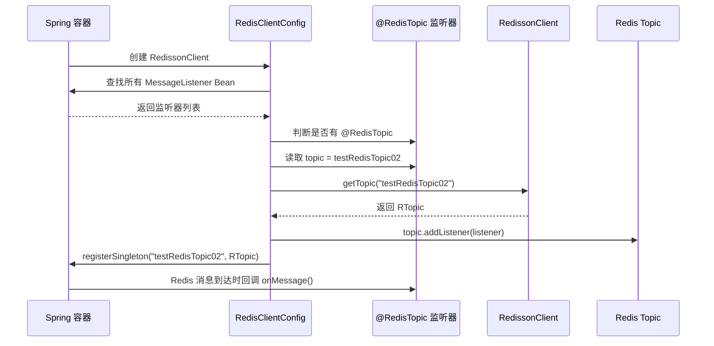

[xfg原文](https://bugstack.cn/md/road-map/redis.html#_5-%E5%8F%91%E5%B8%83-%E8%AE%A2%E9%98%85)
## 结论

`@RedisTopic`是原文自己定义的**业务标识注解**。

它的作用可以概括为一句话：

> **标记某个 Spring Bean 是一个 Redis Pub/Sub 监听器，并声明它要监听哪个 Redis Topic。**

原文里先展示了 Redisson 手动订阅 Topic 的写法：先 `redisson.getTopic("myTopic")`，再 `topic.addListener(...)`。作者认为每个监听器都手动写这些代码比较麻烦，所以设计了 `@RedisTopic`，让系统启动时自动扫描监听器、自动注册监听关系、自动把 `RTopic` 注册进 Spring 容器。([Bugstack](https://origin.bugstack.cn/md/road-map/redis.html "Redis | 小傅哥 bugstack 虫洞栈"))

---

# 1. `@RedisTopic` 本身长什么样

原文里的注解很简单：([Bugstack](https://origin.bugstack.cn/md/road-map/redis.html "Redis | 小傅哥 bugstack 虫洞栈"))

```java
@Retention(RetentionPolicy.RUNTIME)
@Target({ElementType.TYPE})
@Documented
public @interface RedisTopic {

    String topic() default "";

}
```

逐行解释：

|注解|作用|
|---|---|
|`@Retention(RetentionPolicy.RUNTIME)`|注解运行时还存在，程序启动后可以通过反射读取|
|`@Target(ElementType.TYPE)`|只能标在类、接口、枚举上|
|`@Documented`|生成 JavaDoc 时保留|
|`String topic()`|声明这个监听器监听哪个 Redis Topic|

所以它不是直接完成订阅，而是提供**元数据**：

```java
@RedisTopic(topic = "testRedisTopic02")
```

这句话的意思是：

> 当前类要监听 Redis 里的 `testRedisTopic02` 这个 Topic。

---

# 2. 它怎么使用

原文里的监听器大概是这样：([Bugstack](https://origin.bugstack.cn/md/road-map/redis.html "Redis | 小傅哥 bugstack 虫洞栈"))

```java
@Slf4j
@Service
@RedisTopic(topic = "testRedisTopic02")
public class RedisTopicListener02 implements MessageListener<String> {

    @Override
    public void onMessage(CharSequence channel, String msg) {
        log.info("02-监听消息(Redis 发布/订阅): {}", msg);
    }

}
```

这里有三个关键点：

```java
@Service
```

把这个监听器交给 Spring 管理。

```java
implements MessageListener<String>
```

说明它是 Redisson 的消息监听器。

```java
@RedisTopic(topic = "testRedisTopic02")
```

声明它要监听 `testRedisTopic02`。

也就是说，这个类本质上是：

> 一个 Spring Bean + 一个 Redisson 消息监听器 + 一个 Topic 声明。

---

# 3. 真正起作用的是后面的“扫描 + 注册”逻辑

`@RedisTopic` 自己不会自动生效。真正让它生效的是配置类里的这段逻辑：([Bugstack](https://origin.bugstack.cn/md/road-map/redis.html "Redis | 小傅哥 bugstack 虫洞栈"))

```java
// 添加监听
String[] beanNamesForType = applicationContext.getBeanNamesForType(MessageListener.class);

for (String beanName : beanNamesForType) {
    MessageListener bean = applicationContext.getBean(beanName, MessageListener.class);
    Class<?> beanClass = bean.getClass();

    if (beanClass.isAnnotationPresent(RedisTopic.class)) {
        RedisTopic redisTopic = beanClass.getAnnotation(RedisTopic.class);

        RTopic topic = redissonClient.getTopic(redisTopic.topic());
        topic.addListener(String.class, bean);

        // 动态创建 bean 对象，注入到 spring 容器，bean 的名称为 redisTopic.topic()
        ConfigurableListableBeanFactory beanFactory = applicationContext.getBeanFactory();
        beanFactory.registerSingleton(redisTopic.topic(), topic);
    }
}
```

它做了几件事：

## 第一步：找出所有 `MessageListener`

```java
applicationContext.getBeanNamesForType(MessageListener.class);
```

意思是：

> 从 Spring 容器里找所有实现了 `MessageListener` 接口的 Bean。

比如：

```java
RedisTopicListener02
RedisTopicListener03
```

都会被找出来。

---

## 第二步：判断这个监听器类上有没有 `@RedisTopic`

```java
if (beanClass.isAnnotationPresent(RedisTopic.class)) {
```

如果有，说明这个类需要被绑定到 Redis Topic。

---

## 第三步：读取注解里的 Topic 名称

```java
RedisTopic redisTopic = beanClass.getAnnotation(RedisTopic.class);
String topicName = redisTopic.topic();
```

例如读取到：

```java
testRedisTopic02
```

---

## 第四步：通过 Redisson 获取 `RTopic`

```java
RTopic topic = redissonClient.getTopic(redisTopic.topic());
```

这相当于拿到了 Redis Pub/Sub 里的一个频道对象。

---

## 第五步：把当前监听器绑定到这个 Topic

```java
topic.addListener(String.class, bean);
```

这一步才是真正的订阅动作。

之后只要有人往 `testRedisTopic02` 发布消息，这个监听器的：

```java
onMessage(CharSequence channel, String msg)
```

就会被回调。

---

## 第六步：把 `RTopic` 动态注册成 Spring Bean

```java
beanFactory.registerSingleton(redisTopic.topic(), topic);
```

这一步比较“高级编码”。

它的意思是：

> 把 `RTopic` 对象注册进 Spring 容器，Bean 名称就是 Topic 名称。

比如：

```java
redisTopic.topic() = "testRedisTopic02"
```

那么 Spring 容器里就会多一个 Bean：

```java
beanName = "testRedisTopic02"
beanType = RTopic
```

所以后面就可以这样注入：([Bugstack](https://origin.bugstack.cn/md/road-map/redis.html "Redis | 小傅哥 bugstack 虫洞栈"))

```java
@Resource(name = "testRedisTopic02")
private RTopic testRedisTopic02;
```

然后发布消息：

```java
testRedisTopic02.publish(JSON.toJSONString(orderEntity));
```

原文也明确说，`testRedisTopic02`、`testRedisTopic03` 是通过自定义注解动态创建的 Bean，之后可以用 `publish` 发布消息，并被监听器接收。([Bugstack](https://origin.bugstack.cn/md/road-map/redis.html "Redis | 小傅哥 bugstack 虫洞栈"))

---

# 4. 整体流程图



---

# 5. 自己实现一个更清晰的版本

下面给一个更适合学习的简化实现。

## 5.1 定义注解

```java
package com.example.redis.annotation;

import java.lang.annotation.*;

/**
 * 标记一个类是 Redis Topic 消息监听器。
 * topic 表示要监听的 Redis Pub/Sub 频道名称。
 */
@Target(ElementType.TYPE)
@Retention(RetentionPolicy.RUNTIME)
@Documented
public @interface RedisTopic {

    /**
     * Redis Topic 名称，例如 order-created-topic。
     */
    String value();
}
```

这里我更推荐用 `value()`，这样使用时可以写得更简洁：

```java
@RedisTopic("order-created-topic")
```

---

## 5.2 定义监听器

```java
package com.example.redis.listener;

import com.example.redis.annotation.RedisTopic;
import lombok.extern.slf4j.Slf4j;
import org.redisson.api.listener.MessageListener;
import org.springframework.stereotype.Component;

/**
 * 订单创建消息监听器。
 * 当 Redis 中 order-created-topic 收到消息时，会触发 onMessage。
 */
@Slf4j
@Component
@RedisTopic("order-created-topic")
public class OrderCreatedListener implements MessageListener<String> {

    @Override
    public void onMessage(CharSequence channel, String message) {
        // channel 是 Redis Topic 名称
        // message 是发布方发送的消息内容
        log.info("收到订单创建消息, channel={}, message={}", channel, message);
    }
}
```

---

## 5.3 启动时扫描并注册监听器

```java
package com.example.redis.config;

import com.example.redis.annotation.RedisTopic;
import lombok.RequiredArgsConstructor;
import org.redisson.api.RTopic;
import org.redisson.api.RedissonClient;
import org.redisson.api.listener.MessageListener;
import org.springframework.aop.support.AopUtils;
import org.springframework.beans.factory.SmartInitializingSingleton;
import org.springframework.beans.factory.config.ConfigurableListableBeanFactory;
import org.springframework.context.ApplicationContext;
import org.springframework.core.annotation.AnnotationUtils;
import org.springframework.stereotype.Component;

import java.util.Map;

/**
 * Redis Topic 自动注册器。
 *
 * 作用：
 * 1. 找到所有 MessageListener 类型的 Spring Bean。
 * 2. 判断类上是否标注了 @RedisTopic。
 * 3. 根据注解里的 topic 名称创建 RTopic。
 * 4. 把监听器绑定到 RTopic。
 * 5. 把 RTopic 注册到 Spring 容器，方便其他地方注入后 publish。
 */
@Component
@RequiredArgsConstructor
public class RedisTopicRegistrar implements SmartInitializingSingleton {

    private final ApplicationContext applicationContext;
    private final RedissonClient redissonClient;
    private final ConfigurableListableBeanFactory beanFactory;

    @Override
    public void afterSingletonsInstantiated() {
        // 获取所有实现了 MessageListener 接口的 Bean
        Map<String, MessageListener> listenerMap =
                applicationContext.getBeansOfType(MessageListener.class);

        for (MessageListener<?> listener : listenerMap.values()) {
            // 注意：Spring Bean 可能是代理对象，所以这里拿目标类更稳
            Class<?> targetClass = AopUtils.getTargetClass(listener);

            // 读取类上的 @RedisTopic 注解
            RedisTopic redisTopic = AnnotationUtils.findAnnotation(targetClass, RedisTopic.class);
            if (redisTopic == null) {
                continue;
            }

            String topicName = redisTopic.value();
            if (topicName == null || topicName.isBlank()) {
                throw new IllegalArgumentException("@RedisTopic value must not be blank: " + targetClass.getName());
            }

            // 获取 Redisson 的 Topic 对象
            RTopic topic = redissonClient.getTopic(topicName);

            // 注册消息监听器
            topic.addListener(String.class, (MessageListener<String>) listener);

            // 把 RTopic 注册到 Spring 容器，方便业务代码按名称注入
            if (!beanFactory.containsSingleton(topicName)) {
                beanFactory.registerSingleton(topicName, topic);
            }
        }
    }
}
```

这个版本比原文更稳一点，主要是用了：

```java
AopUtils.getTargetClass(listener)
AnnotationUtils.findAnnotation(...)
```

原因是 Spring 里 Bean 可能被 AOP 代理。直接用：

```java
bean.getClass().isAnnotationPresent(...)
```

有时拿到的是代理类，不一定能读到原始类上的注解。

---

## 5.4 发布消息

```java
package com.example.redis.service;

import lombok.RequiredArgsConstructor;
import org.redisson.api.RTopic;
import org.springframework.stereotype.Service;

@Service
@RequiredArgsConstructor
public class OrderEventPublisher {

    /**
     * 这里的 Bean 名称来自 @RedisTopic("order-created-topic")。
     * RedisTopicRegistrar 会把 RTopic 注册成这个名字的 Spring Bean。
     */
    private final RTopic orderCreatedTopic;

    public void publishOrderCreated(String orderId) {
        // 真实项目里通常发布 JSON 字符串
        orderCreatedTopic.publish("{\"orderId\":\"" + orderId + "\"}");
    }
}
```

不过这个写法有个细节：如果 Bean 名是 `order-created-topic`，字段名不能直接匹配。实际更稳的是：

```java
@Resource(name = "order-created-topic")
private RTopic orderCreatedTopic;
```

---

# 6. 这个注解解决了什么问题

原始写法每个 Topic 都要手动写：

```java
RTopic topic = redissonClient.getTopic("xxx");
topic.addListener(String.class, listener);
```

用了 `@RedisTopic` 后，变成：

```java
@Component
@RedisTopic("order-created-topic")
public class OrderCreatedListener implements MessageListener<String> {
    ...
}
```

好处是：

|问题|用注解后的效果|
|---|---|
|监听器和 Topic 关系分散|直接写在监听器类上|
|每个监听器都要手动注册|启动时统一扫描注册|
|发布方拿不到 `RTopic` Bean|动态注册进 Spring 容器|
|新增 Topic 麻烦|新增一个监听类 + 注解即可|

---

# 7. 但这个设计也有边界

这个案例适合学习 Spring 动态 Bean 注册和 Redis Pub/Sub，但生产上要注意：

1. **Redis Pub/Sub 不持久化消息**  
    订阅者不在线时，消息会丢。核心业务链路不要直接依赖 Pub/Sub。
    
2. **Topic 名称最好集中管理**  
    不建议大量字符串散落在注解里。可以抽常量：
    
    ```java
    public interface RedisTopics {
        String ORDER_CREATED = "order-created-topic";
    }
    ```
    
3. **监听器异常要处理**  
    `onMessage` 里不要让异常直接扩散，应该捕获、记录、必要时补偿。
    
4. **动态注册 Bean 要谨慎**  
    `registerSingleton` 是高级用法，适合框架/中间件封装。普通业务代码不建议滥用。
    

---

## 最后一句话

`@RedisTopic` 的本质不是“Redis 功能”，而是一个**Spring 扫描标记**：

> 它把“哪个类监听哪个 Redis Topic”这件事声明出来，然后由启动配置类读取注解，自动完成 `RTopic` 创建、监听器绑定、Spring Bean 动态注册。

这个案例的真正学习点有两个：

1. **Redis Pub/Sub 的订阅模型**
    
2. **Spring 启动期扫描注解并动态注册 Bean 的套路**
    

这类套路以后在写自定义中间件、Starter、框架扩展时很常见。