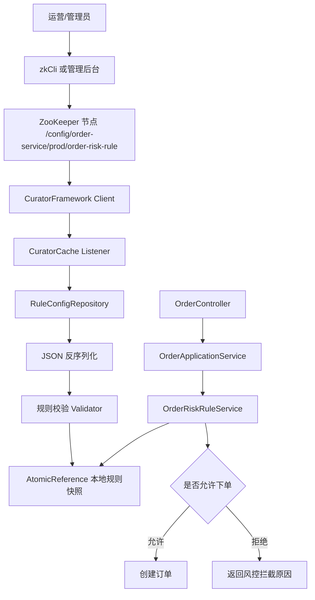
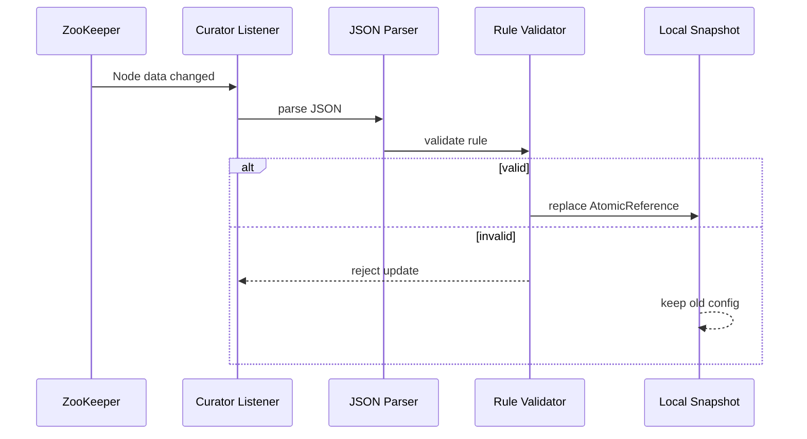
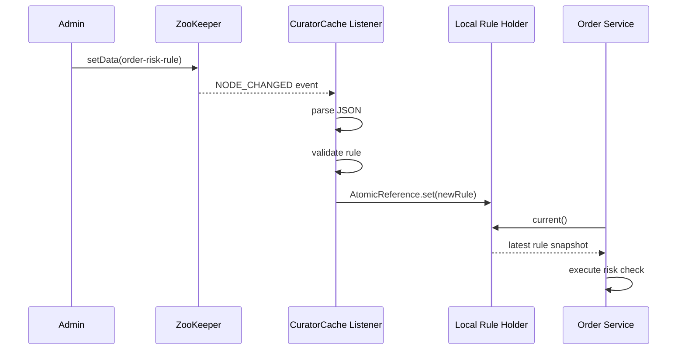
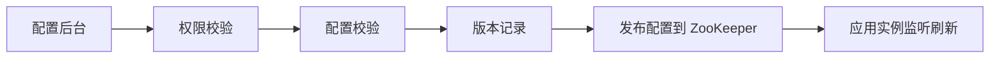

[xfg基础版](https://bugstack.cn/md/road-map/zookeeper.html)
# 结论先行
本案例的目标是

> 用 ZooKeeper 保存订单风控、限额、灰度、限流等业务规则；应用启动时加载配置到本地内存快照；ZooKeeper 节点变更后，通过 Curator 监听机制实时刷新本地配置；业务代码只读取本地不可变快照，不直接访问 ZooKeeper。

这样更接近企业实践：**ZooKeeper 负责分布式一致性与变更通知，业务系统负责本地缓存、配置校验、降级兜底和规则执行**。

小傅哥原文的重点是用一个简洁案例讲清 ZooKeeper 配置中心入门：通过监听节点变化，动态修改 Java 属性值。这个思路适合入门，原文也明确强调“基于 Zookeeper 开发一个简单的配置中心功能内核”。([BugStack](https://bugstack.cn/md/road-map/zookeeper.html "Zookeeper | 小傅哥 bugstack 虫洞栈"))  
但如果作为企业级 Java 后端教学案例，我会把重点升级为：**配置模型、版本、校验、本地快照、监听刷新、业务规则执行、测试可控性**。

Apache Curator 是 Java/JVM 操作 ZooKeeper 的高级客户端库，官方说明它提供了更高层 API、工具和常见 recipes，用于让 ZooKeeper 使用更可靠、更容易。([Apache Curator](https://curator.apache.org/docs/about/ "Welcome to Apache Curator | Apache Curator")) 本案例会使用 Curator，但不会把 ZooKeeper 原理完全隐藏掉。

---

# 1. 案例选型说明

## 1.1 业务场景：订单风控动态规则中心

设计一个接近真实业务的场景：

> 电商订单服务在用户下单前，需要根据动态规则判断是否允许下单。

规则包括：

|规则|示例|是否适合动态配置|
|---|--:|---|
|风控总开关|`riskEnabled=true`|适合|
|单用户每日最大下单金额|`dailyAmountLimit=5000`|适合|
|单用户每日最大下单次数|`dailyOrderCountLimit=10`|适合|
|新风控策略灰度比例|`grayPercent=20`|适合|
|下单接口限流阈值|`rateLimitQps=100`|适合|
|规则版本|`version=20260516-001`|必须有|

这个场景比“动态修改某个字符串字段”更有教学价值，因为它会自然引出：

- 配置中心不是简单的 `key-value`；
    
- 配置必须有结构、有版本、有校验；
    
- 应用不能每次业务请求都访问 ZooKeeper；
    
- ZooKeeper 监听到变更后，要刷新本地快照；
    
- 配置变更失败时，必须保留旧配置；
    
- 业务代码只关心规则结果，不关心 ZooKeeper。
    

---

# 2. 架构设计

## 2.1 整体架构



## 2.2 分层设计

|层|职责|
|---|---|
|`interfaces`|HTTP 接口，模拟下单请求|
|`application`|编排下单流程|
|`domain`|订单风控规则判断|
|`infrastructure.zk`|ZooKeeper 连接、节点初始化、监听刷新|
|`infrastructure.config`|动态配置快照、本地缓存、校验|
|`common`|异常、响应对象、工具类|

## 2.3 核心设计原则

### 原则一：业务请求不直接访问 ZooKeeper

错误做法：

```java
// 每次下单都去 ZooKeeper getData，性能差，且 ZooKeeper 抖动会影响核心链路
client.getData().forPath(path);
```

正确做法：

```java
// 业务只读取本地内存快照
OrderRiskRule rule = ruleHolder.current();
```

### 原则二：配置更新采用“校验通过才替换”



### 原则三：配置对象不可变

用 Java `record` 表达配置，避免运行时被业务代码误修改。

---

# 3. ZooKeeper 节点路径设计

## 3.1 路径规范

```text
/config/{appName}/{env}/{configName}
```

本案例：

```text
/config/order-service/prod/order-risk-rule
```

## 3.2 为什么这样设计

|路径段|示例|作用|
|---|---|---|
|`/config`|固定根路径|区分配置类数据|
|`order-service`|应用名|多应用隔离|
|`prod`|环境|dev/test/staging/prod 隔离|
|`order-risk-rule`|配置名|具体业务规则|

## 3.3 节点值示例

```json
{
  "version": "20260516-001",
  "riskEnabled": true,
  "dailyAmountLimit": 5000,
  "dailyOrderCountLimit": 10,
  "grayPercent": 30,
  "rateLimitQps": 100,
  "remark": "prod order risk rule"
}
```

## 3.4 节点类型

本案例使用**持久节点**。

原因：

- 配置不能因为客户端断开而丢失；
    
- 配置属于系统状态，不属于某个临时实例；
    
- 服务重启后仍然需要读取最新配置。
    

---

# 4. 配置数据结构设计

核心配置对象：

```java
package com.example.zkconfig.domain.rule;

import java.math.BigDecimal;

public record OrderRiskRule(
        String version,
        boolean riskEnabled,
        BigDecimal dailyAmountLimit,
        int dailyOrderCountLimit,
        int grayPercent,
        int rateLimitQps,
        String remark
) {
}
```

## 字段说明

|字段|类型|说明|
|---|---|---|
|`version`|String|配置版本，便于排查|
|`riskEnabled`|boolean|风控总开关|
|`dailyAmountLimit`|BigDecimal|单用户每日金额上限|
|`dailyOrderCountLimit`|int|单用户每日下单次数上限|
|`grayPercent`|int|新规则灰度比例，0-100|
|`rateLimitQps`|int|下单接口限流阈值|
|`remark`|String|备注|

---

# 5. Maven 依赖

## `pom.xml`

```xml
<project xmlns="http://maven.apache.org/POM/4.0.0"
         xmlns:xsi="http://www.w3.org/2001/XMLSchema-instance"
         xsi:schemaLocation="
           http://maven.apache.org/POM/4.0.0
           https://maven.apache.org/xsd/maven-4.0.0.xsd">

    <modelVersion>4.0.0</modelVersion>

    <groupId>com.example</groupId>
    <artifactId>zk-dynamic-rule-center</artifactId>
    <version>1.0.0</version>

    <properties>
        <java.version>17</java.version>
        <spring.boot.version>3.3.5</spring.boot.version>
        <curator.version>5.7.1</curator.version>
        <testcontainers.version>1.20.3</testcontainers.version>
    </properties>

    <dependencyManagement>
        <dependencies>
            <dependency>
                <groupId>org.springframework.boot</groupId>
                <artifactId>spring-boot-dependencies</artifactId>
                <version>${spring.boot.version}</version>
                <type>pom</type>
                <scope>import</scope>
            </dependency>

            <dependency>
                <groupId>org.testcontainers</groupId>
                <artifactId>testcontainers-bom</artifactId>
                <version>${testcontainers.version}</version>
                <type>pom</type>
                <scope>import</scope>
            </dependency>
        </dependencies>
    </dependencyManagement>

    <dependencies>
        <!-- Web API -->
        <dependency>
            <groupId>org.springframework.boot</groupId>
            <artifactId>spring-boot-starter-web</artifactId>
        </dependency>

        <!-- 参数校验 -->
        <dependency>
            <groupId>org.springframework.boot</groupId>
            <artifactId>spring-boot-starter-validation</artifactId>
        </dependency>

        <!-- Curator recipes 已经会拉取 curator-framework/client 等依赖。
             官方文档也说明 curator-recipes 对大多数用户已经足够。 -->
        <dependency>
            <groupId>org.apache.curator</groupId>
            <artifactId>curator-recipes</artifactId>
            <version>${curator.version}</version>
        </dependency>

        <!-- JSON -->
        <dependency>
            <groupId>com.fasterxml.jackson.core</groupId>
            <artifactId>jackson-databind</artifactId>
        </dependency>

        <!-- Test -->
        <dependency>
            <groupId>org.springframework.boot</groupId>
            <artifactId>spring-boot-starter-test</artifactId>
            <scope>test</scope>
        </dependency>

        <!-- 可选：集成测试用 ZooKeeper 容器 -->
        <dependency>
            <groupId>org.testcontainers</groupId>
            <artifactId>zookeeper</artifactId>
            <scope>test</scope>
        </dependency>
    </dependencies>

    <build>
        <plugins>
            <!-- Spring Boot 打包插件 -->
            <plugin>
                <groupId>org.springframework.boot</groupId>
                <artifactId>spring-boot-maven-plugin</artifactId>
                <version>${spring.boot.version}</version>
            </plugin>

            <!-- Java 17 编译配置 -->
            <plugin>
                <groupId>org.apache.maven.plugins</groupId>
                <artifactId>maven-compiler-plugin</artifactId>
                <version>3.13.0</version>
                <configuration>
                    <release>${java.version}</release>
                </configuration>
            </plugin>
        </plugins>
    </build>
</project>
```

---

# 6. 项目目录结构

```text
zk-dynamic-rule-center
├── pom.xml
├── docker-compose.yml
├── README.md
└── src
    ├── main
    │   ├── java
    │   │   └── com/example/zkconfig
    │   │       ├── ZkDynamicRuleCenterApplication.java
    │   │       ├── common
    │   │       │   ├── ApiResponse.java
    │   │       │   └── BizException.java
    │   │       ├── interfaces
    │   │       │   ├── OrderController.java
    │   │       │   ├── ConfigAdminController.java
    │   │       │   └── dto
    │   │       │       ├── CreateOrderRequest.java
    │   │       │       └── CreateOrderResponse.java
    │   │       ├── application
    │   │       │   └── OrderApplicationService.java
    │   │       ├── domain
    │   │       │   ├── order
    │   │       │   │   └── Order.java
    │   │       │   └── rule
    │   │       │       ├── OrderRiskRule.java
    │   │       │       ├── OrderRiskRuleDecision.java
    │   │       │       └── OrderRiskRuleService.java
    │   │       └── infrastructure
    │   │           ├── config
    │   │           │   ├── DynamicRuleProperties.java
    │   │           │   ├── OrderRiskRuleHolder.java
    │   │           │   ├── OrderRiskRuleParser.java
    │   │           │   └── OrderRiskRuleValidator.java
    │   │           └── zk
    │   │               ├── ZookeeperProperties.java
    │   │               ├── ZookeeperClientConfig.java
    │   │               ├── ZookeeperConfigRepository.java
    │   │               └── ZookeeperRuleChangeListener.java
    │   └── resources
    │       └── application.yml
    └── test
        └── java
            └── com/example/zkconfig
                ├── domain/rule/OrderRiskRuleServiceTest.java
                └── infrastructure/zk/ZookeeperConfigRepositoryTest.java
```

---

# 7. 核心代码

## 7.1 启动类

```java
package com.example.zkconfig;

import com.example.zkconfig.infrastructure.config.DynamicRuleProperties;
import com.example.zkconfig.infrastructure.zk.ZookeeperProperties;
import org.springframework.boot.SpringApplication;
import org.springframework.boot.autoconfigure.SpringBootApplication;
import org.springframework.boot.context.properties.EnableConfigurationProperties;

@SpringBootApplication
@EnableConfigurationProperties({
        ZookeeperProperties.class,
        DynamicRuleProperties.class
})
public class ZkDynamicRuleCenterApplication {

    public static void main(String[] args) {
        SpringApplication.run(ZkDynamicRuleCenterApplication.class, args);
    }
}
```

---

## 7.2 配置文件

### `application.yml`

```yaml
server:
  port: 8080

spring:
  application:
    name: order-service

zookeeper:
  connect-string: localhost:2181
  session-timeout-ms: 30000
  connection-timeout-ms: 10000
  base-sleep-time-ms: 1000
  max-retries: 3

dynamic-rule:
  app-name: order-service
  env: prod
  config-name: order-risk-rule
  init-if-missing: true
```

---

## 7.3 Docker Compose

### `docker-compose.yml`

```yaml
services:
  zookeeper:
    image: zookeeper:3.9
    container_name: zk-dynamic-rule-center
    ports:
      - "2181:2181"
    environment:
      ZOO_4LW_COMMANDS_WHITELIST: "ruok,stat,mntr,conf"
```

---

## 7.4 ZooKeeper 配置属性

```java
package com.example.zkconfig.infrastructure.zk;

import org.springframework.boot.context.properties.ConfigurationProperties;

@ConfigurationProperties(prefix = "zookeeper")
public record ZookeeperProperties(
        String connectString,
        int sessionTimeoutMs,
        int connectionTimeoutMs,
        int baseSleepTimeMs,
        int maxRetries
) {
}
```

---

## 7.5 动态规则配置属性

```java
package com.example.zkconfig.infrastructure.config;

import org.springframework.boot.context.properties.ConfigurationProperties;

@ConfigurationProperties(prefix = "dynamic-rule")
public record DynamicRuleProperties(
        String appName,
        String env,
        String configName,
        boolean initIfMissing
) {
    public String zkPath() {
        return "/config/%s/%s/%s".formatted(appName, env, configName);
    }
}
```

---

## 7.6 Curator 客户端配置

```java
package com.example.zkconfig.infrastructure.zk;

import org.apache.curator.RetryPolicy;
import org.apache.curator.framework.CuratorFramework;
import org.apache.curator.framework.CuratorFrameworkFactory;
import org.apache.curator.retry.ExponentialBackoffRetry;
import org.springframework.context.annotation.Bean;
import org.springframework.context.annotation.Configuration;

@Configuration
public class ZookeeperClientConfig {

    @Bean(destroyMethod = "close")
    public CuratorFramework curatorFramework(ZookeeperProperties properties) {
        RetryPolicy retryPolicy = new ExponentialBackoffRetry(
                properties.baseSleepTimeMs(),
                properties.maxRetries()
        );

        CuratorFramework client = CuratorFrameworkFactory.builder()
                .connectString(properties.connectString())
                .sessionTimeoutMs(properties.sessionTimeoutMs())
                .connectionTimeoutMs(properties.connectionTimeoutMs())
                .retryPolicy(retryPolicy)
                .build();

        client.start();
        return client;
    }
}
```

说明：

- `CuratorFramework` 是应用访问 ZooKeeper 的统一客户端。
    
- `ExponentialBackoffRetry` 用于处理短暂网络抖动。
    
- `destroyMethod = "close"` 保证 Spring 容器关闭时释放连接。
    

---

## 7.7 业务规则配置对象

```java
package com.example.zkconfig.domain.rule;

import java.math.BigDecimal;

public record OrderRiskRule(
        String version,
        boolean riskEnabled,
        BigDecimal dailyAmountLimit,
        int dailyOrderCountLimit,
        int grayPercent,
        int rateLimitQps,
        String remark
) {
    public static OrderRiskRule defaultRule() {
        return new OrderRiskRule(
                "default-001",
                true,
                new BigDecimal("5000"),
                10,
                0,
                100,
                "default local rule"
        );
    }
}
```

---

## 7.8 规则校验器

```java
package com.example.zkconfig.infrastructure.config;

import com.example.zkconfig.domain.rule.OrderRiskRule;
import org.springframework.stereotype.Component;
import org.springframework.util.StringUtils;

import java.math.BigDecimal;

@Component
public class OrderRiskRuleValidator {

    public void validate(OrderRiskRule rule) {
        if (rule == null) {
            throw new IllegalArgumentException("order risk rule must not be null");
        }

        if (!StringUtils.hasText(rule.version())) {
            throw new IllegalArgumentException("rule version must not be blank");
        }

        if (rule.dailyAmountLimit() == null ||
                rule.dailyAmountLimit().compareTo(BigDecimal.ZERO) < 0) {
            throw new IllegalArgumentException("dailyAmountLimit must be >= 0");
        }

        if (rule.dailyOrderCountLimit() < 0) {
            throw new IllegalArgumentException("dailyOrderCountLimit must be >= 0");
        }

        if (rule.grayPercent() < 0 || rule.grayPercent() > 100) {
            throw new IllegalArgumentException("grayPercent must be between 0 and 100");
        }

        if (rule.rateLimitQps() <= 0) {
            throw new IllegalArgumentException("rateLimitQps must be > 0");
        }
    }
}
```

---

## 7.9 JSON 解析器

```java
package com.example.zkconfig.infrastructure.config;

import com.example.zkconfig.domain.rule.OrderRiskRule;
import com.fasterxml.jackson.core.JsonProcessingException;
import com.fasterxml.jackson.databind.ObjectMapper;
import org.springframework.stereotype.Component;

@Component
public class OrderRiskRuleParser {

    private final ObjectMapper objectMapper;

    public OrderRiskRuleParser(ObjectMapper objectMapper) {
        this.objectMapper = objectMapper;
    }

    public OrderRiskRule parse(String json) {
        try {
            return objectMapper.readValue(json, OrderRiskRule.class);
        } catch (JsonProcessingException e) {
            throw new IllegalArgumentException("invalid order risk rule json: " + e.getMessage(), e);
        }
    }

    public String toJson(OrderRiskRule rule) {
        try {
            return objectMapper.writerWithDefaultPrettyPrinter().writeValueAsString(rule);
        } catch (JsonProcessingException e) {
            throw new IllegalArgumentException("serialize order risk rule failed", e);
        }
    }
}
```

---

## 7.10 本地规则快照 Holder

```java
package com.example.zkconfig.infrastructure.config;

import com.example.zkconfig.domain.rule.OrderRiskRule;
import org.springframework.stereotype.Component;

import java.util.concurrent.atomic.AtomicReference;

@Component
public class OrderRiskRuleHolder {

    private final AtomicReference<OrderRiskRule> currentRule =
            new AtomicReference<>(OrderRiskRule.defaultRule());

    public OrderRiskRule current() {
        return currentRule.get();
    }

    public void update(OrderRiskRule newRule) {
        currentRule.set(newRule);
    }
}
```

为什么用 `AtomicReference`？

- 配置对象整体替换，避免半更新；
    
- 读操作无锁；
    
- 业务线程读取到的一定是某个完整版本的规则。
    

---

## 7.11 ZooKeeper 配置仓储

```java
package com.example.zkconfig.infrastructure.zk;

import com.example.zkconfig.domain.rule.OrderRiskRule;
import com.example.zkconfig.infrastructure.config.DynamicRuleProperties;
import com.example.zkconfig.infrastructure.config.OrderRiskRuleParser;
import com.example.zkconfig.infrastructure.config.OrderRiskRuleValidator;
import org.apache.curator.framework.CuratorFramework;
import org.apache.zookeeper.CreateMode;
import org.springframework.stereotype.Repository;

import java.nio.charset.StandardCharsets;

@Repository
public class ZookeeperConfigRepository {

    private final CuratorFramework client;
    private final DynamicRuleProperties ruleProperties;
    private final OrderRiskRuleParser parser;
    private final OrderRiskRuleValidator validator;

    public ZookeeperConfigRepository(
            CuratorFramework client,
            DynamicRuleProperties ruleProperties,
            OrderRiskRuleParser parser,
            OrderRiskRuleValidator validator
    ) {
        this.client = client;
        this.ruleProperties = ruleProperties;
        this.parser = parser;
        this.validator = validator;
    }

    public String path() {
        return ruleProperties.zkPath();
    }

    public void initIfMissing() throws Exception {
        String path = path();

        if (client.checkExists().forPath(path) != null) {
            return;
        }

        if (!ruleProperties.initIfMissing()) {
            throw new IllegalStateException("zk config node not exists: " + path);
        }

        OrderRiskRule defaultRule = OrderRiskRule.defaultRule();
        validator.validate(defaultRule);

        String json = parser.toJson(defaultRule);

        client.create()
                .creatingParentsIfNeeded()
                .withMode(CreateMode.PERSISTENT)
                .forPath(path, json.getBytes(StandardCharsets.UTF_8));
    }

    public OrderRiskRule load() throws Exception {
        byte[] bytes = client.getData().forPath(path());
        String json = new String(bytes, StandardCharsets.UTF_8);
        OrderRiskRule rule = parser.parse(json);
        validator.validate(rule);
        return rule;
    }

    public void update(OrderRiskRule rule) throws Exception {
        validator.validate(rule);
        String json = parser.toJson(rule);

        client.setData()
                .forPath(path(), json.getBytes(StandardCharsets.UTF_8));
    }
}
```

这里保留了 ZooKeeper 的核心操作：

- `checkExists`
    
- `create`
    
- `getData`
    
- `setData`
    
- 节点路径
    
- 节点数据
    
- 持久节点
    

这比完全依赖配置框架更适合学习 ZooKeeper 原理。

---

## 7.12 ZooKeeper 监听器

```java
package com.example.zkconfig.infrastructure.zk;

import com.example.zkconfig.domain.rule.OrderRiskRule;
import com.example.zkconfig.infrastructure.config.OrderRiskRuleHolder;
import com.example.zkconfig.infrastructure.config.OrderRiskRuleParser;
import com.example.zkconfig.infrastructure.config.OrderRiskRuleValidator;
import jakarta.annotation.PostConstruct;
import jakarta.annotation.PreDestroy;
import org.apache.curator.framework.CuratorFramework;
import org.apache.curator.framework.recipes.cache.CuratorCache;
import org.slf4j.Logger;
import org.slf4j.LoggerFactory;
import org.springframework.stereotype.Component;

import java.nio.charset.StandardCharsets;

@Component
public class ZookeeperRuleChangeListener {

    private static final Logger log = LoggerFactory.getLogger(ZookeeperRuleChangeListener.class);

    private final CuratorFramework client;
    private final ZookeeperConfigRepository repository;
    private final OrderRiskRuleHolder holder;
    private final OrderRiskRuleParser parser;
    private final OrderRiskRuleValidator validator;

    private CuratorCache curatorCache;

    public ZookeeperRuleChangeListener(
            CuratorFramework client,
            ZookeeperConfigRepository repository,
            OrderRiskRuleHolder holder,
            OrderRiskRuleParser parser,
            OrderRiskRuleValidator validator
    ) {
        this.client = client;
        this.repository = repository;
        this.holder = holder;
        this.parser = parser;
        this.validator = validator;
    }

    @PostConstruct
    public void start() throws Exception {
        repository.initIfMissing();

        OrderRiskRule initialRule = repository.load();
        holder.update(initialRule);
        log.info("loaded initial order risk rule, version={}", initialRule.version());

        String path = repository.path();

        this.curatorCache = CuratorCache.build(client, path);

        this.curatorCache.listenable().addListener((type, oldData, data) -> {
            if (data == null || data.getData() == null) {
                log.warn("received empty zk config event, type={}, path={}", type, path);
                return;
            }

            try {
                String json = new String(data.getData(), StandardCharsets.UTF_8);
                OrderRiskRule newRule = parser.parse(json);
                validator.validate(newRule);

                holder.update(newRule);

                log.info("order risk rule refreshed from zk, eventType={}, version={}",
                        type, newRule.version());

            } catch (Exception e) {
                log.error("refresh order risk rule failed, keep old rule. path={}", path, e);
            }
        });

        this.curatorCache.start();
        log.info("started zk rule listener, path={}", path);
    }

    @PreDestroy
    public void stop() {
        if (curatorCache != null) {
            curatorCache.close();
        }
    }
}
```

这里使用了 Curator 的缓存监听能力。Curator 官方文档说明，它是 ZooKeeper 的 Java/JVM 高级客户端，并提供高级 API 与常见工具；`curator-recipes` 也被官方文档列为多数用户常用的 artifact。([Apache Curator](https://curator.apache.org/docs/about/ "Welcome to Apache Curator | Apache Curator"))

---

## 7.13 下单请求对象

```java
package com.example.zkconfig.interfaces.dto;

import jakarta.validation.constraints.DecimalMin;
import jakarta.validation.constraints.Min;
import jakarta.validation.constraints.NotBlank;

import java.math.BigDecimal;

public record CreateOrderRequest(
        @NotBlank(message = "userId must not be blank")
        String userId,

        @DecimalMin(value = "0.01", message = "amount must be greater than 0")
        BigDecimal amount,

        @Min(value = 0, message = "todayOrderCount must be >= 0")
        int todayOrderCount,

        @DecimalMin(value = "0.00", message = "todayOrderAmount must be >= 0")
        BigDecimal todayOrderAmount
) {
}
```

---

## 7.14 下单响应对象

```java
package com.example.zkconfig.interfaces.dto;

public record CreateOrderResponse(
        boolean success,
        String orderId,
        String message,
        String ruleVersion
) {
}
```

---

## 7.15 订单领域对象

```java
package com.example.zkconfig.domain.order;

import java.math.BigDecimal;
import java.time.LocalDateTime;
import java.util.UUID;

public record Order(
        String orderId,
        String userId,
        BigDecimal amount,
        LocalDateTime createdAt
) {
    public static Order create(String userId, BigDecimal amount) {
        return new Order(
                UUID.randomUUID().toString(),
                userId,
                amount,
                LocalDateTime.now()
        );
    }
}
```

---

## 7.16 风控决策对象

```java
package com.example.zkconfig.domain.rule;

public record OrderRiskRuleDecision(
        boolean allowed,
        String reason,
        String ruleVersion
) {
    public static OrderRiskRuleDecision allow(String ruleVersion) {
        return new OrderRiskRuleDecision(true, "allowed", ruleVersion);
    }

    public static OrderRiskRuleDecision reject(String reason, String ruleVersion) {
        return new OrderRiskRuleDecision(false, reason, ruleVersion);
    }
}
```

---

## 7.17 订单风控规则服务

```java
package com.example.zkconfig.domain.rule;

import com.example.zkconfig.infrastructure.config.OrderRiskRuleHolder;
import org.springframework.stereotype.Service;

import java.math.BigDecimal;
import java.nio.charset.StandardCharsets;
import java.util.zip.CRC32;

@Service
public class OrderRiskRuleService {

    private final OrderRiskRuleHolder ruleHolder;

    public OrderRiskRuleService(OrderRiskRuleHolder ruleHolder) {
        this.ruleHolder = ruleHolder;
    }

    public OrderRiskRuleDecision check(
            String userId,
            BigDecimal orderAmount,
            int todayOrderCount,
            BigDecimal todayOrderAmount
    ) {
        OrderRiskRule rule = ruleHolder.current();

        if (!rule.riskEnabled()) {
            return OrderRiskRuleDecision.allow(rule.version());
        }

        if (!hitGray(userId, rule.grayPercent())) {
            return OrderRiskRuleDecision.allow(rule.version());
        }

        BigDecimal afterOrderAmount = todayOrderAmount.add(orderAmount);

        if (afterOrderAmount.compareTo(rule.dailyAmountLimit()) > 0) {
            return OrderRiskRuleDecision.reject(
                    "daily amount limit exceeded, limit=" + rule.dailyAmountLimit(),
                    rule.version()
            );
        }

        if (todayOrderCount + 1 > rule.dailyOrderCountLimit()) {
            return OrderRiskRuleDecision.reject(
                    "daily order count limit exceeded, limit=" + rule.dailyOrderCountLimit(),
                    rule.version()
            );
        }

        return OrderRiskRuleDecision.allow(rule.version());
    }

    private boolean hitGray(String userId, int grayPercent) {
        if (grayPercent <= 0) {
            return false;
        }

        if (grayPercent >= 100) {
            return true;
        }

        CRC32 crc32 = new CRC32();
        crc32.update(userId.getBytes(StandardCharsets.UTF_8));
        long bucket = crc32.getValue() % 100;

        return bucket < grayPercent;
    }
}
```

这个类是本案例的关键：  
业务代码没有任何 ZooKeeper API，只依赖 `OrderRiskRuleHolder` 的当前快照。

---

## 7.18 应用服务

```java
package com.example.zkconfig.application;

import com.example.zkconfig.domain.order.Order;
import com.example.zkconfig.domain.rule.OrderRiskRuleDecision;
import com.example.zkconfig.domain.rule.OrderRiskRuleService;
import com.example.zkconfig.interfaces.dto.CreateOrderRequest;
import com.example.zkconfig.interfaces.dto.CreateOrderResponse;
import org.springframework.stereotype.Service;

@Service
public class OrderApplicationService {

    private final OrderRiskRuleService riskRuleService;

    public OrderApplicationService(OrderRiskRuleService riskRuleService) {
        this.riskRuleService = riskRuleService;
    }

    public CreateOrderResponse createOrder(CreateOrderRequest request) {
        OrderRiskRuleDecision decision = riskRuleService.check(
                request.userId(),
                request.amount(),
                request.todayOrderCount(),
                request.todayOrderAmount()
        );

        if (!decision.allowed()) {
            return new CreateOrderResponse(
                    false,
                    null,
                    decision.reason(),
                    decision.ruleVersion()
            );
        }

        Order order = Order.create(request.userId(), request.amount());

        return new CreateOrderResponse(
                true,
                order.orderId(),
                "order created",
                decision.ruleVersion()
        );
    }
}
```

---

## 7.19 通用响应对象

```java
package com.example.zkconfig.common;

public record ApiResponse<T>(
        int code,
        String message,
        T data
) {
    public static <T> ApiResponse<T> ok(T data) {
        return new ApiResponse<>(0, "ok", data);
    }

    public static <T> ApiResponse<T> fail(String message) {
        return new ApiResponse<>(-1, message, null);
    }
}
```

---

## 7.20 业务异常

```java
package com.example.zkconfig.common;

public class BizException extends RuntimeException {

    public BizException(String message) {
        super(message);
    }

    public BizException(String message, Throwable cause) {
        super(message, cause);
    }
}
```

---

## 7.21 订单接口

```java
package com.example.zkconfig.interfaces;

import com.example.zkconfig.application.OrderApplicationService;
import com.example.zkconfig.common.ApiResponse;
import com.example.zkconfig.interfaces.dto.CreateOrderRequest;
import com.example.zkconfig.interfaces.dto.CreateOrderResponse;
import jakarta.validation.Valid;
import org.springframework.web.bind.annotation.*;

@RestController
@RequestMapping("/api/orders")
public class OrderController {

    private final OrderApplicationService orderApplicationService;

    public OrderController(OrderApplicationService orderApplicationService) {
        this.orderApplicationService = orderApplicationService;
    }

    @PostMapping
    public ApiResponse<CreateOrderResponse> createOrder(
            @Valid @RequestBody CreateOrderRequest request
    ) {
        return ApiResponse.ok(orderApplicationService.createOrder(request));
    }
}
```

---

## 7.22 配置管理接口

真实企业环境不建议直接把这种接口暴露给普通业务系统。这里为了教学和验证，提供一个简单 Admin Controller。

```java
package com.example.zkconfig.interfaces;

import com.example.zkconfig.common.ApiResponse;
import com.example.zkconfig.domain.rule.OrderRiskRule;
import com.example.zkconfig.infrastructure.config.OrderRiskRuleHolder;
import com.example.zkconfig.infrastructure.zk.ZookeeperConfigRepository;
import org.springframework.web.bind.annotation.*;

@RestController
@RequestMapping("/api/admin/rules/order-risk")
public class ConfigAdminController {

    private final ZookeeperConfigRepository repository;
    private final OrderRiskRuleHolder holder;

    public ConfigAdminController(
            ZookeeperConfigRepository repository,
            OrderRiskRuleHolder holder
    ) {
        this.repository = repository;
        this.holder = holder;
    }

    @GetMapping("/current")
    public ApiResponse<OrderRiskRule> current() {
        return ApiResponse.ok(holder.current());
    }

    @PutMapping
    public ApiResponse<String> update(@RequestBody OrderRiskRule rule) throws Exception {
        repository.update(rule);
        return ApiResponse.ok("updated zk config, waiting listener refresh");
    }
}
```

---

# 8. 启动与验证步骤

## 8.1 启动 ZooKeeper

```bash
docker compose up -d
```

检查容器：

```bash
docker ps
```

进入 ZooKeeper：

```bash
docker exec -it zk-dynamic-rule-center bash
zkCli.sh -server localhost:2181
```

查看节点：

```bash
ls /config
```

如果应用还没启动，这个节点可能不存在。

---

## 8.2 启动 Spring Boot

```bash
mvn spring-boot:run
```

启动后应用会：

1. 连接 ZooKeeper；
    
2. 检查 `/config/order-service/prod/order-risk-rule` 是否存在；
    
3. 不存在则创建默认规则；
    
4. 读取规则到本地 `AtomicReference`；
    
5. 注册监听器。
    

---

## 8.3 查看当前规则

```bash
curl http://localhost:8080/api/admin/rules/order-risk/current
```

预期返回：

```json
{
  "code": 0,
  "message": "ok",
  "data": {
    "version": "default-001",
    "riskEnabled": true,
    "dailyAmountLimit": 5000,
    "dailyOrderCountLimit": 10,
    "grayPercent": 0,
    "rateLimitQps": 100,
    "remark": "default local rule"
  }
}
```

---

## 8.4 下单测试：灰度比例为 0，不拦截

```bash
curl -X POST http://localhost:8080/api/orders \
  -H "Content-Type: application/json" \
  -d '{
    "userId": "u10001",
    "amount": 6000,
    "todayOrderCount": 0,
    "todayOrderAmount": 0
  }'
```

因为 `grayPercent=0`，即使金额超过 5000，也不会命中新规则，结果应该允许下单。

---

## 8.5 修改配置：灰度比例改为 100

```bash
curl -X PUT http://localhost:8080/api/admin/rules/order-risk \
  -H "Content-Type: application/json" \
  -d '{
    "version": "20260516-001",
    "riskEnabled": true,
    "dailyAmountLimit": 5000,
    "dailyOrderCountLimit": 10,
    "grayPercent": 100,
    "rateLimitQps": 100,
    "remark": "enable full risk rule"
  }'
```

查看日志，应该能看到类似：

```text
order risk rule refreshed from zk, eventType=NODE_CHANGED, version=20260516-001
```

---

## 8.6 再次下单：金额超过限制，应该被拒绝

```bash
curl -X POST http://localhost:8080/api/orders \
  -H "Content-Type: application/json" \
  -d '{
    "userId": "u10001",
    "amount": 6000,
    "todayOrderCount": 0,
    "todayOrderAmount": 0
  }'
```

预期结果：

```json
{
  "code": 0,
  "message": "ok",
  "data": {
    "success": false,
    "orderId": null,
    "message": "daily amount limit exceeded, limit=5000",
    "ruleVersion": "20260516-001"
  }
}
```

---

## 8.7 用 zkCli 直接修改节点

进入 ZooKeeper CLI：

```bash
docker exec -it zk-dynamic-rule-center bash
zkCli.sh -server localhost:2181
```

查看节点：

```bash
get /config/order-service/prod/order-risk-rule
```

修改节点：

```bash
set /config/order-service/prod/order-risk-rule '{"version":"20260516-002","riskEnabled":true,"dailyAmountLimit":1000,"dailyOrderCountLimit":3,"grayPercent":100,"rateLimitQps":50,"remark":"strict mode"}'
```

应用日志会收到变更。

---

# 9. 配置变更后的执行流程

## 9.1 正常流程



## 9.2 异常配置流程

比如把 `grayPercent` 改成 `150`：

```json
{
  "version": "bad-001",
  "riskEnabled": true,
  "dailyAmountLimit": 5000,
  "dailyOrderCountLimit": 10,
  "grayPercent": 150,
  "rateLimitQps": 100,
  "remark": "bad config"
}
```

执行结果：

```text
refresh order risk rule failed, keep old rule
```

业务系统继续使用旧版本配置。

这就是企业级配置中心非常重要的一点：

> 配置更新失败，不能把核心业务链路打崩。

---

# 10. 单元测试与集成测试

## 10.1 领域规则单元测试

```java
package com.example.zkconfig.domain.rule;

import com.example.zkconfig.infrastructure.config.OrderRiskRuleHolder;
import org.junit.jupiter.api.Test;

import java.math.BigDecimal;

import static org.assertj.core.api.Assertions.assertThat;

class OrderRiskRuleServiceTest {

    @Test
    void should_reject_when_daily_amount_exceeded() {
        OrderRiskRuleHolder holder = new OrderRiskRuleHolder();

        holder.update(new OrderRiskRule(
                "test-001",
                true,
                new BigDecimal("1000"),
                10,
                100,
                100,
                "test"
        ));

        OrderRiskRuleService service = new OrderRiskRuleService(holder);

        OrderRiskRuleDecision decision = service.check(
                "u10001",
                new BigDecimal("1200"),
                0,
                BigDecimal.ZERO
        );

        assertThat(decision.allowed()).isFalse();
        assertThat(decision.reason()).contains("daily amount limit exceeded");
        assertThat(decision.ruleVersion()).isEqualTo("test-001");
    }

    @Test
    void should_allow_when_risk_disabled() {
        OrderRiskRuleHolder holder = new OrderRiskRuleHolder();

        holder.update(new OrderRiskRule(
                "test-002",
                false,
                new BigDecimal("1000"),
                1,
                100,
                100,
                "risk disabled"
        ));

        OrderRiskRuleService service = new OrderRiskRuleService(holder);

        OrderRiskRuleDecision decision = service.check(
                "u10001",
                new BigDecimal("999999"),
                999,
                new BigDecimal("999999")
        );

        assertThat(decision.allowed()).isTrue();
    }
}
```

## 10.2 配置校验测试

```java
package com.example.zkconfig.infrastructure.config;

import com.example.zkconfig.domain.rule.OrderRiskRule;
import org.junit.jupiter.api.Test;

import java.math.BigDecimal;

import static org.assertj.core.api.Assertions.assertThatThrownBy;

class OrderRiskRuleValidatorTest {

    private final OrderRiskRuleValidator validator = new OrderRiskRuleValidator();

    @Test
    void should_reject_invalid_gray_percent() {
        OrderRiskRule rule = new OrderRiskRule(
                "bad-001",
                true,
                new BigDecimal("1000"),
                10,
                101,
                100,
                "bad gray"
        );

        assertThatThrownBy(() -> validator.validate(rule))
                .isInstanceOf(IllegalArgumentException.class)
                .hasMessageContaining("grayPercent");
    }
}
```

## 10.3 Testcontainers 集成测试示意

```java
package com.example.zkconfig.infrastructure.zk;

import org.apache.curator.framework.CuratorFramework;
import org.apache.curator.framework.CuratorFrameworkFactory;
import org.apache.curator.retry.ExponentialBackoffRetry;
import org.junit.jupiter.api.Test;
import org.testcontainers.containers.ZookeeperContainer;
import org.testcontainers.junit.jupiter.Container;
import org.testcontainers.junit.jupiter.Testcontainers;

import java.nio.charset.StandardCharsets;

import static org.assertj.core.api.Assertions.assertThat;

@Testcontainers
class ZookeeperConfigRepositoryTest {

    @Container
    static ZookeeperContainer zookeeper =
            new ZookeeperContainer("zookeeper:3.9");

    @Test
    void should_create_and_read_zk_node() throws Exception {
        String connectString = zookeeper.getConnectString();

        try (CuratorFramework client = CuratorFrameworkFactory.builder()
                .connectString(connectString)
                .retryPolicy(new ExponentialBackoffRetry(1000, 3))
                .build()) {

            client.start();

            String path = "/config/order-service/test/order-risk-rule";
            String json = """
                    {"version":"it-001","riskEnabled":true,"dailyAmountLimit":1000,
                    "dailyOrderCountLimit":10,"grayPercent":100,"rateLimitQps":100,
                    "remark":"integration test"}
                    """;

            client.create()
                    .creatingParentsIfNeeded()
                    .forPath(path, json.getBytes(StandardCharsets.UTF_8));

            String actual = new String(client.getData().forPath(path), StandardCharsets.UTF_8);

            assertThat(actual).contains("it-001");
        }
    }
}
```

说明：

- 单元测试主要测业务规则；
    
- 集成测试主要测 ZooKeeper 节点读写；
    
- 监听器测试可以进一步用 `Awaitility` 等工具等待异步刷新。
    

---

# 11. 常见问题和踩坑点

## 11.1 Watcher 不是业务状态本身

ZooKeeper 的监听适合做**变更通知**，不是让业务每次都远程读配置。

推荐模型：

```text
ZooKeeper 变更通知 + 应用本地缓存 + 原子替换
```

不要做：

```text
每次请求读取 ZooKeeper
```

---

## 11.2 配置必须校验

配置中心最大的事故之一，不是代码 bug，而是**错误配置实时生效**。

必须校验：

- JSON 是否合法；
    
- 字段是否为空；
    
- 数值范围是否合法；
    
- 业务组合是否合法；
    
- 版本是否可追踪。
    

---

## 11.3 监听回调里不要做重业务

监听器里只做：

- 解析；
    
- 校验；
    
- 替换内存快照；
    
- 打日志；
    
- 上报监控。
    

不要在监听器里调用复杂业务逻辑。

---

## 11.4 ZooKeeper 节点数据不适合太大

ZooKeeper 更适合小体积协调数据，不适合存大 JSON、大文本、大规则包。

配置较复杂时可以演进为：

```text
ZooKeeper 保存配置索引 / 版本 / 通知
数据库或对象存储保存完整配置内容
```

---

## 11.5 要区分“配置中心”和“业务数据库”

不要把 ZooKeeper 当 MySQL 用。

适合 ZooKeeper 的数据：

- 开关；
    
- 小型规则；
    
- 路由；
    
- 灰度比例；
    
- 限流阈值；
    
- 服务协调状态。
    

不适合：

- 大量业务订单；
    
- 用户数据；
    
- 商品数据；
    
- 日志数据；
    
- 大型规则集。
    

---

## 11.6 多实例一致性不是绝对同时

多个服务实例都监听 ZooKeeper 节点变更，但刷新存在毫秒级到秒级差异。

所以业务设计上要接受：

```text
短时间内，不同实例可能使用不同版本配置
```

这也是为什么配置里必须有 `version`，便于日志追踪。

---

## 11.7 配置发布需要审计与回滚

教学案例里用 Admin API 和 zkCli 修改即可。企业环境必须加入：

- 权限控制；
    
- 审批流程；
    
- 配置版本；
    
- 灰度发布；
    
- 回滚；
    
- 操作审计；
    
- 变更通知；
    
- 配置 diff。
    

---

# 12. 企业级演进方向

## 12.1 配置管理后台

当前案例只是服务端能力。企业里通常会有配置后台：



后台需要支持：

- 配置编辑；
    
- JSON Schema 校验；
    
- 发布审批；
    
- 环境隔离；
    
- 历史版本；
    
- 一键回滚。
    

---

## 12.2 配置版本与灰度发布

可以把节点设计成：

```text
/config/order-service/prod/order-risk-rule/current
/config/order-service/prod/order-risk-rule/versions/20260516-001
/config/order-service/prod/order-risk-rule/versions/20260516-002
```

`current` 节点只保存当前版本号：

```text
20260516-002
```

应用监听 `current`，然后读取对应版本节点。

好处：

- 回滚只需要切换 current；
    
- 历史配置不丢；
    
- 可以做 diff；
    
- 可以审计。
    

---

## 12.3 多规则拆分

不要把所有配置塞进一个大 JSON。

可以拆成：

```text
/config/order-service/prod/rules/order-risk
/config/order-service/prod/rules/payment-risk
/config/order-service/prod/rules/coupon-risk
/config/order-service/prod/rules/marketing-gray
```

每个规则独立监听、独立校验、独立刷新。

---

## 12.4 与 Nacos / Apollo / Spring Cloud Config 的取舍

|方案|更适合|
|---|---|
|ZooKeeper + Curator|学习分布式协调、轻量动态配置、内部组件|
|Nacos|Spring Cloud Alibaba 生态，服务发现 + 配置管理|
|Apollo|企业级配置治理、灰度、权限、审计|
|Spring Cloud Config|GitOps 风格配置管理|

实际生产中，如果只是要成熟配置中心，通常不会重新造完整轮子；如果目标是学习 ZooKeeper 和中间件设计，本案例非常合适。

---

## 12.5 监控指标

建议增加：

|指标|说明|
|---|---|
|`zk_config_refresh_success_total`|配置刷新成功次数|
|`zk_config_refresh_fail_total`|配置刷新失败次数|
|`zk_config_current_version`|当前配置版本|
|`zk_config_last_refresh_time`|最近刷新时间|
|`zk_connection_state`|ZooKeeper 连接状态|

---

# 13. 与原始教学案例的差异和提升点

|对比项|原始入门案例倾向|本案例设计|
|---|---|---|
|教学目标|快速理解 ZooKeeper 配置中心核心|接近企业实践的动态规则中心|
|配置形态|单字段 / 简单属性|结构化 JSON 业务规则|
|更新方式|监听节点后修改 Java 字段|校验后整体替换本地不可变快照|
|业务场景|偏配置中心内核演示|电商订单风控、灰度、限额|
|分层结构|简洁工程|Controller / Application / Domain / Infrastructure|
|代码稳定性|适合入门|可扩展、可测试、可演进|
|异常处理|教学简化|配置错误保留旧版本|
|测试设计|通常不是重点|单元测试 + 集成测试|
|企业演进|较少展开|版本、审计、灰度、回滚、监控|

小傅哥原文的价值在于快速展示 ZooKeeper 配置中心的核心机制：节点路径、监听节点变化、动态设置 Java 属性。原文也明确提到配置中心可以用于功能开关、渠道地址、人群名单、费率、切量占比等动态调整场景。([BugStack](https://bugstack.cn/md/road-map/zookeeper.html "Zookeeper | 小傅哥 bugstack 虫洞栈"))  
本案例的提升点在于把这个思想进一步工程化：**从“能动态改值”升级为“可治理的动态业务规则系统”**。

---

# 14. 这个案例真正要让学习者掌握什么

## 核心知识点

1. ZooKeeper 可以通过节点数据保存小型配置。
    
2. 应用可以监听节点变化，实现动态刷新。
    
3. Curator 简化了 ZooKeeper 客户端连接、重试、监听等复杂度。
    
4. 配置中心不是简单反射赋值，而是要有配置模型、校验、版本和本地快照。
    
5. 业务链路不能强依赖 ZooKeeper 的实时远程读取。
    
6. 动态配置错误时，必须保留旧配置，不能污染运行态。
    
7. 企业级配置中心的本质是：**配置发布治理 + 客户端安全生效机制**。
    

## 面试表达

> 我用 ZooKeeper 做配置中心时，不会让业务请求直接访问 ZooKeeper，而是采用“ZooKeeper 持久节点存配置 + Curator 监听节点变化 + 本地 AtomicReference 保存不可变规则快照”的方式。配置变更后，监听器解析 JSON、做合法性校验，校验通过才替换本地快照；如果配置非法，则记录错误并保留旧版本。这样既保留了 ZooKeeper 的动态通知能力，又避免 ZooKeeper 抖动影响核心下单链路。对于生产级演进，还需要补充配置版本、审计、灰度发布、回滚、权限和监控。