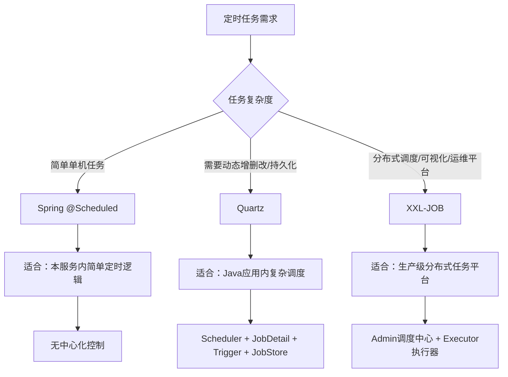
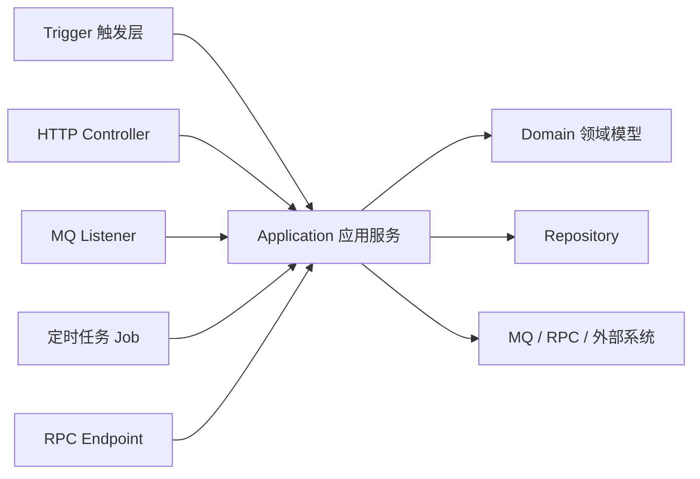
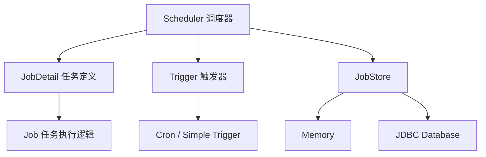
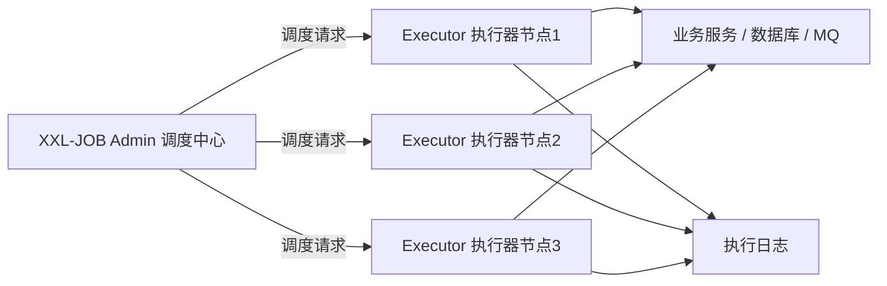
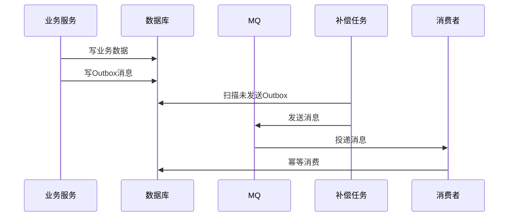

[xfg基础版](https://bugstack.cn/md/road-map/quartz.html)
[[03Spring-Schedule 扩展任务（了解）]]
[[02JobRunr：Java 持久化后台任务框架]]
# 结论先行：定时任务不是“写个 `@Scheduled`”这么简单

后端里的**任务调度**本质上是：

> 在某个时间点或某个时间规则下，由系统自动触发一段业务流程。

它解决的是这类问题：

| 场景           | 本质      |
| ------------ | ------- |
| 每天凌晨清理过期数据   | 固定时间批处理 |
| 每 5 分钟扫描支付掉单 | 失败补偿    |
| 活动到期自动关闭     | 状态机推进   |
| MQ 消费失败后定时重发 | 最终一致性补偿 |
| 每月生成账单       | 周期性业务   |
| 大批量用户分片推送    | 分布式批任务  |
| 定时同步第三方数据    | 外部系统对账  |
![[Pasted image 20260512225813.png]]

所以，定时任务不是边角料。它经常承担的是**系统自愈、补偿、对账、状态推进、数据治理**这些生产系统里非常关键的职责。

---

# 1. 先建立总图：三类定时任务方案怎么选

Java 后端常见有三类方案：



## 一句话判断

|方案|适合场景|不适合场景|
|---|---|---|
|`@Scheduled`|简单、固定、单机或轻量任务|多实例重复执行、动态配置、可视化运维|
|Quartz|Java 应用内需要动态任务、持久化、集群调度|需要平台化、多语言执行器、运营可配置|
|XXL-JOB|分布式任务调度平台、可视化、执行日志、失败重试|极简单任务、小项目没必要上|

Quartz 官方文档里，集群能力依赖 JDBC JobStore，通过多个节点共享数据库实现高可用和负载分摊；这意味着 Quartz 的集群不是“天然分布式平台”，而是“多个 Scheduler 实例竞争同一批持久化任务”。([Quartz Scheduler](https://www.quartz-scheduler.org/documentation/quartz-2.3.0/tutorials/tutorial-lesson-11.html?utm_source=chatgpt.com "Tutorial 11"))

XXL-JOB 则是典型的“调度中心 + 执行器”模型，官方定位是轻量级分布式任务调度平台，强调快速开发、学习简单、轻量、易扩展。([xuxueli.com](https://www.xuxueli.com/xxl-job/?utm_source=chatgpt.com "分布式任务调度平台XXL-JOB"))

---

# 2. 定时任务在 DDD / 后端架构里应该放哪？

不要把定时任务理解成“工具类里跑一段代码”。

更合理的架构位置是：



**定时任务、HTTP 接口、MQ 消费者，本质都是触发入口。**

区别只是：

|触发方式|谁触发|
|---|---|
|HTTP|用户 / 前端 / 外部系统|
|MQ|消息中间件|
|RPC|其他服务|
|定时任务|调度器|

所以生产代码里不建议这样写：

```java
@Scheduled(cron = "0 */5 * * * ?")
public void closeExpiredOrder() {
    // 这里直接写一堆 SQL、状态判断、远程调用
}
```

更好的方式是：

```java
@Component
@RequiredArgsConstructor
public class OrderCloseJob {

    private final OrderApplicationService orderApplicationService;

    @Scheduled(cron = "0 */5 * * * ?")
    public void closeExpiredOrder() {
        orderApplicationService.closeExpiredOrders();
    }
}
```

任务只负责**触发**，业务逻辑放在 Application / Domain 里。

---

# 3. Spring `@Scheduled`：最简单，但也是最容易被误用的

## 3.1 适用场景

`@Scheduled` 适合：

- 单体应用里的简单定时任务
    
- 开发环境临时任务
    
- 不要求动态配置
    
- 不要求复杂失败补偿
    
- 不要求中心化运维
    

例如：

```java
@Slf4j
@Component
@RequiredArgsConstructor
public class CouponExpireJob {

    private final CouponApplicationService couponApplicationService;

    /**
     * 每 10 分钟扫描一次过期优惠券
     */
    @Scheduled(cron = "0 */10 * * * ?")
    public void expireCoupons() {
        log.info("[CouponExpireJob] start");
        couponApplicationService.expireTimeoutCoupons();
        log.info("[CouponExpireJob] end");
    }
}
```

开启定时任务：

```java
@EnableScheduling
@SpringBootApplication
public class JobDemoApplication {

    public static void main(String[] args) {
        SpringApplication.run(JobDemoApplication.class, args);
    }
}
```

---

## 3.2 `@Scheduled` 的几个核心参数

```java
@Scheduled(fixedRate = 5000)
public void fixedRateJob() {
    // 每 5 秒触发一次，不关心上一次是否执行完成
}
```

```java
@Scheduled(fixedDelay = 5000)
public void fixedDelayJob() {
    // 上一次执行完成后，再等 5 秒执行下一次
}
```

```java
@Scheduled(cron = "0 0 2 * * ?")
public void cronJob() {
    // 每天凌晨 2 点执行
}
```

区别：

|参数|含义|风险|
|---|---|---|
|`fixedRate`|按固定频率触发|上次没跑完，下次可能排队或并发风险|
|`fixedDelay`|上次完成后再延迟|周期不精确，但更稳|
|`cron`|按日历表达式触发|适合业务时间规则|

---

## 3.3 `@Scheduled` 最大的问题：多实例重复执行

假设你服务部署了 3 个实例：

```text
order-service-1
order-service-2
order-service-3
```

如果每个实例都有：

```java
@Scheduled(cron = "0 */5 * * * ?")
public void closeExpiredOrder() {
    orderApplicationService.closeExpiredOrders();
}
```

那么每 5 分钟会执行 3 次。

这就可能导致：

- 重复关闭订单
    
- 重复退款
    
- 重复发 MQ
    
- 重复调用第三方接口
    
- 数据竞争
    

所以只要进入多实例部署，`@Scheduled` 就必须配合**分布式锁**或者改用 Quartz / XXL-JOB。

---

## 3.4 生产中给 `@Scheduled` 加分布式锁

以 Redis 锁为例。

```java
@Slf4j
@Component
@RequiredArgsConstructor
public class PaymentCompensateJob {

    private final StringRedisTemplate redisTemplate;
    private final PaymentApplicationService paymentApplicationService;

    private static final String LOCK_KEY = "job:payment_compensate:lock";

    @Scheduled(cron = "0 */2 * * * ?")
    public void compensatePayment() {
        Boolean locked = redisTemplate.opsForValue()
                .setIfAbsent(LOCK_KEY, "1", Duration.ofMinutes(1));

        if (!Boolean.TRUE.equals(locked)) {
            log.info("[PaymentCompensateJob] another instance is running, skip");
            return;
        }

        try {
            paymentApplicationService.compensateTimeoutPayments();
        } finally {
            redisTemplate.delete(LOCK_KEY);
        }
    }
}
```

但是这个版本还不够生产级，因为直接 `delete` 可能误删别人续期后的锁。生产代码要用：

- 唯一 token
    
- Lua 脚本校验后删除
    
- 合理过期时间
    
- 必要时续期
    

示例：

```java
@Slf4j
@Component
@RequiredArgsConstructor
public class SafeRedisLockJob {

    private final StringRedisTemplate redisTemplate;
    private final PaymentApplicationService paymentApplicationService;

    private static final String LOCK_KEY = "job:payment_compensate:lock";

    private static final DefaultRedisScript<Long> UNLOCK_SCRIPT =
            new DefaultRedisScript<>(
                    """
                    if redis.call('get', KEYS[1]) == ARGV[1] then
                        return redis.call('del', KEYS[1])
                    else
                        return 0
                    end
                    """,
                    Long.class
            );

    @Scheduled(cron = "0 */2 * * * ?")
    public void compensatePayment() {
        String token = UUID.randomUUID().toString();

        Boolean locked = redisTemplate.opsForValue()
                .setIfAbsent(LOCK_KEY, token, Duration.ofMinutes(2));

        if (!Boolean.TRUE.equals(locked)) {
            log.info("[SafeRedisLockJob] lock failed, skip");
            return;
        }

        try {
            paymentApplicationService.compensateTimeoutPayments();
        } finally {
            redisTemplate.execute(
                    UNLOCK_SCRIPT,
                    Collections.singletonList(LOCK_KEY),
                    token
            );
        }
    }
}
```

---

# 4. Quartz：Java 应用内的专业调度框架

Quartz 比 `@Scheduled` 多出来的核心能力是：

|能力|说明|
|---|---|
|Job 抽象|把任务逻辑封装为 Job|
|Trigger 抽象|把触发规则封装为 Trigger|
|JobDetail|任务定义和任务参数|
|Scheduler|调度器，负责管理任务和触发器|
|JobStore|存储任务，可内存、可数据库|
|Misfire|错过执行时间后的补偿策略|
|Cluster|多节点共享任务存储，避免重复执行|

Quartz 官方教程明确把 Scheduler、Job、Trigger 作为核心模型；集群模式下主要依赖 JDBC JobStore，多个节点共享同一个数据库表。([Quartz Scheduler](https://www.quartz-scheduler.org/documentation/quartz-2.3.0/tutorials/tutorial-lesson-11.html?utm_source=chatgpt.com "Tutorial 11"))

---

## 4.1 Quartz 的核心模型



你可以这样理解：

|Quartz 概念|类比|
|---|---|
|`Job`|具体要干什么|
|`JobDetail`|任务定义，包括任务名、分组、参数|
|`Trigger`|什么时候触发|
|`Scheduler`|调度中心|
|`JobStore`|任务保存在哪里|
|`Misfire`|错过时间后怎么办|

---

## 4.2 Spring Boot 集成 Quartz

依赖：

```xml
<dependency>
    <groupId>org.springframework.boot</groupId>
    <artifactId>spring-boot-starter-quartz</artifactId>
</dependency>
```

配置：

```yaml
spring:
  quartz:
    job-store-type: memory
    scheduler-name: devwiki-quartz-scheduler
    properties:
      org:
        quartz:
          threadPool:
            threadCount: 10
```

---

## 4.3 写一个真实的 Quartz Job

假设任务是：每 5 分钟扫描一次超时未支付订单并关闭。

```java
@Slf4j
@Component
@RequiredArgsConstructor
public class CloseTimeoutOrderJob extends QuartzJobBean {

    private final OrderApplicationService orderApplicationService;

    @Override
    protected void executeInternal(JobExecutionContext context) {
        JobDataMap dataMap = context.getMergedJobDataMap();
        int batchSize = dataMap.getInt("batchSize");

        log.info("[CloseTimeoutOrderJob] start, batchSize={}", batchSize);

        orderApplicationService.closeTimeoutOrders(batchSize);

        log.info("[CloseTimeoutOrderJob] end");
    }
}
```

配置 JobDetail 和 Trigger：

```java
@Configuration
public class QuartzJobConfig {

    @Bean
    public JobDetail closeTimeoutOrderJobDetail() {
        return JobBuilder.newJob(CloseTimeoutOrderJob.class)
                .withIdentity("closeTimeoutOrderJob", "order")
                .usingJobData("batchSize", 100)
                .storeDurably()
                .build();
    }

    @Bean
    public Trigger closeTimeoutOrderTrigger(JobDetail closeTimeoutOrderJobDetail) {
        return TriggerBuilder.newTrigger()
                .forJob(closeTimeoutOrderJobDetail)
                .withIdentity("closeTimeoutOrderTrigger", "order")
                .withSchedule(
                        CronScheduleBuilder.cronSchedule("0 */5 * * * ?")
                )
                .build();
    }
}
```

---

## 4.4 Quartz 相比 `@Scheduled` 的价值

`@Scheduled` 是这样：

```java
@Scheduled(cron = "0 */5 * * * ?")
public void run() {
    // 执行逻辑
}
```

Quartz 是这样拆的：

```text
任务是什么？      Job
任务叫什么？      JobDetail
什么时候执行？    Trigger
谁来调度？        Scheduler
任务存哪里？      JobStore
```

这带来的好处是：

|能力|`@Scheduled`|Quartz|
|---|---|---|
|静态定时任务|支持|支持|
|动态新增任务|麻烦|支持|
|动态暂停恢复|麻烦|支持|
|持久化任务|不支持|支持|
|集群调度|不原生支持|支持 JDBC JobStore 集群|
|Misfire 策略|弱|强|
|任务参数|弱|支持 JobDataMap|

---

# 5. Quartz 动态任务：真正体现 Quartz 价值的地方

很多业务场景不是固定 cron，而是用户动态创建任务。

例如：

- 用户预约 30 分钟后提醒
    
- 活动开始前 10 分钟预热
    
- 订单 15 分钟未支付自动关闭
    
- 定时发送营销短信
    
- 用户配置某个规则每天执行
    

这类任务用 `@Scheduled` 很难写，但 Quartz 很适合。

---

## 5.1 动态创建一次性任务

```java
@Service
@RequiredArgsConstructor
public class QuartzTaskService {

    private final Scheduler scheduler;

    public void scheduleOrderCloseTask(Long orderId, LocalDateTime closeTime) throws SchedulerException {
        JobDataMap jobDataMap = new JobDataMap();
        jobDataMap.put("orderId", orderId);

        JobDetail jobDetail = JobBuilder.newJob(CloseSingleOrderJob.class)
                .withIdentity("closeOrder:" + orderId, "order-close")
                .usingJobData(jobDataMap)
                .build();

        Trigger trigger = TriggerBuilder.newTrigger()
                .withIdentity("closeOrderTrigger:" + orderId, "order-close")
                .startAt(Date.from(closeTime.atZone(ZoneId.systemDefault()).toInstant()))
                .build();

        scheduler.scheduleJob(jobDetail, trigger);
    }
}
```

Job：

```java
@Slf4j
@Component
@RequiredArgsConstructor
public class CloseSingleOrderJob extends QuartzJobBean {

    private final OrderApplicationService orderApplicationService;

    @Override
    protected void executeInternal(JobExecutionContext context) {
        Long orderId = context.getMergedJobDataMap().getLong("orderId");

        log.info("[CloseSingleOrderJob] close order, orderId={}", orderId);

        orderApplicationService.closeIfUnpaid(orderId);
    }
}
```

业务方法必须幂等：

```java
@Transactional(rollbackFor = Exception.class)
public void closeIfUnpaid(Long orderId) {
    Order order = orderRepository.findById(orderId);

    if (!OrderStatus.UNPAID.equals(order.getStatus())) {
        return;
    }

    order.close();

    orderRepository.save(order);
}
```

关键点：

> Quartz 只能保证“尽量按规则触发”，不能替你保证业务不会重复执行。真正的安全性必须由业务幂等兜底。

---

## 5.2 动态修改 Cron 表达式

```java
@Service
@RequiredArgsConstructor
public class QuartzCronService {

    private final Scheduler scheduler;

    public void rescheduleJob(String jobName, String jobGroup, String newCron) throws SchedulerException {
        TriggerKey triggerKey = TriggerKey.triggerKey(jobName + "Trigger", jobGroup);

        CronTrigger newTrigger = TriggerBuilder.newTrigger()
                .withIdentity(triggerKey)
                .withSchedule(CronScheduleBuilder.cronSchedule(newCron))
                .build();

        scheduler.rescheduleJob(triggerKey, newTrigger);
    }
}
```

适合做后台管理：

```text
任务名称：closeTimeoutOrderJob
任务分组：order
Cron：0 */5 * * * ?
状态：运行中 / 暂停
操作：暂停、恢复、立即执行、修改 Cron
```

---

# 6. Quartz 持久化和集群：生产部署必须理解

## 6.1 为什么需要 JDBC JobStore？

默认内存模式的问题：

|问题|后果|
|---|---|
|应用重启任务丢失|动态任务不可靠|
|多实例各自调度|容易重复执行|
|没有持久状态|无法恢复|
|运维不可控|不利于生产排障|

Quartz 的 JDBC JobStore 会把任务、触发器、执行状态存到数据库。集群模式下，多个应用节点共享同一组 Quartz 表，通过数据库协调任务触发。官方文档说明，Quartz 集群当前主要通过 JDBC JobStore 或 TerracottaJobStore 工作，并支持负载分摊和任务故障转移。([Quartz Scheduler](https://www.quartz-scheduler.org/documentation/quartz-2.3.0/tutorials/tutorial-lesson-11.html?utm_source=chatgpt.com "Tutorial 11"))

---

## 6.2 Quartz 集群配置示例

```yaml
spring:
  quartz:
    job-store-type: jdbc
    jdbc:
      initialize-schema: never
    properties:
      org:
        quartz:
          scheduler:
            instanceName: devwiki-quartz-cluster
            instanceId: AUTO
          jobStore:
            class: org.quartz.impl.jdbcjobstore.JobStoreTX
            driverDelegateClass: org.quartz.impl.jdbcjobstore.StdJDBCDelegate
            tablePrefix: QRTZ_
            isClustered: true
            clusterCheckinInterval: 10000
          threadPool:
            class: org.quartz.simpl.SimpleThreadPool
            threadCount: 20
            threadPriority: 5
```

重点配置：

|配置|作用|
|---|---|
|`job-store-type: jdbc`|使用数据库存储任务|
|`instanceId: AUTO`|每个节点自动生成实例 ID|
|`isClustered: true`|开启集群|
|`clusterCheckinInterval`|节点心跳间隔|
|`threadCount`|调度执行线程数|
|`tablePrefix`|Quartz 表前缀|

---

## 6.3 Quartz 集群不是万能的

Quartz 集群可以减少重复调度，但不能替代业务幂等。

比如一个任务开始执行后：

```text
节点 A 抢到任务
节点 A 开始执行
节点 A 执行到一半宕机
节点 B 后续可能恢复/重跑
```

如果任务逻辑是：

```java
refundService.refund(orderId);
```

那就必须保证退款逻辑本身幂等：

```java
@Transactional(rollbackFor = Exception.class)
public void refund(Long orderId) {
    RefundOrder refundOrder = refundRepository.findByOrderId(orderId);

    if (refundOrder != null && refundOrder.isSuccess()) {
        return;
    }

    // 创建退款单时建立唯一索引：uk_order_id
    RefundOrder newRefund = RefundOrder.create(orderId);
    refundRepository.save(newRefund);

    paymentClient.refund(newRefund.getRefundNo(), orderId);
}
```

生产原则：

> 调度系统负责“触发”，业务系统负责“正确”。

---

# 7. Misfire：错过执行时间后怎么办？

这是很多人学 Quartz 时容易忽略的点。

所谓 Misfire，就是任务原本应该在某个时间执行，但因为某些原因错过了：

- 应用宕机
    
- 线程池满
    
- 数据库锁等待
    
- JVM Full GC
    
- 任务执行太慢
    
- 节点不可用
    

例如：

```text
任务计划 10:00 执行
应用 09:59 宕机
应用 10:30 恢复
这个 10:00 的任务怎么办？
```

这就是 Misfire 策略要解决的问题。

Quartz 的 Trigger 支持 Misfire 策略；官方文档中也把 misfire 作为 Trigger 调度语义的一部分。([Quartz Scheduler](https://www.quartz-scheduler.org/documentation/quartz-2.3.0/tutorials/tutorial-lesson-11.html?utm_source=chatgpt.com "Tutorial 11"))

---

## 7.1 CronTrigger 常见 Misfire 策略

```java
CronScheduleBuilder.cronSchedule("0 0/5 * * * ?")
        .withMisfireHandlingInstructionDoNothing();
```

含义：

> 错过就错过，不补跑，等下一个周期。

适合：

- 数据统计
    
- 状态扫描
    
- 可容忍跳过的任务
    

---

```java
CronScheduleBuilder.cronSchedule("0 0/5 * * * ?")
        .withMisfireHandlingInstructionFireAndProceed();
```

含义：

> 错过后尽快补跑一次，然后继续后续调度。

适合：

- 重要补偿任务
    
- 不能完全丢失的调度
    
- 但要注意不能补跑过多
    

---

## 7.2 怎么选 Misfire？

|业务类型|建议|
|---|---|
|扫描过期订单|通常 `DoNothing` 即可，因为下次还会扫|
|生成日报|可以补跑，但要按日期幂等|
|发送提醒|看业务时效性，过期提醒可能不该补发|
|支付补偿|可以补跑，但必须幂等|
|数据同步|建议用游标，不依赖单次调度绝对可靠|

一个更稳的设计是：

```text
不要依赖“每次调度都不丢”
而是让任务每次基于数据库状态扫描需要处理的数据
```

例如：

```sql
select *
from payment_order
where status = 'PROCESSING'
  and updated_at < now() - interval 5 minute
limit 100;
```

这样即使某次任务没执行，下次仍然能扫到。

---

# 8. XXL-JOB：生产中更常见的分布式任务平台

XXL-JOB 的核心模型是：



它和 Quartz 最大的区别：

|维度|Quartz|XXL-JOB|
|---|---|---|
|定位|Java 调度框架|分布式任务调度平台|
|控制台|需要自己做|自带 Admin|
|执行器|应用内 Job|注册到 Admin 的 Executor|
|运维视角|偏代码|偏平台|
|动态配置|支持，但需开发|控制台配置|
|日志|需自行接入|自带任务日志|
|分片任务|自己实现|原生支持分片广播|
|多语言|Java 为主|支持多语言执行器生态|

XXL-JOB 官方文档中包含阻塞处理策略、失败处理策略、分片等配置；例如阻塞处理策略包括单机串行、丢弃后续调度、覆盖之前调度，失败处理策略包括失败告警和失败重试。([GitHub](https://github.com/xuxueli/xxl-job/blob/master/doc/XXL-JOB-English-Documentation.md?utm_source=chatgpt.com "XXL-JOB-English-Documentation.md"))

---

## 8.1 Spring Boot 接入 XXL-JOB

依赖示例：

```xml
<dependency>
    <groupId>com.xuxueli</groupId>
    <artifactId>xxl-job-core</artifactId>
    <version>2.4.0</version>
</dependency>
```

配置：

```yaml
xxl:
  job:
    admin:
      addresses: http://127.0.0.1:9090/xxl-job-admin
    accessToken: default_token
    executor:
      appname: devwiki-job-executor
      address:
      ip:
      port: 9999
      logpath: ./logs/xxl-job
      logretentiondays: 30
```

官方 sample 配置里也包含 admin 地址、accessToken、executor appname、executor port、logpath 等核心参数。([GitHub](https://github.com/xuxueli/xxl-job/blob/master/xxl-job-executor-samples/xxl-job-executor-sample-frameless/src/main/resources/xxl-job-executor.properties?utm_source=chatgpt.com "xxl-job-executor.properties"))

配置 Bean：

```java
@Configuration
public class XxlJobConfig {

    @Value("${xxl.job.admin.addresses}")
    private String adminAddresses;

    @Value("${xxl.job.accessToken}")
    private String accessToken;

    @Value("${xxl.job.executor.appname}")
    private String appname;

    @Value("${xxl.job.executor.address:}")
    private String address;

    @Value("${xxl.job.executor.ip:}")
    private String ip;

    @Value("${xxl.job.executor.port}")
    private int port;

    @Value("${xxl.job.executor.logpath}")
    private String logPath;

    @Value("${xxl.job.executor.logretentiondays}")
    private int logRetentionDays;

    @Bean
    public XxlJobSpringExecutor xxlJobExecutor() {
        XxlJobSpringExecutor executor = new XxlJobSpringExecutor();
        executor.setAdminAddresses(adminAddresses);
        executor.setAppname(appname);
        executor.setAddress(address);
        executor.setIp(ip);
        executor.setPort(port);
        executor.setAccessToken(accessToken);
        executor.setLogPath(logPath);
        executor.setLogRetentionDays(logRetentionDays);
        return executor;
    }
}
```

---

## 8.2 写一个 XXL-JOB 任务

```java
@Slf4j
@Component
@RequiredArgsConstructor
public class PaymentCompensateXxlJob {

    private final PaymentApplicationService paymentApplicationService;

    @XxlJob("paymentCompensateJobHandler")
    public void paymentCompensateJob() {
        XxlJobHelper.log("[paymentCompensateJob] start");

        int count = paymentApplicationService.compensateTimeoutPayments(100);

        XxlJobHelper.log("[paymentCompensateJob] finished, count={}", count);
    }
}
```

然后在 XXL-JOB Admin 控制台配置：

```text
执行器：devwiki-job-executor
JobHandler：paymentCompensateJobHandler
Cron：0 */2 * * * ?
路由策略：轮询 / 故障转移 / 分片广播
阻塞处理策略：单机串行
失败处理策略：失败重试
```

---

# 9. XXL-JOB 分片任务：大批量任务处理的关键能力

假设你要每天给 1000 万用户刷新标签。

单机任务：

```text
一个节点扫 1000 万用户
执行很慢
失败影响大
扩展困难
```

分片任务：

```text
节点1处理 userId % 3 == 0
节点2处理 userId % 3 == 1
节点3处理 userId % 3 == 2
```

代码：

```java
@Slf4j
@Component
@RequiredArgsConstructor
public class UserTagRefreshJob {

    private final UserTagApplicationService userTagApplicationService;

    @XxlJob("userTagRefreshJobHandler")
    public void refreshUserTags() {
        int shardIndex = XxlJobHelper.getShardIndex();
        int shardTotal = XxlJobHelper.getShardTotal();

        XxlJobHelper.log("[UserTagRefreshJob] shardIndex={}, shardTotal={}", shardIndex, shardTotal);

        int pageSize = 500;
        Long lastUserId = 0L;

        while (true) {
            List<Long> userIds = userTagApplicationService.queryUserIdsByShard(
                    shardIndex,
                    shardTotal,
                    lastUserId,
                    pageSize
            );

            if (userIds.isEmpty()) {
                break;
            }

            userTagApplicationService.refreshTags(userIds);

            lastUserId = userIds.get(userIds.size() - 1);
        }
    }
}
```

SQL 示例：

```sql
select id
from user
where id > #{lastUserId}
  and mod(id, #{shardTotal}) = #{shardIndex}
order by id asc
limit #{pageSize};
```

这比 `limit offset` 更稳，因为大表 offset 会越来越慢。

---

# 10. 生产级定时任务的核心不是调度，而是“可恢复”

很多初学者把注意力放在：

```text
cron 怎么写？
注解怎么用？
任务怎么启动？
```

但生产级任务真正关心的是：

```text
重复执行会不会出问题？
失败后能不能恢复？
执行一半宕机会不会脏数据？
多实例会不会重复跑？
任务耗时过长怎么办？
日志能不能追踪？
执行结果能不能审计？
```

---

## 10.1 任务必须幂等

错误写法：

```java
public void closeTimeoutOrders() {
    List<Order> orders = orderRepository.queryTimeoutOrders();

    for (Order order : orders) {
        order.setStatus(OrderStatus.CLOSED);
        orderRepository.save(order);

        mqProducer.send("order.closed", order.getId());
    }
}
```

问题：

- 重复执行可能重复发 MQ
    
- save 成功但 MQ 失败，状态和消息不一致
    
- 部分成功后任务失败，下次可能重复处理
    

更好的写法：

```java
@Transactional(rollbackFor = Exception.class)
public void closeTimeoutOrders(int batchSize) {
    List<Order> orders = orderRepository.queryTimeoutUnpaidOrders(batchSize);

    for (Order order : orders) {
        boolean changed = orderRepository.closeIfUnpaid(order.getId());

        if (changed) {
            outboxRepository.save(OutboxMessage.orderClosed(order.getId()));
        }
    }
}
```

Repository：

```java
public boolean closeIfUnpaid(Long orderId) {
    int rows = jdbcTemplate.update("""
        update t_order
        set status = ?, closed_at = now()
        where id = ?
          and status = ?
        """,
        OrderStatus.CLOSED.name(),
        orderId,
        OrderStatus.UNPAID.name()
    );

    return rows == 1;
}
```

这里的关键是：

```sql
where id = ?
  and status = 'UNPAID'
```

状态条件本身就是幂等保护。

---

## 10.2 任务要有处理记录表

对于关键任务，不要只靠日志。

可以设计一张任务处理记录表：

```sql
create table job_process_record (
    id bigint primary key auto_increment,
    job_name varchar(128) not null,
    biz_type varchar(64) not null,
    biz_id varchar(128) not null,
    status varchar(32) not null,
    retry_count int not null default 0,
    error_message text,
    created_at datetime not null,
    updated_at datetime not null,
    unique key uk_job_biz (job_name, biz_type, biz_id)
);
```

处理时：

```java
@Transactional(rollbackFor = Exception.class)
public void processOnePayment(String paymentNo) {
    boolean inserted = jobRecordRepository.tryCreate(
            "paymentCompensateJob",
            "PAYMENT",
            paymentNo
    );

    if (!inserted) {
        return;
    }

    try {
        paymentService.compensate(paymentNo);
        jobRecordRepository.markSuccess("paymentCompensateJob", "PAYMENT", paymentNo);
    } catch (Exception e) {
        jobRecordRepository.markFailed("paymentCompensateJob", "PAYMENT", paymentNo, e.getMessage());
        throw e;
    }
}
```

这样可以解决：

- 重复处理
    
- 失败追踪
    
- 人工补偿
    
- 审计留痕
    
- 后续重试
    

---

## 10.3 长任务要拆批，不要一次性扫全表

错误写法：

```java
List<Order> orders = orderRepository.queryAllTimeoutOrders();
for (Order order : orders) {
    handle(order);
}
```

风险：

- 内存暴涨
    
- 单次事务过长
    
- 锁时间过长
    
- 一失败全部重来
    
- 影响线上数据库
    

更好的写法：

```java
public void closeTimeoutOrders(int batchSize) {
    Long lastId = 0L;

    while (true) {
        List<Order> orders = orderRepository.queryTimeoutOrders(lastId, batchSize);

        if (orders.isEmpty()) {
            break;
        }

        for (Order order : orders) {
            closeOneOrder(order.getId());
        }

        lastId = orders.get(orders.size() - 1).getId();
    }
}
```

SQL：

```sql
select *
from t_order
where id > #{lastId}
  and status = 'UNPAID'
  and created_at < now() - interval 30 minute
order by id asc
limit #{batchSize};
```

---

# 11. 任务调度和 MQ 的关系：不是互相替代

很多生产系统里，定时任务和 MQ 是配合关系。



常见模式：

|问题|方案|
|---|---|
|MQ 发送失败|定时任务扫描 Outbox 重发|
|MQ 消费失败|消费失败表 + 定时重试|
|支付回调丢失|定时查单补偿|
|分布式事务不一致|定时对账修复|
|第三方接口超时|延迟后任务重试|

定时任务是很多最终一致性方案里的**补偿器**。

---

# 12. 任务调度方案选择：按系统阶段选

## 12.1 小项目 / 单体应用

选：

```text
@Scheduled + 分布式锁
```

适合：

- 个人项目
    
- 管理后台
    
- 内部工具
    
- 简单数据清理
    
- 低频补偿任务
    

---

## 12.2 中型 Java 服务

选：

```text
Quartz + JDBC JobStore
```

适合：

- 需要动态任务
    
- 需要任务持久化
    
- 任务跟业务服务强绑定
    
- Java 技术栈内部闭环
    

例如：

- 预约提醒
    
- 用户自定义计划
    
- 动态配置执行周期
    
- 订单超时关闭
    

---

## 12.3 多服务 / 多团队 / 生产运维要求高

选：

```text
XXL-JOB
```

适合：

- 有多个业务服务
    
- 任务需要统一管理
    
- 运维需要可视化
    
- 需要执行日志
    
- 需要分片广播
    
- 需要失败重试和告警
    
- 任务数量较多
    

---

# 13. 三种方案的最终对比

|维度|Spring Schedule|Quartz|XXL-JOB|
|---|---|---|---|
|使用成本|最低|中等|中等|
|动态任务|弱|强|强|
|持久化|无|支持|支持|
|控制台|无|无，需自建|有|
|分布式调度|无原生能力|JDBC 集群|原生平台化|
|分片任务|手写|手写|原生支持|
|执行日志|手写|手写|自带|
|失败重试|手写|部分支持|控制台支持|
|适合阶段|简单项目|Java 内部复杂调度|生产级平台化调度|

---

# 14. 生产级任务设计清单

写定时任务前，先问这 12 个问题：

|问题|目的|
|---|---|
|任务会不会重复执行？|幂等|
|多实例部署会不会重复跑？|分布式互斥|
|任务执行一半失败怎么办？|可恢复|
|错过执行时间怎么办？|Misfire|
|任务耗时超过周期怎么办？|阻塞策略|
|单次处理多少数据？|批处理|
|是否会扫大表？|SQL 性能|
|是否需要执行日志？|可观测性|
|是否需要人工重跑？|运维能力|
|是否要分片？|横向扩展|
|是否调用第三方？|超时、重试、熔断|
|是否影响主业务库？|隔离与限流|

---

# 15. 推荐你这样掌握任务调度

## 第一层：会用

掌握：

- `@Scheduled`
    
- cron 表达式
    
- fixedRate / fixedDelay
    
- Quartz Job / Trigger / Scheduler
    
- XXL-JOB JobHandler
    

## 第二层：会设计

掌握：

- 任务触发层和业务层解耦
    
- 动态任务设计
    
- 任务参数设计
    
- 任务状态表
    
- 批处理和游标扫描
    
- 失败重试
    

## 第三层：会上生产

掌握：

- 多实例重复执行问题
    
- 分布式锁
    
- Quartz JDBC 集群
    
- XXL-JOB 路由策略
    
- 分片广播
    
- Misfire 策略
    
- 任务幂等
    
- 任务监控与告警
    

---

# 16. 面试加分表达

可以这样讲：

> 我理解定时任务不是简单的 cron 触发，而是一类系统触发入口。HTTP、MQ、RPC、Job 都可以看作 Trigger，真正的业务逻辑应该下沉到 Application Service 或领域服务里，任务本身只负责触发和调度参数传递。

进一步：

> 简单任务可以用 Spring `@Scheduled`，但多实例部署时必须考虑重复执行，通常要配合分布式锁。需要动态任务、持久化和集群调度时可以用 Quartz。Quartz 的核心模型是 Scheduler、JobDetail、Trigger、JobStore，集群模式依赖 JDBC JobStore。对于多服务、多团队、需要可视化运维和执行日志的场景，更适合 XXL-JOB 这种调度中心 + 执行器模型。

再进一步：

> 生产级任务最关键的不是“能不能定时跑”，而是幂等、失败恢复、分片、限流、日志、告警和人工补偿。尤其是支付补偿、MQ 重发、订单关闭这类任务，必须通过状态条件更新、唯一索引、处理记录表或 Outbox 机制保证重复执行不产生副作用。

---

# 关键词总结

|关键词|解释|
|---|---|
|Trigger 触发层|HTTP、MQ、RPC、Job 都是业务入口|
|`@Scheduled`|Spring 内置轻量定时任务|
|Quartz|Java 专业调度框架|
|Scheduler|Quartz 调度器|
|JobDetail|Quartz 任务定义|
|Trigger|Quartz 触发规则|
|JobStore|Quartz 任务存储|
|Misfire|错过执行时间后的处理策略|
|XXL-JOB|分布式任务调度平台|
|Executor|XXL-JOB 执行器|
|分片广播|多节点分摊处理大批量数据|
|幂等|重复执行不会产生错误副作用|
|Outbox|本地消息表，常用于 MQ 补偿|
|任务补偿|定时扫描异常状态并修复|

---

# 最后一句

**任务调度的满分理解是：**

> `@Scheduled / Quartz / XXL-JOB` 只是触发工具，真正的工程能力在于：用任务调度驱动系统补偿、自愈、对账和状态推进，同时通过幂等、批处理、分片、日志、告警、失败恢复，把它变成可靠的生产机制。