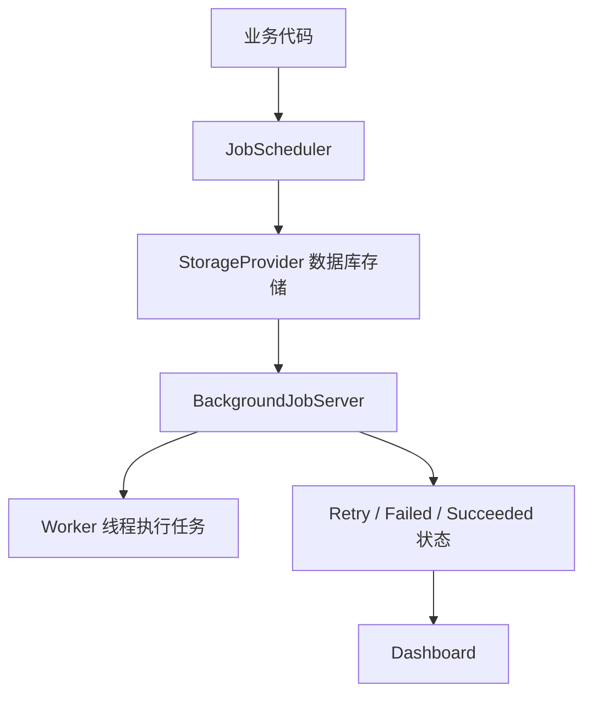

[[01Schedule、Quartz、XXL-Job 学习指南]]
# 1. JobRunr 是什么？

**JobRunr 是一个 Java 后台任务调度 / 执行框架。**

它的核心定位是：

> 把一个 Java 方法变成一个可持久化、可重试、可监控、可分布式执行的后台任务。

官方对它的定位是：一个简单易用的 Java durable background jobs library，任务状态由已有数据库支撑，并提供 dashboard。它支持 fire-and-forget、延迟任务、周期任务等后台任务类型。([JobRunr](https://www.jobrunr.io/en/?tab=manager&utm_source=chatgpt.com "JobRunr - Distributed Java Background Job Scheduler"))

更直白地说：

```java
jobScheduler.enqueue(() -> emailService.sendWelcomeEmail(userId));
```

这行代码的意思不是“马上普通调用方法”，而是：

```text
把 sendWelcomeEmail(userId) 这个方法调用记录成一个后台任务
存入数据库
由 JobRunr 后台 worker 异步取出执行
失败后可以重试
执行状态可以在 Dashboard 里看到
```

---

# 2. 它和 Quartz / XXL-JOB 最大区别是什么？

Quartz 更偏：

> 我定义一个 Job，再定义 Trigger，然后由 Scheduler 按时间触发。

XXL-JOB 更偏：

> 有一个调度中心，通过控制台配置任务，远程调度执行器。

JobRunr 更偏：

> 在业务代码里直接把某个 Java 方法调用注册成后台任务。

所以 JobRunr 的体感更像：

```text
Java 版 Sidekiq / Hangfire
```

也就是“后台任务队列 + 持久化 + 重试 + Dashboard”。

---

# 3. JobRunr 适合解决什么问题？

它特别适合这类场景：

|场景|JobRunr 是否适合|原因|
|---|--:|---|
|用户注册后异步发欢迎邮件|适合|fire-and-forget 后台任务|
|订单 30 分钟未支付自动关闭|适合|delayed job|
|每天生成日报|适合|recurring job|
|调用第三方接口失败自动重试|适合|持久化任务 + 重试|
|图片压缩、文件转码、AI 摘要生成|适合|耗时任务异步化|
|定时扫描支付掉单|适合|recurring job|
|大规模分布式批处理平台|一般|更偏 XXL-JOB / Spring Batch|
|复杂企业级调度规则|一般|Quartz/XXL-JOB 更传统|
|运维人员通过后台统一配置所有任务|一般|XXL-JOB 更合适|

一句话：

> **Quartz 管“调度规则”，XXL-JOB 管“平台化调度”，JobRunr 管“后台任务执行”。**

---

# 4. JobRunr 的核心模型



核心组件：

|组件|作用|
|---|---|
|`JobScheduler`|创建后台任务|
|`BackgroundJobServer`|后台 worker，负责拉取并执行任务|
|`StorageProvider`|存储任务、状态、重试次数等|
|Dashboard|查看任务状态、失败原因、重试|
|Recurring Job|周期性任务|
|Scheduled Job|延迟到某个时间执行|
|Fire-and-forget Job|尽快异步执行一次|

官方文档也建议，在 Spring / Micronaut / Quarkus 这类 DI 框架里优先注入 `JobScheduler`，而不是使用静态 `BackgroundJob` 门面，这样更利于测试，也避免同 JVM 多实例场景的问题。([JobRunr](https://www.jobrunr.io/en/blog/distributed-job-scheduling-java/?utm_source=chatgpt.com "Distributed Job Scheduling in Java: A Complete Guide"))

---

# 5. Spring Boot 里怎么用 JobRunr？

## 5.1 引入依赖

如果是 Spring Boot 3：

```xml
<dependency>
    <groupId>org.jobrunr</groupId>
    <artifactId>jobrunr-spring-boot-3-starter</artifactId>
    <version>8.1.0</version>
</dependency>
```

如果是 Spring Boot 4，用：

```xml
<dependency>
    <groupId>org.jobrunr</groupId>
    <artifactId>jobrunr-spring-boot-4-starter</artifactId>
    <version>8.1.0</version>
</dependency>
```

JobRunr 当前文档明确说明，Spring Boot 3 使用 `jobrunr-spring-boot-3-starter`，Spring Boot 4 使用 `jobrunr-spring-boot-4-starter`；旧的 `jobrunr-spring-boot-starter` 和 `jobrunr-spring-boot-2-starter` 已不再支持。([JobRunr](https://www.jobrunr.io/en/documentation/configuration/spring/?utm_source=chatgpt.com "Spring Boot Starter"))

---

## 5.2 application.yml 配置

示例：

```yaml
org:
  jobrunr:
    background-job-server:
      enabled: true
      worker-count: 4
    dashboard:
      enabled: true
      port: 8000
    database:
      skip-create: false
```

同时你需要正常配置数据源：

```yaml
spring:
  datasource:
    url: jdbc:mysql://localhost:3306/jobrunr_demo?useSSL=false&serverTimezone=Asia/Shanghai
    username: root
    password: root
    driver-class-name: com.mysql.cj.jdbc.Driver
```

JobRunr 会使用数据库保存任务状态。官方定位就是 backed by your existing database。([JobRunr](https://www.jobrunr.io/en/?tab=manager&utm_source=chatgpt.com "JobRunr - Distributed Java Background Job Scheduler"))

---

# 6. 最常用的三种任务写法

## 6.1 Fire-and-forget：立即异步执行

业务场景：

> 用户注册成功后，异步发送欢迎邮件。

Controller：

```java
@RestController
@RequiredArgsConstructor
@RequestMapping("/users")
public class UserController {

    private final UserApplicationService userApplicationService;

    @PostMapping("/register")
    public Long register(@RequestBody RegisterUserRequest request) {
        return userApplicationService.register(request);
    }
}
```

Application Service：

```java
@Service
@RequiredArgsConstructor
public class UserApplicationService {

    private final UserRepository userRepository;
    private final JobScheduler jobScheduler;
    private final EmailJobService emailJobService;

    @Transactional(rollbackFor = Exception.class)
    public Long register(RegisterUserRequest request) {
        User user = User.create(request.getUsername(), request.getEmail());
        userRepository.save(user);

        /*
         * 关键点：
         * 这里不是同步发送邮件，而是把这个方法调用注册为后台任务。
         * JobRunr 会把任务持久化，之后由后台 worker 执行。
         */
        jobScheduler.enqueue(() -> emailJobService.sendWelcomeEmail(user.getId()));

        return user.getId();
    }
}
```

后台任务服务：

```java
@Slf4j
@Service
@RequiredArgsConstructor
public class EmailJobService {

    private final UserRepository userRepository;
    private final EmailClient emailClient;

    public void sendWelcomeEmail(Long userId) {
        User user = userRepository.findById(userId);

        if (user == null) {
            log.warn("[sendWelcomeEmail] user not found, userId={}", userId);
            return;
        }

        emailClient.send(
                user.getEmail(),
                "欢迎注册",
                "欢迎使用我们的系统"
        );
    }
}
```

这个模式的好处：

|好处|说明|
|---|---|
|请求响应更快|注册接口不用等邮件发送|
|失败可追踪|任务失败会记录|
|可重试|失败后可以自动或手动重试|
|解耦主流程|主业务不被邮件服务拖慢|

---

## 6.2 Scheduled Job：延迟到未来某个时间执行

业务场景：

> 订单 30 分钟未支付，自动关闭。

下单逻辑：

```java
@Service
@RequiredArgsConstructor
public class OrderApplicationService {

    private final OrderRepository orderRepository;
    private final JobScheduler jobScheduler;
    private final OrderTimeoutJobService orderTimeoutJobService;

    @Transactional(rollbackFor = Exception.class)
    public Long createOrder(CreateOrderCommand command) {
        Order order = Order.create(command.getUserId(), command.getItems());
        orderRepository.save(order);

        Instant closeTime = Instant.now().plus(Duration.ofMinutes(30));

        /*
         * 30 分钟后执行关闭订单任务。
         * 注意：任务执行时仍然要判断订单是否未支付。
         */
        jobScheduler.schedule(
                closeTime,
                () -> orderTimeoutJobService.closeOrderIfUnpaid(order.getId())
        );

        return order.getId();
    }
}
```

Job Service：

```java
@Slf4j
@Service
@RequiredArgsConstructor
public class OrderTimeoutJobService {

    private final OrderRepository orderRepository;

    @Transactional(rollbackFor = Exception.class)
    public void closeOrderIfUnpaid(Long orderId) {
        /*
         * 生产级关键点：
         * 不能无脑关闭订单。
         * 任务可能延迟执行，也可能重复执行。
         * 必须基于订单当前状态做幂等判断。
         */
        int rows = orderRepository.closeIfUnpaid(orderId);

        if (rows == 1) {
            log.info("[closeOrderIfUnpaid] order closed, orderId={}", orderId);
        } else {
            log.info("[closeOrderIfUnpaid] order already paid or closed, orderId={}", orderId);
        }
    }
}
```

Repository：

```java
@Repository
@RequiredArgsConstructor
public class OrderRepository {

    private final JdbcTemplate jdbcTemplate;

    public int closeIfUnpaid(Long orderId) {
        return jdbcTemplate.update("""
            update t_order
            set status = 'CLOSED',
                closed_at = now()
            where id = ?
              and status = 'UNPAID'
            """, orderId);
    }
}
```

重点：

> JobRunr 负责“30 分钟后触发”，但业务正确性仍然靠 `where status = 'UNPAID'` 保证。

---

## 6.3 Recurring Job：周期性任务

业务场景：

> 每 5 分钟扫描一次支付超时订单。

可以用注解：

```java
@Slf4j
@Service
@RequiredArgsConstructor
public class PaymentCompensateJob {

    private final PaymentApplicationService paymentApplicationService;

    @Recurring(id = "payment-compensate-job", cron = "*/5 * * * *")
    @Job(name = "支付超时补偿任务")
    public void compensateTimeoutPayments() {
        log.info("[PaymentCompensateJob] start");

        int count = paymentApplicationService.compensateTimeoutPayments(100);

        log.info("[PaymentCompensateJob] finished, count={}", count);
    }
}
```

官方文档说明，使用 Spring Boot Starter 时，可以在 Bean 方法上添加 `@Recurring`，JobRunr 会自动注册周期任务；也支持用 `BackgroundJob.scheduleRecurrently` 或注入的 `JobScheduler` 创建 recurring job。([JobRunr](https://www.jobrunr.io/en/documentation/background-methods/recurring-jobs/?utm_source=chatgpt.com "Recurring jobs"))

---

# 7. JobRunr 的 recurring job 和 Quartz cron 有什么不同？

Quartz 的 cron job 是调度框架核心能力。

JobRunr 的 recurring job 更像：

```text
Recurring Job 定期生成一个普通后台任务
然后由 BackgroundJobServer 执行这个任务
```

官方文档也说明：`BackgroundJobServer` 里的特殊组件会按固定间隔检查 recurring jobs，并把需要执行的 recurring job 入队为 fire-and-forget job。([JobRunr](https://www.jobrunr.io/en/documentation/background-methods/recurring-jobs/?utm_source=chatgpt.com "Recurring jobs"))

这意味着 JobRunr 的 recurring job 有一个特点：

> 它不是强实时调度，触发时间可能和 cron 指定时间差几秒。

官方文档也明确提醒，JobRunr OSS 的 recurring jobs 不一定在 cron 表达式指定的精确时刻执行，因为它会在 poll interval 内获取即将执行的任务并立即入队。([JobRunr](https://www.jobrunr.io/en/documentation/background-methods/recurring-jobs/?utm_source=chatgpt.com "Recurring jobs"))

所以：

|需求|更适合|
|---|---|
|几秒误差可接受的后台任务|JobRunr|
|严格复杂调度规则|Quartz / XXL-JOB|
|任务执行状态、失败重试、Dashboard 很重要|JobRunr|
|运维人员要集中控制任务|XXL-JOB|

---

# 8. JobRunr、Quartz、XXL-JOB、Spring Scheduled 对比

|维度|`@Scheduled`|Quartz|XXL-JOB|JobRunr|
|---|---|---|---|---|
|核心定位|Spring 轻量定时|Java 调度框架|分布式调度平台|Java 后台任务框架|
|使用方式|注解方法|Job + Trigger|控制台 + Handler|直接调度 Java 方法|
|持久化|无|JDBC JobStore|调度中心 DB|应用 DB|
|Dashboard|无|无，需自建|有|有|
|延迟任务|弱|支持|支持但偏调度|很自然|
|周期任务|支持|强|强|支持|
|fire-and-forget 后台任务|不适合|不自然|不自然|很适合|
|失败重试|手写|有但不够业务友好|控制台配置|原生体验好|
|多实例|需锁|JDBC 集群|执行器集群|多 worker 竞争任务|
|动态任务|弱|强|强|强|
|运维平台化|弱|弱|强|中等|
|典型场景|简单定时|复杂调度|企业任务平台|异步后台任务|

---

# 9. JobRunr 最适合放在你的知识体系哪里？

你原来的目录建议要改一下。

推荐：

```text
01学习笔记/
└── Java后端/
    └── 任务调度与后台任务/
        ├── 01-任务调度体系总览：Scheduled、Quartz、XXL-JOB、JobRunr.md
        ├── 02-Spring Scheduled：轻量定时任务与多实例问题.md
        ├── 03-Quartz：Job、Trigger、Scheduler、JobStore.md
        ├── 04-Quartz 集群、Misfire 与生产坑.md
        ├── 05-XXL-JOB：分布式任务调度平台.md
        ├── 06-JobRunr：Java 持久化后台任务框架.md
        └── 07-生产级任务设计：幂等、补偿、分片、重试、告警.md
```

目录名我建议不要只叫“任务调度”，改成：

```text
任务调度与后台任务
```

因为 JobRunr 让这个主题从“按时间触发”扩展到了：

```text
异步后台任务
延迟任务
周期任务
失败重试
任务状态持久化
Dashboard 观测
```

这比单纯 Quartz 更大一圈。

---

# 10. JobRunr 的生产使用注意点

## 10.1 不要把复杂对象直接塞进 Job 参数

不推荐：

```java
jobScheduler.enqueue(() -> orderJobService.process(order));
```

推荐：

```java
jobScheduler.enqueue(() -> orderJobService.process(order.getId()));
```

原因：

|问题|说明|
|---|---|
|对象序列化复杂|字段变更后可能反序列化失败|
|数据容易过期|入队时对象状态和执行时状态可能不同|
|任务记录膨胀|参数太大影响存储|
|难以兼容升级|类结构变化会影响历史任务|

生产上优先传：

```text
Long id
String bizNo
简单 DTO
```

任务执行时重新查数据库。

---

## 10.2 Job 方法要稳定，别随便改签名

JobRunr 会持久化“要执行哪个方法 + 参数”。

所以你不要轻易改：

```java
public void closeOrderIfUnpaid(Long orderId)
```

改成：

```java
public void closeOrderIfUnpaid(Long orderId, String reason)
```

否则历史任务可能找不到原来的方法。

更稳的做法是使用 JobRequest / Handler 模式，把任务请求对象显式化。JobRunr 官方也提到，除了 lambda，也支持 `JobRequest` / `JobRequestHandler` 模式，适合传递数据对象或偏好显式 handler 的场景。([JobRunr](https://www.jobrunr.io/en/blog/distributed-job-scheduling-java/?utm_source=chatgpt.com "Distributed Job Scheduling in Java: A Complete Guide"))

概念示例：

```java
public record CloseOrderJobRequest(Long orderId) implements JobRequest {
}
```

```java
@Component
@RequiredArgsConstructor
public class CloseOrderJobHandler implements JobRequestHandler<CloseOrderJobRequest> {

    private final OrderApplicationService orderApplicationService;

    @Override
    public void run(CloseOrderJobRequest request) {
        orderApplicationService.closeIfUnpaid(request.orderId());
    }
}
```

调度：

```java
jobRequestScheduler.enqueue(new CloseOrderJobRequest(orderId));
```

这个模式更适合生产项目。

---

## 10.3 JobRunr 不能替代业务幂等

错误理解：

> JobRunr 已经持久化和重试了，所以业务不用考虑重复执行。

这是错的。

只要有：

- 重试
    
- 节点宕机
    
- 网络超时
    
- 第三方接口不确定成功
    
- 手动 retry
    

就必须考虑幂等。

例如退款任务：

```java
jobScheduler.enqueue(() -> refundJobService.refund(orderId));
```

内部仍然必须这样做：

```java
@Transactional(rollbackFor = Exception.class)
public void refund(Long orderId) {
    RefundOrder refundOrder = refundRepository.findByOrderId(orderId);

    if (refundOrder != null && refundOrder.isSuccess()) {
        return;
    }

    RefundOrder newRefundOrder = refundRepository.createIfAbsent(orderId);

    paymentClient.refund(newRefundOrder.getRefundNo(), orderId);
}
```

核心原则不变：

> 调度框架保证任务“尽量可靠执行”，业务代码保证“重复执行也不会错”。

---

# 11. JobRunr 的最佳使用边界

## 推荐用 JobRunr 的场景

```text
用户注册后发邮件
支付后异步生成权益
AI 摘要生成
文件解析
图片压缩
订单延迟关闭
第三方接口失败重试
轻中量级周期任务
后台处理队列
```

## 不太推荐 JobRunr 的场景

```text
公司级统一任务调度平台
需要大量运维人员在控制台配置任务
复杂分片批处理
超大规模 ETL
强实时精确调度
复杂 Calendar 调度规则
```

这类更偏：

```text
XXL-JOB
Quartz
Spring Batch
Flink
Airflow
```

---

# 12. 任务调度方案对比

|方案|定位|适合场景|
|---|---|---|
|`@Scheduled`|Spring 轻量定时任务|简单周期任务|
|Quartz|Java 调度框架|复杂时间规则、动态任务、JDBC 集群|
|XXL-JOB|分布式任务调度平台|多服务统一调度、可视化运维、分片任务|
|**JobRunr**|**Java 持久化后台任务框架**|**异步任务、延迟任务、周期任务、失败重试、Dashboard**|

---

# 12. 面试加分表达

可以这样说：

> 除了 Spring Scheduled、Quartz、XXL-JOB，我还会把 JobRunr 单独看作一类“持久化后台任务框架”。它不是传统意义上的中心化调度平台，而是让业务代码可以直接把 Java 方法调用入队为后台任务，由数据库持久化任务状态，并由 BackgroundJobServer 异步执行，支持延迟任务、周期任务、失败重试和 Dashboard。

再进一步：

> Quartz 更擅长复杂调度模型，XXL-JOB 更擅长平台化分布式调度，JobRunr 更擅长把业务里的异步任务、延迟任务、补偿任务做成可靠后台任务。比如注册后发邮件、订单 30 分钟未支付自动关闭、AI 摘要生成、第三方接口失败重试，这些用 JobRunr 的表达力会比 Quartz 更自然。

最后补一句生产意识：

> 但 JobRunr 不能替代业务幂等。后台任务只保证可持久化、可重试、可观测，真正的业务正确性仍然要靠状态机、唯一索引、条件更新、处理记录表来兜底。