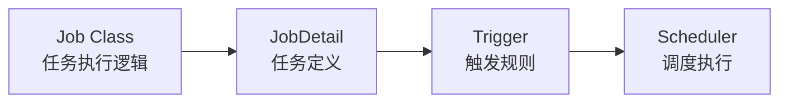
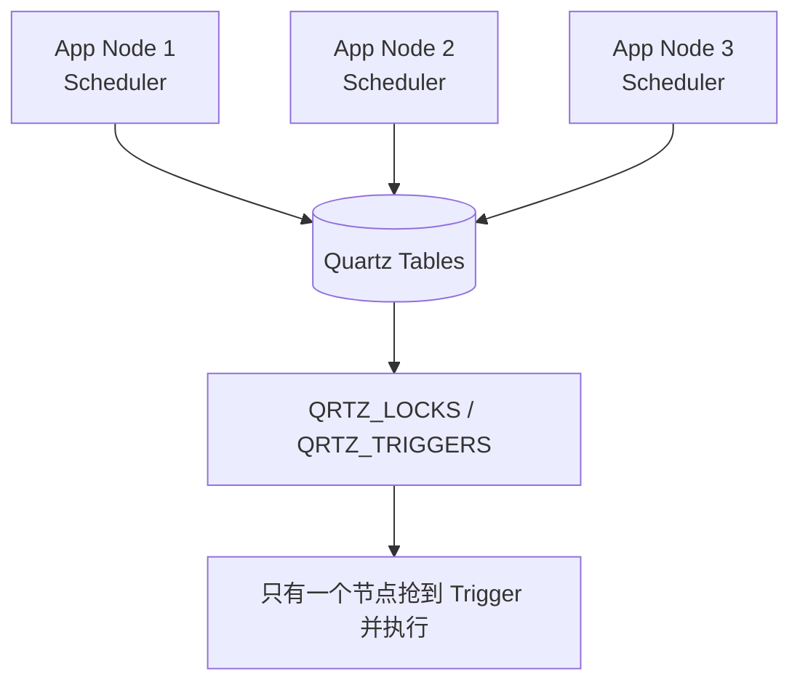
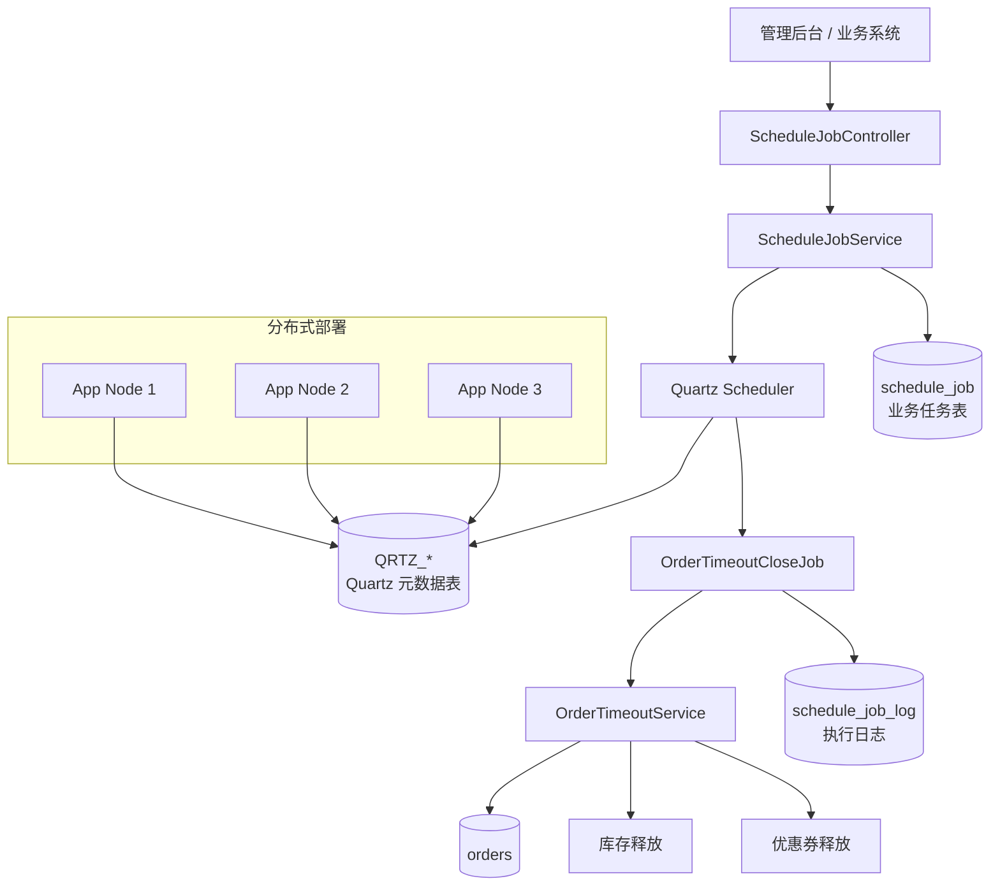

```
你是一名资深 Java 后端架构师和企业级项目导师。

背景：
我之前已经学习过 Quartz 的基础概念，包括 Job、Trigger、Scheduler、JobDetail、Cron 表达式等。现在我希望进一步学习 Quartz 在真实企业项目中的生产级用法。

任务：
请给出一个完整的、高质量教学案例，重点讲解如何使用 Quartz 实现任务调度。

要求：
1. 案例应接近企业真实生产场景，而不是简单 Demo。
2. 使用 Java + Spring Boot + Quartz。
3. 代码结构要清晰，体现分层设计和工程化实践。
4. 需要包含完整的核心代码，例如：
   - Quartz 配置
   - Job 定义
   - JobDetail / Trigger 创建
   - Cron 任务调度
   - 动态新增任务
   - 暂停任务
   - 恢复任务
   - 删除任务
   - 修改任务执行时间
   - 查询任务状态
5. 需要说明每个核心类的职责。
6. 需要解释 Quartz 在企业项目中的关键设计点，例如：
   - Scheduler 的生命周期管理
   - Job 是否允许并发执行
   - 任务参数如何传递
   - 任务持久化
   - 异常处理
   - 日志记录
   - 幂等性设计
   - 分布式部署下如何避免重复执行
7. 代码应尽量符合生产规范，包括：
   - 合理的包结构
   - 清晰的命名
   - 必要的注释
   - 统一异常处理
   - 参数校验
   - REST API 设计
8. 最后请总结：
   - Quartz 的适用场景
   - 与 Spring Task、XXL-JOB、ElasticJob 的区别
   - 企业中使用 Quartz 的最佳实践
   - 常见坑和排查思路

输出格式：
请按照“项目背景 → 技术选型 → 项目结构 → 数据库设计 → 核心代码 → API 示例 → 运行效果 → 关键原理解析 → 生产最佳实践 → 总结”的结构输出。
```
[[01Schedule、Quartz、XXL-Job 学习指南]]

---
# 1. 项目背景：订单超时自动关闭调度系统

## 业务场景

在电商 / SaaS / 交易类系统中，经常有这类需求：

> 用户创建订单后，如果 30 分钟内未支付，系统自动关闭订单，并释放库存、优惠券、锁定资源。

这类任务有几个生产级特点：

|特点|说明|
|---|---|
|任务不是固定写死的|每个订单创建后，都要动态创建一个关闭任务|
|任务需要持久化|应用重启后任务不能丢|
|任务不能重复执行|分布式多节点部署下，同一个订单不能被关闭多次|
|任务可能需要暂停 / 恢复 / 修改|例如订单延期支付、人工干预|
|任务需要可观测|能查询任务状态、执行日志、失败原因|
|需要幂等|任务重复触发、重试、补偿时结果必须正确|

所以这个案例不是简单的：

```java
@Scheduled(cron = "0/5 * * * * ?")
```

而是一个接近企业项目的 **Quartz 动态任务调度中心**。

---

# 2. 技术选型

## 技术栈

| 技术                         | 用途                       |
| -------------------------- | ------------------------ |
| Java 21 / Java 17          | 后端开发语言                   |
| Spring Boot 3.x            | 应用框架                     |
| Spring Boot Quartz Starter | 集成 Quartz                |
| Quartz JDBC JobStore       | 持久化 JobDetail / Trigger  |
| MySQL / PostgreSQL         | 存储 Quartz 元数据和业务任务记录     |
| Spring Validation          | API 参数校验                 |
| Spring MVC                 | REST API                 |
| Lombok                     | 简化样板代码                   |
| MyBatis / JPA              | 业务表访问，本文用伪 Repository 表达 |

Spring Boot 默认使用内存 JobStore，但如果配置了 `spring.quartz.job-store-type=jdbc` 并且存在 DataSource，就可以使用 JDBC 持久化 JobStore。Quartz 官方集群能力也依赖 JDBC JobStore，多节点共享同一套 Quartz 表。([Home](https://docs.spring.io/spring-boot/reference/io/quartz.html?utm_source=chatgpt.com "Quartz Scheduler :: Spring Boot"))

---

# 3. 项目结构

```text
com.example.orderscheduler
├── OrderSchedulerApplication.java
│
├── config
│   ├── QuartzConfig.java
│   └── GlobalExceptionHandler.java
│
├── controller
│   └── ScheduleJobController.java
│
├── service
│   ├── ScheduleJobService.java
│   ├── OrderTimeoutService.java
│   └── impl
│       ├── ScheduleJobServiceImpl.java
│       └── OrderTimeoutServiceImpl.java
│
├── job
│   ├── OrderTimeoutCloseJob.java
│   └── BaseQuartzJob.java
│
├── domain
│   ├── entity
│   │   ├── ScheduleJobEntity.java
│   │   └── ScheduleJobLogEntity.java
│   ├── enums
│   │   ├── ScheduleJobStatus.java
│   │   └── ScheduleJobType.java
│   └── repository
│       ├── ScheduleJobRepository.java
│       └── ScheduleJobLogRepository.java
│
├── dto
│   ├── CreateCronJobRequest.java
│   ├── CreateOrderTimeoutJobRequest.java
│   ├── UpdateCronRequest.java
│   └── ScheduleJobResponse.java
│
├── common
│   ├── ApiResponse.java
│   ├── BizException.java
│   └── ErrorCode.java
│
└── util
    └── QuartzKeyBuilder.java
```

## 分层说明

|层|职责|
|---|---|
|controller|暴露任务管理 REST API|
|service|封装 Quartz 操作和业务编排|
|job|Quartz 真正执行的任务逻辑|
|domain/entity|业务任务表、执行日志表|
|repository|数据访问层|
|config|Quartz、异常处理等基础设施配置|
|util|JobKey、TriggerKey 构造工具|

---

# 4. 数据库设计

Quartz 自己有一套标准表，例如：

```text
QRTZ_JOB_DETAILS
QRTZ_TRIGGERS
QRTZ_CRON_TRIGGERS
QRTZ_SIMPLE_TRIGGERS
QRTZ_FIRED_TRIGGERS
QRTZ_LOCKS
QRTZ_SCHEDULER_STATE
...
```

这些表用于保存 JobDetail、Trigger、Cron 表达式、正在执行的任务、集群节点状态等。JDBC JobStore 会把调度信息存入关系型数据库，官方文档也明确说明 JDBCJobStore 用于在数据库中存储调度信息。([Quartz](https://www.quartz-scheduler.org/documentation/quartz-2.2.2/configuration/ConfigJobStoreTX.html?utm_source=chatgpt.com "Configuration of JDBC-JobStoreTX"))

但企业项目里通常还需要自己的业务表。

## 4.1 业务任务表：schedule_job

```sql
CREATE TABLE schedule_job (
    id BIGINT PRIMARY KEY AUTO_INCREMENT COMMENT '主键',
    job_code VARCHAR(128) NOT NULL COMMENT '业务任务编码，例如 ORDER_TIMEOUT_CLOSE_10001',
    job_name VARCHAR(128) NOT NULL COMMENT '任务名称',
    job_group VARCHAR(128) NOT NULL COMMENT '任务分组',
    job_type VARCHAR(64) NOT NULL COMMENT '任务类型：ORDER_TIMEOUT_CLOSE / SYSTEM_CRON',
    job_class VARCHAR(255) NOT NULL COMMENT 'Quartz Job 类名',
    cron_expression VARCHAR(128) NULL COMMENT 'Cron 表达式，Cron 任务使用',
    trigger_type VARCHAR(32) NOT NULL COMMENT 'CRON / SIMPLE',
    business_id VARCHAR(128) NULL COMMENT '业务ID，例如 orderId',
    job_data JSON NULL COMMENT '任务参数',
    status VARCHAR(32) NOT NULL COMMENT 'NORMAL / PAUSED / DELETED',
    remark VARCHAR(512) NULL COMMENT '备注',
    created_at DATETIME NOT NULL,
    updated_at DATETIME NOT NULL,
    UNIQUE KEY uk_job_code (job_code),
    KEY idx_job_group (job_group),
    KEY idx_business_id (business_id)
) COMMENT='业务调度任务表';
```

## 4.2 任务执行日志表：schedule_job_log

```sql
CREATE TABLE schedule_job_log (
    id BIGINT PRIMARY KEY AUTO_INCREMENT COMMENT '主键',
    job_code VARCHAR(128) NOT NULL COMMENT '任务编码',
    job_name VARCHAR(128) NOT NULL COMMENT '任务名称',
    job_group VARCHAR(128) NOT NULL COMMENT '任务分组',
    fire_instance_id VARCHAR(128) NULL COMMENT 'Quartz fireInstanceId',
    start_time DATETIME NOT NULL COMMENT '开始时间',
    end_time DATETIME NULL COMMENT '结束时间',
    duration_ms BIGINT NULL COMMENT '执行耗时',
    success TINYINT NOT NULL COMMENT '是否成功',
    error_message TEXT NULL COMMENT '异常信息',
    created_at DATETIME NOT NULL,
    KEY idx_job_code (job_code),
    KEY idx_created_at (created_at)
) COMMENT='任务执行日志表';
```

## 4.3 订单幂等字段示例

```sql
ALTER TABLE orders
ADD COLUMN close_job_code VARCHAR(128) NULL COMMENT '订单关闭任务编码',
ADD COLUMN closed_at DATETIME NULL COMMENT '关闭时间',
ADD COLUMN version BIGINT NOT NULL DEFAULT 0 COMMENT '乐观锁版本号';
```

订单关闭时不要只靠 Quartz 保证不重复执行，业务层也要做幂等。

---

# 5. 核心代码

## 5.1 Maven 依赖

```xml
<dependencies>
    <!-- Spring Web -->
    <dependency>
        <groupId>org.springframework.boot</groupId>
        <artifactId>spring-boot-starter-web</artifactId>
    </dependency>

    <!-- 参数校验 -->
    <dependency>
        <groupId>org.springframework.boot</groupId>
        <artifactId>spring-boot-starter-validation</artifactId>
    </dependency>

    <!-- Quartz -->
    <dependency>
        <groupId>org.springframework.boot</groupId>
        <artifactId>spring-boot-starter-quartz</artifactId>
    </dependency>

    <!-- JDBC / 数据源 -->
    <dependency>
        <groupId>org.springframework.boot</groupId>
        <artifactId>spring-boot-starter-jdbc</artifactId>
    </dependency>

    <!-- MySQL Driver，根据实际项目替换 -->
    <dependency>
        <groupId>com.mysql</groupId>
        <artifactId>mysql-connector-j</artifactId>
    </dependency>

    <!-- Lombok，可选 -->
    <dependency>
        <groupId>org.projectlombok</groupId>
        <artifactId>lombok</artifactId>
        <optional>true</optional>
    </dependency>
</dependencies>
```

---

## 5.2 application.yml：Quartz 持久化与集群配置

```yaml
server:
  port: 8080

spring:
  application:
    name: order-scheduler

  datasource:
    url: jdbc:mysql://localhost:3306/order_scheduler?useUnicode=true&characterEncoding=utf8&serverTimezone=Asia/Shanghai
    username: root
    password: root
    driver-class-name: com.mysql.cj.jdbc.Driver

  quartz:
    # 生产环境必须使用 jdbc，不能使用 memory
    job-store-type: jdbc

    # 生产环境一般不建议 always，避免启动时误删或重建 Quartz 表
    # 第一次本地开发可以使用 always / embedded，生产建议 never，并手工执行官方建表 SQL
    jdbc:
      initialize-schema: never

    # 是否覆盖数据库中已有 Job
    overwrite-existing-jobs: false

    # 等待任务执行完成后再关闭 Scheduler
    wait-for-jobs-to-complete-on-shutdown: true

    properties:
      org:
        quartz:
          scheduler:
            instanceName: OrderSchedulerCluster
            # AUTO 表示 Quartz 自动生成节点实例 ID，适合多节点部署
            instanceId: AUTO

          threadPool:
            class: org.quartz.simpl.SimpleThreadPool
            threadCount: 10
            threadPriority: 5

          jobStore:
            class: org.springframework.scheduling.quartz.LocalDataSourceJobStore
            driverDelegateClass: org.quartz.impl.jdbcjobstore.StdJDBCDelegate
            tablePrefix: QRTZ_
            isClustered: true
            clusterCheckinInterval: 10000
            misfireThreshold: 60000
            useProperties: false
```

### 配置解释

|配置|说明|
|---|---|
|`job-store-type: jdbc`|使用数据库保存任务|
|`initialize-schema: never`|生产环境避免启动时自动初始化表|
|`overwrite-existing-jobs: false`|避免启动时覆盖数据库已有任务|
|`wait-for-jobs-to-complete-on-shutdown: true`|优雅停机|
|`isClustered: true`|开启 Quartz 集群|
|`instanceId: AUTO`|多节点实例 ID 自动生成|
|`threadCount: 10`|Quartz 工作线程数|
|`misfireThreshold`|错过触发时间的判定阈值|

Quartz 集群通过多个 Scheduler 节点共享同一个数据库实现高可用与负载分摊；官方文档强调，Quartz clustering 只适用于 JDBC JobStore，并通过共享数据库协同。([Quartz](https://www.quartz-scheduler.org/documentation/quartz-2.3.0/configuration/ConfigJDBCJobStoreClustering.html?utm_source=chatgpt.com "Configure Clustering with JDBC-JobStore"))

---

## 5.3 QuartzConfig：支持 Job 中注入 Spring Bean

Quartz 默认自己创建 Job 实例，如果不处理，Job 里使用 `@Autowired` 可能失效。Spring Boot 已经提供了较好的 Quartz 集成，但生产中建议显式处理 JobFactory，确保 Job 能使用 Spring 容器能力。

```java
package com.example.orderscheduler.config;

import lombok.RequiredArgsConstructor;
import org.quartz.spi.TriggerFiredBundle;
import org.springframework.beans.factory.config.AutowireCapableBeanFactory;
import org.springframework.boot.autoconfigure.quartz.SchedulerFactoryBeanCustomizer;
import org.springframework.context.annotation.Bean;
import org.springframework.context.annotation.Configuration;
import org.springframework.scheduling.quartz.SpringBeanJobFactory;

@Configuration
@RequiredArgsConstructor
public class QuartzConfig {

    private final AutowireCapableBeanFactory beanFactory;

    @Bean
    public SchedulerFactoryBeanCustomizer schedulerFactoryBeanCustomizer() {
        return schedulerFactoryBean -> {
            AutowireSpringBeanJobFactory jobFactory = new AutowireSpringBeanJobFactory(beanFactory);
            schedulerFactoryBean.setJobFactory(jobFactory);

            // true：应用关闭时等待正在执行的任务完成
            schedulerFactoryBean.setWaitForJobsToCompleteOnShutdown(true);

            // true：Spring 容器启动完成后自动启动 Scheduler
            schedulerFactoryBean.setAutoStartup(true);

            // 延迟启动，避免应用还没完全 ready 就开始抢任务
            schedulerFactoryBean.setStartupDelay(10);
        };
    }

    static class AutowireSpringBeanJobFactory extends SpringBeanJobFactory {

        private final AutowireCapableBeanFactory beanFactory;

        AutowireSpringBeanJobFactory(AutowireCapableBeanFactory beanFactory) {
            this.beanFactory = beanFactory;
        }

        @Override
        protected Object createJobInstance(TriggerFiredBundle bundle) throws Exception {
            Object job = super.createJobInstance(bundle);
            beanFactory.autowireBean(job);
            return job;
        }
    }
}
```

---

## 5.4 通用响应与异常处理

### ApiResponse

```java
package com.example.orderscheduler.common;

import lombok.AllArgsConstructor;
import lombok.Data;

@Data
@AllArgsConstructor
public class ApiResponse<T> {

    private Integer code;
    private String message;
    private T data;

    public static <T> ApiResponse<T> success(T data) {
        return new ApiResponse<>(0, "success", data);
    }

    public static <T> ApiResponse<T> fail(Integer code, String message) {
        return new ApiResponse<>(code, message, null);
    }
}
```

### BizException

```java
package com.example.orderscheduler.common;

import lombok.Getter;

@Getter
public class BizException extends RuntimeException {

    private final Integer code;

    public BizException(Integer code, String message) {
        super(message);
        this.code = code;
    }

    public static BizException badRequest(String message) {
        return new BizException(400, message);
    }

    public static BizException notFound(String message) {
        return new BizException(404, message);
    }

    public static BizException conflict(String message) {
        return new BizException(409, message);
    }
}
```

### GlobalExceptionHandler

```java
package com.example.orderscheduler.config;

import com.example.orderscheduler.common.ApiResponse;
import com.example.orderscheduler.common.BizException;
import jakarta.validation.ConstraintViolationException;
import org.quartz.SchedulerException;
import org.springframework.web.bind.MethodArgumentNotValidException;
import org.springframework.web.bind.annotation.ExceptionHandler;
import org.springframework.web.bind.annotation.RestControllerAdvice;

@RestControllerAdvice
public class GlobalExceptionHandler {

    @ExceptionHandler(BizException.class)
    public ApiResponse<Void> handleBizException(BizException e) {
        return ApiResponse.fail(e.getCode(), e.getMessage());
    }

    @ExceptionHandler(MethodArgumentNotValidException.class)
    public ApiResponse<Void> handleValidationException(MethodArgumentNotValidException e) {
        String message = e.getBindingResult()
                .getFieldErrors()
                .stream()
                .findFirst()
                .map(error -> error.getField() + " " + error.getDefaultMessage())
                .orElse("参数校验失败");
        return ApiResponse.fail(400, message);
    }

    @ExceptionHandler(ConstraintViolationException.class)
    public ApiResponse<Void> handleConstraintViolationException(ConstraintViolationException e) {
        return ApiResponse.fail(400, e.getMessage());
    }

    @ExceptionHandler(SchedulerException.class)
    public ApiResponse<Void> handleSchedulerException(SchedulerException e) {
        return ApiResponse.fail(500, "Quartz 调度异常：" + e.getMessage());
    }

    @ExceptionHandler(Exception.class)
    public ApiResponse<Void> handleException(Exception e) {
        return ApiResponse.fail(500, "系统异常：" + e.getMessage());
    }
}
```

---

## 5.5 DTO 设计

### 创建订单超时任务请求

```java
package com.example.orderscheduler.dto;

import jakarta.validation.constraints.Future;
import jakarta.validation.constraints.NotBlank;
import jakarta.validation.constraints.NotNull;
import lombok.Data;

import java.time.LocalDateTime;
import java.util.Map;

@Data
public class CreateOrderTimeoutJobRequest {

    @NotBlank(message = "orderId 不能为空")
    private String orderId;

    @NotNull(message = "executeAt 不能为空")
    @Future(message = "executeAt 必须是未来时间")
    private LocalDateTime executeAt;

    /**
     * 额外业务参数，例如 tenantId、operator、traceId 等
     */
    private Map<String, Object> params;
}
```

### 创建 Cron 任务请求

```java
package com.example.orderscheduler.dto;

import jakarta.validation.constraints.NotBlank;
import lombok.Data;

import java.util.Map;

@Data
public class CreateCronJobRequest {

    @NotBlank(message = "jobCode 不能为空")
    private String jobCode;

    @NotBlank(message = "jobName 不能为空")
    private String jobName;

    @NotBlank(message = "jobGroup 不能为空")
    private String jobGroup;

    @NotBlank(message = "jobClass 不能为空")
    private String jobClass;

    @NotBlank(message = "cronExpression 不能为空")
    private String cronExpression;

    private Map<String, Object> params;
}
```

### 修改 Cron 请求

```java
package com.example.orderscheduler.dto;

import jakarta.validation.constraints.NotBlank;
import lombok.Data;

@Data
public class UpdateCronRequest {

    @NotBlank(message = "cronExpression 不能为空")
    private String cronExpression;
}
```

### 响应对象

```java
package com.example.orderscheduler.dto;

import lombok.Builder;
import lombok.Data;

@Data
@Builder
public class ScheduleJobResponse {

    private String jobCode;
    private String jobName;
    private String jobGroup;
    private String jobClass;
    private String triggerName;
    private String triggerGroup;
    private String cronExpression;
    private String triggerState;
    private String businessId;
}
```

---

## 5.6 QuartzKeyBuilder：统一 Key 规范

Quartz 的 JobKey / TriggerKey 必须稳定、唯一、可读。生产中不要到处拼字符串。

```java
package com.example.orderscheduler.util;

import org.quartz.JobKey;
import org.quartz.TriggerKey;

public final class QuartzKeyBuilder {

    private QuartzKeyBuilder() {
    }

    public static JobKey jobKey(String jobCode, String jobGroup) {
        return JobKey.jobKey(jobCode, jobGroup);
    }

    public static TriggerKey triggerKey(String jobCode, String jobGroup) {
        return TriggerKey.triggerKey(jobCode + "_TRIGGER", jobGroup);
    }

    public static String orderTimeoutJobCode(String orderId) {
        return "ORDER_TIMEOUT_CLOSE_" + orderId;
    }

    public static String orderTimeoutGroup() {
        return "ORDER_TIMEOUT_CLOSE_GROUP";
    }
}
```

---

## 5.7 BaseQuartzJob：统一日志、异常、耗时统计

不建议每个 Job 都自己写日志和 try-catch。可以做一个抽象基类。

```java
package com.example.orderscheduler.job;

import com.example.orderscheduler.domain.entity.ScheduleJobLogEntity;
import com.example.orderscheduler.domain.repository.ScheduleJobLogRepository;
import lombok.extern.slf4j.Slf4j;
import org.quartz.Job;
import org.quartz.JobExecutionContext;
import org.quartz.JobExecutionException;
import org.springframework.beans.factory.annotation.Autowired;

import java.time.LocalDateTime;

@Slf4j
public abstract class BaseQuartzJob implements Job {

    @Autowired
    private ScheduleJobLogRepository scheduleJobLogRepository;

    @Override
    public final void execute(JobExecutionContext context) throws JobExecutionException {
        String jobCode = context.getJobDetail().getKey().getName();
        String jobGroup = context.getJobDetail().getKey().getGroup();
        String jobName = context.getJobDetail().getDescription();
        String fireInstanceId = context.getFireInstanceId();

        LocalDateTime startTime = LocalDateTime.now();
        long start = System.currentTimeMillis();

        boolean success = false;
        String errorMessage = null;

        try {
            log.info("[QuartzJob] start, jobCode={}, jobGroup={}, fireInstanceId={}",
                    jobCode, jobGroup, fireInstanceId);

            doExecute(context);

            success = true;
        } catch (Exception e) {
            errorMessage = e.getMessage();

            log.error("[QuartzJob] failed, jobCode={}, jobGroup={}, fireInstanceId={}",
                    jobCode, jobGroup, fireInstanceId, e);

            /*
             * 注意：
             * 1. 这里是否 refireImmediately，要结合业务决定。
             * 2. 对订单关闭这种任务，一般不建议无限立即重试。
             * 3. 推荐记录失败日志，再由补偿任务扫描处理。
             */
            JobExecutionException jobException = new JobExecutionException(e);
            jobException.setRefireImmediately(false);
            throw jobException;
        } finally {
            long duration = System.currentTimeMillis() - start;
            LocalDateTime endTime = LocalDateTime.now();

            ScheduleJobLogEntity logEntity = new ScheduleJobLogEntity();
            logEntity.setJobCode(jobCode);
            logEntity.setJobName(jobName);
            logEntity.setJobGroup(jobGroup);
            logEntity.setFireInstanceId(fireInstanceId);
            logEntity.setStartTime(startTime);
            logEntity.setEndTime(endTime);
            logEntity.setDurationMs(duration);
            logEntity.setSuccess(success);
            logEntity.setErrorMessage(errorMessage);
            logEntity.setCreatedAt(LocalDateTime.now());

            scheduleJobLogRepository.save(logEntity);

            log.info("[QuartzJob] end, jobCode={}, jobGroup={}, success={}, durationMs={}",
                    jobCode, jobGroup, success, duration);
        }
    }

    protected abstract void doExecute(JobExecutionContext context) throws Exception;
}
```

---

## 5.8 OrderTimeoutCloseJob：订单超时关闭任务

重点：使用 `@DisallowConcurrentExecution`。

```java
package com.example.orderscheduler.job;

import com.example.orderscheduler.service.OrderTimeoutService;
import lombok.extern.slf4j.Slf4j;
import org.quartz.DisallowConcurrentExecution;
import org.quartz.JobDataMap;
import org.quartz.JobExecutionContext;
import org.springframework.beans.factory.annotation.Autowired;

/**
 * 订单超时关闭任务。
 *
 * @DisallowConcurrentExecution：
 * 同一个 JobDetail 在上一次执行未完成前，不允许并发执行下一次。
 *
 * 注意：
 * 它不是替代业务幂等的银弹。
 * 分布式场景还需要 JDBC JobStore + Quartz 集群 + 业务幂等共同保证。
 */
@Slf4j
@DisallowConcurrentExecution
public class OrderTimeoutCloseJob extends BaseQuartzJob {

    @Autowired
    private OrderTimeoutService orderTimeoutService;

    @Override
    protected void doExecute(JobExecutionContext context) {
        JobDataMap dataMap = context.getMergedJobDataMap();

        String orderId = dataMap.getString("orderId");
        String jobCode = context.getJobDetail().getKey().getName();

        orderTimeoutService.closeOrderIfTimeout(orderId, jobCode);
    }
}
```

`@DisallowConcurrentExecution` 是 Quartz 用来控制同一个 JobDetail 不并发执行的标记注解；但它解决的是调度层并发，不等于业务层幂等。Quartz 持久化表中也会记录 Job 是否为非并发任务。([CSDN](https://blog.csdn.net/m0_37607945/article/details/132050466?utm_source=chatgpt.com "Quartz中禁止并发机制源码级解析"))

---

## 5.9 OrderTimeoutService：业务幂等关闭订单

这里是生产关键点：**Quartz 只负责“什么时候执行”，业务服务负责“执行是否正确”。**

```java
package com.example.orderscheduler.service;

public interface OrderTimeoutService {

    /**
     * 如果订单超时未支付，则关闭订单。
     *
     * 必须幂等：
     * - 订单已支付：不关闭
     * - 订单已关闭：直接返回
     * - 重复执行：只能成功关闭一次
     */
    void closeOrderIfTimeout(String orderId, String jobCode);
}
```

```java
package com.example.orderscheduler.service.impl;

import com.example.orderscheduler.service.OrderTimeoutService;
import lombok.RequiredArgsConstructor;
import lombok.extern.slf4j.Slf4j;
import org.springframework.stereotype.Service;
import org.springframework.transaction.annotation.Transactional;

/**
 * 这里用伪代码表达订单 Repository。
 * 真实项目中可以用 MyBatis / JPA / jOOQ。
 */
@Slf4j
@Service
@RequiredArgsConstructor
public class OrderTimeoutServiceImpl implements OrderTimeoutService {

    private final OrderRepository orderRepository;
    private final InventoryService inventoryService;
    private final CouponService couponService;

    @Override
    @Transactional(rollbackFor = Exception.class)
    public void closeOrderIfTimeout(String orderId, String jobCode) {
        /*
         * 推荐做法：
         * 使用一条带状态条件的 UPDATE 实现幂等。
         *
         * UPDATE orders
         * SET status = 'CLOSED',
         *     closed_at = NOW(),
         *     version = version + 1
         * WHERE order_id = ?
         *   AND status = 'WAIT_PAY'
         *   AND expire_time <= NOW()
         */
        int updated = orderRepository.closeTimeoutOrder(orderId);

        if (updated == 0) {
            /*
             * 说明订单不存在、已支付、已关闭、未超时。
             * 对定时任务来说，这不是异常，而是幂等命中。
             */
            log.info("[OrderTimeout] skip close, orderId={}, jobCode={}", orderId, jobCode);
            return;
        }

        /*
         * 释放库存、优惠券也要幂等。
         * 比如库存流水表建立唯一索引：
         * uk_biz_type_biz_id = ORDER_TIMEOUT_CLOSE + orderId
         */
        inventoryService.releaseLockedStock(orderId, "ORDER_TIMEOUT_CLOSE");
        couponService.releaseLockedCoupon(orderId, "ORDER_TIMEOUT_CLOSE");

        log.info("[OrderTimeout] order closed, orderId={}, jobCode={}", orderId, jobCode);
    }
}
```

### 幂等核心

```sql
UPDATE orders
SET status = 'CLOSED'
WHERE order_id = #{orderId}
  AND status = 'WAIT_PAY'
  AND expire_time <= NOW();
```

这条 SQL 的意义：

|场景|结果|
|---|---|
|第一次超时关闭|update = 1|
|重复执行|update = 0|
|订单已支付|update = 0|
|订单未超时|update = 0|
|多节点同时触发|只有一个事务 update = 1|

---

## 5.10 ScheduleJobService 接口

```java
package com.example.orderscheduler.service;

import com.example.orderscheduler.dto.CreateCronJobRequest;
import com.example.orderscheduler.dto.CreateOrderTimeoutJobRequest;
import com.example.orderscheduler.dto.ScheduleJobResponse;

public interface ScheduleJobService {

    ScheduleJobResponse createOrderTimeoutJob(CreateOrderTimeoutJobRequest request);

    ScheduleJobResponse createCronJob(CreateCronJobRequest request);

    void pauseJob(String jobCode, String jobGroup);

    void resumeJob(String jobCode, String jobGroup);

    void deleteJob(String jobCode, String jobGroup);

    ScheduleJobResponse updateCron(String jobCode, String jobGroup, String cronExpression);

    ScheduleJobResponse getJob(String jobCode, String jobGroup);
}
```

---

## 5.11 ScheduleJobServiceImpl：动态调度核心

```java
package com.example.orderscheduler.service.impl;

import com.example.orderscheduler.common.BizException;
import com.example.orderscheduler.dto.CreateCronJobRequest;
import com.example.orderscheduler.dto.CreateOrderTimeoutJobRequest;
import com.example.orderscheduler.dto.ScheduleJobResponse;
import com.example.orderscheduler.job.OrderTimeoutCloseJob;
import com.example.orderscheduler.service.ScheduleJobService;
import com.example.orderscheduler.util.QuartzKeyBuilder;
import lombok.RequiredArgsConstructor;
import lombok.extern.slf4j.Slf4j;
import org.quartz.*;
import org.springframework.stereotype.Service;
import org.springframework.transaction.annotation.Transactional;

import java.time.ZoneId;
import java.util.Date;
import java.util.Map;

@Slf4j
@Service
@RequiredArgsConstructor
public class ScheduleJobServiceImpl implements ScheduleJobService {

    private final Scheduler scheduler;
    private final ScheduleJobRepository scheduleJobRepository;

    /**
     * 创建订单超时关闭任务。
     * 这是一个一次性任务：到点执行一次。
     */
    @Override
    @Transactional(rollbackFor = Exception.class)
    public ScheduleJobResponse createOrderTimeoutJob(CreateOrderTimeoutJobRequest request) {
        String jobCode = QuartzKeyBuilder.orderTimeoutJobCode(request.getOrderId());
        String jobGroup = QuartzKeyBuilder.orderTimeoutGroup();

        JobKey jobKey = QuartzKeyBuilder.jobKey(jobCode, jobGroup);
        TriggerKey triggerKey = QuartzKeyBuilder.triggerKey(jobCode, jobGroup);

        try {
            if (scheduler.checkExists(jobKey)) {
                throw BizException.conflict("任务已存在：" + jobCode);
            }

            JobDataMap jobDataMap = new JobDataMap();
            jobDataMap.put("orderId", request.getOrderId());
            putAllIfNotNull(jobDataMap, request.getParams());

            JobDetail jobDetail = JobBuilder.newJob(OrderTimeoutCloseJob.class)
                    .withIdentity(jobKey)
                    .withDescription("订单超时自动关闭任务")
                    .usingJobData(jobDataMap)
                    /*
                     * durable = true：
                     * 即使没有 Trigger 关联，JobDetail 也可以保留。
                     * 动态任务通常建议设置 true。
                     */
                    .storeDurably(true)
                    .build();

            Date startAt = Date.from(
                    request.getExecuteAt()
                            .atZone(ZoneId.systemDefault())
                            .toInstant()
            );

            Trigger trigger = TriggerBuilder.newTrigger()
                    .withIdentity(triggerKey)
                    .forJob(jobDetail)
                    .startAt(startAt)
                    /*
                     * SimpleSchedule：
                     * 一次性执行任务。
                     */
                    .withSchedule(SimpleScheduleBuilder.simpleSchedule()
                            .withMisfireHandlingInstructionFireNow())
                    .build();

            scheduler.scheduleJob(jobDetail, trigger);

            saveBusinessJobRecord(
                    jobCode,
                    "订单超时自动关闭任务",
                    jobGroup,
                    OrderTimeoutCloseJob.class.getName(),
                    null,
                    "SIMPLE",
                    request.getOrderId(),
                    request.getParams()
            );

            log.info("[ScheduleJob] create order timeout job, jobCode={}, executeAt={}",
                    jobCode, request.getExecuteAt());

            return getJob(jobCode, jobGroup);
        } catch (SchedulerException e) {
            throw new RuntimeException("创建订单超时任务失败：" + e.getMessage(), e);
        }
    }

    /**
     * 创建 Cron 周期任务。
     */
    @Override
    @Transactional(rollbackFor = Exception.class)
    public ScheduleJobResponse createCronJob(CreateCronJobRequest request) {
        validateCron(request.getCronExpression());

        JobKey jobKey = QuartzKeyBuilder.jobKey(request.getJobCode(), request.getJobGroup());
        TriggerKey triggerKey = QuartzKeyBuilder.triggerKey(request.getJobCode(), request.getJobGroup());

        try {
            if (scheduler.checkExists(jobKey)) {
                throw BizException.conflict("任务已存在：" + request.getJobCode());
            }

            Class<? extends Job> jobClass = loadJobClass(request.getJobClass());

            JobDataMap jobDataMap = new JobDataMap();
            putAllIfNotNull(jobDataMap, request.getParams());

            JobDetail jobDetail = JobBuilder.newJob(jobClass)
                    .withIdentity(jobKey)
                    .withDescription(request.getJobName())
                    .usingJobData(jobDataMap)
                    .storeDurably(true)
                    .build();

            CronScheduleBuilder cronScheduleBuilder = CronScheduleBuilder
                    .cronSchedule(request.getCronExpression())
                    /*
                     * misfire 策略：
                     * 如果错过执行时间，不补偿执行所有错过次数，而是等待下一次。
                     * 适合多数周期任务，例如报表、同步、巡检。
                     */
                    .withMisfireHandlingInstructionDoNothing();

            Trigger trigger = TriggerBuilder.newTrigger()
                    .withIdentity(triggerKey)
                    .forJob(jobDetail)
                    .withSchedule(cronScheduleBuilder)
                    .build();

            scheduler.scheduleJob(jobDetail, trigger);

            saveBusinessJobRecord(
                    request.getJobCode(),
                    request.getJobName(),
                    request.getJobGroup(),
                    request.getJobClass(),
                    request.getCronExpression(),
                    "CRON",
                    null,
                    request.getParams()
            );

            log.info("[ScheduleJob] create cron job, jobCode={}, cron={}",
                    request.getJobCode(), request.getCronExpression());

            return getJob(request.getJobCode(), request.getJobGroup());
        } catch (SchedulerException e) {
            throw new RuntimeException("创建 Cron 任务失败：" + e.getMessage(), e);
        }
    }

    /**
     * 暂停任务。
     */
    @Override
    @Transactional(rollbackFor = Exception.class)
    public void pauseJob(String jobCode, String jobGroup) {
        JobKey jobKey = QuartzKeyBuilder.jobKey(jobCode, jobGroup);

        try {
            ensureJobExists(jobKey);
            scheduler.pauseJob(jobKey);

            scheduleJobRepository.updateStatus(jobCode, jobGroup, "PAUSED");

            log.info("[ScheduleJob] pause job, jobCode={}, jobGroup={}", jobCode, jobGroup);
        } catch (SchedulerException e) {
            throw new RuntimeException("暂停任务失败：" + e.getMessage(), e);
        }
    }

    /**
     * 恢复任务。
     */
    @Override
    @Transactional(rollbackFor = Exception.class)
    public void resumeJob(String jobCode, String jobGroup) {
        JobKey jobKey = QuartzKeyBuilder.jobKey(jobCode, jobGroup);

        try {
            ensureJobExists(jobKey);
            scheduler.resumeJob(jobKey);

            scheduleJobRepository.updateStatus(jobCode, jobGroup, "NORMAL");

            log.info("[ScheduleJob] resume job, jobCode={}, jobGroup={}", jobCode, jobGroup);
        } catch (SchedulerException e) {
            throw new RuntimeException("恢复任务失败：" + e.getMessage(), e);
        }
    }

    /**
     * 删除任务。
     *
     * scheduler.deleteJob(jobKey) 会删除 JobDetail 以及关联 Trigger。
     */
    @Override
    @Transactional(rollbackFor = Exception.class)
    public void deleteJob(String jobCode, String jobGroup) {
        JobKey jobKey = QuartzKeyBuilder.jobKey(jobCode, jobGroup);

        try {
            ensureJobExists(jobKey);

            scheduler.pauseJob(jobKey);
            scheduler.deleteJob(jobKey);

            scheduleJobRepository.updateStatus(jobCode, jobGroup, "DELETED");

            log.info("[ScheduleJob] delete job, jobCode={}, jobGroup={}", jobCode, jobGroup);
        } catch (SchedulerException e) {
            throw new RuntimeException("删除任务失败：" + e.getMessage(), e);
        }
    }

    /**
     * 修改 Cron 表达式。
     *
     * 核心是 rescheduleJob：
     * 使用同一个 TriggerKey 替换旧 Trigger。
     */
    @Override
    @Transactional(rollbackFor = Exception.class)
    public ScheduleJobResponse updateCron(String jobCode, String jobGroup, String cronExpression) {
        validateCron(cronExpression);

        TriggerKey triggerKey = QuartzKeyBuilder.triggerKey(jobCode, jobGroup);

        try {
            Trigger oldTrigger = scheduler.getTrigger(triggerKey);
            if (oldTrigger == null) {
                throw BizException.notFound("Trigger 不存在：" + triggerKey);
            }

            CronTrigger newTrigger = TriggerBuilder.newTrigger()
                    .withIdentity(triggerKey)
                    .forJob(QuartzKeyBuilder.jobKey(jobCode, jobGroup))
                    .withSchedule(CronScheduleBuilder
                            .cronSchedule(cronExpression)
                            .withMisfireHandlingInstructionDoNothing())
                    .build();

            scheduler.rescheduleJob(triggerKey, newTrigger);

            scheduleJobRepository.updateCron(jobCode, jobGroup, cronExpression);

            log.info("[ScheduleJob] update cron, jobCode={}, cron={}", jobCode, cronExpression);

            return getJob(jobCode, jobGroup);
        } catch (SchedulerException e) {
            throw new RuntimeException("修改 Cron 失败：" + e.getMessage(), e);
        }
    }

    /**
     * 查询任务状态。
     */
    @Override
    public ScheduleJobResponse getJob(String jobCode, String jobGroup) {
        JobKey jobKey = QuartzKeyBuilder.jobKey(jobCode, jobGroup);
        TriggerKey triggerKey = QuartzKeyBuilder.triggerKey(jobCode, jobGroup);

        try {
            ensureJobExists(jobKey);

            JobDetail jobDetail = scheduler.getJobDetail(jobKey);
            Trigger trigger = scheduler.getTrigger(triggerKey);
            Trigger.TriggerState triggerState = scheduler.getTriggerState(triggerKey);

            String cronExpression = null;
            if (trigger instanceof CronTrigger cronTrigger) {
                cronExpression = cronTrigger.getCronExpression();
            }

            return ScheduleJobResponse.builder()
                    .jobCode(jobKey.getName())
                    .jobGroup(jobKey.getGroup())
                    .jobName(jobDetail.getDescription())
                    .jobClass(jobDetail.getJobClass().getName())
                    .triggerName(triggerKey.getName())
                    .triggerGroup(triggerKey.getGroup())
                    .cronExpression(cronExpression)
                    .triggerState(triggerState.name())
                    .businessId(jobDetail.getJobDataMap().getString("orderId"))
                    .build();
        } catch (SchedulerException e) {
            throw new RuntimeException("查询任务失败：" + e.getMessage(), e);
        }
    }

    private void ensureJobExists(JobKey jobKey) throws SchedulerException {
        if (!scheduler.checkExists(jobKey)) {
            throw BizException.notFound("任务不存在：" + jobKey);
        }
    }

    private void validateCron(String cronExpression) {
        if (!CronExpression.isValidExpression(cronExpression)) {
            throw BizException.badRequest("Cron 表达式非法：" + cronExpression);
        }
    }

    @SuppressWarnings("unchecked")
    private Class<? extends Job> loadJobClass(String jobClassName) {
        try {
            Class<?> clazz = Class.forName(jobClassName);
            if (!Job.class.isAssignableFrom(clazz)) {
                throw BizException.badRequest("jobClass 必须实现 org.quartz.Job：" + jobClassName);
            }
            return (Class<? extends Job>) clazz;
        } catch (ClassNotFoundException e) {
            throw BizException.badRequest("Job 类不存在：" + jobClassName);
        }
    }

    private void putAllIfNotNull(JobDataMap jobDataMap, Map<String, Object> params) {
        if (params == null || params.isEmpty()) {
            return;
        }
        params.forEach(jobDataMap::put);
    }

    private void saveBusinessJobRecord(
            String jobCode,
            String jobName,
            String jobGroup,
            String jobClass,
            String cronExpression,
            String triggerType,
            String businessId,
            Map<String, Object> params
    ) {
        ScheduleJobEntity entity = new ScheduleJobEntity();
        entity.setJobCode(jobCode);
        entity.setJobName(jobName);
        entity.setJobGroup(jobGroup);
        entity.setJobClass(jobClass);
        entity.setCronExpression(cronExpression);
        entity.setTriggerType(triggerType);
        entity.setBusinessId(businessId);
        entity.setStatus("NORMAL");
        entity.setJobData(toJson(params));
        entity.setCreatedAt(LocalDateTime.now());
        entity.setUpdatedAt(LocalDateTime.now());

        scheduleJobRepository.save(entity);
    }

    private String toJson(Map<String, Object> params) {
        // 示例省略，真实项目用 Jackson ObjectMapper
        return params == null ? "{}" : params.toString();
    }
}
```

---

## 5.12 Controller：REST API 设计

```java
package com.example.orderscheduler.controller;

import com.example.orderscheduler.common.ApiResponse;
import com.example.orderscheduler.dto.CreateCronJobRequest;
import com.example.orderscheduler.dto.CreateOrderTimeoutJobRequest;
import com.example.orderscheduler.dto.ScheduleJobResponse;
import com.example.orderscheduler.dto.UpdateCronRequest;
import com.example.orderscheduler.service.ScheduleJobService;
import jakarta.validation.Valid;
import jakarta.validation.constraints.NotBlank;
import lombok.RequiredArgsConstructor;
import org.springframework.validation.annotation.Validated;
import org.springframework.web.bind.annotation.*;

@RestController
@RequestMapping("/api/schedule/jobs")
@RequiredArgsConstructor
@Validated
public class ScheduleJobController {

    private final ScheduleJobService scheduleJobService;

    /**
     * 创建订单超时关闭任务。
     */
    @PostMapping("/order-timeout")
    public ApiResponse<ScheduleJobResponse> createOrderTimeoutJob(
            @Valid @RequestBody CreateOrderTimeoutJobRequest request
    ) {
        return ApiResponse.success(scheduleJobService.createOrderTimeoutJob(request));
    }

    /**
     * 创建 Cron 任务。
     */
    @PostMapping("/cron")
    public ApiResponse<ScheduleJobResponse> createCronJob(
            @Valid @RequestBody CreateCronJobRequest request
    ) {
        return ApiResponse.success(scheduleJobService.createCronJob(request));
    }

    /**
     * 暂停任务。
     */
    @PostMapping("/{jobGroup}/{jobCode}/pause")
    public ApiResponse<Void> pauseJob(
            @PathVariable @NotBlank String jobGroup,
            @PathVariable @NotBlank String jobCode
    ) {
        scheduleJobService.pauseJob(jobCode, jobGroup);
        return ApiResponse.success(null);
    }

    /**
     * 恢复任务。
     */
    @PostMapping("/{jobGroup}/{jobCode}/resume")
    public ApiResponse<Void> resumeJob(
            @PathVariable @NotBlank String jobGroup,
            @PathVariable @NotBlank String jobCode
    ) {
        scheduleJobService.resumeJob(jobCode, jobGroup);
        return ApiResponse.success(null);
    }

    /**
     * 删除任务。
     */
    @DeleteMapping("/{jobGroup}/{jobCode}")
    public ApiResponse<Void> deleteJob(
            @PathVariable @NotBlank String jobGroup,
            @PathVariable @NotBlank String jobCode
    ) {
        scheduleJobService.deleteJob(jobCode, jobGroup);
        return ApiResponse.success(null);
    }

    /**
     * 修改 Cron 表达式。
     */
    @PutMapping("/{jobGroup}/{jobCode}/cron")
    public ApiResponse<ScheduleJobResponse> updateCron(
            @PathVariable @NotBlank String jobGroup,
            @PathVariable @NotBlank String jobCode,
            @Valid @RequestBody UpdateCronRequest request
    ) {
        return ApiResponse.success(
                scheduleJobService.updateCron(jobCode, jobGroup, request.getCronExpression())
        );
    }

    /**
     * 查询任务状态。
     */
    @GetMapping("/{jobGroup}/{jobCode}")
    public ApiResponse<ScheduleJobResponse> getJob(
            @PathVariable @NotBlank String jobGroup,
            @PathVariable @NotBlank String jobCode
    ) {
        return ApiResponse.success(scheduleJobService.getJob(jobCode, jobGroup));
    }
}
```

---

# 6. API 示例

## 6.1 创建订单超时关闭任务

```http
POST /api/schedule/jobs/order-timeout
Content-Type: application/json

{
  "orderId": "10001",
  "executeAt": "2026-05-13T21:30:00",
  "params": {
    "tenantId": "mall-a",
    "traceId": "trace-10001"
  }
}
```

响应：

```json
{
  "code": 0,
  "message": "success",
  "data": {
    "jobCode": "ORDER_TIMEOUT_CLOSE_10001",
    "jobName": "订单超时自动关闭任务",
    "jobGroup": "ORDER_TIMEOUT_CLOSE_GROUP",
    "jobClass": "com.example.orderscheduler.job.OrderTimeoutCloseJob",
    "triggerName": "ORDER_TIMEOUT_CLOSE_10001_TRIGGER",
    "triggerGroup": "ORDER_TIMEOUT_CLOSE_GROUP",
    "cronExpression": null,
    "triggerState": "NORMAL",
    "businessId": "10001"
  }
}
```

---

## 6.2 创建 Cron 周期任务

```http
POST /api/schedule/jobs/cron
Content-Type: application/json

{
  "jobCode": "ORDER_TIMEOUT_COMPENSATE",
  "jobName": "订单超时关闭补偿任务",
  "jobGroup": "ORDER_COMPENSATE_GROUP",
  "jobClass": "com.example.orderscheduler.job.OrderTimeoutCompensateJob",
  "cronExpression": "0 0/5 * * * ?",
  "params": {
    "scanMinutes": 30
  }
}
```

含义：每 5 分钟扫描一次漏掉的超时订单。

---

## 6.3 暂停任务

```http
POST /api/schedule/jobs/ORDER_TIMEOUT_CLOSE_GROUP/ORDER_TIMEOUT_CLOSE_10001/pause
```

---

## 6.4 恢复任务

```http
POST /api/schedule/jobs/ORDER_TIMEOUT_CLOSE_GROUP/ORDER_TIMEOUT_CLOSE_10001/resume
```

---

## 6.5 删除任务

```http
DELETE /api/schedule/jobs/ORDER_TIMEOUT_CLOSE_GROUP/ORDER_TIMEOUT_CLOSE_10001
```

---

## 6.6 修改 Cron 表达式

```http
PUT /api/schedule/jobs/ORDER_COMPENSATE_GROUP/ORDER_TIMEOUT_COMPENSATE/cron
Content-Type: application/json

{
  "cronExpression": "0 0/10 * * * ?"
}
```

---

## 6.7 查询任务状态

```http
GET /api/schedule/jobs/ORDER_TIMEOUT_CLOSE_GROUP/ORDER_TIMEOUT_CLOSE_10001
```

---

# 7. 运行效果

## 7.1 创建订单后

业务系统创建订单：

```text
订单 10001 创建成功
状态：WAIT_PAY
过期时间：2026-05-13 21:30:00
```

同时创建 Quartz 任务：

```text
JobKey:
  name  = ORDER_TIMEOUT_CLOSE_10001
  group = ORDER_TIMEOUT_CLOSE_GROUP

TriggerKey:
  name  = ORDER_TIMEOUT_CLOSE_10001_TRIGGER
  group = ORDER_TIMEOUT_CLOSE_GROUP
```

Quartz 表中会出现：

```text
QRTZ_JOB_DETAILS
QRTZ_TRIGGERS
QRTZ_SIMPLE_TRIGGERS
```

业务表中会出现：

```text
schedule_job
```

---

## 7.2 到达执行时间

日志示例：

```text
[QuartzJob] start, jobCode=ORDER_TIMEOUT_CLOSE_10001, jobGroup=ORDER_TIMEOUT_CLOSE_GROUP
[OrderTimeout] order closed, orderId=10001, jobCode=ORDER_TIMEOUT_CLOSE_10001
[QuartzJob] end, jobCode=ORDER_TIMEOUT_CLOSE_10001, success=true, durationMs=83
```

订单表：

```text
status = CLOSED
closed_at = 2026-05-13 21:30:01
```

执行日志表：

```text
schedule_job_log
success = 1
duration_ms = 83
```

---

## 7.3 如果订单已支付

日志示例：

```text
[OrderTimeout] skip close, orderId=10001, jobCode=ORDER_TIMEOUT_CLOSE_10001
```

订单状态保持：

```text
status = PAID
```

这就是业务幂等。

---

# 8. 关键原理解析

## 8.1 Scheduler 的生命周期管理

`Scheduler` 是 Quartz 的调度器核心。

它负责：

|职责|说明|
|---|---|
|注册 JobDetail|保存任务定义|
|注册 Trigger|保存触发规则|
|计算触发时间|根据 Cron / SimpleSchedule 计算|
|分配线程执行|从线程池取线程执行 Job|
|管理任务状态|NORMAL、PAUSED、COMPLETE、ERROR 等|
|集群协调|多节点共享数据库抢占 Trigger|

在 Spring Boot 项目中，一般不需要手动：

```java
scheduler.start();
```

而是交给 Spring Boot 的 Quartz 自动配置管理。生产中应该关注：

```yaml
spring.quartz.wait-for-jobs-to-complete-on-shutdown: true
```

以及：

```java
schedulerFactoryBean.setStartupDelay(10);
```

防止应用刚启动、依赖资源还没 ready，Quartz 就开始执行任务。

---

## 8.2 Job、JobDetail、Trigger 的关系



对应到本案例：

|Quartz 概念|本案例|
|---|---|
|Job|`OrderTimeoutCloseJob`|
|JobDetail|`ORDER_TIMEOUT_CLOSE_10001`|
|Trigger|`ORDER_TIMEOUT_CLOSE_10001_TRIGGER`|
|Scheduler|Spring 注入的 `Scheduler`|

### 关键理解

`Job` 是代码类。

`JobDetail` 是一次具体任务定义。

`Trigger` 是执行时间规则。

同一个 Job 类可以创建很多个 JobDetail：

```text
OrderTimeoutCloseJob.class
├── ORDER_TIMEOUT_CLOSE_10001
├── ORDER_TIMEOUT_CLOSE_10002
├── ORDER_TIMEOUT_CLOSE_10003
```

所以不要把 Job 类理解成“唯一任务”。

---

## 8.3 Job 是否允许并发执行

默认情况下，Quartz 允许同一个 JobDetail 的多次触发并发执行。

例如某个 Cron 任务每 1 分钟执行一次，但上一次执行耗时 3 分钟，那么默认可能出现：

```text
10:00 任务开始
10:01 又启动一个
10:02 又启动一个
```

如果不希望这样，要在 Job 类上加：

```java
@DisallowConcurrentExecution
```

但要注意：

|层次|作用|
|---|---|
|`@DisallowConcurrentExecution`|防止同一个 JobDetail 并发执行|
|Quartz JDBC 集群|防止多节点重复抢占同一个 Trigger|
|业务幂等 SQL|防止业务结果重复修改|
|分布式锁|可选，用于更强业务互斥|

生产结论：

> 不要只靠 `@DisallowConcurrentExecution`。它是调度层保护，不是业务正确性的最终保证。

---

## 8.4 任务参数如何传递

Quartz 使用 `JobDataMap` 传参。

创建任务时：

```java
JobDataMap jobDataMap = new JobDataMap();
jobDataMap.put("orderId", request.getOrderId());

JobDetail jobDetail = JobBuilder.newJob(OrderTimeoutCloseJob.class)
        .usingJobData(jobDataMap)
        .build();
```

执行任务时：

```java
JobDataMap dataMap = context.getMergedJobDataMap();
String orderId = dataMap.getString("orderId");
```

### 生产建议

JobDataMap 里不要放复杂对象。

推荐只放：

```text
orderId
tenantId
traceId
operator
small config
```

不要放：

```text
大对象
用户完整信息
订单完整快照
不可序列化对象
敏感信息明文
```

原因：

1. JDBC JobStore 会序列化保存 JobDataMap。
    
2. 类结构变化可能导致反序列化问题。
    
3. 参数越大，Quartz 表越臃肿。
    
4. 敏感信息进入 Quartz 表后难以治理。
    

更好的做法：

```text
JobDataMap 只放业务 ID
Job 执行时根据 ID 查询数据库最新状态
```

---

## 8.5 任务持久化

Quartz 有两种典型存储：

|类型|说明|适用|
|---|---|---|
|RAMJobStore|内存存储|本地 Demo、临时任务|
|JDBCJobStore|数据库存储|生产环境、集群部署|

生产项目必须使用 JDBCJobStore。

原因：

|问题|RAMJobStore|JDBCJobStore|
|---|---|---|
|应用重启任务是否丢失|丢失|不丢|
|是否支持集群|不适合|支持|
|是否能故障恢复|弱|强|
|是否可审计|弱|较强|

---

## 8.6 异常处理

Quartz Job 抛异常后，不能简单粗暴无限重试。

错误示例：

```java
catch (Exception e) {
    throw new JobExecutionException(e, true); // 立即重试
}
```

如果数据库挂了，这会导致任务疯狂重试，打爆系统。

更推荐：

```java
JobExecutionException ex = new JobExecutionException(e);
ex.setRefireImmediately(false);
throw ex;
```

然后配合：

1. 执行日志表记录失败。
    
2. 告警系统通知。
    
3. 补偿任务定期扫描失败任务。
    
4. 人工后台支持重跑。
    

---

## 8.7 日志记录

生产中至少记录：

|字段|说明|
|---|---|
|jobCode|任务编码|
|jobGroup|任务分组|
|fireInstanceId|Quartz 本次触发实例 ID|
|startTime|开始时间|
|endTime|结束时间|
|durationMs|耗时|
|success|是否成功|
|errorMessage|异常信息|
|traceId|链路追踪 ID，推荐|

日志不是为了“好看”，而是为了回答问题：

```text
任务有没有执行？
什么时候执行的？
在哪个节点执行的？
执行了多久？
失败原因是什么？
是否重复执行？
是否误触发？
```

---

## 8.8 分布式部署下如何避免重复执行

生产中经常是：

```text
order-service-1
order-service-2
order-service-3
```

如果三个节点都启动 Quartz，会不会同一个任务执行三次？

正确做法：

```yaml
org.quartz.jobStore.isClustered: true
org.quartz.scheduler.instanceId: AUTO
spring.quartz.job-store-type: jdbc
```

Quartz 集群的基本思路：



但再次强调：

> Quartz 集群保证的是调度层面尽量不重复触发；业务层仍然必须幂等。

最终正确性应该靠：

```text
Quartz 集群
+ @DisallowConcurrentExecution
+ 数据库状态条件 UPDATE
+ 唯一索引
+ 业务流水表
```

---

# 9. 生产最佳实践

## 9.1 Job 设计原则

|原则|说明|
|---|---|
|Job 要薄|Job 只解析参数，然后调用 Service|
|Service 里写业务|不要把复杂业务写进 Job|
|JobDataMap 只放 ID|不放大对象|
|Job 必须可重复执行|失败重试、误触发、补偿都依赖幂等|
|不要在 Job 里吞异常|失败要记录、可观测、可补偿|

推荐结构：

```java
public class XxxJob extends BaseQuartzJob {
    protected void doExecute(JobExecutionContext context) {
        String id = context.getMergedJobDataMap().getString("id");
        xxxService.process(id);
    }
}
```

---

## 9.2 动态任务命名规范

不要这样：

```text
job1
testJob
myJob
```

推荐：

```text
业务类型 + 业务ID
```

例如：

```text
ORDER_TIMEOUT_CLOSE_10001
CONTRACT_EXPIRE_NOTIFY_202605130001
COUPON_START_8888
COUPON_END_8888
```

分组：

```text
ORDER_TIMEOUT_CLOSE_GROUP
CONTRACT_NOTIFY_GROUP
MARKETING_COUPON_GROUP
```

好处：

1. 可读。
    
2. 可查。
    
3. 可定位业务。
    
4. 可避免冲突。
    
5. 支持按业务分组暂停 / 恢复。
    

---

## 9.3 Cron 任务和一次性任务要分开设计

|类型|Quartz Trigger|场景|
|---|---|---|
|一次性任务|SimpleTrigger|订单超时关闭、合同到期提醒|
|周期任务|CronTrigger|每日统计、每 5 分钟补偿扫描|
|固定间隔任务|SimpleTrigger repeat|心跳、轮询、短周期检查|

订单超时关闭不建议用一个大 Cron 扫描所有订单作为唯一方案。

更好的组合：

```text
创建订单时注册一次性任务
+
每 5 分钟补偿扫描漏网订单
```

也就是：

|机制|作用|
|---|---|
|动态 Quartz 任务|准时关闭订单|
|补偿 Cron|修复异常、漏执行、应用故障期间的问题|

---

## 9.4 Misfire 策略要明确

Misfire 指任务错过了原本应该执行的时间。

例如：

```text
任务应该 10:00 执行
应用 09:59 停机
应用 10:10 恢复
```

这时任务怎么办？

常见策略：

|策略|适用|
|---|---|
|FireNow|一次性任务，例如订单超时关闭|
|DoNothing|周期任务，例如报表同步，错过就等下一轮|
|IgnoreMisfirePolicy|对执行次数敏感的任务，但风险较高|

本案例中：

订单关闭任务：

```java
.withMisfireHandlingInstructionFireNow()
```

周期补偿任务：

```java
.withMisfireHandlingInstructionDoNothing()
```

---

## 9.5 Quartz 表不要随便清理

生产事故常见原因：

```sql
TRUNCATE TABLE QRTZ_TRIGGERS;
TRUNCATE TABLE QRTZ_JOB_DETAILS;
```

这会直接导致任务丢失。

正确做法：

1. 不手工改 Quartz 表。
    
2. 通过 Scheduler API 修改任务。
    
3. 建立任务后台管理页面。
    
4. 业务表 `schedule_job` 作为审计视图。
    
5. 删除任务先调用 `scheduler.deleteJob()`，再更新业务表状态。
    

---

## 9.6 不要把 Quartz 当成大数据任务平台

Quartz 适合：

```text
中小规模、应用内、精确时间触发、需要动态增删改的任务
```

不适合：

```text
海量任务分片
大规模批处理
复杂 DAG 工作流
跨语言任务调度
强运维平台需求
```

如果任务规模很大，例如几十万、几百万个延时任务，可能要考虑：

|方案|适用|
|---|---|
|RocketMQ 延时消息|订单超时、事件驱动延迟|
|Redis ZSet + 扫描|简单延迟队列|
|XXL-JOB|统一任务调度平台|
|ElasticJob|分片任务|
|Airflow / DolphinScheduler|数据工作流|

---

# 10. Quartz 与 Spring Task、XXL-JOB、ElasticJob 的区别

## 10.1 对比表

|方案|核心定位|优点|缺点|适用场景|
|---|---|---|---|---|
|Spring Task|Spring 内置轻量定时任务|简单、零依赖|不适合动态任务、持久化弱、集群需自己处理|单体应用简单定时任务|
|Quartz|应用内强调度框架|动态任务、持久化、Cron、集群支持|运维平台弱，表结构复杂|企业应用内动态调度|
|XXL-JOB|分布式任务调度平台|有控制台、执行器、日志、告警、分片|引入外部调度中心|公司级任务平台|
|ElasticJob|分布式分片任务框架|分片能力强，适合分布式批处理|学习和运维成本较高|大数据量分片跑批|
|MQ 延时消息|事件驱动延迟触发|解耦、吞吐好|时间精度和管理能力取决于 MQ|订单超时、异步延迟事件|

---

## 10.2 怎么选

### 用 Spring Task

```text
每天凌晨 2 点清理本地缓存
每分钟打印统计日志
单机小系统定时同步
```

### 用 Quartz

```text
用户创建任务后动态调度
订单超时自动关闭
合同到期提醒
租户自定义 Cron
应用内需要持久化任务
```

### 用 XXL-JOB

```text
公司有很多服务都有定时任务
需要统一控制台
需要任务执行日志、失败重试、告警
需要运维人员管理任务
```

### 用 ElasticJob

```text
百万用户账单批量生成
大表分片处理
多节点并行跑批
```

---

# 11. 常见坑和排查思路

## 11.1 任务重复执行

### 可能原因

|原因|排查|
|---|---|
|没开 Quartz 集群|检查 `isClustered=true`|
|多个应用使用不同 Scheduler name|检查 `instanceName`|
|使用 RAMJobStore|检查 `job-store-type=jdbc`|
|JobKey 不唯一|检查 name/group|
|业务没做幂等|检查订单状态 UPDATE 条件|
|多个 Trigger 指向同一 JobDetail|检查 trigger 设计|

### 解决

```text
Quartz JDBC 集群
+ 统一 Scheduler name
+ 唯一 JobKey
+ @DisallowConcurrentExecution
+ 业务幂等 SQL
```

---

## 11.2 应用重启后任务没了

### 可能原因

```yaml
spring.quartz.job-store-type: memory
```

或者：

```yaml
spring.quartz.jdbc.initialize-schema: always
```

导致表被重建。

### 解决

生产使用：

```yaml
spring.quartz.job-store-type: jdbc
spring.quartz.jdbc.initialize-schema: never
```

---

## 11.3 Job 里无法注入 Service

### 原因

Quartz 默认创建 Job 实例，不一定经过 Spring 容器。

### 解决

配置自定义 JobFactory：

```java
schedulerFactoryBean.setJobFactory(jobFactory);
```

或者依赖 Spring Boot Quartz 自动配置，但生产中建议明确验证。

---

## 11.4 Cron 表达式不生效

### 排查

1. Cron 是否合法：
    

```java
CronExpression.isValidExpression(cron)
```

2. 时区是否正确。
    
3. Trigger 状态是否是 `PAUSED`。
    
4. Misfire 策略是否导致跳过。
    
5. Scheduler 是否启动。
    
6. 数据库中 `QRTZ_CRON_TRIGGERS` 是否有记录。
    

---

## 11.5 任务堆积

### 可能原因

|原因|说明|
|---|---|
|线程池太小|`threadCount` 不够|
|Job 执行太慢|业务代码慢|
|外部接口阻塞|下游服务慢|
|Cron 太频繁|执行周期小于耗时|
|数据库锁竞争|Quartz 表或业务表压力大|

### 解决

1. 调大 Quartz 线程池。
    
2. 限制任务执行时间。
    
3. 业务异步化。
    
4. 任务分组拆分。
    
5. 慢任务迁移到 XXL-JOB / MQ / 批处理平台。
    
6. 增加监控：任务耗时、失败率、堆积数。
    

---

# 12. 总结

## 12.1 Quartz 的适用场景

Quartz 适合：

```text
应用内动态任务调度
任务需要持久化
需要 Cron 表达式
需要暂停、恢复、删除、修改执行时间
任务规模中等
需要和业务系统深度集成
```

典型场景：

|场景|示例|
|---|---|
|订单类|超时关闭、自动取消、支付补偿|
|合同类|到期提醒、续约提醒|
|营销类|优惠券开始 / 结束、活动上下线|
|SaaS 类|租户自定义报表、租户自定义同步|
|运维类|巡检、清理、同步|

---

## 12.2 企业使用 Quartz 的最佳实践

核心口诀：

```text
Quartz 管时间，业务管正确性。
```

生产设计要点：

|要点|建议|
|---|---|
|存储|生产使用 JDBC JobStore|
|集群|多节点开启 `isClustered=true`|
|并发|需要时使用 `@DisallowConcurrentExecution`|
|幂等|业务层必须做状态机 / 唯一索引 / 条件 UPDATE|
|参数|JobDataMap 只放业务 ID|
|日志|建立任务执行日志表|
|异常|不要无限立即重试，配合补偿任务|
|命名|统一 JobKey / TriggerKey 规范|
|运维|提供任务查询、暂停、恢复、删除、修改接口|
|补偿|关键业务必须有兜底扫描任务|

---

## 12.3 这套案例的工程价值

这个案例覆盖了企业项目里 Quartz 的核心能力：

```text
Quartz 配置
Job 定义
JobDetail 创建
Trigger 创建
Cron 调度
动态新增任务
暂停任务
恢复任务
删除任务
修改执行时间
查询任务状态
任务持久化
任务日志
异常处理
幂等设计
分布式去重
```

真正落地时，可以进一步补齐：

1. 管理后台页面。
    
2. 操作审计表。
    
3. Micrometer 监控指标。
    
4. 失败任务告警。
    
5. 租户隔离。
    
6. Job 白名单，禁止前端任意传入 JobClass。
    
7. 任务重跑接口。
    
8. 任务执行超时控制。
    
9. 与 MQ 补偿机制结合。
    

最后给一个架构图，帮助建立整体认知：



**一句话结论：**

> 企业里用 Quartz，不是学会写一个 `Job` 就够了，而是要把“动态任务管理、持久化、集群、并发、幂等、日志、补偿、运维 API”作为一套调度子系统来设计。