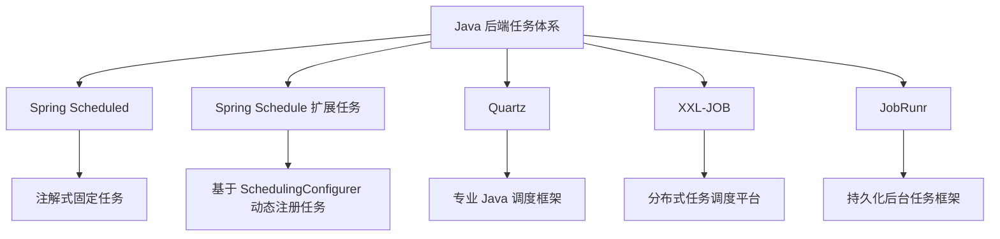

>基于 Spring Scheduling 的扩展点，把多个任务自动注册进调度器，实现一种“轻量级动态任务调度能力”。

[[Spring-Schedule、Quartz、XXL-Job 学习指南]]
[[JobRunr：Java 持久化后台任务框架]]

---

# 1. “Spring-Schedule 扩展任务”到底是什么？

普通写法是：

```java
@Scheduled(cron = "0/3 * * * * ?")
public void execute() {
    log.info("执行任务");
}
```

这种写法的问题是：

|问题|说明|
|---|---|
|cron 写死在注解里|改任务周期需要改代码或配置|
|任务注册方式固定|每个任务都写一个 `@Scheduled`|
|不适合统一管理|无法方便地批量注册、暂停、替换|
|扩展性弱|很难做自己的任务框架|

所谓 **Spring-Schedule 扩展任务**，本质是绕开固定注解，使用 Spring 提供的调度扩展 API，例如：

```text
SchedulingConfigurer
ScheduledTaskRegistrar
TriggerTask
CronTrigger
TaskScheduler
```

自己把任务注册进去。

小傅哥文章里也明确把这一节放在“扩展 Spring-Schedule 自动增加任务”这个方向，而不是单纯解释 `@Scheduled` 注解。腾讯云转载页里保留了这个描述。([腾讯云](https://cloud.tencent.com/developer/article/2324542?utm_source=chatgpt.com "Quartz、Schedule、XXL-Job 3种任务的极简使用教程 - Docker 自动化配置自动导入库表！-腾讯云开发者社区-腾讯云"))

---

# 2. 它在体系里的位置

重新补图应该是这样：



准确定位：

|方案|定位|
|---|---|
|`@Scheduled`|Spring 自带的简单注解式定时任务|
|**Spring-Schedule 扩展任务**|基于 Spring 调度 SPI 做轻量动态任务注册|
|Quartz|更完整的 Java 调度框架|
|XXL-JOB|平台化分布式任务调度系统|
|JobRunr|持久化后台任务队列 / 后台任务框架|

---

# 3. 最核心的扩展点：`SchedulingConfigurer`

Spring 提供了一个接口：

```java
public interface SchedulingConfigurer {
    void configureTasks(ScheduledTaskRegistrar taskRegistrar);
}
```

你实现它之后，就可以自己向 `ScheduledTaskRegistrar` 注册任务。

## 示例：动态 Cron 任务

```java
@Slf4j
@Configuration
@EnableScheduling
@RequiredArgsConstructor
public class DynamicScheduleConfig implements SchedulingConfigurer {

    private final DynamicCronService dynamicCronService;
    private final OrderApplicationService orderApplicationService;

    @Override
    public void configureTasks(ScheduledTaskRegistrar taskRegistrar) {

        taskRegistrar.addTriggerTask(
                // 任务逻辑
                () -> {
                    log.info("[DynamicSchedule] close timeout orders start");
                    orderApplicationService.closeTimeoutOrders(100);
                    log.info("[DynamicSchedule] close timeout orders end");
                },

                // 触发规则
                triggerContext -> {
                    String cron = dynamicCronService.getCron("close-timeout-order");

                    if (!StringUtils.hasText(cron)) {
                        cron = "0 */5 * * * ?";
                    }

                    return new CronTrigger(cron).nextExecution(triggerContext);
                }
        );
    }
}
```

`dynamicCronService.getCron(...)` 可以来自：

```text
application.yml
数据库
Nacos
Apollo
Redis
管理后台配置
```

这样 cron 不再固定写死在注解里。

---

# 4. 示例：从数据库读取任务配置

假设你有一张表：

```sql
create table schedule_task_config (
    id bigint primary key auto_increment,
    task_code varchar(128) not null,
    task_name varchar(128) not null,
    cron varchar(64) not null,
    enabled tinyint not null default 1,
    created_at datetime not null,
    updated_at datetime not null,
    unique key uk_task_code(task_code)
);
```

配置服务：

```java
@Service
@RequiredArgsConstructor
public class DynamicCronService {

    private final JdbcTemplate jdbcTemplate;

    public String getCron(String taskCode) {
        return jdbcTemplate.queryForObject("""
            select cron
            from schedule_task_config
            where task_code = ?
              and enabled = 1
            """, String.class, taskCode);
    }
}
```

注册任务：

```java
@Slf4j
@Configuration
@EnableScheduling
@RequiredArgsConstructor
public class DbDynamicScheduleConfig implements SchedulingConfigurer {

    private final DynamicCronService dynamicCronService;
    private final PaymentApplicationService paymentApplicationService;

    @Override
    public void configureTasks(ScheduledTaskRegistrar registrar) {
        registrar.addTriggerTask(
                this::runPaymentCompensateJob,
                context -> {
                    String cron = dynamicCronService.getCron("payment-compensate");
                    return new CronTrigger(cron).nextExecution(context);
                }
        );
    }

    private void runPaymentCompensateJob() {
        paymentApplicationService.compensateTimeoutPayments(100);
    }
}
```

这就实现了：

```text
改数据库 cron
下一轮调度自动生效
不用重启应用
不用改代码
```

---

# 5. 多任务自动注册：更接近“小型任务框架”

如果你不想每个任务都手动写一段 `addTriggerTask`，可以定义一个统一接口。

## 5.1 定义任务接口

```java
public interface DynamicScheduleTask {

    /**
     * 任务编码，全局唯一。
     */
    String taskCode();

    /**
     * 任务执行逻辑。
     */
    void execute();
}
```

## 5.2 写具体任务

```java
@Slf4j
@Component
@RequiredArgsConstructor
public class CloseTimeoutOrderTask implements DynamicScheduleTask {

    private final OrderApplicationService orderApplicationService;

    @Override
    public String taskCode() {
        return "close-timeout-order";
    }

    @Override
    public void execute() {
        log.info("[CloseTimeoutOrderTask] start");
        orderApplicationService.closeTimeoutOrders(100);
        log.info("[CloseTimeoutOrderTask] end");
    }
}
```

```java
@Slf4j
@Component
@RequiredArgsConstructor
public class PaymentCompensateTask implements DynamicScheduleTask {

    private final PaymentApplicationService paymentApplicationService;

    @Override
    public String taskCode() {
        return "payment-compensate";
    }

    @Override
    public void execute() {
        log.info("[PaymentCompensateTask] start");
        paymentApplicationService.compensateTimeoutPayments(100);
        log.info("[PaymentCompensateTask] end");
    }
}
```

## 5.3 自动注册所有任务

```java
@Slf4j
@Configuration
@EnableScheduling
@RequiredArgsConstructor
public class DynamicTaskRegistrarConfig implements SchedulingConfigurer {

    private final List<DynamicScheduleTask> tasks;
    private final ScheduleTaskConfigService configService;

    @Override
    public void configureTasks(ScheduledTaskRegistrar registrar) {
        for (DynamicScheduleTask task : tasks) {
            registrar.addTriggerTask(
                    () -> runTask(task),
                    context -> nextExecutionTime(task, context)
            );
        }
    }

    private void runTask(DynamicScheduleTask task) {
        try {
            log.info("[DynamicTask] taskCode={} start", task.taskCode());
            task.execute();
            log.info("[DynamicTask] taskCode={} success", task.taskCode());
        } catch (Exception e) {
            log.error("[DynamicTask] taskCode={} failed", task.taskCode(), e);
            throw e;
        }
    }

    private Instant nextExecutionTime(DynamicScheduleTask task, TriggerContext context) {
        ScheduleTaskConfig config = configService.getByTaskCode(task.taskCode());

        if (config == null || !config.enabled()) {
            // 禁用时，给一个很远的下次执行时间，避免持续触发
            return Instant.now().plus(Duration.ofDays(3650));
        }

        return new CronTrigger(config.cron()).nextExecution(context);
    }
}
```

这样你每新增一个任务，只需要：

```text
1. 实现 DynamicScheduleTask
2. 数据库加一条 task_code + cron
3. 应用启动时自动注册
```

这就是“Spring-Schedule 扩展任务”的工程意义。

---

# 6. 它和 Quartz 的区别

很多人会问：

> 都能动态 cron，那为什么不用 Quartz？

区别在这里：

|维度|Spring-Schedule 扩展任务|Quartz|
|---|---|---|
|技术复杂度|低|中|
|持久化 Job|需要自己做|原生支持 JDBC JobStore|
|动态任务|可以做，但要自己封装|原生支持|
|Misfire|弱，需要自己处理|原生支持|
|集群|不原生支持|支持 JDBC 集群|
|Dashboard|无|无，需自建|
|适合场景|轻量动态任务|更正式的调度框架|
|生产稳健性|取决于你封装|框架能力更完整|

所以它的定位不是替代 Quartz，而是：

> 当你觉得 `@Scheduled` 太死板，但上 Quartz / XXL-JOB 又太重时，可以用 Spring-Schedule 扩展任务做一个轻量方案。

---

# 7. 生产风险：它不解决多实例重复执行

这是重点。

如果你有三个服务实例：

```text
order-service-1
order-service-2
order-service-3
```

每个实例都会执行：

```java
configureTasks(...)
```

那么每个实例都会注册同样的任务。

结果就是：

```text
同一个任务可能被 3 个节点同时执行
```

所以 Spring-Schedule 扩展任务仍然必须配合：

```text
Redis 分布式锁
数据库锁
ShedLock
只在单独 job 实例部署
K8s leader election
```

例如加 Redis 锁：

```java
private void runTask(DynamicScheduleTask task) {
    String lockKey = "schedule:lock:" + task.taskCode();
    String token = UUID.randomUUID().toString();

    Boolean locked = redisTemplate.opsForValue()
            .setIfAbsent(lockKey, token, Duration.ofMinutes(5));

    if (!Boolean.TRUE.equals(locked)) {
        log.info("[DynamicTask] taskCode={} lock failed, skip", task.taskCode());
        return;
    }

    try {
        task.execute();
    } finally {
        releaseLock(lockKey, token);
    }
}
```

否则它只是“动态调度”，不是“分布式调度”。

---

# 8. 这一节应该怎么补进你的笔记？

建议加在 `@Scheduled` 后、Quartz 前。

目录调整为：

```text
01学习笔记/
└── Java后端/
    └── 任务调度与后台任务/
        ├── 01-任务调度体系总览：Scheduled、Spring-Schedule扩展、Quartz、XXL-JOB、JobRunr.md
        ├── 02-Spring Scheduled：轻量定时任务与多实例问题.md
        ├── 03-Spring-Schedule扩展任务：动态Cron与自动注册.md
        ├── 04-Quartz：Job、Trigger、Scheduler、JobStore.md
        ├── 05-Quartz集群、Misfire与生产坑.md
        ├── 06-XXL-JOB：分布式任务调度平台.md
        ├── 07-JobRunr：Java持久化后台任务框架.md
        └── 08-生产级任务设计：幂等、补偿、分片、重试、告警.md
```

---

# 9. 补一张选择表

|方案|什么时候用|
|---|---|
|`@Scheduled`|任务固定、简单、不需要动态配置|
|**Spring-Schedule 扩展任务**|想基于 Spring 原生能力做轻量动态 cron|
|Quartz|需要更完整的 Job / Trigger / Misfire / JDBC 集群|
|XXL-JOB|需要调度中心、执行日志、运维控制台、分片广播|
|JobRunr|需要持久化后台任务、延迟任务、异步任务、失败重试|

---

# 10. 面试表达

可以这样说：

> Spring `@Scheduled` 适合简单固定任务。如果需要动态调整 cron，但又不想引入 Quartz，可以实现 `SchedulingConfigurer`，通过 `ScheduledTaskRegistrar` 动态注册 `TriggerTask`。任务的下一次执行时间可以从数据库、配置中心或管理后台读取，从而实现轻量级动态调度。

再补一句生产意识：

> 但这种扩展方案只解决“动态调度配置”问题，不解决集群互斥、任务持久化、Misfire、执行日志和失败重试。所以多实例部署时仍然要配合分布式锁；如果调度治理要求更高，应该升级到 Quartz、XXL-JOB 或 JobRunr。