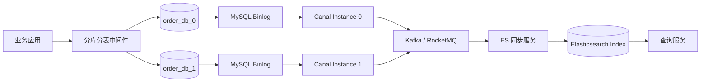
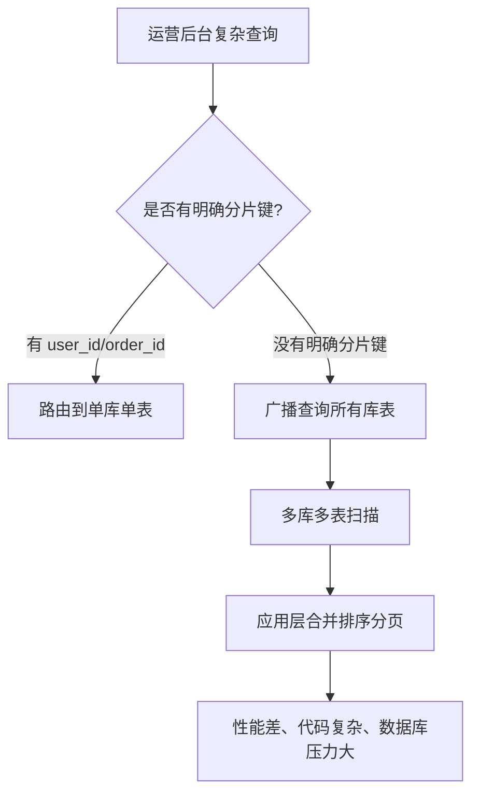
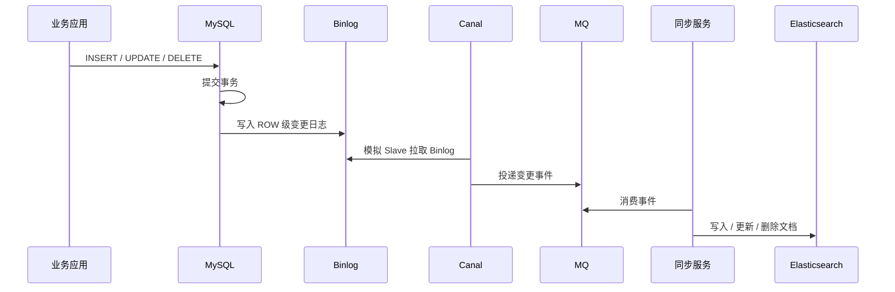
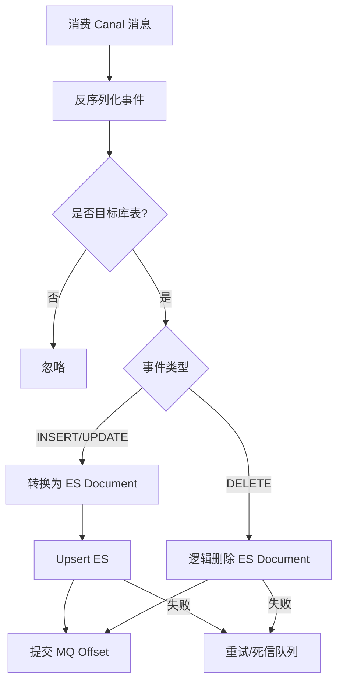
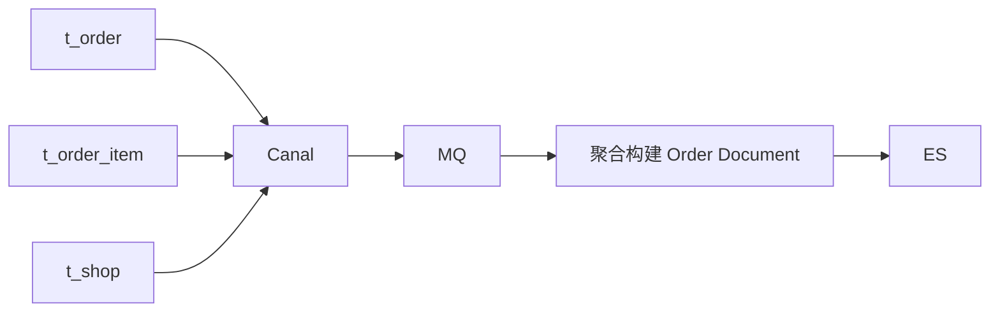
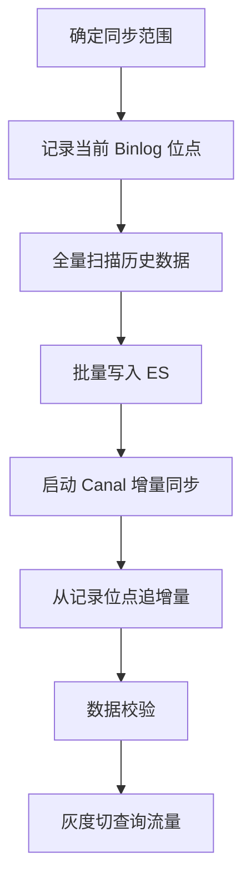
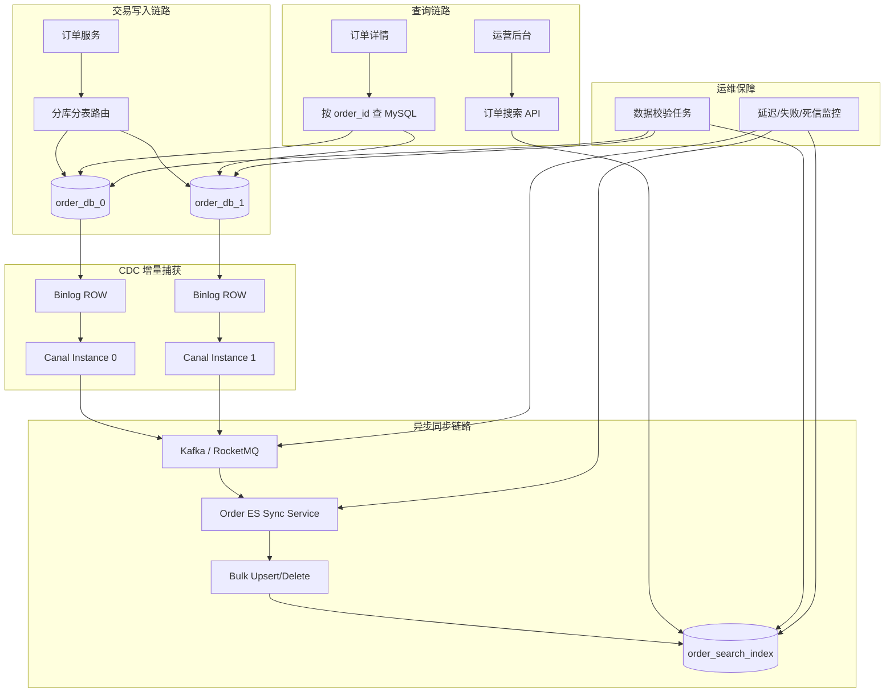

## 0. 结论先行

这个主题的本质不是“Canal 怎么用”，而是：

> **在分库分表之后，MySQL 适合做交易型写入，Elasticsearch 适合做搜索、聚合、筛选和宽表查询。Canal 负责从 MySQL Binlog 中捕获增量变更，把多个分片表的数据异构同步到 ES，构建一个面向查询的统一索引。**

一句话架构：



生产级推荐不是：

> MySQL → Canal → 直接写 ES

而是：

> **MySQL → Canal → MQ → 同步服务 → Elasticsearch**

原因很简单：**MQ 是缓冲层、削峰层、重试层、解耦层，也是故障恢复的安全垫。**

Canal 官方定位是基于 MySQL 增量日志解析，提供增量数据订阅与消费，常见用途包括数据库镜像、实时备份、索引构建、缓存刷新、带业务逻辑的增量处理等。Canal 的典型原理是模拟 MySQL Slave，从 MySQL Master 拉取 Binlog 并解析变更事件。([GitHub](https://github.com/alibaba/canal?utm_source=chatgpt.com "alibaba/canal: 阿里巴巴MySQL binlog 增量订阅&消费组件"))

---

# 1. 为什么分库分表后，还要同步到 Elasticsearch？

## 1.1 分库分表解决的是写入和容量问题

例如订单表：

```text
order_db_0.t_order_00
order_db_0.t_order_01
order_db_1.t_order_00
order_db_1.t_order_01
```

按照 `user_id` 或 `order_id` 做分片后，写入压力被打散了。

这解决了：

|问题|分库分表是否擅长|
|---|---|
|单表数据量过大|擅长|
|单库写入压力过高|擅长|
|单库连接数瓶颈|擅长|
|按分片键查询|擅长|
|跨库聚合统计|不擅长|
|多条件搜索|不擅长|
|模糊搜索|不擅长|
|运营后台复杂筛选|不擅长|

## 1.2 分库分表之后，查询问题会变得更明显

假设运营后台要查：

```text
查询最近 7 天内：
- 状态为已支付
- 金额大于 500
- 收货城市为杭州
- 商品名称包含“机械键盘”
- 按支付时间倒序分页
```

如果只查 MySQL，问题会很明显：



分库分表系统最怕的不是写入，而是：

> **没有分片键的全局查询。**

所以生产系统通常会引入：

```text
MySQL：负责交易事实、强一致写入
Elasticsearch：负责搜索、筛选、聚合、宽表查询
```

---

# 2. 为什么用 Binlog，而不是业务代码双写？

## 2.1 业务代码双写的问题

最直接的方案是：

```java
orderMapper.insert(order);
elasticsearchClient.index(orderDocument);
```

看起来简单，但生产上风险很高。

|风险|说明|
|---|---|
|事务不一致|MySQL 成功，ES 失败怎么办？|
|业务侵入|每个写接口都要考虑同步逻辑|
|漏写风险|新增一个更新接口，忘记同步 ES|
|重试复杂|ES 失败后如何补偿？|
|耦合严重|交易链路被搜索系统拖慢|
|扩展差|后续同步缓存、数仓、风控也要继续改业务代码|

## 2.2 Binlog 同步的优势

MySQL 本身已经把所有数据变更写入 Binlog。Canal 通过订阅 Binlog 获得变更事件，本质上是做 Change Data Capture，也就是 CDC。



这种方式的工程价值是：

|维度|Binlog 同步优势|
|---|---|
|业务侵入性|低|
|数据完整性|能捕获所有数据库变更|
|扩展能力|可同时同步 ES、缓存、数仓|
|链路解耦|不影响主交易链路|
|可补偿性|可根据位点、消息、快照重放|

注意：这不是强一致方案，而是**最终一致方案**。

---

# 3. Canal 的核心原理：把自己伪装成 MySQL 从库

Canal 的关键点是：

> **它不是轮询数据库表，而是模拟 MySQL Slave 协议，读取 MySQL Binlog。**

官方文档中也明确说明，Canal Server 可以解析 MySQL Binlog 并订阅数据变更，Canal Client 可以把变更广播到数据库、Kafka 等下游。([GitHub](https://github.com/alibaba/canal/wiki/Introduction?utm_source=chatgpt.com "Introduction · alibaba/canal Wiki"))

## 3.1 MySQL 必须开启 Binlog

典型配置：

```ini
[mysqld]
# 开启 binlog
log-bin=mysql-bin

# 每个 MySQL Server 必须唯一
server-id=1

# 推荐 ROW 格式，Canal 同步数据必须依赖行级变更
binlog_format=ROW

# 建议 FULL，便于 UPDATE / DELETE 时拿到完整行信息
binlog_row_image=FULL
```

为什么必须用 `ROW`？

|Binlog 格式|是否适合同步 ES|原因|
|---|--:|---|
|STATEMENT|不适合|记录 SQL，不一定包含完整行数据|
|ROW|适合|记录每一行的变更前后数据|
|MIXED|不推荐|行为不够稳定，排查复杂|

## 3.2 Canal 读到的不是 SQL，而是行变更事件

例如业务执行：

```sql
UPDATE t_order_01
SET order_status = 'PAID', pay_time = NOW()
WHERE order_id = 100001;
```

Canal 解析后更关心的是：

```json
{
  "database": "order_db_0",
  "table": "t_order_01",
  "type": "UPDATE",
  "before": {
    "order_status": "CREATED",
    "pay_time": null
  },
  "after": {
    "order_id": 100001,
    "user_id": 888,
    "order_status": "PAID",
    "pay_time": "2026-05-17 20:10:00"
  }
}
```

这才是同步 ES 真正需要的数据。

---

# 4. 生产级架构：不要让 Canal 直接写 ES

## 4.1 简化版架构

学习阶段可以这样：

```text
MySQL → Canal → Java Client → Elasticsearch
```

但生产建议这样：

```text
MySQL → Canal → Kafka / RocketMQ → Sync Service → Elasticsearch
```

## 4.2 为什么中间要加 MQ？

|没有 MQ|有 MQ|
|---|---|
|Canal 与 ES 强耦合|Canal 只负责投递事件|
|ES 慢会拖慢 Canal 消费|MQ 可缓冲|
|失败重试困难|消费者可重试|
|扩展下游困难|多消费者订阅即可|
|峰值流量扛不住|MQ 削峰|
|回放困难|MQ 保留消息可回放|

Elasticsearch 官方也建议多文档写入使用 Bulk API，因为 Bulk 可以把多个 index、create、delete、update 操作合并到一个请求中，降低请求开销并提升索引吞吐。([elastic.co](https://www.elastic.co/guide/en/elasticsearch/client/java-api-client/8.19/indexing-bulk.html?utm_source=chatgpt.com "Bulk: indexing multiple documents | Elasticsearch Java API ..."))

---

# 5. 案例场景：订单分库分表同步到 ES

## 5.1 业务背景

我们设计一个接近生产的订单查询场景。

### MySQL 分库分表

```text
order_db_0
  ├── t_order_00
  └── t_order_01

order_db_1
  ├── t_order_00
  └── t_order_01
```

### 分片规则

```text
库路由：user_id % 2
表路由：order_id % 2
```

### ES 统一索引

```text
order_search_index
```

无论订单来自哪个库、哪个表，最终都同步到同一个 ES 索引。

---

# 6. MySQL 表设计：交易表不要为了 ES 查询而过度膨胀

## 6.1 订单主表

```sql
CREATE TABLE t_order_00 (
    id BIGINT PRIMARY KEY AUTO_INCREMENT COMMENT '自增主键',
    order_id BIGINT NOT NULL COMMENT '订单ID，全局唯一',
    user_id BIGINT NOT NULL COMMENT '用户ID，分库键',
    order_no VARCHAR(64) NOT NULL COMMENT '订单号',
    order_status VARCHAR(32) NOT NULL COMMENT '订单状态',
    total_amount DECIMAL(10,2) NOT NULL COMMENT '订单金额',
    pay_time DATETIME NULL COMMENT '支付时间',
    receiver_city VARCHAR(64) NULL COMMENT '收货城市',
    create_time DATETIME NOT NULL COMMENT '创建时间',
    update_time DATETIME NOT NULL COMMENT '更新时间',
    deleted TINYINT NOT NULL DEFAULT 0 COMMENT '逻辑删除标记',
    UNIQUE KEY uk_order_id (order_id),
    KEY idx_user_id (user_id),
    KEY idx_create_time (create_time)
) COMMENT='订单表';
```

## 6.2 为什么 MySQL 表不直接设计成搜索宽表？

因为 MySQL 是交易存储，不是搜索引擎。

订单查询可能需要：

```text
订单信息
用户昵称
商品名称
店铺名称
收货地址
优惠券信息
支付方式
物流状态
```

如果全部塞进订单主表，会造成：

|问题|结果|
|---|---|
|字段膨胀|表越来越宽|
|更新频繁|行锁冲突增加|
|索引复杂|写入性能下降|
|职责混乱|交易模型和查询模型耦合|

更合理的是：

```text
MySQL 交易模型：范式化、保证写入正确
ES 查询模型：反范式宽表、面向搜索体验
```

---

# 7. ES 索引设计：同步不是简单复制 MySQL 字段

## 7.1 ES Document 示例

```json
{
  "orderId": 100001,
  "userId": 888,
  "orderNo": "ORDER_202605170001",
  "orderStatus": "PAID",
  "totalAmount": 599.00,
  "payTime": "2026-05-17T20:10:00",
  "receiverCity": "杭州",
  "goodsNames": ["机械键盘", "鼠标垫"],
  "shopName": "极客数码旗舰店",
  "searchText": "机械键盘 鼠标垫 极客数码旗舰店 杭州",
  "createTime": "2026-05-17T19:50:00",
  "updateTime": "2026-05-17T20:10:00",
  "deleted": false
}
```

## 7.2 ES Mapping 示例

```json
PUT order_search_index
{
  "mappings": {
    "properties": {
      "orderId": {
        "type": "long"
      },
      "userId": {
        "type": "long"
      },
      "orderNo": {
        "type": "keyword"
      },
      "orderStatus": {
        "type": "keyword"
      },
      "totalAmount": {
        "type": "scaled_float",
        "scaling_factor": 100
      },
      "payTime": {
        "type": "date"
      },
      "receiverCity": {
        "type": "keyword"
      },
      "goodsNames": {
        "type": "text",
        "analyzer": "ik_max_word",
        "fields": {
          "keyword": {
            "type": "keyword"
          }
        }
      },
      "shopName": {
        "type": "text",
        "analyzer": "ik_max_word"
      },
      "searchText": {
        "type": "text",
        "analyzer": "ik_max_word"
      },
      "createTime": {
        "type": "date"
      },
      "updateTime": {
        "type": "date"
      },
      "deleted": {
        "type": "boolean"
      }
    }
  }
}
```

## 7.3 设计原则

|字段类型|ES 类型建议|
|---|---|
|ID、订单号、状态|keyword / long|
|金额|scaled_float|
|时间|date|
|城市、枚举|keyword|
|商品名、店铺名|text + analyzer|
|综合搜索字段|text|
|删除状态|boolean|

重点：

> **ES 索引是查询模型，不是 MySQL 表结构的 1:1 复制。**

---

# 8. Canal 事件到 ES 文档的映射规则

## 8.1 事件类型处理

|Binlog 事件|ES 操作|
|---|---|
|INSERT|index / upsert|
|UPDATE|update / upsert|
|DELETE|delete 或逻辑删除|
|DDL|通常不自动处理，需人工管控|

生产上更推荐：

```text
INSERT → upsert
UPDATE → upsert
DELETE → 逻辑删除或 delete
```

为什么不是严格 insert/update？

因为 Canal/MQ 消费存在重复投递、乱序、重试等情况。

**upsert 更适合最终一致系统。**

## 8.2 ES 文档 ID 必须稳定

不要使用 ES 自动生成 `_id`。

应该使用：

```text
_id = order_id
```

原因：

|做法|结果|
|---|---|
|ES 自动生成 ID|重复同步会产生多份文档|
|使用 order_id 作为 ID|重复同步会覆盖同一份文档，天然幂等|

---

# 9. Java 同步服务核心代码设计

下面给一个生产思路清晰的代码骨架，不是玩具 demo。

## 9.1 Canal 事件模型

```java
/**
 * Canal 解析后的标准化变更事件。
 * 注意：这里不直接暴露 Canal 原始结构，而是转换成业务内部统一事件模型。
 */
public class CanalChangeEvent {

    /**
     * 数据库名，例如 order_db_0
     */
    private String database;

    /**
     * 表名，例如 t_order_00
     */
    private String table;

    /**
     * 操作类型：INSERT、UPDATE、DELETE
     */
    private String eventType;

    /**
     * 业务主键，订单场景中通常是 order_id
     */
    private Long businessId;

    /**
     * 变更后的行数据。
     * INSERT/UPDATE 场景使用 afterData。
     */
    private Map<String, Object> afterData;

    /**
     * 变更前的行数据。
     * DELETE 或需要判断字段变化时使用 beforeData。
     */
    private Map<String, Object> beforeData;

    /**
     * Binlog 文件名，用于排查和位点追踪
     */
    private String binlogFile;

    /**
     * Binlog 偏移量，用于排查和幂等控制
     */
    private Long binlogOffset;

    /**
     * 事件发生时间
     */
    private Long executeTime;

    // getter/setter 省略
}
```

## 9.2 订单 ES 文档模型

```java
/**
 * 面向 Elasticsearch 的订单查询文档。
 * 它是查询模型，不等于 MySQL 的订单表结构。
 */
public class OrderSearchDocument {

    private Long orderId;

    private Long userId;

    private String orderNo;

    private String orderStatus;

    private BigDecimal totalAmount;

    private LocalDateTime payTime;

    private String receiverCity;

    /**
     * 商品名称集合，通常来自订单明细表或商品快照。
     */
    private List<String> goodsNames;

    /**
     * 店铺名称，可能需要通过店铺服务或本地快照补全。
     */
    private String shopName;

    /**
     * 综合搜索字段，用于后台搜索框。
     */
    private String searchText;

    private LocalDateTime createTime;

    private LocalDateTime updateTime;

    private Boolean deleted;

    /**
     * 数据版本，用于乱序事件控制。
     */
    private Long version;

    // getter/setter 省略
}
```

## 9.3 事件转换器

```java
@Component
public class OrderCanalEventConverter {

    /**
     * 将 Canal 行变更事件转换为 ES 查询文档。
     * 注意：这里只做基础字段转换，复杂字段可以通过二次查询或异步补全。
     */
    public OrderSearchDocument convert(CanalChangeEvent event) {
        Map<String, Object> row = event.getAfterData();

        OrderSearchDocument document = new OrderSearchDocument();

        document.setOrderId(getLong(row, "order_id"));
        document.setUserId(getLong(row, "user_id"));
        document.setOrderNo(getString(row, "order_no"));
        document.setOrderStatus(getString(row, "order_status"));
        document.setTotalAmount(getBigDecimal(row, "total_amount"));
        document.setReceiverCity(getString(row, "receiver_city"));
        document.setPayTime(getLocalDateTime(row, "pay_time"));
        document.setCreateTime(getLocalDateTime(row, "create_time"));
        document.setUpdateTime(getLocalDateTime(row, "update_time"));

        // MySQL 中 deleted 通常是 0/1，ES 中转换为 boolean 更适合查询
        Integer deleted = getInteger(row, "deleted");
        document.setDeleted(deleted != null && deleted == 1);

        // 使用 Binlog offset 或 update_time 作为版本依据，避免旧事件覆盖新事件
        document.setVersion(event.getBinlogOffset());

        // 基础搜索字段，复杂场景可补充商品名、店铺名、用户昵称等
        document.setSearchText(buildSearchText(document));

        return document;
    }

    private String buildSearchText(OrderSearchDocument document) {
        StringBuilder builder = new StringBuilder();

        if (document.getOrderNo() != null) {
            builder.append(document.getOrderNo()).append(" ");
        }
        if (document.getReceiverCity() != null) {
            builder.append(document.getReceiverCity()).append(" ");
        }
        if (document.getShopName() != null) {
            builder.append(document.getShopName()).append(" ");
        }
        if (document.getGoodsNames() != null) {
            document.getGoodsNames().forEach(name -> builder.append(name).append(" "));
        }

        return builder.toString().trim();
    }

    private Long getLong(Map<String, Object> row, String key) {
        Object value = row.get(key);
        return value == null ? null : Long.valueOf(value.toString());
    }

    private String getString(Map<String, Object> row, String key) {
        Object value = row.get(key);
        return value == null ? null : value.toString();
    }

    private Integer getInteger(Map<String, Object> row, String key) {
        Object value = row.get(key);
        return value == null ? null : Integer.valueOf(value.toString());
    }

    private BigDecimal getBigDecimal(Map<String, Object> row, String key) {
        Object value = row.get(key);
        return value == null ? null : new BigDecimal(value.toString());
    }

    private LocalDateTime getLocalDateTime(Map<String, Object> row, String key) {
        Object value = row.get(key);
        if (value == null) {
            return null;
        }

        // 实际项目中建议统一使用 DateTimeFormatter，并处理时区问题
        return LocalDateTime.parse(value.toString().replace(" ", "T"));
    }
}
```

---

# 10. ES 写入服务：必须考虑幂等、重试、Bulk

## 10.1 单条 Upsert 写入

```java
@Service
public class OrderSearchIndexService {

    private static final String INDEX_NAME = "order_search_index";

    private final ElasticsearchClient elasticsearchClient;

    public OrderSearchIndexService(ElasticsearchClient elasticsearchClient) {
        this.elasticsearchClient = elasticsearchClient;
    }

    /**
     * 使用 orderId 作为 ES 文档 ID。
     * 这样重复消费同一条 Canal 事件时，会覆盖同一个文档，而不是产生重复数据。
     */
    public void upsert(OrderSearchDocument document) {
        try {
            elasticsearchClient.index(request -> request
                    .index(INDEX_NAME)
                    .id(String.valueOf(document.getOrderId()))
                    .document(document)
            );
        } catch (IOException e) {
            // 生产环境不要只打印日志，应抛出异常交给 MQ 重试或进入死信队列
            throw new EsSyncException("同步订单文档到 ES 失败, orderId=" + document.getOrderId(), e);
        }
    }

    /**
     * 逻辑删除比物理删除更利于排查问题。
     * 如果业务确认不需要保留，也可以调用 delete API。
     */
    public void markDeleted(Long orderId) {
        try {
            Map<String, Object> partialDoc = new HashMap<>();
            partialDoc.put("deleted", true);
            partialDoc.put("updateTime", LocalDateTime.now().toString());

            elasticsearchClient.update(request -> request
                            .index(INDEX_NAME)
                            .id(String.valueOf(orderId))
                            .doc(partialDoc),
                    Map.class
            );
        } catch (IOException e) {
            throw new EsSyncException("标记订单 ES 文档删除失败, orderId=" + orderId, e);
        }
    }
}
```

## 10.2 自定义异常

```java
/**
 * ES 同步异常。
 * 通过业务异常包装底层 IOException，便于 MQ 消费框架统一处理重试。
 */
public class EsSyncException extends RuntimeException {

    public EsSyncException(String message, Throwable cause) {
        super(message, cause);
    }
}
```

## 10.3 批量写入 Bulk

生产环境中，如果每条 Canal 事件都单独写 ES，吞吐会很差。

更合理的是：

```text
攒一批事件 → Bulk 写 ES → 部分失败单独重试
```

Elasticsearch 官方文档明确说明，Bulk 请求可以在一个请求中发送多个文档相关操作，多文档写入时比逐条请求更高效。([elastic.co](https://www.elastic.co/guide/en/elasticsearch/client/java-api-client/8.19/indexing-bulk.html?utm_source=chatgpt.com "Bulk: indexing multiple documents | Elasticsearch Java API ..."))

示例：

```java
@Service
public class OrderSearchBulkIndexService {

    private static final String INDEX_NAME = "order_search_index";

    private final ElasticsearchClient elasticsearchClient;

    public OrderSearchBulkIndexService(ElasticsearchClient elasticsearchClient) {
        this.elasticsearchClient = elasticsearchClient;
    }

    /**
     * 批量写入订单文档。
     * 生产环境中建议结合 MQ 批量消费、定时 flush、最大批次大小控制。
     */
    public void bulkUpsert(List<OrderSearchDocument> documents) {
        if (documents == null || documents.isEmpty()) {
            return;
        }

        BulkRequest.Builder builder = new BulkRequest.Builder();

        for (OrderSearchDocument document : documents) {
            builder.operations(operation -> operation
                    .index(index -> index
                            .index(INDEX_NAME)
                            .id(String.valueOf(document.getOrderId()))
                            .document(document)
                    )
            );
        }

        try {
            BulkResponse response = elasticsearchClient.bulk(builder.build());

            // Bulk 可能出现部分成功、部分失败，不能只判断请求是否抛异常
            if (response.errors()) {
                response.items().forEach(item -> {
                    if (item.error() != null) {
                        // 生产环境应记录 orderId、错误原因，并投递到重试队列或死信队列
                        throw new EsSyncException(
                                "ES Bulk 部分写入失败, id=" + item.id() + ", reason=" + item.error().reason(),
                                null
                        );
                    }
                });
            }
        } catch (IOException e) {
            throw new EsSyncException("ES Bulk 写入失败, size=" + documents.size(), e);
        }
    }
}
```

---

# 11. MQ 消费者：最终一致系统的核心控制点

## 11.1 消费流程



## 11.2 消费者代码骨架

```java
@Component
public class OrderCanalMessageConsumer {

    private final OrderCanalEventConverter converter;
    private final OrderSearchIndexService indexService;

    public OrderCanalMessageConsumer(OrderCanalEventConverter converter,
                                     OrderSearchIndexService indexService) {
        this.converter = converter;
        this.indexService = indexService;
    }

    /**
     * 消费 Canal 变更事件。
     * 这里用普通方法表达核心逻辑，实际项目中可以接入 KafkaListener 或 RocketMQListener。
     */
    public void consume(CanalChangeEvent event) {
        if (!isOrderTable(event)) {
            return;
        }

        switch (event.getEventType()) {
            case "INSERT":
            case "UPDATE":
                OrderSearchDocument document = converter.convert(event);
                indexService.upsert(document);
                break;

            case "DELETE":
                Long orderId = extractOrderIdForDelete(event);
                indexService.markDeleted(orderId);
                break;

            default:
                // DDL 或未知事件不建议自动处理，避免误操作 ES Mapping
                break;
        }
    }

    /**
     * 判断是否为订单分片表。
     */
    private boolean isOrderTable(CanalChangeEvent event) {
        return event.getDatabase() != null
                && event.getDatabase().startsWith("order_db_")
                && event.getTable() != null
                && event.getTable().startsWith("t_order_");
    }

    /**
     * DELETE 事件通常需要从 beforeData 中提取业务主键。
     */
    private Long extractOrderIdForDelete(CanalChangeEvent event) {
        Object value = event.getBeforeData().get("order_id");
        if (value == null) {
            throw new IllegalArgumentException("DELETE 事件缺少 order_id");
        }
        return Long.valueOf(value.toString());
    }
}
```

---

# 12. 分库分表同步到 ES 的核心难点

## 12.1 多库多表如何合并成一个 ES 索引？

关键点：

```text
order_db_0.t_order_00
order_db_0.t_order_01
order_db_1.t_order_00
order_db_1.t_order_01
        ↓
order_search_index
```

同步服务不应该关心物理分片，只关心业务主键。

|来源|处理方式|
|---|---|
|database|用于识别来源和排查|
|table|用于识别分片表|
|order_id|作为 ES `_id`|
|user_id|作为查询字段|
|binlog position|用于追踪和恢复|

## 12.2 多表 Join 信息怎么办？

订单搜索页一般不是只查订单主表。

可能还需要：

```text
订单明细
商品名称
店铺信息
用户信息
支付信息
物流信息
```

有三种方案。

### 方案一：只同步订单主表

适合学习阶段。

优点：简单。

缺点：搜索字段少，查询体验差。

### 方案二：Canal 监听多张表，在同步服务聚合



优点：查询模型完整。

缺点：实现复杂，需要处理多表事件顺序。

### 方案三：收到订单事件后，反查 MySQL 构建宽表

```text
Canal 监听订单主表变更
        ↓
同步服务根据 order_id 回查订单、订单明细、商品快照
        ↓
构建完整 ES Document
```

优点：实现相对简单，文档完整。

缺点：同步服务会对 MySQL 产生额外查询压力。

生产建议：

|阶段|推荐方案|
|---|---|
|学习 / 小项目|方案一|
|中型业务|方案三|
|高并发复杂业务|方案二 + 缓存/本地快照|

---

# 13. 一致性问题：必须接受“最终一致”

## 13.1 这套方案不是强一致

数据链路是：

```text
MySQL commit → Binlog → Canal → MQ → Consumer → ES refresh
```

所以存在延迟。

可能出现：

```text
用户刚下单成功
MySQL 已经有数据
ES 暂时查不到
几十毫秒到几秒后 ES 才可见
```

这不是 Bug，而是 CDC + ES 架构的基本特征。

## 13.2 哪些查询不能依赖 ES？

|查询类型|是否适合 ES|
|---|--:|
|订单详情页|不建议，优先 MySQL|
|支付状态判断|不建议，必须 MySQL|
|运营后台搜索|适合|
|用户订单列表|看场景，强一致要求高则 MySQL|
|商品搜索|适合|
|聚合统计|适合，但要接受延迟|

一句话：

> **交易正确性查 MySQL，搜索体验查 ES。**

---

# 14. 幂等设计：同步系统的生命线

## 14.1 重复消费一定会发生

可能原因：

```text
MQ 重试
Consumer 重启
Canal 重连
Offset 提交失败
网络抖动
ES 写入超时但实际成功
```

所以消费者必须默认：

> **同一条事件可能被处理多次。**

## 14.2 幂等手段

|手段|作用|
|---|---|
|ES `_id = order_id`|避免重复文档|
|upsert|重复同步不报错|
|version 字段|避免旧事件覆盖新事件|
|消费日志表|记录已处理事件|
|MQ key|保证同一订单进入同一分区|
|死信队列|异常事件可人工修复|

## 14.3 乱序问题

比如订单状态变化：

```text
CREATED → PAID → SHIPPED
```

如果事件乱序：

```text
SHIPPED 先写入 ES
PAID 后写入 ES
```

结果会把新状态覆盖成旧状态。

解决方案：

### 方案一：按 order_id 做 MQ 分区键

```text
同一个 order_id 的消息进入同一个 MQ 分区
同一个分区内保证顺序消费
```

### 方案二：基于 update_time/version 做旧事件过滤

```java
/**
 * 判断当前事件是否比 ES 中已有文档更新。
 * 实际项目中可以通过 version、update_time、binlog position 综合判断。
 */
public boolean isNewer(OrderSearchDocument incoming, OrderSearchDocument existing) {
    if (existing == null) {
        return true;
    }

    if (incoming.getVersion() == null || existing.getVersion() == null) {
        return incoming.getUpdateTime().isAfter(existing.getUpdateTime());
    }

    return incoming.getVersion() > existing.getVersion();
}
```

---

# 15. 全量同步 + 增量同步：上线时必须考虑

## 15.1 只有 Canal 增量同步是不够的

如果系统已经运行了一段时间，MySQL 里已有大量历史数据。

Canal 只能从某个位点之后同步新增变更。

所以完整上线流程应该是：



## 15.2 标准上线步骤

|步骤|说明|
|---|---|
|1|创建 ES 索引和 Mapping|
|2|记录 MySQL 当前 Binlog 位点|
|3|全量扫描分库分表历史数据|
|4|Bulk 写入 ES|
|5|启动 Canal 从记录位点消费|
|6|等待增量追平|
|7|做数据量、抽样、业务校验|
|8|灰度切换查询接口|
|9|监控 ES 同步延迟和失败率|

## 15.3 全量同步不要一次性扫爆 MySQL

错误写法：

```sql
SELECT * FROM t_order_00;
```

更合理：

```sql
SELECT 
    order_id,
    user_id,
    order_no,
    order_status,
    total_amount,
    pay_time,
    receiver_city,
    create_time,
    update_time,
    deleted
FROM t_order_00
WHERE order_id > ?
ORDER BY order_id ASC
LIMIT 1000;
```

原则：

|原则|说明|
|---|---|
|小批量|每批 500～5000，根据压测调整|
|走索引|按主键或唯一键递增扫描|
|控速|避免影响线上业务|
|可恢复|记录每个库表扫描进度|
|Bulk 写 ES|提升写入效率|

---

# 16. 删除事件：物理删除还是逻辑删除？

## 16.1 不建议直接物理删除 ES 文档

如果 MySQL 执行：

```sql
DELETE FROM t_order_00 WHERE order_id = 100001;
```

ES 有两个选择：

### 方式一：ES delete

```text
直接删除文档
```

优点：干净。

缺点：排查困难，误删恢复困难。

### 方式二：逻辑删除

```json
{
  "orderId": 100001,
  "deleted": true
}
```

优点：

|优点|说明|
|---|---|
|可追溯|能看到历史文档|
|易恢复|误删可修正|
|查询可控|搜索条件过滤 deleted=false|
|对账方便|能核对删除事件|

生产中更推荐逻辑删除，除非数据隐私、安全或存储成本要求必须物理删除。

---

# 17. Canal 部署与配置要点

## 17.1 Canal Instance 设计

如果有多个 MySQL 实例：

```text
order-db-0 → canal instance order_0
order-db-1 → canal instance order_1
```

不要让一个 Canal Instance 模糊地监听所有东西，后期排查困难。

## 17.2 过滤表达式

只监听目标表：

```properties
canal.instance.filter.regex=order_db_.*\\.t_order_.*
```

这样避免把无关表变更同步出去。

## 17.3 账号权限

Canal 账号需要具备复制权限：

```sql
CREATE USER 'canal'@'%' IDENTIFIED BY 'canal_password';

GRANT SELECT, REPLICATION SLAVE, REPLICATION CLIENT 
ON *.* TO 'canal'@'%';

FLUSH PRIVILEGES;
```

注意：

|权限|作用|
|---|---|
|SELECT|读取表结构和元信息|
|REPLICATION SLAVE|拉取 Binlog|
|REPLICATION CLIENT|查看主从状态和位点|

---

# 18. 数据校验：没有校验的同步都是自欺欺人

## 18.1 必须做哪些校验？

|校验类型|说明|
|---|---|
|数量校验|MySQL 和 ES 文档数量是否接近|
|抽样校验|随机抽 order_id 比对字段|
|业务校验|按状态、时间、金额分布比对|
|延迟监控|Binlog 到 ES 的延迟|
|失败监控|消费失败、死信数量|
|空字段监控|关键字段是否异常为空|

## 18.2 校验任务示例

```java
@Component
public class OrderSearchConsistencyChecker {

    private final OrderRepository orderRepository;
    private final OrderSearchRepository orderSearchRepository;

    public OrderSearchConsistencyChecker(OrderRepository orderRepository,
                                         OrderSearchRepository orderSearchRepository) {
        this.orderRepository = orderRepository;
        this.orderSearchRepository = orderSearchRepository;
    }

    /**
     * 抽样校验 MySQL 与 ES 的订单状态是否一致。
     * 生产环境中建议定时执行，并把差异写入对账表。
     */
    public void checkByOrderId(Long orderId) {
        OrderEntity mysqlOrder = orderRepository.findByOrderId(orderId);
        OrderSearchDocument esOrder = orderSearchRepository.findByOrderId(orderId);

        if (mysqlOrder == null && esOrder == null) {
            return;
        }

        if (mysqlOrder == null || esOrder == null) {
            recordDiff(orderId, "MYSQL_ES_EXISTENCE_NOT_MATCH");
            return;
        }

        if (!Objects.equals(mysqlOrder.getOrderStatus(), esOrder.getOrderStatus())) {
            recordDiff(orderId, "ORDER_STATUS_NOT_MATCH");
        }

        if (!Objects.equals(mysqlOrder.getTotalAmount(), esOrder.getTotalAmount())) {
            recordDiff(orderId, "TOTAL_AMOUNT_NOT_MATCH");
        }
    }

    private void recordDiff(Long orderId, String diffType) {
        // 生产环境中应写入对账差异表，方便后续自动修复或人工处理
        System.err.println("订单同步校验发现差异, orderId=" + orderId + ", diffType=" + diffType);
    }
}
```

---

# 19. 故障场景与解决方案

## 19.1 ES 写入失败

|场景|处理|
|---|---|
|瞬时网络异常|MQ 重试|
|ES 集群压力大|降低消费速率|
|Mapping 冲突|进入死信队列，人工修复|
|Bulk 部分失败|失败项单独重试|
|ES 磁盘水位高|扩容或清理索引|

## 19.2 Canal 延迟变大

可能原因：

```text
MySQL 写入量暴涨
Canal 解析能力不足
MQ 堆积
消费者写 ES 太慢
ES Bulk 参数不合理
网络抖动
```

排查顺序：

```text
MySQL Binlog 产生速度
→ Canal 消费位点
→ MQ Lag
→ Consumer TPS
→ ES Indexing Rate
→ ES CPU / JVM / IO / Merge 压力
```

## 19.3 DDL 变更导致同步失败

例如 MySQL 新增字段：

```sql
ALTER TABLE t_order_00 ADD COLUMN source VARCHAR(32);
```

如果 ES Mapping 没有设计好，可能导致字段类型冲突。

生产建议：

|建议|说明|
|---|---|
|DDL 走发布流程|不允许随意改表|
|ES Mapping 提前变更|先改 ES，再放 MySQL 字段|
|禁止自动同步 DDL|DDL 事件只告警，不自动执行|
|保持字段类型一致|避免 text/keyword/long 冲突|

---

# 20. 查询接口怎么设计？

## 20.1 搜索请求 DTO

```java
public class OrderSearchRequest {

    private Long userId;

    private String orderStatus;

    private String keyword;

    private String receiverCity;

    private BigDecimal minAmount;

    private BigDecimal maxAmount;

    private LocalDateTime startTime;

    private LocalDateTime endTime;

    private Integer pageNo = 1;

    private Integer pageSize = 20;

    // getter/setter 省略
}
```

## 20.2 查询服务核心逻辑

```java
@Service
public class OrderSearchService {

    private static final String INDEX_NAME = "order_search_index";

    private final ElasticsearchClient elasticsearchClient;

    public OrderSearchService(ElasticsearchClient elasticsearchClient) {
        this.elasticsearchClient = elasticsearchClient;
    }

    /**
     * 订单后台搜索。
     * 注意：ES 查询适合运营后台、搜索页、聚合分析，不建议用于支付状态等强一致判断。
     */
    public List<OrderSearchDocument> search(OrderSearchRequest request) {
        try {
            SearchResponse<OrderSearchDocument> response = elasticsearchClient.search(s -> s
                            .index(INDEX_NAME)
                            .from((request.getPageNo() - 1) * request.getPageSize())
                            .size(request.getPageSize())
                            .query(q -> q.bool(b -> {
                                // 默认过滤逻辑删除数据
                                b.filter(f -> f.term(t -> t.field("deleted").value(false)));

                                if (request.getUserId() != null) {
                                    b.filter(f -> f.term(t -> t.field("userId").value(request.getUserId())));
                                }

                                if (request.getOrderStatus() != null) {
                                    b.filter(f -> f.term(t -> t.field("orderStatus").value(request.getOrderStatus())));
                                }

                                if (request.getReceiverCity() != null) {
                                    b.filter(f -> f.term(t -> t.field("receiverCity").value(request.getReceiverCity())));
                                }

                                if (request.getKeyword() != null && !request.getKeyword().isBlank()) {
                                    b.must(m -> m.match(mt -> mt
                                            .field("searchText")
                                            .query(request.getKeyword())
                                    ));
                                }

                                return b;
                            }))
                            .sort(sort -> sort.field(f -> f
                                    .field("createTime")
                                    .order(SortOrder.Desc)
                            )),
                    OrderSearchDocument.class
            );

            return response.hits().hits().stream()
                    .map(Hit::source)
                    .filter(Objects::nonNull)
                    .toList();

        } catch (IOException e) {
            throw new RuntimeException("订单搜索失败", e);
        }
    }
}
```

---

# 21. 这套方案的边界：不要神化 Canal

Canal 很强，但不是银弹。

## 21.1 Canal 适合什么？

|场景|是否适合|
|---|--:|
|MySQL 同步 ES|适合|
|缓存失效通知|适合|
|数据异构到 MQ|适合|
|数据同步到数仓 ODS|适合|
|低侵入 CDC|适合|
|强一致事务|不适合|
|替代业务事件|不完全适合|
|复杂业务编排|不适合|

## 21.2 Binlog 事件不等于业务事件

这是很多人容易踩的坑。

例如：

```sql
UPDATE t_order SET order_status = 'PAID'
```

这只是数据库字段变化。

但业务事件可能是：

```text
订单支付成功事件
```

它可能包含：

```text
支付单号
支付渠道
支付时间
营销核销
积分发放
风控结果
通知行为
```

所以：

|类型|适合用途|
|---|---|
|Binlog CDC|数据同步、索引构建、缓存刷新|
|业务事件|业务解耦、领域通知、流程编排|

不要把 Canal 当成所有事件驱动架构的替代品。

---

# 22. 和业务事件 / Outbox 模式的对比

|方案|优点|缺点|适用场景|
|---|---|---|---|
|业务代码双写|简单直接|一致性差、侵入强|小 demo|
|Canal Binlog|低侵入、覆盖所有 DB 变更|最终一致、语义偏数据层|搜索索引、缓存、数仓|
|Outbox 模式|业务语义清晰，事务可靠|需要业务改造|领域事件、微服务解耦|
|Debezium CDC|生态强，Kafka Connect 友好|部署和学习成本较高|国际化 CDC 标准方案|
|定时扫描|简单稳定|实时性差，数据库压力大|低频同步、兜底补偿|

对 Java 后端工程来说，比较成熟的组合是：

```text
搜索索引同步：Canal / CDC
业务事件通知：Outbox + MQ
低频对账修复：定时任务
```

---

# 23. 生产级落地清单

## 23.1 MySQL 侧

- 开启 Binlog。
    
- 使用 ROW 格式。
    
- 设置唯一 `server-id`。
    
- Canal 账号最小权限。
    
- DDL 变更纳入发布流程。
    
- Binlog 保留时间要覆盖故障恢复窗口。
    

## 23.2 Canal 侧

- 每个 MySQL 实例配置独立 Canal Instance。
    
- 表过滤规则精准。
    
- 监控 Canal 延迟和位点。
    
- Canal HA 根据业务重要性设计。
    
- 不建议把复杂业务逻辑塞进 Canal Client。
    

## 23.3 MQ 侧

- Topic 按业务域拆分。
    
- Key 使用 `order_id`，保证同一订单有序。
    
- 设置合理保留时间。
    
- 配置重试队列和死信队列。
    
- 监控 Consumer Lag。
    

## 23.4 同步服务侧

- 幂等。
    
- Bulk 写入。
    
- 失败重试。
    
- 死信处理。
    
- 版本控制。
    
- 数据校验。
    
- 限流降级。
    
- 指标监控。
    

## 23.5 ES 侧

- Mapping 提前设计。
    
- 不依赖动态 Mapping。
    
- 使用稳定 `_id`。
    
- 合理 shard 数量。
    
- Bulk 参数压测。
    
- 索引别名支持平滑重建。
    
- 慢查询监控。
    
- 磁盘水位监控。
    

---

# 24. 面试表达：怎么讲到高级水平？

可以这样回答：

> 我们在分库分表之后，MySQL 适合按分片键做交易型查询，但不适合做跨库多表聚合、复杂筛选和模糊搜索。所以会把订单等核心数据通过 CDC 同步到 Elasticsearch，构建面向查询的异构索引。
> 
> 具体链路是 MySQL 开启 ROW 格式 Binlog，Canal 模拟 MySQL Slave 拉取 Binlog 并解析变更事件，然后投递到 MQ。同步服务消费 MQ，根据 INSERT、UPDATE、DELETE 转换成 ES 的 upsert 或逻辑删除操作。ES 文档 ID 使用业务主键，比如 order_id，保证重复消费幂等。为了提升吞吐，写 ES 使用 Bulk API。为了避免乱序覆盖，会按 order_id 做 MQ 分区，必要时引入 version 或 update_time 判断。
> 
> 上线时不能只做增量同步，需要先记录 Binlog 位点，再全量扫描历史分片表写入 ES，然后从记录位点追增量，最后做数量校验、抽样校验和灰度切流。这个方案本质是最终一致，交易详情和支付状态仍然以 MySQL 为准，ES 只承担搜索、筛选、聚合和运营后台查询。

这段就是比较成熟的工程表达。

---

# 25. 最终架构图



---

# 26. 总结

## 核心结论

通过 MySQL Binlog + Canal 同步分库分表数据到 Elasticsearch，本质是一个**数据异构同步系统**：

```text
MySQL 负责交易事实
Canal 负责捕获变更
MQ 负责解耦削峰
同步服务负责转换、幂等、重试
Elasticsearch 负责搜索和聚合查询
```

## 必须抓住的 6 个关键点

|关键点|说明|
|---|---|
|不是双写|不要在业务代码里直接写 ES|
|不是强一致|这是最终一致架构|
|不要直连 ES|Canal 后面最好接 MQ|
|文档 ID 要稳定|使用 order_id 作为 ES `_id`|
|必须做幂等|重复消费一定会发生|
|必须做全量 + 增量|历史数据和新数据都要覆盖|

## 需要深入扩展的方向

1. **Canal HA 与位点恢复机制**
    
2. **Kafka 分区顺序与订单事件有序消费**
    
3. **ES Bulk 写入性能调优**
    
4. **ES Mapping 设计与索引别名重建**
    
5. **全量同步任务如何限流与断点续传**
    
6. **CDC 与 Outbox 模式的边界**
    
7. **数据对账系统设计**
    
8. **Binlog 乱序、重复、丢失的故障演练**
    
9. **分库分表下全局查询架构**
    
10. **Canal、Debezium、Flink CDC 的技术选型对比**
    

## 一句话记忆

> **分库分表解决写入扩展，Elasticsearch 解决复杂查询，Canal 通过 Binlog 把交易数据异构成搜索索引；真正的生产难点不是“同步成功”，而是幂等、顺序、延迟、补偿、对账和灰度切换。**