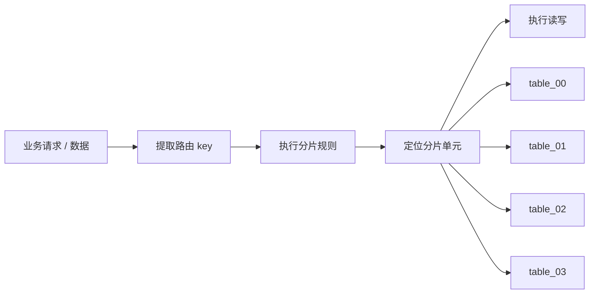
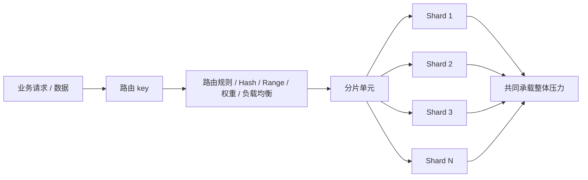
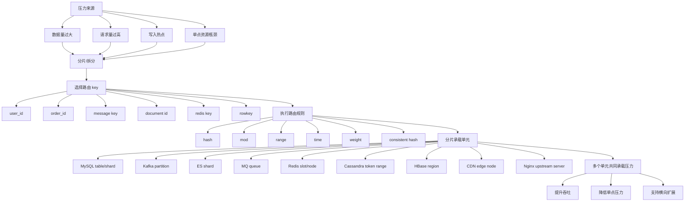

# prompt
```
请写一篇面向后端开发者的技术讲解，主题是：从“打散压力”的角度理解 MySQL 水平分表，并建立与 Kafka partition、Elasticsearch shard、MQ queue、DB shard、Redis slot 的统一认知。（以及Cassandra Token Ring 、HBase Region、CDN、Nginx 负载均衡这些概念都是有联系的）

要求：

1. 从 Redis 热 key 拆分引入：热 key 的问题是单点压力过高，拆 key 的本质是把请求打散到多个承载单元。
    
2. 重点讲解 MySQL 水平分表：定义、使用场景、解决的问题、常见分表方式，以及分表后带来的路由、扩容、跨表查询、事务、分页、聚合等问题。
    
3. 上升到分布式系统视角：说明 Kafka partition、ES shard、MQ queue、DB shard、Redis slot 虽然属于不同系统，但本质上都在解决类似问题——把数据或请求按某种规则拆散到多个分片单元，避免单点瓶颈，提升吞吐和横向扩展能力。
    
4. 构建一个统一模型：
    
    业务请求 / 数据 → 根据某个 key 或规则进行路由 → 落到某个分片单元 → 多个分片共同承载整体压力
    
5. 用一张对比表说明不同系统中的对应关系：
    
    - MySQL 水平分表：user_id/order_id → 分表规则 → table_x
        
    - Kafka：message key → partitioner → partition
        
    - ES：document id/routing key → routing → shard
        
    - MQ：routing key/topic 规则 → queue
        
    - Redis Cluster：key → hash slot → node
        
    - 分布式数据库：sharding key → shard rule → physical shard
        

注意：

- 不要逐个深入展开 Kafka、ES、MQ、Redis 的实现细节。
    
- 重点是用这些概念辅助理解 MySQL 水平分表，并抽象出“打散压力”的分布式系统通用思想。
    
- 语言要工程化、系统化，适合后端开发者阅读。
    
- 强调：分片不是目的，打散压力和支撑横向扩展才是目的。
    
- 最后给出一句核心总结。
```

---
# 从“打散压力”的角度理解 MySQL 水平分表

## 0. 先给结论

**水平分表不是为了“把表拆开”而拆开。**

它真正解决的是：

> 当某个单点承载的数据量、请求量、写入量、索引维护成本过高时，把数据和请求按照某种规则分散到多个承载单元上，让多个单元共同承担压力。

这个思想不只存在于 MySQL。

Kafka partition、Elasticsearch shard、MQ queue、DB shard、Redis Cluster slot、Cassandra Token Ring、HBase Region、CDN 节点、Nginx 负载均衡，本质上都可以从这个角度理解：

> **根据某个 key 或规则，把请求/数据路由到不同的承载单元，避免单点瓶颈，获得横向扩展能力。**

---

# 1. 从 Redis 热 key 拆分说起

## 1.1 热 key 的问题是什么？

假设 Redis 中有一个 key：

```text
product:stock:10001
```

这个 key 表示某个爆款商品库存。

秒杀开始后，所有请求都访问这个 key：

```text
GET product:stock:10001
DECR product:stock:10001
```

问题不是 Redis 整体扛不住，而是：

> 所有压力都集中到了一个 key 上，而这个 key 只能落在 Redis Cluster 的某一个 slot，最终由某一个 Redis 节点承载。

于是出现单点压力：

```text
大量请求
   ↓
同一个 hot key
   ↓
同一个 Redis slot
   ↓
同一个 Redis node
   ↓
该节点 CPU / 网络 / 单线程执行压力过高
```

## 1.2 拆 hot key 的本质是什么？

常见做法是把一个 hot key 拆成多个子 key：

```text
product:stock:10001:0
product:stock:10001:1
product:stock:10001:2
...
product:stock:10001:15
```

请求根据随机数、用户 ID、订单 ID 或 hash 规则访问不同子 key。

```java
int shard = userId.hashCode() & 15;
String key = "product:stock:10001:" + shard;
```

这时候压力变成：

```text
大量请求
   ↓
多个 stock 子 key
   ↓
多个 Redis slot
   ↓
多个 Redis node
   ↓
多个节点共同承载压力
```

所以，**拆 key 的本质不是 key 变多，而是压力被打散了。**

这就是理解 MySQL 水平分表最好的入口。

---

# 2. MySQL 水平分表到底是什么？

## 2.1 定义

**MySQL 水平分表**，是指把一张逻辑表中的数据，按照某个分片键和分表规则，拆分到多张结构相同的物理表中。

例如原来只有一张订单表：

```text
order
```

数据量增长后拆成：

```text
order_00
order_01
order_02
order_03
...
order_15
```

每张表结构相同：

```sql
CREATE TABLE order_00 (
    id BIGINT PRIMARY KEY,
    user_id BIGINT NOT NULL,
    order_no VARCHAR(64) NOT NULL,
    amount DECIMAL(18, 2) NOT NULL,
    status TINYINT NOT NULL,
    created_at DATETIME NOT NULL,
    KEY idx_user_id (user_id),
    KEY idx_created_at (created_at)
);

CREATE TABLE order_01 LIKE order_00;
CREATE TABLE order_02 LIKE order_00;
CREATE TABLE order_03 LIKE order_00;
```

业务写入时根据 `user_id` 或 `order_id` 计算目标表：

```java
int tableIndex = (int) (userId % 16);
String tableName = "order_" + String.format("%02d", tableIndex);
```

于是：

```text
user_id = 10001 → order_01
user_id = 10002 → order_02
user_id = 10017 → order_01
```

逻辑上仍然是一张订单表，但物理上已经分散到多张表。

---

# 3. 水平分表解决的核心问题

## 3.1 单表数据量过大

单表数据量过大后，会带来几个典型问题：

|问题|影响|
|---|---|
|B+Tree 索引变深|查询路径变长，缓存命中率下降|
|索引文件变大|Buffer Pool 压力增加|
|写入维护索引成本升高|insert/update/delete 成本上升|
|DDL 操作变重|加字段、建索引、变更结构风险变大|
|历史数据拖累在线查询|热数据和冷数据混在一起|

例如一张 `order` 表达到几亿行后，即使 SQL 使用了索引，也可能因为索引体积过大、缓存命中下降、范围扫描过多而出现性能下降。

水平分表后：

```text
原来：
order：4 亿行

拆分后：
order_00：2500 万行
order_01：2500 万行
...
order_15：2500 万行
```

每张表的数据量下降，索引规模下降，单表查询和维护压力下降。

---

## 3.2 单表写入压力过高

如果所有订单都写入同一张表：

```text
INSERT INTO order ...
```

写入压力会集中在：

```text
同一张表
同一批索引
同一个主键索引结构
同一组二级索引
同一个数据库实例资源
```

拆表之后，写入分散到不同物理表：

```text
INSERT INTO order_00 ...
INSERT INTO order_01 ...
INSERT INTO order_02 ...
```

多个表共同承载写入压力。

不过要注意：

> 如果所有分表仍然在同一个 MySQL 实例上，水平分表主要降低的是单表数据量和索引压力，并不能彻底突破单实例 CPU、IO、连接数、磁盘吞吐瓶颈。

如果要进一步打散机器压力，就需要进入 **分库分表**：

```text
db_00.order_00
db_00.order_01
db_01.order_00
db_01.order_01
db_02.order_00
db_02.order_01
```

这时压力才真正分散到多个数据库实例。

---

# 4. 水平分表的使用场景

## 4.1 适合分表的典型场景

水平分表通常适合这类业务：

|场景|特点|
|---|---|
|订单表|数据量大，按用户或订单查询多|
|支付流水表|写入高，历史数据多|
|用户行为日志表|写入量大，查询多按时间/用户|
|消息记录表|数据持续增长|
|账单明细表|数据量大，按用户/月份访问|
|积分流水表|append-only 特征明显|
|设备上报数据表|写入高，天然按设备或时间切分|

共同特征是：

```text
数据持续增长
查询有明显路由 key
单表数据量或写入压力成为瓶颈
业务可以接受一定的分片复杂度
```

---

## 4.2 不适合过早分表的场景

不要一上来就分表。

以下场景通常不适合提前分表：

|场景|原因|
|---|---|
|数据量很小|增加复杂度，不解决真实问题|
|查询维度非常复杂|分片后跨表查询成本更高|
|强事务关联很多|分布式事务复杂度上升|
|频繁 join 多张大表|分表后 join 更难处理|
|分片键不稳定|后续迁移成本高|
|业务还没验证|过早设计容易拖慢迭代|

分表是一种架构手段，不是数据库设计标配。

---

# 5. 常见分表方式

## 5.1 按 ID 取模分表

这是最常见的方式。

```java
long userId = 10001L;
int tableCount = 16;

int tableIndex = (int) (userId % tableCount);
String tableName = "order_" + String.format("%02d", tableIndex);
```

路由规则：

```text
user_id % 16 = 0 → order_00
user_id % 16 = 1 → order_01
...
user_id % 16 = 15 → order_15
```

优点：

|优点|说明|
|---|---|
|数据分布相对均匀|前提是分片键本身分布均匀|
|查询可以精准路由|根据 user_id 直接定位表|
|实现简单|规则清晰|

缺点：

|缺点|说明|
|---|---|
|扩容困难|从 16 张扩到 32 张会导致大量数据重分布|
|跨用户查询困难|没有 user_id 时可能要扫所有表|
|分片键选择非常关键|分错 key，后续代价很大|

---

## 5.2 按时间分表

例如日志表、账单表、流水表：

```text
user_login_log_202601
user_login_log_202602
user_login_log_202603
```

路由规则：

```java
String tableName = "user_login_log_" + yearMonth;
```

适合：

```text
日志
报表
账单
审计流水
按时间归档的数据
```

优点：

|优点|说明|
|---|---|
|便于归档|老表可以冷存储或下线|
|时间范围查询自然|查询某个月直接定位某张表|
|运维直观|表名表达时间周期|

缺点：

|缺点|说明|
|---|---|
|热点明显|当前月份表压力最大|
|跨月查询需要 union|查询复杂度上升|
|数据分布可能不均|大促月份数据量远大于普通月份|

---

## 5.3 按业务维度分表

例如按租户、地区、业务线拆分：

```text
order_tenant_001
order_tenant_002

order_cn
order_us

order_b2c
order_b2b
```

适合多租户、区域化、业务隔离明显的系统。

优点是隔离性强，缺点是容易数据倾斜。

例如某个大客户的数据量可能远超其他租户：

```text
tenant_001：10 亿数据
tenant_002：100 万数据
tenant_003：80 万数据
```

这时虽然做了分表，但压力并没有真正打散。

---

## 5.4 复合分表

真实系统中经常组合使用：

```text
先按 user_id 取模
再按月份分表
```

例如：

```text
order_00_202601
order_00_202602
order_01_202601
order_01_202602
```

这种方式适合超大规模数据，但复杂度也会明显上升。

---

# 6. 分表的核心不是表变多，而是路由规则

分表之后，原来的 SQL：

```sql
SELECT * FROM order WHERE user_id = 10001;
```

不能直接打到一张逻辑表上。

应用层或中间件必须先做路由：

```text
user_id = 10001
   ↓
10001 % 16 = 1
   ↓
order_01
   ↓
SELECT * FROM order_01 WHERE user_id = 10001;
```

也就是说，分表后的查询链路变成：

```text
业务请求
   ↓
提取分片键
   ↓
执行分表规则
   ↓
定位物理表
   ↓
执行 SQL
```

可以抽象成：



**分片键选得好，分表是扩展能力。**

**分片键选得差，分表是长期技术债。**

---

# 7. 分表后会带来的典型问题

水平分表解决了单表压力，但它会把复杂度转移到应用层、查询层和运维层。

---

## 7.1 路由问题：没有分片键怎么办？

如果订单表按 `user_id` 分表：

```text
order_${user_id % 16}
```

那么这个查询很好处理：

```sql
SELECT * FROM order_xx WHERE user_id = 10001;
```

因为可以精准定位分表。

但如果查询条件是：

```sql
SELECT * FROM order WHERE order_no = 'O202605130001';
```

如果 `order_no` 不是分片键，就不知道该查哪张表。

可能需要：

```text
查 order_00
查 order_01
查 order_02
...
查 order_15
```

这叫广播查询，成本很高。

常见解决方案：

|方案|说明|
|---|---|
|选择更合适的分片键|例如用 order_id 分表|
|建立路由表|order_no → user_id / table_index|
|冗余查询维度|在订单号中编码分片信息|
|引入搜索系统|复杂查询走 ES|
|避免无分片键查询|接口层强制要求传分片键|

---

## 7.2 扩容问题：取模分表扩容很麻烦

假设原来是：

```text
user_id % 16
```

现在想扩成：

```text
user_id % 32
```

问题是大量数据的目标表会变化。

例如：

```text
user_id = 10001

10001 % 16 = 1
10001 % 32 = 17
```

原来在：

```text
order_01
```

扩容后应该在：

```text
order_17
```

这意味着需要大量数据迁移。

常见解决方式：

|方案|说明|
|---|---|
|初始预留足够分表数量|一开始建 64/128 张逻辑表|
|分库扩容而不是改分表数|表数量不变，迁移部分表到新库|
|使用一致性哈希|减少迁移范围，但实现更复杂|
|使用中间件|ShardingSphere、MyCat、Vitess 等|
|双写迁移|新旧规则并行，灰度切流|

工程上常见策略是：

```text
逻辑表数量提前规划得相对多一些
物理库后续按表组迁移扩容
```

例如一开始就设计：

```text
order_000 ~ order_127
```

早期这些表可能都在一个库中。

后续扩容时可以迁移部分表到其他库：

```text
db_00: order_000 ~ order_031
db_01: order_032 ~ order_063
db_02: order_064 ~ order_095
db_03: order_096 ~ order_127
```

这样表路由规则不用变，物理库映射可以变。

---

## 7.3 跨表查询问题

原来一张表可以这样查：

```sql
SELECT *
FROM order
WHERE status = 1
ORDER BY created_at DESC
LIMIT 20;
```

分表后，这个查询可能要变成：

```text
分别查询 order_00 ~ order_15
每张表取一批数据
应用层合并排序
再取最终前 20 条
```

这就是分表后的典型复杂度。

问题在于：

```text
局部有序 ≠ 全局有序
局部 limit ≠ 全局 limit
```

解决思路：

|查询类型|建议|
|---|---|
|用户维度查询|用 user_id 精准路由|
|后台运营查询|走离线数仓 / ES / 宽表|
|全局列表查询|避免直接扫所有分表|
|状态统计|预聚合到统计表|
|复杂筛选|使用搜索系统承接|

分表后的系统要接受一个现实：

> OLTP 主库不再适合承担大量全局复杂查询。

---

## 7.4 分布式事务问题

如果一次业务操作只落在一张分表中，事务仍然简单：

```text
db_00.order_01
```

但如果一次操作涉及多张表、多个库：

```text
db_00.order_01
db_01.account_02
db_02.coupon_07
```

就可能进入分布式事务问题。

常见方案：

|方案|适用场景|
|---|---|
|尽量让同一业务聚合落在同一分片|首选方案|
|本地事务 + 消息最终一致性|下单、支付、积分、优惠券|
|TCC|强一致要求较高，但复杂度高|
|Saga|长事务、多步骤业务|
|避免跨分片强事务|架构设计阶段规避|

分表系统中，最好的事务设计不是引入复杂分布式事务框架，而是：

```text
通过分片键设计，让高频业务操作尽量落在同一个分片内。
```

---

## 7.5 分页问题

单表分页：

```sql
SELECT *
FROM order
ORDER BY created_at DESC
LIMIT 1000, 20;
```

分表后，如果要查全局最新订单，就需要从多张表取数据再合并。

例如 16 张表：

```text
order_00 取前 1020 条
order_01 取前 1020 条
...
order_15 取前 1020 条
应用层合并排序
再丢弃前 1000 条
取 20 条
```

这会非常低效。

常见优化：

|方案|说明|
|---|---|
|禁止深分页|后台系统常用|
|使用游标分页|根据 last_id / last_time 继续查|
|按用户维度分页|精准路由到单表|
|建全局索引表|维护轻量索引|
|走搜索引擎|ES 承接复杂分页|

例如游标分页：

```sql
SELECT *
FROM order_01
WHERE user_id = 10001
  AND id < 900000000000
ORDER BY id DESC
LIMIT 20;
```

这比 `LIMIT 100000, 20` 更稳定。

---

## 7.6 聚合统计问题

单表时代：

```sql
SELECT status, COUNT(*)
FROM order
GROUP BY status;
```

分表后变成：

```text
order_00 group by
order_01 group by
...
order_15 group by
应用层合并结果
```

如果数据量很大，这会变成灾难。

常见做法：

|方案|说明|
|---|---|
|实时统计表|写入时同步更新计数|
|定时任务汇总|周期性统计|
|消息异步聚合|订单事件进入 MQ 后统计|
|数仓/OLAP|ClickHouse、Doris、Hive 等|
|ES 聚合|适合搜索分析类场景|

工程上要明确：

> 分表后的 MySQL 更适合按分片键做高并发点查和局部范围查询，不适合继续承担大量全局聚合分析。

---

# 8. 从分布式系统视角统一理解

现在把视角拉高。

MySQL 水平分表不是孤立概念。

很多系统都有类似结构：

```text
业务请求 / 数据
   ↓
根据某个 key 或规则进行路由
   ↓
落到某个分片单元
   ↓
多个分片共同承载整体压力
```

这就是统一模型。



这里的分片单元在不同系统中叫法不同：

```text
MySQL 里叫 table / shard
Kafka 里叫 partition
Elasticsearch 里叫 shard
MQ 里叫 queue
Redis Cluster 里叫 slot / node
Cassandra 里是 token range / node
HBase 里是 region
CDN 里是 edge node
Nginx 里是 upstream server
```

名字不同，但思路高度相似。

---

# 9. 不同系统中的对应关系

|系统|输入对象|路由 key|路由规则|承载单元|主要目的|
|---|---|---|---|---|---|
|MySQL 水平分表|业务数据行|`user_id` / `order_id`|取模、范围、时间、hash|`table_x`|降低单表数据量和读写压力|
|Kafka|message|message key|partitioner|partition|提升消息吞吐，并保证分区内有序|
|Elasticsearch|document|document id / routing key|routing hash|shard|分散索引和搜索压力|
|MQ|message|routing key / topic 规则|exchange / topic 路由|queue|分散消费压力，支持并发消费|
|Redis Cluster|key-value|key|CRC16 → hash slot|slot → node|分散 key 和请求压力|
|分布式数据库|row|sharding key|shard rule|physical shard|数据和请求横向扩展|
|Cassandra|row|partition key|token hash|token range → node|去中心化分布式存储|
|HBase|row|rowkey|rowkey range|region|按范围切分大表|
|CDN|HTTP 请求|域名、URL、地理位置|调度系统|edge node|就近访问，分散源站压力|
|Nginx 负载均衡|HTTP 请求|IP、URI、权重、hash key|轮询、权重、hash|upstream server|分散应用服务器压力|

核心模式都是：

```text
key → rule → shard unit
```

---

# 10. 用统一模型看几个典型系统

## 10.1 MySQL 水平分表

```text
user_id/order_id
   ↓
分表规则
   ↓
order_00/order_01/order_02
```

目标是：

```text
降低单表规模
降低索引压力
降低单表写入热点
支撑后续分库扩展
```

---

## 10.2 Kafka partition

Kafka 中消息根据 key 进入不同 partition：

```text
message key
   ↓
partitioner
   ↓
partition
```

例如：

```text
user_id = 10001 → partition 1
user_id = 10002 → partition 2
```

这样可以让多个 partition 分散到不同 broker 上，提高整体吞吐。

从“打散压力”的角度看：

```text
不是所有消息都写同一个日志文件
而是拆到多个 partition log 中
```

---

## 10.3 Elasticsearch shard

ES 中 document 会根据 `_id` 或 routing key 路由到 shard：

```text
document id / routing key
   ↓
routing hash
   ↓
primary shard
```

目标是：

```text
分散索引写入
分散搜索压力
让数据可以分布到多个节点
```

这和 MySQL 分表非常像：

```text
MySQL: row → table_x
ES: document → shard_x
```

---

## 10.4 MQ queue

很多 MQ 系统中，消息会根据 topic、routing key、exchange 规则进入不同 queue。

```text
routing key / topic
   ↓
路由规则
   ↓
queue
```

消费者可以并发消费多个 queue。

从压力角度看：

```text
一个 queue 扛不住
就拆成多个 queue
多个 consumer group / consumer instance 共同消费
```

---

## 10.5 Redis Cluster slot

Redis Cluster 不直接把 key 路由到 node，而是先映射到 slot：

```text
key
   ↓
CRC16(key) % 16384
   ↓
hash slot
   ↓
Redis node
```

也就是：

```text
key → slot → node
```

所以热 key 的问题是：

```text
一个 key 只能落到一个 slot
一个 slot 只能由一个主节点负责
所以单个 hot key 无法自然被 Redis Cluster 自动拆散
```

因此需要业务层拆 key。

这和 MySQL 分表也类似：

```text
如果所有热点数据都落到同一张表，分表也救不了。
```

---

# 11. 再看 Cassandra、HBase、CDN、Nginx

## 11.1 Cassandra Token Ring

Cassandra 使用 partition key 计算 token。

```text
partition key
   ↓
hash
   ↓
token
   ↓
token range
   ↓
node
```

它的目标是把数据均匀分布到集群节点中。

这和 Redis slot 类似：

```text
Redis: key → slot → node
Cassandra: partition key → token → node
```

---

## 11.2 HBase Region

HBase 中大表会按照 rowkey 范围拆成多个 region：

```text
rowkey range
   ↓
region
   ↓
RegionServer
```

例如：

```text
user_0000 ~ user_0999 → region_1
user_1000 ~ user_1999 → region_2
```

如果 rowkey 设计不好，比如持续递增，就会导致写入集中到最后一个 region，形成热点。

这和 MySQL 按自增 ID 范围分表的热点问题类似：

```text
所有新写入都进入最后一张表
```

---

## 11.3 CDN

CDN 不是数据库分片，但思想类似。

用户请求静态资源：

```text
GET /image/a.png
```

不会全部打到源站，而是根据地理位置、运营商、节点负载等规则路由到边缘节点：

```text
用户请求
   ↓
DNS / 调度系统
   ↓
就近 CDN edge node
   ↓
返回缓存资源
```

目标是：

```text
降低源站压力
降低访问延迟
提升整体吞吐
```

这仍然是打散压力。

---

## 11.4 Nginx 负载均衡

Nginx 把请求分发到多个后端服务：

```nginx
upstream app_cluster {
    server 10.0.0.1:8080 weight=1;
    server 10.0.0.2:8080 weight=1;
    server 10.0.0.3:8080 weight=1;
}
```

请求链路：

```text
HTTP request
   ↓
Nginx load balancing
   ↓
upstream server
```

常见策略：

```text
轮询
权重
IP hash
一致性 hash
最少连接
```

它和 MySQL 分表的差异是：

|对比项|Nginx 负载均衡|MySQL 分表|
|---|---|---|
|分发对象|请求|数据 + 请求|
|路由目标|应用实例|物理表/库|
|是否需要数据定位|通常不需要|必须需要|
|是否有数据迁移问题|较少|很明显|
|是否涉及事务|通常不涉及|经常涉及|

但抽象模型仍然一致：

```text
请求 → 路由规则 → 承载单元
```

---

# 12. 分片不是目的，打散压力才是目的

很多人理解分表时会陷入一个误区：

> 表大了就分表。

这不准确。

更准确的判断应该是：

```text
当前瓶颈到底在哪里？
```

可能是：

|瓶颈|是否一定要分表|
|---|---|
|SQL 没有索引|不需要，先优化索引|
|查询返回太多数据|不需要，先优化查询模型|
|单表数据量太大|可能需要分表|
|单实例写入压力高|可能需要分库分表|
|复杂统计慢|不一定，可能该引入 OLAP|
|搜索条件复杂|不一定，可能该引入 ES|
|热点 key/热点行|分表不一定有效，需要拆热点|
|连接数打满|不一定，可能要连接池治理和读写分离|

所以，分表前要问：

```text
是单表数据量问题？
是单表索引问题？
是单实例资源问题？
是热点数据问题？
是查询模型问题？
是统计分析问题？
```

不同问题对应不同方案。

---

# 13. MySQL 水平分表的工程决策框架

## 13.1 先看访问模式

分表前必须回答：

```text
业务最常见查询条件是什么？
是否稳定包含 user_id/order_id？
是否有大量全局查询？
是否有后台复杂筛选？
是否需要跨用户聚合？
```

如果 80% 请求都可以通过 `user_id` 定位，那么按 `user_id` 分表可能合理。

如果大量请求都是：

```text
按状态查
按时间查
按手机号查
按订单号查
按商家查
```

那单纯按 `user_id` 分表就会很痛苦。

---

## 13.2 再选分片键

好的分片键应该满足：

|标准|说明|
|---|---|
|高频出现|大多数查询都带它|
|分布均匀|避免热点分片|
|稳定不变|不要选会频繁变化的字段|
|业务边界清晰|能让相关数据尽量落在一起|
|可用于事务收敛|高频事务尽量在同一分片内完成|

常见选择：

```text
用户系统：user_id
订单系统：user_id 或 order_id
商家系统：seller_id
租户系统：tenant_id
设备系统：device_id
流水系统：account_id + 时间
```

---

## 13.3 然后设计路由规则

常见规则：

|规则|适合场景|风险|
|---|---|---|
|取模|通用业务数据|扩容迁移困难|
|Hash|希望更均匀|可读性较差|
|Range|时间、范围数据|容易写热点|
|时间分表|日志、流水、报表|当前周期热点|
|一致性 Hash|动态扩缩容|实现复杂|
|配置映射|大客户、租户隔离|运维复杂|

---

## 13.4 最后评估分表后的代价

分表不是只有收益，还有成本：

```text
路由复杂度
跨表查询复杂度
分页复杂度
聚合复杂度
分布式事务复杂度
扩容迁移复杂度
数据订正复杂度
排障复杂度
运维监控复杂度
```

所以分表本质上是一个 trade-off：

```text
用系统复杂度，换取数据规模和吞吐能力。
```

---

# 14. 一个完整的统一认知图



---

# 15. 面向后端开发者的最终理解

你可以把这些技术统一理解成一个分布式系统基础模型：

```text
业务请求 / 数据
   ↓
找到一个可以稳定路由的 key
   ↓
根据 hash / mod / range / time / weight 等规则计算目标位置
   ↓
请求或数据落到某个分片单元
   ↓
多个分片单元共同承载整体压力
```

对应到 MySQL 水平分表，就是：

```text
订单数据
   ↓
user_id/order_id
   ↓
取模/Hash/时间规则
   ↓
order_00/order_01/order_02
   ↓
多张表共同承载订单读写压力
```

但必须记住：

```text
分表之后，单表压力下降；
系统复杂度会上升。
```

所以分表前要先确认：

```text
是否真的存在单表数据量或写入压力问题？
是否有稳定的分片键？
高频查询能否精准路由？
跨表查询、分页、聚合、事务是否有替代方案？
未来扩容和迁移方案是否清晰？
```

---

# 核心总结

**分片不是目的，把数据和请求按规则打散到多个承载单元上，避免单点瓶颈并支撑横向扩展，才是 MySQL 水平分表以及 Kafka partition、ES shard、MQ queue、Redis slot 等设计背后的共同本质。**