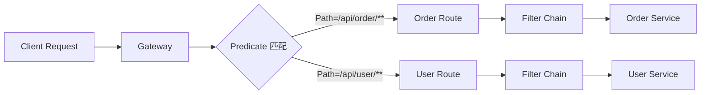
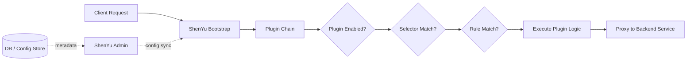
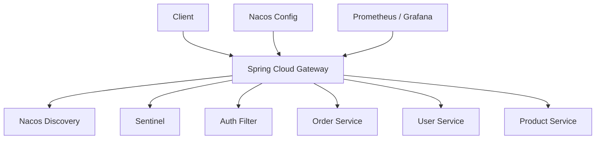
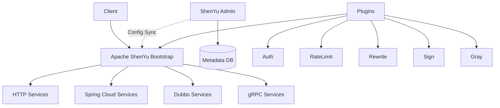
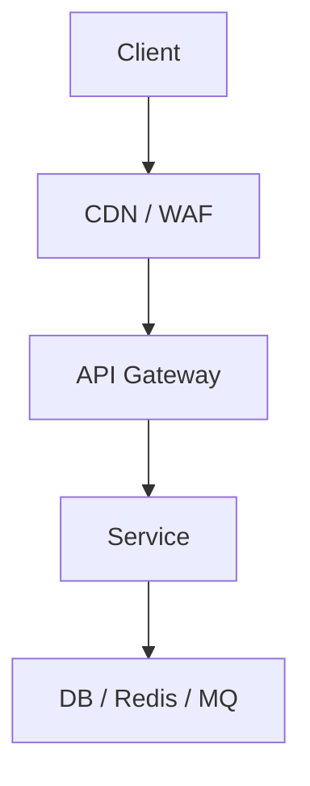
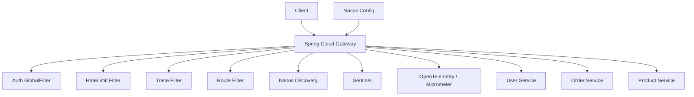

## 结论

**Spring Cloud Alibaba Gateway 更适合“Spring Cloud 技术栈内部的轻量微服务网关”；Apache ShenYu 更接近“独立 API 网关 / API 治理平台”。**

如果你的系统是：

- **Spring Boot / Spring Cloud Alibaba / Nacos / Sentinel 为主**
    
- 服务规模不大，网关规则主要写在配置中心或代码里
    
- 团队希望简单、可控、少引入额外平台
    

优先选 **Spring Cloud Gateway + Nacos + Sentinel**。

如果你的系统是：

- 多协议：HTTP、Dubbo、gRPC、WebSocket、Spring Cloud、MCP 等
    
- 多团队、多业务线共用网关
    
- 希望有独立 Admin 后台管理路由、插件、规则、灰度、认证、限流
    
- 网关本身要作为“API 治理平台”
    

可以考虑 **Apache ShenYu**。ShenYu 官方定位是 Java native API Gateway，用于服务代理、协议转换和 API governance；它通过插件链、Selector、Rule 来完成流量处理和治理。([GitHub](https://github.com/apache/shenyu?utm_source=chatgpt.com "Apache ShenYu is a Java native API Gateway for service ..."))

---

# 1. 先纠正一个概念：Spring Cloud Alibaba Gateway 是什么？

严格说，**Spring Cloud Alibaba 本身没有一个独立叫 Gateway 的核心网关组件**。通常你学习的“Spring Cloud Alibaba Gateway”，实际组合是：

```text
Spring Cloud Gateway
+ Nacos 服务注册 / 配置中心
+ Sentinel 限流 / 熔断 / 降级
+ Spring Security / OAuth2 / JWT
+ Micrometer / Prometheus / SkyWalking / OpenTelemetry
```

Spring Cloud Gateway 官方定位是基于 Spring 生态构建 API Gateway，用来做路由、安全、监控指标、弹性治理等横切能力。当前文档也明确说明它基于 Spring Framework、Spring Boot、Project Reactor，并且有 WebFlux 和 Web MVC 两种形态。([Home](https://docs.spring.io/spring-cloud-gateway/reference/index.html "Spring Cloud Gateway :: Spring Cloud Gateway"))

而 Spring Cloud Alibaba 是一套分布式应用开发方案，包含 Nacos、Sentinel、RocketMQ、Seata 等生态能力；官方 README 也强调它提供服务发现、配置管理、流量控制、降级等能力。([GitHub](https://github.com/alibaba/spring-cloud-alibaba "GitHub - alibaba/spring-cloud-alibaba: Spring Cloud Alibaba provides a one-stop solution for application development for the distributed solutions of Alibaba middleware. · GitHub"))

所以更准确的表达是：

```text
Spring Cloud Gateway 是网关内核
Spring Cloud Alibaba 是它周边的微服务治理生态
```

---

# 2. Spring Cloud Gateway vs Apache ShenYu：核心差异

## 2.1 定位差异

|维度|Spring Cloud Gateway|Apache ShenYu|
|---|---|---|
|核心定位|Spring 生态下的 API Gateway 框架|独立 API 网关 / API 治理平台|
|使用方式|代码 + YAML + 配置中心|Admin 后台 + 插件 + Selector + Rule|
|技术栈亲和性|Spring Cloud 极强|多协议、多框架更强|
|扩展方式|Filter、Predicate、RouteDefinition|Plugin、Selector、Rule|
|管理能力|偏工程配置|偏平台化治理|
|学习成本|较低|较高|
|运维复杂度|较低|较高|
|适合场景|Spring Cloud 微服务统一入口|多协议、多团队、多租户 API 网关|

---

# 3. 架构模型对比

## 3.1 Spring Cloud Gateway 模型

Spring Cloud Gateway 的核心抽象是：

```text
Route = Predicate + Filter + URI
```

可以理解成：



典型配置：

```yaml
spring:
  cloud:
    gateway:
      routes:
        - id: order-service
          uri: lb://order-service
          predicates:
            - Path=/api/order/**
          filters:
            - StripPrefix=2
            - name: RequestRateLimiter
```

它的本质是：

> 请求进来后，根据 Predicate 匹配路由，再经过 Filter 链，最后转发到后端服务。

这非常适合 Spring Cloud 微服务，因为服务发现、负载均衡、配置中心、限流熔断都可以跟 Spring Cloud 生态自然集成。

---

## 3.2 Apache ShenYu 模型

ShenYu 的核心抽象是：

```text
Plugin → Selector → Rule
```

官方文档说明：请求进入 ShenYu 后，会按照责任链执行所有启用的插件；插件是核心，具备可扩展和热插拔能力。Selector 是粗粒度路由，Rule 是更细粒度规则。([ShenYu](https://shenyu.apache.org/docs/ "Overview | Apache ShenYu"))



ShenYu 官方文档中也说明，它通过 HTTP header 等请求信息做 Selector 和 Rule 匹配；Selector 更粗，例如模块级，Rule 更细，例如方法级。配置变更可以通过 ZooKeeper、WebSocket、HTTP long polling 等方式动态同步到网关 JVM 缓存中。([ShenYu](https://shenyu.apache.org/docs/ "Overview | Apache ShenYu"))

这说明 ShenYu 的设计更像：

> 一个带后台管理系统、动态配置同步、插件化治理能力的 API 网关平台。

---

# 4. 二者的工程取舍

## 4.1 Spring Cloud Gateway 的优势

### 优势一：Spring 生态整合成本最低

如果你的服务已经是：

```text
Spring Boot
Spring Cloud Alibaba
Nacos
Sentinel
OpenFeign
Spring Security
```

那么 Spring Cloud Gateway 的工程摩擦最小。

它可以直接使用：

```yaml
uri: lb://order-service
```

通过服务名转发到注册中心里的实例。

### 优势二：代码可控，适合开发者团队

很多企业内部网关逻辑其实并不复杂：

- JWT 鉴权
    
- 白名单
    
- 路由转发
    
- 请求头透传
    
- 统一日志
    
- 限流
    
- 灰度路由
    
- 跨域处理
    

这些用 Gateway Filter 就可以解决。

例如自定义认证 Filter：

```java
@Component
public class JwtAuthGlobalFilter implements GlobalFilter, Ordered {

    private static final List<String> WHITE_LIST = List.of(
            "/api/auth/login",
            "/api/auth/register",
            "/actuator/health"
    );

    @Override
    public Mono<Void> filter(ServerWebExchange exchange, GatewayFilterChain chain) {
        String path = exchange.getRequest().getPath().value();

        // 1. 白名单直接放行
        if (WHITE_LIST.stream().anyMatch(path::startsWith)) {
            return chain.filter(exchange);
        }

        // 2. 从 Header 获取 Token
        String authHeader = exchange.getRequest()
                .getHeaders()
                .getFirst(HttpHeaders.AUTHORIZATION);

        if (authHeader == null || !authHeader.startsWith("Bearer ")) {
            return unauthorized(exchange);
        }

        String token = authHeader.substring(7);

        // 3. 这里只示意，生产中应调用 JwtService 校验签名、过期时间、issuer、audience
        if (!isValidToken(token)) {
            return unauthorized(exchange);
        }

        // 4. 将用户信息透传给下游服务
        ServerHttpRequest mutatedRequest = exchange.getRequest()
                .mutate()
                .header("X-User-Id", extractUserId(token))
                .build();

        return chain.filter(exchange.mutate().request(mutatedRequest).build());
    }

    private Mono<Void> unauthorized(ServerWebExchange exchange) {
        exchange.getResponse().setStatusCode(HttpStatus.UNAUTHORIZED);
        return exchange.getResponse().setComplete();
    }

    private boolean isValidToken(String token) {
        return token != null && token.length() > 20;
    }

    private String extractUserId(String token) {
        return "10001";
    }

    @Override
    public int getOrder() {
        return -100;
    }
}
```

这种模式的优点是：**所有逻辑都在代码里，方便单测、Code Review、CI、灰度发布。**

---

## 4.2 Spring Cloud Gateway 的问题

它的问题不是能力不够，而是**平台化治理能力弱一些**。

例如：

- 运营人员想在后台动态改路由，不方便
    
- 多业务线共享一套网关，权限隔离不够自然
    
- 多协议统一接入不如 ShenYu
    
- 插件市场、Admin 控制台、规则可视化不是它的强项
    
- 大量动态规则如果全靠 YAML / Nacos 配置，会变得难维护
    

所以 Spring Cloud Gateway 更像：

```text
开发者友好的网关框架
```

而不是：

```text
完整 API 网关治理平台
```

---

## 4.3 Apache ShenYu 的优势

### 优势一：插件化治理能力更强

ShenYu 的核心是插件链。请求进入后，按插件顺序处理。插件可以做：

- 路由转发
    
- 限流
    
- 熔断
    
- 认证
    
- 签名
    
- 灰度
    
- 日志
    
- 跨域
    
- 协议转换
    
- 自定义逻辑
    

官方文档也说明，插件是 ShenYu 的核心，用户可以自定义插件满足自身需要。([ShenYu](https://shenyu.apache.org/docs/ "Overview | Apache ShenYu"))

### 优势二：Selector + Rule 更适合复杂流量治理

Spring Cloud Gateway 的 Route 适合“路径 → 服务”的路由。

ShenYu 的 Selector + Rule 更像：

```text
先匹配业务模块
再匹配具体接口规则
再执行对应插件逻辑
```

例如：

```text
Plugin: rateLimiter

Selector:
  /api/order/**

Rule:
  /api/order/create
  每个用户每秒最多 5 次
```

这比简单 Route 更适合 API 治理平台。

官方文档也说明：Selector 可以基于 URI、Header 等条件匹配，并支持 and / or 组合。([ShenYu](https://shenyu.apache.org/docs/next/user-guide/admin-usage/selector-and-rule/ "Selector And Rule Config | Apache ShenYu"))

### 优势三：多协议接入能力更强

ShenYu 支持 Spring Cloud 接入，也支持 Dubbo、gRPC、HTTP、WebSocket 等多种接入方式；官方 Quick Start 列表中包含 Dubbo、gRPC、HTTP、MCP Server、Spring Cloud、Tars、WebSocket 等入口。([ShenYu](https://shenyu.apache.org/docs/quick-start/quick-start-springcloud/ "Quick start with Spring Cloud | Apache ShenYu"))

所以如果你的系统是：

```text
HTTP 服务 + Dubbo 服务 + gRPC 服务 + Spring Cloud 服务
```

ShenYu 会比 Spring Cloud Gateway 更像一个统一入口。

---

# 5. 什么时候选哪个？

## 5.1 选 Spring Cloud Gateway 的情况

你的系统符合以下特征时，优先选 Spring Cloud Gateway：

```text
单一 Java / Spring Cloud 技术栈
服务注册中心是 Nacos
限流降级用 Sentinel
团队以开发人员为主
路由规则不需要大量运营后台配置
网关逻辑希望代码化、版本化、可测试
```

典型架构：



适合你的学习阶段和项目实践。

尤其是你现在主线是 Java 后端 + Spring AI + Spring Cloud Alibaba，那么 Gateway 继续深入更自然。

---

## 5.2 选 Apache ShenYu 的情况

你的系统符合以下特征时，可以考虑 ShenYu：

```text
多协议网关
多个团队共用
需要独立 Admin 后台
需要规则动态配置
希望把 API 治理平台化
需要插件热插拔
Spring Cloud 只是其中一种接入方式
```

典型架构：



ShenYu 适合“网关作为平台”的场景。

---

# 6. 微服务网关最佳实践

下面是重点。

---

## 6.1 网关只做“边界治理”，不要写业务逻辑

网关应该做：

```text
认证
鉴权
限流
熔断
路由
灰度
协议转换
日志
观测
安全防护
```

不应该做：

```text
订单金额计算
库存扣减
用户积分变更
复杂业务编排
数据库写入
业务事务
```

错误示例：

```text
/api/order/create 请求进入网关
网关查 Redis 库存
网关扣库存
网关算优惠券
网关再转发到订单服务
```

这会导致网关变成“超级业务服务”，后续非常难维护。

正确做法：

```text
Gateway:
  认证、限流、路由、透传用户上下文

Order Service:
  创建订单、校验优惠券、调用库存服务、处理事务
```

---

## 6.2 认证在网关做，授权不要全部塞进网关

推荐分层：

|层级|职责|
|---|---|
|网关|校验 Token 是否合法|
|网关|提取 userId、tenantId、roles|
|下游服务|判断当前用户是否有业务权限|
|下游服务|校验资源归属关系|

例如：

```text
网关判断：Token 是否有效？
订单服务判断：这个用户能不能查看这笔订单？
```

不要让网关判断：

```text
用户 A 是否有权限查看订单 202605050001
```

因为这需要查业务数据库，应该由订单服务负责。

---

## 6.3 网关和下游服务之间必须传递可信身份上下文

网关认证后，可以向下游透传：

```http
X-User-Id: 10001
X-Tenant-Id: tenant-a
X-Request-Id: 8f2a...
X-User-Roles: ADMIN,USER
```

但要注意：**下游服务不能信任外部客户端直接传来的这些 Header。**

最佳实践：

```text
外部请求 → 网关：可以带 Authorization
网关 → 下游：由网关注入 X-User-Id
下游服务：只信任来自网关的内部 Header
```

可以在内网层面配合：

- Kubernetes NetworkPolicy
    
- Security Group
    
- mTLS
    
- 内部网关专用域名
    
- 禁止外部直接访问微服务端口
    

---

## 6.4 限流要分层，不要只在网关限流

限流通常分三层：



|层级|限流目标|
|---|---|
|CDN / WAF|防恶意流量、爬虫、攻击|
|Gateway|保护整体微服务入口|
|Service|保护具体业务能力|
|DB / Redis / MQ|保护核心资源|

例如秒杀场景：

```text
网关限流：
  每个 IP 每秒最多 20 次

订单服务限流：
  每个 userId 每秒最多 3 次下单

库存服务限流：
  每个 skuId 每秒最多 N 次扣减

Redis Lua：
  保证库存扣减原子性
```

不要以为网关限流就够了。网关只能看到入口流量，不一定理解业务资源热点。

---

## 6.5 路由规则要版本化、环境隔离、可回滚

无论用 Gateway 还是 ShenYu，都要避免“手改线上配置，无审计、无回滚”。

推荐：

```text
dev
test
staging
prod
```

每套环境的网关规则隔离。

Spring Cloud Gateway 推荐：

```text
YAML / Nacos Config
+ Git 管理
+ CI 校验
+ 灰度发布
```

ShenYu 推荐：

```text
Admin 修改
+ 审计日志
+ 配置导出备份
+ 权限控制
+ 变更审批
```

关键原则：

> 网关规则也是生产配置，必须按代码资产管理。

---

## 6.6 灰度发布不要只靠网关

网关可以做灰度入口，例如：

```text
Header: X-Gray=true → order-service-v2
Cookie: user_group=beta → user-service-v2
userId hash 5% → product-service-v2
```

但是完整灰度需要：

```text
网关路由灰度
+ 注册中心实例灰度
+ 配置中心灰度
+ 数据库兼容
+ 消息兼容
+ 回滚方案
```

错误做法：

```text
网关把 5% 流量打到 v2
但是 v2 写了新字段
v1 读不了
回滚失败
```

正确做法：

```text
先做数据库向后兼容
再发布 v2
再小流量灰度
再扩大比例
最后清理旧字段
```

---

## 6.7 网关必须接入全链路追踪

网关是所有请求的入口，所以必须生成或透传：

```text
traceId
spanId
requestId
userId
tenantId
clientIp
routeId
upstreamService
latency
statusCode
errorCode
```

推荐日志格式：

```json
{
  "traceId": "8f2a7c9b",
  "requestId": "req-20260505-001",
  "routeId": "order-service",
  "path": "/api/order/create",
  "method": "POST",
  "userId": "10001",
  "tenantId": "tenant-a",
  "clientIp": "1.2.3.4",
  "upstream": "order-service",
  "status": 200,
  "costMs": 38
}
```

网关层至少要监控：

|指标|说明|
|---|---|
|QPS|每个 route 的请求量|
|RT|平均耗时、P95、P99|
|Error Rate|4xx、5xx 比例|
|Upstream Timeout|下游超时|
|RateLimit Count|被限流次数|
|CircuitBreaker Open|熔断次数|
|Route Miss|未匹配路由|
|Auth Fail|鉴权失败|

---

## 6.8 超时配置必须明确

网关最常见生产事故之一是：**超时配置混乱**。

推荐原则：

```text
客户端超时 > 网关超时 > 服务间调用超时 > DB 超时
```

示例：

|层级|超时|
|---|---|
|Browser / App|10s|
|Gateway|8s|
|Feign / WebClient|5s|
|DB Query|3s|

这样可以避免：

```text
客户端已经断开
网关还在等
服务还在跑
数据库还在查
线程/连接被拖死
```

Spring Cloud Gateway 可以配置全局和路由级超时；ShenYu 也可以通过规则和插件配置不同接口的超时策略。

---

## 6.9 网关不要直接暴露内部错误

错误示例：

```json
{
  "timestamp": "2026-05-05T10:00:00",
  "path": "/api/order/create",
  "error": "java.sql.SQLSyntaxErrorException",
  "trace": "..."
}
```

正确示例：

```json
{
  "code": "ORDER_SERVICE_UNAVAILABLE",
  "message": "服务暂时不可用，请稍后重试",
  "requestId": "req-20260505-001"
}
```

内部异常应该进入日志和链路追踪系统，而不是返回给用户。

---

# 7. 推荐架构：你现阶段优先这样做

以你的 Java 后端学习路线，我建议先掌握这一套：



你可以把它作为标准企业微服务网关模板：

```text
Spring Cloud Gateway:
  统一入口

Nacos:
  服务发现 + 动态配置

Sentinel:
  限流 + 熔断 + 降级

Spring Security / JWT:
  认证

OpenTelemetry / Micrometer:
  可观测性

Redis:
  分布式限流可选

Kubernetes / Docker Compose:
  部署
```

等这套真正吃透后，再学习 ShenYu，会更容易理解它为什么要设计成：

```text
Admin
Plugin
Selector
Rule
Data Sync
Bootstrap
```

---

# 8. 面试视角：怎么回答“Gateway 和 ShenYu 怎么选？”

可以这样答：

> 如果项目是标准 Spring Cloud Alibaba 微服务体系，我会优先选择 Spring Cloud Gateway，因为它和 Spring Boot、Nacos、Sentinel、Spring Security、Micrometer 的集成成本最低，代码化治理也便于测试和版本管理。
> 
> 如果公司需要一个跨语言、多协议、多团队共享的 API 网关治理平台，例如同时代理 HTTP、Dubbo、gRPC、Spring Cloud 服务，并且需要可视化规则管理、插件化扩展和动态规则同步，那么 Apache ShenYu 更合适。ShenYu 的核心模型是 Plugin、Selector、Rule，适合复杂 API 治理。
> 
> 但无论选哪一个，网关都不应该承载业务逻辑。网关应该聚焦认证、限流、路由、灰度、观测、安全等边界治理能力，业务权限和业务事务仍然应该下沉到具体微服务。

---

# 9. 最终建议

## 当前学习 / 求职 / 项目实践优先级

```text
第一优先级：
Spring Cloud Gateway + Nacos + Sentinel

第二优先级：
Gateway 自定义 GlobalFilter / GatewayFilter

第三优先级：
JWT 鉴权、限流、灰度、熔断、链路追踪

第四优先级：
Apache ShenYu 的 Plugin / Selector / Rule / Admin / Data Sync

第五优先级：
对比 Higress / APISIX / Kong / Envoy / Istio Gateway
```

## 一句话总结

> **Spring Cloud Gateway 是开发者友好的微服务网关框架；Apache ShenYu 是平台化、插件化、多协议的 API 网关治理系统。实际企业最佳实践不是追求功能最多，而是让网关稳定、可观测、可回滚、少业务逻辑、边界职责清晰。**