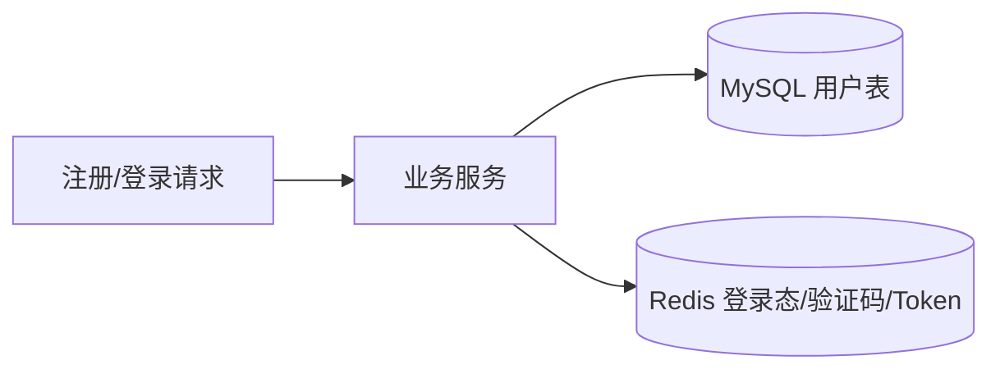
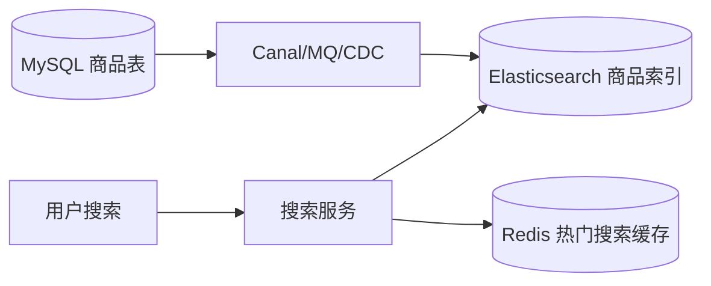
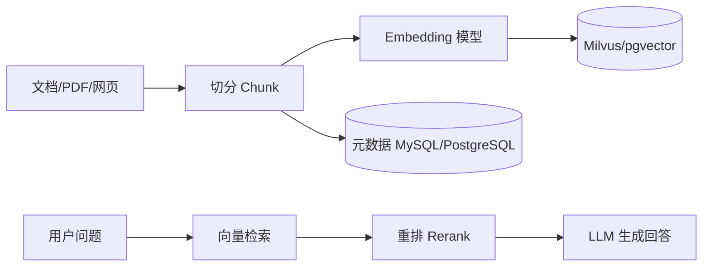
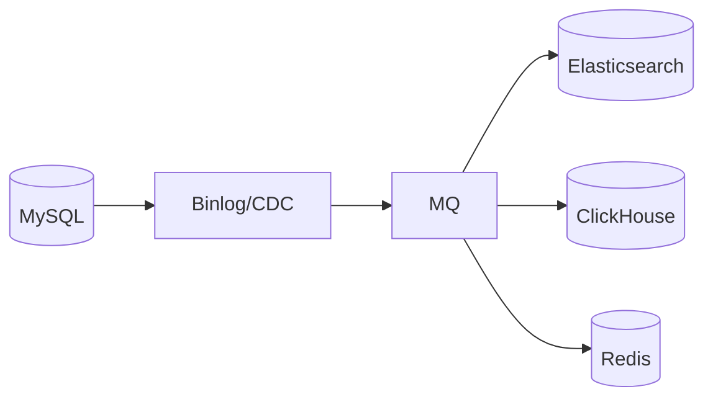
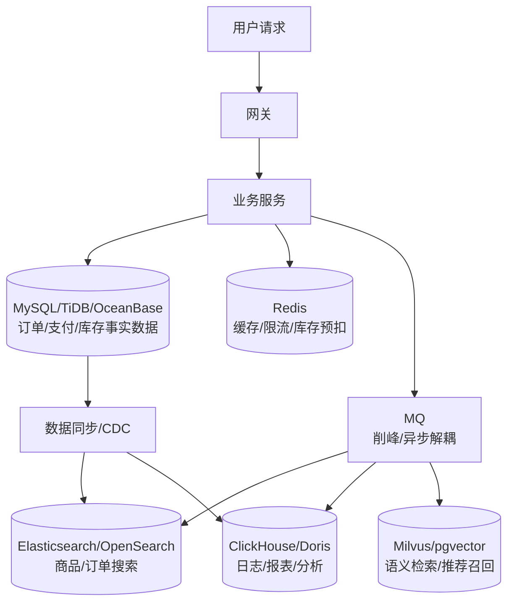
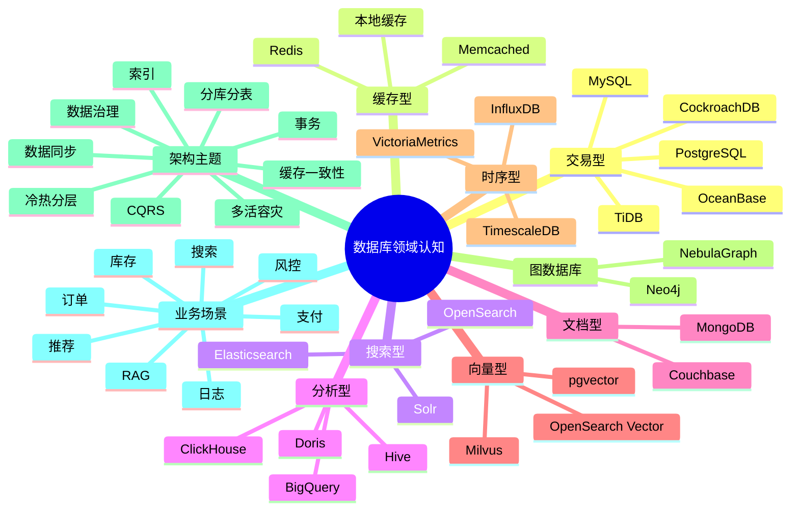

## 0. 先给结论

数据库不是“存数据的工具集合”，而是**围绕业务读写模式、数据一致性、查询复杂度、规模、延迟、成本、运维复杂度做取舍的一套基础设施体系**。

后端工程师建立数据库认知，核心不是背产品名，而是掌握这几句话：

|问题|架构判断|
|---|---|
|交易、订单、支付|优先关系型数据库：MySQL / PostgreSQL / 分布式 SQL|
|高并发读、热点数据|Redis 做缓存、计数、限流、短期状态|
|商品搜索、日志检索、复杂文本查询|Elasticsearch / OpenSearch|
|文档、半结构化、灵活 Schema|MongoDB|
|海量分析、报表、行为日志|ClickHouse / Doris / Druid / 数据仓库|
|AI / RAG 语义检索|pgvector / Milvus / OpenSearch Vector|
|单机 MySQL 扛不住但又想保留 SQL|TiDB / OceanBase / CockroachDB|
|大厂自研数据库|本质是为了解决标准数据库在规模、一致性、成本、多活、定制化场景下的边界问题|

---

# 1. 数据库领域总览

## 1.1 按业务负载分类

|分类|解决什么问题|代表产品|典型业务|
|---|---|---|---|
|**OLTP**|高频、小事务、强一致读写|MySQL、PostgreSQL、Oracle、OceanBase、TiDB|订单、支付、账户、库存、用户系统|
|**OLAP**|海量数据分析、聚合、报表|ClickHouse、Doris、Hive、BigQuery|日志分析、经营报表、用户行为分析|
|**HTAP**|一套系统同时支持交易和分析|TiDB、OceanBase、PolarDB 部分形态|实时风控、实时运营分析|
|**缓存**|降低数据库读压力、承载热点访问|Redis、Memcached|商品详情缓存、登录态、限流、秒杀库存|
|**搜索引擎**|文本检索、倒排索引、相关性排序|Elasticsearch、OpenSearch、Solr|商品搜索、订单搜索、日志搜索|
|**文档数据库**|半结构化 JSON 文档存储|MongoDB、Couchbase|内容管理、配置中心、用户画像草稿|
|**向量数据库**|向量相似度检索、语义搜索|Milvus、pgvector、OpenSearch Vector|RAG 知识库、推荐召回、图片检索|
|**时序数据库**|时间序列数据高压缩写入和聚合|InfluxDB、TimescaleDB、VictoriaMetrics|监控指标、IoT、行情数据|
|**图数据库**|关系网络、多跳查询|Neo4j、NebulaGraph、JanusGraph|风控关系网、社交关系、知识图谱|
|**NewSQL / 分布式 SQL**|SQL + 水平扩展 + 高可用|TiDB、OceanBase、CockroachDB、Spanner|海量订单、跨地域交易、强一致多副本|

TiDB 官方定位偏向 MySQL 兼容、分布式 SQL、HTAP 能力；OceanBase 强调分布式架构、高可用、MySQL/Oracle 兼容能力；pgvector 是 PostgreSQL 的向量相似度搜索扩展；Milvus 定位为面向大规模高维向量相似度检索的开源向量数据库；OpenSearch 也在强化搜索、分析、向量检索一体化能力。([TiDB](https://www.pingcap.com/article/exploring-tidb-a-scalable-distributed-sql-database/?utm_source=chatgpt.com "Exploring TiDB: A Scalable Distributed SQL Database"))

---

## 1.2 按数据模型分类

|数据模型|代表数据库|适合什么|
|---|---|---|
|表 / 行 / 列|MySQL、PostgreSQL、TiDB|强事务、结构化业务数据|
|Key-Value|Redis、RocksDB|高性能缓存、短期状态|
|文档|MongoDB|JSON 结构、灵活字段|
|倒排索引|Elasticsearch、OpenSearch|搜索、过滤、排序、聚合|
|列式存储|ClickHouse、Doris|海量分析、宽表聚合|
|向量|Milvus、pgvector、OpenSearch Vector|语义检索、RAG|
|图|Neo4j、NebulaGraph|多跳关系查询|

---

# 2. Java 后端工程师学习路径

## 阶段一：入门认知

|学什么|目标|
|---|---|
|MySQL 表设计、索引、事务、SQL 优化|能独立做 CRUD、分页、索引设计|
|Redis 基础数据结构|能做缓存、验证码、登录态、排行榜|
|JDBC / MyBatis / JPA|理解 Java 如何访问数据库|

**不必深挖：** 数据库源码、B+Tree 页结构、优化器完整实现。

**实践：**

- 用户表、订单表、商品表设计
    
- MyBatis CRUD
    
- Redis 缓存商品详情
    

---

## 阶段二：工程实践

|学什么|目标|
|---|---|
|事务传播、隔离级别、锁|能处理并发扣库存、支付状态更新|
|索引优化、慢 SQL 分析|能看执行计划，知道为什么慢|
|缓存一致性|能设计缓存更新策略|
|数据库连接池|能理解 HikariCP、连接耗尽、慢查询影响|

**实践：**

- 订单创建事务
    
- Redis + MySQL 缓存一致性
    
- 分布式锁防重复提交
    
- 唯一索引实现幂等
    

---

## 阶段三：架构设计

|学什么|目标|
|---|---|
|读写分离|解决读多写少|
|分库分表|解决单表过大、单库写瓶颈|
|数据同步|MySQL → ES / MQ / Canal|
|CQRS|写模型和读模型拆分|
|搜索架构|MySQL 存事实，ES 做检索|

**实践：**

- 商品搜索：MySQL + ES + Redis
    
- 订单分表：按 user_id / order_id 路由
    
- Canal 同步商品数据到 ES
    

---

## 阶段四：高级专题

|学什么|目标|
|---|---|
|分布式事务|理解 TCC、Saga、可靠消息、最终一致|
|多活容灾|理解异地多活、单元化、数据冲突|
|分布式 SQL|理解 TiDB / OceanBase 的价值|
|向量数据库|理解 RAG 检索链路|
|数据治理|数据血缘、质量、权限、生命周期|

**不必深挖：** Raft/Paxos 源码、LSM/存储引擎源码，除非你要做数据库内核岗位。

---

## 阶段五：面试系统设计

重点训练：

- 秒杀系统数据库设计
    
- 订单系统分库分表
    
- 商品搜索架构
    
- 支付幂等与事务边界
    
- Redis 缓存一致性
    
- RAG 知识库设计
    
- MySQL 扩容到分布式数据库
    

---

# 3. 主流数据库横向对比

|数据库|核心定位|典型场景|优势|局限|Java 常见用法|面试热点|
|---|---|---|---|---|---|---|
|MySQL|主流 OLTP|订单、用户、支付|成熟、生态强、成本低|单机容量与写入瓶颈|MyBatis、JPA、JDBC|索引、事务、锁、MVCC、分库分表|
|PostgreSQL|高级关系型数据库|SaaS、地理、JSON、复杂查询|SQL 能力强、扩展丰富|国内互联网普及度略低于 MySQL|JDBC、JPA、jOOQ|MVCC、JSONB、扩展、pgvector|
|Redis|内存 KV / 缓存|缓存、限流、锁、计数|极快、数据结构丰富|不是主库替代品|Spring Data Redis、Redisson|缓存穿透、击穿、雪崩、分布式锁|
|MongoDB|文档数据库|内容、配置、画像|Schema 灵活、文档天然聚合|复杂事务和强关系不如 RDBMS|Spring Data MongoDB|文档建模、索引、嵌套/引用|
|Elasticsearch|搜索引擎|商品搜索、日志|倒排索引、全文检索强|不适合强事务主库|Elasticsearch Java Client|倒排索引、分片、副本、深分页|
|Milvus|专用向量数据库|RAG、图片检索、推荐召回|向量规模化检索强|业务事务能力弱|Milvus Java SDK|ANN、embedding、召回、混合检索|
|pgvector|PostgreSQL 向量扩展|中小型 RAG|数据和向量共库，工程简单|超大规模向量检索不如专用系统|JDBC + SQL|向量索引、相似度、RAG|
|TiDB|分布式 SQL / HTAP|海量订单、MySQL 扩展|MySQL 兼容、水平扩展|成本和运维复杂度高于单机 MySQL|MyBatis 基本无感|分布式事务、热点、HTAP|
|ClickHouse|OLAP 列式数据库|日志、报表、行为分析|聚合查询极快|不适合高频事务更新|JDBC、HTTP Client|列式存储、MergeTree、分区|
|OceanBase|分布式关系型数据库|金融、支付、核心交易|高可用、强一致、兼容模式|学习和运维门槛高|MySQL/Oracle 兼容驱动|多副本、分布式事务、金融级场景|

---

# 4. 场景驱动选型

## 4.1 用户系统

**推荐组合：**

```text
MySQL / PostgreSQL + Redis
```

**数据流：**



**常见坑：**

- 用户手机号、邮箱必须加唯一索引。
    
- 密码不能明文存储。
    
- 登录态可以放 Redis，但用户主数据不要只放 Redis。
    
- 更新用户信息后要处理缓存失效。
    

---

## 4.2 订单支付

**推荐组合：**

```text
MySQL / PostgreSQL / TiDB / OceanBase + Redis + MQ
```

**架构模式：**

```text
订单库保存事实
Redis 做短期状态和防重复
MQ 做异步通知
支付回调必须幂等
```

**常见坑：**

- 支付回调可能重复。
    
- 订单状态机必须单向流转。
    
- 金额用 `DECIMAL`，不要用 `float/double`。
    
- 强一致边界要放在数据库事务内。
    

---

## 4.3 商品搜索

**推荐组合：**

```text
MySQL 商品主库 + Elasticsearch / OpenSearch 搜索索引 + Redis 热点缓存
```

**数据流：**



**常见坑：**

- ES 不是商品主库。
    
- MySQL 和 ES 存在同步延迟。
    
- 商品上下架要考虑最终一致。
    
- 深分页要用 `search_after`，不要无限 `from + size`。
    

---

## 4.4 秒杀

**推荐组合：**

```text
Redis 预扣库存 + MQ 削峰 + MySQL 最终落库
```

**关键点：**

- Redis 承接高并发。
    
- Lua 保证扣减原子性。
    
- MQ 异步创建订单。
    
- MySQL 唯一索引防重复下单。
    

---

## 4.5 购物车

**推荐组合：**

```text
Redis + MySQL
```

|场景|设计|
|---|---|
|未登录购物车|前端 LocalStorage / 临时 Redis|
|登录购物车|Redis 快速读写|
|长期保存|MySQL 异步持久化|

**常见坑：**

- 购物车不是订单，不要过早强事务化。
    
- 商品价格以结算时为准，不以购物车缓存为准。
    

---

## 4.6 用户画像 / 推荐系统

**推荐组合：**

```text
行为日志 → Kafka → Flink/Spark → ClickHouse/Hive/Feature Store → Redis/ES/向量库
```

**解释：**

- MySQL 保存用户基础资料。
    
- ClickHouse / Hive 做离线分析。
    
- Redis 保存在线特征。
    
- 向量库做语义召回。
    

---

## 4.7 日志分析 / 实时大屏

**推荐组合：**

```text
Kafka + Flink + ClickHouse / Elasticsearch
```

|场景|选择|
|---|---|
|按关键词检索日志|Elasticsearch|
|大规模聚合分析|ClickHouse|
|实时指标大屏|Flink + ClickHouse / Redis|

---

## 4.8 RAG 知识库

**推荐组合：**

```text
业务库 + 对象存储 + 向量数据库 + 搜索引擎
```



**选型：**

| 场景             | 推荐                                |
| -------------- | --------------------------------- |
| 个人项目 / 中小数据量   | PostgreSQL + pgvector             |
| 企业知识库 / 大规模向量  | Milvus                            |
| 需要关键词 + 向量混合检索 | OpenSearch / Elasticsearch + 向量能力 |

pgvector 的优势是向量和业务数据可以放在 PostgreSQL 内，工程链路简单；Milvus 更适合高维向量的大规模相似度检索；OpenSearch 的优势是能把传统搜索、分析和向量检索放进同一套检索体系。([GitHub](https://github.com/pgvector/pgvector?utm_source=chatgpt.com "pgvector/pgvector: Open-source vector similarity search for ..."))

---

## 4.9 多租户 SaaS

|模式|适合场景|
|---|---|
|单库单表加 `tenant_id`|中小 SaaS，成本低|
|单库多 Schema|租户隔离更强|
|多库多租户|大客户、强隔离|
|混合模式|普通租户共享，大客户独立|

**核心坑：**

- 所有查询必须带 `tenant_id`。
    
- 唯一索引要考虑租户维度：`tenant_id + biz_code`。
    
- 数据权限比技术选型更重要。
    

---

## 4.10 跨地域部署

**推荐组合：**

```text
本地读写优先 + 异步复制 + 单元化 + 冲突规避
```

**核心判断：**

- 强一致跨地域成本极高。
    
- 不是所有业务都适合多地同时写。
    
- 支付、账户类要谨慎多活。
    
- 内容、搜索、推荐可以更容易异地多活。
    

---

## 4.11 电商订单海量扩容

**演进路径：**

```text
单库单表
→ 单库分表
→ 分库分表
→ 分布式 SQL
→ 单元化 / 多活架构
```

|阶段|方案|
|---|---|
|100 万级订单|MySQL 单表 + 索引优化|
|1 亿级订单|水平分表|
|多业务线高并发|分库分表 + MQ + Redis|
|运维复杂度过高|TiDB / OceanBase 等分布式 SQL|
|全国/全球业务|单元化 + 多活|

---

# 5. 代码案例

## 5.1 MySQL / PostgreSQL：事务 CRUD

**业务背景：** 创建订单时，需要写订单表、订单明细表，并扣减库存。

```java
@Service
@RequiredArgsConstructor
public class OrderService {

    private final OrderMapper orderMapper;
    private final StockMapper stockMapper;

    @Transactional(rollbackFor = Exception.class)
    public Long createOrder(CreateOrderCommand cmd) {
        // 1. 幂等校验：防止重复提交
        if (orderMapper.existsByRequestId(cmd.getRequestId())) {
            throw new BizException("重复下单");
        }

        // 2. 扣库存：where stock >= count 防止超卖
        int affected = stockMapper.decreaseStock(cmd.getSkuId(), cmd.getCount());
        if (affected == 0) {
            throw new BizException("库存不足");
        }

        // 3. 创建订单
        OrderDO order = OrderDO.create(cmd);
        orderMapper.insert(order);

        // 4. 创建订单明细
        orderMapper.insertItems(order.getId(), cmd.getItems());

        return order.getId();
    }
}
```

**取舍：**

- 库存扣减和订单创建必须在一个事务边界内。
    
- 幂等可以用 `request_id` 唯一索引兜底。
    
- 高并发秒杀场景不建议直接打 MySQL，应前置 Redis 和 MQ。
    

---

## 5.2 Redis 缓存：商品详情

```java
public ProductDTO getProduct(Long productId) {
    String key = "product:" + productId;

    ProductDTO cache = redisTemplate.opsForValue().get(key);
    if (cache != null) {
        return cache;
    }

    ProductDTO db = productMapper.selectById(productId);
    if (db == null) {
        // 缓存空值，防止缓存穿透
        redisTemplate.opsForValue().set(key, ProductDTO.empty(), Duration.ofMinutes(3));
        return null;
    }

    redisTemplate.opsForValue().set(key, db, Duration.ofMinutes(30));
    return db;
}
```

**取舍：**

- Redis 是加速层，不是事实数据源。
    
- 更新商品时常见策略是：先更新 DB，再删除缓存。
    
- 热点商品要考虑缓存击穿，可加互斥锁或逻辑过期。
    

---

## 5.3 Redis 分布式锁：防重复执行

```java
public void handlePayCallback(PayCallback callback) {
    String lockKey = "pay:callback:" + callback.getPayNo();

    RLock lock = redissonClient.getLock(lockKey);
    boolean locked = lock.tryLock(3, 10, TimeUnit.SECONDS);

    if (!locked) {
        throw new BizException("处理中，请勿重复提交");
    }

    try {
        orderService.markPaid(callback);
    } finally {
        lock.unlock();
    }
}
```

**取舍：**

- 分布式锁只能降低重复执行概率，最终还要靠数据库状态机和唯一索引兜底。
    
- 支付回调一定要幂等，不能只靠锁。
    

---

## 5.4 Redis 限流：用户接口频控

```java
public boolean allowRequest(Long userId) {
    String key = "rate:user:" + userId;
    Long count = redisTemplate.opsForValue().increment(key);

    if (count == 1) {
        redisTemplate.expire(key, Duration.ofMinutes(1));
    }

    return count <= 60;
}
```

**取舍：**

- 简单计数器适合普通接口。
    
- 高精度限流可用滑动窗口、令牌桶、Lua 脚本。
    
- 网关层限流优先于业务层限流。
    

---

## 5.5 MongoDB 文档建模：用户画像

```java
@Document("user_profile")
@Data
public class UserProfileDocument {
    @Id
    private String userId;

    private List<String> tags;

    private Map<String, Object> preferences;

    private List<Behavior> recentBehaviors;
}
```

```java
mongoTemplate.updateFirst(
    Query.query(Criteria.where("_id").is(userId)),
    new Update()
        .addToSet("tags", "high_value_user")
        .set("preferences.category", "digital"),
    UserProfileDocument.class
);
```

**取舍：**

- 用户画像字段变化频繁，MongoDB 比关系表更灵活。
    
- 但交易、支付、订单这种强一致数据，不适合优先放 MongoDB。
    

---

## 5.6 Elasticsearch 商品搜索

```java
SearchRequest request = SearchRequest.of(s -> s
    .index("product")
    .query(q -> q.bool(b -> b
        .must(m -> m.match(t -> t.field("title").query(keyword)))
        .filter(f -> f.term(t -> t.field("status").value("ON_SALE")))
        .filter(f -> f.range(r -> r.field("price").gte(JsonData.of(minPrice))))
    ))
    .sort(sort -> sort.field(f -> f.field("sales").order(SortOrder.Desc)))
    .from(page * size)
    .size(size)
);
```

**取舍：**

- MySQL 保存商品事实。
    
- ES 保存搜索视图。
    
- 搜索结果以 ES 为准，但详情页最终仍要回 MySQL / 缓存校验状态。
    

---

## 5.7 pgvector：RAG 检索伪 SQL

```sql
CREATE EXTENSION IF NOT EXISTS vector;

CREATE TABLE document_chunk (
    id BIGSERIAL PRIMARY KEY,
    doc_id BIGINT NOT NULL,
    content TEXT NOT NULL,
    embedding VECTOR(1536)
);

CREATE INDEX idx_chunk_embedding
ON document_chunk
USING ivfflat (embedding vector_cosine_ops);

SELECT id, content
FROM document_chunk
ORDER BY embedding <=> :queryEmbedding
LIMIT 5;
```

**取舍：**

- 中小型知识库，用 PostgreSQL + pgvector 非常顺手。
    
- 如果向量规模巨大、召回性能要求高，再考虑 Milvus。
    
- RAG 质量不只取决于向量库，还取决于切分、embedding、rerank、权限过滤和上下文拼接。
    

---

## 5.8 TiDB / 分布式 SQL：订单表扩展

```sql
CREATE TABLE user_order (
    id BIGINT PRIMARY KEY,
    user_id BIGINT NOT NULL,
    order_no VARCHAR(64) NOT NULL,
    amount DECIMAL(18,2) NOT NULL,
    status VARCHAR(32) NOT NULL,
    created_at DATETIME NOT NULL,
    UNIQUE KEY uk_order_no(order_no),
    KEY idx_user_created(user_id, created_at)
);
```

Java 侧：

```java
@Mapper
public interface OrderMapper {
    @Insert("""
        INSERT INTO user_order(id, user_id, order_no, amount, status, created_at)
        VALUES(#{id}, #{userId}, #{orderNo}, #{amount}, #{status}, NOW())
    """)
    int insert(OrderDO order);
}
```

**取舍：**

- 如果使用 TiDB / OceanBase 这类 MySQL 兼容分布式 SQL，Java 业务代码通常变化较小。
    
- 但不能以为“完全无成本”：热点行、事务大小、索引设计、跨分区访问仍然会影响性能。
    
- 分布式 SQL 解决的是扩展性和高可用问题，不是让糟糕 SQL 自动变好。
    

---

# 6. 架构设计思想

## 6.1 数据建模：先看业务事实，再看查询路径

**解决问题：** 数据应该如何组织。

电商例子：

|数据|建模方式|
|---|---|
|订单|强一致关系模型|
|商品详情|MySQL 主表 + Redis 缓存|
|商品搜索|ES 索引模型|
|用户画像|文档 / 宽表 / 特征存储|
|行为日志|ClickHouse / Hive|

**核心原则：**

> 主库保存事实，缓存加速访问，搜索引擎服务查询，数仓服务分析，向量库服务语义召回。

---

## 6.2 读写分离：解决读压力，不解决写瓶颈

```text
写请求 → 主库
读请求 → 从库
```

**坑：**

- 主从延迟会导致刚写完读不到。
    
- 强一致读仍然要读主库。
    
- 读写分离不是分库分表的替代品。
    

---

## 6.3 分库分表：把压力打散到多个承载单元

```text
order_0
order_1
order_2
...
order_15
```

**解决问题：**

- 单表数据量过大。
    
- 单库写入压力过高。
    
- 索引树过大导致查询退化。
    

**坑：**

- 查询必须带分片键。
    
- 跨表分页困难。
    
- 扩容迁移复杂。
    
- 分布式事务复杂。
    

---

## 6.4 缓存一致性：不要追求“缓存和数据库永远同步”

常见策略：

```text
读：先读缓存，miss 再读 DB
写：先写 DB，再删缓存
```

**为什么不是先删缓存再写 DB？**

因为并发情况下，可能出现旧值重新写入缓存。

**工程表达：**

> 缓存一致性通常追求最终一致，不追求强一致。强一致数据不要依赖缓存判断。

---

## 6.5 事务边界：一个事务只包真正需要原子性的操作

订单创建事务中应该包含：

- 创建订单
    
- 创建明细
    
- 扣减库存
    
- 写幂等记录
    

不应该包含：

- 发短信
    
- 调第三方接口
    
- 写 ES
    
- 复杂远程调用
    

这些应该通过 MQ 异步处理。

---

## 6.6 幂等性：所有可能重复到达的请求都要能安全重复执行

典型场景：

- 支付回调
    
- MQ 消费
    
- 订单提交
    
- 退款申请
    
- 定时任务补偿
    

常见方案：

|方案|适合场景|
|---|---|
|唯一索引|订单号、支付流水号|
|状态机|订单状态流转|
|Redis 防重|短时间重复提交|
|幂等表|外部请求幂等|
|MQ 消费记录|消息重复消费|

---

## 6.7 数据同步：业务主库和读模型解耦



**解决问题：**

- MySQL 不适合复杂搜索。
    
- ES 不适合强事务。
    
- ClickHouse 不适合在线交易。
    
- 所以通过 CDC / MQ 构建不同读模型。
    

---

## 6.8 CQRS：写模型和读模型分离

|模型|例子|
|---|---|
|写模型|MySQL 订单表|
|读模型|ES 订单搜索索引|
|分析模型|ClickHouse 订单宽表|
|缓存模型|Redis 用户订单摘要|

**适合：**

- 写入规则复杂。
    
- 查询维度复杂。
    
- 搜索、报表、详情页需求差异很大。
    

---

## 6.9 冷热分层：热数据放快系统，冷数据放便宜系统

电商订单：

|数据|存储|
|---|---|
|近 3 个月订单|MySQL / TiDB|
|近 1 年订单|分区表 / 冷热表|
|多年前订单|归档库 / 对象存储 / ClickHouse|
|查询入口|统一订单查询服务屏蔽差异|

---

## 6.10 可观测性：数据库问题必须能被发现

必须监控：

- QPS / TPS
    
- 慢 SQL
    
- 连接数
    
- 锁等待
    
- 主从延迟
    
- 缓存命中率
    
- ES 查询延迟
    
- Redis 热 key
    
- 磁盘使用率
    
- 分片倾斜
    

---

## 6.11 多活容灾：不是简单多部署几套数据库

核心问题：

|问题|难点|
|---|---|
|多地写|数据冲突|
|跨地域强一致|延迟高|
|故障切换|数据完整性|
|支付账户|强一致要求高|
|搜索推荐|更适合最终一致|

---

# 7. 面试热点

## 7.1 MySQL / PostgreSQL

|高频问题|考察点|回答框架|
|---|---|---|
|B+Tree 为什么适合数据库索引|磁盘 IO、范围查询|多路平衡树、层高低、叶子链表|
|MVCC 是什么|并发控制|快照读、当前读、undo、事务 ID|
|为什么索引会失效|SQL 优化|函数、隐式转换、最左前缀、范围条件|
|事务隔离级别|一致性|脏读、不可重复读、幻读|
|PostgreSQL 和 MySQL 区别|选型|PG 扩展和复杂 SQL 更强，MySQL 生态更普遍|

**示范回答：**

> MySQL 更像互联网业务的默认 OLTP 选择，生态成熟、运维经验多；PostgreSQL 的 SQL 能力、扩展能力、JSONB、地理信息、向量扩展更强。如果是普通电商核心交易，我会优先 MySQL；如果是复杂查询、SaaS、多类型数据、AI 原型，我会更偏 PostgreSQL。

---

## 7.2 Redis

|高频问题|考察点|
|---|---|
|缓存穿透、击穿、雪崩|缓存稳定性|
|Redis 分布式锁安全吗|锁超时、续期、误删、Redlock|
|Redis 为什么快|内存、单线程事件循环、IO 多路复用|
|Redis 持久化|RDB、AOF|
|热 key 怎么处理|拆 key、本地缓存、多级缓存|

**示范回答：**

> Redis 适合做缓存和高性能短期状态，但不能替代关系型数据库保存核心事实。对缓存一致性，我一般采用先写 DB 再删缓存，并结合过期时间、消息补偿和监控兜底。

---

## 7.3 MongoDB

|高频问题|考察点|
|---|---|
|文档建模如何设计|嵌入 vs 引用|
|MongoDB 适合什么|半结构化数据|
|为什么不适合订单支付|强事务、强关系|
|索引怎么设计|嵌套字段、数组索引|

**示范回答：**

> MongoDB 适合字段变化频繁、天然聚合的文档数据，例如用户画像、内容配置、表单数据。但核心交易系统仍应优先关系型数据库，因为订单、支付、库存更需要清晰事务边界和强一致约束。

---

## 7.4 Elasticsearch / OpenSearch

|高频问题|考察点|
|---|---|
|倒排索引是什么|搜索基础|
|ES 为什么不适合做主库|事务能力、刷新延迟|
|分片和副本是什么|扩展和高可用|
|深分页怎么优化|`search_after`、scroll|
|MySQL 到 ES 如何同步|Binlog、CDC、MQ、最终一致|

**示范回答：**

> ES 适合做搜索读模型，不适合做交易主库。电商中商品信息以 MySQL 为准，通过 Binlog/MQ 同步到 ES，用户搜索查 ES，进入详情页再校验商品状态和价格。

---

## 7.5 向量数据库 / RAG

|高频问题|考察点|
|---|---|
|向量数据库解决什么|语义相似度检索|
|pgvector 和 Milvus 怎么选|工程简单 vs 大规模性能|
|RAG 为什么会答错|切分、召回、重排、上下文|
|关键词搜索和向量搜索区别|精确匹配 vs 语义匹配|
|混合检索是什么|BM25 + Vector + Rerank|

**示范回答：**

> 小规模 RAG 可以优先 PostgreSQL + pgvector，减少系统复杂度；如果向量规模大、召回性能要求高、需要独立扩展，再用 Milvus。生产 RAG 不只是向量库选型，还要处理文档切分、权限过滤、召回重排、版本更新和可观测性。

---

## 7.6 分布式数据库

|高频问题|考察点|
|---|---|
|TiDB / OceanBase 解决什么|水平扩展、高可用|
|和分库分表区别|透明度、运维复杂度|
|分布式 SQL 有什么代价|延迟、热点、事务成本|
|什么场景不适合上分布式数据库|小规模、简单系统|
|强一致怎么实现|多副本、共识协议、事务协调|

**示范回答：**

> 分布式 SQL 的价值是尽量保留 SQL 和关系模型，同时获得水平扩展和高可用能力。但它不是银弹，热点写、超大事务、复杂 SQL 仍然可能出问题。选型时要比较业务规模、团队运维能力、迁移成本和长期收益。

---

## 7.7 系统设计题数据库选型

|题目|推荐表达|
|---|---|
|设计秒杀系统|Redis 预扣库存 + MQ 削峰 + MySQL 落库|
|设计订单系统|MySQL/分布式 SQL + 分库分表 + MQ + 幂等|
|设计商品搜索|MySQL 主库 + ES 搜索 + Redis 缓存|
|设计推荐系统|行为日志 + Kafka + Flink + ClickHouse + Redis/向量库|
|设计 RAG 知识库|文档存储 + Chunk + Embedding + 向量库 + 权限过滤|

---

# 8. 大厂与电商数据库实践

## 8.1 为什么大厂会自研或深度定制数据库？

不是因为“标准数据库不好”，而是因为业务规模超过了通用数据库的舒适区。

|标准数据库瓶颈|大厂诉求|
|---|---|
|单机写入瓶颈|水平扩展|
|主从架构容灾有限|多副本强一致|
|跨地域延迟高|异地多活 / 单元化|
|成本不可控|存储压缩、冷热分层|
|通用 SQL 优化不足|针对业务模型定制|
|搜索和推荐链路复杂|检索、向量、特征系统融合|
|风控支付强一致要求高|更强事务和审计能力|

---

## 8.2 电商核心链路中的数据库协作



核心分工：

|系统|职责|
|---|---|
|MySQL / PostgreSQL|业务事实、强事务|
|Redis|热点读、短期状态、高并发削峰|
|MQ|异步解耦、削峰、最终一致|
|ES / OpenSearch|搜索和复杂查询|
|ClickHouse / 数仓|分析、报表、运营决策|
|向量数据库|语义召回、RAG、推荐|
|分布式 SQL|海量交易数据、水平扩展、高可用|

---

## 8.3 大厂架构思想抽象

### 第一层：业务事实层

保存真实状态：

```text
订单状态
支付状态
库存状态
账户余额
用户身份
```

优先选择：

```text
MySQL / PostgreSQL / TiDB / OceanBase
```

---

### 第二层：访问加速层

承接高并发读写：

```text
Redis
本地缓存
CDN
多级缓存
```

---

### 第三层：查询视图层

为不同读场景构建不同模型：

```text
ES 商品搜索索引
ClickHouse 订单分析宽表
Redis 用户首页摘要
pgvector 知识库向量索引
```

---

### 第四层：异步数据流层

把事实数据同步到各类读模型：

```text
Binlog / CDC
MQ
Flink
离线任务
补偿任务
```

---

### 第五层：治理与容灾层

保证系统长期可控：

```text
数据质量
权限审计
冷热归档
多活容灾
可观测性
容量规划
```

---

# 9. 一张总图：数据库认知地图



---

# 10. 最适合 Java 后端的学习优先级

## 第一优先级：必须掌握

```text
MySQL / PostgreSQL
Redis
Elasticsearch / OpenSearch
数据库事务、索引、锁、SQL 优化
缓存一致性
分库分表
幂等性
```

## 第二优先级：架构加分

```text
ClickHouse
MongoDB
TiDB / OceanBase
数据同步 CDC
CQRS
冷热分层
多活容灾
```

## 第三优先级：AI 时代加分

```text
pgvector
Milvus
混合检索
RAG 数据链路
Embedding 数据建模
向量库与关系库协作
```

---

# 11. 面试口述版总结

> 数据库选型不能只看产品名，而要从业务读写模式出发。核心交易数据应该放在关系型数据库中，用事务、唯一索引和状态机保证一致性；高频热点访问用 Redis 承接；复杂搜索用 Elasticsearch 或 OpenSearch；分析报表用 ClickHouse 或数仓；AI/RAG 场景用 pgvector、Milvus 或带向量能力的搜索系统；当单机 MySQL 在容量、写入、高可用上遇到瓶颈时，再考虑分库分表或 TiDB、OceanBase 这类分布式 SQL。大型互联网公司的数据库架构，本质上是围绕事实数据、缓存加速、搜索读模型、分析模型、异步数据流和容灾治理构建的一整套数据基础设施。