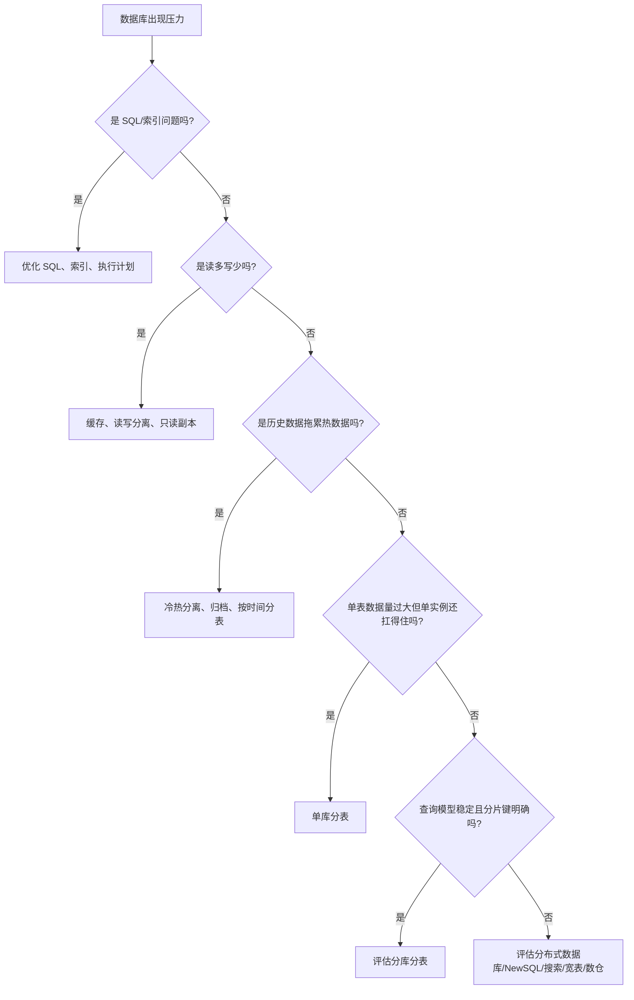
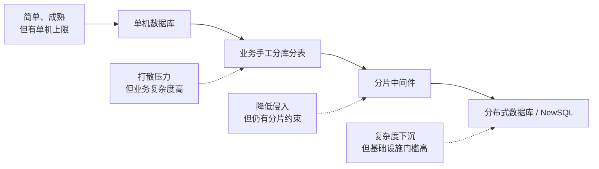

[[从“分布式系统打散压力”的角度理解 MySQL 水平分表]]

# 结论：分库分表不是过时，而是从“默认扩展手段”变成了“高代价备选方案”

过去很多系统遇到数据库瓶颈时，常规路径是：

```text
MySQL 单库单表
  ↓
读写分离
  ↓
单库分表
  ↓
分库分表
  ↓
分片中间件 / 应用层路由 / 分布式事务
```

但今天更合理的判断是：

```text
先优化单体数据库能力
  ↓
再做冷热分离 / 归档 / 缓存 / 读写分离
  ↓
必要时考虑单库分表
  ↓
最后才考虑分库分表
  ↓
或者直接评估 TiDB / OceanBase / PolarDB-X 等分布式数据库
```

一句话：

> **分库分表解决的是“数据库单点承载能力不足”的问题，但它把大量分布式复杂度转嫁给了业务系统。现在更成熟的趋势是：把数据分布、扩容、容灾、一致性尽量交给数据库基础设施，而不是让业务代码自己承担。**

TiDB 官方文档强调其分布式架构、弹性扩展、MySQL 协议兼容、高可用和 ACID 事务能力；OceanBase 文档强调 MySQL 模式对 MySQL 5.7/8.0 多数特性和语法的兼容；PolarDB 官方文档强调计算存储分离、弹性、高性能、海量存储和 MySQL/PostgreSQL 生态兼容。它们共同代表了一个方向：**数据库基础设施正在吸收过去由业务系统手工分片承担的能力**。([PingCAP 文档](https://docs.pingcap.com/tidb/stable/tidb-architecture?utm_source=chatgpt.com "TiDB Architecture"))

---

# 1. 先统一认知：分库分表的本质不是“拆表”，而是“压力分散”

你前面那个想法非常关键：

> Redis 热 key 拆分、MySQL 水平分表、Kafka partition、ES shard、Redis slot，本质都在解决同一个问题：**单个承载单元扛不住了，需要把压力打散到多个承载单元。**

可以抽象成这个模型：

```text
请求 / 数据 / 流量
      ↓
路由规则
      ↓
多个承载单元
      ↓
并行承载压力
```

对应到不同技术：

|技术|被打散的东西|承载单元|路由依据|
|---|--:|--:|---|
|Redis 热 key 拆分|单 key 请求压力|多个 key / 多个节点|key 后缀、随机片、业务维度|
|MySQL 分表|单表数据量 / 查询压力|多张表|user_id、order_id、时间|
|MySQL 分库|单库写入 / 存储 / 连接压力|多个数据库实例|分片键|
|Kafka partition|Topic 读写压力|Partition|message key|
|Elasticsearch shard|索引数据和查询压力|Shard|routing key / 默认 hash|
|Redis Cluster slot|keyspace|slot / master 节点|CRC16(key) % 16384|
|Cassandra Token Ring|数据分布|token range / node|partition key hash|
|HBase Region|表数据范围|RegionServer 上的 Region|rowkey range|
|CDN|静态资源访问压力|边缘节点|地理位置 / 调度策略|
|Nginx LB|请求流量|后端实例|轮询、权重、hash、一致性 hash|

所以，分库分表的本质不是“数据库技巧”，而是分布式系统里的一个普遍动作：

```text
单点承压
  ↓
切分数据/流量
  ↓
建立路由规则
  ↓
多节点并行承载
  ↓
引入跨节点一致性、查询、扩容、治理问题
```

这也是为什么分库分表一旦做了，系统复杂度会明显上升。因为你不是“多建几张表”，而是在业务系统里引入了一个简化版的分布式数据库。

---

# 2. 传统分库分表到底解决什么问题？

传统分库分表主要解决四类问题。

## 2.1 单表太大：索引、查询、DDL、备份变慢

例如订单表：

```sql
CREATE TABLE orders (
    id BIGINT PRIMARY KEY,
    user_id BIGINT NOT NULL,
    order_no VARCHAR(64) NOT NULL,
    status TINYINT NOT NULL,
    amount DECIMAL(18,2) NOT NULL,
    created_at DATETIME NOT NULL,
    KEY idx_user_id (user_id),
    KEY idx_created_at (created_at)
);
```

如果这张表增长到几亿、几十亿行，问题会集中出现：

|问题|具体表现|
|---|---|
|索引膨胀|B+Tree 层级、页分裂、缓存命中率下降|
|查询变慢|范围扫描、排序、分页成本上升|
|DDL 风险变高|加字段、建索引时间长，锁表或资源抖动|
|备份恢复变慢|单表过大，恢复窗口不可控|
|归档困难|历史数据和热数据混在一起|

单库分表可以把：

```text
orders
```

拆成：

```text
orders_00
orders_01
orders_02
...
orders_15
```

每张表的数据量下降，索引体积下降，局部查询变快。

---

## 2.2 单库写入压力太高：一个 MySQL 实例扛不住

如果只是单库分表，本质上仍然是一个 MySQL 实例：

```text
MySQL Instance A
 ├── orders_00
 ├── orders_01
 ├── orders_02
 └── orders_15
```

它可以缓解单表问题，但不能真正解决单实例 CPU、IO、连接数、redo log、buffer pool、主从复制压力。

所以进一步会分库：

```text
MySQL Instance A
 ├── orders_00
 └── orders_01

MySQL Instance B
 ├── orders_02
 └── orders_03

MySQL Instance C
 ├── orders_04
 └── orders_05
```

这时写入压力、连接压力、存储压力才能真正打散到多个数据库实例上。

---

## 2.3 热点数据集中：某个业务维度压力异常高

例如某个平台按商家维度存订单：

```text
merchant_id = 10001 是超级大商家
merchant_id = 10002 是普通商家
```

如果按 `merchant_id` 分片，超级商家的数据可能全部落到同一个库/表，形成热点分片。

这和 Redis 热 key 完全类似：

```text
Redis 热 key：一个 key 被大量访问
DB 热分片：一个分片承载大量请求
Kafka 热 partition：一个 key 导致消息集中到一个 partition
ES 热 shard：routing 不均导致某个 shard 特别忙
```

分库分表能打散整体压力，但不自动解决热点。**分片键选错，反而会制造新热点。**

---

## 2.4 数据生命周期不同：冷热数据应该分开

订单、日志、流水、消息、行为记录这类数据往往有明显生命周期：

```text
近 7 天：频繁查询、频繁更新
近 3 个月：偶尔查询
1 年前：基本归档，只做报表或审计
```

如果所有数据都在一张表里，热数据查询会被冷数据拖累。

这时候可以按时间拆：

```text
orders_2026_01
orders_2026_02
orders_2026_03
```

或者：

```text
orders_hot
orders_history
```

这类分表更多是**冷热隔离**，不一定是为了并发扩展。

---

# 3. 为什么分库分表以前很流行？

因为它是 MySQL 时代最直接的横向扩展手段。

传统 MySQL 的强项是：

```text
单机事务强
生态成熟
SQL 能力强
运维经验多
成本相对低
```

但它天然不是“自动分布式数据库”。当数据规模和写入压力继续上升时，单机 MySQL 会遇到上限：

```text
单机 CPU 上限
单机 IO 上限
单机存储上限
单机连接数上限
单机复制延迟上限
单表维护上限
```

于是业务团队只能自己做：

```text
应用层路由
分片键设计
分布式 ID
跨库事务
跨库查询合并
扩容迁移
全局唯一约束
全局分页排序
```

这就是传统分库分表的历史价值：

> **在分布式数据库不成熟或者成本过高的阶段，用业务系统 + 分片中间件，把多个 MySQL 实例拼成一个“准分布式数据库”。**

ShardingSphere 这类中间件的价值就在这里：它在独立数据库之上提供分片、分布式事务等能力。官方文档也说明，ShardingSphere 提供 LOCAL、XA、BASE 等事务模式，用于在底层数据源之上支持分布式事务能力。([ShardingSphere](https://shardingsphere.apache.org/document/5.5.3/en/features/transaction/?utm_source=chatgpt.com "Distributed Transaction :: ShardingSphere"))

---

# 4. 关键转折：分库分表最难的不是拆，而是拆完之后怎么办

很多人学习分库分表时，只看到这一步：

```java
int tableIndex = (int) (userId % 16);
String tableName = "orders_" + tableIndex;
```

看起来很简单。

但真实系统里，难点不是这一行路由代码，而是后面这些问题。

---

## 4.1 分片键一旦选错，后面会非常痛苦

假设订单表按 `user_id` 分片：

```text
orders_00: user_id % 16 = 0
orders_01: user_id % 16 = 1
...
orders_15: user_id % 16 = 15
```

那么下面这个查询很舒服：

```sql
SELECT *
FROM orders_03
WHERE user_id = 100003
ORDER BY created_at DESC
LIMIT 20;
```

因为可以精准路由到一个分片。

但如果业务要按 `order_no` 查：

```sql
SELECT *
FROM orders
WHERE order_no = 'O202605130001';
```

如果 `order_no` 不是分片键，系统不知道它在哪张表，就只能：

```text
查 orders_00
查 orders_01
查 orders_02
...
查 orders_15
然后合并结果
```

这叫广播查询。

如果是 16 张表，还能忍；如果是 128 张表、1024 张表，就很痛苦。

所以分库分表真正可怕的地方是：

> **它要求你提前预测未来最核心的查询路径。**

而业务查询维度经常会变。

今天按用户查订单，明天运营要按手机号查，后天客服要按订单号查，大后天风控要按设备号查。分片键不可能同时服务所有查询维度。

---

## 4.2 跨库 JOIN 基本会废掉

单库时可以这样写：

```sql
SELECT o.id, o.amount, u.nickname
FROM orders o
JOIN users u ON o.user_id = u.id
WHERE u.phone = '13800000000';
```

分库分表后，`orders` 和 `users` 可能不在同一个库。

于是你有几个选择：

|方案|问题|
|---|---|
|禁止跨库 JOIN|业务代码多次查询、手工组装|
|广播维表|维表同步复杂|
|冗余字段|数据一致性复杂|
|使用分布式 SQL 引擎|引入更重基础设施|
|改成搜索引擎/宽表|数据同步和延迟问题|

所以分库分表之后，很多团队会制定规则：

```text
禁止跨库 JOIN
禁止跨分片事务
禁止复杂分页
禁止无分片键查询
```

也就是说，分库分表不是让 SQL 更自由，而是让 SQL 更受限。

---

## 4.3 分布式事务会变成高频痛点

单库事务很简单：

```java
@Transactional
public void pay(Long orderId) {
    orderRepository.markPaid(orderId);
    accountRepository.deductBalance(orderId);
    couponRepository.markUsed(orderId);
}
```

如果这些数据在同一个 MySQL 实例中，事务由数据库保证。

但分库后可能变成：

```text
订单库 shard_01
账户库 shard_07
优惠券库 shard_03
```

这时一个本地事务变成分布式事务。

你要面对：

```text
XA 两阶段提交
TCC
Saga
本地消息表
最终一致性
事务补偿
幂等
对账
人工修复
```

注意：不是说这些方案不能用，而是它们都比单库事务复杂得多。

所以一个成熟工程师不会轻易说“直接分库分表”，因为他知道后面跟着一整套分布式事务治理问题。

---

## 4.4 全局唯一约束会变难

单库里可以有：

```sql
UNIQUE KEY uk_order_no(order_no)
UNIQUE KEY uk_phone(phone)
```

分库分表后，如果 `order_no` 不是分片键，全局唯一就不好保证。

例如：

```text
orders_01 中有 order_no = A
orders_02 中也可能插入 order_no = A
```

单个分片只能保证本分片唯一，无法天然保证全局唯一。

解决方案包括：

|方案|代价|
|---|---|
|分布式 ID 生成|只能解决 ID，不解决任意字段唯一|
|全局唯一索引表|多一次写入，可能成为瓶颈|
|按唯一字段分片|牺牲其他查询维度|
|业务前置校验|并发下仍要兜底|
|分布式数据库|交给数据库层处理，但也有成本|

---

## 4.5 扩容迁移非常麻烦

最常见的错误认知是：

```text
一开始按 user_id % 16 分 16 张表
以后不够了，再改成 % 32 就行
```

问题是，取模规则一变，大量数据的位置都会变化。

```text
user_id = 100

100 % 16 = 4
100 % 32 = 4

user_id = 120

120 % 16 = 8
120 % 32 = 24
```

一部分数据要迁移到新表/新库。

扩容迁移涉及：

```text
历史数据搬迁
双写
增量同步
一致性校验
灰度切流
回滚方案
停机窗口
数据修复
```

这已经不是一个简单的技术点，而是一个大型工程项目。

---

# 5. 所以为什么现在它变成“备选方案”？

因为传统分库分表有一个本质问题：

> **它把数据库系统应该处理的问题，转嫁给了业务系统和应用开发团队。**

传统分库分表后，业务团队要关心：

```text
数据放在哪个库？
SQL 应该路由到哪里？
跨库怎么查？
跨库事务怎么保证？
扩容时数据怎么迁移？
全局唯一怎么实现？
热点分片怎么处理？
分片维度变了怎么办？
```

而现代分布式数据库试图让业务回到：

```text
我还是写 SQL
我还是看一张逻辑表
底层怎么切分、复制、迁移、调度，由数据库系统解决
```

比如 TiDB 文档明确描述其分布式架构、弹性扩展、MySQL 协议兼容、高可用和 ACID 事务特性；OceanBase 在 MySQL 模式下兼容 MySQL 大量特性与语法；PolarDB 强调云原生、计算存储分离、弹性与生态兼容。([PingCAP 文档](https://docs.pingcap.com/tidb/stable/tidb-architecture?utm_source=chatgpt.com "TiDB Architecture"))

所以，现代数据库选型的变化不是：

```text
分库分表没用了
```

而是：

```text
手工分库分表的必要性下降了
```

更准确地说：

> **分库分表从“数据库扩展的默认答案”，变成了“在成本、团队能力、业务模型、基础设施约束下的一种备选答案”。**

---

# 6. 但不要走向另一个极端：分布式数据库也不是银弹

很多人容易从一个极端跳到另一个极端：

```text
以前：大表就分库分表
现在：大表就上 TiDB / OceanBase / PolarDB-X
```

这也不对。

分布式数据库解决的是一类复杂度，但它也引入另一类复杂度。

## 6.1 分布式数据库降低了业务复杂度，但提高了基础设施复杂度

传统分库分表：

```text
复杂度在业务层 / 中间件层
```

分布式数据库：

```text
复杂度在数据库内核 / 运维 / 调优 / SQL 执行计划 / 分布式事务 / 数据调度
```

不是复杂度消失了，而是复杂度下沉了。

你仍然要关注：

```text
SQL 是否兼容
执行计划是否稳定
跨节点事务成本
热点 Region / Partition
写放大
网络延迟
集群容量规划
备份恢复
故障切换
运维能力
云厂商绑定
成本
```

TiDB、OceanBase、PolarDB-X 这类系统当然更强，但它们不是“换个 JDBC URL 就万事大吉”。TiDB 官方文档虽然强调很多情况下迁移应用无需改代码，但这句话不等于所有 SQL、所有业务语义、所有性能模型都完全无成本迁移。([PingCAP 文档](https://docs.pingcap.com/tidb/stable/tidb-architecture?utm_source=chatgpt.com "TiDB Architecture"))

---

## 6.2 小团队盲目上分布式数据库，可能比手工分表更危险

如果你的业务是：

```text
几千万数据
QPS 不高
写入不猛
查询维度简单
团队 DBA 能力有限
预算有限
```

那你直接上复杂分布式数据库，可能不是升级，而是给自己引入新的黑盒。

很多中小系统更现实的路线是：

```text
SQL 优化
索引优化
冷热归档
缓存
读写分离
单库分表
垂直拆分
再考虑分库分表或分布式数据库
```

工程上最重要的不是“技术先进”，而是：

> **当前问题有没有必要用这个复杂度去解决。**

---

# 7. 决策框架：什么时候继续 MySQL？什么时候分表？什么时候分库分表？什么时候上分布式数据库？

## 7.1 优先级路线图



---

## 7.2 选型表

|当前情况|更优先考虑|
|---|---|
|慢 SQL、索引缺失、回表严重|SQL/索引优化|
|读请求远大于写请求|缓存、读写分离|
|历史数据巨大，热数据很少|冷热分离、归档、时间分表|
|单表太大，但单库压力不高|单库分表|
|单库写入、连接、存储都接近瓶颈|分库分表或分布式数据库|
|查询路径稳定，天然按用户/商家/租户访问|分库分表可行|
|查询维度复杂，经常跨维度检索|分布式数据库 / 搜索引擎 / 宽表|
|强依赖复杂 SQL、JOIN、聚合分析|慎重分库分表，优先评估分布式 SQL 或数仓|
|团队 MySQL 能力强，分布式数据库经验弱|传统 MySQL 体系更稳|
|团队有 DBA/SRE，业务增长明确|可评估 TiDB/OceanBase/PolarDB-X|
|老系统已稳定分库分表|不要为“技术升级”盲目迁移|

---

# 8. 分库分表仍然适合的场景

不要把“备选”理解成“落后”。

下面这些场景，分库分表仍然很合理。

## 8.1 查询模型极其稳定

比如订单系统 90% 查询都是：

```sql
SELECT *
FROM orders
WHERE user_id = ?
ORDER BY created_at DESC
LIMIT 20;
```

或者 SaaS 系统天然按租户隔离：

```sql
SELECT *
FROM xxx
WHERE tenant_id = ?;
```

这种场景分片键明确，路由稳定，分库分表是可控的。

---

## 8.2 业务可以接受限制 SQL 能力

例如明确规定：

```text
所有核心查询必须带分片键
禁止跨库 JOIN
禁止跨库事务
分页只支持分片内分页
全局报表走离线数仓
客服检索走 ES
```

如果业务能接受这些约束，分库分表可以长期稳定运行。

---

## 8.3 成本敏感，且团队熟悉 MySQL

有些公司更愿意使用成熟 MySQL 集群：

```text
MySQL + ShardingSphere
MySQL + 自研路由
MySQL + Canal + ES
MySQL + Redis + MQ
```

这套体系虽然传统，但可控、便宜、人才多、经验多。

---

## 8.4 老系统已经稳定运行

对于老系统，迁移到分布式数据库未必划算。

迁移风险包括：

```text
SQL 兼容性
性能回归
数据迁移
双写校验
业务停机窗口
团队学习成本
故障处理经验不足
```

如果现有分库分表系统稳定，业务没有新的重大瓶颈，强行迁移不一定有收益。

---

# 9. 分库分表不适合的场景

## 9.1 查询维度非常多

例如订单系统要支持：

```text
按 user_id 查
按 order_no 查
按 phone 查
按 merchant_id 查
按 product_id 查
按 created_at 查
按 status 查
按 region 查
按 coupon_id 查
```

如果每个维度都要求实时查询，单一分片键无法满足。

这时更合理的是组合方案：

```text
MySQL 保存交易事实
ES 支持多维检索
Redis 支持热点查询
数仓支持分析报表
分布式数据库支持更复杂的 SQL 扩展
```

---

## 9.2 强依赖跨表 JOIN

如果业务大量依赖：

```sql
orders JOIN users JOIN products JOIN coupons JOIN payments
```

那么分库分表会极大破坏原有 SQL 模型。

这类系统要么不要过早分库分表，要么要提前做领域边界拆分、冗余字段、宽表、CQRS、搜索索引。

---

## 9.3 强事务一致性跨多个业务实体

例如：

```text
订单
库存
账户
积分
优惠券
资金流水
```

如果它们经常在一个强一致事务里变更，分库分表会把问题推向分布式事务。

这时你要重新设计业务事务边界，而不是简单拆库。

---

## 9.4 未来业务查询路径不确定

如果产品还在快速变化，今天按用户查，明天按组织查，后天按项目查，大后天按设备查。

此时过早分库分表等于提前锁死数据访问模型。

更稳妥的方式是：

```text
先用单库单表/单库分表
配合归档和索引优化
等核心访问模式稳定后再拆
```

---

# 10. 一个真实后端系统应该怎么设计？

以订单系统为例。

## 10.1 低规模阶段：先别分库分表

```text
orders 单表
合理主键
合理索引
覆盖索引
冷热字段拆分
避免大字段
慢 SQL 治理
```

典型索引：

```sql
CREATE INDEX idx_user_created
ON orders(user_id, created_at DESC);

CREATE UNIQUE INDEX uk_order_no
ON orders(order_no);
```

这个阶段最重要的是把基础做好。

---

## 10.2 中等规模阶段：冷热分离 + 归档

```text
orders_hot
orders_history
```

或者按时间归档：

```text
orders_2026_01
orders_2026_02
orders_2026_03
```

核心原则：

```text
在线交易库只服务热数据
历史查询走历史库/ES/数仓
```

这一步往往比直接分库分表更划算。

---

## 10.3 高规模阶段：按业务主路径分片

如果订单主要按用户访问：

```text
shard = user_id % N
```

如果订单主要按商家访问：

```text
shard = merchant_id % N
```

如果是 SaaS：

```text
shard = tenant_id % N
```

但你必须同时设计辅助查询路径：

|查询方式|解决方案|
|---|---|
|按订单号查|订单号中嵌入分片信息 / 全局索引表|
|按手机号查|用户中心先查 user_id，再查订单|
|按时间查报表|数仓 / OLAP|
|客服多条件检索|ES|
|对账|离线任务 / 宽表|

这才是生产级设计。

---

## 10.4 超大规模阶段：重新评估分布式数据库

如果系统增长到：

```text
多 TB / PB 级数据
持续高写入
多维查询
复杂 SQL
强一致诉求
弹性扩容诉求
团队具备 DBA/SRE 能力
```

这时可以评估：

```text
TiDB
OceanBase
PolarDB-X
CockroachDB
YugabyteDB
云厂商分布式数据库
```

但评估重点不是“宣传页功能”，而是：

```text
SQL 兼容性
事务模型
性能压测
热点处理
扩容方式
故障恢复
备份恢复
生态兼容
运维复杂度
成本
迁移难度
```

---

# 11. 统一模型：从“手工打散”到“基础设施自动打散”

这才是这个主题最有价值的上层认知。

## 11.1 第一代：业务手工打散

```text
业务代码决定数据去哪
业务代码决定查哪里
业务代码处理跨分片聚合
业务代码处理事务补偿
```

典型代表：

```text
MySQL 分库分表
Redis 热 key 拆分
应用层一致性 hash
手工路由表
```

优点：

```text
可控
成本低
性能路径短
符合业务定制
```

缺点：

```text
复杂度暴露给业务
扩容困难
查询受限
迁移困难
长期维护成本高
```

---

## 11.2 第二代：中间件帮你打散

```text
应用看起来访问逻辑表
中间件负责路由到物理库表
```

典型代表：

```text
ShardingSphere
MyCat
数据库代理层
```

优点：

```text
降低业务侵入
统一路由规则
支持一定 SQL 改写
支持分布式事务模式
```

缺点：

```text
复杂 SQL 支持有限
排障链路变长
中间件本身成为关键组件
业务仍然要理解分片约束
```

---

## 11.3 第三代：数据库系统自动打散

```text
应用访问逻辑表
数据库内部自动分片、复制、迁移、调度
```

典型代表：

```text
TiDB Region
OceanBase 分区/副本
PolarDB-X 分布式执行
CockroachDB range
YugabyteDB tablet
```

优点：

```text
业务侵入更低
SQL 模型更完整
扩容更自动
一致性模型更统一
```

缺点：

```text
基础设施复杂
成本更高
调优门槛更高
不是所有 MySQL 行为都完全等价
```

---

# 12. 一张图理解这个演进



这张图背后的核心逻辑是：

```text
数据库扩展能力逐渐从业务层下沉到基础设施层
```

---

# 13. 面试回答：为什么现在分库分表变成备选方案？

你可以这样回答：

> 分库分表的本质是通过分片键把数据和请求路由到多个库表，解决单库单表的数据量、写入压力和维护成本问题。它以前是 MySQL 水平扩展的主流方案，因为传统单机数据库缺少自动分布式能力。
> 
> 但分库分表的问题是，它把分布式复杂度暴露给了业务系统。比如分片键选择、跨库 JOIN、跨库事务、全局唯一约束、全局排序分页、扩容迁移、热点分片等，都需要业务或者中间件处理。一旦分片键和查询维度不匹配，就可能出现广播查询或者复杂的数据冗余。
> 
> 现在 TiDB、OceanBase、PolarDB-X 等分布式数据库逐渐成熟，很多数据分片、扩容、事务、高可用能力可以下沉到数据库基础设施层，所以新系统不一定优先做传统分库分表。
> 
> 但分库分表没有过时。如果业务查询模型稳定、分片键明确、团队熟悉 MySQL、成本敏感，或者老系统已经稳定运行，分库分表仍然是合理方案。真正的选型要看数据规模、写入压力、查询维度、事务要求、团队能力和迁移成本。

---

# 14. 最终判断口诀

## 不要这样判断

```text
数据大了 → 分库分表
```

这个判断太粗糙。

## 应该这样判断

```text
单表大不大？
单库扛不扛得住？
查询是否稳定命中分片键？
跨库事务多不多？
跨维度查询多不多？
团队能不能承受分片复杂度？
有没有必要让分布式数据库接管？
```

---

# 15. 最重要的工程结论

**第一，分库分表不是性能优化手段，而是架构拆分手术。**

它不是给慢 SQL 打补丁，而是改变数据分布模型。

**第二，分库分表的收益来自压力打散，成本来自分布式复杂度。**

收益和成本是绑定的，不能只看收益。

**第三，分片键是分库分表的命门。**

分片键选对，系统很稳；分片键选错，后面全是债。

**第四，分库分表最怕业务查询维度变化。**

因为数据一旦按某个维度切开，其他维度查询都会变难。

**第五，现代趋势不是“不分片”，而是“把分片能力下沉到基础设施”。**

Kafka、ES、Redis Cluster、TiDB、OceanBase、PolarDB-X，本质都在做数据/请求分布，只是有的由业务手工做，有的由系统自动做。

---

# 总结

这个主题的满分理解是：

> **分库分表不是一个孤立的 MySQL 技巧，而是“压力打散”这一分布式系统通用思想在关系型数据库里的实现。它曾经是 MySQL 水平扩展的主流路径，但由于分片键、跨库查询、分布式事务、扩容迁移、全局约束等复杂度极高，今天已经不适合作为默认方案。现代架构更倾向于先榨干单机数据库能力，再用缓存、归档、读写分离、冷热分离解决局部问题，最后才在分库分表和分布式数据库之间做成本收益权衡。**

一句话压轴：

> **“打散压力”永远不过时；过时的是让业务系统手工承担所有打散后的复杂度。**