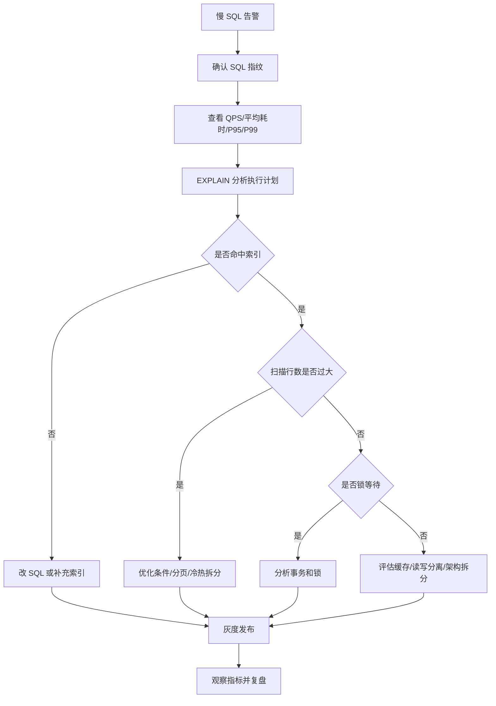

# Prompt
```
你是一名资深 MySQL DBA 与后端架构师，具备大型互联网系统的数据库设计、性能优化、故障排查和研发规范落地经验。

请围绕“ MySQL 开发规范与使用约束”进行系统性梳理，并结合具体案例说明每条规范背后的原因、错误用法、正确做法和可能带来的线上风险。

请按以下结构输出：

一、总体原则
- 从稳定性、可维护性、性能、扩展性、数据一致性、安全性等角度总结 MySQL 使用原则。
- 说明为什么数据库规范不是“代码风格问题”，而是线上稳定性问题。

二、库表设计规范
请覆盖但不限于：
- 数据库、表、字段命名规范
- 字符集与排序规则选择
- 表必须有主键
- 主键类型选择，例如自增 ID、雪花 ID、UUID 的优劣
- 字段类型选择原则
- `NULL` 与 `NOT NULL`
- 默认值设计
- 金额、时间、状态字段的设计
- 大字段、JSON 字段、TEXT/BLOB 字段使用约束
- 冷热数据拆分、历史表设计
- 分库分表前的设计考量

每个关键点请给出：
- 反例 SQL
- 推荐 SQL
- 原因说明
- 可能造成的线上问题

三、索引设计规范
请覆盖但不限于：
- 哪些字段应该建索引
- 单列索引、联合索引的选择
- 最左前缀原则
- 覆盖索引
- 索引下推
- 避免冗余索引
- 区分度低字段是否适合建索引
- 排序、分组、分页场景下的索引设计
- 唯一索引的使用
- 外键是否建议使用
- 索引数量控制

请结合典型业务案例说明，例如：
- 用户订单查询
- 商品列表筛选
- 消息通知未读查询
- 后台管理条件检索
- 深分页查询优化

四、SQL 编写规范
请覆盖但不限于：
- 禁止 `SELECT *`
- WHERE 条件必须命中索引
- 避免在索引列上使用函数、表达式或隐式类型转换
- 避免前置模糊查询
- JOIN 使用约束
- 子查询与 JOIN 的选择
- IN、EXISTS、OR 的使用注意事项
- LIMIT 使用规范
- ORDER BY 与 GROUP BY 优化
- 批量插入、批量更新、批量删除规范
- 事务中的 SQL 数量和执行时间控制
- 避免大事务
- 避免长时间锁表
- 避免全表扫描

每条规范请尽量配套：
- 错误写法
- 正确写法
- EXPLAIN 关注点
- 性能或稳定性影响

五、事务与锁规范
请系统说明：
- MySQL InnoDB 事务隔离级别
- MVCC 基本机制
- 行锁、间隙锁、临键锁
- 死锁产生原因与规避方式
- 悲观锁与乐观锁
- `SELECT ... FOR UPDATE` 使用约束
- 库存扣减、余额变更、订单状态流转等场景下的事务设计
- 如何减少锁范围和锁持有时间

请结合至少 3 个具体案例，例如：
- 秒杀库存扣减
- 用户余额扣款
- 订单超时取消
并给出错误实现与推荐实现。

六、DDL 与变更规范
请覆盖：
- 线上 DDL 风险
- 添加字段、修改字段、添加索引、删除字段的注意事项
- 大表变更方案
- 灰度发布与回滚方案
- 字段兼容性设计
- 应用版本与数据库变更顺序
- 使用 pt-online-schema-change、gh-ost 或 Online DDL 的适用场景
- 禁止高峰期执行高风险 DDL

七、数据安全与权限规范
请覆盖：
- 账号权限最小化
- 禁止应用账号拥有 DDL 权限
- 敏感字段加密或脱敏
- SQL 注入防护
- 数据备份与恢复演练
- 删除、更新操作的二次确认
- 生产环境数据访问审计

八、常见反模式与线上事故案例
请整理至少 10 个常见问题，例如：
- 忘记 WHERE 导致全表更新
- `LIKE '%xxx%'` 扫全表
- 使用 UUID 作为聚簇主键导致页分裂
- 深分页拖垮数据库
- 大事务导致主从延迟
- 未命中索引导致 CPU 飙升
- 低区分度字段滥建索引
- 字段类型不匹配导致隐式转换
- 长事务导致 undo log 膨胀
- 删除大批量历史数据导致锁等待

每个问题请说明：
- 事故现象
- 根因分析
- 复现 SQL 或伪代码
- 修复方案
- 预防规范

九、研发流程落地建议
请给出团队层面的落地方案：
- 建表评审清单
- SQL Review 清单
- 索引 Review 清单
- 慢 SQL 治理流程
- 数据库变更发布流程
- 监控告警指标
- 代码扫描或自动化检查建议
- ORM 使用约束，例如 MyBatis、JPA

十、输出要求
- 内容要系统、工程化、可落地。
- 不要只罗列原则，要解释背后的数据库机制。
- 所有案例要尽量贴近 Java 后端常见业务场景。
- SQL 示例使用 MySQL 8.0 语法。
- 优先关注 InnoDB 存储引擎。
- 对每类规范给出“推荐等级”：强制、建议、谨慎使用、禁止。
- 最后输出一份可直接用于团队内部评审的《MySQL 开发规范 Checklist》。
```

---
# MySQL 开发规范与使用约束

> 默认前提：**MySQL 8.0 + InnoDB + Java 后端 OLTP 系统**。  
> 推荐等级定义：  
> **强制**：违反后大概率造成线上事故或长期技术债。  
> **建议**：多数业务应遵守，特殊场景需评审。  
> **谨慎使用**：可以用，但必须有边界、监控和替代方案。  
> **禁止**：线上业务库不允许出现。

---

# 一、总体原则

## 1. 数据库规范不是“代码风格”，而是稳定性约束

数据库和普通业务代码不一样：

|维度|代码问题|数据库问题|
|---|---|---|
|影响范围|通常影响某个服务实例|可能影响整个业务库、主从复制、所有服务|
|回滚成本|发版回滚相对容易|DDL、数据误删、错误更新很难回滚|
|资源争用|应用实例可水平扩容|单库 CPU、IO、锁、连接数是共享瓶颈|
|故障形态|多数是接口报错|可能是慢 SQL、锁等待、死锁、主从延迟、雪崩|
|修复难度|改代码重新发布|可能需要数据恢复、主从切换、停机窗口|

**结论：MySQL 规范的本质是：限制研发自由度，换取线上稳定性、性能可预期性和可维护性。**

---

## 2. 总体原则表

|原则|推荐等级|说明|
|---|--:|---|
|所有表必须有主键|强制|InnoDB 表天然围绕聚簇索引组织数据，主键设计会影响所有二级索引和 DML 性能|
|所有 SQL 必须可解释、可索引、可限流|强制|禁止不可控全表扫描、无边界更新、无边界删除|
|OLTP 表字段要小、短、稳定|强制|行越宽，Buffer Pool 命中率越低，IO 越重|
|查询路径先设计，索引后设计|强制|索引不是事后补丁，而是表模型的一部分|
|大事务、大批量、大字段、大 JOIN 默认有风险|强制|它们会放大锁、undo、redo、binlog、主从延迟|
|数据库只做擅长的事|建议|复杂搜索交给 ES，复杂分析交给 OLAP，复杂对象存储交给对象存储|
|权限最小化|强制|应用账号不应具备 DDL、DROP、TRUNCATE 等高危权限|
|变更必须可灰度、可回滚、可观测|强制|DDL 和数据变更必须纳入发布流程|

---

# 二、库表设计规范

## 2.1 命名规范

**推荐等级：强制**

### 反例 SQL

```sql
CREATE TABLE Order (
    ID BIGINT,
    UserName VARCHAR(50),
    Type INT,
    desc TEXT
);
```

问题：

- `Order` 接近关键字，`desc` 是 SQL 关键字语义。
    
- 大小写混用，跨平台容易产生不一致。
    
- 字段语义模糊，`Type` 不知道是什么类型。
    
- 没有主键、没有时间字段、没有注释。
    

MySQL 官方文档明确说明，部分关键字如 `SELECT`、`DELETE`、`BIGINT` 等是保留字，作为标识符时需要特殊处理，升级版本还可能引入新的保留字，所以业务表字段应避免使用关键字命名。([MySQL开发者专区](https://dev.mysql.com/doc/refman/8.0/en/keywords.html "MySQL :: MySQL 8.0 Reference Manual :: 11.3 Keywords and Reserved Words"))

### 推荐 SQL

```sql
CREATE TABLE `t_order` (
    `id` BIGINT UNSIGNED NOT NULL AUTO_INCREMENT COMMENT '主键ID',
    `user_id` BIGINT UNSIGNED NOT NULL COMMENT '用户ID',
    `order_no` VARCHAR(64) NOT NULL COMMENT '订单号',
    `order_status` TINYINT UNSIGNED NOT NULL DEFAULT 0 COMMENT '订单状态：0待支付 1已支付 2已取消',
    `created_at` DATETIME(3) NOT NULL DEFAULT CURRENT_TIMESTAMP(3) COMMENT '创建时间',
    `updated_at` DATETIME(3) NOT NULL DEFAULT CURRENT_TIMESTAMP(3) ON UPDATE CURRENT_TIMESTAMP(3) COMMENT '更新时间',
    PRIMARY KEY (`id`),
    UNIQUE KEY `uk_order_no` (`order_no`),
    KEY `idx_user_status_created` (`user_id`, `order_status`, `created_at`)
) ENGINE=InnoDB
  DEFAULT CHARSET=utf8mb4
  COLLATE=utf8mb4_0900_ai_ci
  COMMENT='订单表';
```

### 原因说明

- 表名：`t_xxx` 或业务域前缀，例如 `trade_order`、`pay_order`。
    
- 字段名：统一小写，下划线分隔。
    
- 索引名：`pk_`、`uk_`、`idx_` 前缀。
    
- 禁止保留字、拼音缩写、无意义字段名。
    
- 必须写 `COMMENT`，尤其是状态、金额、枚举字段。
    

### 线上风险

- SQL 需要反引号转义，可读性差。
    
- ORM 映射容易出错。
    
- 版本升级后关键字冲突。
    
- 接手维护者不理解字段语义，误用数据。
    

---

## 2.2 字符集与排序规则

**推荐等级：强制**

### 反例 SQL

```sql
CREATE TABLE user_profile (
    id BIGINT PRIMARY KEY,
    nickname VARCHAR(64)
) DEFAULT CHARSET=utf8;
```

MySQL 里的 `utf8` 长期容易被误解为真正 UTF-8。更稳妥的选择是显式使用 `utf8mb4`。MySQL 文档说明 `utf8mb4` 支持 BMP 和补充字符，单个多字节字符最多 4 字节，而 `utf8mb3` 不支持补充字符。([MySQL开发者专区](https://dev.mysql.com/doc/refman/8.0/en/charset-unicode-utf8mb4.html "MySQL :: MySQL 8.0 Reference Manual :: 12.9.1 The utf8mb4 Character Set (4-Byte UTF-8 Unicode Encoding)"))

### 推荐 SQL

```sql
CREATE TABLE user_profile (
    id BIGINT UNSIGNED NOT NULL AUTO_INCREMENT COMMENT '主键ID',
    nickname VARCHAR(64) NOT NULL DEFAULT '' COMMENT '昵称',
    PRIMARY KEY (id)
) ENGINE=InnoDB
  DEFAULT CHARSET=utf8mb4
  COLLATE=utf8mb4_0900_ai_ci;
```

### 原因说明

- 用户昵称、评论、商品标题可能包含 emoji、生僻字、多语言字符。
    
- `utf8mb4_0900_ai_ci` 是 MySQL 8.0 常用默认排序规则之一，适合一般不区分大小写、重音的业务查询。
    
- 对大小写敏感字段，如 token、code、hash，可使用 `utf8mb4_bin` 或直接用 `VARBINARY`。
    

### 线上风险

- 用户输入 emoji 报错：`Incorrect string value`。
    
- 字符集不一致导致 JOIN、WHERE 比较隐式转换。
    
- 索引长度膨胀，历史系统升级困难。
    

---

## 2.3 表必须有主键

**推荐等级：强制**

InnoDB 表有聚簇索引。定义主键时，InnoDB 使用主键作为聚簇索引；如果没有主键，会选择第一个所有列 `NOT NULL` 的唯一索引；如果也没有，会生成隐藏聚簇索引 `GEN_CLUST_INDEX`。二级索引记录中会保存主键值，所以主键越长，所有二级索引越膨胀。([MySQL开发者专区](https://dev.mysql.com/doc/refman/8.0/en/innodb-index-types.html "MySQL :: MySQL 8.0 Reference Manual :: 17.6.2.1 Clustered and Secondary Indexes"))

### 反例 SQL

```sql
CREATE TABLE user_login_log (
    user_id BIGINT NOT NULL,
    login_ip VARCHAR(64) NOT NULL,
    login_time DATETIME NOT NULL
) ENGINE=InnoDB;
```

### 推荐 SQL

```sql
CREATE TABLE user_login_log (
    id BIGINT UNSIGNED NOT NULL AUTO_INCREMENT COMMENT '主键ID',
    user_id BIGINT UNSIGNED NOT NULL COMMENT '用户ID',
    login_ip VARCHAR(64) NOT NULL DEFAULT '' COMMENT '登录IP',
    login_time DATETIME(3) NOT NULL COMMENT '登录时间',
    PRIMARY KEY (id),
    KEY idx_user_login_time (user_id, login_time)
) ENGINE=InnoDB DEFAULT CHARSET=utf8mb4;
```

### 原因说明

- 主键用于聚簇索引定位行。
    
- 二级索引回表依赖主键。
    
- 无主键表在复制、数据修复、归档、分页扫描中都不友好。
    

### 线上风险

- 大表更新/删除定位困难。
    
- 主从复制、数据订正、归档工具处理不稳定。
    
- 隐藏主键不可见，不利于排查和运维。
    

---

## 2.4 主键类型选择：自增 ID、雪花 ID、UUID

**推荐等级：强制/建议**

|主键方案|推荐等级|优点|缺点|适用场景|
|---|--:|---|---|---|
|`BIGINT AUTO_INCREMENT`|强制优先|短、递增、聚簇索引友好|分库分表后全局唯一需额外方案|单库、单分片、普通 OLTP|
|雪花 ID `BIGINT`|建议|全局唯一、趋势递增|依赖时钟、workerId 管理|分布式订单、支付、消息|
|UUID 字符串|谨慎使用|生成简单、全局唯一|长、随机、页分裂、二级索引膨胀|不建议作为 InnoDB 聚簇主键|
|UUID 二进制 `BINARY(16)`|谨慎使用|比字符串短|仍可能随机写|外部幂等号、trace id|
|业务单号作主键|禁止|看似直观|长、不稳定、业务含义侵入存储|不应作为聚簇主键|

### 反例 SQL：UUID 字符串作为主键

```sql
CREATE TABLE t_order (
    id VARCHAR(36) NOT NULL COMMENT 'UUID主键',
    user_id BIGINT NOT NULL,
    amount DECIMAL(10, 2) NOT NULL,
    PRIMARY KEY (id)
) ENGINE=InnoDB;
```

### 推荐 SQL：内部主键 + 业务唯一号

```sql
CREATE TABLE t_order (
    id BIGINT UNSIGNED NOT NULL AUTO_INCREMENT COMMENT '内部主键',
    order_no VARCHAR(64) NOT NULL COMMENT '业务订单号',
    user_id BIGINT UNSIGNED NOT NULL COMMENT '用户ID',
    amount_cent BIGINT NOT NULL COMMENT '订单金额，单位分',
    PRIMARY KEY (id),
    UNIQUE KEY uk_order_no (order_no),
    KEY idx_user_id (user_id)
) ENGINE=InnoDB DEFAULT CHARSET=utf8mb4;
```

### 原因说明

InnoDB 聚簇索引按主键组织数据，主键短且趋势递增，插入局部性更好。随机 UUID 作为聚簇主键会造成 B+Tree 页频繁分裂、缓存命中下降、二级索引体积增大。

### 线上风险

- 写入 TPS 下降。
    
- Buffer Pool 命中率下降。
    
- 二级索引膨胀。
    
- 大表迁移和归档成本变高。
    

---

## 2.5 字段类型选择原则

**推荐等级：强制**

### 核心原则

> 能用数值不用字符串；能用短类型不用长类型；能定长就不要无限长；能拆字段就不要塞 JSON。

### 反例 SQL

```sql
CREATE TABLE product (
    id BIGINT PRIMARY KEY,
    price VARCHAR(32),
    stock VARCHAR(32),
    status VARCHAR(32),
    created_time VARCHAR(32)
);
```

### 推荐 SQL

```sql
CREATE TABLE product (
    id BIGINT UNSIGNED NOT NULL AUTO_INCREMENT COMMENT '主键ID',
    product_name VARCHAR(128) NOT NULL DEFAULT '' COMMENT '商品名称',
    price_cent BIGINT UNSIGNED NOT NULL DEFAULT 0 COMMENT '价格，单位分',
    stock INT UNSIGNED NOT NULL DEFAULT 0 COMMENT '库存',
    status TINYINT UNSIGNED NOT NULL DEFAULT 0 COMMENT '状态：0下架 1上架',
    created_at DATETIME(3) NOT NULL DEFAULT CURRENT_TIMESTAMP(3) COMMENT '创建时间',
    updated_at DATETIME(3) NOT NULL DEFAULT CURRENT_TIMESTAMP(3) ON UPDATE CURRENT_TIMESTAMP(3) COMMENT '更新时间',
    PRIMARY KEY (id),
    KEY idx_status_created (status, created_at)
) ENGINE=InnoDB DEFAULT CHARSET=utf8mb4;
```

### 类型建议表

|场景|推荐类型|不推荐|
|---|---|---|
|主键|`BIGINT UNSIGNED`|`VARCHAR(36)` UUID|
|金额|`BIGINT` 存分/厘，或 `DECIMAL`|`DOUBLE`、`FLOAT`|
|状态|`TINYINT UNSIGNED`|`VARCHAR(32)`|
|时间|`DATETIME(3)` 或 `TIMESTAMP(3)`|`VARCHAR`|
|手机号|`VARCHAR(20)`|`BIGINT`|
|IP|`VARBINARY(16)` 或 `VARCHAR(45)`|`VARCHAR(255)`|
|是否标记|`TINYINT UNSIGNED`|`CHAR(1)`、`VARCHAR`|
|长文本|单独扩展表 `TEXT`|主表直接塞大字段|

### 线上风险

- 字符串数值比较触发隐式转换。
    
- 浮点金额产生精度问题。
    
- 字段过宽导致页内行数减少，IO 增加。
    
- 状态字段字符串化导致索引效率低、数据不一致。
    

---

## 2.6 `NULL` 与 `NOT NULL`

**推荐等级：强制**

### 反例 SQL

```sql
CREATE TABLE user_account (
    id BIGINT PRIMARY KEY,
    balance_cent BIGINT NULL,
    status TINYINT NULL
);
```

### 推荐 SQL

```sql
CREATE TABLE user_account (
    id BIGINT UNSIGNED NOT NULL AUTO_INCREMENT COMMENT '主键ID',
    user_id BIGINT UNSIGNED NOT NULL COMMENT '用户ID',
    balance_cent BIGINT NOT NULL DEFAULT 0 COMMENT '余额，单位分',
    status TINYINT UNSIGNED NOT NULL DEFAULT 1 COMMENT '状态：1正常 2冻结',
    PRIMARY KEY (id),
    UNIQUE KEY uk_user_id (user_id)
) ENGINE=InnoDB DEFAULT CHARSET=utf8mb4;
```

### 原因说明

- `NULL` 不是空字符串，也不是 0，而是未知。
    
- `NULL` 会增加 SQL 三值逻辑复杂度。
    
- 索引列允许 `NULL` 时，索引统计和查询条件更复杂；MySQL `EXPLAIN` 的 `key_len` 也会因为可空列多占长度。([MySQL开发者专区](https://dev.mysql.com/doc/refman/8.0/en/explain-output.html "MySQL :: MySQL 8.0 Reference Manual :: 10.8.2 EXPLAIN Output Format"))
    

### 线上风险

```sql
-- 预期查出未冻结用户，但 status 为 NULL 的数据不会被查出
SELECT * FROM user_account WHERE status != 2;
```

- 业务判断遗漏。
    
- 唯一索引对 `NULL` 的行为容易被误解。
    
- ORM 自动装箱类型出现 NPE。
    
- 查询条件需要额外 `IS NULL`，降低可读性。
    

---

## 2.7 默认值设计

**推荐等级：强制**

### 反例 SQL

```sql
CREATE TABLE user_profile (
    id BIGINT PRIMARY KEY,
    nickname VARCHAR(64) DEFAULT NULL,
    avatar_url VARCHAR(512) DEFAULT NULL,
    status TINYINT DEFAULT NULL
);
```

### 推荐 SQL

```sql
CREATE TABLE user_profile (
    id BIGINT UNSIGNED NOT NULL AUTO_INCREMENT,
    nickname VARCHAR(64) NOT NULL DEFAULT '' COMMENT '昵称',
    avatar_url VARCHAR(512) NOT NULL DEFAULT '' COMMENT '头像URL',
    status TINYINT UNSIGNED NOT NULL DEFAULT 1 COMMENT '状态：1正常 2禁用',
    created_at DATETIME(3) NOT NULL DEFAULT CURRENT_TIMESTAMP(3),
    updated_at DATETIME(3) NOT NULL DEFAULT CURRENT_TIMESTAMP(3) ON UPDATE CURRENT_TIMESTAMP(3),
    PRIMARY KEY (id)
) ENGINE=InnoDB DEFAULT CHARSET=utf8mb4;
```

### 原因说明

默认值应该表达业务初始状态，而不是让业务代码猜。

### 线上风险

- 新增字段后旧代码插入失败。
    
- Java DTO、PO 自动映射出现 `null`。
    
- 统计 SQL 出现漏算。
    

---

## 2.8 金额、时间、状态字段设计

**推荐等级：强制**

### 金额字段

#### 反例

```sql
amount DOUBLE NOT NULL
```

#### 推荐

```sql
amount_cent BIGINT NOT NULL DEFAULT 0 COMMENT '金额，单位分'
```

或者：

```sql
amount DECIMAL(18, 2) NOT NULL DEFAULT 0.00 COMMENT '金额'
```

#### 原因

- `DOUBLE/FLOAT` 是浮点数，不适合财务精确计算。
    
- 高并发扣款、退款、对账要求精确一致。
    

---

### 时间字段

#### 反例

```sql
create_time VARCHAR(32)
```

#### 推荐

```sql
created_at DATETIME(3) NOT NULL DEFAULT CURRENT_TIMESTAMP(3),
updated_at DATETIME(3) NOT NULL DEFAULT CURRENT_TIMESTAMP(3) ON UPDATE CURRENT_TIMESTAMP(3)
```

#### 建议

- 普通业务：`DATETIME(3)`。
    
- 强时区转换场景：应用层统一 UTC 或明确时区策略。
    
- 禁止字符串存时间。
    

---

### 状态字段

#### 反例

```sql
status VARCHAR(32) NOT NULL DEFAULT 'PAID'
```

#### 推荐

```sql
order_status TINYINT UNSIGNED NOT NULL DEFAULT 0 COMMENT '0待支付 1已支付 2已取消 3已退款'
```

#### 原因

- 数值状态索引更短。
    
- Java enum 与 DB code 显式映射。
    
- 状态机流转便于做条件更新。
    

### 推荐状态更新

```sql
UPDATE t_order
SET order_status = 1,
    paid_at = NOW(3),
    updated_at = NOW(3)
WHERE order_no = #{orderNo}
  AND order_status = 0;
```

### 线上风险

- 金额精度错导致资损。
    
- 时间字符串无法有效范围查询。
    
- 状态无约束导致非法流转。
    

---

## 2.9 大字段、JSON、TEXT/BLOB 使用约束

**推荐等级：谨慎使用**

MySQL 8.0 支持原生 `JSON` 类型，具备 JSON 文档校验和内部优化存储格式；但 JSON 列不能像普通标量列那样直接建常规索引，通常需要生成列或表达式索引来支持检索。([MySQL开发者专区](https://dev.mysql.com/doc/refman/8.0/en/json.html "MySQL :: MySQL 8.0 Reference Manual :: 13.5 The JSON Data Type"))

### 反例 SQL：主表塞大 JSON

```sql
CREATE TABLE t_order (
    id BIGINT PRIMARY KEY,
    user_id BIGINT NOT NULL,
    order_status TINYINT NOT NULL,
    ext JSON NOT NULL,
    remark TEXT,
    KEY idx_user_status (user_id, order_status)
);
```

### 推荐 SQL：主表短字段 + 扩展表

```sql
CREATE TABLE t_order (
    id BIGINT UNSIGNED NOT NULL AUTO_INCREMENT,
    order_no VARCHAR(64) NOT NULL,
    user_id BIGINT UNSIGNED NOT NULL,
    order_status TINYINT UNSIGNED NOT NULL DEFAULT 0,
    amount_cent BIGINT NOT NULL DEFAULT 0,
    created_at DATETIME(3) NOT NULL DEFAULT CURRENT_TIMESTAMP(3),
    PRIMARY KEY (id),
    UNIQUE KEY uk_order_no (order_no),
    KEY idx_user_status_created (user_id, order_status, created_at)
) ENGINE=InnoDB DEFAULT CHARSET=utf8mb4;

CREATE TABLE t_order_ext (
    order_id BIGINT UNSIGNED NOT NULL,
    invoice_info JSON NULL COMMENT '发票扩展信息',
    buyer_remark VARCHAR(1024) NOT NULL DEFAULT '',
    seller_remark VARCHAR(1024) NOT NULL DEFAULT '',
    PRIMARY KEY (order_id)
) ENGINE=InnoDB DEFAULT CHARSET=utf8mb4;
```

### JSON 可检索字段推荐写法

```sql
ALTER TABLE t_order_ext
ADD COLUMN invoice_title VARCHAR(128)
    GENERATED ALWAYS AS (JSON_UNQUOTE(JSON_EXTRACT(invoice_info, '$.title'))) STORED,
ADD KEY idx_invoice_title (invoice_title);
```

### 原因说明

- 大字段会降低主表扫描和索引回表效率。
    
- JSON 适合低频、扩展、不稳定字段。
    
- 高频检索字段必须结构化，不应藏在 JSON 内。
    
- `TEXT/BLOB/JSON` 不应出现在高频列表查询中。
    

### 线上风险

- 主表行过宽，Buffer Pool 缓存效率下降。
    
- 查询列表时大量读取无用大字段。
    
- JSON 内字段无法有效索引，导致全表扫描。
    
- 大字段更新产生更多 redo、undo、binlog。
    

---

## 2.10 冷热数据拆分、历史表设计

**推荐等级：建议**

### 反例：订单表无限增长

```sql
SELECT *
FROM t_order
WHERE user_id = 10001
ORDER BY created_at DESC
LIMIT 20;
```

`t_order` 保存 5 年订单，单表 30 亿行，所有查询都在同一张表上打。

### 推荐设计

```sql
CREATE TABLE t_order (
    id BIGINT UNSIGNED NOT NULL AUTO_INCREMENT,
    order_no VARCHAR(64) NOT NULL,
    user_id BIGINT UNSIGNED NOT NULL,
    order_status TINYINT UNSIGNED NOT NULL,
    created_at DATETIME(3) NOT NULL,
    PRIMARY KEY (id),
    UNIQUE KEY uk_order_no (order_no),
    KEY idx_user_created (user_id, created_at)
) ENGINE=InnoDB DEFAULT CHARSET=utf8mb4 COMMENT='订单热表';

CREATE TABLE t_order_history (
    id BIGINT UNSIGNED NOT NULL,
    order_no VARCHAR(64) NOT NULL,
    user_id BIGINT UNSIGNED NOT NULL,
    order_status TINYINT UNSIGNED NOT NULL,
    created_at DATETIME(3) NOT NULL,
    archived_at DATETIME(3) NOT NULL,
    PRIMARY KEY (id),
    UNIQUE KEY uk_order_no (order_no),
    KEY idx_user_created (user_id, created_at)
) ENGINE=InnoDB DEFAULT CHARSET=utf8mb4 COMMENT='订单历史表';
```

### 原因说明

- 热表保留近 3 到 12 个月数据。
    
- 历史表用于低频查询、客服查询、归档。
    
- 删除历史数据用小批量迁移，不做一次性大 DELETE。
    

### 线上风险

- 单表持续膨胀，索引高度增加。
    
- 备份恢复时间变长。
    
- DDL、索引维护成本变高。
    
- 慢查询治理越来越困难。
    

---

## 2.11 分库分表前的设计考量

**推荐等级：建议，过早分片谨慎**

### 反例

一开始就按 `user_id % 64` 分 64 张表，但业务后续核心查询是：

```sql
SELECT *
FROM t_order_??
WHERE order_no = #{orderNo};
```

结果不知道查哪张表，只能广播。

### 推荐原则

|设计问题|必须回答|
|---|---|
|分片键是什么|`user_id`、`order_id`、`tenant_id`？|
|核心查询是否都带分片键|不带分片键会广播|
|唯一约束如何保证|单库唯一索引失效后要靠全局唯一 ID|
|跨分片事务如何处理|最终一致性、消息、TCC、Saga？|
|分页排序怎么做|跨分片排序成本很高|
|扩容怎么做|一致性哈希、迁移、双写、路由版本|
|运维成本是否可接受|备份、恢复、DDL、监控复杂度上升|

### 推荐 SQL：分片友好的唯一键

```sql
CREATE TABLE t_order_00 (
    id BIGINT UNSIGNED NOT NULL COMMENT '雪花ID',
    user_id BIGINT UNSIGNED NOT NULL COMMENT '分片键',
    order_no VARCHAR(64) NOT NULL COMMENT '订单号',
    order_status TINYINT UNSIGNED NOT NULL,
    created_at DATETIME(3) NOT NULL,
    PRIMARY KEY (id),
    UNIQUE KEY uk_order_no (order_no),
    KEY idx_user_created (user_id, created_at)
) ENGINE=InnoDB DEFAULT CHARSET=utf8mb4;
```

### 线上风险

- 广播查询拖垮所有分片。
    
- 跨分片 JOIN 不可控。
    
- 分布式事务复杂度飙升。
    
- 扩容迁移成本远超预期。
    

---

# 三、索引设计规范

## 3.1 索引设计总原则

**推荐等级：强制**

索引不是“字段上随手加一个 KEY”。索引必须服务于明确 SQL。

```text
业务查询路径 -> WHERE 条件 -> ORDER BY/GROUP BY -> SELECT 字段 -> 联合索引设计
```

MySQL `EXPLAIN` 可显示执行计划，包括 `type`、`possible_keys`、`key`、`key_len`、`rows`、`filtered`、`Extra` 等信息；其中 `key` 是实际选择的索引，`rows` 是估计扫描行数，`Extra` 会显示 `Using filesort`、`Using temporary`、`Using index condition` 等关键信息。([MySQL开发者专区](https://dev.mysql.com/doc/refman/8.0/en/explain-output.html "MySQL :: MySQL 8.0 Reference Manual :: 10.8.2 EXPLAIN Output Format"))

---

## 3.2 哪些字段应该建索引

**推荐等级：强制**

### 应该建索引

|字段类型|示例|
|---|---|
|高频 WHERE 条件|`user_id`、`order_no`、`tenant_id`|
|JOIN 关联字段|`order_id`、`product_id`|
|排序字段|`created_at`、`id`|
|分组字段|`category_id`|
|唯一约束字段|`order_no`、`request_id`|
|状态 + 时间组合|`status, created_at`|

### 不应盲目建索引

|字段|原因|
|---|---|
|低区分度字段|单独 `gender`、`is_deleted` 效果差|
|大字段|`TEXT/BLOB/JSON` 不适合普通索引|
|很少查询字段|增加写入成本|
|频繁更新字段|索引维护成本高|

---

## 3.3 单列索引 vs 联合索引

**推荐等级：强制**

### 业务场景：用户订单列表

查询：

```sql
SELECT id, order_no, order_status, amount_cent, created_at
FROM t_order
WHERE user_id = ?
  AND order_status = ?
ORDER BY created_at DESC
LIMIT 20;
```

### 反例索引

```sql
KEY idx_user_id (user_id),
KEY idx_order_status (order_status),
KEY idx_created_at (created_at)
```

### 推荐索引

```sql
KEY idx_user_status_created (user_id, order_status, created_at DESC)
```

### 原因说明

- 单列索引通常只能选择一个主路径。
    
- 联合索引可以同时服务过滤和排序。
    
- 等值字段在前，范围/排序字段在后。
    
- MySQL 8.0 支持降序索引，可用于匹配倒序排序。
    

### EXPLAIN 关注点

```sql
EXPLAIN
SELECT id, order_no, order_status, amount_cent, created_at
FROM t_order
WHERE user_id = 10001
  AND order_status = 1
ORDER BY created_at DESC
LIMIT 20;
```

重点看：

|字段|期望|
|---|---|
|`type`|`ref` / `range`，不要 `ALL`|
|`key`|`idx_user_status_created`|
|`rows`|尽量小|
|`Extra`|避免 `Using filesort`、`Using temporary`|

---

## 3.4 最左前缀原则

**推荐等级：强制**

联合索引：

```sql
KEY idx_user_status_created (user_id, order_status, created_at)
```

### 可命中

```sql
WHERE user_id = ?
WHERE user_id = ? AND order_status = ?
WHERE user_id = ? AND order_status = ? AND created_at >= ?
```

### 不完整命中或无法有效命中

```sql
WHERE order_status = ?
WHERE created_at >= ?
WHERE order_status = ? AND created_at >= ?
```

### 原因说明

B+Tree 联合索引按 `(user_id, order_status, created_at)` 排序。跳过 `user_id` 后，后续字段不再是全局有序。

### 线上风险

- 看似建了索引，实际查询不走。
    
- 后台条件检索频繁全表扫。
    
- 临时加索引越来越多，索引膨胀。
    

---

## 3.5 覆盖索引

**推荐等级：建议**

### 业务场景：消息未读数

```sql
SELECT COUNT(*)
FROM t_notification
WHERE user_id = ?
  AND read_status = 0;
```

### 推荐表结构

```sql
CREATE TABLE t_notification (
    id BIGINT UNSIGNED NOT NULL AUTO_INCREMENT,
    user_id BIGINT UNSIGNED NOT NULL,
    read_status TINYINT UNSIGNED NOT NULL DEFAULT 0,
    biz_type TINYINT UNSIGNED NOT NULL DEFAULT 0,
    title VARCHAR(128) NOT NULL DEFAULT '',
    created_at DATETIME(3) NOT NULL,
    PRIMARY KEY (id),
    KEY idx_user_read_created (user_id, read_status, created_at)
) ENGINE=InnoDB DEFAULT CHARSET=utf8mb4;
```

### 推荐查询

```sql
SELECT id, title, created_at
FROM t_notification
WHERE user_id = ?
  AND read_status = 0
ORDER BY created_at DESC
LIMIT 20;
```

如果查询字段都在索引里，`EXPLAIN Extra` 可能出现 `Using index`，表示仅通过索引树获取列信息，不需要额外回表。([MySQL开发者专区](https://dev.mysql.com/doc/refman/8.0/en/explain-output.html "MySQL :: MySQL 8.0 Reference Manual :: 10.8.2 EXPLAIN Output Format"))

### 风险

- 覆盖索引不是越宽越好。
    
- 为覆盖而把很多字段塞进索引，会增加写入成本和索引体积。
    
- 高频核心查询可以做覆盖，低频后台查询不应过度优化。
    

---

## 3.6 索引下推 ICP

**推荐等级：理解机制，建议利用**

### 示例

索引：

```sql
KEY idx_user_status_title (user_id, order_status, title)
```

查询：

```sql
SELECT *
FROM t_order
WHERE user_id = ?
  AND order_status = ?
  AND title LIKE 'iPhone%';
```

MySQL 的 `Extra` 如果出现 `Using index condition`，表示存储引擎先用索引条件过滤，减少回表。官方文档说明，ICP 会先访问索引元组并测试部分条件，必要时才读取完整行。([MySQL开发者专区](https://dev.mysql.com/doc/refman/8.0/en/explain-output.html "MySQL :: MySQL 8.0 Reference Manual :: 10.8.2 EXPLAIN Output Format"))

### 错误理解

```sql
-- 以为 ICP 能拯救所有 LIKE
WHERE title LIKE '%iPhone%'
```

前置 `%` 仍然无法利用普通 B+Tree 的有序性。

---

## 3.7 避免冗余索引

**推荐等级：强制**

### 反例

```sql
KEY idx_user_id (user_id),
KEY idx_user_status (user_id, order_status),
KEY idx_user_status_created (user_id, order_status, created_at)
```

### 推荐

```sql
KEY idx_user_status_created (user_id, order_status, created_at)
```

### 原因说明

`idx_user_status_created` 的左前缀已经覆盖：

- `(user_id)`
    
- `(user_id, order_status)`
    

### 线上风险

- 写入、更新、删除都要维护更多索引。
    
- Buffer Pool 被无效索引占用。
    
- 优化器选择成本上升。
    
- DDL 添加/删除索引更慢。
    

---

## 3.8 低区分度字段是否适合建索引

**推荐等级：谨慎使用**

### 反例

```sql
KEY idx_gender (gender),
KEY idx_deleted (is_deleted),
KEY idx_status (status)
```

### 推荐组合

```sql
KEY idx_status_created (status, created_at),
KEY idx_user_deleted_created (user_id, is_deleted, created_at)
```

### 原因说明

单独的 `status`、`gender`、`is_deleted` 区分度低。如果查询会返回大量行，索引扫描 + 回表可能比全表扫描更差。

### 适合建的情况

```sql
WHERE user_id = ? AND is_deleted = 0 ORDER BY created_at DESC LIMIT 20
```

这时 `is_deleted` 作为联合索引的一部分是合理的。

---

## 3.9 排序、分组、分页索引设计

**推荐等级：强制**

### 商品列表筛选

查询：

```sql
SELECT id, product_name, price_cent, sales_count
FROM t_product
WHERE category_id = ?
  AND status = 1
ORDER BY sales_count DESC, id DESC
LIMIT 20;
```

推荐索引：

```sql
KEY idx_category_status_sales_id (
    category_id,
    status,
    sales_count DESC,
    id DESC
)
```

### GROUP BY 场景

```sql
SELECT category_id, COUNT(*)
FROM t_product
WHERE status = 1
GROUP BY category_id;
```

推荐索引：

```sql
KEY idx_status_category (status, category_id)
```

### 原因说明

- `WHERE` 等值列放前面。
    
- `ORDER BY` 或 `GROUP BY` 列尽量接在后面。
    
- 排序方向要和索引方向匹配。
    
- 避免大结果集 `Using filesort` 和 `Using temporary`。官方文档也提示，追求查询速度时需要关注 `Using filesort` 和 `Using temporary`。([MySQL开发者专区](https://dev.mysql.com/doc/refman/8.0/en/explain-output.html "MySQL :: MySQL 8.0 Reference Manual :: 10.8.2 EXPLAIN Output Format"))
    

---

## 3.10 唯一索引使用

**推荐等级：强制**

唯一索引不只是性能优化，更是数据一致性约束。

### 典型场景

|场景|唯一索引|
|---|---|
|订单号|`uk_order_no(order_no)`|
|支付流水号|`uk_pay_no(pay_no)`|
|幂等请求号|`uk_request_id(request_id)`|
|用户手机号|`uk_mobile(mobile)`|
|三方交易号|`uk_channel_trade_no(channel, trade_no)`|

### 推荐 SQL

```sql
CREATE TABLE t_payment (
    id BIGINT UNSIGNED NOT NULL AUTO_INCREMENT,
    pay_no VARCHAR(64) NOT NULL,
    order_no VARCHAR(64) NOT NULL,
    request_id VARCHAR(64) NOT NULL COMMENT '幂等请求ID',
    amount_cent BIGINT NOT NULL,
    pay_status TINYINT UNSIGNED NOT NULL DEFAULT 0,
    created_at DATETIME(3) NOT NULL DEFAULT CURRENT_TIMESTAMP(3),
    PRIMARY KEY (id),
    UNIQUE KEY uk_pay_no (pay_no),
    UNIQUE KEY uk_request_id (request_id),
    KEY idx_order_no (order_no)
) ENGINE=InnoDB DEFAULT CHARSET=utf8mb4;
```

### 线上风险

- 并发重复下单。
    
- 重复扣款。
    
- MQ 重复消费导致重复入账。
    
- 应用层判断无法替代数据库唯一约束。
    

---

## 3.11 外键是否建议使用

**推荐等级：互联网 OLTP 谨慎使用 / 多数团队不建议物理外键**

### 反例

```sql
CREATE TABLE t_order_item (
    id BIGINT PRIMARY KEY,
    order_id BIGINT NOT NULL,
    CONSTRAINT fk_order_item_order
        FOREIGN KEY (order_id) REFERENCES t_order(id)
);
```

### 推荐

```sql
CREATE TABLE t_order_item (
    id BIGINT UNSIGNED NOT NULL AUTO_INCREMENT,
    order_id BIGINT UNSIGNED NOT NULL,
    product_id BIGINT UNSIGNED NOT NULL,
    quantity INT UNSIGNED NOT NULL,
    PRIMARY KEY (id),
    KEY idx_order_id (order_id)
) ENGINE=InnoDB DEFAULT CHARSET=utf8mb4;
```

### 原因说明

- 物理外键会增加写入、删除、DDL 的耦合。
    
- 分库分表后物理外键基本不可用。
    
- 更推荐通过应用层、领域模型、唯一索引、数据巡检保证一致性。
    

### 例外

- 内部低并发管理系统。
    
- 强一致且表规模小。
    
- 团队 DBA 明确允许。
    

---

## 3.12 索引数量控制

**推荐等级：强制**

### 建议

|表类型|索引数量建议|
|---|---|
|高频写入表|3 到 5 个以内|
|普通业务表|5 到 8 个以内|
|低频配置表|可适当放宽|
|宽表/大表|严格评审每个索引|

### 原因

每个索引都会增加：

- INSERT 成本。
    
- UPDATE 索引字段成本。
    
- DELETE 成本。
    
- Buffer Pool 占用。
    
- DDL 成本。
    
- binlog/redo 间接压力。
    

---

# 四、SQL 编写规范

## 4.1 禁止 `SELECT *`

**推荐等级：强制**

### 错误写法

```sql
SELECT *
FROM t_order
WHERE user_id = ?
ORDER BY created_at DESC
LIMIT 20;
```

### 正确写法

```sql
SELECT id, order_no, order_status, amount_cent, created_at
FROM t_order
WHERE user_id = ?
ORDER BY created_at DESC
LIMIT 20;
```

### EXPLAIN 关注点

- 是否可以 `Using index`。
    
- 是否大量回表。
    
- 是否读取大字段。
    

### 影响

- 表新增字段后接口返回变大。
    
- 读取无用 `TEXT/JSON` 字段。
    
- 覆盖索引失效。
    
- 网络传输和序列化成本上升。
    

---

## 4.2 WHERE 条件必须命中索引

**推荐等级：强制**

### 错误写法

```sql
SELECT id, order_no
FROM t_order
WHERE buyer_mobile = ?;
```

但没有 `buyer_mobile` 索引。

### 正确写法

```sql
ALTER TABLE t_order
ADD KEY idx_buyer_mobile (buyer_mobile);

SELECT id, order_no
FROM t_order
WHERE buyer_mobile = ?;
```

### EXPLAIN 关注点

|字段|问题|
|---|---|
|`type = ALL`|全表扫描|
|`key = NULL`|未使用索引|
|`rows` 很大|扫描过多|
|`filtered` 很低|过滤效率差|

### 线上风险

- CPU 飙升。
    
- Buffer Pool 被全表扫描污染。
    
- 慢 SQL 堆积。
    
- 连接池耗尽。
    

---

## 4.3 避免在索引列上使用函数、表达式、隐式类型转换

**推荐等级：强制**

### 错误写法：函数

```sql
SELECT *
FROM t_order
WHERE DATE(created_at) = '2026-05-13';
```

### 正确写法：范围查询

```sql
SELECT id, order_no, amount_cent
FROM t_order
WHERE created_at >= '2026-05-13 00:00:00'
  AND created_at <  '2026-05-14 00:00:00';
```

### 错误写法：表达式

```sql
SELECT *
FROM t_order
WHERE amount_cent / 100 > 100;
```

### 正确写法

```sql
SELECT *
FROM t_order
WHERE amount_cent > 10000;
```

### 错误写法：隐式类型转换

```sql
-- order_no 是 VARCHAR
SELECT *
FROM t_order
WHERE order_no = 202605130001;
```

### 正确写法

```sql
SELECT *
FROM t_order
WHERE order_no = '202605130001';
```

### 影响

- 索引列被计算，B+Tree 有序性无法直接利用。
    
- 隐式转换可能导致索引失效。
    
- 高并发下变成全表扫描。
    

---

## 4.4 避免前置模糊查询

**推荐等级：强制**

### 错误写法

```sql
SELECT id, product_name
FROM t_product
WHERE product_name LIKE '%手机%';
```

### 正确做法一：后缀模糊

```sql
SELECT id, product_name
FROM t_product
WHERE product_name LIKE 'iPhone%';
```

### 正确做法二：搜索系统

```text
商品标题、内容搜索、分词搜索、模糊搜索：交给 Elasticsearch / OpenSearch。
MySQL 只保留精确查询、前缀查询、核心交易查询。
```

### 线上风险

- 大表全表扫描。
    
- CPU 飙升。
    
- 商品列表接口拖垮主库。
    
- 搜索需求污染交易库。
    

---

## 4.5 JOIN 使用约束

**推荐等级：谨慎使用**

### 错误写法

```sql
SELECT *
FROM t_order o
JOIN t_order_item i ON o.id = i.order_id
JOIN t_product p ON i.product_id = p.id
JOIN t_user u ON o.user_id = u.id
WHERE u.mobile = ?
ORDER BY o.created_at DESC
LIMIT 20;
```

### 推荐写法：拆查询

```sql
-- 1. 先通过用户唯一索引查 user_id
SELECT id
FROM t_user
WHERE mobile = ?;

-- 2. 再查订单
SELECT id, order_no, order_status, amount_cent, created_at
FROM t_order
WHERE user_id = ?
ORDER BY created_at DESC
LIMIT 20;

-- 3. 必要时批量查订单明细
SELECT order_id, product_id, quantity
FROM t_order_item
WHERE order_id IN (?, ?, ?);
```

### JOIN 允许条件

|条件|要求|
|---|---|
|小表 JOIN|可接受|
|大表 JOIN|必须评审|
|JOIN 字段|双方必须有索引|
|JOIN 数量|OLTP 核心链路不建议超过 2 到 3 张表|
|返回行数|必须可控|
|分库分表|禁止跨分片 JOIN|

### EXPLAIN 关注点

- 驱动表是否足够小。
    
- 被驱动表关联字段是否命中索引。
    
- 是否出现 `Using join buffer`。
    
- 是否扫描大量行。
    

---

## 4.6 子查询与 JOIN 的选择

**推荐等级：建议**

### 错误写法

```sql
SELECT *
FROM t_order
WHERE user_id IN (
    SELECT id FROM t_user WHERE register_source = 'ad'
);
```

当子查询结果巨大时，风险高。

### 推荐写法

```sql
SELECT o.id, o.order_no, o.created_at
FROM t_order o
JOIN (
    SELECT id
    FROM t_user
    WHERE register_source = 'ad'
    LIMIT 1000
) u ON o.user_id = u.id;
```

或者应用层拆批处理：

```text
先批量查 user_id -> 再按 user_id 分批查订单。
```

### 原因说明

MySQL 8.0 优化器已经能优化很多子查询，但规范上仍要求：

- 子查询结果集必须可控。
    
- 大结果集必须分页/分批。
    
- 核心链路优先使用明确索引路径。
    

---

## 4.7 `IN`、`EXISTS`、`OR` 使用注意事项

**推荐等级：谨慎使用**

### `IN` 错误写法

```sql
SELECT *
FROM t_order
WHERE user_id IN (... 几万个 ID ...);
```

### 正确写法

```sql
-- 分批，每批 500 或 1000，视业务压测结果决定
SELECT id, order_no
FROM t_order
WHERE user_id IN (?, ?, ...);
```

### `OR` 错误写法

```sql
SELECT *
FROM t_order
WHERE user_id = ?
   OR order_status = ?;
```

### 推荐改写

```sql
SELECT id, order_no
FROM t_order
WHERE user_id = ?

UNION ALL

SELECT id, order_no
FROM t_order
WHERE order_status = ?
  AND user_id <> ?;
```

### `EXISTS` 适用

```sql
SELECT u.id, u.nickname
FROM t_user u
WHERE EXISTS (
    SELECT 1
    FROM t_order o
    WHERE o.user_id = u.id
      AND o.order_status = 1
);
```

### 原则

- `IN` 列表不能无限大。
    
- `OR` 两边都应有可用索引，否则容易退化。
    
- `EXISTS` 适合判断存在性，不需要返回子查询数据。
    

---

## 4.8 LIMIT 使用规范

**推荐等级：强制**

### 错误写法：无限查询

```sql
SELECT id, order_no
FROM t_order
WHERE user_id = ?;
```

### 正确写法

```sql
SELECT id, order_no
FROM t_order
WHERE user_id = ?
ORDER BY created_at DESC
LIMIT 20;
```

### 错误写法：深分页

```sql
SELECT id, order_no, created_at
FROM t_order
WHERE user_id = ?
ORDER BY created_at DESC
LIMIT 1000000, 20;
```

### 推荐写法：游标分页

```sql
SELECT id, order_no, created_at
FROM t_order
WHERE user_id = ?
  AND (created_at, id) < (?, ?)
ORDER BY created_at DESC, id DESC
LIMIT 20;
```

推荐索引：

```sql
KEY idx_user_created_id (user_id, created_at DESC, id DESC)
```

### 线上风险

- `LIMIT offset, size` 需要扫描并丢弃 offset 行。
    
- 深分页会消耗大量 CPU、IO。
    
- 容易拖垮后台管理查询。
    

---

## 4.9 ORDER BY 与 GROUP BY 优化

**推荐等级：强制**

### 错误写法

```sql
SELECT user_id, COUNT(*)
FROM t_order
WHERE created_at >= '2026-05-01'
GROUP BY user_id
ORDER BY COUNT(*) DESC;
```

大表实时统计，容易临时表和排序。

### 推荐做法

```sql
CREATE TABLE t_user_order_daily_stat (
    stat_date DATE NOT NULL,
    user_id BIGINT UNSIGNED NOT NULL,
    order_count INT UNSIGNED NOT NULL DEFAULT 0,
    amount_cent BIGINT NOT NULL DEFAULT 0,
    PRIMARY KEY (stat_date, user_id),
    KEY idx_stat_order_count (stat_date, order_count)
) ENGINE=InnoDB DEFAULT CHARSET=utf8mb4;
```

查询：

```sql
SELECT user_id, order_count
FROM t_user_order_daily_stat
WHERE stat_date = '2026-05-13'
ORDER BY order_count DESC
LIMIT 100;
```

### 原因

- OLTP 库不适合临时做大规模聚合排序。
    
- 高频统计应预聚合。
    
- 复杂分析交给 OLAP。
    

---

## 4.10 批量插入、更新、删除规范

**推荐等级：强制**

### 批量插入

#### 错误写法

```sql
INSERT INTO t_msg(user_id, content) VALUES (?, ?);
-- 循环执行 10000 次
```

#### 推荐写法

```sql
INSERT INTO t_msg(user_id, content, created_at)
VALUES
(?, ?, NOW(3)),
(?, ?, NOW(3)),
(?, ?, NOW(3));
```

建议每批 500 到 1000 行，具体看行宽、binlog、网络包大小。

---

### 批量更新

#### 错误写法

```sql
UPDATE t_order
SET order_status = 2
WHERE created_at < '2025-01-01';
```

#### 推荐写法

```sql
UPDATE t_order
SET order_status = 2,
    updated_at = NOW(3)
WHERE order_status = 0
  AND created_at < '2025-01-01'
ORDER BY id
LIMIT 500;
```

循环执行，间隔 sleep，监控锁等待和主从延迟。

---

### 批量删除

#### 错误写法

```sql
DELETE FROM t_login_log
WHERE created_at < '2025-01-01';
```

#### 推荐写法

```sql
DELETE FROM t_login_log
WHERE id < ?
ORDER BY id
LIMIT 1000;
```

更推荐历史归档：

```sql
INSERT INTO t_login_log_history
SELECT *
FROM t_login_log
WHERE id BETWEEN ? AND ?;

DELETE FROM t_login_log
WHERE id BETWEEN ? AND ?;
```

### 线上风险

- 大事务。
    
- 长时间锁等待。
    
- undo/redo/binlog 暴涨。
    
- 主从延迟。
    
- 误删后恢复困难。
    

---

## 4.11 事务中的 SQL 数量和执行时间控制

**推荐等级：强制**

### 错误写法

```java
@Transactional
public void importOrders(List<OrderDTO> orders) {
    for (OrderDTO dto : orders) {
        orderMapper.insert(dto);
        orderItemMapper.batchInsert(dto.getItems());
        inventoryClient.lockStock(dto); // 远程调用
        paymentClient.preparePay(dto);  // 远程调用
    }
}
```

### 正确原则

```java
@Transactional(rollbackFor = Exception.class)
public void createOrder(CreateOrderCommand cmd) {
    // 只放必须强一致的本地 DB 操作
    orderMapper.insert(order);
    orderItemMapper.batchInsert(items);
    inventoryMapper.freezeStock(cmd.getSkuId(), cmd.getQuantity());
}

// 事务提交后，通过 MQ / 事务消息 / outbox 触发后续动作
```

### 禁止

- 事务中调用 RPC。
    
- 事务中进行文件上传。
    
- 事务中执行大量循环 SQL。
    
- 事务中等待用户输入。
    
- 事务中做复杂计算。
    

---

## 4.12 避免大事务、长时间锁表、全表扫描

**推荐等级：强制**

### 大事务风险

- 长时间持有行锁。
    
- undo log 无法及时清理。
    
- rollback 成本高。
    
- binlog 大，主从延迟。
    
- 影响 Online DDL metadata lock。
    

InnoDB 的 MVCC 会保存旧版本行以支持一致性读和回滚，旧版本信息存放在 undo 相关结构中；官方文档也建议定期提交事务，否则 update undo log 无法丢弃，rollback segment 可能增长过大。([MySQL开发者专区](https://dev.mysql.com/doc/refman/8.0/en/innodb-multi-versioning.html "MySQL :: MySQL 8.0 Reference Manual :: 17.3 InnoDB Multi-Versioning"))

---

# 五、事务与锁规范

## 5.1 InnoDB 事务隔离级别

**推荐等级：必须理解**

|隔离级别|特点|OLTP 建议|
|---|---|---|
|`READ UNCOMMITTED`|可能脏读|禁止|
|`READ COMMITTED`|每次一致性读创建新快照|可用于降低 gap lock，需评审|
|`REPEATABLE READ`|InnoDB 默认级别，同事务普通 SELECT 读同一快照|默认推荐|
|`SERIALIZABLE`|最强隔离，并发最低|特殊场景|

MySQL 官方文档说明，InnoDB 默认隔离级别是 `REPEATABLE READ`；在该级别下，普通一致性读读取事务第一次读建立的快照，而锁定读、UPDATE、DELETE 会根据唯一索引等值条件或范围条件采取不同锁策略。([MySQL开发者专区](https://dev.mysql.com/doc/refman/8.0/en/innodb-transaction-isolation-levels.html?ff=nopfpls "MySQL :: MySQL 8.0 Reference Manual :: 17.7.2.1 Transaction Isolation Levels"))

---

## 5.2 MVCC 基本机制

**推荐等级：必须理解**

### 简化理解

```text
普通 SELECT：
    读快照版本，不加行锁

UPDATE / DELETE / SELECT FOR UPDATE：
    读当前最新版本，并加锁

undo log：
    保存旧版本，用于回滚和一致性读

read view：
    判断某个版本对当前事务是否可见
```

### 常见误区

```sql
START TRANSACTION;

SELECT stock FROM t_sku WHERE id = 1;
-- 这里普通 SELECT 不锁库存

UPDATE t_sku SET stock = stock - 1 WHERE id = 1;

COMMIT;
```

如果业务依赖前一次 SELECT 的结果做判断，应使用原子条件更新，而不是普通 SELECT 后再判断。

---

## 5.3 行锁、间隙锁、临键锁

**推荐等级：必须理解**

|锁类型|含义|场景|
|---|---|---|
|Record Lock|锁索引记录|唯一索引等值更新|
|Gap Lock|锁索引记录之间的间隙|范围查询、范围更新|
|Next-Key Lock|Record Lock + Gap Lock|RR 下范围扫描防幻读|
|Insert Intention Lock|插入意向锁|并发插入|

InnoDB 的 record lock 是锁索引记录；gap lock 锁索引记录之间的间隙；next-key lock 是索引记录锁和其前面 gap lock 的组合。默认 `REPEATABLE READ` 下，InnoDB 会对搜索和索引扫描使用 next-key lock 来防止幻读。([MySQL开发者专区](https://dev.mysql.com/doc/refman/8.0/en/innodb-locking.html "MySQL :: MySQL 8.0 Reference Manual :: 17.7.1 InnoDB Locking"))

---

## 5.4 死锁产生原因与规避方式

**推荐等级：强制**

### 典型死锁

事务 A：

```sql
START TRANSACTION;
UPDATE t_account SET balance_cent = balance_cent - 100 WHERE user_id = 1;
UPDATE t_account SET balance_cent = balance_cent + 100 WHERE user_id = 2;
COMMIT;
```

事务 B：

```sql
START TRANSACTION;
UPDATE t_account SET balance_cent = balance_cent - 50 WHERE user_id = 2;
UPDATE t_account SET balance_cent = balance_cent + 50 WHERE user_id = 1;
COMMIT;
```

两个事务加锁顺序相反，容易死锁。

### 推荐做法：固定加锁顺序

```java
long firstUserId = Math.min(fromUserId, toUserId);
long secondUserId = Math.max(fromUserId, toUserId);

accountMapper.selectForUpdate(firstUserId);
accountMapper.selectForUpdate(secondUserId);

// 再执行业务扣减和增加
```

### 官方建议

MySQL 官方文档建议应用要准备好在死锁回滚后重试事务；同时应保持事务短小、及时提交、按一致顺序修改多表或多行、添加合适索引以减少扫描和加锁记录。([MySQL开发者专区](https://dev.mysql.com/doc/refman/8.0/en/innodb-deadlocks-handling.html "MySQL :: MySQL 8.0 Reference Manual :: 17.7.5.3 How to Minimize and Handle Deadlocks"))

---

## 5.5 悲观锁与乐观锁

**推荐等级：建议**

### 悲观锁

```sql
SELECT balance_cent
FROM t_account
WHERE user_id = ?
FOR UPDATE;
```

适合：

- 强一致。
    
- 冲突概率高。
    
- 需要串行化处理。
    

### 乐观锁

```sql
UPDATE t_order
SET order_status = 1,
    version = version + 1,
    updated_at = NOW(3)
WHERE order_no = ?
  AND order_status = 0
  AND version = ?;
```

适合：

- 冲突概率低。
    
- 状态流转。
    
- 防止重复处理。
    

---

## 5.6 `SELECT ... FOR UPDATE` 使用约束

**推荐等级：强制**

`SELECT ... FOR UPDATE` 会对搜索遇到的索引记录加锁，效果类似准备更新这些行；锁会在事务提交或回滚后释放。官方文档也说明，锁定读只有在关闭 autocommit 或显式开启事务时才有意义。([MySQL开发者专区](https://dev.mysql.com/doc/refman/8.0/en/innodb-locking-reads.html "MySQL :: MySQL 8.0 Reference Manual :: 17.7.2.4 Locking Reads"))

### 错误写法：无索引条件

```sql
START TRANSACTION;

SELECT *
FROM t_order
WHERE order_status = 0
FOR UPDATE;

COMMIT;
```

### 推荐写法：唯一索引或高选择性索引

```sql
START TRANSACTION;

SELECT id, order_status
FROM t_order
WHERE order_no = ?
FOR UPDATE;

UPDATE t_order
SET order_status = 1,
    updated_at = NOW(3)
WHERE order_no = ?
  AND order_status = 0;

COMMIT;
```

### 约束

- 必须在事务中使用。
    
- WHERE 必须命中唯一索引或高选择性索引。
    
- 锁住后尽快提交。
    
- 禁止锁住数据后做 RPC、IO、复杂计算。
    
- 范围 `FOR UPDATE` 必须评审 gap lock 风险。
    

---

## 5.7 案例一：秒杀库存扣减

**推荐等级：强制**

### 错误实现：先查再扣

```java
@Transactional
public void deductStock(Long skuId, int quantity) {
    Integer stock = skuMapper.selectStock(skuId);
    if (stock < quantity) {
        throw new BizException("库存不足");
    }
    skuMapper.updateStock(skuId, stock - quantity);
}
```

问题：

- 并发下多个线程读到相同库存。
    
- 后写覆盖前写。
    
- 可能超卖。
    

### 推荐实现：条件原子更新

```sql
UPDATE t_sku
SET stock = stock - #{quantity},
    updated_at = NOW(3)
WHERE id = #{skuId}
  AND stock >= #{quantity};
```

Java：

```java
@Transactional(rollbackFor = Exception.class)
public void deductStock(Long skuId, int quantity) {
    int affected = skuMapper.deductStock(skuId, quantity);
    if (affected != 1) {
        throw new BizException("库存不足");
    }

    stockFlowMapper.insert(new StockFlow(
        skuId,
        quantity,
        "DEDUCT",
        UUID.randomUUID().toString()
    ));
}
```

推荐表结构：

```sql
CREATE TABLE t_sku (
    id BIGINT UNSIGNED NOT NULL AUTO_INCREMENT,
    stock INT UNSIGNED NOT NULL DEFAULT 0,
    updated_at DATETIME(3) NOT NULL DEFAULT CURRENT_TIMESTAMP(3) ON UPDATE CURRENT_TIMESTAMP(3),
    PRIMARY KEY (id)
) ENGINE=InnoDB DEFAULT CHARSET=utf8mb4;
```

### 机制原因

- 单条 `UPDATE` 是原子操作。
    
- `WHERE stock >= quantity` 保证不会扣成负数。
    
- 主键定位，锁范围最小。
    

### 线上风险

- 超卖。
    
- 大量锁等待。
    
- 重试风暴。
    

---

## 5.8 案例二：用户余额扣款

**推荐等级：强制**

### 错误实现：没有幂等，没有流水

```sql
UPDATE t_account
SET balance_cent = balance_cent - 1000
WHERE user_id = 10001;
```

问题：

- 重复请求会重复扣款。
    
- 没有余额校验。
    
- 没有资金流水，无法对账。
    

### 推荐实现：账户表 + 流水唯一约束 + 条件扣减

```sql
CREATE TABLE t_account (
    id BIGINT UNSIGNED NOT NULL AUTO_INCREMENT,
    user_id BIGINT UNSIGNED NOT NULL,
    balance_cent BIGINT NOT NULL DEFAULT 0,
    version INT UNSIGNED NOT NULL DEFAULT 0,
    updated_at DATETIME(3) NOT NULL DEFAULT CURRENT_TIMESTAMP(3) ON UPDATE CURRENT_TIMESTAMP(3),
    PRIMARY KEY (id),
    UNIQUE KEY uk_user_id (user_id)
) ENGINE=InnoDB DEFAULT CHARSET=utf8mb4;

CREATE TABLE t_account_flow (
    id BIGINT UNSIGNED NOT NULL AUTO_INCREMENT,
    user_id BIGINT UNSIGNED NOT NULL,
    request_id VARCHAR(64) NOT NULL,
    change_cent BIGINT NOT NULL,
    flow_type TINYINT UNSIGNED NOT NULL,
    created_at DATETIME(3) NOT NULL DEFAULT CURRENT_TIMESTAMP(3),
    PRIMARY KEY (id),
    UNIQUE KEY uk_request_id (request_id),
    KEY idx_user_created (user_id, created_at)
) ENGINE=InnoDB DEFAULT CHARSET=utf8mb4;
```

事务：

```sql
START TRANSACTION;

INSERT INTO t_account_flow(user_id, request_id, change_cent, flow_type)
VALUES (?, ?, -1000, 1);

UPDATE t_account
SET balance_cent = balance_cent - 1000,
    version = version + 1,
    updated_at = NOW(3)
WHERE user_id = ?
  AND balance_cent >= 1000;

COMMIT;
```

Java 处理：

```java
@Transactional(rollbackFor = Exception.class)
public void debit(DebitCommand cmd) {
    try {
        accountFlowMapper.insertDebitFlow(cmd);
    } catch (DuplicateKeyException e) {
        // 幂等：同一个 requestId 已处理
        return;
    }

    int affected = accountMapper.debit(cmd.userId(), cmd.amountCent());
    if (affected != 1) {
        throw new BizException("余额不足");
    }
}
```

### 注意

更严谨的资金系统通常要求：

- 先扣款成功，再写流水，或者流水有明确状态。
    
- 对账任务校验账户余额和流水累计一致性。
    
- 所有资金变更必须有业务单号、幂等号、操作来源。
    

---

## 5.9 案例三：订单超时取消

**推荐等级：强制**

### 错误实现：一次性扫全表取消

```sql
UPDATE t_order
SET order_status = 2
WHERE order_status = 0
  AND created_at < NOW() - INTERVAL 30 MINUTE;
```

问题：

- 扫描大量待支付订单。
    
- 大事务。
    
- 长时间持锁。
    
- 主从延迟。
    

### 推荐实现：小批量拉取 + 条件更新

索引：

```sql
KEY idx_status_created_id (order_status, created_at, id)
```

拉取：

```sql
SELECT id, order_no
FROM t_order
WHERE order_status = 0
  AND created_at < NOW(3) - INTERVAL 30 MINUTE
ORDER BY created_at ASC, id ASC
LIMIT 100;
```

条件取消：

```sql
UPDATE t_order
SET order_status = 2,
    cancel_reason = 'TIMEOUT',
    updated_at = NOW(3)
WHERE id = ?
  AND order_status = 0;
```

Java：

```java
public void cancelTimeoutOrders() {
    List<Order> orders = orderMapper.selectTimeoutOrders(100);
    for (Order order : orders) {
        cancelOne(order.getId());
    }
}

@Transactional(rollbackFor = Exception.class)
public void cancelOne(Long orderId) {
    int affected = orderMapper.cancelTimeout(orderId);
    if (affected == 1) {
        outboxMapper.insertOrderCanceledEvent(orderId);
    }
}
```

### 机制原因

- 小事务。
    
- 主键更新。
    
- 状态条件保证幂等。
    
- 可控批量，避免长锁。
    

---

## 5.10 如何减少锁范围和锁持有时间

**推荐等级：强制**

|规范|说明|
|---|---|
|WHERE 命中索引|扫描越少，锁越少|
|优先唯一索引等值更新|锁单行，避免 gap lock|
|事务内不做 RPC|避免锁等待外部系统|
|事务内 SQL 尽量少|减少持锁时间|
|固定加锁顺序|降低死锁概率|
|批量任务拆小批|降低 undo、redo、binlog 压力|
|必须处理死锁重试|死锁是正常并发现象，不是罕见异常|

---

# 六、DDL 与变更规范

## 6.1 线上 DDL 风险

**推荐等级：强制**

MySQL 8.0 InnoDB 支持 instant 和 in-place 类型的 Online DDL，并尽可能减少锁；但 DDL 仍可能受 metadata lock 影响。官方文档说明，Online DDL 可能等待其他事务持有的 metadata lock，且一个等待中的独占 metadata lock 还会阻塞后续访问该表的事务。([MySQL开发者专区](https://dev.mysql.com/doc/refman/8.0/en/innodb-online-ddl.html "MySQL :: MySQL 8.0 Reference Manual :: 17.12 InnoDB and Online DDL"))

### 典型事故

```sql
-- Session A
START TRANSACTION;
SELECT * FROM t_order WHERE id = 1;
-- 不提交

-- Session B
ALTER TABLE t_order ADD COLUMN remark VARCHAR(255), ALGORITHM=INPLACE, LOCK=NONE;

-- Session C
SELECT * FROM t_order WHERE id = 2;
-- 被 metadata lock 阻塞
```

### 风险

- 表不可读或不可写。
    
- 连接堆积。
    
- 应用超时。
    
- 主从延迟。
    
- DDL 回滚困难。
    

---

## 6.2 添加字段规范

**推荐等级：强制**

### 错误写法

```sql
ALTER TABLE t_order
ADD COLUMN source VARCHAR(32) NOT NULL;
```

问题：

- 旧数据没有默认值。
    
- 旧版本应用写入可能失败。
    
- 可能触发表重建。
    

### 推荐写法

```sql
ALTER TABLE t_order
ADD COLUMN source VARCHAR(32) NOT NULL DEFAULT '' COMMENT '订单来源',
ALGORITHM=INSTANT;
```

### 应用兼容顺序

```text
1. 先加可兼容字段，有默认值，旧代码不感知。
2. 发布新代码，开始写新字段。
3. 回填历史数据，小批量执行。
4. 新代码切读新字段。
5. 确认稳定后清理旧逻辑。
```

---

## 6.3 修改字段规范

**推荐等级：谨慎使用**

### 高风险

```sql
ALTER TABLE t_order
MODIFY COLUMN order_no VARCHAR(128) NOT NULL;
```

风险取决于：

- 是否改变类型。
    
- 是否改变长度。
    
- 是否需要重建表。
    
- 是否影响索引。
    
- 表数据量。
    

官方文档建议在大表执行 DDL 前，通过克隆表结构、填充少量数据、测试 DDL，并观察 rows affected 是否为 0 来判断是否可能复制表数据；修改字段类型可能需要重建所有行。([MySQL开发者专区](https://dev.mysql.com/doc/refman/8.0/en//innodb-online-ddl-performance.html "MySQL :: MySQL 8.0 Reference Manual :: 17.12.2 Online DDL Performance and Concurrency"))

### 推荐方案

```text
1. 新增字段 order_no_v2。
2. 双写 order_no 和 order_no_v2。
3. 小批量回填历史数据。
4. 校验数据一致性。
5. 读路径切到 order_no_v2。
6. 下线旧字段。
```

---

## 6.4 添加索引规范

**推荐等级：强制**

### 错误写法

```sql
ALTER TABLE t_order ADD INDEX idx_created_at(created_at);
```

没有说明业务 SQL，没有评估基数，没有评估线上负载。

### 推荐流程

```sql
EXPLAIN
SELECT id, order_no
FROM t_order
WHERE user_id = ?
  AND order_status = ?
ORDER BY created_at DESC
LIMIT 20;
```

索引：

```sql
ALTER TABLE t_order
ADD INDEX idx_user_status_created(user_id, order_status, created_at DESC),
ALGORITHM=INPLACE,
LOCK=NONE;
```

### 注意

- 大表加索引会消耗 IO、CPU、临时空间。
    
- 需要避开高峰。
    
- 需要观察 replication delay。
    
- 需要评估是否冗余。
    

---

## 6.5 删除字段、删除索引规范

**推荐等级：谨慎使用**

### 禁止直接删除

```sql
ALTER TABLE t_order DROP COLUMN ext_info;
```

### 推荐流程

```text
1. 代码停止写该字段。
2. 代码停止读该字段。
3. 观察至少一个完整发布周期。
4. 确认无 SQL、报表、脚本依赖。
5. 再执行 DROP。
6. 保留备份和回滚方案。
```

### 删除索引前检查

```sql
SHOW INDEX FROM t_order;
```

结合：

- 慢 SQL。
    
- Performance Schema。
    
- SQL 审计。
    
- 业务查询清单。
    
- 影子流量或灰度验证。
    

---

## 6.6 大表变更方案

**推荐等级：强制**

|方案|适用场景|注意事项|
|---|---|---|
|MySQL Online DDL|中小表、支持 INSTANT/INPLACE 的操作|仍有 MDL 风险|
|`pt-online-schema-change`|大表通用方案|触发器、外键、负载影响要评审|
|`gh-ost`|GitHub 风格在线变更，适合 binlog 驱动|需要 binlog、权限、切换评审|
|新表迁移|超大表、复杂字段改造|双写、校验、切流复杂|
|停机窗口|极高风险变更|业务可接受时最简单|

### 大表字段改造推荐

```text
原表：t_order
新表：t_order_new

1. 创建新表。
2. 增量双写。
3. 历史数据分批迁移。
4. 校验数量、checksum、抽样。
5. 灰度读新表。
6. 全量切流。
7. 保留旧表一段时间。
```

---

## 6.7 禁止高峰期执行高风险 DDL

**推荐等级：禁止**

禁止在业务高峰执行：

- 大表加索引。
    
- 修改字段类型。
    
- 删除字段。
    
- 删除索引。
    
- 大表 `OPTIMIZE TABLE`。
    
- 大表 `ALTER TABLE ... CONVERT CHARSET`。
    
- 大表批量更新历史数据。
    

---

# 七、数据安全与权限规范

## 7.1 账号权限最小化

**推荐等级：强制**

### 应用账号权限

```sql
-- 只给 DML 权限
GRANT SELECT, INSERT, UPDATE, DELETE
ON app_db.*
TO 'app_user'@'%';
```

### 禁止

```sql
GRANT ALL PRIVILEGES ON app_db.* TO 'app_user'@'%';
```

### 原因

应用账号不应具备：

- `DROP`
    
- `ALTER`
    
- `TRUNCATE`
    
- `CREATE`
    
- `SUPER`
    
- `FILE`
    
- 用户管理权限
    

### 风险

- SQL 注入后直接删表。
    
- 代码 bug 执行 DDL。
    
- 密钥泄露导致全库破坏。
    

---

## 7.2 敏感字段加密或脱敏

**推荐等级：强制**

### 字段分类

|类型|示例|处理|
|---|---|---|
|密码|password|只存 hash，不可逆|
|手机号|mobile|可加密 + 后四位检索|
|身份证|id_card|强加密|
|银行卡|bank_card|加密 + 脱敏展示|
|token|access_token|加密或 hash|
|地址|address|视业务加密|

### 推荐设计

```sql
CREATE TABLE t_user_sensitive (
    user_id BIGINT UNSIGNED NOT NULL,
    mobile_enc VARBINARY(256) NOT NULL COMMENT '手机号密文',
    mobile_hash BINARY(32) NOT NULL COMMENT '手机号hash，用于精确查询',
    id_card_enc VARBINARY(512) NOT NULL COMMENT '身份证密文',
    created_at DATETIME(3) NOT NULL DEFAULT CURRENT_TIMESTAMP(3),
    PRIMARY KEY (user_id),
    UNIQUE KEY uk_mobile_hash (mobile_hash)
) ENGINE=InnoDB DEFAULT CHARSET=utf8mb4;
```

### Java 原则

- 加密在应用层或专用安全组件完成。
    
- 密钥不写配置文件明文。
    
- 日志禁止打印明文。
    
- 查询用 hash，展示用脱敏。
    

---

## 7.3 SQL 注入防护

**推荐等级：强制**

### 错误写法

```java
String sql = "SELECT * FROM t_user WHERE mobile = '" + mobile + "'";
```

### 正确写法：MyBatis 参数绑定

```xml
<select id="selectByMobile" resultType="UserDO">
    SELECT id, mobile, nickname
    FROM t_user
    WHERE mobile = #{mobile}
</select>
```

### MyBatis `${}` 限制

#### 错误

```xml
ORDER BY ${sortField}
```

#### 推荐

```java
private static final Set<String> ALLOW_SORT_FIELDS =
        Set.of("created_at", "id");

if (!ALLOW_SORT_FIELDS.contains(sortField)) {
    throw new IllegalArgumentException("invalid sort field");
}
```

```xml
ORDER BY ${sortField} DESC
```

`#{}` 用于值绑定，`${}` 是字符串拼接。后者只允许用于白名单字段名、排序方向等无法参数化的位置。

---

## 7.4 备份与恢复演练

**推荐等级：强制**

### 必备能力

|能力|要求|
|---|---|
|全量备份|每日或按业务 RPO|
|增量/binlog|支持按时间点恢复|
|恢复演练|至少定期演练|
|备份校验|备份文件可恢复，不只是存在|
|权限隔离|备份账号独立|
|跨机房/跨区域|防止单点灾难|

### 关键指标

- RPO：最多能丢多少数据。
    
- RTO：多久恢复服务。
    
- 恢复脚本是否自动化。
    
- binlog 是否完整。
    

---

## 7.5 删除、更新操作二次确认

**推荐等级：强制**

### 禁止

```sql
UPDATE t_user SET status = 2;
DELETE FROM t_order;
```

### 生产变更必须包含

```sql
-- 1. 先 SELECT 确认
SELECT COUNT(*)
FROM t_user
WHERE status = 1
  AND last_login_at < '2025-01-01';

-- 2. 再小批量 UPDATE
UPDATE t_user
SET status = 2,
    updated_at = NOW(3)
WHERE status = 1
  AND last_login_at < '2025-01-01'
ORDER BY id
LIMIT 500;
```

### 保护措施

- SQL 平台拦截无 WHERE 的 UPDATE/DELETE。
    
- 必须走审批。
    
- 必须有备份或反向 SQL。
    
- 必须限制影响行数。
    
- 高危操作双人复核。
    

---

## 7.6 生产环境访问审计

**推荐等级：强制**

### 审计内容

- 谁访问。
    
- 什么时间访问。
    
- 执行了什么 SQL。
    
- 影响多少行。
    
- 是否导出数据。
    
- 是否访问敏感表。
    
- 是否高危变更。
    

---

# 八、常见反模式与线上事故案例

## 事故清单总览

|#|反模式|推荐等级|
|--:|---|--:|
|1|忘记 WHERE 全表更新|禁止|
|2|`LIKE '%xxx%'` 扫全表|禁止|
|3|UUID 字符串作为聚簇主键|谨慎使用|
|4|深分页拖垮数据库|禁止|
|5|大事务导致主从延迟|禁止|
|6|未命中索引导致 CPU 飙升|禁止|
|7|低区分度字段滥建索引|谨慎使用|
|8|字段类型不匹配导致隐式转换|禁止|
|9|长事务导致 undo 膨胀|禁止|
|10|删除大批量历史数据导致锁等待|禁止|
|11|事务中调用 RPC|禁止|
|12|后台多条件检索拖垮主库|谨慎使用|

---

## 1. 忘记 WHERE 导致全表更新

### 事故现象

- 所有用户状态被改成禁用。
    
- 接口大面积不可用。
    
- 需要按备份或 binlog 恢复。
    

### 根因

```sql
UPDATE t_user SET status = 2;
```

### 修复方案

- 立即停止写入。
    
- 根据 binlog 或备份恢复。
    
- 对误更新字段执行反向修复。
    

### 预防规范

- SQL 平台禁止无 WHERE 的 UPDATE/DELETE。
    
- 应用账号禁止直接执行高危 SQL。
    
- 生产 UPDATE 必须先 SELECT COUNT。
    
- 必须限制 `LIMIT` 或主键范围。
    

---

## 2. `LIKE '%xxx%'` 扫全表

### 事故现象

- 商品搜索接口慢。
    
- MySQL CPU 100%。
    
- 慢 SQL 大量堆积。
    

### 根因 SQL

```sql
SELECT id, product_name
FROM t_product
WHERE product_name LIKE '%手机%';
```

### 修复方案

- 改为 ES/OpenSearch。
    
- 或只允许前缀查询。
    
- 热门词缓存。
    

### 预防规范

- MySQL 禁止承载复杂搜索。
    
- Review 阶段拦截前置 `%`。
    

---

## 3. UUID 作为聚簇主键导致页分裂

### 事故现象

- 写入 TPS 下降。
    
- 表和索引体积异常大。
    
- Buffer Pool 命中率低。
    

### 根因 SQL

```sql
CREATE TABLE t_event (
    id VARCHAR(36) NOT NULL,
    payload JSON,
    PRIMARY KEY (id)
);
```

### 修复方案

```sql
id BIGINT UNSIGNED NOT NULL AUTO_INCREMENT,
event_id BINARY(16) NOT NULL,
PRIMARY KEY(id),
UNIQUE KEY uk_event_id(event_id)
```

### 预防规范

- 聚簇主键优先 `BIGINT` 趋势递增。
    
- UUID 只能作为业务唯一键或 `BINARY(16)` 辅助键。
    

---

## 4. 深分页拖垮数据库

### 事故现象

- 后台导出第 10000 页超时。
    
- IO 飙升。
    
- 影响正常交易。
    

### 根因 SQL

```sql
SELECT id, order_no
FROM t_order
ORDER BY created_at DESC
LIMIT 1000000, 20;
```

### 修复方案

```sql
SELECT id, order_no, created_at
FROM t_order
WHERE (created_at, id) < (?, ?)
ORDER BY created_at DESC, id DESC
LIMIT 20;
```

### 预防规范

- C 端列表使用游标分页。
    
- 后台导出走异步任务和离线库。
    
- 禁止超大 offset。
    

---

## 5. 大事务导致主从延迟

### 事故现象

- 主库正常，从库延迟几分钟到几十分钟。
    
- 读从库的数据不一致。
    
- binlog 回放压力大。
    

### 根因 SQL

```sql
UPDATE t_order
SET order_status = 2
WHERE created_at < '2025-01-01';
```

### 修复方案

```sql
UPDATE t_order
SET order_status = 2
WHERE id BETWEEN ? AND ?
  AND created_at < '2025-01-01'
LIMIT 500;
```

### 预防规范

- 大更新分批。
    
- 每批提交。
    
- 监控 replication delay。
    
- 避开高峰。
    

---

## 6. 未命中索引导致 CPU 飙升

### 事故现象

- 单个接口 QPS 上来后数据库 CPU 打满。
    
- `EXPLAIN type = ALL`。
    
- `rows` 估计很大。
    

### 根因 SQL

```sql
SELECT *
FROM t_order
WHERE DATE(created_at) = '2026-05-13';
```

### 修复方案

```sql
SELECT id, order_no
FROM t_order
WHERE created_at >= '2026-05-13 00:00:00'
  AND created_at < '2026-05-14 00:00:00';
```

索引：

```sql
KEY idx_created_at (created_at)
```

### 预防规范

- 禁止索引列上套函数。
    
- 慢 SQL 必须 EXPLAIN。
    
- 上线前压测核心 SQL。
    

---

## 7. 低区分度字段滥建索引

### 事故现象

- 索引很多，但慢 SQL 没改善。
    
- 写入变慢。
    
- 磁盘增长快。
    

### 根因 SQL

```sql
KEY idx_status(status),
KEY idx_deleted(is_deleted)
```

### 修复方案

```sql
KEY idx_user_status_created(user_id, status, created_at)
```

### 预防规范

- 索引必须绑定具体 SQL。
    
- 单独低区分度字段不建索引。
    
- 定期清理冗余索引。
    

---

## 8. 字段类型不匹配导致隐式转换

### 事故现象

- 明明有索引但不走。
    
- 查询突然变慢。
    

### 根因 SQL

```sql
-- order_no 是 VARCHAR
SELECT *
FROM t_order
WHERE order_no = 202605130001;
```

### 修复方案

```sql
SELECT *
FROM t_order
WHERE order_no = '202605130001';
```

### 预防规范

- Java 参数类型必须和 DB 字段类型一致。
    
- MyBatis Mapper 参数显式声明。
    
- Review 检查字符串字段是否被数字比较。
    

---

## 9. 长事务导致 undo log 膨胀

### 事故现象

- undo 表空间增长。
    
- purge 跟不上。
    
- DDL 等待 metadata lock。
    
- 历史版本无法清理。
    

### 根因伪代码

```java
connection.setAutoCommit(false);

ResultSet rs = stmt.executeQuery("SELECT * FROM t_order");
// 长时间处理，不提交事务
Thread.sleep(30 * 60 * 1000);
```

### 修复方案

- 只读查询不要长时间占用事务。
    
- 分页读取，每页独立事务。
    
- 及时 commit/rollback。
    

### 预防规范

- 监控长事务。
    
- 连接池归还前检查事务状态。
    
- 禁止交互式事务长时间不提交。
    

---

## 10. 删除大批量历史数据导致锁等待

### 事故现象

- 删除任务执行数小时。
    
- 业务写入锁等待。
    
- 主从延迟。
    

### 根因 SQL

```sql
DELETE FROM t_login_log
WHERE created_at < '2025-01-01';
```

### 修复方案

```sql
DELETE FROM t_login_log
WHERE id < ?
ORDER BY id
LIMIT 1000;
```

或者按月分表/归档表。

### 预防规范

- 历史数据生命周期设计前置。
    
- 删除必须分批。
    
- 优先归档再删。
    
- 定期执行，不堆到多年后一次处理。
    

---

## 11. 事务中调用 RPC

### 事故现象

- 锁等待暴涨。
    
- 下游服务慢导致数据库连接耗尽。
    
- 死锁增多。
    

### 根因伪代码

```java
@Transactional
public void pay() {
    orderMapper.lockOrder(orderNo);
    paymentClient.pay(orderNo); // 事务内 RPC
    orderMapper.updatePaid(orderNo);
}
```

### 修复方案

```text
本地事务：更新订单状态为 PAYING，写 outbox 事件。
事务提交后：异步调用支付。
支付回调：幂等更新订单状态。
```

### 预防规范

- 事务中禁止 RPC。
    
- 事务中禁止外部 IO。
    
- 使用 outbox、MQ、状态机解耦。
    

---

## 12. 后台管理多条件检索拖垮主库

### 事故现象

- 管理后台一查，交易接口变慢。
    
- DBA 看到大量临时表、filesort。
    
- 查询条件组合不可控。
    

### 根因 SQL

```sql
SELECT *
FROM t_order
WHERE (user_id = ? OR mobile = ? OR order_no = ?)
  AND product_name LIKE '%手机%'
  AND created_at BETWEEN ? AND ?
ORDER BY created_at DESC
LIMIT 1000;
```

### 修复方案

- 后台查询走只读库或 ES。
    
- 强制输入高选择性条件，如订单号、用户 ID。
    
- 限制时间范围。
    
- 限制导出行数。
    
- 异步导出。
    

### 预防规范

- 后台查询和核心交易隔离。
    
- 管理端 SQL 也必须 Review。
    
- 多条件检索不等于无限自由查询。
    

---

# 九、研发流程落地建议

## 9.1 建表评审清单

**推荐等级：强制**

|检查项|是否必须|
|---|--:|
|表名、字段名符合规范|是|
|使用 InnoDB|是|
|显式 `utf8mb4`|是|
|有主键|是|
|主键短、稳定、递增或趋势递增|是|
|字段均有 COMMENT|是|
|状态字段有枚举说明|是|
|金额字段不用浮点|是|
|时间字段不用字符串|是|
|默认值合理|是|
|高频查询字段已设计索引|是|
|大字段是否拆表|是|
|是否考虑数据生命周期|是|
|是否有唯一约束保证幂等/一致性|是|

---

## 9.2 SQL Review 清单

**推荐等级：强制**

|检查项|标准|
|---|---|
|是否 `SELECT *`|禁止|
|WHERE 是否命中索引|必须|
|是否有 LIMIT|列表查询必须|
|是否深分页|禁止大 offset|
|是否索引列函数计算|禁止|
|是否隐式类型转换|禁止|
|是否前置模糊|禁止|
|JOIN 表数量|核心链路 ≤ 3|
|UPDATE/DELETE 是否有 WHERE|必须|
|批量操作是否分批|必须|
|事务是否过大|禁止|
|是否在事务中 RPC|禁止|

---

## 9.3 索引 Review 清单

**推荐等级：强制**

|检查项|标准|
|---|---|
|索引是否对应具体 SQL|必须|
|联合索引字段顺序是否合理|等值、范围、排序|
|是否满足最左前缀|必须|
|是否有冗余索引|禁止|
|是否低区分度单列索引|谨慎|
|是否过宽索引|谨慎|
|是否影响写入性能|必须评估|
|是否能避免 filesort|优先|
|是否需要唯一索引|幂等/唯一必须|
|是否在大字段上建索引|禁止普通索引|

---

## 9.4 慢 SQL 治理流程

**推荐等级：强制**



### 指标

- 平均耗时。
    
- P95/P99。
    
- 扫描行数。
    
- 返回行数。
    
- 执行次数。
    
- 锁等待时间。
    
- 临时表。
    
- filesort。
    
- 主从延迟。
    
- Buffer Pool 命中率。
    

---

## 9.5 数据库变更发布流程

**推荐等级：强制**

```text
1. 需求评审：确认是否真的需要改表。
2. DBA Review：字段、索引、DDL 算法、影响范围。
3. 预发验证：执行 DDL，记录耗时和 rows affected。
4. 兼容设计：新旧应用版本同时可运行。
5. 备份准备：确认恢复方案。
6. 灰度执行：低峰、小范围。
7. 指标观察：慢 SQL、锁等待、主从延迟、错误率。
8. 全量执行。
9. 复盘归档：DDL、SQL、影响、经验。
```

---

## 9.6 监控告警指标

**推荐等级：强制**

|指标|含义|
|---|---|
|QPS/TPS|流量水位|
|Threads_running|并发执行线程|
|Slow_queries|慢查询数量|
|Innodb_row_lock_waits|行锁等待|
|Innodb_row_lock_time|行锁等待时间|
|Deadlocks|死锁|
|Buffer Pool Hit Ratio|缓存命中率|
|Created_tmp_disk_tables|磁盘临时表|
|Sort_merge_passes|排序压力|
|Seconds_Behind_Master / replication lag|主从延迟|
|History list length|undo 堆积风险|
|CPU/IOPS/磁盘使用率|系统资源|
|Connection usage|连接池/数据库连接数|

---

## 9.7 自动化检查建议

**推荐等级：建议**

### SQL 平台拦截

- 无 WHERE 的 UPDATE/DELETE。
    
- `SELECT *`。
    
- `LIKE '%xxx%'`。
    
- 大 offset。
    
- DDL 高峰期执行。
    
- 影响行数超过阈值。
    
- 未带 LIMIT 的查询。
    
- 非法字段类型。
    
- 表无主键。
    
- 字段无 COMMENT。
    

### CI 检查

- Flyway/Liquibase 脚本扫描。
    
- MyBatis XML SQL 静态扫描。
    
- JPA 自动 DDL 禁用检查。
    
- 新增索引冗余检测。
    
- 建表语句规范检测。
    

---

## 9.8 ORM 使用约束：MyBatis、JPA

## MyBatis

**推荐等级：强制**

### 规范

- 禁止滥用 `${}`。
    
- Mapper SQL 必须可 Review。
    
- 批量操作使用 batch，但控制批大小。
    
- 动态 SQL 必须有兜底条件。
    
- 分页必须有最大 pageSize。
    
- 禁止 Mapper 里拼接无边界查询。
    

### 错误写法

```xml
<select id="list" resultType="OrderDO">
    SELECT *
    FROM t_order
    WHERE 1 = 1
    <if test="status != null">
        AND order_status = #{status}
    </if>
</select>
```

如果没有 status，就全表扫。

### 推荐写法

```xml
<select id="listByUser" resultType="OrderDO">
    SELECT id, order_no, order_status, amount_cent, created_at
    FROM t_order
    WHERE user_id = #{userId}
    <if test="status != null">
        AND order_status = #{status}
    </if>
    ORDER BY created_at DESC
    LIMIT #{limit}
</select>
```

---

## JPA

**推荐等级：谨慎使用**

### 禁止

```properties
spring.jpa.hibernate.ddl-auto=update
```

生产环境禁止 ORM 自动改表。

### 风险

- N+1 查询。
    
- 自动生成 SQL 不可控。
    
- 懒加载引发隐式查询。
    
- 复杂对象图导致大 JOIN。
    
- 自动 DDL 破坏生产表结构。
    

### 推荐

```properties
spring.jpa.hibernate.ddl-auto=validate
```

并要求：

- 核心 SQL 显式 Repository 查询。
    
- 复杂查询走 MyBatis 或 QueryDSL。
    
- 所有 SQL 打印、采样、慢查询监控。
    

---

# 十、《MySQL 开发规范 Checklist》

## A. 建表 Checklist

|#|检查项|等级|通过|
|--:|---|--:|---|
|1|表使用 InnoDB|强制|☐|
|2|显式指定 `utf8mb4` 字符集|强制|☐|
|3|表名、字段名小写下划线|强制|☐|
|4|未使用 MySQL 保留字|强制|☐|
|5|表有明确 COMMENT|强制|☐|
|6|每个字段有 COMMENT|强制|☐|
|7|表必须有主键|强制|☐|
|8|主键优先 `BIGINT UNSIGNED`|强制|☐|
|9|UUID 未作为聚簇主键|强制|☐|
|10|字段默认 `NOT NULL`|强制|☐|
|11|字段默认值合理|强制|☐|
|12|金额未使用 `FLOAT/DOUBLE`|强制|☐|
|13|时间未使用字符串|强制|☐|
|14|状态字段使用数值枚举并注明含义|强制|☐|
|15|大字段未放在高频主表|强制|☐|
|16|JSON 字段不承载高频检索条件|强制|☐|
|17|有 `created_at`、`updated_at`|建议|☐|
|18|有数据生命周期设计|建议|☐|
|19|有冷热拆分或归档方案|建议|☐|
|20|分库分表前已确认分片键和查询路径|强制|☐|

---

## B. 索引 Checklist

|#|检查项|等级|通过|
|--:|---|--:|---|
|1|每个索引对应明确 SQL|强制|☐|
|2|高频 WHERE 条件有索引|强制|☐|
|3|JOIN 字段有索引|强制|☐|
|4|唯一业务约束有唯一索引|强制|☐|
|5|联合索引顺序合理|强制|☐|
|6|符合最左前缀原则|强制|☐|
|7|排序字段尽量纳入联合索引|建议|☐|
|8|分组字段有合适索引|建议|☐|
|9|无冗余索引|强制|☐|
|10|无低区分度单列滥建索引|强制|☐|
|11|单表索引数量受控|强制|☐|
|12|未在大字段上建立不合理索引|强制|☐|
|13|覆盖索引只用于核心高频 SQL|建议|☐|
|14|大表加索引已评估 DDL 风险|强制|☐|

---

## C. SQL Review Checklist

|#|检查项|等级|通过|
|--:|---|--:|---|
|1|禁止 `SELECT *`|强制|☐|
|2|WHERE 条件命中索引|强制|☐|
|3|列表查询必须 LIMIT|强制|☐|
|4|禁止大 offset 深分页|强制|☐|
|5|禁止索引列上使用函数|强制|☐|
|6|禁止索引列上表达式计算|强制|☐|
|7|禁止隐式类型转换|强制|☐|
|8|禁止前置模糊查询|强制|☐|
|9|JOIN 表数量受控|强制|☐|
|10|JOIN 字段类型一致|强制|☐|
|11|JOIN 字段有索引|强制|☐|
|12|`IN` 参数数量受控|强制|☐|
|13|`OR` 查询已评估索引|强制|☐|
|14|ORDER BY 避免 filesort|建议|☐|
|15|GROUP BY 避免大临时表|建议|☐|
|16|UPDATE/DELETE 必须有 WHERE|强制|☐|
|17|批量 UPDATE/DELETE 必须分批|强制|☐|
|18|已执行 EXPLAIN 并保存结果|强制|☐|

---

## D. 事务与锁 Checklist

|#|检查项|等级|通过|
|--:|---|--:|---|
|1|事务内 SQL 数量受控|强制|☐|
|2|事务执行时间受控|强制|☐|
|3|事务中无 RPC|强制|☐|
|4|事务中无文件/网络 IO|强制|☐|
|5|`FOR UPDATE` 条件命中索引|强制|☐|
|6|优先使用唯一索引锁单行|强制|☐|
|7|范围锁已评估 gap lock 风险|强制|☐|
|8|多行/多表加锁顺序固定|强制|☐|
|9|死锁有重试机制|强制|☐|
|10|库存扣减使用条件原子更新|强制|☐|
|11|余额变更有流水和幂等号|强制|☐|
|12|状态流转使用条件更新|强制|☐|
|13|定时任务小批量处理|强制|☐|

---

## E. DDL 与发布 Checklist

|#|检查项|等级|通过|
|--:|---|--:|---|
|1|DDL 已 DBA Review|强制|☐|
|2|已评估表大小和影响行数|强制|☐|
|3|已确认 DDL 算法：INSTANT/INPLACE/COPY|强制|☐|
|4|已评估 metadata lock 风险|强制|☐|
|5|禁止高峰期执行高风险 DDL|强制|☐|
|6|添加字段有默认值并兼容旧代码|强制|☐|
|7|删除字段经过至少一个发布周期|强制|☐|
|8|删除索引确认无 SQL 依赖|强制|☐|
|9|大表变更使用 OSC/gh-ost/迁移方案|强制|☐|
|10|有备份和回滚方案|强制|☐|
|11|应用版本和 DB 变更顺序正确|强制|☐|
|12|灰度后观察慢 SQL、锁等待、主从延迟|强制|☐|

---

## F. 安全 Checklist

|#|检查项|等级|通过|
|--:|---|--:|---|
|1|应用账号无 DDL 权限|强制|☐|
|2|应用账号无 DROP/TRUNCATE 权限|强制|☐|
|3|敏感字段已加密或脱敏|强制|☐|
|4|密码只存 hash|强制|☐|
|5|SQL 使用参数绑定|强制|☐|
|6|MyBatis `${}` 有白名单|强制|☐|
|7|生产数据访问有审计|强制|☐|
|8|数据导出有审批|强制|☐|
|9|定期备份|强制|☐|
|10|定期恢复演练|强制|☐|
|11|删除/更新操作二次确认|强制|☐|
|12|高危 SQL 平台拦截|强制|☐|

---

# 最后总结

MySQL 开发规范可以压缩成一句话：

> **让每一次读写都有明确边界，让每一次变更都有回滚路径，让每一个约束尽量前置到表结构、索引、事务和流程中。**

对 Java 后端研发来说，最容易造成线上事故的不是“不懂 MySQL 原理”，而是这些工程细节失控：

- 表无主键。
    
- SQL 不走索引。
    
- 深分页。
    
- 大事务。
    
- 事务中 RPC。
    
- 随意 DDL。
    
- 批量更新/删除无边界。
    
- 唯一约束缺失。
    
- JSON 和大字段滥用。
    
- 权限过大。
    

真正生产级的 MySQL 使用，不是会写 SQL，而是能让 SQL 在高并发、长周期、大数据量、持续迭代下仍然**可预测、可观测、可治理、可恢复**。