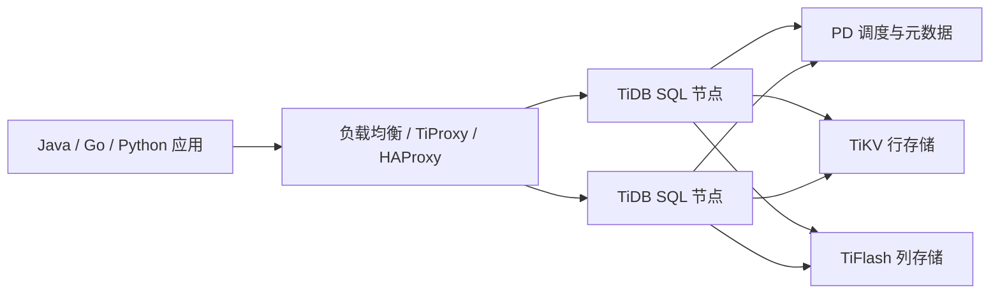

- `https://www.pingcap.com/`：这是 **PingCAP 官网**，PingCAP 是 TiDB 背后的公司。
    
- `https://github.com/pingcap/tidb`：这是 **TiDB 的 GitHub 主仓库**。官网也明确把 TiDB 描述为开源分布式 SQL 数据库；GitHub 仓库就是 PingCAP 维护的 TiDB 项目。([TiDB](https://www.pingcap.com/ "Database for AI Agents | TiDB Distributed SQL | TiDB"))
    

## 1. TiDB 是什么？

**一句话：TiDB 是一个兼容 MySQL 协议的分布式关系型数据库。**

更贴近 Java 后端的说法：

> TiDB 想解决的是：业务还想继续用 SQL / MySQL 生态，但单机 MySQL 或传统分库分表已经扛不住数据量、写入量、扩容复杂度时，能不能换成一个天然分布式的数据库。

它不是 MySQL 的一个分支，而是重新实现的一套分布式数据库系统，但对外尽量保持 MySQL 兼容。官方文档说 TiDB 高度兼容 MySQL 协议以及 MySQL 5.7 / 8.0 的常见功能和语法，因此很多 MySQL 客户端、驱动、GUI 工具可以继续使用。([PingCAP 文档](https://docs.pingcap.com/tidb/stable/mysql-compatibility?utm_source=chatgpt.com "MySQL Compatibility"))

## 2. 它和 MySQL 的关系

可以把它理解成：

|维度|MySQL|TiDB|
|---|---|---|
|定位|单机 / 主从关系型数据库|分布式 SQL 数据库|
|SQL|原生 MySQL SQL|尽量兼容 MySQL|
|扩容|主要靠垂直扩容、读写分离、分库分表|天然支持水平扩展|
|数据存储|本地 InnoDB 存储|底层分布式 KV 存储 TiKV|
|分表逻辑|常由业务 / 中间件承担|数据自动切分、调度|
|适合场景|中小规模 OLTP、传统业务系统|大规模数据、分布式事务、HTAP、减少手工分片|

所以 TiDB 的吸引力在于：**尽量保留 MySQL 的使用方式，但把底层扩展能力变成分布式基础设施能力。**

这正好对应我们刚才聊的主题：**分库分表从业务层方案，沉淀成数据库基础设施能力。**

## 3. TiDB 的核心架构

TiDB 不是一个单体数据库，它主要由几类组件组成：



核心组件可以这样理解：

|组件|作用|类比|
|---|---|---|
|**TiDB Server**|SQL 层，负责解析 SQL、优化查询、执行计划|MySQL Server 层|
|**TiKV**|分布式事务 KV 存储，真正存数据|分布式版 InnoDB 存储层|
|**PD**|Placement Driver，负责元数据、调度、事务时间戳分配|集群大脑|
|**TiFlash**|列式存储副本，用于分析查询加速|类似内置 OLAP 加速层|

官方文档也说明，TiDB 节点本身不存数据，主要处理 SQL 请求；数据实际存储在 TiKV，分析型负载可以由 TiFlash 加速。([PingCAP 文档](https://docs.pingcap.com/tidbcloud/architecture-concepts/?utm_source=chatgpt.com "Architecture | TiDB Docs"))

## 4. TiDB 怎么解决“分库分表”的痛点？

传统 MySQL 水平分表之后，很多复杂性会落到业务层或中间件层：

- 分片路由：查哪张表？
    
- 扩容迁移：从 16 张表变 64 张表怎么办？
    
- 跨分片事务：订单和账户不在同一个库怎么办？
    
- 跨分片查询：分页、排序、聚合怎么办？
    
- 运维复杂度：多个库表、多个实例、多个数据迁移任务。
    

TiDB 的思路是：**你仍然写 SQL，但底层自动把数据切成很多 Region，并通过 PD 调度到不同 TiKV 节点上。**

TiKV 里，Region 是数据存储的基本单位，每个 Region 存储一段 Key Range；PD 会根据 TiKV 上报的数据分布进行调度和平衡。([PingCAP 文档](https://docs.pingcap.com/tidb/stable/tidb-architecture?utm_source=chatgpt.com "TiDB Architecture"))

也就是说：

```text
传统分库分表：
业务代码 / 分库分表中间件 负责拆分数据

TiDB：
数据库内核 负责拆分、调度、复制、迁移数据
```

所以它的价值不是“完全不需要理解分布式”，而是把大量分片复杂度从业务开发侧下沉到了数据库基础设施侧。

## 5. TiDB 适合什么场景？

比较典型的场景：

### 1. MySQL 数据量太大，分库分表快撑不住

比如订单、流水、日志型业务、账户明细、支付记录、交易记录，单表已经数亿级甚至更高，MySQL 分表方案越来越复杂。

### 2. 业务希望继续使用 SQL，而不是换成 NoSQL

有些业务既需要关系模型，又需要事务，又需要 SQL 查询能力。这个时候直接切 MongoDB、Cassandra、HBase 成本很高。

### 3. 需要分布式事务

比如金融、支付、电商订单、库存、账户等场景，不是简单 KV 读写，还是要 ACID 语义。

TiDB 官网也强调它支持 ACID、事务、分析和向量搜索等能力。([TiDB](https://www.pingcap.com/ "Database for AI Agents | TiDB Distributed SQL | TiDB"))

### 4. OLTP + OLAP 混合场景

TiDB 经常被归到 **HTAP** 数据库：既处理在线交易，又能通过 TiFlash 支持一定分析查询。

不是说它能完全替代数仓，而是对于一些“业务库 + 近实时分析”的场景，可以减少同步链路。

### 5. 云原生 / K8s 环境

TiDB 有 TiDB Operator，可以通过 Kubernetes CRD 管理 TiDB 集群的部署、扩缩容、升级和恢复。官方文档说明 TiDB Operator 会监听相关 CR，并调谐 Pod、PVC、ConfigMap 等资源。([PingCAP 文档](https://docs.pingcap.com/tidb-in-kubernetes/dev/architecture?utm_source=chatgpt.com "TiDB Operator Architecture - dev"))

## 6. TiDB 不适合什么场景？

这个也要说清楚。

### 1. 小业务没必要上 TiDB

如果你的系统数据量不大，QPS 也不高，单机 MySQL + 主从 + 索引优化已经够用，上 TiDB 反而会增加运维复杂度。

### 2. 不是 100% MySQL

它兼容 MySQL，但不是 MySQL 本体。官方文档也列了一些默认行为差异，例如字符集、排序规则、SQL mode、timestamp 行为等。([PingCAP 文档](https://docs.pingcap.com/tidb/stable/mysql-compatibility?utm_source=chatgpt.com "MySQL Compatibility"))

所以迁移前要做兼容性验证。

### 3. 分布式数据库不是性能魔法

TiDB 解决的是扩展性、容量、分布式事务、统一 SQL 入口等问题，但不意味着所有 SQL 都会更快。

例如：

- 小数据量点查，MySQL 可能更快；
    
- 跨大量 Region 的复杂查询，仍然可能很重；
    
- 热点写入问题仍然需要设计主键、索引、业务模型；
    
- 分布式事务比单机事务天然更复杂。
    

### 4. 运维门槛比 MySQL 高

TiDB 是一个集群，不是一个 mysqld 进程。你需要理解：

- TiDB / TiKV / PD / TiFlash；
    
- Region；
    
- Raft 副本；
    
- 调度；
    
- GC；
    
- 慢 SQL；
    
- 热点；
    
- 数据迁移；
    
- 备份恢复；
    
- 集群监控。
    

所以企业用 TiDB，通常不是“开发自己装一个就完事”，而是需要 DBA / SRE / 平台团队配合。

## 7. 对 Java 后端来说怎么理解 TiDB？

最实用的理解是：

> 对 Java 应用来说，TiDB 尽量让你像使用 MySQL 一样使用分布式数据库。

常见连接方式仍然是 JDBC：

```properties
spring.datasource.url=jdbc:mysql://tidb-host:4000/order_db?useUnicode=true&characterEncoding=utf8&serverTimezone=Asia/Shanghai
spring.datasource.username=root
spring.datasource.password=xxx
spring.datasource.driver-class-name=com.mysql.cj.jdbc.Driver
```

应用层仍然可以用：

- Spring Boot
    
- MyBatis / MyBatis-Plus
    
- JPA
    
- HikariCP
    
- Flyway / Liquibase
    
- Druid / ShardingSphere 部分工具链
    

但你要特别关注：

|关注点|原因|
|---|---|
|SQL 兼容性|TiDB 不是完整 MySQL|
|自增 ID / 分布式 ID|分布式场景下自增热点、顺序写入需要评估|
|事务范围|大事务在分布式数据库里成本更高|
|索引设计|索引仍然决定查询质量|
|热点写入|单点热点仍可能压垮某些 Region|
|分页 / 排序 / 聚合|大范围查询仍然昂贵|
|迁移验证|不能假设 MySQL SQL 原封不动 100% 可用|

## 8. 最后用一句话总结

**TiDB 的本质：不是“更强的 MySQL”，而是“用 MySQL 生态的外壳，提供分布式 SQL 数据库能力”。**

它特别适合这样的问题：

> 我们不想再手写复杂的分库分表逻辑，也不想放弃 SQL 和事务，但单机 MySQL 已经撑不住了。

从架构演进角度看，TiDB 代表的是：

```text
单机 MySQL
→ 主从读写分离
→ 业务分库分表
→ 分库分表中间件
→ 分布式 SQL 数据库
```

也就是之前说的：**分库分表能力逐渐从业务方案，下沉成数据库基础设施能力。**