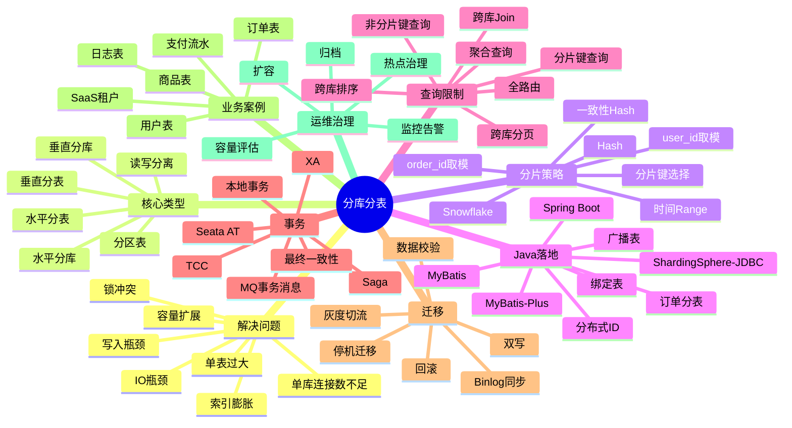
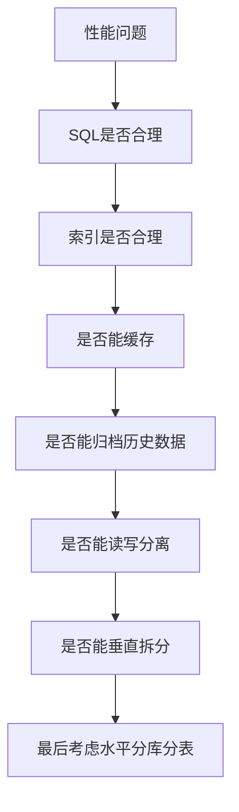
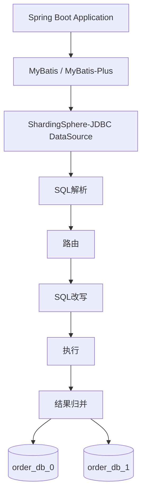
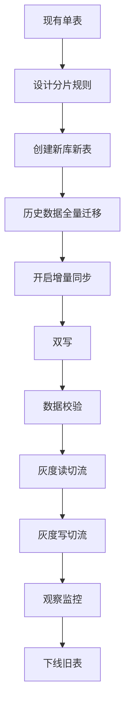

# 分库分表整体知识地图



> 先给结论：**分库分表不是性能优化的第一招，而是单库单表容量、并发、写入、索引、连接数、IO 都逼近上限后的一种架构拆分手段。**  
> 真正难点不在“取模路由”，而在：**分片键选择、查询模型改造、事务边界收敛、数据迁移、扩容、运维治理和业务妥协。**

---

# 1. 分库分表到底解决什么问题

## 1.1 单库单表的典型瓶颈

以电商订单表为例：

```sql
CREATE TABLE user_order (
    id BIGINT UNSIGNED NOT NULL AUTO_INCREMENT COMMENT '自增主键',
    order_id BIGINT UNSIGNED NOT NULL COMMENT '业务订单号',
    user_id BIGINT UNSIGNED NOT NULL COMMENT '用户ID',
    order_status TINYINT NOT NULL COMMENT '订单状态',
    pay_amount DECIMAL(12,2) NOT NULL COMMENT '支付金额',
    created_at DATETIME NOT NULL COMMENT '创建时间',
    updated_at DATETIME NOT NULL COMMENT '更新时间',
    PRIMARY KEY (id),
    UNIQUE KEY uk_order_id (order_id),
    KEY idx_user_time (user_id, created_at),
    KEY idx_created_at (created_at)
) ENGINE=InnoDB DEFAULT CHARSET=utf8mb4;
```

当这张表从 1000 万增长到 10 亿，问题会逐渐出现：

|问题|表现|分库分表是否能解决|
|---|---|---|
|单表数据量大|B+Tree 层级变高，索引膨胀，查询变慢|能缓解|
|单库写入压力大|redo log、binlog、IO、CPU 打满|水平分库能缓解|
|连接数不足|应用连接池争抢 DB 连接|水平分库能缓解|
|热点用户/热点订单|某些分片压力极高|不一定，需要热点治理|
|慢 SQL|非分片键查询、复杂排序、LIKE|分库分表可能更糟|
|跨库事务|一个事务涉及多个库|分库分表会引入新复杂度|
|报表统计|聚合、排序、分页困难|分库分表不擅长|

## 1.2 什么时候需要分库分表

### 推荐考虑分库分表的场景

|指标|常见判断|
|---|---|
|单表数据量|单表几千万到上亿，并且增长持续|
|单表索引体积|索引明显膨胀，buffer pool 命中率下降|
|写入压力|单库写 QPS 接近瓶颈|
|连接数|单库连接数长期紧张|
|业务增长|未来 1~2 年数据量可预期继续暴涨|
|查询模型|大部分查询都能带上分片键|

### 不推荐一上来就分的场景

|场景|原因|
|---|---|
|数据量只有几百万|单库单表完全能扛|
|查询条件非常复杂|分片后全路由更严重|
|大量跨表 Join|分片后 Join 成本暴涨|
|强依赖本地事务|跨库事务复杂度高|
|团队没有运维能力|迁移、扩容、排障成本高|
|只是慢 SQL|应先优化索引、SQL、缓存、归档|

## 1.3 工程判断顺序

分库分表之前，应该按这个顺序排查：



**推荐方案：**

先做：

1. SQL 优化；
    
2. 索引优化；
    
3. 缓存；
    
4. 读写分离；
    
5. 冷热归档；
    
6. 垂直拆库；
    
7. 水平分库分表。
    

**不推荐方案：**

业务刚起步就设计 16 库 256 表。  
这种设计会让开发、测试、迁移、排障、扩容全部复杂化，收益很可能小于成本。

---

# 2. 核心概念

## 2.1 垂直分库：按业务域拆库

例如：

```text
mall_user_db     用户库
mall_order_db    订单库
mall_pay_db      支付库
mall_product_db  商品库
mall_coupon_db   优惠券库
```

### 解决什么问题

把不同业务域的数据和压力隔离。

### Java 工程示例

原来订单服务和用户服务都访问一个库：

```java
userMapper.selectById(userId);
orderMapper.selectByUserId(userId);
```

垂直拆库后：

```java
// 用户服务访问 user_db
UserDTO user = userClient.getUser(userId);

// 订单服务访问 order_db
List<OrderDO> orders = orderMapper.selectByUserId(userId);
```

### 推荐方案

服务边界和数据库边界尽量一致：

```text
user-service    -> user_db
order-service   -> order_db
pay-service     -> pay_db
product-service -> product_db
```

### 不推荐方案

多个服务随意访问彼此数据库：

```text
order-service 直接查 user_db
pay-service 直接查 order_db
coupon-service 直接查 user_db
```

这样会形成数据库级耦合，后期很难演进。

---

## 2.2 垂直分表：按字段冷热拆表

订单主表：

```sql
CREATE TABLE user_order (
    id BIGINT UNSIGNED NOT NULL AUTO_INCREMENT,
    order_id BIGINT UNSIGNED NOT NULL,
    user_id BIGINT UNSIGNED NOT NULL,
    order_status TINYINT NOT NULL,
    pay_amount DECIMAL(12,2) NOT NULL,
    created_at DATETIME NOT NULL,
    PRIMARY KEY (id),
    UNIQUE KEY uk_order_id (order_id),
    KEY idx_user_time (user_id, created_at)
);
```

订单扩展表：

```sql
CREATE TABLE user_order_ext (
    order_id BIGINT UNSIGNED NOT NULL,
    receiver_name VARCHAR(64) NOT NULL,
    receiver_phone VARCHAR(32) NOT NULL,
    receiver_address VARCHAR(255) NOT NULL,
    buyer_remark VARCHAR(512),
    seller_remark VARCHAR(512),
    PRIMARY KEY (order_id)
);
```

### 解决什么问题

减少主表行宽，提高热点查询效率。

### 推荐方案

高频字段放主表，低频大字段放扩展表。

### 不推荐方案

订单详情、收货地址、备注、发票、履约信息全部堆在订单主表里。

---

## 2.3 水平分库：同一张表拆到多个数据库

```text
order_db_0.user_order
order_db_1.user_order
order_db_2.user_order
order_db_3.user_order
```

通常用于分散单库写入压力、连接压力和容量压力。

---

## 2.4 水平分表：同一张表拆成多张物理表

```text
order_db.user_order_00
order_db.user_order_01
order_db.user_order_02
...
order_db.user_order_31
```

通常用于降低单表数据量和索引大小。

---

## 2.5 分区表和分表的区别

|对比项|MySQL 分区表|分库分表|
|---|---|---|
|逻辑形态|一张表|多张物理表/多个库|
|管理位置|MySQL 内部|应用层/中间件层|
|扩展能力|有限|更强|
|应用感知|基本无感|通常需要路由规则|
|跨库能力|没有|有|
|适合场景|时间分区、归档|高并发大规模业务|

### 推荐方案

日志、流水类按时间清理的数据，可以优先考虑分区表或按月分表。

### 不推荐方案

把 MySQL 分区表当成分库分表的完全替代品。  
它不能解决单库连接数、单库写入 IO、单机容量上限等问题。

---

## 2.6 读写分离与分库分表的区别

|对比项|读写分离|分库分表|
|---|---|---|
|解决问题|读压力|写压力、容量、单表数据量|
|数据形态|主从复制|数据切分|
|查询复杂度|较低|较高|
|写入扩展|不解决|解决|
|典型组件|MySQL 主从、Proxy|ShardingSphere、MyCat、自研路由|

读写分离是“复制”，分库分表是“切分”。

---

# 3. 分片策略

## 3.1 按 user_id 取模

```text
db_index    = user_id % 4
table_index = user_id % 32
```

Java 伪代码：

```java
public ShardLocation routeByUserId(long userId) {
    int dbIndex = (int) (userId % 4);
    int tableIndex = (int) (userId % 32);
    return new ShardLocation("order_db_" + dbIndex, "user_order_" + tableIndex);
}
```

### 优点

用户维度查询非常高效：

```sql
SELECT order_id, order_status, pay_amount, created_at
FROM user_order
WHERE user_id = 10001
ORDER BY created_at DESC
LIMIT 20;
```

### 缺点

根据 `order_id` 查询时，如果 `order_id` 不包含分片信息，可能无法定位分片。

### 适合

用户订单列表、用户账单、用户消息、用户优惠券。

---

## 3.2 按 order_id 取模

```java
int dbIndex = (int) (orderId % 4);
int tableIndex = (int) (orderId % 32);
```

### 优点

订单详情查询非常快：

```sql
SELECT order_id, user_id, order_status, pay_amount
FROM user_order
WHERE order_id = 900000000001L;
```

### 缺点

用户订单列表查询困难：

```sql
SELECT order_id, order_status, pay_amount
FROM user_order
WHERE user_id = 10001
ORDER BY created_at DESC
LIMIT 20;
```

如果 `user_id` 不是分片键，这个查询可能要扫多个分片。

---

## 3.3 按时间范围分表

```text
order_202601
order_202602
order_202603
```

### 适合

日志、流水、消息、审计记录、历史订单归档。

### SQL 示例

```sql
SELECT order_id, user_id, order_status, created_at
FROM user_order_202605
WHERE created_at >= '2026-05-01'
  AND created_at < '2026-06-01'
  AND user_id = 10001
ORDER BY created_at DESC
LIMIT 20;
```

### 缺点

热点明显。  
例如当前月订单都写入 `order_202605`，写压力集中。

### 推荐方案

时间分片适合归档和生命周期管理，不适合单独承担高并发写入打散。

### 更好的组合

```text
按月 + user_id hash
order_202605_00
order_202605_01
...
order_202605_31
```

---

## 3.4 Hash 分片

```java
int tableIndex = Math.abs(Long.hashCode(userId)) % 32;
```

Hash 分片比简单取模更均匀，尤其当 ID 本身有规律时。

---

## 3.5 Range 分片

```text
user_id 1        ~ 10000000     -> user_db_0
user_id 10000001 ~ 20000000     -> user_db_1
user_id 20000001 ~ 30000000     -> user_db_2
```

### 优点

范围查询友好。

### 缺点

容易热点。新用户、近期订单可能集中在最新范围。

---

## 3.6 一致性 Hash

一致性 Hash 常用于节点动态增减，例如缓存、服务节点、某些分布式存储。

```java
node = hashRing.get(hash(shardingKey));
```

### 分库分表中是否常用？

不是最常见。  
业务数据库分片更常用固定库表数量 + 取模/Hash，因为数据库扩容需要强数据迁移和强治理，不像缓存节点那么轻量。

---

## 3.7 雪花算法 ID 与分片键的关系

典型 Snowflake 结构：

```text
符号位 | 时间戳 | 机器ID | 序列号
```

如果只用标准雪花 ID：

```java
tableIndex = orderId % 32;
```

可以分片，但不一定能从 ID 中直接解析业务维度。

### 更推荐的订单 ID 设计

```text
order_id = 时间戳 + 用户分片因子 + 机器号 + 序列号
```

或者额外保存路由关系：

```sql
CREATE TABLE order_route (
    order_id BIGINT UNSIGNED NOT NULL,
    user_id BIGINT UNSIGNED NOT NULL,
    db_index INT NOT NULL,
    table_index INT NOT NULL,
    created_at DATETIME NOT NULL,
    PRIMARY KEY (order_id),
    KEY idx_user_id (user_id)
);
```

---

## 3.8 如何选择分片键

分片键选择是分库分表最关键的决策。

|业务|推荐分片键|原因|
|---|---|---|
|用户订单|user_id 或 order_id|看主查询场景|
|支付流水|user_id / order_id / payment_id|看查询入口|
|用户表|user_id|用户维度天然聚合|
|商品表|product_id / category_id，通常不按 user_id|商品不是用户私有数据|
|租户数据|tenant_id|SaaS 天然隔离|
|日志表|time + hash|方便归档且分散写入|

### 判断标准

1. 高频查询是否带这个字段；
    
2. 数据是否分布均匀；
    
3. 是否容易出现热点；
    
4. 是否稳定不变；
    
5. 是否能支撑分页、排序、归档；
    
6. 是否能减少跨库事务。
    

### 不推荐分片键

|字段|问题|
|---|---|
|手机号|可能变更，涉及隐私|
|订单状态|极度倾斜|
|创建时间|容易热点|
|城市|分布不均|
|商品类目|可能变更且分布不均|

---

# 4. Java 工程落地：ShardingSphere-JDBC

## 4.1 典型架构



ShardingSphere-JDBC 是嵌入在 Java 应用里的 JDBC 增强层。官方文档说明它支持 Java API 和 YAML 两种配置方式，并且在 Spring Boot 中可以通过 ShardingSphere Driver 方式集成。([ShardingSphere](https://shardingsphere.apache.org/document/5.5.3/en/quick-start/shardingsphere-jdbc-quick-start/?utm_source=chatgpt.com "ShardingSphere-JDBC"))

## 4.2 Maven 依赖示例

具体版本以项目当前 Spring Boot 版本和 ShardingSphere 官方兼容矩阵为准。官方文档中给出的 Spring Boot Starter 依赖曾有不同 artifact 写法，5.x 文档中存在 `shardingsphere-jdbc-core-spring-boot-starter`，较新的文档也提供 Driver + YAML 配置方式。([ShardingSphere](https://shardingsphere.apache.org/document/5.2.0/en/user-manual/shardingsphere-jdbc/spring-boot-starter/?utm_source=chatgpt.com "Spring Boot Starter :: ShardingSphere"))

```xml
<dependency>
    <groupId>org.apache.shardingsphere</groupId>
    <artifactId>shardingsphere-jdbc</artifactId>
    <version>5.5.3</version>
</dependency>
```

## 4.3 表结构：订单分库分表

假设：

```text
2 个库：order_db_0、order_db_1
每库 4 张表：user_order_0 ~ user_order_3
总共 8 个物理分片
```

建表：

```sql
CREATE TABLE user_order_0 (
    id BIGINT UNSIGNED NOT NULL COMMENT '分布式主键',
    order_id BIGINT UNSIGNED NOT NULL COMMENT '订单ID',
    user_id BIGINT UNSIGNED NOT NULL COMMENT '用户ID',
    order_status TINYINT NOT NULL COMMENT '订单状态',
    pay_amount DECIMAL(12,2) NOT NULL COMMENT '支付金额',
    created_at DATETIME NOT NULL COMMENT '创建时间',
    updated_at DATETIME NOT NULL COMMENT '更新时间',
    PRIMARY KEY (id),
    UNIQUE KEY uk_order_id (order_id),
    KEY idx_user_time (user_id, created_at)
) ENGINE=InnoDB DEFAULT CHARSET=utf8mb4;
```

其他表 `user_order_1`、`user_order_2`、`user_order_3` 结构一致。

## 4.4 YAML 配置示例

> 注意：不同 ShardingSphere 版本配置语法可能有差异，生产项目必须以当前使用版本的官方文档为准。以下是教学型示例。

```yaml
spring:
  datasource:
    driver-class-name: org.apache.shardingsphere.driver.ShardingSphereDriver
    url: jdbc:shardingsphere:classpath:sharding.yaml
```

`sharding.yaml`：

```yaml
databaseName: order_logic_db

dataSources:
  order_db_0:
    dataSourceClassName: com.zaxxer.hikari.HikariDataSource
    driverClassName: com.mysql.cj.jdbc.Driver
    jdbcUrl: jdbc:mysql://localhost:3306/order_db_0
    username: root
    password: root
  order_db_1:
    dataSourceClassName: com.zaxxer.hikari.HikariDataSource
    driverClassName: com.mysql.cj.jdbc.Driver
    jdbcUrl: jdbc:mysql://localhost:3306/order_db_1
    username: root
    password: root

rules:
  - !SHARDING
    tables:
      user_order:
        actualDataNodes: order_db_${0..1}.user_order_${0..3}
        databaseStrategy:
          standard:
            shardingColumn: user_id
            shardingAlgorithmName: order-db-inline
        tableStrategy:
          standard:
            shardingColumn: user_id
            shardingAlgorithmName: order-table-inline
        keyGenerateStrategy:
          column: id
          keyGeneratorName: snowflake

    shardingAlgorithms:
      order-db-inline:
        type: INLINE
        props:
          algorithm-expression: order_db_${user_id % 2}
      order-table-inline:
        type: INLINE
        props:
          algorithm-expression: user_order_${user_id % 4}

    keyGenerators:
      snowflake:
        type: SNOWFLAKE

props:
  sql-show: true
```

## 4.5 MyBatis / MyBatis-Plus 配合

Mapper 仍然写逻辑表名：

```java
@Mapper
public interface UserOrderMapper {

    @Insert("""
        INSERT INTO user_order
        (order_id, user_id, order_status, pay_amount, created_at, updated_at)
        VALUES
        (#{orderId}, #{userId}, #{orderStatus}, #{payAmount}, #{createdAt}, #{updatedAt})
    """)
    int insert(UserOrderDO order);

    @Select("""
        SELECT order_id, user_id, order_status, pay_amount, created_at
        FROM user_order
        WHERE user_id = #{userId}
        ORDER BY created_at DESC
        LIMIT #{limit}
    """)
    List<UserOrderDO> selectRecentByUserId(@Param("userId") Long userId,
                                           @Param("limit") Integer limit);
}
```

业务代码：

```java
@Service
@RequiredArgsConstructor
public class OrderService {

    private final UserOrderMapper userOrderMapper;
    private final DistributedIdGenerator idGenerator;

    @Transactional
    public Long createOrder(CreateOrderCommand command) {
        long orderId = idGenerator.nextId();

        UserOrderDO order = new UserOrderDO();
        order.setOrderId(orderId);
        order.setUserId(command.getUserId());
        order.setOrderStatus(10);
        order.setPayAmount(command.getPayAmount());
        order.setCreatedAt(LocalDateTime.now());
        order.setUpdatedAt(LocalDateTime.now());

        userOrderMapper.insert(order);
        return orderId;
    }

    public List<UserOrderDO> queryUserOrders(Long userId) {
        return userOrderMapper.selectRecentByUserId(userId, 20);
    }
}
```

### 关键点

Java 业务代码一般不直接拼 `order_00`、`order_01`。  
业务代码操作逻辑表 `user_order`，由 ShardingSphere-JDBC 负责路由。

## 4.6 user_id、order_id 双查询场景如何设计

这是订单分库分表最典型问题。

### 场景

1. 用户查自己的订单列表：按 `user_id`；
    
2. 客服查订单详情：按 `order_id`；
    
3. 支付回调更新订单：按 `order_id`；
    
4. 用户详情页继续按 `user_id` 分页。
    

### 方案一：按 user_id 分片 + order_id 冗余路由表

订单主表按 `user_id` 分片：

```text
user_order 按 user_id 分库分表
```

新增订单路由表：

```sql
CREATE TABLE order_route (
    order_id BIGINT UNSIGNED NOT NULL,
    user_id BIGINT UNSIGNED NOT NULL,
    created_at DATETIME NOT NULL,
    PRIMARY KEY (order_id),
    KEY idx_user_id (user_id)
);
```

按订单号查询：

```java
public OrderDTO queryByOrderId(Long orderId) {
    OrderRouteDO route = orderRouteMapper.selectByOrderId(orderId);
    if (route == null) {
        throw new BizException("订单不存在");
    }
    return orderMapper.selectByOrderIdAndUserId(orderId, route.getUserId());
}
```

SQL：

```sql
SELECT order_id, user_id, order_status, pay_amount
FROM user_order
WHERE user_id = #{userId}
  AND order_id = #{orderId};
```

### 推荐方案

订单主表按 `user_id` 分片，同时维护 `order_id -> user_id` 的路由表。  
因为用户订单列表是高频查询，必须优先保证。

### 不推荐方案

为了支持 `order_id` 查询，把订单主表按 `order_id` 分片，却导致用户订单列表每次全路由。

---

## 4.7 分布式主键生成

常见方案：

|方案|适合度|说明|
|---|---|---|
|数据库自增|不推荐|多库下冲突|
|UUID|不推荐做主键|太长、无序、索引不友好|
|Redis incr|小规模可用|Redis 成为关键依赖|
|Snowflake|推荐|高性能、趋势递增|
|Leaf/美团号段|推荐|适合企业级 ID 服务|
|ShardingSphere Snowflake|可用|快速落地|

Java 伪代码：

```java
public class SnowflakeIdGenerator {

    public long nextId() {
        // timestamp | workerId | sequence
        return snowflake.nextId();
    }
}
```

### 推荐方案

订单 ID 使用 Snowflake 或号段模式，避免数据库自增 ID 跨库冲突。

### 不推荐方案

直接用 MySQL 自增主键作为业务订单号。

---

# 5. SQL 与查询限制

## 5.1 分片键查询：推荐

```sql
SELECT order_id, order_status, pay_amount, created_at
FROM user_order
WHERE user_id = 10001
ORDER BY created_at DESC
LIMIT 20;
```

能精准路由到一个库或少量表。

---

## 5.2 非分片键查询：高风险

```sql
SELECT order_id, user_id, order_status
FROM user_order
WHERE order_id = 900000000001;
```

如果分片键是 `user_id`，这个 SQL 不带 `user_id`，可能全路由。

### 推荐方案

补路由字段：

```sql
SELECT order_id, user_id, order_status
FROM user_order
WHERE user_id = 10001
  AND order_id = 900000000001;
```

### 不推荐方案

依赖中间件全路由查所有表。

---

## 5.3 跨库 Join：不推荐

```sql
SELECT o.order_id, u.nickname
FROM user_order o
JOIN user_info u ON o.user_id = u.user_id
WHERE o.user_id = 10001;
```

分库分表后，`user_order` 和 `user_info` 可能不在同一个库，Join 成本非常高。

### 推荐方案

服务层组装：

```java
OrderDTO order = orderService.getOrder(orderId);
UserDTO user = userClient.getUser(order.getUserId());

return OrderDetailDTO.of(order, user);
```

或者冗余快照字段：

```sql
CREATE TABLE user_order (
    order_id BIGINT NOT NULL,
    user_id BIGINT NOT NULL,
    user_nickname_snapshot VARCHAR(64) NOT NULL,
    receiver_address_snapshot VARCHAR(255) NOT NULL
);
```

---

## 5.4 跨库分页：高风险

错误示例：

```sql
SELECT order_id, user_id, created_at
FROM user_order
ORDER BY created_at DESC
LIMIT 100000, 20;
```

分片后，中间件可能要从多个分片取数据、排序、归并，再截取。

### 推荐方案：用户维度游标分页

```sql
SELECT order_id, order_status, created_at
FROM user_order
WHERE user_id = #{userId}
  AND created_at < #{lastCreatedAt}
ORDER BY created_at DESC
LIMIT 20;
```

Java：

```java
public List<OrderDTO> scrollUserOrders(Long userId, LocalDateTime lastCreatedAt) {
    return orderMapper.scrollByUserId(userId, lastCreatedAt, 20);
}
```

### 不推荐方案

分库分表后继续使用深分页 `LIMIT offset, size`。

---

## 5.5 跨库排序

```sql
SELECT order_id, user_id, pay_amount
FROM user_order
ORDER BY pay_amount DESC
LIMIT 100;
```

这种全局排序非常昂贵。

### 推荐方案

1. 单用户内排序；
    
2. 提前写入排行榜系统；
    
3. 使用 Elasticsearch / ClickHouse / OLAP；
    
4. 离线计算。
    

---

## 5.6 聚合查询

```sql
SELECT COUNT(*), SUM(pay_amount)
FROM user_order
WHERE created_at >= '2026-05-01'
  AND created_at < '2026-06-01';
```

分片后需要多个分片聚合再归并。

### 推荐方案

写入时异步汇总：

```sql
CREATE TABLE order_stat_daily (
    stat_date DATE NOT NULL,
    total_order_count BIGINT NOT NULL,
    total_pay_amount DECIMAL(18,2) NOT NULL,
    PRIMARY KEY (stat_date)
);
```

通过 MQ 消费订单事件：

```java
@KafkaListener(topics = "order-created")
public void handleOrderCreated(OrderCreatedEvent event) {
    orderStatService.increase(event.getCreatedDate(), event.getPayAmount());
}
```

---

## 5.7 批量查询

推荐：

```sql
SELECT order_id, user_id, order_status
FROM user_order
WHERE user_id = #{userId}
  AND order_id IN (...)
```

不推荐：

```sql
SELECT order_id, user_id, order_status
FROM user_order
WHERE order_id IN (...)
```

如果 `order_id` 不是分片键，会全路由。

---

## 5.8 LIKE 查询

```sql
SELECT order_id, user_id
FROM user_order
WHERE buyer_remark LIKE '%退款%';
```

分库分表不适合这种搜索。

### 推荐方案

搜索类需求进 Elasticsearch/OpenSearch。

---

## 5.9 如何避免全路由

|方法|说明|
|---|---|
|查询必须带分片键|最核心|
|建路由表|order_id -> user_id|
|冗余查询维度|多写一份索引表|
|改造 API 入参|强制传 user_id|
|CQRS|写库和查询库分离|
|搜索引擎|承接复杂查询|

---

# 6. 事务问题

## 6.1 本地事务

如果一个业务操作只落在同一个库同一张表，仍然是本地事务。

```java
@Transactional
public void cancelOrder(Long userId, Long orderId) {
    orderMapper.updateStatus(userId, orderId, OrderStatus.CANCELED);
    orderLogMapper.insert(userId, orderId, "取消订单");
}
```

前提：`user_order` 和 `order_log` 使用相同分片键，并且路由到同一个库。

---

## 6.2 跨库事务

例如下单：

```text
扣库存 product_db
创建订单 order_db
扣优惠券 coupon_db
创建支付单 pay_db
```

这是典型分布式事务。

---

## 6.3 XA

XA 是两阶段提交，强一致，但性能和可用性成本较高。

```text
prepare -> commit / rollback
```

### 推荐场景

金额、账务、核心资产类，且业务量可控。

### 不推荐场景

高并发下单主链路大量使用 XA。

ShardingSphere 官方文档把分布式事务能力归纳为 XA 的 2PC 事务与基于 Seata 的 BASE 事务。([ShardingSphere](https://shardingsphere.apache.org/document/5.5.2/en/reference/transaction/?utm_source=chatgpt.com "Transaction :: ShardingSphere"))

---

## 6.4 Seata AT

Seata AT 更偏业务无侵入，但依赖 undo_log 和全局事务协调。ShardingSphere 官方文档说明其 Seata 集成指向 Seata AT 模式，并且较新文档中对 Seata 版本也有前置要求。([ShardingSphere](https://shardingsphere.apache.org/document/5.5.0/en/user-manual/shardingsphere-jdbc/special-api/transaction/seata/?utm_source=chatgpt.com "Seata Transaction"))

典型 undo_log：

```sql
CREATE TABLE undo_log (
    branch_id BIGINT NOT NULL COMMENT 'branch transaction id',
    xid VARCHAR(128) NOT NULL COMMENT 'global transaction id',
    context VARCHAR(128) NOT NULL,
    rollback_info LONGBLOB NOT NULL,
    log_status INT NOT NULL,
    log_created DATETIME NOT NULL,
    log_modified DATETIME NOT NULL,
    UNIQUE KEY ux_undo_log (xid, branch_id)
);
```

### 推荐场景

中后台、低频管理操作、对接遗留系统。

### 不推荐场景

极高并发核心交易链路盲目使用。

---

## 6.5 TCC

TCC：

```text
Try    预留资源
Confirm 确认资源
Cancel 释放资源
```

例如优惠券：

```java
public interface CouponTccService {

    void tryLockCoupon(Long userId, Long couponId, Long orderId);

    void confirmUseCoupon(Long userId, Long couponId, Long orderId);

    void cancelUseCoupon(Long userId, Long couponId, Long orderId);
}
```

### 推荐场景

库存、优惠券、账户余额、积分等需要明确冻结/确认/取消的资源。

### 不推荐场景

业务无法设计 Try/Confirm/Cancel 语义时强行 TCC。

---

## 6.6 最终一致性

电商最常见：

```text
订单创建成功 -> 发送订单事件 -> 库存服务扣减 -> 积分服务处理 -> 通知服务发送消息
```

伪代码：

```java
@Transactional
public Long createOrder(CreateOrderCommand command) {
    Long orderId = orderRepository.save(command);
    outboxRepository.save(new OrderCreatedEvent(orderId, command.getUserId()));
    return orderId;
}
```

Outbox 表：

```sql
CREATE TABLE event_outbox (
    id BIGINT UNSIGNED NOT NULL,
    aggregate_id BIGINT UNSIGNED NOT NULL,
    event_type VARCHAR(64) NOT NULL,
    event_body JSON NOT NULL,
    status TINYINT NOT NULL,
    created_at DATETIME NOT NULL,
    PRIMARY KEY (id),
    KEY idx_status_time (status, created_at)
);
```

异步投递：

```java
@Scheduled(fixedDelay = 1000)
public void publishOutboxEvents() {
    List<EventOutboxDO> events = outboxMapper.selectPending(100);
    for (EventOutboxDO event : events) {
        mqProducer.send(event.getEventType(), event.getEventBody());
        outboxMapper.markSent(event.getId());
    }
}
```

### 哪些业务可以接受最终一致性

|业务|是否适合最终一致性|
|---|---|
|下单后发通知|适合|
|下单后加积分|适合|
|订单同步到搜索|适合|
|订单统计报表|适合|
|支付成功改订单状态|可用，但要强幂等|
|账户余额扣减|谨慎，通常需要更强一致|
|账务记账|谨慎，通常需要强一致或准强一致|

---

# 7. 数据迁移方案

## 7.1 从单库单表到分库分表的迁移流程



---

## 7.2 停机迁移

步骤：

1. 停止写入；
    
2. 全量导出旧表；
    
3. 按分片规则写入新表；
    
4. 校验数据；
    
5. 应用切到新库；
    
6. 恢复服务。
    

### 适合

小数据量、低峰期可停机、内部系统。

### 不推荐

核心订单、支付、用户系统。

---

## 7.3 双写迁移

应用同时写旧表和新表：

```java
@Transactional
public void createOrder(CreateOrderCommand command) {
    legacyOrderMapper.insert(command);
    shardingOrderMapper.insert(command);
}
```

### 问题

双写不是天然可靠的：

```text
旧表写成功，新表写失败怎么办？
旧表事务回滚，新表已提交怎么办？
重试导致重复写怎么办？
```

### 推荐方案

使用 Outbox 或 Binlog 增量同步降低双写风险。

---

## 7.4 Binlog 增量同步

```text
MySQL Binlog -> Canal/Debezium -> MQ -> 分片写入服务 -> 新库新表
```

伪代码：

```java
public void handleBinlog(OrderChangedEvent event) {
    Long userId = event.getUserId();
    int dbIndex = (int) (userId % 4);
    int tableIndex = (int) (userId % 32);

    shardingOrderWriter.write(dbIndex, tableIndex, event);
}
```

---

## 7.5 数据校验

常见校验维度：

```sql
-- 行数校验
SELECT COUNT(*) FROM user_order;

-- 金额校验
SELECT SUM(pay_amount) FROM user_order;

-- 时间段校验
SELECT COUNT(*), SUM(pay_amount)
FROM user_order
WHERE created_at >= '2026-05-01'
  AND created_at < '2026-05-02';

-- 抽样校验
SELECT order_id, user_id, order_status, pay_amount
FROM user_order
WHERE order_id IN (...);
```

---

## 7.6 灰度切流

推荐顺序：

```text
1% 只读流量 -> 5% -> 20% -> 50% -> 100%
写流量最后切
```

Java 伪代码：

```java
public OrderDTO queryOrder(Long userId, Long orderId) {
    if (grayRouter.useSharding(userId)) {
        return shardingOrderRepository.query(userId, orderId);
    }
    return legacyOrderRepository.query(orderId);
}
```

---

## 7.7 回滚方案

回滚不是“出问题再想”，必须提前设计。

|风险|回滚策略|
|---|---|
|新库数据错误|保留旧库写入|
|新链路性能差|灰度开关切回旧库|
|增量同步延迟|暂停切流|
|双写不一致|对账修复|
|代码 Bug|Feature Flag 降级|

---

# 8. 常见业务案例

## 8.1 用户表如何分

用户表通常按 `user_id` 分片。

```sql
CREATE TABLE user_info_0 (
    user_id BIGINT UNSIGNED NOT NULL,
    nickname VARCHAR(64) NOT NULL,
    phone_hash VARCHAR(128) NOT NULL,
    user_status TINYINT NOT NULL,
    created_at DATETIME NOT NULL,
    PRIMARY KEY (user_id),
    KEY idx_phone_hash (phone_hash)
);
```

### 推荐方案

按 `user_id` 水平分表。手机号、邮箱这类查询用索引表或搜索服务。

索引表：

```sql
CREATE TABLE user_phone_index (
    phone_hash VARCHAR(128) NOT NULL,
    user_id BIGINT UNSIGNED NOT NULL,
    PRIMARY KEY (phone_hash)
);
```

### 不推荐方案

按手机号分片。手机号可能变更，且涉及隐私治理。

---

## 8.2 订单表如何分

高频查询通常是：

```text
用户查订单列表
订单详情查询
支付回调更新订单
客服后台查订单
```

推荐：

```text
订单主表按 user_id 分片
订单路由表 order_id -> user_id
后台复杂查询进 ES/OLAP
```

---

## 8.3 支付流水表如何分

支付流水通常有这些查询：

```text
按 payment_id 查支付单
按 order_id 查支付状态
按 user_id 查支付记录
按时间对账
```

推荐设计：

```text
pay_transaction 按 payment_id 或 order_id 分片
payment_route 保存 order_id -> payment_id/user_id
对账按时间进入独立对账库或数仓
```

建表示例：

```sql
CREATE TABLE pay_transaction_0 (
    payment_id BIGINT UNSIGNED NOT NULL,
    order_id BIGINT UNSIGNED NOT NULL,
    user_id BIGINT UNSIGNED NOT NULL,
    pay_status TINYINT NOT NULL,
    pay_amount DECIMAL(12,2) NOT NULL,
    channel_code VARCHAR(32) NOT NULL,
    created_at DATETIME NOT NULL,
    PRIMARY KEY (payment_id),
    UNIQUE KEY uk_order_id (order_id),
    KEY idx_user_time (user_id, created_at)
);
```

---

## 8.4 日志表如何分

日志表通常按时间分。

```text
operation_log_202605
operation_log_202606
```

或者：

```text
operation_log_202605_00
operation_log_202605_01
...
```

推荐：

1. 在线库只保留短期日志；
    
2. 长期日志进入 Elasticsearch、ClickHouse、对象存储；
    
3. MySQL 不承担大规模日志分析。
    

---

## 8.5 商品表为什么通常不适合按用户分片

商品不是用户私有数据。  
商品查询通常按：

```text
product_id
category_id
shop_id
brand_id
keyword
价格区间
上下架状态
```

如果按 `user_id` 分片，会导致商品搜索、类目查询、推荐召回全部困难。

### 推荐方案

|数据|方案|
|---|---|
|商品主数据|product_id 或 shop_id|
|商品搜索|Elasticsearch|
|库存|独立库存服务|
|价格|独立价格服务或缓存|
|类目|单独类目体系|

---

## 8.6 B 端 SaaS 多租户如何分库分表

三种常见模式：

|模式|说明|适合|
|---|---|---|
|共享库共享表|表里有 tenant_id|小租户多|
|共享库分表|按 tenant_id 分表|中等规模|
|独立库|大客户独立库|大客户、强隔离|

### 推荐混合模式

```text
普通租户：共享分片库
大客户：独立库
超大客户：独立集群
```

路由表：

```sql
CREATE TABLE tenant_route (
    tenant_id BIGINT UNSIGNED NOT NULL,
    route_type TINYINT NOT NULL COMMENT '1共享库 2独立库',
    db_name VARCHAR(64) NOT NULL,
    created_at DATETIME NOT NULL,
    PRIMARY KEY (tenant_id)
);
```

---

# 9. 架构设计题：面试风格回答

## 9.1 订单表 10 亿，如何设计分库分表？

### 参考回答

我会先确认订单表的核心查询模型，而不是直接给库表数量。订单系统最常见的查询是：用户订单列表、订单详情、支付回调、售后查询、后台检索。

如果用户订单列表是核心高频场景，我会优先按 `user_id` 做水平分库分表，例如 8 库 64 表或 16 库 128 表。订单主表、订单明细表、订单状态流转表使用相同分片键，尽量保证同一订单相关数据落在同一分片。为了支持按 `order_id` 查询，我会维护一张 `order_route` 路由表，保存 `order_id -> user_id`，按订单号查询时先查路由表，再带上 `user_id` 精准路由。

同时，后台复杂查询不直接打分片库，而是同步到 Elasticsearch 或 ClickHouse。历史订单按时间归档，在线库只保留近 1~2 年热数据。

### 推荐方案

```text
订单主链路：user_id 分片
订单号查询：order_route
后台查询：ES/OLAP
历史数据：归档库
```

### 不推荐方案

让所有查询都直接扫 10 亿订单分片库。

---

## 9.2 用户每天 100 万订单，如何保证查询性能？

### 参考回答

每天 100 万订单，首先要区分写入性能和查询性能。写入上，订单表需要水平分库分表，打散写入压力。查询上，用户订单列表必须带 `user_id` 和游标条件，避免深分页。订单详情通过 `order_id -> user_id` 路由精准定位。统计、搜索、报表不能直接查订单分片库，而是通过 MQ 异步同步到搜索或数仓。

SQL 示例：

```sql
SELECT order_id, order_status, pay_amount, created_at
FROM user_order
WHERE user_id = #{userId}
  AND created_at < #{lastCreatedAt}
ORDER BY created_at DESC
LIMIT 20;
```

### 关键点

1. 分片键查询；
    
2. 游标分页；
    
3. 冷热分离；
    
4. 缓存订单摘要；
    
5. 搜索和统计走异构存储。
    

---

## 9.3 既要按 user_id 查询订单，又要按 order_id 查询订单，如何设计？

### 推荐回答

优先看哪个查询更高频。通常用户订单列表是高频，所以主表按 `user_id` 分片。`order_id` 查询通过路由表解决：

```sql
SELECT user_id
FROM order_route
WHERE order_id = #{orderId};
```

然后：

```sql
SELECT order_id, user_id, order_status, pay_amount
FROM user_order
WHERE user_id = #{userId}
  AND order_id = #{orderId};
```

如果 `order_id` 查询极高频，也可以把分片因子编码进 `order_id`，让订单号本身携带路由信息。

### 不推荐方案

主表同时按 `user_id` 和 `order_id` 分两套完整数据，除非你有明确的同步、对账、修复机制。

---

## 9.4 分库分表后如何分页查询用户订单？

### 推荐回答

分页必须限定在单个用户维度内，并使用游标分页，而不是全局 offset 分页。

```sql
SELECT order_id, order_status, pay_amount, created_at
FROM user_order
WHERE user_id = #{userId}
  AND created_at < #{lastCreatedAt}
ORDER BY created_at DESC
LIMIT #{pageSize};
```

第一页：

```sql
SELECT order_id, order_status, pay_amount, created_at
FROM user_order
WHERE user_id = #{userId}
ORDER BY created_at DESC
LIMIT 20;
```

下一页带上上一页最后一条的 `created_at` 和 `order_id`：

```sql
SELECT order_id, order_status, pay_amount, created_at
FROM user_order
WHERE user_id = #{userId}
  AND (
      created_at < #{lastCreatedAt}
      OR (created_at = #{lastCreatedAt} AND order_id < #{lastOrderId})
  )
ORDER BY created_at DESC, order_id DESC
LIMIT 20;
```

---

## 9.5 分库分表后如何处理历史数据归档？

### 推荐回答

订单表一般做冷热分离。在线库保留近 1~2 年热数据，历史订单迁移到归档库、对象存储、ClickHouse 或 Elasticsearch。归档任务按时间范围分批执行，每批控制数据量，避免长事务和主库压力。

归档 SQL 示例：

```sql
SELECT order_id, user_id, order_status, pay_amount, created_at
FROM user_order
WHERE user_id BETWEEN #{startUserId} AND #{endUserId}
  AND created_at < #{archiveBefore}
LIMIT 1000;
```

归档后删除要谨慎，推荐逻辑归档标记或分批物理删除。

```sql
DELETE FROM user_order
WHERE user_id = #{userId}
  AND created_at < #{archiveBefore}
LIMIT 500;
```

### 不推荐方案

一次性：

```sql
DELETE FROM user_order
WHERE created_at < '2025-01-01';
```

这会造成大事务、锁等待、binlog 暴涨、主从延迟。

---

# 10. 最佳实践与避坑

## 10.1 分片键不能随便改

分片键一旦确定，后续所有数据路由、查询、迁移、扩容都围绕它展开。

### 推荐

在设计阶段先列出 Top 10 查询：

```text
1. 用户订单列表：user_id
2. 订单详情：order_id
3. 支付回调：order_id
4. 售后查询：order_id
5. 用户售后列表：user_id
6. 后台搜索：手机号/订单号/时间
```

再决定分片键。

---

## 10.2 分表数量如何规划

粗略估算：

```text
未来 3 年订单量：10 亿
目标单表数据量：1000 万 ~ 3000 万
需要表数：10亿 / 2000万 = 50 张
```

可以规划为：

```text
8库 × 8表 = 64表
```

或者：

```text
4库 × 16表 = 64表
```

### 推荐

表数量可以适当前置规划，库数量不要一开始过多。

### 不推荐

一开始直接 64 库 1024 表。  
库太多会显著增加连接数、运维、监控、DDL、迁移复杂度。

---

## 10.3 为什么不建议一开始就分太多库

因为每个库都需要连接池：

```text
应用实例数 20
每个数据源连接池 20
数据库数量 32

总连接数 = 20 × 20 × 32 = 12800
```

数据库连接数会爆炸。

---

## 10.4 如何扩容

### 方案一：翻倍扩容

```text
原来：4库 64表
扩容：8库 64表
```

表数量不变，迁移部分表到新库。

### 方案二：逻辑表固定，物理库扩容

```text
table_00 ~ table_63 固定
迁移 table_32 ~ table_63 到新库
```

### 方案三：一致性 Hash

适合某些自研路由场景，但数据库迁移仍然复杂。

### 推荐

一开始设计“逻辑分片”和“物理库”解耦：

```text
逻辑分片 shard_00 ~ shard_63
物理库 db_0 ~ db_3
后续可以调整 shard 到 db 的映射
```

路由表：

```sql
CREATE TABLE shard_mapping (
    logic_shard INT NOT NULL,
    physical_db VARCHAR(64) NOT NULL,
    physical_table VARCHAR(64) NOT NULL,
    PRIMARY KEY (logic_shard)
);
```

---

## 10.5 如何避免热点分片

热点来源：

|热点类型|示例|
|---|---|
|大客户热点|某个企业租户数据极多|
|大 V 用户热点|某用户订单/消息极多|
|时间热点|当前月表写入集中|
|活动热点|秒杀商品集中写|
|ID 规律热点|分片算法不均匀|

### 方案

1. Hash 分片；
    
2. 大客户独立库；
    
3. 热点用户单独路由；
    
4. 时间 + hash 组合；
    
5. 写入削峰；
    
6. 缓存；
    
7. 异步化。
    

---

## 10.6 如何设计全局唯一 ID

推荐 ID 需要满足：

|要求|说明|
|---|---|
|全局唯一|多库多表不冲突|
|趋势递增|减少索引页分裂|
|高性能|不依赖单点数据库|
|可解析|最好能解析时间、机器、分片因子|
|长度可控|适合 BIGINT|

推荐：

```text
Snowflake
Leaf 号段
自研号段服务
```

不推荐：

```text
UUID 直接做聚簇主键
每个库单独自增作为业务ID
```

---

## 10.7 监控和告警

必须监控：

|维度|指标|
|---|---|
|数据库|QPS、TPS、连接数、慢 SQL、锁等待|
|分片|各分片数据量、请求量、延迟|
|SQL|全路由 SQL、跨库聚合 SQL|
|应用|连接池等待、超时、错误率|
|迁移|同步延迟、失败数、校验差异|
|事务|分布式事务失败、补偿失败|
|MQ|堆积、消费失败、重复消费|

### 告警示例

```text
某个分片 QPS 是平均值 3 倍以上 -> 可能热点
全路由 SQL 数量突然上升 -> 可能上线了危险查询
连接池等待时间升高 -> 数据库连接不足
慢 SQL 超过阈值 -> 索引或路由问题
```

---

## 10.8 容量评估

订单表示例：

```text
每日订单量：100 万
每年订单量：3.65 亿
保留 2 年在线数据：7.3 亿
单行平均大小：1 KB
主表数据量：730 GB
索引膨胀：约 1~2 倍
总容量：1.5 TB 级别
```

如果目标单表 2000 万：

```text
7.3亿 / 2000万 ≈ 37 张表
```

工程上可规划：

```text
8库 × 8表 = 64表
```

---

# 11. 一套完整订单分库分表示例

## 11.1 表设计

订单主表：

```sql
CREATE TABLE user_order_0 (
    id BIGINT UNSIGNED NOT NULL,
    order_id BIGINT UNSIGNED NOT NULL,
    user_id BIGINT UNSIGNED NOT NULL,
    order_status TINYINT NOT NULL,
    pay_amount DECIMAL(12,2) NOT NULL,
    created_at DATETIME NOT NULL,
    updated_at DATETIME NOT NULL,
    PRIMARY KEY (id),
    UNIQUE KEY uk_order_id (order_id),
    KEY idx_user_time (user_id, created_at)
);
```

订单明细表：

```sql
CREATE TABLE order_item_0 (
    id BIGINT UNSIGNED NOT NULL,
    order_id BIGINT UNSIGNED NOT NULL,
    user_id BIGINT UNSIGNED NOT NULL,
    product_id BIGINT UNSIGNED NOT NULL,
    product_name VARCHAR(128) NOT NULL,
    buy_count INT NOT NULL,
    item_amount DECIMAL(12,2) NOT NULL,
    created_at DATETIME NOT NULL,
    PRIMARY KEY (id),
    KEY idx_order_user (user_id, order_id)
);
```

订单路由表：

```sql
CREATE TABLE order_route (
    order_id BIGINT UNSIGNED NOT NULL,
    user_id BIGINT UNSIGNED NOT NULL,
    created_at DATETIME NOT NULL,
    PRIMARY KEY (order_id),
    KEY idx_user_id (user_id)
);
```

---

## 11.2 下单伪代码

```java
@Transactional
public Long createOrder(CreateOrderCommand command) {
    long orderId = idGenerator.nextId();

    UserOrderDO order = UserOrderDO.create(
            orderId,
            command.getUserId(),
            command.getPayAmount()
    );

    orderMapper.insert(order);

    for (OrderItemCommand item : command.getItems()) {
        orderItemMapper.insert(OrderItemDO.create(orderId, command.getUserId(), item));
    }

    orderRouteMapper.insert(orderId, command.getUserId());

    outboxMapper.insert(OrderCreatedEvent.of(orderId, command.getUserId()));

    return orderId;
}
```

### 注意

`user_order`、`order_item` 都带 `user_id`，保证能路由到同一分片。

---

## 11.3 查询订单详情

```java
public OrderDetailDTO getOrderDetail(Long orderId) {
    OrderRouteDO route = orderRouteMapper.selectByOrderId(orderId);
    if (route == null) {
        throw new BizException("订单不存在");
    }

    Long userId = route.getUserId();

    UserOrderDO order = orderMapper.selectByOrderIdAndUserId(orderId, userId);
    List<OrderItemDO> items = orderItemMapper.selectByOrderIdAndUserId(orderId, userId);

    return OrderDetailDTO.of(order, items);
}
```

SQL：

```sql
SELECT order_id, user_id, order_status, pay_amount, created_at
FROM user_order
WHERE user_id = #{userId}
  AND order_id = #{orderId};
```

---

## 11.4 查询用户订单列表

```sql
SELECT order_id, order_status, pay_amount, created_at
FROM user_order
WHERE user_id = #{userId}
  AND created_at < #{lastCreatedAt}
ORDER BY created_at DESC
LIMIT 20;
```

---

# 12. 推荐方案 vs 不推荐方案总表

|问题|推荐方案|不推荐方案|
|---|---|---|
|订单主表分片|按 user_id 或核心查询维度|随便用 id 取模|
|订单号查询|路由表 / ID 携带路由信息|全库全表扫描|
|用户订单分页|user_id + 游标分页|跨库 offset 深分页|
|后台搜索|ES / OLAP|直接扫分片库|
|聚合统计|异步汇总表 / 数仓|实时跨库 SUM|
|跨库 Join|服务层组装 / 字段冗余|直接 Join|
|分布式事务|收敛事务边界 + 最终一致性|所有操作都 XA|
|历史数据|冷热归档|无限堆在线库|
|扩容|逻辑分片和物理库解耦|直接改取模规则|
|ID|Snowflake / 号段|UUID 聚簇主键|

---

# 13. 30 天学习路线

## 第 1 阶段：建立认知，理解为什么分

|天数|目标|
|---|---|
|Day 1|梳理单库单表瓶颈：数据量、索引、IO、连接数|
|Day 2|学习垂直分库、垂直分表、水平分库、水平分表|
|Day 3|对比分区表、读写分离、分库分表|
|Day 4|画一个电商订单库演进图|
|Day 5|总结：哪些场景不该分库分表|

## 第 2 阶段：掌握分片策略

|天数|目标|
|---|---|
|Day 6|实现 user_id 取模路由|
|Day 7|实现 order_id 取模路由|
|Day 8|学习 Hash、Range、时间分表|
|Day 9|学习 Snowflake ID|
|Day 10|设计订单系统分片键方案|

## 第 3 阶段：Java 工程落地

|天数|目标|
|---|---|
|Day 11|搭建 Spring Boot + MyBatis 项目|
|Day 12|接入 ShardingSphere-JDBC|
|Day 13|配置 2 库 4 表|
|Day 14|完成订单插入和查询|
|Day 15|实现订单路由表|

## 第 4 阶段：查询限制专项

|天数|目标|
|---|---|
|Day 16|测试分片键查询|
|Day 17|测试非分片键全路由|
|Day 18|实现用户订单游标分页|
|Day 19|设计后台查询进 ES 的方案|
|Day 20|总结分库分表 SQL 规范|

## 第 5 阶段：事务与一致性

|天数|目标|
|---|---|
|Day 21|理解本地事务和跨库事务|
|Day 22|学习 XA|
|Day 23|学习 Seata AT|
|Day 24|学习 TCC|
|Day 25|实现 Outbox + MQ 最终一致性案例|

## 第 6 阶段：迁移、扩容、面试

|天数|目标|
|---|---|
|Day 26|设计单表迁移到分库分表方案|
|Day 27|设计数据校验和灰度切流|
|Day 28|设计扩容方案|
|Day 29|准备订单 10 亿架构设计题|
|Day 30|输出一篇完整分库分表技术文章/面试稿|

---

# 14. 20 道面试题和参考答案

## 1. 什么是分库分表？

分库分表是把原本集中在一个库或一张表中的数据，按照业务规则拆分到多个数据库或多张物理表中，以解决单库单表的数据量、写入、连接数、索引和 IO 瓶颈。

---

## 2. 分库和分表有什么区别？

分库主要解决单库容量、连接数和写入压力；分表主要解决单表数据量过大、索引膨胀和查询性能下降。实际项目里通常组合使用。

---

## 3. 垂直分库和水平分库的区别？

垂直分库按业务域拆，例如用户库、订单库、支付库。水平分库是同一业务表按分片键拆到多个库，例如订单库 0、订单库 1。

---

## 4. 分区表能替代分库分表吗？

不能完全替代。分区表主要是 MySQL 单机内部的数据组织方式，适合时间分区和归档，但不能解决单库连接数、单库写入能力和单机容量上限。

---

## 5. 读写分离和分库分表有什么区别？

读写分离通过主从复制扩展读能力；分库分表通过数据切分扩展写入能力和容量。读写分离不解决单主库写入瓶颈。

---

## 6. 分片键怎么选？

优先选择高频查询必带、分布均匀、稳定不变、能减少跨库事务的字段。订单表常见选择是 `user_id` 或 `order_id`，具体取决于核心查询模型。

---

## 7. 为什么订单表常按 user_id 分片？

因为用户订单列表通常是高频查询，按 `user_id` 分片可以让用户维度查询精准路由，避免跨库分页和全路由。

---

## 8. 按 user_id 分片后，order_id 查询怎么办？

维护 `order_id -> user_id` 的路由表，或者让 `order_id` 携带分片信息。查询订单详情时先通过 order_id 找到 user_id，再带 user_id 查询订单主表。

---

## 9. 分库分表后为什么不建议跨库 Join？

因为不同表的数据可能分布在不同库，Join 需要跨库拉取和归并，性能差且复杂。推荐通过服务层组装、字段冗余或异构查询系统解决。

---

## 10. 分库分表后如何分页？

如果是用户订单列表，推荐 `user_id + created_at/order_id` 游标分页。不要使用全局 `LIMIT offset, size` 深分页。

---

## 11. 什么是全路由？

SQL 没有带分片键，路由层无法判断目标分片，只能把 SQL 发到多个库表执行，再归并结果。全路由是分库分表后最常见的性能坑。

---

## 12. 如何避免全路由？

API 设计强制带分片键；建立路由表；冗余查询维度；复杂查询走 ES/OLAP；禁止线上直接执行无分片键的大范围查询。

---

## 13. 分库分表后事务怎么处理？

优先让一个业务事务落在一个分片内。跨库事务要根据业务选择 XA、Seata、TCC 或最终一致性。高并发交易链路通常更推荐最终一致性和业务补偿。

---

## 14. XA 和 TCC 有什么区别？

XA 是资源层两阶段提交，业务侵入较低，但性能和可用性成本较高。TCC 是业务层 Try/Confirm/Cancel，需要业务显式设计冻结、确认、取消逻辑，侵入更强但可控性更高。

---

## 15. 什么业务适合最终一致性？

通知、积分、搜索索引、报表统计、订单状态同步等可以接受短暂延迟的业务。账户余额、账务记账、支付核心链路需要更谨慎。

---

## 16. 分表数量怎么规划？

根据未来数据量、单表目标容量和增长周期估算。例如未来 10 亿订单，目标单表 2000 万，需要约 50 张表，工程上可规划 64 张表。

---

## 17. 为什么不建议一开始分太多库？

库越多，连接池、监控、DDL、迁移、运维复杂度越高。应用实例数乘以库数量后，数据库连接数可能爆炸。

---

## 18. 如何做分库分表迁移？

常见流程是：设计分片规则、创建新库表、全量迁移、增量同步、双写或 Binlog 同步、数据校验、灰度切流、保留回滚。

---

## 19. 如何处理热点分片？

可以使用 Hash 分片、大客户独立库、热点用户单独路由、时间 + hash 组合、缓存、削峰、异步化等方式。核心是不要让某一个分片承受远超平均值的流量。

---

## 20. 分库分表后的监控重点是什么？

重点监控各分片 QPS、慢 SQL、连接数、全路由 SQL、跨库聚合、分片数据倾斜、同步延迟、事务失败、MQ 堆积和数据校验差异。

---

# 最后总结

分库分表的核心不是“把表拆开”，而是一次完整的架构重构：

```text
数据模型重构
查询模型重构
事务模型重构
迁移方案重构
运维体系重构
业务妥协重构
```

真正成熟的设计一般是：

```text
核心交易库：按主查询维度分库分表
复杂搜索：ES / OpenSearch
统计分析：ClickHouse / 数仓
历史数据：归档库 / 对象存储
跨服务一致性：MQ + Outbox + 幂等 + 补偿
核心强一致：局部事务 / TCC / 必要时 XA
```

面试表达可以收束成一句话：

> 分库分表是为了解决单库单表在容量、写入、连接数、索引和 IO 上的瓶颈，但它会带来全路由、跨库 Join、跨库事务、分页排序、迁移扩容等复杂度。因此设计时必须先确定核心查询模型和分片键，优先保证高频链路精准路由，复杂查询交给异构存储，事务边界尽量收敛在单分片内，跨服务场景通过最终一致性和补偿机制解决。