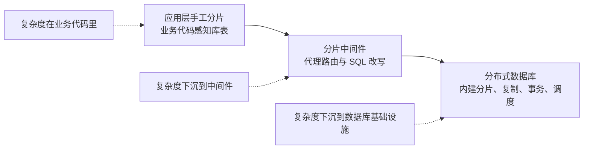
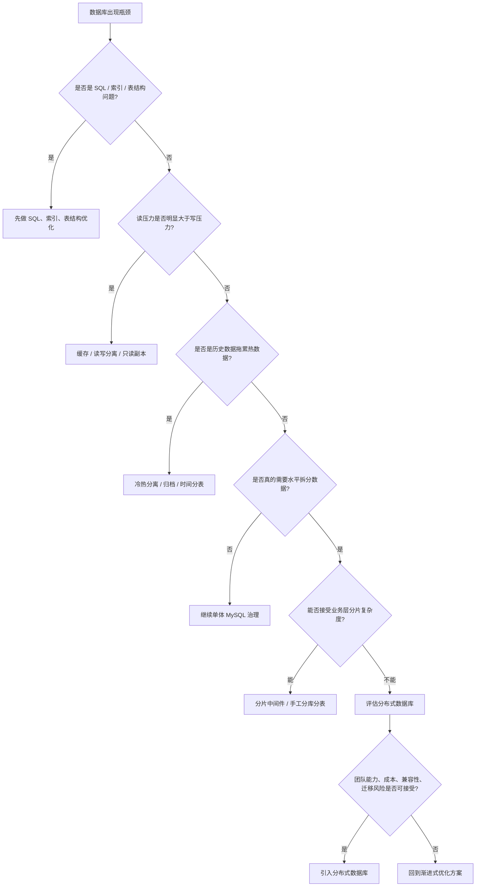

[[从“分布式系统打散压力”的角度理解 MySQL 水平分表]]
[[分库中间件ShardingSphere的使用]]
[[分布式数据库：TiDB简介]]

# 为什么现在分库分表越来越像备选方案，而不是默认方案？

先说结论：**分库分表没有过时，但它不再适合作为数据库扩展的默认反应。**

过去很多 Java 后端系统一遇到数据库瓶颈，第一反应就是：

> 数据量大了？分表。  
> 单库写不动了？分库。  
> 一个实例扛不住？加分片。

这个思路在很长一段时间里是合理的。因为传统 MySQL 本质上是单机关系型数据库，虽然可以做主从、读写分离、缓存、归档，但一旦写入压力、存储容量、单表体积继续增长，业务团队就不得不自己把数据拆开。

但今天的变化在于：**不是分片思想失效了，而是分片能力正在下沉。**

以前由业务代码、分片中间件手工承担的数据分布、SQL 路由、扩容迁移、一致性治理，现在越来越多地被分布式数据库、云数据库、数据平台吸收。现代架构不是不分片，而是尽量不让业务代码直接感知分片。

所以更准确的说法是：

> **分库分表从“默认方案”，变成了“高成本备选方案”。**

---

## 一、过去为什么一遇到数据库瓶颈就想到分库分表？

因为在传统 MySQL 架构里，很多问题最终都会撞到单机边界。

比如一张订单表：

```text
orders
```

一开始几百万行、几千万行，问题不大。  
后面变成几亿行、几十亿行，就会出现一系列现实问题：

- 单表索引越来越大，查询和维护成本上升；
    
- DDL 变得很危险，加字段、建索引都要小心；
    
- 单库写入压力上来后，redo log、buffer pool、IO、连接数都可能成为瓶颈；
    
- 主从复制延迟变明显；
    
- 历史数据和热数据混在一起，在线交易查询被冷数据拖累；
    
- 备份、恢复、迁移的窗口越来越不可控。
    

在那个阶段，如果分布式数据库不成熟，或者成本太高，业务团队能做的选择其实不多。

于是就有了经典路径：

```text
单库单表
  ↓
索引优化
  ↓
读写分离
  ↓
单库分表
  ↓
分库分表
  ↓
分片中间件 / 应用层路由
```

所以，过去分库分表流行，不是因为它简单，而是因为那时没多少更好的选择。

它本质上是在传统 MySQL 之上，手工搭了一层“准分布式数据库能力”。

---

## 二、分库分表真正重的地方，不是拆表，而是业务系统背上了数据库基础设施职责

很多人刚学分库分表时，会觉得它很简单：

```java
int tableIndex = (int) (userId % 16);
String tableName = "orders_" + tableIndex;
```

看起来就是按 `user_id` 取模，路由到不同表。

但生产环境里，真正重的不是这几行代码，而是拆完之后的长期系统成本。

分库分表之后，业务系统要开始关心很多以前数据库自己处理的问题。

|原本更像数据库/基础设施的能力|手工分库分表时谁来承担|对业务系统的影响|
|---|---|---|
|数据放在哪里|应用代码 / 分片中间件|业务必须理解分片规则|
|SQL 路由|应用代码 / 中间件|查询最好必须带分片键|
|跨分片查询|应用层聚合 / 中间件合并|SQL 能力变弱，性能不稳定|
|扩容迁移|研发 + DBA + 运维|变成大型工程项目|
|全局唯一约束|业务额外设计|唯一索引不再天然全局有效|
|分布式事务|业务补偿 / 中间件 / 事务框架|本地事务变成一致性治理|
|故障排查|研发和运维共同处理|链路变长，定位更难|

所以有一句话很关键：

> **应用层分库分表，本质上是在业务系统里手工实现了一部分分布式数据库能力。**

这才是分库分表越来越谨慎的原因。

它不是不能用，而是你一旦用了，就不是“多几张表”这么简单，而是把数据分布、查询路由、扩容迁移、一致性治理这些问题全部带进了业务系统。

很多团队最后会发现，真正限制系统演进的不是 MySQL 本身，而是当年选下的分片键和路由规则。

比如订单表按 `user_id` 分片，那么按用户查订单很舒服。  
但如果后来客服要按 `order_no` 查、运营要按 `merchant_id` 查、风控要按手机号或设备号查，事情就开始复杂了。

这就是分库分表的典型副作用：

> **它用一个分片维度优化了主路径，但也可能锁死未来的查询模型。**

---

## 三、真正的变化：分片没有消失，而是下沉到了基础设施

现在很多人说“分库分表不推荐了”，容易让人误解成：

> 数据库以后不需要分片了。

这不对。

数据规模继续增长，请求压力继续增长，单点承载能力仍然有限。  
**分片一定还存在。**

变化只是：**谁来感知分片，谁来管理分片。**

过去是：

```text
Java 应用知道分片规则
或者分片中间件知道分片规则
底层是多个 MySQL 实例
```

现在越来越多系统希望变成：

```text
Java 应用看到的是逻辑表
底层怎么切分、复制、迁移、调度
由数据库系统或数据基础设施处理
```

这就是从“显式分片”走向“透明分片”。

可以把这个演进看成三层：



第一阶段是应用层手工分片。

比如业务代码里根据 `user_id` 算库表，或者 DAO 层拼接表名。优点是直接、可控、性能路径短；缺点是侵入性强，后期改起来很痛。

第二阶段是分片中间件。

比如 ShardingSphere、MyCat、数据库代理层。它们把路由、读写分离、SQL 改写、部分分布式事务能力从业务代码中抽离出来。业务代码不一定直接拼表名了，但业务仍然要理解分片键、分片规则和跨分片限制。

第三阶段是分布式数据库。

比如 TiDB、OceanBase、PolarDB-X、CockroachDB、YugabyteDB 这类系统代表的方向，不是简单帮你“代理多个 MySQL”，而是在数据库系统内部内建：

- 自动分片；
    
- 数据副本；
    
- 分布式事务；
    
- 弹性扩容；
    
- 高可用；
    
- 分布式 SQL 执行；
    
- 调度和负载均衡；
    
- 查询优化器对数据分布的感知。
    

重点不是某个产品有多强，而是这个架构趋势：

> **应用尽量看到逻辑上的一张表，物理上的数据切分、复制、迁移和调度交给数据库系统。**

所以，现代架构不是不分片，而是尽量减少业务对分片的直接感知。

---

## 四、为什么这会让分库分表变成备选方案？

因为传统分库分表的长期成本太高。

它的成本不只在上线那一刻，而是在后面几年持续出现。

### 1. 业务侵入大

一旦业务代码、DAO 层、SQL 写法、数据访问路径都和分片规则绑定，后面要改就很难。

尤其是早期为了快，很多团队会把分片逻辑写进业务代码。短期效率高，长期就是技术债。

### 2. 查询模型容易被锁死

分库分表通常要求核心查询带分片键。

这意味着：

```text
按 user_id 分片，就天然适合按 user_id 查；
按 merchant_id 分片，就天然适合按 merchant_id 查；
按 tenant_id 分片，就天然适合按 tenant_id 查。
```

但业务查询维度一变，可能就要靠全局索引、冗余表、ES、宽表、异步同步来补。

这不是不能做，而是系统复杂度会上升。

### 3. 扩容迁移不是加机器那么简单

很多人以为：

```text
16 个分片不够 → 改成 32 个分片
```

但实际不是改个配置就结束。

你要处理：

- 历史数据迁移；
    
- 增量数据同步；
    
- 双写；
    
- 数据校验；
    
- 灰度切流；
    
- 回滚预案；
    
- 迁移期间的数据一致性；
    
- 迁移后的监控和修复。
    

这更像一次数据库架构手术，而不是普通发布。

### 4. 复杂查询能力会下降

单库里很自然的 JOIN、聚合、排序、分页，到了分库分表之后，都可能变成跨分片操作。

跨分片操作不是不能做，但代价变高，而且性能不稳定。

所以很多分库分表系统最后会制定约束：

```text
禁止跨库 JOIN
核心查询必须带分片键
复杂报表走离线数仓
多条件检索走 ES
全局聚合走 OLAP
```

这背后其实是在承认一件事：

> 分库分表牺牲了一部分关系型数据库的通用查询能力，换来了水平扩展能力。

### 5. 长期维护成本高

分库分表之后，故障排查链路也会变长。

以前一个慢 SQL，直接看数据库执行计划。  
现在要先看路由到哪个分片、有没有广播查询、哪个分片慢、是不是热点分片、是不是中间件合并慢、是不是跨库事务卡住。

所以分库分表不再默认，不是因为它弱，而是因为它重。

---

### 那什么时候它仍然合理？

分库分表仍然有自己的适用场景。

|场景|更适合的方案|原因|
|---|---|---|
|数据量不大，主要是慢 SQL|继续 MySQL 优化|索引、SQL、表结构问题优先解决|
|读多写少，读压力高|缓存 / 读写分离|没必要过早拆分数据|
|历史数据拖累热数据|冷热分离 / 归档 / 时间分表|先解决数据生命周期问题|
|查询模型稳定，分片键明确|手工分库分表 / 分片中间件|业务约束清晰，成本可控|
|团队熟悉 MySQL，成本敏感|MySQL 分片体系|可控、便宜、人才和经验多|
|老系统已经稳定分库分表|继续治理，不盲目迁移|迁移风险可能大于收益|
|多维查询、弹性扩容、复杂一致性诉求强|评估分布式数据库|让基础设施承担更多分布式能力|

所以不是“分库分表不能用”，而是：

> **只有当你明确知道自己为什么要分、按什么维度分、能接受什么限制、未来怎么扩容时，分库分表才是一个成熟方案。**

否则，它很容易从性能优化手段变成长期架构包袱。

---

## 五、别走向另一个极端：分布式数据库也不是银弹

说到这里，也不能得出另一个简单结论：

> 既然手工分库分表重，那以后直接上 TiDB / OceanBase / PolarDB-X 就行。

这同样不对。

分布式数据库确实把很多复杂度下沉了，但复杂度没有消失。

它只是从业务层转移到了数据库内核、运维平台和基础设施团队。

传统分库分表里，业务要关心：

```text
数据在哪个库？
SQL 怎么路由？
怎么扩容？
怎么跨库事务？
```

分布式数据库里，这些问题不一定由业务代码直接处理，但会变成：

```text
热点 Region 怎么处理？
跨节点事务成本高不高？
SQL 执行计划是否稳定？
网络延迟对性能影响多大？
副本调度是否合理？
数据倾斜怎么治理？
MySQL 兼容性有没有坑？
备份恢复怎么做？
集群扩容是否真的平滑？
```

也就是说：

> **透明分片不等于免费分片。**

你可以让业务代码少背一些复杂度，但数据库和基础设施层一定会多背一些复杂度。

所以分布式数据库适合什么场景？

通常是：

- 数据规模确实大；
    
- 单机 MySQL 已经逼近边界；
    
- 业务还希望保留较完整的 SQL 能力；
    
- 需要弹性扩容；
    
- 需要更统一的分布式事务和高可用能力；
    
- 团队有能力做压测、迁移、调优、运维；
    
- 成本可以接受。
    

反过来，如果一个系统数据量还没多大，慢查询主要来自索引设计问题，团队也没有分布式数据库运维经验，上来就引入重型分布式数据库，可能不是升级，而是给系统加了一个更复杂的黑盒。

工程选型最怕两种冲动：

```text
一种是：数据大了，直接分库分表。
另一种是：分库分表麻烦，直接上分布式数据库。
```

这两种都不是架构判断，而是条件反射。

---

## 六、现代后端工程师应该怎么判断？

我觉得现在 Java 后端对这个问题的认知，要从“怎么分库分表”升级到“复杂度应该放在哪一层”。

更合理的决策顺序是：

```text
第一步：先看是不是 SQL、索引、表结构问题。
第二步：再看缓存、读写分离、冷热归档能不能解决。
第三步：再判断是否真的需要水平拆分数据。
第四步：如果需要水平拆分，判断业务能不能接受分片约束。
第五步：如果不能接受，再评估分片中间件或分布式数据库。
第六步：最后结合团队能力、成本和迁移风险做选择。
```

可以画成这样：



这里面最关键的问题不是：

> 我要不要分库分表？

而是：

> 当前瓶颈到底在哪里？  
> 数据是否真的需要水平分布？  
> 分布式复杂度应该放在业务层、中间件层，还是数据库基础设施层？  
> 团队能不能承担这种复杂度？

这才是现代后端工程师应该具备的判断。

以前面试可能问：

> 你会不会设计分库分表？

现在更高级的问题应该是：

> 什么情况下你不建议分库分表？  
> 如果不分库分表，你有什么替代路径？  
> 如果使用分布式数据库，你知道复杂度转移到了哪里吗？  
> 如果手工分库分表，你准备怎么处理未来的扩容和查询维度变化？

一个成熟的回答不应该是“数据大了就分”，而应该是：

> **不是数据一大就分库分表，而是先判断瓶颈来自哪里，以及复杂度应该放在业务层、中间件层，还是数据库基础设施层。**

---

## 总结

这件事可以压缩成 5 个判断。

1. **分库分表没有过时，但不再适合作为默认反应。**  
    它仍然能解决单库单表承载能力问题，但代价很重。
    
2. **分库分表的本质不是“拆表”，而是数据分布和压力打散。**  
    这个思想在 Kafka partition、ES shard、Redis Cluster slot、分布式数据库里都存在。
    
3. **传统分库分表的问题，是让业务系统承担了太多数据库基础设施职责。**  
    分片键、SQL 路由、扩容迁移、跨分片查询、一致性治理，都会进入业务系统生命周期。
    
4. **现代趋势不是不分片，而是让分片能力下沉。**  
    从业务手工分片，到分片中间件，再到分布式数据库内建分片，本质是复杂度逐步下沉。
    
5. **分布式数据库不是银弹。**  
    它降低业务侵入，但会带来基础设施层的复杂度，比如热点、执行计划、跨节点事务、兼容性、运维和成本。
    

最后用两句话收束：

> **分片没有消失，分片能力正在基础设施化。**

> **打散压力这个思想永远不过时，变化的是由谁来承担打散后的复杂度。**

如果面试或技术分享时要表达，可以这样说：

> 过去分库分表是 MySQL 水平扩展的常规方案，因为传统单机数据库能力有限，业务只能自己通过分片键、路由规则和中间件把数据打散。但分库分表的长期成本很高，它会让业务系统感知数据分布，并承担跨分片查询、扩容迁移、事务一致性和全局约束等复杂度。现在 TiDB、OceanBase、PolarDB-X 等分布式数据库逐渐成熟，很多分片、复制、扩容、事务和高可用能力开始下沉到数据库基础设施层。因此分库分表不是失效了，而是从默认方案变成了需要谨慎评估的备选方案。真正的架构判断不是“要不要分表”，而是“数据分布的复杂度应该由谁承担”。