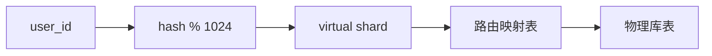

[xfg基础版](https://bugstack.cn/md/road-map/db-router.html)

# 结论：这个主题的“满分理解”不是手写一个 Hash 路由，而是理解 **数据库分片路由层** 的完整工程边界

小傅哥这篇文章的价值在于：用一个轻量案例把 **AOP、ThreadLocal、AbstractRoutingDataSource、Hash 路由、MyBatis 表名占位** 串起来，让你理解“分库分表路由组件”最小闭环。文章本身明确是通过简单实践实现分库分表路由，涉及 AOP、路由散列算法、动态数据源切换等知识点；核心实现包括注解标记、AOP 计算库表索引、ThreadLocal 保存上下文、动态数据源切换、MyBatis `${tbIdx}` 拼接表名。([Bugstack](https://bugstack.cn/md/road-map/db-router.html "db-router | 小傅哥 bugstack 虫洞栈"))

但如果按今天的工程标准看，真正的数据库路由组件不能只停留在“根据 userId 算库表”。它至少要回答：

> **一条 SQL 进来，我如何确定它该去哪个库、哪张表；如果查不到分片键、跨分片、事务、分页、扩容、热点、读写分离、监控、故障恢复，又该怎么办？**

这才是企业级分库分表路由组件的核心。

---

# 1. 先建立正确定位：数据库路由组件到底是什么？

## 1.1 它不是数据库，也不是 ORM

数据库路由组件本质是一个 **应用层或代理层的数据访问中间件**。

它站在业务代码和真实数据库之间，负责把：

```sql
SELECT id, user_id, order_no, amount
FROM t_order
WHERE user_id = 10001;
```

路由成：

```sql
SELECT id, user_id, order_no, amount
FROM t_order_01
WHERE user_id = 10001;
```

并选择正确数据源：

```text
ds_00 / ds_01 / ds_02 / ds_03
```

所以它解决的是：

|问题|路由组件负责什么|
|---|---|
|数据量太大|把单表数据拆到多张物理表|
|单库压力太大|把数据拆到多个物理库|
|应用不想感知库表细节|业务面对逻辑表，组件负责真实路由|
|查询需要定位数据|根据分片键计算目标库表|
|未来需要扩容|路由规则要可演进|

---

# 2. 最新工程视角：今天有哪几类方案？

不要一上来就手写。先看行业主流路径。

## 2.1 客户端 JDBC 层：ShardingSphere-JDBC

这是 Java 后端最容易接入的一类方案。Apache ShardingSphere 官方定位为把任意数据库增强为分布式数据库系统的生态，提供数据分片、弹性伸缩、加密等能力；ShardingSphere-JDBC 则支持通过 Java 或 YAML 配置接入，目前是 Java 语言侧的 JDBC 层方案。([Apache ShardingSphere](https://shardingsphere.apache.org/document/current/en/overview/?utm_source=chatgpt.com "Overview :: ShardingSphere"))

特点：

|维度|说明|
|---|---|
|部署|以 Jar 包接入应用|
|优点|Java 项目接入方便，业务侵入小|
|缺点|多语言系统不统一；每个应用都带一份路由逻辑|
|适合|Java 单体、Java 微服务、中小规模分库分表|

ShardingSphere 不只是算库表，它还有 SQL 路由、SQL 改写、执行引擎等完整链路。官方文档说明，逻辑 SQL 不能直接在真实库表执行，需要 SQL rewrite；执行引擎会把路由和改写后的真实 SQL 安全、高效地发送到底层数据源执行。([Apache ShardingSphere](https://shardingsphere.apache.org/document/4.1.0/en/features/sharding/principle/rewrite/?utm_source=chatgpt.com "Rewrite Engine"))

## 2.2 代理层：ShardingSphere-Proxy / Vitess

代理层方案是把路由能力从应用进程中剥离出来。

应用连接的是 Proxy，Proxy 再连接真实数据库。ShardingSphere-Proxy 支持通过 DistSQL 管理逻辑数据库，不过 DistSQL 目前只用于 Proxy，不用于 JDBC。([Apache ShardingSphere](https://shardingsphere.apache.org/document/5.5.2/en/user-manual/shardingsphere-proxy/distsql/?utm_source=chatgpt.com "DistSQL :: ShardingSphere"))

Vitess 是 MySQL 生态里非常重要的云原生分片方案。CNCF 页面将 Vitess 定位为 MySQL-compatible、horizontally scalable、cloud-native database solution，并且它已经是 CNCF Graduated 项目。([CNCF](https://www.cncf.io/projects/vitess/?utm_source=chatgpt.com "Vitess | CNCF")) Vitess 官方也强调它提供对应用透明的灵活分片方案，并支持 live resharding。([Vitess](https://vitess.io/?utm_source=chatgpt.com "Vitess | Scalable. Reliable. MySQL-compatible. Cloud-native ..."))

适合：

|维度|说明|
|---|---|
|多语言系统|Java、Go、PHP、Python 都能统一接入|
|大规模 MySQL 集群|更适合集中治理|
|运维复杂度|比 JDBC 层更高|
|公司阶段|中大型团队更适合|

## 2.3 换分布式数据库：TiDB / OceanBase 等

如果公司不想长期维护手工分库分表规则，可以考虑分布式 SQL 数据库。TiDB 官方文档强调其高度兼容 MySQL 协议和 MySQL 5.7/8.0 常见语法，MySQL 生态工具可继续使用；官方介绍也将 TiDB 定位为 MySQL-compatible、可扩展、支持实时分析的统一平台。([PingCAP Docs](https://docs.pingcap.com/tidb/stable/mysql-compatibility?utm_source=chatgpt.com "MySQL Compatibility | TiDB Docs"))

这条路线的核心变化是：

```text
应用层手工分库分表
        ↓
数据库内部自动分布式存储、调度、复制、扩容
```

但代价是迁移成本、兼容性验证、SQL 行为差异、运维体系变化。

---

# 3. 自研数据库路由组件，适合解决什么问题？

自研不是为了替代 ShardingSphere，而是为了学习和掌控核心机制，或者在小范围场景内满足明确需求。

## 3.1 适合自研的场景

|场景|是否适合自研|
|---|---|
|教学、源码学习、理解中间件原理|适合|
|简单按 user_id/order_id 分库分表|可以|
|少量核心表，规则稳定|可以|
|复杂 SQL、JOIN、聚合、分页、读写分离、分布式事务|不建议从零自研|
|多语言、多团队、大规模数据库治理|不建议|

## 3.2 自研组件的边界要非常克制

一个合理的自研 MVP 应该只做这些：

```text
1. 根据分片键计算库表
2. 动态切换 DataSource
3. 给 MyBatis 提供真实表名
4. 支持单分片增删改查
5. 拒绝无分片键查询
6. 提供基础监控和日志
```

不要一开始就做：

```text
跨库 JOIN
跨分片聚合
自动扩容迁移
分布式事务
SQL Parser
全局二级索引
```

这些是 ShardingSphere、Vitess、TiDB 这类成熟项目长期解决的问题。

---

# 4. 一个企业级路由组件的核心架构

## 4.1 总体链路

```mermaid
flowchart LR
    A[业务方法] --> B[@ShardRoute 注解 / MyBatis 拦截器]
    B --> C[提取分片键 userId/orderId]
    C --> D[ShardRouter 路由算法]
    D --> E[RouteContext ThreadLocal]
    E --> F[DynamicRoutingDataSource]
    E --> G[TableNameRewriter]
    F --> H[(目标数据库 ds_01)]
    G --> I[真实表 t_order_03]
    H --> J[执行 SQL]
    I --> J
```

## 4.2 核心模块拆分

|模块|职责|
|---|---|
|`ShardProperties`|读取分片配置|
|`ShardRule`|描述逻辑表、物理库表、分片键|
|`ShardAlgorithm`|分片算法|
|`ShardRouter`|计算目标库表|
|`RouteContext`|保存当前线程路由结果|
|`DynamicRoutingDataSource`|选择目标数据源|
|`TableNameInterceptor`|改写逻辑表名为真实表名|
|`ShardRouteAspect`|拦截业务方法，提取分片键|
|`RouteMonitor`|打印日志、埋点、告警|

---

# 5. 分片算法：不要只会 `%`

## 5.1 取模算法

最常见：

```java
int shard = hash(shardingKey) % shardCount;
```

优点：简单、性能好。

缺点：扩容非常痛苦。比如从 8 个分片扩到 16 个分片，大量历史数据路由结果会变化。

适合：

```text
早期项目、分片数一次规划足够、短期不扩容
```

## 5.2 库表二维映射

假设：

```text
4 个库
每库 8 张表
总分片数 = 32
```

计算方式：

```java
int total = dbCount * tableCount;
int index = hash(shardingKey) % total;

int dbIndex = index / tableCount;
int tableIndex = index % tableCount;
```

示意：

```text
index 0  -> db_00.t_order_00
index 1  -> db_00.t_order_01
...
index 8  -> db_01.t_order_00
...
index 31 -> db_03.t_order_07
```

## 5.3 一致性 Hash

适合节点动态变化的场景，但数据库分片不一定天然适合简单一致性 Hash，因为数据库扩容不仅是路由变化，还涉及历史数据迁移、双写、校验、切流。

它更适合：

```text
缓存节点
服务节点
部分可迁移数据分布
```

数据库分片场景里，一致性 Hash 不能单独解决扩容问题。

## 5.4 Range 分片

例如按时间或 ID 范围：

```text
2024 年订单 -> t_order_2024
2025 年订单 -> t_order_2025
2026 年订单 -> t_order_2026
```

优点：

```text
方便归档、冷热分离、按时间查询
```

缺点：

```text
容易产生热点，比如当前月份订单全部打到一张表
```

适合：

```text
日志、流水、账单、历史归档
```

## 5.5 真实工程常用组合

订单表经常这样设计：

```text
分库键：user_id
分表键：order_id 或 user_id
时间字段：用于归档和查询过滤
```

但要注意：分片键最好和最高频查询条件一致。

如果订单系统最高频查询是：

```sql
WHERE user_id = ?
```

那分片键优先选 `user_id`。

如果最高频查询是：

```sql
WHERE order_no = ?
```

那要么用 `order_no` 做分片键，要么设计订单号时内嵌路由信息。

---

# 6. 生产级代码案例：实现一个轻量数据库路由组件

下面给一个可落地的简化版。它不是完整 ShardingSphere，而是适合你学习和放进项目里的“轻量路由组件骨架”。

## 6.1 表结构设计

假设订单表按 `user_id` 分 2 库，每库 4 表。

```sql
CREATE TABLE t_order_00 (
    id BIGINT UNSIGNED NOT NULL COMMENT '业务订单ID',
    user_id BIGINT UNSIGNED NOT NULL COMMENT '用户ID，分片键',
    order_no VARCHAR(64) NOT NULL COMMENT '订单号',
    amount DECIMAL(18, 2) NOT NULL COMMENT '订单金额',
    order_status TINYINT NOT NULL COMMENT '订单状态',
    created_at DATETIME NOT NULL DEFAULT CURRENT_TIMESTAMP COMMENT '创建时间',
    updated_at DATETIME NOT NULL DEFAULT CURRENT_TIMESTAMP ON UPDATE CURRENT_TIMESTAMP COMMENT '更新时间',
    PRIMARY KEY (id),
    UNIQUE KEY uk_order_no (order_no),
    KEY idx_user_created (user_id, created_at)
) ENGINE=InnoDB DEFAULT CHARSET=utf8mb4 COMMENT='订单表';
```

每个库建：

```text
t_order_00
t_order_01
t_order_02
t_order_03
```

## 6.2 配置类

```java
@Data
@ConfigurationProperties(prefix = "app.sharding")
public class ShardingProperties {

    /**
     * 总库数，例如 2。
     */
    private int databaseCount;

    /**
     * 每个库的表数量，例如 4。
     */
    private int tableCount;

    /**
     * 逻辑表名，例如 t_order。
     */
    private String logicTable;

    /**
     * 真实数据源名称前缀，例如 ds_。
     */
    private String datasourcePrefix;
}
```

配置示例：

```yaml
app:
  sharding:
    database-count: 2
    table-count: 4
    logic-table: t_order
    datasource-prefix: ds_

spring:
  datasource:
    ds_00:
      jdbc-url: jdbc:mysql://127.0.0.1:3306/order_db_00
      username: root
      password: root
    ds_01:
      jdbc-url: jdbc:mysql://127.0.0.1:3306/order_db_01
      username: root
      password: root
```

## 6.3 路由结果对象

```java
public record RouteResult(
        String datasourceName,
        String logicTableName,
        String actualTableName,
        int databaseIndex,
        int tableIndex
) {
}
```

## 6.4 RouteContext

```java
public final class RouteContext {

    private static final ThreadLocal<RouteResult> CONTEXT = new ThreadLocal<>();

    private RouteContext() {
    }

    public static void set(RouteResult routeResult) {
        CONTEXT.set(routeResult);
    }

    public static RouteResult getRequired() {
        RouteResult result = CONTEXT.get();
        if (result == null) {
            throw new IllegalStateException("No sharding route context found.");
        }
        return result;
    }

    public static RouteResult getNullable() {
        return CONTEXT.get();
    }

    public static void clear() {
        CONTEXT.remove();
    }
}
```

重点：一定要 `remove()`，否则线程池复用时会串路由。

## 6.5 分片算法

```java
@Component
@RequiredArgsConstructor
public class ModShardingAlgorithm {

    private final ShardingProperties properties;

    public RouteResult route(Long shardingKey) {
        if (shardingKey == null) {
            throw new IllegalArgumentException("Sharding key must not be null.");
        }

        int dbCount = properties.getDatabaseCount();
        int tableCount = properties.getTableCount();
        int totalShards = dbCount * tableCount;

        int hash = spreadHash(shardingKey);
        int shardIndex = Math.floorMod(hash, totalShards);

        int databaseIndex = shardIndex / tableCount;
        int tableIndex = shardIndex % tableCount;

        String datasourceName = properties.getDatasourcePrefix() + String.format("%02d", databaseIndex);
        String actualTableName = properties.getLogicTable() + "_" + String.format("%02d", tableIndex);

        return new RouteResult(
                datasourceName,
                properties.getLogicTable(),
                actualTableName,
                databaseIndex,
                tableIndex
        );
    }

    /**
     * 类似 HashMap 的扰动函数，降低低位 hash 分布差导致的倾斜风险。
     */
    private int spreadHash(Long key) {
        int h = Long.hashCode(key);
        return h ^ (h >>> 16);
    }
}
```

注意：`Math.floorMod` 比 `%` 更稳，避免负数 hash 导致负索引。

## 6.6 路由注解

```java
@Target({ElementType.METHOD})
@Retention(RetentionPolicy.RUNTIME)
@Documented
public @interface ShardRoute {

    /**
     * SpEL 表达式，例如 "#request.userId" 或 "#userId"。
     */
    String key();
}
```

为什么用 SpEL？因为生产代码里参数结构复杂，不一定永远是简单对象。

## 6.7 AOP 提取分片键

```java
@Aspect
@Component
@RequiredArgsConstructor
public class ShardRouteAspect {

    private final ModShardingAlgorithm shardingAlgorithm;

    private final ExpressionParser parser = new SpelExpressionParser();
    private final ParameterNameDiscoverer nameDiscoverer = new DefaultParameterNameDiscoverer();

    @Around("@annotation(shardRoute)")
    public Object around(ProceedingJoinPoint joinPoint, ShardRoute shardRoute) throws Throwable {
        Method method = ((MethodSignature) joinPoint.getSignature()).getMethod();

        Long shardingKey = parseShardingKey(method, joinPoint.getArgs(), shardRoute.key());
        RouteResult routeResult = shardingAlgorithm.route(shardingKey);

        try {
            RouteContext.set(routeResult);
            return joinPoint.proceed();
        } finally {
            RouteContext.clear();
        }
    }

    private Long parseShardingKey(Method method, Object[] args, String expression) {
        String[] parameterNames = nameDiscoverer.getParameterNames(method);
        if (parameterNames == null) {
            throw new IllegalStateException("Cannot discover method parameter names.");
        }

        EvaluationContext context = new StandardEvaluationContext();
        for (int i = 0; i < parameterNames.length; i++) {
            context.setVariable(parameterNames[i], args[i]);
        }

        Object value = parser.parseExpression(expression).getValue(context);
        if (value == null) {
            throw new IllegalArgumentException("Sharding key expression value is null: " + expression);
        }

        if (value instanceof Long longValue) {
            return longValue;
        }

        if (value instanceof Number number) {
            return number.longValue();
        }

        return Long.parseLong(value.toString());
    }
}
```

使用方式：

```java
@ShardRoute(key = "#command.userId")
public Long createOrder(CreateOrderCommand command) {
    orderMapper.insert(command);
    return command.getOrderId();
}
```

## 6.8 动态数据源

```java
public class ShardingRoutingDataSource extends AbstractRoutingDataSource {

    @Override
    protected Object determineCurrentLookupKey() {
        RouteResult routeResult = RouteContext.getNullable();
        if (routeResult == null) {
            return "ds_00"; // 或者抛异常，取决于你是否允许默认库
        }
        return routeResult.datasourceName();
    }
}
```

`AbstractRoutingDataSource` 的核心点是：它在获取连接时决定当前使用哪个 DataSource。社区经验里也经常强调，切换数据源必须发生在获取连接之前，否则框架可能已经缓存/持有 Connection，后续切换不会生效。([Stack Overflow](https://stackoverflow.com/questions/13055609/not-routing-datasource-with-spring-3-and-mybatis?utm_source=chatgpt.com "Not routing DataSource with Spring 3 and MyBatis"))

## 6.9 MyBatis 表名改写拦截器

不要在 XML 里裸写 `${tbIdx}` 太多。更好的方式是拦截 SQL，把逻辑表替换为真实表。

```java
@Intercepts({
        @Signature(
                type = StatementHandler.class,
                method = "prepare",
                args = {Connection.class, Integer.class}
        )
})
public class ShardingTableNameInterceptor implements Interceptor {

    @Override
    public Object intercept(Invocation invocation) throws Throwable {
        RouteResult routeResult = RouteContext.getNullable();

        if (routeResult == null) {
            return invocation.proceed();
        }

        StatementHandler statementHandler = (StatementHandler) invocation.getTarget();
        BoundSql boundSql = statementHandler.getBoundSql();

        String originalSql = boundSql.getSql();
        String routedSql = rewriteTableName(
                originalSql,
                routeResult.logicTableName(),
                routeResult.actualTableName()
        );

        MetaObject metaObject = SystemMetaObject.forObject(boundSql);
        metaObject.setValue("sql", routedSql);

        return invocation.proceed();
    }

    private String rewriteTableName(String sql, String logicTable, String actualTable) {
        return sql.replaceAll("\\b" + logicTable + "\\b", actualTable);
    }
}
```

这个实现仍然是简化版。生产级 SQL 改写最好用 SQL Parser，而不是简单正则。因为复杂 SQL 里可能有别名、子查询、字符串字面量、注释、函数等情况。

---

# 7. Mapper 层代码

```java
@Mapper
public interface OrderMapper {

    int insert(OrderEntity order);

    OrderEntity selectByUserIdAndOrderNo(@Param("userId") Long userId,
                                         @Param("orderNo") String orderNo);

    List<OrderEntity> listByUserId(@Param("userId") Long userId,
                                   @Param("offset") long offset,
                                   @Param("limit") long limit);
}
```

XML：

```xml
<mapper namespace="com.example.order.infrastructure.mapper.OrderMapper">

    <insert id="insert">
        INSERT INTO t_order (
            id,
            user_id,
            order_no,
            amount,
            order_status,
            created_at,
            updated_at
        )
        VALUES (
            #{id},
            #{userId},
            #{orderNo},
            #{amount},
            #{orderStatus},
            NOW(),
            NOW()
        )
    </insert>

    <select id="selectByUserIdAndOrderNo" resultType="com.example.order.infrastructure.entity.OrderEntity">
        SELECT
            id,
            user_id,
            order_no,
            amount,
            order_status,
            created_at,
            updated_at
        FROM t_order
        WHERE user_id = #{userId}
          AND order_no = #{orderNo}
        LIMIT 1
    </select>

    <select id="listByUserId" resultType="com.example.order.infrastructure.entity.OrderEntity">
        SELECT
            id,
            user_id,
            order_no,
            amount,
            order_status,
            created_at,
            updated_at
        FROM t_order
        WHERE user_id = #{userId}
        ORDER BY created_at DESC
        LIMIT #{offset}, #{limit}
    </select>

</mapper>
```

业务层：

```java
@Service
@RequiredArgsConstructor
public class OrderService {

    private final OrderMapper orderMapper;

    @ShardRoute(key = "#command.userId")
    @Transactional(rollbackFor = Exception.class)
    public Long createOrder(CreateOrderCommand command) {
        OrderEntity order = new OrderEntity();
        order.setId(command.getOrderId());
        order.setUserId(command.getUserId());
        order.setOrderNo(command.getOrderNo());
        order.setAmount(command.getAmount());
        order.setOrderStatus(10);

        orderMapper.insert(order);
        return order.getId();
    }

    @ShardRoute(key = "#userId")
    public OrderEntity getOrder(Long userId, String orderNo) {
        return orderMapper.selectByUserIdAndOrderNo(userId, orderNo);
    }
}
```

---

# 8. 关键问题：没有分片键怎么办？

这是分库分表最容易踩坑的地方。

## 8.1 单分片查询

推荐：

```sql
SELECT id, user_id, order_no, amount
FROM t_order
WHERE user_id = ?
  AND order_no = ?;
```

可以直接定位到一个库一张表。

## 8.2 没有分片键的查询

危险：

```sql
SELECT id, user_id, order_no, amount
FROM t_order
WHERE order_no = ?;
```

如果 `order_no` 不是分片键，路由组件不知道去哪查。

解决方案：

|方案|说明|
|---|---|
|订单号内嵌路由信息|生成 order_no 时包含 shard index|
|建立映射表|`order_no -> user_id`|
|广播查询|查所有分片，成本高|
|搜索引擎辅助|ES/OpenSearch 存查询索引|
|改业务接口|强制传 user_id|

生产建议：

> **核心在线接口必须带分片键。没有分片键的查询，要么禁止，要么走专门查询通道。**

---

# 9. 订单号内嵌路由信息：非常实用

比如订单号：

```text
2026051501 03 000000123456
日期       shard  sequence
```

其中 `03` 表示 shardIndex。

查询时：

```java
public int parseShardIndexFromOrderNo(String orderNo) {
    return Integer.parseInt(orderNo.substring(10, 12));
}
```

这样即使没有 `user_id`，也可以根据 `order_no` 反推出目标分片。

但这会带来约束：

```text
订单号生成器必须稳定
分片位数要提前规划
扩容后老订单号仍然要兼容
```

---

# 10. 跨分片分页：不要轻易承诺

这是自研路由组件最容易“假实现”的地方。

例如：

```sql
SELECT id, user_id, order_no, amount
FROM t_order
WHERE order_status = 10
ORDER BY created_at DESC
LIMIT 0, 20;
```

如果没有分片键，就要：

```text
1. 查询所有分片
2. 每个分片取前 N 条
3. 应用层归并排序
4. 再截取最终分页
```

问题：

|问题|说明|
|---|---|
|性能差|分片越多，查询越重|
|排序复杂|要做全局归并|
|深分页灾难|offset 越大，扫描越多|
|一致性问题|多分片数据快照不一致|

所以生产里常见做法是：

```text
在线查询：必须带分片键
运营后台：走 ES / ClickHouse / 离线宽表
报表统计：走数仓
```

---

# 11. 分布式事务：能不用就不用

如果一次业务只写一个分片：

```text
user_id = 10001
订单表、订单明细表都按 user_id 路由
```

那本地事务就够了。

如果一次业务写多个分片：

```text
用户 A 转账给用户 B
A 在 db_00
B 在 db_03
```

就涉及跨库事务。

常见处理：

|方案|适合场景|
|---|---|
|本地事务|单分片内|
|TCC|强一致要求高、业务可补偿|
|Saga|长事务、最终一致|
|Outbox + MQ|事件驱动最终一致|
|Seata AT/TCC|中间件化分布式事务|

对于多数互联网业务，优先设计成：

```text
单聚合内强一致
跨聚合最终一致
```

不要让自研路由组件承担分布式事务能力。

---

# 12. 扩容迁移：分库分表真正难点

很多教程只讲：

```java
hash(userId) % 8
```

但生产里真正麻烦的是：

```text
8 个分片不够了，怎么扩到 16 个？
```

## 12.1 直接改模数是灾难

原来：

```java
userId % 8
```

后来：

```java
userId % 16
```

大量历史数据路由位置变化。老数据还在旧分片，新请求却路由到新分片，直接查不到。

## 12.2 更稳的扩容方案：预分片

一开始逻辑上规划 1024 个虚拟分片：

```text
virtual_shard = hash(user_id) % 1024
```

再映射到物理库表：

```text
virtual_shard 0-127   -> db_00.t_order_00
virtual_shard 128-255 -> db_00.t_order_01
...
```

扩容时只迁移部分虚拟分片。



这样路由规则从：

```text
hash -> physical shard
```

升级成：

```text
hash -> virtual shard -> physical shard
```

这是更接近生产的设计。

## 12.3 扩容流程

```text
1. 新增物理库表
2. 修改虚拟分片映射为迁移中
3. 历史数据迁移
4. 双写或增量同步
5. 数据校验
6. 灰度读新分片
7. 切换路由
8. 清理旧数据
```

这就是为什么分库分表不是一个“写个 Hash 算法”的问题。

---

# 13. 热点问题：Hash 均匀不代表业务均匀

即使 Hash 算法均匀，也可能出现热点。

比如：

```text
大客户 user_id = 10001
这个用户一天产生 100 万订单
```

如果按 `user_id` 分片，这个用户所有订单都会落到同一个分片。

解决方案：

|方案|说明|
|---|---|
|复合分片键|`user_id + order_id`|
|大客户单独路由|VIP tenant 独立库|
|热点用户打散|给热点用户加 bucket|
|读写分离|缓解读压力|
|缓存/异步化|降低数据库写读压力|

示例：

```java
int bucket = Math.floorMod(Long.hashCode(orderId), 16);
String shardKey = userId + "_" + bucket;
```

但副作用是：按 user_id 查询时要查多个 bucket。

工程本质是取舍：

```text
写入打散能力 ↑
单用户查询便利性 ↓
```

---

# 14. 和 ShardingSphere 的差距在哪里？

ShardingSphere 的能力不是简单的 `hash + ThreadLocal`。它是完整的分布式数据库中间件生态，官方说明它覆盖数据分片、读写分离、高性能等能力，ShardingSphere 5.5.3 在 2026 年 3 月发布。([Apache ShardingSphere](https://shardingsphere.apache.org/?utm_source=chatgpt.com "Apache ShardingSphere"))

对比：

|能力|自研轻量组件|ShardingSphere|
|---|--:|--:|
|单分片路由|可以|可以|
|SQL 解析|弱|强|
|SQL 改写|弱|强|
|读写分离|需要自研|支持|
|分布式事务|不建议做|有相关能力|
|DistSQL 管理|无|Proxy 支持|
|监控治理|需要自研|更完整|
|跨分片执行|很难|有执行引擎|
|生态成熟度|低|高|

所以推荐路线是：

```text
学习：手写轻量 db-router
项目：优先用 ShardingSphere-JDBC
中大型多语言：考虑 ShardingSphere-Proxy / Vitess
长期减少分片心智：评估 TiDB / OceanBase
```

---

# 15. 生产落地时的设计规范

## 15.1 分片键选择规范

优先级：

```text
1. 高频查询条件
2. 数据分布足够均匀
3. 不容易变更
4. 能和业务聚合边界一致
5. 能支撑事务边界
```

订单系统常见选择：

|表|分片键建议|
|---|---|
|订单表|`user_id` 或 `order_id`|
|订单明细表|跟订单表一致|
|支付单表|`user_id` 或 `payment_no`|
|用户表|`user_id`|
|优惠券领取表|`user_id`|
|日志流水表|时间 + hash|

## 15.2 SQL 规范

分库分表后，业务 SQL 要收敛：

允许：

```sql
SELECT id, user_id, order_no, amount
FROM t_order
WHERE user_id = ?
  AND order_no = ?;
```

谨慎：

```sql
SELECT id, user_id, order_no, amount
FROM t_order
WHERE user_id = ?
ORDER BY created_at DESC
LIMIT 20;
```

禁止在线接口使用：

```sql
SELECT id, user_id, order_no, amount
FROM t_order
WHERE order_status = ?
ORDER BY created_at DESC
LIMIT 10000, 20;
```

## 15.3 表设计规范

分库分表后的表要避免依赖数据库自增 ID 作为全局唯一主键。

推荐：

```text
雪花 ID
号段 ID
Leaf Segment
业务号生成器
```

原因：

```text
每个物理表自增 ID 只能保证表内唯一，不能保证全局唯一。
```

## 15.4 事务规范

尽量让同一事务内的数据落在同一分片。

例如：

```text
t_order          按 user_id 分片
t_order_item     按 user_id 分片
t_order_pay      按 user_id 分片
```

这样创建订单时：

```text
订单主表 + 订单明细 + 支付待创建记录
```

可以落在同一个库，使用本地事务。

---

# 16. 最小可用版本的验收标准

你让 AI/Codex/Claude Code 做这种组件时，验收标准必须写死。

## 16.1 功能验收

必须验证：

```text
1. insert 根据 user_id 落到正确库表
2. select 根据 user_id 查到正确库表
3. update/delete 必须带分片键
4. 无分片键时明确报错
5. ThreadLocal finally 清理
6. 事务内不会路由漂移
7. 并发请求不会串库串表
8. 表名改写只改逻辑表，不误改字段/字符串
```

## 16.2 测试用例

```java
@Test
void shouldRouteToSameShardWhenUserIdSame() {
    RouteResult r1 = algorithm.route(10001L);
    RouteResult r2 = algorithm.route(10001L);

    assertThat(r1.datasourceName()).isEqualTo(r2.datasourceName());
    assertThat(r1.actualTableName()).isEqualTo(r2.actualTableName());
}

@Test
void shouldDistributeAcrossShards() {
    Map<String, Integer> countMap = new HashMap<>();

    for (long userId = 1; userId <= 100_000; userId++) {
        RouteResult result = algorithm.route(userId);
        String shard = result.datasourceName() + "." + result.actualTableName();
        countMap.merge(shard, 1, Integer::sum);
    }

    assertThat(countMap).hasSize(8);
}
```

## 16.3 压测验收

至少看：

```text
1. 单分片 QPS
2. 多分片均匀度
3. 连接池占用
4. 慢 SQL
5. 路由耗时
6. SQL 改写耗时
7. 异常率
```

## 16.4 日志验收

每次路由建议打印 debug 日志：

```text
logicTable=t_order,
actualTable=t_order_03,
datasource=ds_01,
shardingKey=10001,
method=createOrder,
traceId=xxx
```

但不要在 info 级别打印大量高频日志，否则影响性能。

---

# 17. AI 编程时的高质量 Prompt

你可以这样交给 Codex / Claude Code：

```text
你是一名资深 Java 后端中间件工程师。

目标：
在当前 Spring Boot + MyBatis 项目中实现一个轻量级数据库分库分表路由组件，用于教学和小规模业务验证，不追求替代 ShardingSphere。

核心要求：
1. 支持按 user_id 分库分表。
2. 支持 2 个数据库，每个数据库 4 张订单表。
3. 业务代码面对逻辑表 t_order。
4. 组件自动路由到真实数据源 ds_00/ds_01。
5. 组件自动把 t_order 改写为 t_order_00 ~ t_order_03。
6. 使用注解 @ShardRoute(key = "#command.userId") 标记需要路由的方法。
7. 使用 ThreadLocal 保存 RouteResult，但必须在 finally 中清理。
8. 使用 AbstractRoutingDataSource 实现动态数据源选择。
9. 使用 MyBatis Interceptor 实现逻辑表到真实表的改写。
10. 无分片键时必须抛出明确异常，禁止默认广播查询。
11. 提供完整单元测试和集成测试。

代码要求：
1. Java 21。
2. Spring Boot 3.x。
3. MyBatis。
4. 所有核心类要有清晰职责。
5. 不要写假实现。
6. 不要只写接口不写实现。
7. 不要省略测试。
8. 不要在 XML 里大量使用 ${} 拼表名，优先用拦截器改写。
9. 所有 SQL 禁止 SELECT *。
10. 所有异常要有明确错误信息。

交付物：
1. ShardingProperties
2. RouteResult
3. RouteContext
4. ModShardingAlgorithm
5. @ShardRoute
6. ShardRouteAspect
7. ShardingRoutingDataSource
8. ShardingTableNameInterceptor
9. OrderMapper 示例
10. OrderService 示例
11. 建表 SQL
12. 单元测试
13. README 使用说明
14. 设计限制说明

验收标准：
1. 同一个 user_id 的 insert/select/update/delete 必须落到同一库表。
2. 不同 user_id 应在多个分片上分布。
3. 并发测试中不得出现 ThreadLocal 串库串表。
4. 事务方法内不得发生路由漂移。
5. 缺少分片键时必须失败，而不是查默认库。
6. 测试必须真实验证数据库落点。
```

---

# 18. 面试表达：怎么把这个主题讲高级？

可以这样说：

> 数据库分库分表路由组件的核心不是简单的 `userId % N`，而是建立一个从逻辑 SQL 到物理数据节点的映射层。它通常包括分片规则、分片算法、路由上下文、动态数据源、SQL 改写和执行约束。
> 
> 在轻量实现里，可以通过 AOP 提取分片键，通过 Hash 算法计算目标库表，通过 ThreadLocal 保存路由结果，再由 `AbstractRoutingDataSource` 决定真实数据源，由 MyBatis 拦截器把逻辑表名改写成真实表名。
> 
> 但生产级分库分表还要处理无分片键查询、跨分片分页、全局 ID、事务边界、扩容迁移、热点分片、监控告警等问题。所以自研组件适合理解原理或小规模场景，复杂场景应优先考虑 ShardingSphere-JDBC、ShardingSphere-Proxy、Vitess，或者 TiDB/OceanBase 这类分布式 SQL 数据库。

---

# 19. 最后总结

这个主题可以分成三层：

|层次|你要掌握什么|
|---|---|
|入门层|AOP + ThreadLocal + AbstractRoutingDataSource + Hash 算库表|
|工程层|SQL 改写、事务边界、无分片键限制、监控、测试、并发隔离|
|架构层|扩容迁移、跨分片查询、热点治理、全局 ID、分布式数据库选型|

小傅哥文章适合做“手写中间件入门”。但你要达到企业级理解，就要从“写一个路由组件”升级为：

> **设计一个可治理、可演进、可观测、可扩容的数据分片访问层。**

这才是数据库分库分表路由组件的真正价值。