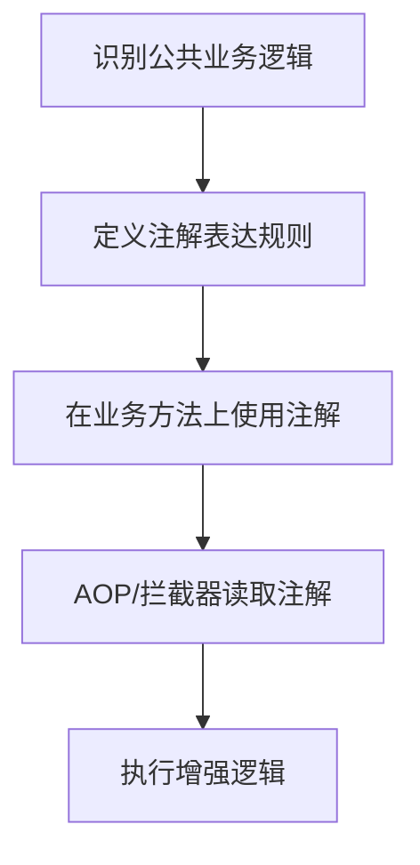

[xfg](https://bugstack.cn/md/road-map/db-router.html#%E4%B8%89%E3%80%81%E8%AE%BE%E8%AE%A1%E5%AE%9E%E7%8E%B0)


文中用到的是 **Java 自定义注解**：

```java
@Documented
@Retention(RetentionPolicy.RUNTIME)
@Target({ElementType.TYPE, ElementType.METHOD})
public @interface DBRouter {

    String key() default "";
}
```

它的作用不是“自己执行逻辑”，而是给类或方法打一个标记，后续通常由 **AOP / 拦截器 / 反射** 去读取这个标记，然后执行对应增强逻辑。

你可以先这样理解：

```java
@DBRouter(key = "userId")
public void createOrder(...) {
    ...
}
```

意思是：

> 这个方法需要做数据库路由，路由字段是 `userId`。

---

# 1. 自定义注解的基本写法

## 1.1 注解定义模板

```java
@Documented
@Retention(RetentionPolicy.RUNTIME)
@Target(ElementType.METHOD)
public @interface MyAnnotation {

    String value() default "";
}
```

核心看 3 个元注解：

|元注解|作用|
|---|---|
|`@Documented`|生成 JavaDoc 时保留这个注解|
|`@Retention`|注解保留到什么时候|
|`@Target`|注解能标在哪些位置|

---

## 1.2 `@Retention` 常用值

|值|含义|常见场景|
|---|---|---|
|`SOURCE`|只在源码阶段存在，编译后没了|Lombok、代码检查|
|`CLASS`|编译进 class 文件，运行时一般读不到|字节码增强|
|`RUNTIME`|运行时可以通过反射读取|AOP、权限、日志、路由|

业务开发中最常用：

```java
@Retention(RetentionPolicy.RUNTIME)
```

因为 AOP 要在运行时读取注解。

---

## 1.3 `@Target` 常用值

|值|注解位置|
|---|---|
|`ElementType.TYPE`|类、接口、枚举|
|`ElementType.METHOD`|方法|
|`ElementType.FIELD`|字段|
|`ElementType.PARAMETER`|方法参数|

比如小傅哥这个：

```java
@Target({ElementType.TYPE, ElementType.METHOD})
```

表示可以标在类上，也可以标在方法上。

---

# 2. 案例一：接口操作日志注解 `@OperationLog`

## 2.1 业务场景

后台管理系统里，管理员经常操作用户、订单、商品。

比如：

```text
禁用用户
修改订单状态
删除商品
审核文章
```

这些操作需要记录日志：

```text
谁，在什么时间，对什么模块，做了什么操作，结果如何
```

如果每个方法里都手写日志，会很乱：

```java
logService.save("用户管理", "禁用用户", operatorId);
```

更好的方式是用注解声明：

```java
@OperationLog(module = "用户管理", operation = "禁用用户")
public void disableUser(Long userId) {
    ...
}
```

---

## 2.2 定义自定义注解

```java
@Documented
@Retention(RetentionPolicy.RUNTIME)
@Target(ElementType.METHOD)
public @interface OperationLog {

    /**
     * 业务模块，例如：用户管理、订单管理、商品管理。
     */
    String module();

    /**
     * 具体操作，例如：禁用用户、修改订单状态。
     */
    String operation();

    /**
     * 是否记录请求参数。
     */
    boolean recordParams() default true;
}
```

说明：

```java
String module();
```

没有默认值，使用时必须填写：

```java
@OperationLog(module = "用户管理", operation = "禁用用户")
```

这个字段：

```java
boolean recordParams() default true;
```

有默认值，不写也可以。

---

## 2.3 使用注解

```java
@RestController
@RequestMapping("/admin/users")
@RequiredArgsConstructor
public class AdminUserController {

    private final UserService userService;

    @PostMapping("/{userId}/disable")
    @OperationLog(module = "用户管理", operation = "禁用用户")
    public ApiResult<Void> disableUser(@PathVariable Long userId) {
        userService.disableUser(userId);
        return ApiResult.success();
    }

    @PostMapping("/{userId}/enable")
    @OperationLog(module = "用户管理", operation = "启用用户")
    public ApiResult<Void> enableUser(@PathVariable Long userId) {
        userService.enableUser(userId);
        return ApiResult.success();
    }
}
```

注解本身只是标记。真正记录日志，需要 AOP 读取它。

---

## 2.4 AOP 读取注解并记录日志

```java
@Aspect
@Component
@RequiredArgsConstructor
public class OperationLogAspect {

    private final OperationLogService operationLogService;

    @Around("@annotation(operationLog)")
    public Object around(ProceedingJoinPoint joinPoint, OperationLog operationLog) throws Throwable {
        long startTime = System.currentTimeMillis();

        boolean success = false;
        String errorMessage = null;

        try {
            Object result = joinPoint.proceed();
            success = true;
            return result;
        } catch (Throwable ex) {
            errorMessage = ex.getMessage();
            throw ex;
        } finally {
            long costTime = System.currentTimeMillis() - startTime;

            saveOperationLog(joinPoint, operationLog, success, errorMessage, costTime);
        }
    }

    private void saveOperationLog(
            ProceedingJoinPoint joinPoint,
            OperationLog operationLog,
            boolean success,
            String errorMessage,
            long costTime
    ) {
        OperationLogRecord record = new OperationLogRecord();

        record.setModule(operationLog.module());
        record.setOperation(operationLog.operation());
        record.setSuccess(success);
        record.setErrorMessage(errorMessage);
        record.setCostTime(costTime);

        if (operationLog.recordParams()) {
            record.setRequestParams(Arrays.toString(joinPoint.getArgs()));
        }

        operationLogService.save(record);
    }
}
```

---

## 2.5 这个案例的重点

你用注解把“业务含义”声明出来：

```java
@OperationLog(module = "用户管理", operation = "禁用用户")
```

然后用 AOP 统一处理公共逻辑：

```text
记录开始时间
执行原方法
捕获异常
保存操作日志
```

这样业务代码会干净很多。

---

# 3. 案例二：接口防重复提交注解 `@PreventDuplicateSubmit`

## 3.1 业务场景

用户点击“提交订单”按钮时，可能因为网络卡顿连续点两次。

如果后端没有防护，可能出现：

```text
重复下单
重复支付
重复领取优惠券
重复提交表单
```

可以用注解声明某些接口需要防重复提交：

```java
@PreventDuplicateSubmit(key = "#request.userId + ':' + #request.productId", expireSeconds = 5)
public ApiResult<Long> createOrder(CreateOrderRequest request) {
    ...
}
```

意思是：

> 同一个用户对同一个商品，5 秒内只能提交一次。

---

## 3.2 定义自定义注解

```java
@Documented
@Retention(RetentionPolicy.RUNTIME)
@Target(ElementType.METHOD)
public @interface PreventDuplicateSubmit {

    /**
     * 幂等控制 key，支持 SpEL 表达式。
     * 例如：#request.userId + ':' + #request.productId
     */
    String key();

    /**
     * 防重复时间窗口，单位：秒。
     */
    long expireSeconds() default 5;

    /**
     * 重复提交时的错误提示。
     */
    String message() default "请勿重复提交";
}
```

这里的核心是：

```java
String key();
```

你可以根据业务入参指定唯一标识。

---

## 3.3 使用注解

```java
@RestController
@RequestMapping("/orders")
@RequiredArgsConstructor
public class OrderController {

    private final OrderService orderService;

    @PostMapping
    @PreventDuplicateSubmit(
            key = "#request.userId + ':' + #request.productId",
            expireSeconds = 5,
            message = "订单正在处理中，请勿重复提交"
    )
    public ApiResult<Long> createOrder(@RequestBody CreateOrderRequest request) {
        Long orderId = orderService.createOrder(request);
        return ApiResult.success(orderId);
    }
}
```

请求对象：

```java
@Data
public class CreateOrderRequest {

    private Long userId;

    private Long productId;

    private Integer quantity;
}
```

---

## 3.4 AOP 读取注解并做防重复提交

这里用 Redis 举例。

```java
@Aspect
@Component
@RequiredArgsConstructor
public class PreventDuplicateSubmitAspect {

    private final StringRedisTemplate stringRedisTemplate;

    private final ExpressionParser parser = new SpelExpressionParser();

    private final ParameterNameDiscoverer nameDiscoverer = new DefaultParameterNameDiscoverer();

    @Around("@annotation(preventDuplicateSubmit)")
    public Object around(
            ProceedingJoinPoint joinPoint,
            PreventDuplicateSubmit preventDuplicateSubmit
    ) throws Throwable {

        Method method = ((MethodSignature) joinPoint.getSignature()).getMethod();

        String businessKey = parseSpelKey(
                method,
                joinPoint.getArgs(),
                preventDuplicateSubmit.key()
        );

        String redisKey = "duplicate-submit:" + businessKey;

        Boolean success = stringRedisTemplate.opsForValue().setIfAbsent(
                redisKey,
                "1",
                Duration.ofSeconds(preventDuplicateSubmit.expireSeconds())
        );

        if (Boolean.FALSE.equals(success)) {
            throw new BizException(preventDuplicateSubmit.message());
        }

        return joinPoint.proceed();
    }

    private String parseSpelKey(Method method, Object[] args, String spel) {
        String[] parameterNames = nameDiscoverer.getParameterNames(method);

        if (parameterNames == null) {
            throw new IllegalStateException("无法解析方法参数名，请检查编译参数是否开启 -parameters");
        }

        EvaluationContext context = new StandardEvaluationContext();

        for (int i = 0; i < parameterNames.length; i++) {
            context.setVariable(parameterNames[i], args[i]);
        }

        Object value = parser.parseExpression(spel).getValue(context);

        if (value == null) {
            throw new IllegalArgumentException("防重复提交 key 不能为空");
        }

        return value.toString();
    }
}
```

---

## 3.5 这个案例的重点

你用注解声明规则：

```java
@PreventDuplicateSubmit(
        key = "#request.userId + ':' + #request.productId",
        expireSeconds = 5
)
```

AOP 统一做：

```text
解析 key
写入 Redis
如果 key 已存在，拒绝请求
否则放行
```

业务代码只关注下单逻辑，不关心防重复提交细节。

---

# 4. 和 `@DBRouter` 对比理解

小傅哥的 `@DBRouter`：

```java
@Documented
@Retention(RetentionPolicy.RUNTIME)
@Target({ElementType.TYPE, ElementType.METHOD})
public @interface DBRouter {

    String key() default "";
}
```

它和上面两个案例是同一类思想。

|注解|业务含义|后续处理者|
|---|---|---|
|`@DBRouter`|当前方法需要数据库路由|AOP / 数据源路由组件|
|`@OperationLog`|当前方法需要记录操作日志|AOP|
|`@PreventDuplicateSubmit`|当前方法需要防重复提交|AOP + Redis|

注解本身只负责声明：

```text
这个方法有什么特殊语义
```

AOP 负责执行：

```text
看到这个注解后，真正做什么
```

---

# 5. 自定义注解常见写法总结

## 5.1 没有属性的标记注解

```java
@Documented
@Retention(RetentionPolicy.RUNTIME)
@Target(ElementType.METHOD)
public @interface LoginRequired {
}
```

使用：

```java
@LoginRequired
public UserInfo getCurrentUser() {
    ...
}
```

适合表达：

```text
这个接口需要登录
```

---

## 5.2 有一个默认属性的注解

```java
@Documented
@Retention(RetentionPolicy.RUNTIME)
@Target(ElementType.METHOD)
public @interface RateLimit {

    int value() default 100;
}
```

使用：

```java
@RateLimit(50)
public ApiResult<?> query() {
    ...
}
```

这里 `value` 比较特殊，使用时可以省略属性名。

等价于：

```java
@RateLimit(value = 50)
```

---

## 5.3 有多个属性的注解

```java
@Documented
@Retention(RetentionPolicy.RUNTIME)
@Target(ElementType.METHOD)
public @interface Permission {

    String code();

    String name() default "";

    boolean enabled() default true;
}
```

使用：

```java
@Permission(code = "order:delete", name = "删除订单")
public void deleteOrder(Long orderId) {
    ...
}
```

---

# 6. 开发自定义注解的基本套路

记住这个流程：



比如：

|公共逻辑|注解|
|---|---|
|数据库路由|`@DBRouter`|
|操作日志|`@OperationLog`|
|防重复提交|`@PreventDuplicateSubmit`|
|权限校验|`@RequirePermission`|
|接口限流|`@RateLimit`|
|数据权限|`@DataScope`|
|分布式锁|`@DistributedLock`|
|缓存|`@Cacheable`|

---

# 7. 最后给你一个实用判断标准

什么时候适合用自定义注解？

适合：

```text
1. 多个方法都有类似的横切逻辑
2. 这个逻辑和业务主流程不是一回事
3. 希望业务代码保持干净
4. 规则可以用简单参数描述
```

例如：

```text
日志、权限、限流、路由、缓存、幂等、锁、数据权限
```

不适合：

```text
1. 只有一个地方用
2. 逻辑强依赖复杂业务上下文
3. 注解参数越来越复杂
4. 看注解已经看不懂真实行为
```

一句话总结：

> 自定义注解适合表达“这个方法需要某种通用能力”，真正的能力由 AOP、拦截器、框架组件来实现。小傅哥的 `@DBRouter` 就是用注解声明“这个方法需要根据某个字段做数据库路由”。