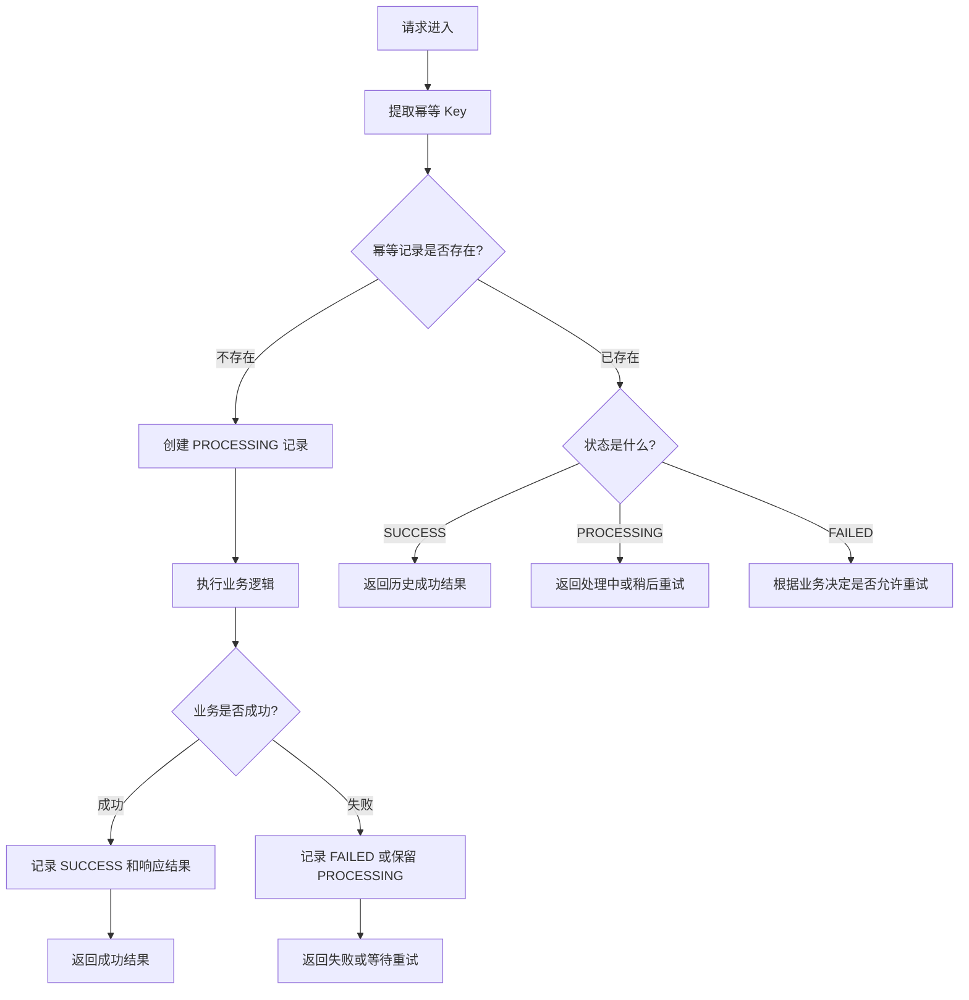
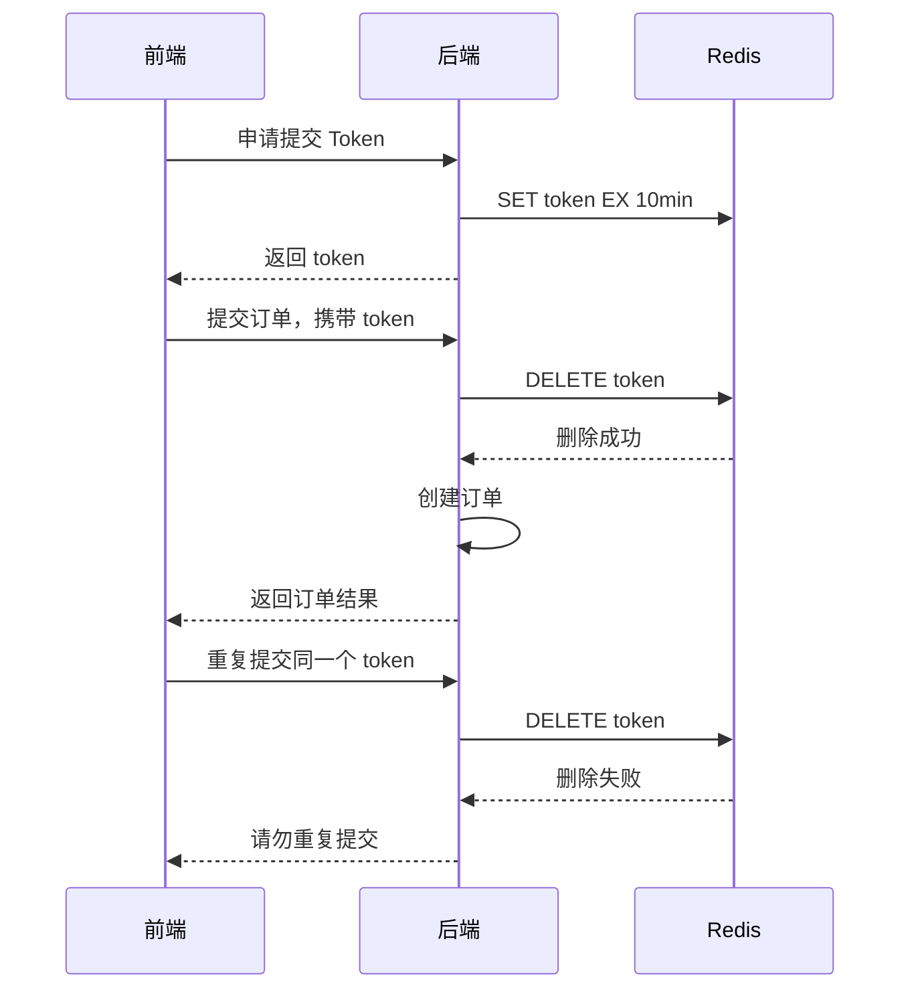
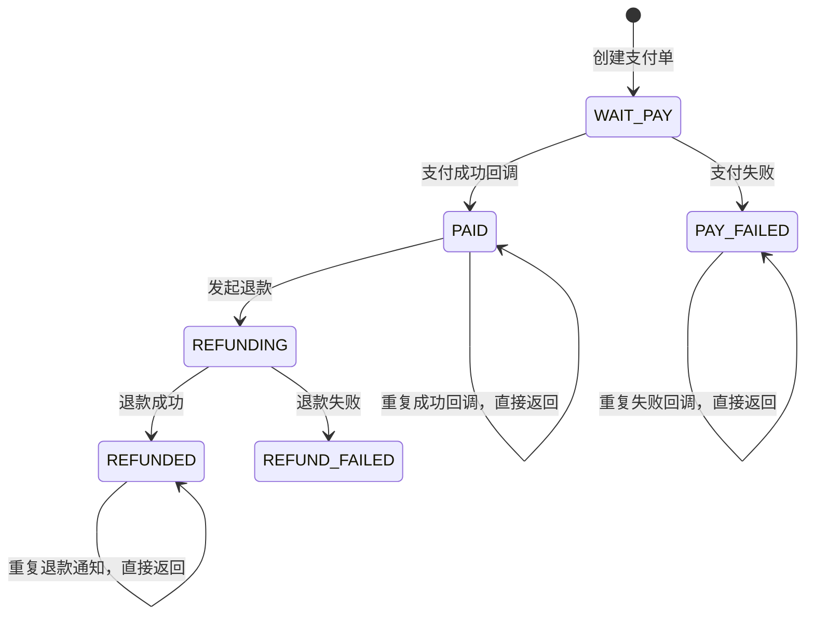
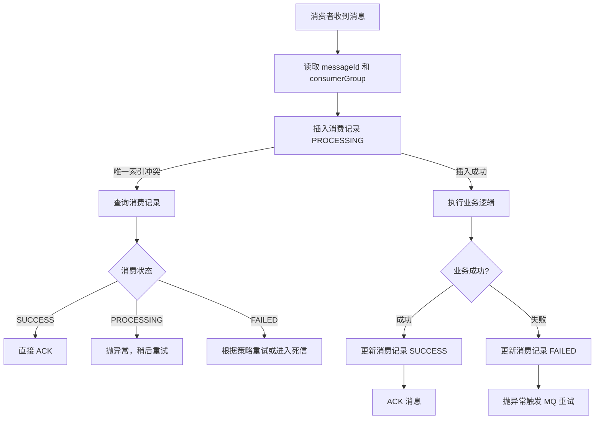
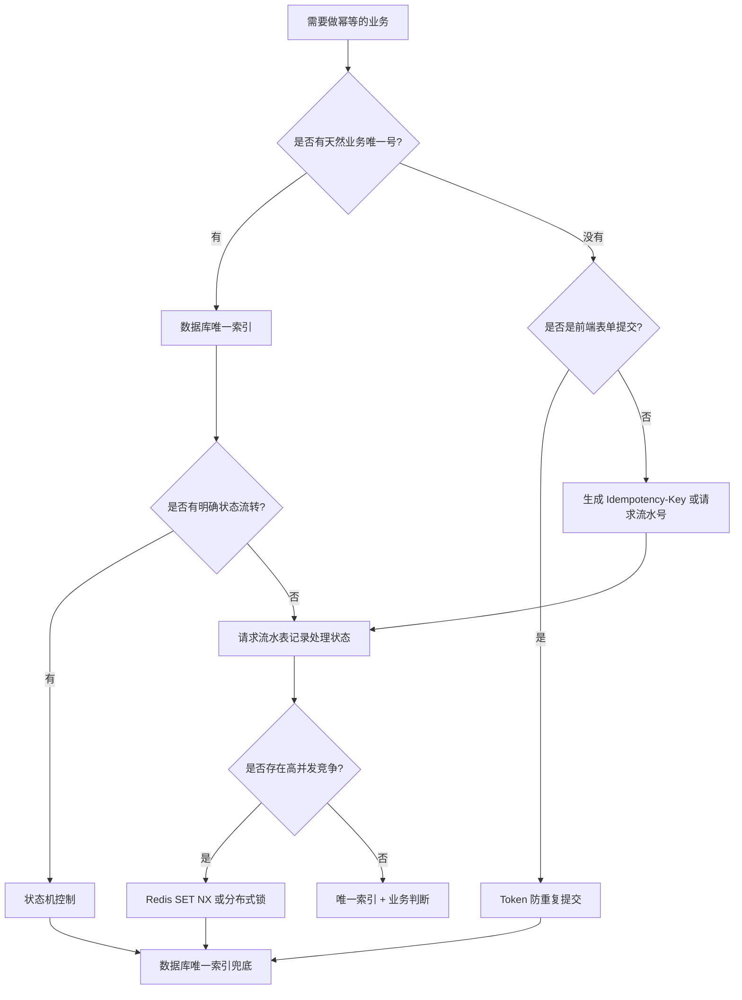

# 1. 幂等性是什么

## 1.1 一句话定义

**幂等性**指的是：

> 同一个操作被执行一次和执行多次，对系统产生的最终业务结果是一致的。

注意：  
**不是“不允许请求重复到达”**，而是**允许重复到达，但系统能识别并控制重复执行的副作用**。

例如：

```text
用户点击“提交订单”1 次：
创建订单 1 条，扣库存 1 次。

用户连续点击“提交订单”10 次：
最终仍然只能创建订单 1 条，扣库存 1 次。
```

这就是幂等。

---

## 1.2 幂等性和重复请求、重试、并发控制的关系

|概念|关注点|和幂等性的关系|
|---|---|---|
|重复请求|同一个请求被发了多次|幂等性要解决的直接问题之一|
|重试机制|失败、超时后自动再请求|重试必须依赖幂等，否则会造成重复下单、重复扣款|
|并发控制|多个线程/请求同时操作同一资源|幂等常常需要借助并发控制实现|
|分布式锁|控制同一时刻只有一个执行者|是一种实现幂等的技术手段|
|唯一索引|保证业务唯一号不能重复写入|是最可靠的幂等兜底方案之一|
|状态机|限制业务状态只能按规则流转|解决“重复执行”和“乱序执行”问题|

核心区别：

```text
重复请求：问题现象
重试机制：触发重复的常见原因
并发控制：解决同时执行的手段
幂等性：最终业务语义保证
```

---

# 2. 为什么需要幂等性

后端系统不是在理想环境中运行的。真实系统里，请求重复几乎不可避免。

常见原因：

```text
1. 用户重复点击按钮
2. 前端请求超时后自动重试
3. 网关、SDK、HTTP Client 自动重试
4. MQ 至少一次投递导致消息重复消费
5. 第三方支付平台重复回调
6. 定时任务被多实例重复调度
7. 分布式事务中部分阶段成功，补偿阶段重试
8. 网络抖动导致客户端不知道服务端是否处理成功
```

没有幂等设计，会出现典型事故：

|场景|没有幂等的后果|
|---|---|
|下单|重复生成订单、重复扣库存|
|支付回调|订单重复改状态、重复发货、重复加积分|
|退款|重复退款，直接资损|
|MQ 消费|重复发券、重复发短信、重复写数据|
|定时任务|重复结算、重复发送账单|
|接口重试|同一业务操作被执行多次|

**越是涉及钱、库存、权益、状态变更、外部通知的操作，越必须做幂等。**

---

# 3. 常见幂等场景

## 3.1 用户重复点击提交订单

```text
用户连续点击“提交订单”
    ↓
前端发起多个 createOrder 请求
    ↓
后端如果不控制
    ↓
生成多个订单，重复锁库存
```

解决方向：

```text
Token 防重复提交
业务唯一号
数据库唯一索引
Redis SET NX
状态机
```

---

## 3.2 支付回调重复通知

支付平台通常会采用“回调失败就重试”的机制。

```text
支付平台通知：订单 A 支付成功
    ↓
商户系统返回超时
    ↓
支付平台认为通知失败
    ↓
再次通知
```

商户系统必须保证：

```text
同一个支付流水号只能处理一次
订单只能从 WAIT_PAY → PAID 一次
发货、加积分、发优惠券等后续动作只能触发一次
```

---

## 3.3 MQ 消息重复投递

大多数 MQ 语义是：

```text
At Least Once：至少投递一次
```

也就是说：

> MQ 通常保证消息不会丢，但不保证不会重复。

所以消费者必须做幂等。

---

## 3.4 退款接口被多次调用

退款是资损高危场景。

```text
用户点退款
客服点退款
系统自动退款
客户端超时重试
第三方退款回调重复通知
```

必须保证：

```text
同一笔支付单，同一笔退款请求，只能成功退款一次。
```

---

## 3.5 定时任务重复执行

在分布式部署下，如果每个实例都跑同一个定时任务：

```text
App-1 执行结算任务
App-2 也执行结算任务
App-3 也执行结算任务
```

如果没有控制，就可能重复结算。

---

## 3.6 HTTP 接口超时后客户端自动重试

最典型：

```text
客户端调用创建订单接口
    ↓
服务端创建订单成功
    ↓
响应返回途中网络超时
    ↓
客户端认为失败
    ↓
客户端重试
```

服务端必须能识别：

```text
这不是新请求，而是同一个业务请求的重试。
```

---

# 4. 幂等性的核心思路

幂等的本质是四句话：

```text
1. 给每次业务操作一个唯一身份
2. 在执行前判断这个身份是否已经处理过
3. 执行过程中保证并发安全
4. 执行完成后记录结果，重复请求直接返回已有结果
```

通用模型：

```java
public interface IdempotentExecutor<T> {

    T execute(String idempotentKey, Supplier<T> businessLogic);

}
```

伪代码：

```java
public Result handle(Request request) {
    String key = request.getBizNo();

    if (alreadyProcessed(key)) {
        return getPreviousResult(key);
    }

    lock(key);

    try {
        if (alreadyProcessed(key)) {
            return getPreviousResult(key);
        }

        Result result = doBusiness(request);

        markProcessed(key, result);

        return result;
    } finally {
        unlock(key);
    }
}
```

真正落地时，关键在于：

```text
幂等 Key 怎么设计？
幂等记录存哪里？
并发下怎么防止两个请求同时通过判断？
业务执行失败时记录什么状态？
重复请求返回原结果，还是提示“处理中”？
```

---

# 5. 常见解决方案详解

## 5.1 数据库唯一索引

### 适用场景

适合天然有业务唯一号的场景：

```text
订单号 order_no
支付流水号 pay_trade_no
退款单号 refund_no
外部请求号 request_id
MQ 消息 ID message_id
```

### 表结构示例

```sql
CREATE TABLE t_order (
    id BIGINT PRIMARY KEY AUTO_INCREMENT,
    order_no VARCHAR(64) NOT NULL,
    user_id BIGINT NOT NULL,
    product_id BIGINT NOT NULL,
    amount DECIMAL(10, 2) NOT NULL,
    status VARCHAR(32) NOT NULL,
    create_time DATETIME NOT NULL,
    UNIQUE KEY uk_order_no (order_no)
);
```

### Spring Boot 示例

```java
@Service
@RequiredArgsConstructor
public class OrderService {

    private final OrderMapper orderMapper;

    @Transactional(rollbackFor = Exception.class)
    public OrderCreateResult createOrder(CreateOrderRequest request) {
        String orderNo = request.getOrderNo();

        try {
            OrderDO order = new OrderDO();
            order.setOrderNo(orderNo);
            order.setUserId(request.getUserId());
            order.setProductId(request.getProductId());
            order.setAmount(request.getAmount());
            order.setStatus("CREATED");
            order.setCreateTime(LocalDateTime.now());

            orderMapper.insert(order);

            return OrderCreateResult.success(orderNo);

        } catch (DuplicateKeyException e) {
            // 唯一索引冲突，说明这个订单号已经创建过
            OrderDO existOrder = orderMapper.selectByOrderNo(orderNo);

            return OrderCreateResult.success(existOrder.getOrderNo());
        }
    }
}
```

### 这个代码解决了什么问题？

如果用户重复点击提交订单，多个请求携带同一个 `orderNo`：

```text
第一个请求 insert 成功
后续请求 insert 触发唯一索引冲突
后端捕获 DuplicateKeyException
查询已有订单并返回
```

最终：

```text
数据库只会有一条订单记录
业务结果保持一致
```

### 优点

```text
1. 可靠，数据库唯一约束是强一致兜底
2. 实现简单
3. 非常适合资金、订单、支付流水类场景
```

### 缺点

```text
1. 需要有稳定的业务唯一号
2. 高并发下唯一索引冲突会增加数据库压力
3. 只能防重复写入，不一定能覆盖后续复杂副作用
```

### 注意事项

不要只在 Java 代码里判断：

```java
if (orderMapper.selectByOrderNo(orderNo) == null) {
    orderMapper.insert(order);
}
```

这个写法有并发漏洞。

两个线程可能同时查不到，然后都去插入。  
最终还是要靠**数据库唯一索引兜底**。

---

## 5.2 状态机控制

### 适用场景

适合有明确状态流转的业务：

```text
订单：CREATED → PAID → DELIVERED → FINISHED
退款：APPLYING → REFUNDING → REFUNDED → FAILED
支付：WAIT_PAY → PAY_SUCCESS → PAY_FAILED
```

核心思想：

> 只有当前状态符合预期，才允许更新到下一个状态。

### 表结构

```sql
CREATE TABLE t_payment_order (
    id BIGINT PRIMARY KEY AUTO_INCREMENT,
    pay_no VARCHAR(64) NOT NULL,
    order_no VARCHAR(64) NOT NULL,
    status VARCHAR(32) NOT NULL,
    paid_time DATETIME,
    UNIQUE KEY uk_pay_no (pay_no)
);
```

### Mapper

```java
@Mapper
public interface PaymentOrderMapper {

    int updatePaidByPayNo(@Param("payNo") String payNo,
                          @Param("paidTime") LocalDateTime paidTime);

    PaymentOrderDO selectByPayNo(@Param("payNo") String payNo);
}
```

对应 SQL：

```sql
UPDATE t_payment_order
SET status = 'PAID',
    paid_time = #{paidTime}
WHERE pay_no = #{payNo}
  AND status = 'WAIT_PAY';
```

### Service 示例

```java
@Service
@RequiredArgsConstructor
public class PaymentCallbackService {

    private final PaymentOrderMapper paymentOrderMapper;
    private final OrderService orderService;

    @Transactional(rollbackFor = Exception.class)
    public void handlePaymentSuccess(PaymentCallbackRequest request) {
        String payNo = request.getPayNo();

        int updated = paymentOrderMapper.updatePaidByPayNo(
                payNo,
                LocalDateTime.now()
        );

        if (updated == 0) {
            // 没有更新成功，说明：
            // 1. 订单不存在
            // 2. 状态已经不是 WAIT_PAY
            // 3. 支付回调已经处理过
            PaymentOrderDO paymentOrder = paymentOrderMapper.selectByPayNo(payNo);

            if (paymentOrder != null && "PAID".equals(paymentOrder.getStatus())) {
                // 已经支付成功，重复回调直接返回成功
                return;
            }

            throw new IllegalStateException("支付单状态异常，payNo=" + payNo);
        }

        // 只有第一次从 WAIT_PAY 更新到 PAID 的请求，才能走到这里
        orderService.markOrderPaid(request.getOrderNo());
    }
}
```

### 这个代码解决了什么问题？

支付平台重复通知时：

```text
第一次回调：
WAIT_PAY → PAID，update 返回 1，执行后续业务。

第二次回调：
WHERE status = WAIT_PAY 不成立，update 返回 0，识别为重复通知，直接返回。
```

### 优点

```text
1. 和业务语义强绑定
2. 可以防重复，也可以防乱序
3. 非常适合订单、支付、退款、审批流
```

### 缺点

```text
1. 需要清晰设计状态流转
2. 状态过多时复杂度会上升
3. 只控制状态变化，不自动覆盖所有副作用
```

---

## 5.3 Token 防重复提交

### 适用场景

适合前端表单提交类场景：

```text
提交订单
提交表单
创建工单
用户注册
发起审批
```

流程：

```text
1. 前端进入页面时，先向后端申请 token
2. 后端生成 token，存入 Redis
3. 前端提交请求时携带 token
4. 后端删除 token 成功，说明第一次提交
5. 删除失败，说明重复提交
```

### 获取 Token 接口

```java
@RestController
@RequiredArgsConstructor
@RequestMapping("/api/idempotent")
public class IdempotentTokenController {

    private final StringRedisTemplate redisTemplate;

    @GetMapping("/token")
    public String generateToken(@RequestParam Long userId) {
        String token = UUID.randomUUID().toString();
        String key = "idem:token:" + userId + ":" + token;

        redisTemplate.opsForValue().set(
                key,
                "1",
                Duration.ofMinutes(10)
        );

        return token;
    }
}
```

### 提交订单接口

```java
@RestController
@RequiredArgsConstructor
@RequestMapping("/api/orders")
public class OrderController {

    private final StringRedisTemplate redisTemplate;
    private final OrderService orderService;

    @PostMapping
    public OrderCreateResult createOrder(@RequestBody CreateOrderRequest request,
                                         @RequestHeader("Idempotency-Token") String token) {
        String key = "idem:token:" + request.getUserId() + ":" + token;

        Boolean deleted = redisTemplate.delete(key);

        if (!Boolean.TRUE.equals(deleted)) {
            throw new IllegalStateException("请勿重复提交");
        }

        return orderService.createOrder(request);
    }
}
```

### 这个代码解决了什么问题？

同一个 token 只能被删除一次。

```text
第一次提交：
Redis delete 成功，继续执行业务。

重复提交：
Redis delete 失败，直接拒绝。
```

### 优点

```text
1. 对防止用户重复点击非常有效
2. 实现简单
3. 可以在业务执行前快速拦截重复请求
```

### 缺点

```text
1. 依赖前端配合
2. token 过期时间需要合理设置
3. 如果业务执行失败，token 已被删除，用户可能需要重新获取 token
4. 不适合支付回调、MQ 消费等无前端交互场景
```

### 注意事项

Token 防重复提交不是资金类幂等的最终防线。  
提交订单可以用 Token，但订单表仍然建议加唯一索引。

---

## 5.4 Redis `SET NX EX`

### 适用场景

适合短时间内防止同一请求重复执行：

```text
HTTP 接口重试
用户重复点击
短周期定时任务
简单幂等拦截
```

`SET NX EX` 的语义：

```text
SET key value NX EX seconds

NX：key 不存在才设置
EX：设置过期时间
```

### 示例代码

```java
@Service
@RequiredArgsConstructor
public class RedisIdempotentService {

    private final StringRedisTemplate redisTemplate;

    public boolean tryAcquire(String key, Duration expire) {
        Boolean success = redisTemplate.opsForValue().setIfAbsent(
                key,
                "PROCESSING",
                expire
        );

        return Boolean.TRUE.equals(success);
    }

    public void markSuccess(String key) {
        redisTemplate.opsForValue().set(
                key,
                "SUCCESS",
                Duration.ofHours(2)
        );
    }

    public String getStatus(String key) {
        return redisTemplate.opsForValue().get(key);
    }
}
```

### 订单提交中使用

```java
@Service
@RequiredArgsConstructor
public class OrderApplicationService {

    private final RedisIdempotentService redisIdempotentService;
    private final OrderService orderService;

    public OrderCreateResult createOrder(CreateOrderRequest request) {
        String key = "idem:create_order:" + request.getUserId() + ":" + request.getRequestNo();

        boolean acquired = redisIdempotentService.tryAcquire(key, Duration.ofMinutes(5));

        if (!acquired) {
            String status = redisIdempotentService.getStatus(key);

            if ("SUCCESS".equals(status)) {
                return OrderCreateResult.repeated("订单已创建，请勿重复提交");
            }

            return OrderCreateResult.processing("请求处理中，请稍后查询结果");
        }

        try {
            OrderCreateResult result = orderService.createOrder(request);

            redisIdempotentService.markSuccess(key);

            return result;
        } catch (Exception e) {
            // 这里不能简单删除 key，否则并发重试可能立刻进来造成重复执行
            // 可以设置短过期，让调用方稍后重试
            throw e;
        }
    }
}
```

### 这个代码解决了什么问题？

```text
第一个请求 SET NX 成功，执行业务
第二个请求 SET NX 失败，发现正在处理或已成功，直接返回
```

### 优点

```text
1. 性能高
2. 可以快速挡住重复请求
3. 适合高并发接口的前置防重
```

### 缺点

```text
1. Redis 不是最终业务事实源
2. Redis key 过期后，重复请求可能重新进入
3. 业务成功但 Redis 标记失败时，状态可能不一致
```

### 注意事项

Redis 幂等通常应该和数据库唯一索引组合使用：

```text
Redis：挡流量
数据库唯一索引：做最终兜底
```

---

## 5.5 分布式锁

### 适用场景

适合控制同一资源同一时刻只能被一个线程/实例处理：

```text
同一订单支付处理
同一退款单处理
同一定时任务执行
同一库存扣减
```

### Redisson 示例

```java
@Service
@RequiredArgsConstructor
public class RefundService {

    private final RedissonClient redissonClient;
    private final RefundMapper refundMapper;
    private final ThirdPartyPayClient thirdPartyPayClient;

    @Transactional(rollbackFor = Exception.class)
    public RefundResult refund(RefundRequest request) {
        String lockKey = "lock:refund:" + request.getRefundNo();

        RLock lock = redissonClient.getLock(lockKey);

        boolean locked = false;

        try {
            locked = lock.tryLock(3, 30, TimeUnit.SECONDS);

            if (!locked) {
                throw new IllegalStateException("退款正在处理中，请勿重复提交");
            }

            RefundDO refund = refundMapper.selectByRefundNo(request.getRefundNo());

            if (refund != null && "SUCCESS".equals(refund.getStatus())) {
                return RefundResult.success(refund.getRefundNo());
            }

            if (refund == null) {
                refund = new RefundDO();
                refund.setRefundNo(request.getRefundNo());
                refund.setOrderNo(request.getOrderNo());
                refund.setAmount(request.getAmount());
                refund.setStatus("PROCESSING");
                refundMapper.insert(refund);
            }

            ThirdPartyRefundResult thirdResult = thirdPartyPayClient.refund(
                    request.getRefundNo(),
                    request.getAmount()
            );

            if (thirdResult.isSuccess()) {
                refundMapper.updateStatus(request.getRefundNo(), "SUCCESS");
                return RefundResult.success(request.getRefundNo());
            }

            refundMapper.updateStatus(request.getRefundNo(), "FAILED");
            return RefundResult.failed(request.getRefundNo());

        } catch (InterruptedException e) {
            Thread.currentThread().interrupt();
            throw new RuntimeException("获取退款锁失败", e);
        } finally {
            if (locked && lock.isHeldByCurrentThread()) {
                lock.unlock();
            }
        }
    }
}
```

### 这个代码解决了什么问题？

多个线程同时处理同一退款单：

```text
只有一个线程拿到锁
其他线程被拒绝或等待
拿到锁的线程检查退款状态
如果已成功，直接返回
否则执行退款
```

### 优点

```text
1. 可以控制并发进入
2. 对复杂业务逻辑比较直观
3. 适合同一资源粒度的串行化处理
```

### 缺点

```text
1. 锁超时时间不好设置
2. 业务执行时间过长可能导致锁续期问题
3. 分布式锁不是业务幂等的最终兜底
4. 锁释放、异常中断、网络分区都要考虑
```

### 注意事项

不要把分布式锁当成唯一幂等方案。  
更稳的组合是：

```text
分布式锁 + 状态机 + 唯一索引
```

---

## 5.6 去重表 / 请求流水表

### 适用场景

适合需要完整记录请求处理状态的场景：

```text
外部接口幂等
支付回调
退款申请
MQ 消费
分布式事务阶段记录
```

### 表结构

```sql
CREATE TABLE t_idempotent_record (
    id BIGINT PRIMARY KEY AUTO_INCREMENT,
    idem_key VARCHAR(128) NOT NULL,
    biz_type VARCHAR(64) NOT NULL,
    status VARCHAR(32) NOT NULL,
    response_body TEXT,
    error_message TEXT,
    create_time DATETIME NOT NULL,
    update_time DATETIME NOT NULL,
    UNIQUE KEY uk_idem_key_biz_type (idem_key, biz_type)
);
```

状态建议：

```text
PROCESSING：处理中
SUCCESS：处理成功
FAILED：处理失败
```

### IdempotentRecordMapper

```java
@Mapper
public interface IdempotentRecordMapper {

    int insertProcessing(@Param("idemKey") String idemKey,
                         @Param("bizType") String bizType,
                         @Param("now") LocalDateTime now);

    IdempotentRecordDO selectByKey(@Param("idemKey") String idemKey,
                                   @Param("bizType") String bizType);

    int updateSuccess(@Param("idemKey") String idemKey,
                      @Param("bizType") String bizType,
                      @Param("responseBody") String responseBody,
                      @Param("now") LocalDateTime now);

    int updateFailed(@Param("idemKey") String idemKey,
                     @Param("bizType") String bizType,
                     @Param("errorMessage") String errorMessage,
                     @Param("now") LocalDateTime now);
}
```

对应 SQL 核心：

```sql
INSERT INTO t_idempotent_record (
    idem_key, biz_type, status, create_time, update_time
) VALUES (
    #{idemKey}, #{bizType}, 'PROCESSING', #{now}, #{now}
);
```

### 通用幂等执行器

```java
@Service
@RequiredArgsConstructor
public class IdempotentExecutor {

    private final IdempotentRecordMapper recordMapper;
    private final ObjectMapper objectMapper;

    @Transactional(rollbackFor = Exception.class)
    public <T> T execute(String idemKey,
                         String bizType,
                         Class<T> responseType,
                         Supplier<T> supplier) {
        LocalDateTime now = LocalDateTime.now();

        try {
            recordMapper.insertProcessing(idemKey, bizType, now);
        } catch (DuplicateKeyException e) {
            IdempotentRecordDO record = recordMapper.selectByKey(idemKey, bizType);

            if ("SUCCESS".equals(record.getStatus())) {
                return readResponse(record.getResponseBody(), responseType);
            }

            if ("PROCESSING".equals(record.getStatus())) {
                throw new IllegalStateException("请求正在处理中，请稍后重试");
            }

            if ("FAILED".equals(record.getStatus())) {
                throw new IllegalStateException("请求曾处理失败，请确认后重试");
            }

            throw new IllegalStateException("未知幂等状态：" + record.getStatus());
        }

        try {
            T result = supplier.get();

            String responseBody = writeResponse(result);

            recordMapper.updateSuccess(idemKey, bizType, responseBody, LocalDateTime.now());

            return result;

        } catch (Exception e) {
            recordMapper.updateFailed(idemKey, bizType, e.getMessage(), LocalDateTime.now());
            throw e;
        }
    }

    private <T> T readResponse(String responseBody, Class<T> responseType) {
        try {
            return objectMapper.readValue(responseBody, responseType);
        } catch (Exception e) {
            throw new RuntimeException("反序列化幂等响应失败", e);
        }
    }

    private String writeResponse(Object result) {
        try {
            return objectMapper.writeValueAsString(result);
        } catch (Exception e) {
            throw new RuntimeException("序列化幂等响应失败", e);
        }
    }
}
```

### 使用示例：创建订单

```java
@Service
@RequiredArgsConstructor
public class OrderFacade {

    private final IdempotentExecutor idempotentExecutor;
    private final OrderService orderService;

    public OrderCreateResult createOrder(CreateOrderRequest request) {
        String idemKey = request.getRequestNo();

        return idempotentExecutor.execute(
                idemKey,
                "CREATE_ORDER",
                OrderCreateResult.class,
                () -> orderService.createOrder(request)
        );
    }
}
```

### 这个代码解决了什么问题？

```text
第一次请求：
插入 PROCESSING 成功，执行业务，记录 SUCCESS 和响应。

重复请求：
插入 PROCESSING 失败，查询已有记录。
如果 SUCCESS，直接返回第一次的响应。
如果 PROCESSING，提示处理中。
```

### 优点

```text
1. 可审计
2. 能记录处理结果
3. 能统一封装幂等逻辑
4. 适合外部请求、支付回调、MQ 消费
```

### 缺点

```text
1. 实现比唯一索引复杂
2. 需要设计状态恢复策略
3. 表数据量可能很大，需要归档清理
```

---

## 5.7 MQ 消息消费幂等

### 适用场景

所有重要 MQ 消费逻辑都应该考虑幂等：

```text
订单支付成功消息
发券消息
积分变更消息
库存扣减消息
短信通知消息
搜索索引同步消息
```

### 消息消费记录表

```sql
CREATE TABLE t_mq_consume_record (
    id BIGINT PRIMARY KEY AUTO_INCREMENT,
    message_id VARCHAR(128) NOT NULL,
    consumer_group VARCHAR(64) NOT NULL,
    status VARCHAR(32) NOT NULL,
    create_time DATETIME NOT NULL,
    update_time DATETIME NOT NULL,
    UNIQUE KEY uk_msg_group (message_id, consumer_group)
);
```

### 消费者代码

```java
@Component
@RequiredArgsConstructor
public class OrderPaidConsumer {

    private final MqConsumeRecordMapper consumeRecordMapper;
    private final CouponService couponService;

    @RabbitListener(queues = "order.paid.coupon.queue")
    @Transactional(rollbackFor = Exception.class)
    public void onMessage(OrderPaidMessage message) {
        String messageId = message.getMessageId();
        String consumerGroup = "coupon-service";

        try {
            consumeRecordMapper.insertProcessing(
                    messageId,
                    consumerGroup,
                    LocalDateTime.now()
            );
        } catch (DuplicateKeyException e) {
            MqConsumeRecordDO record = consumeRecordMapper.selectByMessageIdAndGroup(
                    messageId,
                    consumerGroup
            );

            if ("SUCCESS".equals(record.getStatus())) {
                // 消息已经成功消费过，直接 ack
                return;
            }

            if ("PROCESSING".equals(record.getStatus())) {
                // 可能前一次消费还在执行，抛异常让 MQ 稍后重试
                throw new IllegalStateException("消息正在处理中，messageId=" + messageId);
            }

            if ("FAILED".equals(record.getStatus())) {
                // 根据业务决定是否允许重试
                throw new IllegalStateException("消息曾消费失败，等待重试，messageId=" + messageId);
            }
        }

        try {
            // 真正的业务逻辑：给用户发优惠券
            couponService.issueCoupon(
                    message.getUserId(),
                    message.getCouponTemplateId(),
                    message.getOrderNo()
            );

            consumeRecordMapper.updateStatus(
                    messageId,
                    consumerGroup,
                    "SUCCESS",
                    LocalDateTime.now()
            );

        } catch (Exception e) {
            consumeRecordMapper.updateStatus(
                    messageId,
                    consumerGroup,
                    "FAILED",
                    LocalDateTime.now()
            );

            // 抛出异常，让 MQ 根据配置进行重试或进入死信队列
            throw e;
        }
    }
}
```

### 这个代码解决了什么问题？

MQ 重复投递同一条消息：

```text
第一次消费：
插入消费记录成功，执行业务，标记 SUCCESS。

第二次消费：
唯一索引冲突，查询发现已 SUCCESS，直接返回。
```

### 更稳的业务侧兜底

发券本身也应该做唯一约束：

```sql
CREATE TABLE t_user_coupon (
    id BIGINT PRIMARY KEY AUTO_INCREMENT,
    user_id BIGINT NOT NULL,
    coupon_template_id BIGINT NOT NULL,
    source_order_no VARCHAR(64) NOT NULL,
    create_time DATETIME NOT NULL,
    UNIQUE KEY uk_user_coupon_order (
        user_id,
        coupon_template_id,
        source_order_no
    )
);
```

这样即使消费记录失效，业务表也不会重复发券。

---

## 5.8 乐观锁版本号

### 适用场景

适合资源更新类场景：

```text
扣库存
账户余额更新
订单状态更新
配置修改
秒杀库存
```

核心思想：

```text
更新时带上 version
只有 version 没变，才允许更新
```

### 表结构

```sql
CREATE TABLE t_product_stock (
    id BIGINT PRIMARY KEY AUTO_INCREMENT,
    product_id BIGINT NOT NULL,
    stock INT NOT NULL,
    version INT NOT NULL,
    UNIQUE KEY uk_product_id (product_id)
);
```

### Mapper

```java
@Mapper
public interface ProductStockMapper {

    ProductStockDO selectByProductId(@Param("productId") Long productId);

    int deductStock(@Param("productId") Long productId,
                    @Param("version") Integer version);
}
```

SQL：

```sql
UPDATE t_product_stock
SET stock = stock - 1,
    version = version + 1
WHERE product_id = #{productId}
  AND stock > 0
  AND version = #{version};
```

### Service

```java
@Service
@RequiredArgsConstructor
public class StockService {

    private final ProductStockMapper productStockMapper;

    public void deductStock(Long productId) {
        ProductStockDO stock = productStockMapper.selectByProductId(productId);

        if (stock == null) {
            throw new IllegalArgumentException("商品库存不存在");
        }

        int updated = productStockMapper.deductStock(
                productId,
                stock.getVersion()
        );

        if (updated == 0) {
            throw new IllegalStateException("库存扣减失败，请重试");
        }
    }
}
```

### 这个代码解决了什么问题？

多个请求同时扣库存：

```text
线程 A 查到 version = 1
线程 B 也查到 version = 1

线程 A 更新成功，version 变成 2
线程 B 更新时 version = 1 条件不成立，更新失败
```

### 优点

```text
1. 无锁，性能较好
2. 适合读多写少的并发更新
3. 能防止并发覆盖
```

### 缺点

```text
1. 冲突严重时重试成本高
2. 不直接解决重复请求，需要结合业务唯一号
3. 只保证单条记录更新安全
```

### 注意

乐观锁不是完整幂等方案。  
它主要解决：

```text
并发修改冲突
```

而不是：

```text
同一请求重复执行
```

所以通常要配合：

```text
业务请求号 + 唯一索引 + 乐观锁
```

---

## 5.9 业务唯一号

### 适用场景

这是幂等设计的基础。

常见业务唯一号：

|场景|幂等 Key|
|---|---|
|创建订单|requestNo / orderNo|
|支付|payNo / thirdTradeNo|
|退款|refundNo|
|MQ 消费|messageId|
|外部接口|Idempotency-Key|
|定时任务|taskName + bizDate|
|分布式事务|xid + branchId|

### HTTP Header 设计

```http
POST /api/orders
Idempotency-Key: 20260512-user1001-create-order-000001
Content-Type: application/json
```

后端获取：

```java
@PostMapping("/orders")
public OrderCreateResult createOrder(@RequestHeader("Idempotency-Key") String idempotencyKey,
                                     @RequestBody CreateOrderRequest request) {
    request.setRequestNo(idempotencyKey);
    return orderFacade.createOrder(request);
}
```

### 业务唯一号设计原则

```text
1. 必须由调用方或服务端明确生成
2. 同一次业务重试必须使用同一个 key
3. 不同业务操作不能共用同一个 key
4. key 中可以包含业务类型、用户、时间、随机串
5. 服务端不能只依赖时间戳，因为时间戳不保证唯一
```

推荐格式：

```text
业务类型 + 用户ID + 客户端请求ID
CREATE_ORDER:user_1001:uuid
REFUND:pay_202605120001:refund_001
MQ:coupon-service:messageId
TASK:daily-settle:2026-05-12
```

---

# 6. 真实业务代码案例

## 6.1 用户重复点击提交订单

### 问题

```text
用户连续点 3 次提交订单
前端发出 3 个请求
如果后端每次都 insert order + deduct stock
就会生成 3 个订单
```

### 推荐方案

```text
Token 防重复提交 + 订单号唯一索引 + 库存扣减乐观锁
```

### 代码

```java
@Service
@RequiredArgsConstructor
public class SubmitOrderService {

    private final StringRedisTemplate redisTemplate;
    private final OrderMapper orderMapper;
    private final StockService stockService;

    @Transactional(rollbackFor = Exception.class)
    public OrderCreateResult submit(SubmitOrderRequest request) {
        // 1. 校验 token，防止用户重复点击
        String tokenKey = "idem:submit_order:" + request.getUserId() + ":" + request.getToken();

        Boolean deleted = redisTemplate.delete(tokenKey);

        if (!Boolean.TRUE.equals(deleted)) {
            throw new IllegalStateException("订单正在提交，请勿重复点击");
        }

        // 2. 使用业务订单号做数据库唯一索引兜底
        try {
            OrderDO order = new OrderDO();
            order.setOrderNo(request.getOrderNo());
            order.setUserId(request.getUserId());
            order.setProductId(request.getProductId());
            order.setStatus("CREATED");
            order.setCreateTime(LocalDateTime.now());

            orderMapper.insert(order);

        } catch (DuplicateKeyException e) {
            OrderDO exist = orderMapper.selectByOrderNo(request.getOrderNo());
            return OrderCreateResult.success(exist.getOrderNo());
        }

        // 3. 扣库存，使用乐观锁或原子 SQL
        stockService.deductStock(request.getProductId());

        return OrderCreateResult.success(request.getOrderNo());
    }
}
```

### 关键点

```text
Token：挡住前端重复点击
唯一索引：保证订单不会重复创建
库存扣减：用乐观锁或 stock > 0 原子更新保证并发安全
```

---

## 6.2 支付回调重复通知

### 问题

支付平台可能重复通知：

```text
notify 1：成功
notify 2：重复
notify 3：重复
```

### 推荐方案

```text
支付流水号唯一索引 + 状态机 update + 回调流水表
```

### 代码

```java
@Service
@RequiredArgsConstructor
public class PayNotifyService {

    private final PaymentOrderMapper paymentOrderMapper;
    private final PayNotifyRecordMapper payNotifyRecordMapper;
    private final OrderMapper orderMapper;

    @Transactional(rollbackFor = Exception.class)
    public void handleNotify(PayNotifyRequest request) {
        String notifyId = request.getNotifyId();
        String payNo = request.getPayNo();

        // 1. 记录第三方通知流水，防止同一个 notifyId 反复处理
        try {
            payNotifyRecordMapper.insert(notifyId, payNo, LocalDateTime.now());
        } catch (DuplicateKeyException e) {
            // 同一个通知已经处理过，直接返回成功给支付平台
            return;
        }

        // 2. 状态机控制：只有 WAIT_PAY 才能变成 PAID
        int updated = paymentOrderMapper.markPaid(
                payNo,
                request.getThirdTradeNo(),
                LocalDateTime.now()
        );

        if (updated == 0) {
            PaymentOrderDO paymentOrder = paymentOrderMapper.selectByPayNo(payNo);

            if (paymentOrder != null && "PAID".equals(paymentOrder.getStatus())) {
                return;
            }

            throw new IllegalStateException("支付单状态异常，payNo=" + payNo);
        }

        // 3. 更新业务订单状态
        orderMapper.markPaidByOrderNo(request.getOrderNo(), LocalDateTime.now());

        // 4. 后续动作建议发 MQ，而不是在回调事务里做太重逻辑
        // 比如：发货、积分、优惠券、站内信
    }
}
```

`markPaid` SQL：

```sql
UPDATE t_payment_order
SET status = 'PAID',
    third_trade_no = #{thirdTradeNo},
    paid_time = #{paidTime}
WHERE pay_no = #{payNo}
  AND status = 'WAIT_PAY';
```

### 关键点

```text
notifyId 防重复通知
payNo 防重复支付单
status = WAIT_PAY 防重复状态流转
```

---

## 6.3 MQ 消息重复投递

### 问题

```text
消费者处理成功了
但是 ack 失败
MQ 重新投递
消费者又处理一次
```

### 推荐方案

```text
messageId + consumerGroup 唯一索引
业务表唯一索引兜底
```

### 代码

```java
@Component
@RequiredArgsConstructor
public class PointsConsumer {

    private final MqConsumeRecordMapper recordMapper;
    private final PointsAccountMapper pointsAccountMapper;

    @RabbitListener(queues = "order.paid.points.queue")
    @Transactional(rollbackFor = Exception.class)
    public void consume(OrderPaidMessage message) {
        String messageId = message.getMessageId();
        String group = "points-service";

        try {
            recordMapper.insertProcessing(messageId, group, LocalDateTime.now());
        } catch (DuplicateKeyException e) {
            MqConsumeRecordDO record = recordMapper.select(messageId, group);

            if ("SUCCESS".equals(record.getStatus())) {
                return;
            }

            throw new IllegalStateException("消息重复投递但尚未成功，等待重试");
        }

        try {
            // 积分增加也应该有业务唯一约束，比如 orderNo + pointsType
            pointsAccountMapper.addPoints(
                    message.getUserId(),
                    message.getOrderNo(),
                    message.getPoints()
            );

            recordMapper.updateSuccess(messageId, group, LocalDateTime.now());

        } catch (Exception e) {
            recordMapper.updateFailed(messageId, group, e.getMessage(), LocalDateTime.now());
            throw e;
        }
    }
}
```

积分流水表建议：

```sql
CREATE TABLE t_points_record (
    id BIGINT PRIMARY KEY AUTO_INCREMENT,
    user_id BIGINT NOT NULL,
    order_no VARCHAR(64) NOT NULL,
    points INT NOT NULL,
    type VARCHAR(32) NOT NULL,
    create_time DATETIME NOT NULL,
    UNIQUE KEY uk_order_points_type (order_no, type)
);
```

### 关键点

```text
MQ 消费记录：防止同一消息重复消费
积分流水唯一索引：防止重复加积分
```

---

## 6.4 退款接口被多次调用

### 问题

退款接口可能被重复调用：

```text
客户端超时重试
客服重复点击
系统补偿任务重复发起
```

### 推荐方案

```text
refundNo 唯一索引 + 退款状态机 + 第三方退款请求号
```

### 代码

```java
@Service
@RequiredArgsConstructor
public class RefundApplicationService {

    private final RefundMapper refundMapper;
    private final ThirdPartyPayClient thirdPartyPayClient;

    @Transactional(rollbackFor = Exception.class)
    public RefundResult applyRefund(RefundRequest request) {
        String refundNo = request.getRefundNo();

        RefundDO refund;

        try {
            refund = new RefundDO();
            refund.setRefundNo(refundNo);
            refund.setOrderNo(request.getOrderNo());
            refund.setPayNo(request.getPayNo());
            refund.setAmount(request.getAmount());
            refund.setStatus("APPLYING");
            refund.setCreateTime(LocalDateTime.now());

            refundMapper.insert(refund);

        } catch (DuplicateKeyException e) {
            refund = refundMapper.selectByRefundNo(refundNo);

            if ("SUCCESS".equals(refund.getStatus())) {
                return RefundResult.success(refundNo);
            }

            if ("PROCESSING".equals(refund.getStatus()) || "APPLYING".equals(refund.getStatus())) {
                return RefundResult.processing(refundNo);
            }

            if ("FAILED".equals(refund.getStatus())) {
                return RefundResult.failed(refundNo);
            }

            throw new IllegalStateException("退款状态异常：" + refund.getStatus());
        }

        // 只有第一次插入退款单成功的请求会走到这里
        refundMapper.updateStatus(refundNo, "PROCESSING");

        ThirdPartyRefundResult result = thirdPartyPayClient.refund(
                refundNo,
                request.getPayNo(),
                request.getAmount()
        );

        if (result.isSuccess()) {
            refundMapper.updateStatus(refundNo, "SUCCESS");
            return RefundResult.success(refundNo);
        }

        refundMapper.updateStatus(refundNo, "FAILED");
        return RefundResult.failed(refundNo);
    }
}
```

### 关键点

```text
refundNo 是退款幂等的核心
第三方退款接口也必须传同一个 refundNo
本地退款状态要能表达 APPLYING / PROCESSING / SUCCESS / FAILED
```

---

## 6.5 定时任务重复执行

### 问题

多实例部署时：

```text
order-service-1 执行每日结算
order-service-2 也执行每日结算
```

### 推荐方案

```text
任务执行表唯一索引 + 分布式锁
```

### 表结构

```sql
CREATE TABLE t_task_execute_record (
    id BIGINT PRIMARY KEY AUTO_INCREMENT,
    task_name VARCHAR(64) NOT NULL,
    biz_date DATE NOT NULL,
    status VARCHAR(32) NOT NULL,
    create_time DATETIME NOT NULL,
    update_time DATETIME NOT NULL,
    UNIQUE KEY uk_task_biz_date (task_name, biz_date)
);
```

### 代码

```java
@Component
@RequiredArgsConstructor
public class DailySettleJob {

    private final RedissonClient redissonClient;
    private final TaskExecuteRecordMapper taskRecordMapper;
    private final SettleService settleService;

    @Scheduled(cron = "0 0 2 * * ?")
    public void execute() {
        LocalDate bizDate = LocalDate.now().minusDays(1);
        String taskName = "DAILY_SETTLE";
        String lockKey = "lock:task:" + taskName + ":" + bizDate;

        RLock lock = redissonClient.getLock(lockKey);

        boolean locked = false;

        try {
            locked = lock.tryLock(0, 30, TimeUnit.MINUTES);

            if (!locked) {
                return;
            }

            try {
                taskRecordMapper.insertProcessing(taskName, bizDate, LocalDateTime.now());
            } catch (DuplicateKeyException e) {
                TaskExecuteRecordDO record = taskRecordMapper.select(taskName, bizDate);

                if ("SUCCESS".equals(record.getStatus())) {
                    return;
                }

                if ("PROCESSING".equals(record.getStatus())) {
                    return;
                }
            }

            settleService.settle(bizDate);

            taskRecordMapper.updateStatus(taskName, bizDate, "SUCCESS", LocalDateTime.now());

        } catch (Exception e) {
            taskRecordMapper.updateStatus(taskName, bizDate, "FAILED", LocalDateTime.now());
            throw new RuntimeException(e);
        } finally {
            if (locked && lock.isHeldByCurrentThread()) {
                lock.unlock();
            }
        }
    }
}
```

### 关键点

```text
分布式锁：减少多实例并发执行
任务记录表：保证同一天任务只成功一次
```

---

## 6.6 HTTP 接口超时后客户端自动重试

### 问题

```text
客户端请求创建订单
服务端创建成功
响应超时
客户端重试
```

如果每次重试都当成新请求，就会重复创建。

### 推荐方案

```text
Idempotency-Key + 请求流水表 + 返回第一次结果
```

### Controller

```java
@RestController
@RequiredArgsConstructor
@RequestMapping("/api/payments")
public class PaymentController {

    private final PaymentFacade paymentFacade;

    @PostMapping
    public PaymentCreateResult createPayment(@RequestHeader("Idempotency-Key") String idempotencyKey,
                                             @RequestBody PaymentCreateRequest request) {
        request.setRequestNo(idempotencyKey);
        return paymentFacade.createPayment(request);
    }
}
```

### Facade

```java
@Service
@RequiredArgsConstructor
public class PaymentFacade {

    private final IdempotentExecutor idempotentExecutor;
    private final PaymentService paymentService;

    public PaymentCreateResult createPayment(PaymentCreateRequest request) {
        return idempotentExecutor.execute(
                request.getRequestNo(),
                "CREATE_PAYMENT",
                PaymentCreateResult.class,
                () -> paymentService.createPayment(request)
        );
    }
}
```

### 效果

```text
第一次请求成功但响应丢失：
服务端记录 SUCCESS + responseBody。

客户端重试：
服务端识别同一个 Idempotency-Key。
直接返回第一次结果。
```

---

# 7. Mermaid 流程图

## 7.1 幂等处理整体流程图



---

## 7.2 Token 防重复提交流程图



---

## 7.3 支付回调幂等状态流转图



---

## 7.4 MQ 消费幂等流程图



---

## 7.5 幂等方案选型图



---

# 8. 方案选型建议

## 8.1 按场景选

|场景|推荐方案|
|---|---|
|用户重复点击提交订单|Token + orderNo 唯一索引 + 库存原子扣减|
|支付回调重复通知|notifyId 去重 + payNo 唯一索引 + 状态机|
|MQ 消息重复投递|messageId + consumerGroup 去重表 + 业务唯一约束|
|退款接口重复调用|refundNo 唯一索引 + 退款状态机 + 第三方幂等号|
|定时任务重复执行|分布式锁 + taskName/bizDate 唯一记录|
|HTTP 超时自动重试|Idempotency-Key + 请求流水表 + 返回历史结果|
|扣库存|原子 SQL / 乐观锁 / Redis 预扣库存|
|分布式事务补偿|事务分支流水表 + 状态机 + 重试幂等|

---

## 8.2 按强度选

|方案|幂等强度|说明|
|---|--:|---|
|前端按钮置灰|弱|只能优化体验，不能作为后端保证|
|Token 防重复提交|中|适合表单提交，不能覆盖所有重复来源|
|Redis SET NX|中|性能好，但不是最终事实源|
|分布式锁|中|控制并发，不等于完整幂等|
|状态机|强|适合有业务状态的核心流程|
|数据库唯一索引|强|最可靠的兜底之一|
|去重表 / 请求流水表|强|适合复杂幂等和审计|
|业务唯一号|基础能力|没有它，很多幂等都不好做|

---

## 8.3 生产推荐组合

### 创建订单

```text
前端 Token
+ requestNo
+ orderNo 唯一索引
+ 库存原子扣减
```

### 支付回调

```text
notifyId 去重表
+ payNo 唯一索引
+ status = WAIT_PAY 条件更新
+ 后续业务通过 MQ 解耦
```

### MQ 消费

```text
messageId + consumerGroup 消费记录
+ 业务表唯一索引兜底
+ 失败重试 + 死信队列
```

### 退款

```text
refundNo 唯一索引
+ refund status 状态机
+ 调第三方退款时也传 refundNo
+ 退款回调同样幂等
```

### 定时任务

```text
分布式锁
+ taskName + bizDate 唯一索引
+ 任务状态记录
+ 失败可重跑
```

---

# 9. 常见坑与最佳实践

## 9.1 只靠前端防重复点击是不够的

错误认知：

```text
按钮置灰了，就不会重复提交。
```

真实情况：

```text
用户可以刷新
浏览器可以重发
网关可以重试
客户端可以绕过前端
接口可以被脚本调用
```

前端只能改善体验，不能提供后端正确性保证。

---

## 9.2 先查再插不是安全的

错误代码：

```java
OrderDO order = orderMapper.selectByOrderNo(orderNo);

if (order == null) {
    orderMapper.insert(newOrder);
}
```

并发下：

```text
线程 A 查不到
线程 B 查不到
线程 A 插入
线程 B 插入
```

正确做法：

```text
唯一索引 + 捕获 DuplicateKeyException
```

---

## 9.3 Redis 幂等 Key 过期时间不能乱设

过短：

```text
业务还没执行完，key 已过期，重复请求进来
```

过长：

```text
失败请求长期占住 key，用户无法重试
```

建议：

```text
PROCESSING：短过期，例如 5~30 分钟
SUCCESS：长一点，例如 2 小时、1 天，视业务而定
FAILED：根据业务决定是否允许重试
```

---

## 9.4 分布式锁不是万能的

分布式锁只能保证：

```text
同一时刻尽量只有一个执行者
```

不能天然保证：

```text
业务只成功一次
历史请求能返回同一个结果
锁过期后不会重复执行
外部系统不会被重复调用
```

所以核心业务不能只靠锁。

---

## 9.5 幂等状态必须设计清楚

推荐状态：

```text
PROCESSING：正在处理
SUCCESS：已成功
FAILED：已失败
```

重复请求处理策略：

|状态|重复请求应该怎么处理|
|---|---|
|PROCESSING|返回处理中，或让客户端稍后查询|
|SUCCESS|返回第一次成功结果|
|FAILED|根据业务决定是否允许重试|
|UNKNOWN|不要盲目重试，需要人工排查或补偿|

---

## 9.6 外部接口调用要传自己的幂等号

例如退款：

```java
thirdPartyPayClient.refund(refundNo, payNo, amount);
```

不能每次重试都生成新的退款号。

错误：

```java
String refundRequestNo = UUID.randomUUID().toString();
thirdPartyPayClient.refund(refundRequestNo, payNo, amount);
```

这样每次重试对第三方来说都是新退款请求，可能造成重复退款。

---

## 9.7 MQ 幂等不能只依赖 messageId

有些 MQ 的 messageId 可能由 Broker 生成，不一定满足业务幂等需求。

更稳的是消息体中带业务唯一号：

```java
public class OrderPaidMessage {
    private String messageId;
    private String orderNo;
    private String payNo;
    private Long userId;
}
```

消费者幂等 Key 可以设计为：

```text
consumerGroup + payNo + bizAction
```

例如：

```text
coupon-service:PAY_SUCCESS:pay_202605120001
points-service:PAY_SUCCESS:pay_202605120001
```

---

## 9.8 事务边界要小心

如果你在一个事务中：

```text
1. 插入幂等记录 PROCESSING
2. 执行业务
3. 更新幂等记录 SUCCESS
```

如果业务中间调用了外部系统，例如支付、短信、物流，就有风险：

```text
本地事务回滚了
但外部系统已经成功了
```

建议：

```text
本地数据库状态变更放事务内
外部调用尽量异步化
外部调用本身也要幂等
必要时使用 Outbox / 事务消息 / 补偿任务
```

---

## 9.9 幂等不等于接口无副作用

例如这个接口天然幂等：

```http
PUT /users/1/status
{
  "status": "DISABLED"
}
```

重复执行多次，最终都是 `DISABLED`。

但这个接口通常不幂等：

```http
POST /accounts/1/add-balance
{
  "amount": 100
}
```

调用一次加 100，调用两次加 200。  
如果要让它幂等，必须加业务流水号：

```http
POST /accounts/1/add-balance
Idempotency-Key: recharge_202605120001
```

---

# 10. 总结

## 10.1 幂等性的本质

幂等性不是一个注解，也不是一个 Redis 命令，而是一套业务正确性设计：

```text
同一个业务操作，无论请求到达几次，最终只能产生一次有效业务结果。
```

---

## 10.2 后端开发必须记住的核心公式

```text
幂等 Key
+ 唯一约束
+ 状态判断
+ 并发控制
+ 结果记录
= 可靠幂等
```

---

## 10.3 最常用的工程组合

```text
轻量接口：
Redis SET NX EX

表单提交：
Token + 唯一索引

订单创建：
requestNo/orderNo + 唯一索引 + 库存原子扣减

支付回调：
payNo/notifyId + 状态机 + 回调流水表

退款：
refundNo + 状态机 + 第三方幂等号

MQ 消费：
messageId + consumerGroup 去重表 + 业务唯一索引

定时任务：
分布式锁 + taskName/bizDate 唯一记录

HTTP 自动重试：
Idempotency-Key + 请求流水表 + 返回历史结果
```

---

## 10.4 面试加分表达

可以这样说：

> 幂等性的关键不是简单防重复请求，而是保证重复请求、超时重试、MQ 重复投递、第三方重复回调等情况下，业务副作用只发生一次。实际项目里我一般不会只靠 Redis 或分布式锁，而是会根据业务语义设计幂等 Key，再用数据库唯一索引和状态机做最终兜底。对于支付、退款、MQ 消费这类高风险场景，还会引入请求流水表或消费记录表，记录 PROCESSING、SUCCESS、FAILED 等状态，重复请求根据状态返回历史结果或提示处理中。这样才能同时解决重复执行、并发竞争、失败重试和可审计问题。