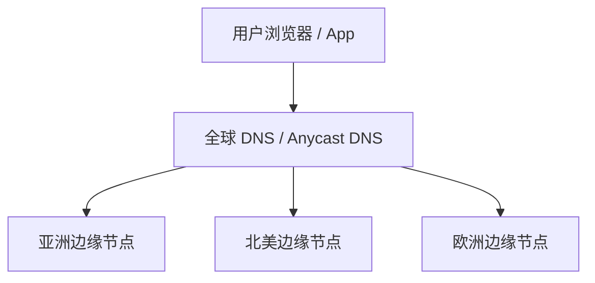
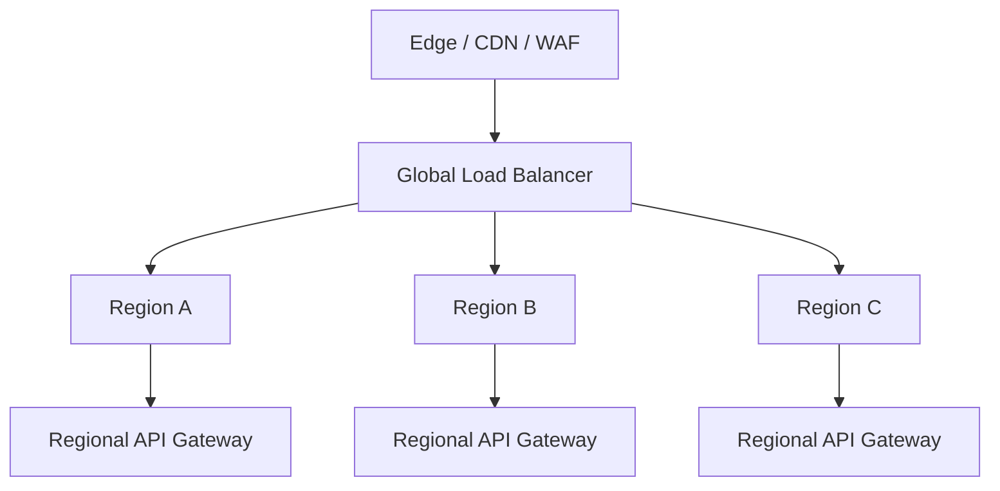
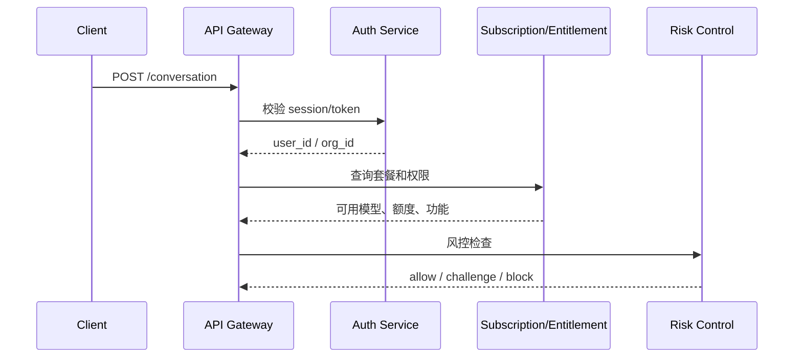
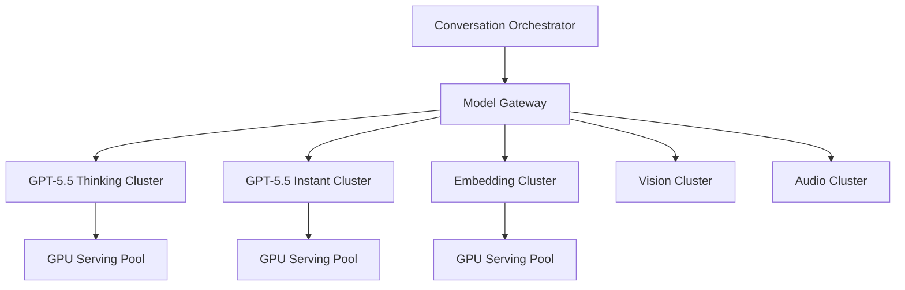
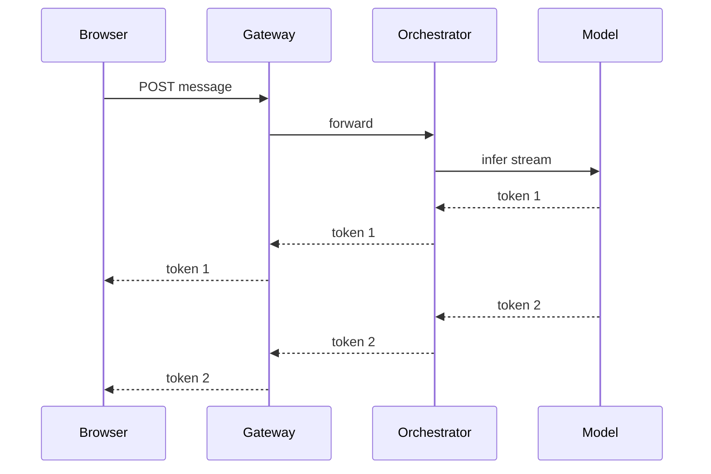
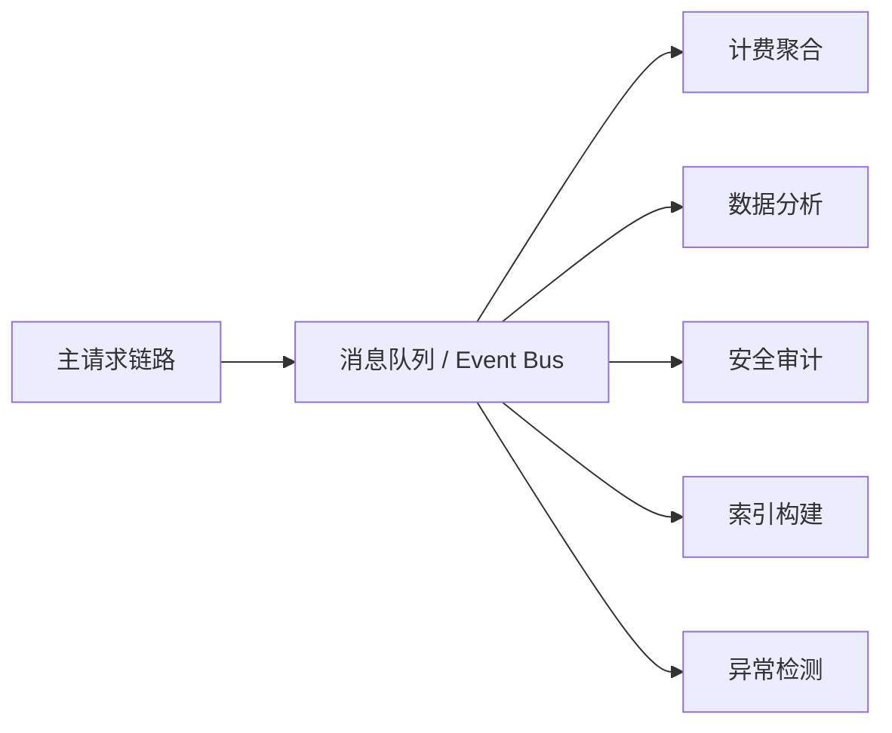
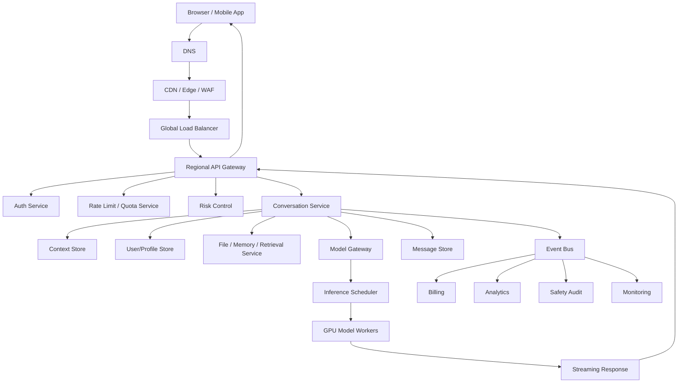

**`chatgpt.com` 只是用户入口域名，不代表后面只有一台服务器或一个单体系统**。真正的系统会被拆成很多层：DNS、CDN、边缘网关、全局负载均衡、API 网关、认证服务、业务编排服务、模型推理集群、存储、队列、审计、安全风控、观测系统等。

---

# 1. 一个域名背后不是一个入口，而是一组全球入口

用户访问：

```text
https://chatgpt.com
```

浏览器首先会做：

```text
DNS 解析 chatgpt.com
```

但 DNS 返回的通常不是某个固定服务器 IP，而是根据：

- 用户地理位置
    
- 网络运营商
    
- 当前区域健康状态
    
- 边缘节点负载
    
- 灾备策略
    

返回一个“离用户较近且健康”的入口。

概念上类似：



所以，**一个域名只是逻辑入口；物理入口可能分布在全球几十到上百个边缘节点。**

---

# 2. 第一层：CDN / Edge / WAF

用户请求不会一上来就打到 OpenAI 的核心业务服务，而是先进入边缘层。

这一层一般负责：

|能力|作用|
|---|---|
|TLS 终止|处理 HTTPS 握手，解密请求|
|CDN 静态资源加速|JS、CSS、图片、字体、前端 bundle 就近缓存|
|WAF|防 SQL 注入、XSS、恶意 UA、异常请求|
|DDoS 防护|抗大流量攻击|
|Bot 检测|区分真人、脚本、爬虫、滥用请求|
|地域路由|把请求转发到合适区域|

ChatGPT 官网的前端页面、图标、静态 JS 文件，不太可能每次都回源到核心服务。大概率是：

```text
静态资源：CDN 直接返回
动态请求：转发到后端网关
```

例如：

```text
GET /assets/app.xxx.js    -> CDN 命中，直接返回
POST /backend-api/conversation -> 转发后端
```

---

# 3. 第二层：全局流量调度 / Global Load Balancer

进入动态请求后，系统要决定：

```text
这个请求应该去哪个区域？
```

比如：

- us-east
    
- us-west
    
- europe
    
- asia
    
- backup region
    

调度依据可能包括：

- 用户所在地
    
- 用户账号所属区域
    
- 数据合规要求
    
- 模型资源可用性
    
- 当前 GPU 集群压力
    
- 某个区域是否故障
    
- 延迟 SLA
    

这层的目标不是“平均分配流量”，而是：

```text
在低延迟、可用性、成本、合规、容量之间做动态权衡。
```

概念链路：



---

# 4. 第三层：API Gateway

进入某个区域后，请求会到 **API 网关**。

这层对后端开发者很熟悉，类似 Spring Cloud Gateway、Nginx、Envoy、Kong、APISIX、ShenYu 的职责，只是规模更大。

API Gateway 主要做：

|功能|说明|
|---|---|
|路由|`/conversation`、`/auth`、`/files`、`/billing` 分发到不同服务|
|鉴权前置|检查 session、token、cookie|
|限流|用户级、IP 级、组织级、模型级限流|
|熔断|下游异常时快速失败|
|重试|对幂等请求做安全重试|
|灰度发布|某些用户走新版本服务|
|A/B 实验|不同用户启用不同 UI 或模型策略|
|请求改写|补充 trace id、用户上下文、区域信息|
|日志审计|记录访问日志、安全日志、计费日志|

可以类比为：

```text
用户请求
  -> 网关
      -> 认证服务
      -> 会话服务
      -> 文件服务
      -> 计费服务
      -> 模型编排服务
```

---

# 5. 第四层：认证与账号系统

ChatGPT 不是匿名文本接口。一次对话请求背后至少要判断：

- 你是谁？
    
- 你是否登录？
    
- 你的套餐是什么？
    
- 你是否企业用户？
    
- 你能不能用这个模型？
    
- 你有没有达到速率限制？
    
- 你所在地区是否允许使用某些功能？
    
- 这个请求是否异常？
    

典型链路：



这一步很关键。因为对 ChatGPT 来说，“请求能不能进模型”不仅是鉴权问题，还是**成本控制问题**。

一次普通 HTTP 请求可能只消耗几毫秒 CPU；一次大模型推理可能消耗昂贵 GPU 资源。所以它的限流策略一定比普通 Web 系统更复杂。

---

# 6. 第五层：业务编排服务，而不是直接打模型

用户输入一句话：

```text
帮我解释一下 Redis Cluster Gossip 协议
```

后端不太可能直接：

```text
prompt -> model -> response
```

中间会有一个 **Conversation Orchestrator / Agent Runtime / Model Gateway** 之类的编排层。

它负责：

|环节|作用|
|---|---|
|加载会话上下文|找到历史消息、系统指令、用户配置|
|拼装 Prompt|系统消息、用户消息、工具结果、记忆、文件上下文|
|策略选择|选择 GPT-5.5 Thinking、轻量模型、多模态模型等|
|工具调用|浏览器、Python、文件搜索、日历、邮件等|
|安全检查|输入输出安全策略|
|流式响应|SSE / WebSocket / HTTP streaming|
|计量计费|token、图片、工具调用、模型成本|
|日志观测|trace、latency、error、usage|

也就是说，ChatGPT 后端更像：

```text
聊天产品后端 + Agent 编排系统 + 模型网关 + 工具平台 + 安全系统
```

而不仅是一个“调用大模型 API 的 Controller”。

---

# 7. 第六层：模型网关 / Model Gateway

模型网关是非常关键的一层。

它可能负责：

- 将请求路由到不同模型
    
- 判断是否使用推理模型
    
- 判断是否需要多模态模型
    
- 判断是否需要降级到更便宜模型
    
- 判断是否需要走批处理或缓存
    
- 对模型服务做负载均衡
    
- 对 GPU 集群做容量调度
    
- 处理模型版本灰度
    
- 收集 token 使用量
    
- 做超时、取消、重试、fallback
    

概念上类似：



这里的“负载均衡”不只是普通 HTTP 负载均衡，而是要考虑：

```text
模型类型 + GPU 显存 + batch size + 上下文长度 + 推理时间 + 用户优先级 + 成本。
```

这和普通 Java 后端的服务分发差异很大。

---

# 8. 第七层：推理服务 / Inference Serving

真正跑模型的地方是推理集群。

它和传统业务服务最大的区别是：

## 普通业务服务

```text
CPU 密集或 IO 密集
请求通常几十毫秒到几百毫秒
可水平扩展
实例成本相对低
```

## 大模型推理服务

```text
GPU 密集
请求可能持续数秒到数分钟
上下文越长成本越高
输出是流式生成
需要 KV Cache
需要批处理调度
显存是核心瓶颈
```

模型推理服务内部可能有：

|组件|作用|
|---|---|
|Request Scheduler|合并请求、批处理、优先级调度|
|Token Generator|自回归生成 token|
|KV Cache Manager|管理长上下文缓存|
|GPU Worker|实际跑模型|
|Streaming Server|把 token 流式返回|
|Safety Filter|输入输出安全检查|
|Timeout Manager|超时控制、取消生成|

一次回答不是“一次 RPC 返回一个 JSON”，而是：

```text
用户发消息
后端开始推理
模型生成第 1 个 token
模型生成第 2 个 token
模型生成第 3 个 token
...
边生成边返回给前端
```

所以前端看到的是“打字机效果”。

---

# 9. 第八层：流式响应

ChatGPT 这种产品不会等完整答案生成完再返回，否则用户体验很差。

它一般会使用类似：

- Server-Sent Events，SSE
    
- WebSocket
    
- HTTP chunked streaming
    
- gRPC streaming，内部链路可能用
    

概念：



这对后端要求很高：

- 连接不能随便断
    
- 中间层不能把响应全部缓冲完再返回
    
- 网关要支持长连接
    
- 要能处理中途取消
    
- 要能处理中途失败
    
- 要记录已经生成的内容
    
- 要避免重复扣费或重复保存
    

---

# 10. 第九层：存储系统

ChatGPT 背后不是只有一个数据库。

至少可能有这些类型：

|数据|可能的存储|
|---|---|
|用户账号|关系型数据库 / 分布式数据库|
|会话元数据|OLTP 数据库|
|聊天消息|分布式 KV / 文档存储 / 对象存储|
|文件上传|对象存储|
|向量索引|Vector DB / 自研检索系统|
|计费记录|强一致账务系统|
|日志|Kafka / ClickHouse / BigQuery 类系统|
|缓存|Redis / Memcached / 自研缓存|
|安全审计|append-only log / SIEM|
|模型使用量|时序 / OLAP / billing pipeline|

一次 ChatGPT 对话可能涉及：

```text
读用户信息
读会话历史
读套餐权限
写用户消息
调用模型
流式写 assistant 消息
记录 token 用量
记录安全审计
异步写分析日志
```

所以链路远比“Controller -> Service -> Mapper -> DB”复杂。

---

# 11. 第十层：队列与异步系统

不是所有事情都在主链路同步完成。

主链路应该只做用户必须等待的事：

```text
认证
权限
推理
响应
必要保存
```

其他事情一般异步化：

```text
日志分析
安全审计
计费聚合
训练数据筛选
质量评估
异常检测
通知
索引更新
文件处理
```

典型结构：



对 Java 后端来说，可以类比：

```text
同步链路：必须马上给用户结果
异步链路：通过 Kafka / Pulsar / SQS / PubSub 做最终一致
```

---

# 12. 第十一层：限流和流量控制

ChatGPT 的限流比普通系统复杂很多。

普通系统限流：

```text
每个 IP 每分钟 100 次
每个用户每秒 10 次
```

ChatGPT 这类系统还要考虑：

```text
每个用户每小时多少消息
每个模型多少额度
每个组织多少额度
每个区域 GPU 容量
每个请求预计 token 成本
上下文长度
是否包含图片、文件、工具调用
是否是付费用户
是否企业 SLA 用户
```

可能有多级限流：

|层级|示例|
|---|---|
|IP 限流|防爬虫、防攻击|
|用户限流|免费用户、Plus 用户、Pro 用户不同|
|组织限流|企业租户整体配额|
|模型限流|高成本模型更严格|
|区域限流|某个区域 GPU 紧张时限制|
|功能限流|图片、语音、文件、深度研究等|
|风控限流|异常账号降速或挑战验证|

所以一次请求可能会先经过一个 **Quota / Rate Limit Service**：

```text
user_id + org_id + model + request_type + estimated_tokens
```

返回：

```text
allow
deny
degrade
queue
retry_after
```

---

# 13. 第十二层：高可用与容灾

这种级别的系统不可能假设“服务永远正常”。

它一定要处理：

- 某个服务挂了
    
- 某个区域挂了
    
- 某个模型集群过载
    
- 某个数据库主库不可用
    
- 某个第三方依赖异常
    
- 网络分区
    
- 部署版本出 bug
    
- 流量突然暴涨
    

典型手段：

|手段|说明|
|---|---|
|多区域部署|一个 Region 挂了，切到另一个|
|多可用区|同一区域内跨 AZ|
|自动扩缩容|根据流量和 GPU 负载扩容|
|熔断|下游异常时快速失败|
|降级|暂停非核心功能|
|回滚|灰度版本异常后回退|
|限流|保护核心链路|
|隔离|免费流量、付费流量、企业流量隔离|
|队列削峰|非实时任务异步处理|
|缓存|降低数据库压力|
|健康检查|自动摘除异常实例|

对于 ChatGPT 这种产品，降级策略可能包括：

```text
暂时不可用某些模型
暂时关闭图片生成
暂时降低上下文长度
暂时限制免费用户频率
让部分请求排队
企业用户优先保障
```

---

# 14. 第十三层：观测系统

这种系统最怕的不是“挂了”，而是：

```text
已经坏了，但你不知道哪里坏。
```

所以必须有强观测能力：

|类型|关注点|
|---|---|
|Metrics|QPS、延迟、错误率、GPU 利用率|
|Logs|请求日志、异常日志、安全日志|
|Traces|一次请求经过哪些服务|
|Profiles|CPU、内存、GPU、网络瓶颈|
|Business Metrics|消息成功率、首 token 延迟、生成中断率|
|Cost Metrics|每用户、每模型、每区域成本|
|SLO|可用性、P95/P99 延迟|

对 ChatGPT 特别重要的指标包括：

```text
Time To First Token，首 token 延迟
Tokens Per Second，生成速度
Request Completion Rate，请求完成率
Model Error Rate，模型错误率
Tool Call Failure Rate，工具调用失败率
GPU Utilization，GPU 使用率
Queue Time，排队时间
```

---

# 15. 把完整链路串起来

一次用户发送消息，概念链路大概是：



简化成文本就是：

```text
用户
 -> DNS
 -> CDN / Edge / WAF
 -> 全局负载均衡
 -> 区域 API 网关
 -> 鉴权 / 权限 / 风控 / 限流
 -> 会话编排服务
 -> 上下文 / 文件 / 记忆 / 工具系统
 -> 模型网关
 -> GPU 推理集群
 -> 流式返回
 -> 存储 / 计费 / 日志 / 审计异步处理
```

---

# 16. 和普通 Java 后端系统的最大区别

你作为 Java 后端开发者，可以这样理解：

## 普通业务系统核心瓶颈

```text
数据库
缓存
线程池
连接池
RPC
事务
消息队列
```

## ChatGPT 这类 AI 产品的核心瓶颈

```text
GPU 容量
模型推理延迟
上下文长度
token 成本
长连接流式输出
模型调度
安全策略
多工具编排
用户配额
全球流量调度
```

普通系统是：

```text
请求 -> 业务逻辑 -> 数据库 -> 响应
```

ChatGPT 是：

```text
请求 -> 用户/权限/风控 -> 上下文构造 -> 模型选择 -> 工具编排 -> GPU 推理 -> 流式输出 -> 计费审计
```

---

# 17. 类比到你自己的 DevWiki / Dendro 项目

如果以后你做 DevWiki Studio，没必要一开始复制这种复杂架构。

你可以按规模演进：

## MVP 阶段

```text
Nginx
 -> Spring Boot
 -> PostgreSQL
 -> Redis
 -> OpenAI/Anthropic API
 -> 前端 Vercel/静态部署
```

## 小规模生产

```text
CDN
 -> Nginx / API Gateway
 -> Spring Boot 多实例
 -> Redis 限流
 -> PostgreSQL 主从
 -> 对象存储
 -> MQ 异步任务
 -> AI Provider Gateway
```

## 中大型阶段

```text
Global CDN
 -> WAF
 -> Gateway Cluster
 -> Auth Service
 -> Quota Service
 -> Conversation Service
 -> AI Gateway
 -> Tool Runtime
 -> Vector Retrieval
 -> Billing / Audit / Observability
```

你的项目最值得借鉴 ChatGPT 架构的不是“全球多活”，而是这几个设计：

1. **AI Gateway**  
    把 OpenAI、Anthropic、未来其他模型隔离在统一网关后面。
    
2. **Conversation Orchestrator**  
    不要让 Controller 直接调模型，要有编排层。
    
3. **Quota / Rate Limit**  
    AI 调用有真实成本，必须做用户级限流和配额。
    
4. **Streaming Response**  
    AI 产品体验必须支持流式输出。
    
5. **Async Event Pipeline**  
    计费、审计、日志、索引构建不要塞进主链路。
    
6. **Tool Runtime / Skill Runtime**  
    未来 DevWiki Studio 的 ingest、summarize、generate wiki draft 都应该作为可编排工具。
    

---

# 18. 最终一句话总结

`chatgpt.com` 看起来只是一个域名，但它背后更像是：

```text
全球入口层
+ 安全网关层
+ 账号权限层
+ 流量控制层
+ 会话编排层
+ 工具调用层
+ 模型网关层
+ GPU 推理层
+ 存储计费审计层
+ 可观测与容灾体系
```

对于后端开发者，最重要的认知升级是：

> ChatGPT 不是“一个大模型接口加一个聊天页面”，而是一个以大模型推理为核心资源、围绕成本、延迟、安全、可用性和用户体验构建的全球分布式系统。