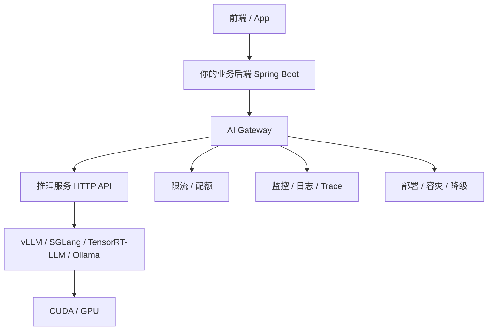
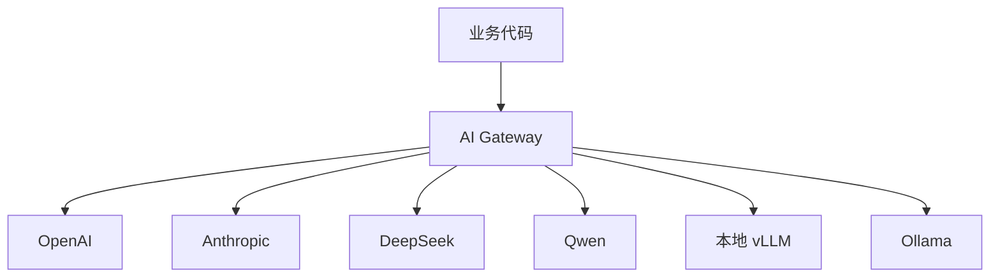
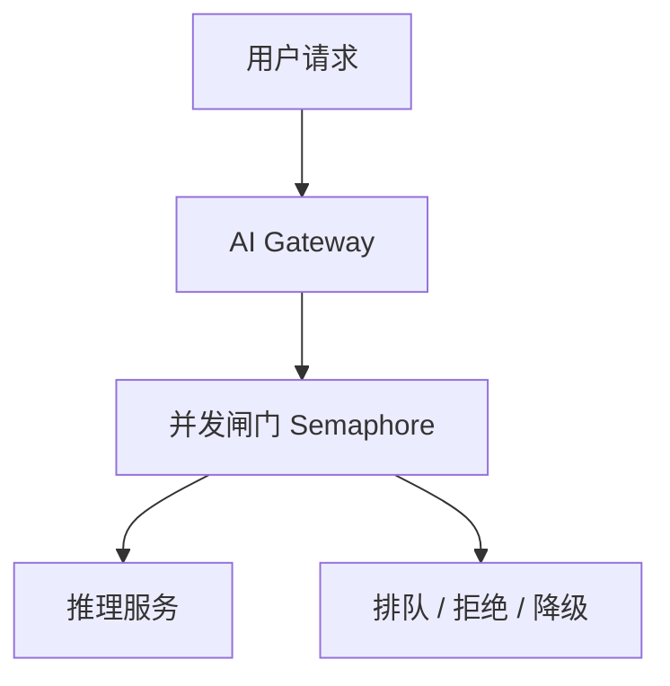
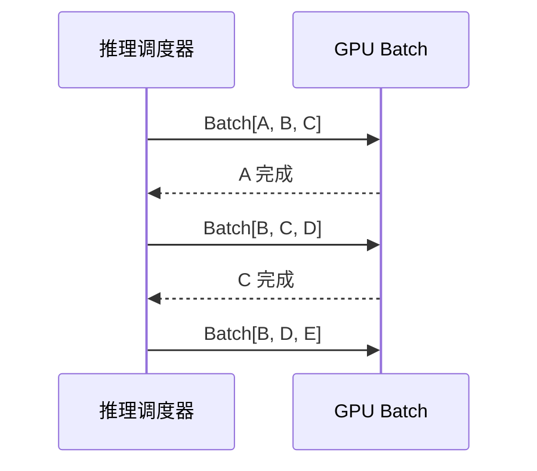
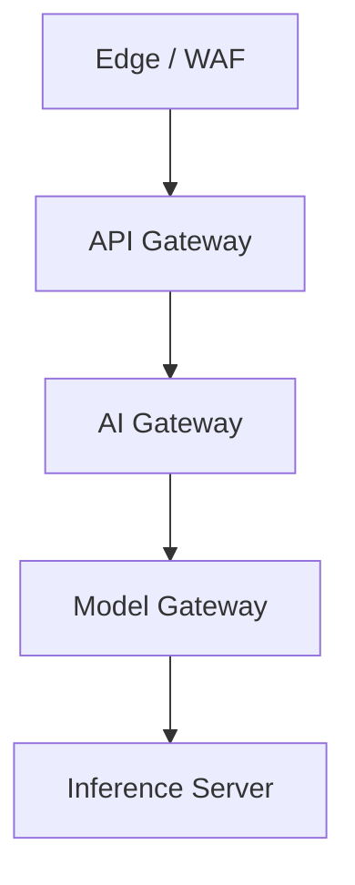
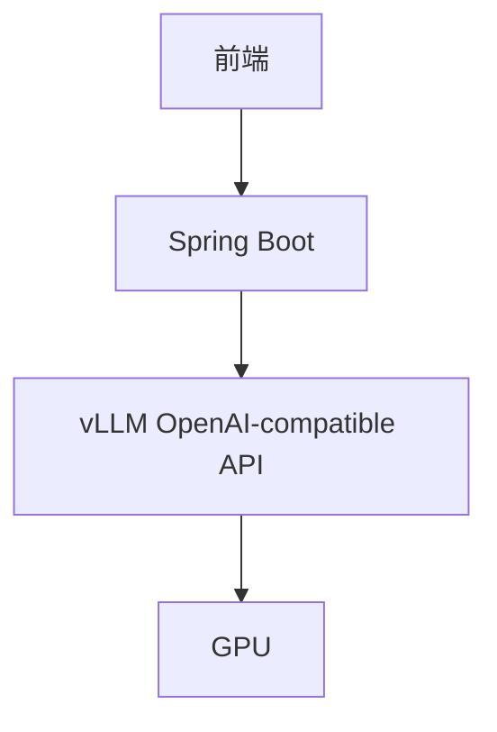
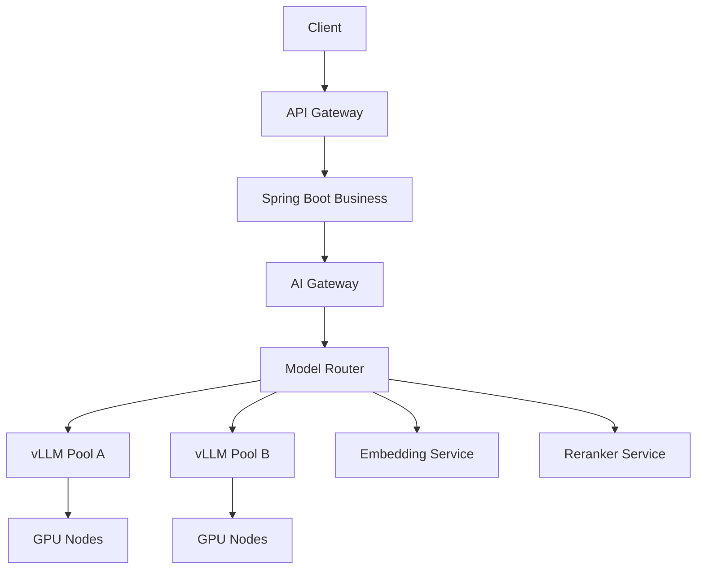
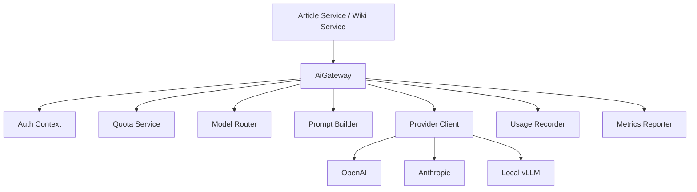
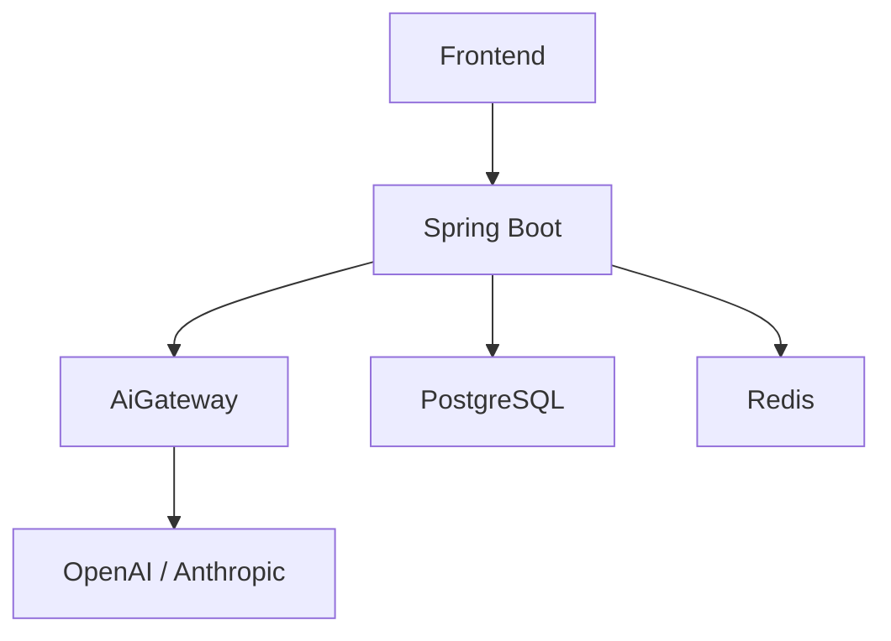

下面这组关键词，本质上是在回答一个问题：

> **后端开发者不直接写 CUDA，但如果要把大模型能力做成稳定产品，应该关心哪些工程接口和运行机制？**

这几个点可以放在一条链路里看：



你真正要掌握的是：

```text
怎么调用模型
怎么兼容不同模型服务
怎么流式返回
怎么处理并发
怎么利用 batching
怎么限流保护 GPU
怎么监控
怎么部署
```

---

# 1. HTTP API：模型服务首先要变成“可调用服务”

作为后端开发者，你通常不会在 Spring Boot 里直接加载模型，而是调用一个独立的推理服务。

例如：

```text
Spring Boot
  -> HTTP / gRPC
  -> vLLM / SGLang / Ollama / TensorRT-LLM
  -> GPU
```

最基本的 HTTP 调用形态类似：

```http
POST /v1/chat/completions
Content-Type: application/json
Authorization: Bearer xxx

{
  "model": "qwen2.5-7b-instruct",
  "messages": [
    {
      "role": "user",
      "content": "解释一下 Redis Cluster Gossip 协议"
    }
  ],
  "temperature": 0.7,
  "stream": true
}
```

响应可能是：

```json
{
  "id": "chatcmpl_xxx",
  "object": "chat.completion",
  "model": "qwen2.5-7b-instruct",
  "choices": [
    {
      "message": {
        "role": "assistant",
        "content": "Redis Cluster Gossip 协议是..."
      }
    }
  ],
  "usage": {
    "prompt_tokens": 128,
    "completion_tokens": 512,
    "total_tokens": 640
  }
}
```

对后端来说，你要关心的不是“模型内部怎么生成”，而是：

|关注点|说明|
|---|---|
|请求参数|model、messages、temperature、max_tokens、stream|
|响应结构|content、finish_reason、usage|
|错误码|超时、限流、模型不存在、显存不足|
|超时设置|模型生成可能持续几十秒甚至几分钟|
|连接管理|流式响应不能被中间层缓冲或提前断开|
|幂等性|重试可能导致重复生成、重复扣费、重复保存|
|取消请求|用户点停止生成时，后端要能取消下游推理|

普通业务 API 关注：

```text
请求正确
响应正确
错误处理
```

AI 推理 API 还额外关注：

```text
生成时间
token 成本
流式输出
请求取消
上下文长度
模型负载
```

---

# 2. OpenAI-compatible API：为什么它很重要？

现在很多推理服务都支持 **OpenAI-compatible API**。

意思是：即使你不是调用 OpenAI 官方 API，也可以使用类似 OpenAI 的接口格式。

例如这些服务通常都支持近似接口：

```text
POST /v1/chat/completions
POST /v1/completions
POST /v1/embeddings
GET  /v1/models
```

请求结构也类似：

```json
{
  "model": "local-model",
  "messages": [
    {
      "role": "system",
      "content": "你是一个专业助手"
    },
    {
      "role": "user",
      "content": "讲讲 CUDA"
    }
  ],
  "stream": true
}
```

这对后端非常重要。

因为你可以在自己的系统里设计一个统一的 **AI Gateway**：



业务代码不要直接写死：

```java
openAiClient.chatCompletion(...)
```

更好的设计是：

```java
aiGateway.chat(request)
```

然后由 AI Gateway 决定：

```text
用哪个 provider
用哪个模型
是否流式
是否降级
是否限流
如何记录 usage
如何处理异常
```

---

## OpenAI-compatible API 的价值

|价值|说明|
|---|---|
|降低接入成本|同一套请求结构可以接多个模型服务|
|方便替换模型|OpenAI 换成本地 vLLM，不需要大改业务代码|
|方便灰度|一部分用户走 GPT，一部分用户走 Qwen|
|方便降级|高级模型挂了，切到便宜模型|
|方便统一计费|不同 provider 的 usage 统一归一化|
|方便统一监控|latency、tokens、error 统一采集|

你的 DevWiki / Dendro 项目里，非常建议做这个抽象。

例如：

```java
public interface AiGateway {

    ChatResponse chat(ChatRequest request);

    Flux<ChatChunk> streamChat(ChatRequest request);

    EmbeddingResponse embed(EmbeddingRequest request);
}
```

Provider 实现可以是：

```text
OpenAiProvider
AnthropicProvider
DeepSeekProvider
LocalVllmProvider
OllamaProvider
```

业务层只依赖：

```text
AiGateway
```

而不是依赖某个具体厂商。

---

# 3. 流式输出：AI 产品体验的核心

普通 HTTP 接口通常是：

```text
请求 -> 等待 -> 一次性返回 JSON
```

但大模型生成可能需要很久。

如果你等完整答案生成后再返回，用户会感觉系统卡住了。

所以 AI 产品通常使用 **流式输出**：

```text
请求 -> 很快返回第一个 token -> 持续返回 token -> 完成
```

前端看到的就是“逐字生成”。

---

## 常见流式协议

常见方案有：

|方式|说明|
|---|---|
|SSE|Server-Sent Events，最常见|
|WebSocket|双向通信，适合更复杂交互|
|HTTP Chunked|分块传输|
|gRPC Streaming|内部服务间常用|

Web AI 产品最常见的是 **SSE**。

SSE 响应长这样：

```text
data: {"delta": "Redis"}

data: {"delta": " Cluster"}

data: {"delta": " Gossip"}

data: {"delta": " 是"}

data: [DONE]
```

---

## Spring Boot 里怎么做流式返回？

如果你用 Spring WebFlux，可以返回：

```java
@GetMapping(value = "/chat/stream", produces = MediaType.TEXT_EVENT_STREAM_VALUE)
public Flux<ServerSentEvent<String>> streamChat(@RequestParam String message) {
    return aiGateway.streamChat(message)
            .map(chunk -> ServerSentEvent.builder(chunk.content()).build());
}
```

如果是传统 Spring MVC，也可以用：

```java
SseEmitter
```

示意：

```java
@GetMapping("/chat/stream")
public SseEmitter streamChat(@RequestParam String message) {
    SseEmitter emitter = new SseEmitter(120_000L);

    executor.submit(() -> {
        try {
            aiGateway.streamChat(message, chunk -> {
                emitter.send(SseEmitter.event().data(chunk));
            });
            emitter.complete();
        } catch (Exception e) {
            emitter.completeWithError(e);
        }
    });

    return emitter;
}
```

不过注意：传统 MVC + SseEmitter 会占用更多线程资源。高并发流式场景下，WebFlux / Netty / 异步 IO 更合适。

---

## 流式输出的工程坑

|问题|说明|
|---|---|
|网关缓冲|Nginx 如果开启 buffering，用户可能收不到实时 token|
|超时|网关、LB、浏览器、服务端都可能超时|
|取消|用户点停止生成，后端要取消下游请求|
|错误中断|生成到一半失败，要给前端可识别事件|
|内容保存|是边生成边保存，还是结束后一次保存？|
|计费|中途取消时，已经生成的 token 怎么计量？|
|并发连接|一个用户一个长连接，会增加连接数压力|
|心跳|长时间没 token 时，需要保持连接活跃|

你以后做 AI 聊天，不要只设计：

```text
POST /chat -> String
```

更合理的是：

```text
POST /chat/messages
GET  /chat/messages/{id}/stream
POST /chat/messages/{id}/cancel
```

或者直接：

```text
POST /chat/stream
```

并支持取消、错误事件、完成事件。

---

# 4. 并发：AI 服务的并发瓶颈和普通后端不同

普通 Java 后端看并发，主要关注：

```text
Tomcat 线程池
数据库连接池
Redis 连接池
CPU
内存
锁竞争
IO
```

AI 推理服务看并发，核心关注：

```text
GPU 显存
GPU 利用率
KV Cache
batch 调度
上下文长度
tokens/s
请求排队时间
```

普通接口可能是：

```text
一次请求 50ms
```

AI 请求可能是：

```text
一次请求 5s、30s、甚至更久
```

如果 1000 个用户同时生成，每个请求都占用流式连接和推理资源。

所以 AI 服务并发不是简单提高线程池就能解决。

---

## AI 并发的核心矛盾

大模型推理有两个阶段：

```text
Prefill 阶段：处理输入上下文
Decode 阶段：逐 token 生成
```

### Prefill

处理用户输入和历史上下文。

特点：

```text
计算量大
可以并行度较高
上下文越长越慢
```

### Decode

一个 token 一个 token 生成。

特点：

```text
每步生成一个 token
强依赖上一步结果
更容易受显存带宽和 KV Cache 影响
```

所以模型并发不是：

```text
请求越多越好
```

而是要平衡：

```text
吞吐量
首 token 延迟
平均生成速度
显存占用
用户体验
```

---

## 后端要怎么处理并发？

你的业务后端应该做几件事：

### 1. 控制进入推理服务的并发

不要让所有请求直接打到模型服务。



例如：

```java
private final Semaphore modelSemaphore = new Semaphore(100);

public Flux<ChatChunk> streamChat(ChatRequest request) {
    if (!modelSemaphore.tryAcquire()) {
        throw new TooManyRequestsException("model is busy");
    }

    return aiProvider.stream(request)
            .doFinally(signal -> modelSemaphore.release());
}
```

### 2. 区分不同模型的并发池

不要所有模型共用一个限流。

```text
gpt-4-class 模型：并发 50
small 模型：并发 500
embedding 模型：并发 1000
image 模型：并发 20
```

### 3. 区分用户等级

例如：

```text
免费用户：低并发，低优先级
付费用户：中并发，中优先级
企业用户：高优先级，独立配额
管理员任务：后台低优先级
```

### 4. 支持排队和快速失败

当 GPU 满载时，不一定要让用户一直等。

可以返回：

```http
HTTP/1.1 429 Too Many Requests
Retry-After: 30
```

或者：

```json
{
  "code": "MODEL_BUSY",
  "message": "当前模型繁忙，请稍后重试",
  "retryAfterSeconds": 30
}
```

---

# 5. Batching：为什么大模型服务喜欢“合批”？

**Batching** 是推理性能的核心。

如果一个请求一个请求送给 GPU，GPU 可能吃不满。

Batching 的思想是：

```text
把多个用户请求合成一批，一起送进 GPU 计算
```

类似：

```text
用户 A: 讲讲 Redis
用户 B: 写一段 Java
用户 C: 翻译一句话

推理服务把它们组成 batch，一起跑
```

---

## 为什么 batching 能提高吞吐？

GPU 适合大规模并行计算。

单个请求可能无法充分利用 GPU。

多个请求合批后：

```text
矩阵更大
并行度更高
GPU 利用率更高
单位 token 成本更低
整体吞吐更高
```

但问题是：

> batch 越大，吞吐越高，不代表用户体验越好。

因为合批需要等待。

---

## Batching 的核心权衡

|目标|影响|
|---|---|
|更大 batch|GPU 利用率更高|
|更大 batch|单个请求可能等待更久|
|更小 batch|首 token 更快|
|更小 batch|GPU 利用率可能较低|
|长上下文混入 batch|可能拖慢短请求|
|大输出请求混入 batch|可能影响整体调度|

所以推理服务要做动态 batching。

---

## Continuous Batching

传统 batching 可能是：

```text
等一批请求凑齐
一起开始
一起结束
```

但大模型生成长度不同：

```text
用户 A 生成 50 token
用户 B 生成 500 token
用户 C 生成 2000 token
```

如果必须一起结束，会浪费资源。

所以 vLLM、SGLang 等推理框架会做类似 **continuous batching**：

```text
某个请求生成完了，就从 batch 中移除
新的请求可以动态加入 batch
```

概念：



这可以显著提高 GPU 利用率。

---

## 后端开发者要不要自己实现 batching？

一般不建议你在 Java 业务层自己实现 LLM batching。

原因：

```text
batching 要理解模型状态
要管理 KV Cache
要处理不同序列长度
要和 GPU scheduler 协同
```

这应该交给：

```text
vLLM
SGLang
TensorRT-LLM
Triton
```

你的后端应该做的是：

```text
不要绕开推理框架
不要每个请求单独起模型
不要频繁加载卸载模型
把请求稳定送到推理服务
控制并发和队列
```

---

# 6. 限流：AI 系统必须做，而且要比普通系统复杂

AI 限流不是简单防刷。

它同时是在保护：

```text
GPU 资源
模型服务
账单成本
用户体验
系统稳定性
```

普通限流可能是：

```text
每个 IP 每分钟 100 次
```

AI 系统还要考虑：

```text
每个用户每天多少 token
每个模型每分钟多少请求
每个组织每月多少额度
单次请求最大上下文
单次请求最大输出
当前 GPU 是否繁忙
```

---

## 限流维度

|维度|示例|
|---|---|
|IP|防恶意刷接口|
|用户|每用户每分钟 N 次|
|组织/租户|企业团队共享额度|
|模型|高成本模型严格限制|
|Token|每分钟最多消耗多少 token|
|并发|同时只能生成 N 个回答|
|上下文长度|单次最多 32k token|
|输出长度|单次最多生成 4k token|
|功能|图片、文件、语音单独限流|
|成本|每天最多消耗多少金额|

---

## 请求级限流

例如：

```text
每用户每分钟最多 20 次 chat 请求
```

适合保护 API。

但不够精细。

因为：

```text
一个 10 token 请求
和
一个 100k 上下文 + 8k 输出请求

成本完全不是一回事。
```

---

## Token 级限流

更合理的是按 token 限流。

例如：

```text
每用户每分钟最多 100,000 tokens
每组织每天最多 10,000,000 tokens
```

一次请求进来之前，先预估：

```text
输入 token 数
最大输出 token 数
模型单价
当前用户额度
```

然后判断是否允许。

伪代码：

```java
public void checkQuota(ChatRequest request, User user) {
    int promptTokens = tokenizer.estimate(request.messages());
    int maxOutputTokens = request.maxTokens();

    int estimatedTokens = promptTokens + maxOutputTokens;

    quotaService.checkAndReserve(
            user.id(),
            request.model(),
            estimatedTokens
    );
}
```

注意这里用了 **reserve**。

因为请求还没完成，只能先预占额度。

请求完成后再结算真实 usage：

```java
quotaService.commit(
        user.id(),
        requestId,
        actualPromptTokens,
        actualCompletionTokens
);
```

如果失败或取消：

```java
quotaService.refundOrAdjust(requestId);
```

---

## 并发级限流

Token 限流保护成本，并发限流保护 GPU。

例如：

```text
每个用户最多同时 2 个生成任务
每个租户最多同时 50 个生成任务
每个模型最多同时 200 个生成任务
```

否则一个用户可以同时开 100 个流式生成，占满连接和 GPU 队列。

---

## 限流应该放在哪？

多层限流：



|层|限什么|
|---|---|
|Edge/WAF|IP、爬虫、DDoS|
|API Gateway|用户 QPS、接口频率|
|AI Gateway|token、模型、套餐、并发|
|Model Gateway|模型容量、GPU 队列|
|Inference Server|batch、显存、scheduler|

你自己的项目 MVP 阶段，至少要做：

```text
用户级请求限流
用户级 token 配额
模型级并发限制
单次上下文长度限制
单次输出长度限制
```

---

# 7. 监控：AI 服务要监控的不只是 QPS 和 P99

普通后端监控：

```text
QPS
P95/P99 latency
error rate
CPU
memory
DB connection
GC
```

AI 服务还必须监控：

```text
首 token 延迟
生成 tokens/s
prompt tokens
completion tokens
模型错误率
限流次数
取消次数
GPU 利用率
显存使用
KV Cache 使用
batch size
queue time
```

---

## 关键指标表

|指标|说明|
|---|---|
|Request QPS|请求量|
|Success Rate|成功率|
|Error Rate|错误率|
|Time To First Token|首 token 延迟|
|Total Generation Time|完整生成耗时|
|Tokens Per Second|生成速度|
|Prompt Tokens|输入 token 数|
|Completion Tokens|输出 token 数|
|Total Tokens|总 token 数|
|Queue Time|推理前排队时间|
|Batch Size|实际合批大小|
|GPU Utilization|GPU 使用率|
|GPU Memory Usage|显存使用|
|KV Cache Usage|KV Cache 使用|
|Rate Limited Count|被限流次数|
|Cancel Count|用户取消次数|
|Provider Error Rate|模型供应商错误率|
|Cost Per User|用户成本|
|Cost Per Model|模型成本|

---

## AI 产品特别重要：Time To First Token

用户体验最敏感的是：

```text
发送消息后多久看到第一个字？
```

这叫：

```text
TTFT = Time To First Token
```

如果 TTFT 太高，用户会觉得系统卡住。

TTFT 受影响于：

```text
网关延迟
鉴权延迟
上下文加载
Prompt 拼装
请求排队
prefill 计算
模型负载
```

所以你要把总耗时拆开。

例如 trace：

```text
auth: 12ms
load_context: 80ms
build_prompt: 15ms
rate_limit: 5ms
provider_queue: 300ms
prefill: 700ms
first_token_total: 1112ms
```

否则你只知道“慢”，不知道慢在哪里。

---

## 日志要记录什么？

一次 AI 请求建议记录：

```json
{
  "requestId": "req_123",
  "userId": "u_1",
  "model": "qwen2.5-7b-instruct",
  "provider": "local-vllm",
  "stream": true,
  "promptTokens": 1200,
  "completionTokens": 800,
  "totalTokens": 2000,
  "timeToFirstTokenMs": 950,
  "totalLatencyMs": 12500,
  "tokensPerSecond": 64,
  "finishReason": "stop",
  "errorCode": null,
  "cancelled": false
}
```

但注意：不要随便把完整 prompt 和用户隐私原文打进日志。

应该区分：

```text
业务审计日志
性能指标日志
安全审计日志
用户内容日志
```

默认少记录原文，必要时脱敏或采样。

---

# 8. 部署：不要把模型部署当成普通 Web 服务

普通 Spring Boot 部署：

```text
打包 jar
放 Docker
配环境变量
启动服务
水平扩容
```

模型服务部署更复杂，因为它依赖：

```text
GPU
NVIDIA Driver
CUDA Runtime
模型权重
显存
推理框架
容器运行时
GPU 调度
```

---

## 单机本地部署

开发测试阶段可能是：

```text
一台机器
一张 GPU
Ollama / vLLM
一个模型
Spring Boot 调它
```

例如：

```text
Spring Boot :8080
vLLM        :8000
GPU         :RTX 4090
Model       :Qwen2.5-7B-Instruct
```

结构：



这种适合学习和 MVP。

---

## Docker 部署要注意 NVIDIA Runtime

普通 Docker 默认不能用 GPU。

需要 NVIDIA Container Toolkit，让容器能访问 GPU。

典型启动形态：

```bash
docker run --gpus all \
  -p 8000:8000 \
  vllm/vllm-openai:latest \
  --model Qwen/Qwen2.5-7B-Instruct
```

后端开发者至少要知道：

```text
容器能不能看到 GPU
驱动版本是否匹配
CUDA runtime 是否兼容
模型权重是否挂载
显存是否够
```

检查 GPU：

```bash
nvidia-smi
```

容器里也要能看到：

```bash
docker run --rm --gpus all nvidia/cuda:12.4.1-base-ubuntu22.04 nvidia-smi
```

---

## 生产部署常见结构

更生产化的部署是：



不同模型最好分池：

```text
chat-large 模型池
chat-small 模型池
embedding 模型池
reranker 模型池
image 模型池
```

不要所有模型混在一个服务里。

---

## Kubernetes 部署

如果上 K8s，要关注：

```text
GPU Node
NVIDIA Device Plugin
nodeSelector
tolerations
resource limits
模型权重下载
启动时间
健康检查
滚动更新
显存碎片
```

Pod 资源示意：

```yaml
resources:
  limits:
    nvidia.com/gpu: 1
```

但注意：GPU 服务不一定适合频繁滚动更新。

因为：

```text
模型权重很大
启动加载很慢
预热耗时长
显存释放可能有延迟
```

部署时要做：

```text
优雅下线
停止接收新请求
等待已有流式请求完成
释放 GPU
新实例加载模型并预热
再切流量
```

---

# 9. 这几个点如何组合成 AI Gateway？

你可以设计一个 AI Gateway 模块，把这些工程能力收口。

核心职责：

```text
统一模型 API
统一 provider 接入
统一流式输出
统一限流
统一监控
统一降级
统一错误处理
统一 usage 记录
```

结构：



---

## AI Gateway 请求对象

```java
public record ChatRequest(
        String userId,
        String conversationId,
        String model,
        List<ChatMessage> messages,
        boolean stream,
        Integer maxTokens,
        Double temperature,
        Map<String, Object> metadata
) {
}
```

---

## AI Gateway 响应对象

```java
public record ChatChunk(
        String requestId,
        String delta,
        String finishReason,
        Usage usage
) {
}
```

---

## Provider 抽象

```java
public interface AiProvider {

    String providerName();

    boolean supports(String model);

    ChatResponse chat(ChatRequest request);

    Flux<ChatChunk> streamChat(ChatRequest request);

    EmbeddingResponse embed(EmbeddingRequest request);
}
```

---

## AI Gateway 伪代码

```java
public Flux<ChatChunk> streamChat(ChatRequest request) {
    String requestId = idGenerator.next();

    return Mono.fromRunnable(() -> {
                quotaService.checkAndReserve(request);
                rateLimiter.acquire(request.userId(), request.model());
                metrics.markRequestStart(requestId, request);
            })
            .thenMany(
                    modelRouter.selectProvider(request.model())
                            .streamChat(request)
            )
            .doOnNext(chunk -> {
                usageRecorder.recordPartial(requestId, chunk);
                metrics.recordChunk(requestId, chunk);
            })
            .doOnError(error -> {
                quotaService.rollbackIfNeeded(requestId);
                metrics.recordError(requestId, error);
            })
            .doOnComplete(() -> {
                quotaService.commit(requestId);
                metrics.recordComplete(requestId);
            })
            .doFinally(signal -> {
                rateLimiter.release(request.userId(), request.model());
            });
}
```

这个伪代码背后就包含了你问的所有点：

```text
HTTP API
OpenAI-compatible API
流式输出
并发
batching
限流
监控
部署
```

---

# 10. 对 DevWiki / Dendro 项目的建议

你自己的项目如果要接 AI，建议按这个优先级做。

## MVP 阶段

先实现：

```text
OpenAI-compatible Provider
Anthropic Provider
统一 AiGateway
SSE 流式输出
用户级简单限流
请求日志
usage 记录
```

架构：



---

## 第二阶段

加入：

```text
Redis token bucket 限流
按模型区分配额
流式取消
AI 请求 trace
Prompt/Response 版本记录
异步 usage 统计
本地 vLLM Provider
```

---

## 第三阶段

再考虑：

```text
模型路由
降级策略
企业租户配额
成本统计
GPU 推理服务部署
多模型池
批处理 embedding
监控面板
```

---

# 11. 这几个关键词的最终关系

可以这样记：

|关键词|你应该理解成|
|---|---|
|HTTP API|模型能力服务化后的调用入口|
|OpenAI-compatible API|统一不同模型服务的接口标准|
|流式输出|AI 产品体验的核心交互方式|
|并发|控制多少请求同时占用模型资源|
|batching|推理框架提高 GPU 吞吐的关键机制|
|限流|保护 GPU、成本、用户体验和系统稳定性|
|监控|观察 token、延迟、错误、成本、GPU 状态|
|部署|把模型服务稳定跑在 GPU 环境里|

一句话总结：

> **后端开发者做 AI 产品，不需要一开始写 CUDA Kernel；真正要掌握的是如何把模型服务包装成稳定、可限流、可监控、可流式、可扩展、可降级的后端能力。**