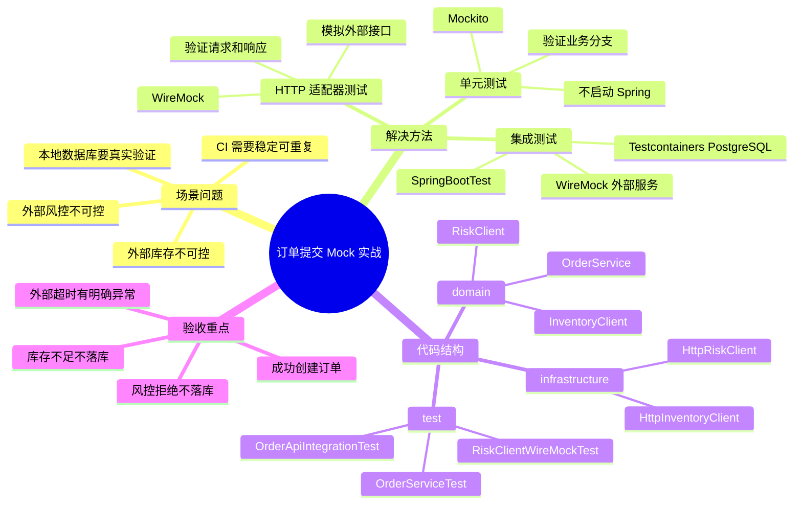

[xfg的mock案例](https://bugstack.cn/md/road-map/mock.html)
## 0. 结论先说

这个案例建议这样设计：

|测试层级|解决的问题|工具|
|---|---|---|
|**纯单元测试**|不启动 Spring，只验证业务编排逻辑|JUnit 5 + Mockito|
|**HTTP 适配器测试**|验证外部 HTTP 接口调用、异常、超时、反序列化|WireMock|
|**轻量集成测试**|验证 Controller / Service / DB / Mock 外部接口组合|Spring Boot Test + WireMock + Testcontainers|

当前 Java 后端项目里，不要把 Mock 简单理解成“造假数据”。更准确地说：

> Mock 是为了隔离不可控依赖，让业务逻辑可以被稳定、快速、可重复地验证。

Spring Boot 官方测试体系提供了测试模块和自动配置支持；WireMock 官方 Spring Boot 集成适合模拟 HTTP 依赖；Testcontainers 适合在测试里拉起真实数据库、Redis 等容器化依赖；Mockito JUnit Jupiter 是当前 JUnit 5 下常用的 Mock 方案。([Home](https://docs.spring.io/spring-boot/reference/testing/index.html?utm_source=chatgpt.com "Testing :: Spring Boot"))

---

# 1. 场景问题：订单提交依赖多个外部系统

## 1.1 业务场景

用户提交订单时，订单服务需要做三件事：

1. 查询用户是否通过风控。
    
2. 查询商品库存是否足够。
    
3. 如果都通过，创建订单。
    

真实生产里，这两个外部依赖通常不是一直稳定可用：

```text
订单服务
 ├── 调风控服务：可能超时、拒绝、返回异常
 ├── 调库存服务：可能网络失败、库存不足
 └── 写本地订单表：需要真实验证数据库行为
```

如果每次测试都依赖真实风控和库存服务，会出现几个问题：

|问题|后果|
|---|---|
|外部服务没启动|本地测试跑不起来|
|外部数据不可控|测试结果不稳定|
|网络超时|单测变慢|
|依赖环境复杂|CI 容易挂|

所以我们要做三层 Mock：



---

# 2. 解决方法：把“业务逻辑”和“外部调用”拆开

## 2.1 工程结构

```text
src/main/java/com/example/order
├── domain
│   ├── OrderService.java
│   ├── RiskClient.java
│   ├── InventoryClient.java
│   └── OrderRepository.java
├── infrastructure
│   ├── HttpRiskClient.java
│   └── HttpInventoryClient.java
├── controller
│   └── OrderController.java
└── model
    ├── CreateOrderCommand.java
    ├── Order.java
    └── OrderResult.java

src/test/java/com/example/order
├── domain
│   └── OrderServiceTest.java
├── infrastructure
│   └── HttpRiskClientTest.java
└── controller
    └── OrderApiIntegrationTest.java
```

核心原则：

```text
业务服务只依赖接口，不直接依赖 HTTP、Redis、数据库实现。
外部系统通过 Client 接口抽象出去。
测试时可以替换成 Mock。
```

---

# 3. Maven 依赖

以 Spring Boot 3.x / Java 21 为基础：

```xml
<dependencies>
    <!-- Web 接口与 RestClient 基础能力 -->
    <dependency>
        <groupId>org.springframework.boot</groupId>
        <artifactId>spring-boot-starter-web</artifactId>
    </dependency>

    <!-- JPA 示例，也可以替换成 MyBatis / MyBatis-Plus -->
    <dependency>
        <groupId>org.springframework.boot</groupId>
        <artifactId>spring-boot-starter-data-jpa</artifactId>
    </dependency>

    <!-- PostgreSQL 驱动 -->
    <dependency>
        <groupId>org.postgresql</groupId>
        <artifactId>postgresql</artifactId>
        <scope>runtime</scope>
    </dependency>

    <!-- Spring Boot 测试基础：JUnit、AssertJ、Mockito、Spring Test 等 -->
    <dependency>
        <groupId>org.springframework.boot</groupId>
        <artifactId>spring-boot-starter-test</artifactId>
        <scope>test</scope>
    </dependency>

    <!-- Mockito + JUnit Jupiter 扩展 -->
    <dependency>
        <groupId>org.mockito</groupId>
        <artifactId>mockito-junit-jupiter</artifactId>
        <scope>test</scope>
    </dependency>

    <!-- WireMock Spring Boot 集成，用来 Mock 外部 HTTP 服务 -->
    <dependency>
        <groupId>org.wiremock.integrations</groupId>
        <artifactId>wiremock-spring-boot</artifactId>
        <version>3.10.0</version>
        <scope>test</scope>
    </dependency>

    <!-- Testcontainers：测试中启动真实 PostgreSQL -->
    <dependency>
        <groupId>org.testcontainers</groupId>
        <artifactId>postgresql</artifactId>
        <scope>test</scope>
    </dependency>
</dependencies>
```

---

# 4. 业务代码

## 4.1 下单命令

```java
package com.example.order.model;

import java.math.BigDecimal;

/**
 * 用户提交订单的入参。
 * 这里故意保持简单，真实项目里通常还会有地址、优惠券、渠道、幂等号等字段。
 */
public record CreateOrderCommand(
        Long userId,
        Long skuId,
        Integer quantity,
        BigDecimal amount
) {
}
```

---

## 4.2 订单结果

```java
package com.example.order.model;

/**
 * 下单结果。
 * success=false 时，message 用来说明失败原因。
 */
public record OrderResult(
        boolean success,
        Long orderId,
        String message
) {
    public static OrderResult success(Long orderId) {
        return new OrderResult(true, orderId, "success");
    }

    public static OrderResult failed(String message) {
        return new OrderResult(false, null, message);
    }
}
```

---

## 4.3 外部风控接口抽象

```java
package com.example.order.domain;

/**
 * 风控客户端抽象。
 * 业务层只关心“是否允许下单”，不关心它是 HTTP、Dubbo、gRPC 还是 MQ 回调。
 */
public interface RiskClient {

    /**
     * @return true 表示风控通过；false 表示拒绝下单
     */
    boolean allowOrder(Long userId, Long skuId);
}
```

---

## 4.4 外部库存接口抽象

```java
package com.example.order.domain;

/**
 * 库存客户端抽象。
 * 业务层不直接依赖外部库存系统实现。
 */
public interface InventoryClient {

    /**
     * @return true 表示库存充足；false 表示库存不足
     */
    boolean hasEnoughStock(Long skuId, Integer quantity);
}
```

---

## 4.5 订单实体

```java
package com.example.order.model;

import jakarta.persistence.*;
import java.math.BigDecimal;
import java.time.LocalDateTime;

/**
 * 订单表实体。
 * 示例中只保留关键字段，避免被无关字段干扰。
 */
@Entity
@Table(name = "t_order")
public class Order {

    @Id
    @GeneratedValue(strategy = GenerationType.IDENTITY)
    private Long id;

    private Long userId;

    private Long skuId;

    private Integer quantity;

    private BigDecimal amount;

    private LocalDateTime createdAt;

    protected Order() {
        // JPA 需要无参构造
    }

    public Order(Long userId, Long skuId, Integer quantity, BigDecimal amount) {
        this.userId = userId;
        this.skuId = skuId;
        this.quantity = quantity;
        this.amount = amount;
        this.createdAt = LocalDateTime.now();
    }

    public Long getId() {
        return id;
    }
}
```

---

## 4.6 订单仓储

```java
package com.example.order.domain;

import com.example.order.model.Order;
import org.springframework.data.jpa.repository.JpaRepository;

/**
 * 示例使用 Spring Data JPA。
 * 如果你的项目用 MyBatis / MyBatis-Plus，也可以把这里换成 Mapper。
 */
public interface OrderRepository extends JpaRepository<Order, Long> {
}
```

---

## 4.7 订单服务

```java
package com.example.order.domain;

import com.example.order.model.CreateOrderCommand;
import com.example.order.model.Order;
import com.example.order.model.OrderResult;
import org.springframework.stereotype.Service;
import org.springframework.transaction.annotation.Transactional;

/**
 * 订单核心业务服务。
 *
 * 这个类是单元测试的重点：
 * - 风控拒绝：不查库存、不落库
 * - 库存不足：不落库
 * - 全部通过：创建订单
 */
@Service
public class OrderService {

    private final RiskClient riskClient;
    private final InventoryClient inventoryClient;
    private final OrderRepository orderRepository;

    public OrderService(
            RiskClient riskClient,
            InventoryClient inventoryClient,
            OrderRepository orderRepository
    ) {
        this.riskClient = riskClient;
        this.inventoryClient = inventoryClient;
        this.orderRepository = orderRepository;
    }

    @Transactional
    public OrderResult createOrder(CreateOrderCommand command) {
        // 1. 先做风控校验。风控拒绝时，直接终止流程。
        boolean riskPassed = riskClient.allowOrder(command.userId(), command.skuId());
        if (!riskPassed) {
            return OrderResult.failed("RISK_REJECTED");
        }

        // 2. 再做库存校验。库存不足时，不创建订单。
        boolean stockEnough = inventoryClient.hasEnoughStock(command.skuId(), command.quantity());
        if (!stockEnough) {
            return OrderResult.failed("STOCK_NOT_ENOUGH");
        }

        // 3. 校验通过，创建订单。
        Order order = new Order(
                command.userId(),
                command.skuId(),
                command.quantity(),
                command.amount()
        );

        Order saved = orderRepository.save(order);
        return OrderResult.success(saved.getId());
    }
}
```

---

# 5. 外部 HTTP Client 实现

## 5.1 风控 HTTP Client

```java
package com.example.order.infrastructure;

import com.example.order.domain.RiskClient;
import org.springframework.beans.factory.annotation.Value;
import org.springframework.stereotype.Component;
import org.springframework.web.client.RestClient;

/**
 * 风控 HTTP 适配器。
 *
 * 真实项目里这个类最适合用 WireMock 测：
 * - URL 是否正确
 * - 参数是否正确
 * - 响应解析是否正确
 * - 500、超时、异常响应是否处理正确
 */
@Component
public class HttpRiskClient implements RiskClient {

    private final RestClient restClient;

    public HttpRiskClient(
            RestClient.Builder builder,
            @Value("${external.risk.base-url}") String baseUrl
    ) {
        this.restClient = builder.baseUrl(baseUrl).build();
    }

    @Override
    public boolean allowOrder(Long userId, Long skuId) {
        RiskResponse response = restClient.get()
                .uri(uriBuilder -> uriBuilder
                        .path("/api/risk/order-check")
                        .queryParam("userId", userId)
                        .queryParam("skuId", skuId)
                        .build())
                .retrieve()
                .body(RiskResponse.class);

        // 外部接口异常返回 null 时，默认按风控失败处理，避免放过风险订单。
        return response != null && response.allowed();
    }

    public record RiskResponse(boolean allowed, String reason) {
    }
}
```

---

## 5.2 库存 HTTP Client

```java
package com.example.order.infrastructure;

import com.example.order.domain.InventoryClient;
import org.springframework.beans.factory.annotation.Value;
import org.springframework.stereotype.Component;
import org.springframework.web.client.RestClient;

/**
 * 库存 HTTP 适配器。
 *
 * 注意：
 * 这里仅做“查询库存是否足够”。
 * 真实订单系统里，库存扣减通常还要考虑预占、冻结、释放、最终一致性。
 */
@Component
public class HttpInventoryClient implements InventoryClient {

    private final RestClient restClient;

    public HttpInventoryClient(
            RestClient.Builder builder,
            @Value("${external.inventory.base-url}") String baseUrl
    ) {
        this.restClient = builder.baseUrl(baseUrl).build();
    }

    @Override
    public boolean hasEnoughStock(Long skuId, Integer quantity) {
        StockResponse response = restClient.get()
                .uri(uriBuilder -> uriBuilder
                        .path("/api/inventory/stock-check")
                        .queryParam("skuId", skuId)
                        .queryParam("quantity", quantity)
                        .build())
                .retrieve()
                .body(StockResponse.class);

        // 查询不到库存响应时，保守处理为库存不足。
        return response != null && response.enough();
    }

    public record StockResponse(boolean enough, Integer available) {
    }
}
```

---

# 6. Controller

```java
package com.example.order.controller;

import com.example.order.domain.OrderService;
import com.example.order.model.CreateOrderCommand;
import com.example.order.model.OrderResult;
import org.springframework.web.bind.annotation.*;

/**
 * 订单 API。
 * 集成测试可以从这个入口打进来，验证 Controller -> Service -> DB -> 外部 Mock 服务。
 */
@RestController
@RequestMapping("/api/orders")
public class OrderController {

    private final OrderService orderService;

    public OrderController(OrderService orderService) {
        this.orderService = orderService;
    }

    @PostMapping
    public OrderResult createOrder(@RequestBody CreateOrderCommand command) {
        return orderService.createOrder(command);
    }
}
```

---

# 7. 单元测试：Mockito 验证业务分支

## 7.1 风控拒绝：不查库存、不落库

```java
package com.example.order.domain;

import com.example.order.model.CreateOrderCommand;
import com.example.order.model.OrderResult;
import org.junit.jupiter.api.Test;
import org.junit.jupiter.api.extension.ExtendWith;
import org.mockito.InjectMocks;
import org.mockito.Mock;
import org.mockito.junit.jupiter.MockitoExtension;

import java.math.BigDecimal;

import static org.assertj.core.api.Assertions.assertThat;
import static org.mockito.Mockito.*;

/**
 * 纯单元测试：
 * - 不启动 Spring
 * - 不访问数据库
 * - 不发真实 HTTP 请求
 */
@ExtendWith(MockitoExtension.class)
class OrderServiceTest {

    @Mock
    private RiskClient riskClient;

    @Mock
    private InventoryClient inventoryClient;

    @Mock
    private OrderRepository orderRepository;

    @InjectMocks
    private OrderService orderService;

    @Test
    void should_reject_order_when_risk_not_passed() {
        // given
        CreateOrderCommand command = new CreateOrderCommand(
                1001L,
                2001L,
                1,
                new BigDecimal("99.00")
        );

        // 模拟风控拒绝
        when(riskClient.allowOrder(1001L, 2001L)).thenReturn(false);

        // when
        OrderResult result = orderService.createOrder(command);

        // then
        assertThat(result.success()).isFalse();
        assertThat(result.message()).isEqualTo("RISK_REJECTED");

        // 风控拒绝后，不应该继续查库存
        verifyNoInteractions(inventoryClient);

        // 风控拒绝后，不应该落库
        verifyNoInteractions(orderRepository);
    }
}
```

---

## 7.2 库存不足：不创建订单

```java
@Test
void should_reject_order_when_stock_not_enough() {
    // given
    CreateOrderCommand command = new CreateOrderCommand(
            1001L,
            2001L,
            3,
            new BigDecimal("299.00")
    );

    // 风控通过
    when(riskClient.allowOrder(1001L, 2001L)).thenReturn(true);

    // 库存不足
    when(inventoryClient.hasEnoughStock(2001L, 3)).thenReturn(false);

    // when
    OrderResult result = orderService.createOrder(command);

    // then
    assertThat(result.success()).isFalse();
    assertThat(result.message()).isEqualTo("STOCK_NOT_ENOUGH");

    // 库存不足时，不应该创建订单
    verify(orderRepository, never()).save(any());
}
```

---

## 7.3 成功创建订单

```java
@Test
void should_create_order_when_risk_passed_and_stock_enough() {
    // given
    CreateOrderCommand command = new CreateOrderCommand(
            1001L,
            2001L,
            1,
            new BigDecimal("99.00")
    );

    when(riskClient.allowOrder(1001L, 2001L)).thenReturn(true);
    when(inventoryClient.hasEnoughStock(2001L, 1)).thenReturn(true);

    // 模拟数据库保存后的订单 ID
    com.example.order.model.Order savedOrder =
            new com.example.order.model.Order(1001L, 2001L, 1, new BigDecimal("99.00"));

    // 示例简化：真实情况下 ID 由数据库生成。
    // 如果要严格验证 ID，可以改用测试专用构造器或 ReflectionTestUtils 设置 ID。
    when(orderRepository.save(any())).thenAnswer(invocation -> invocation.getArgument(0));

    // when
    OrderResult result = orderService.createOrder(command);

    // then
    assertThat(result.success()).isTrue();

    // 确认订单确实被保存了一次
    verify(orderRepository, times(1)).save(any());
}
```

这里的重点不是“Mockito 怎么写得花”，而是验证业务流程：

```text
风控拒绝 -> 不查库存 -> 不落库
库存不足 -> 不落库
全部通过 -> 落库
```

这才是 Mock 单测的价值。

---

# 8. HTTP Client 测试：WireMock 模拟外部风控服务

## 8.1 测试配置

```java
package com.example.order.infrastructure;

import com.github.tomakehurst.wiremock.client.WireMock;
import org.junit.jupiter.api.Test;
import org.springframework.beans.factory.annotation.Autowired;
import org.springframework.boot.test.context.SpringBootTest;
import org.wiremock.spring.EnableWireMock;
import org.wiremock.spring.InjectWireMock;
import org.wiremock.spring.WireMockServer;

import static com.github.tomakehurst.wiremock.client.WireMock.*;
import static org.assertj.core.api.Assertions.assertThat;

/**
 * 只验证 HttpRiskClient 这个 HTTP 适配器。
 *
 * 这里不关心订单业务，只关心：
 * - 是否请求了正确 URL
 * - 是否带了正确参数
 * - 是否正确解析外部响应
 */
@SpringBootTest(properties = {
        "external.risk.base-url=${wiremock.server.baseUrl}",
        "external.inventory.base-url=http://unused"
})
@EnableWireMock
class HttpRiskClientTest {

    @InjectWireMock
    private WireMockServer wireMockServer;

    @Autowired
    private HttpRiskClient riskClient;

    @Test
    void should_return_true_when_risk_service_allows_order() {
        // given：模拟外部风控服务返回通过
        wireMockServer.stubFor(get(urlPathEqualTo("/api/risk/order-check"))
                .withQueryParam("userId", equalTo("1001"))
                .withQueryParam("skuId", equalTo("2001"))
                .willReturn(okJson("""
                        {
                          "allowed": true,
                          "reason": "PASS"
                        }
                        """)));

        // when
        boolean allowed = riskClient.allowOrder(1001L, 2001L);

        // then
        assertThat(allowed).isTrue();

        // 额外验证：请求确实打到了 Mock 风控服务
        wireMockServer.verify(getRequestedFor(urlPathEqualTo("/api/risk/order-check"))
                .withQueryParam("userId", equalTo("1001"))
                .withQueryParam("skuId", equalTo("2001")));
    }

    @Test
    void should_return_false_when_risk_service_rejects_order() {
        // given：模拟外部风控服务拒绝
        wireMockServer.stubFor(get(urlPathEqualTo("/api/risk/order-check"))
                .willReturn(okJson("""
                        {
                          "allowed": false,
                          "reason": "BLACK_USER"
                        }
                        """)));

        // when
        boolean allowed = riskClient.allowOrder(1001L, 2001L);

        // then
        assertThat(allowed).isFalse();
    }
}
```

WireMock 的价值在这里很明显：

|测试点|Mockito 做不到或不适合|WireMock 适合|
|---|---|---|
|URL 是否正确|不适合|适合|
|Query 参数是否正确|不适合|适合|
|JSON 反序列化是否正确|不适合|适合|
|500 / 超时 / 非法 JSON|不适合|适合|
|HTTP Header / Token|不适合|适合|

---

# 9. 集成测试：真实数据库 + Mock 外部服务

这层测试用于验证完整链路：

```text
HTTP API
 -> OrderController
 -> OrderService
 -> PostgreSQL Testcontainers
 -> WireMock 风控服务
 -> WireMock 库存服务
```

Spring Boot 官方文档说明，Testcontainers 可以在测试中启动容器化依赖，并适合测试真实数据库、消息中间件等后端服务；它和 JUnit 可以集成，用于测试开始前启动容器。([Home](https://docs.spring.io/spring-boot/reference/testing/testcontainers.html?utm_source=chatgpt.com "Testcontainers :: Spring Boot"))

---

## 9.1 集成测试代码

```java
package com.example.order.controller;

import com.github.tomakehurst.wiremock.WireMockServer;
import org.junit.jupiter.api.Test;
import org.springframework.boot.test.autoconfigure.jdbc.AutoConfigureTestDatabase;
import org.springframework.boot.test.autoconfigure.web.servlet.AutoConfigureMockMvc;
import org.springframework.boot.test.context.SpringBootTest;
import org.springframework.boot.testcontainers.service.connection.ServiceConnection;
import org.springframework.test.web.servlet.MockMvc;
import org.testcontainers.containers.PostgreSQLContainer;
import org.testcontainers.junit.jupiter.Container;
import org.testcontainers.junit.jupiter.Testcontainers;
import org.wiremock.spring.EnableWireMock;
import org.wiremock.spring.InjectWireMock;

import static com.github.tomakehurst.wiremock.client.WireMock.*;
import static org.springframework.http.MediaType.APPLICATION_JSON;
import static org.springframework.test.web.servlet.request.MockMvcRequestBuilders.post;
import static org.springframework.test.web.servlet.result.MockMvcResultMatchers.*;

@Testcontainers
@SpringBootTest(properties = {
        "external.risk.base-url=${wiremock.server.baseUrl}",
        "external.inventory.base-url=${wiremock.server.baseUrl}"
})
@AutoConfigureMockMvc
@AutoConfigureTestDatabase(replace = AutoConfigureTestDatabase.Replace.NONE)
@EnableWireMock
class OrderApiIntegrationTest {

    /**
     * 使用真实 PostgreSQL 容器。
     * 这比 H2 更接近生产环境，能暴露 SQL 方言、字段类型、索引等问题。
     */
    @Container
    @ServiceConnection
    static PostgreSQLContainer<?> postgres = new PostgreSQLContainer<>("postgres:16-alpine");

    @InjectWireMock
    private WireMockServer wireMockServer;

    @Test
    void should_create_order_successfully_when_external_checks_passed(
            @org.springframework.beans.factory.annotation.Autowired MockMvc mockMvc
    ) throws Exception {
        // given：风控通过
        wireMockServer.stubFor(get(urlPathEqualTo("/api/risk/order-check"))
                .willReturn(okJson("""
                        {
                          "allowed": true,
                          "reason": "PASS"
                        }
                        """)));

        // given：库存充足
        wireMockServer.stubFor(get(urlPathEqualTo("/api/inventory/stock-check"))
                .willReturn(okJson("""
                        {
                          "enough": true,
                          "available": 100
                        }
                        """)));

        // when + then：从 HTTP API 入口发起请求
        mockMvc.perform(post("/api/orders")
                        .contentType(APPLICATION_JSON)
                        .content("""
                                {
                                  "userId": 1001,
                                  "skuId": 2001,
                                  "quantity": 1,
                                  "amount": 99.00
                                }
                                """))
                .andExpect(status().isOk())
                .andExpect(jsonPath("$.success").value(true))
                .andExpect(jsonPath("$.message").value("success"));

        // 验证外部风控接口被调用
        wireMockServer.verify(getRequestedFor(urlPathEqualTo("/api/risk/order-check")));

        // 验证外部库存接口被调用
        wireMockServer.verify(getRequestedFor(urlPathEqualTo("/api/inventory/stock-check")));
    }

    @Test
    void should_not_create_order_when_risk_rejected(
            @org.springframework.beans.factory.annotation.Autowired MockMvc mockMvc
    ) throws Exception {
        // given：风控拒绝
        wireMockServer.stubFor(get(urlPathEqualTo("/api/risk/order-check"))
                .willReturn(okJson("""
                        {
                          "allowed": false,
                          "reason": "BLACK_USER"
                        }
                        """)));

        // when + then
        mockMvc.perform(post("/api/orders")
                        .contentType(APPLICATION_JSON)
                        .content("""
                                {
                                  "userId": 1001,
                                  "skuId": 2001,
                                  "quantity": 1,
                                  "amount": 99.00
                                }
                                """))
                .andExpect(status().isOk())
                .andExpect(jsonPath("$.success").value(false))
                .andExpect(jsonPath("$.message").value("RISK_REJECTED"));

        // 风控拒绝后，不应该继续查库存
        wireMockServer.verify(0, getRequestedFor(urlPathEqualTo("/api/inventory/stock-check")));
    }
}
```

---

# 10. application-test.yml

```yaml
spring:
  jpa:
    hibernate:
      ddl-auto: create-drop
    properties:
      hibernate:
        format_sql: true

external:
  risk:
    base-url: http://localhost:18080
  inventory:
    base-url: http://localhost:18081
```

真实项目里，不建议测试代码直接依赖开发环境配置。测试环境应该通过：

```text
application-test.yml
Testcontainers
WireMock 动态端口
CI 环境变量
```

把测试环境完全隔离出来。

---

# 11. 这个案例的关键验收点

## 11.1 单元测试验收

|用例|期望|
|---|---|
|风控拒绝|返回 `RISK_REJECTED`|
|风控拒绝|不调用库存|
|风控拒绝|不保存订单|
|库存不足|返回 `STOCK_NOT_ENOUGH`|
|库存不足|不保存订单|
|全部通过|保存订单|

---

## 11.2 HTTP Mock 验收

|用例|期望|
|---|---|
|风控返回 allowed=true|Client 返回 true|
|风控返回 allowed=false|Client 返回 false|
|请求参数错误|WireMock 验证失败|
|外部返回非法 JSON|测试应暴露反序列化问题|
|外部服务 500|测试应覆盖异常处理策略|

---

## 11.3 集成测试验收

|用例|期望|
|---|---|
|风控通过 + 库存充足|下单成功|
|风控拒绝|下单失败，不查库存|
|库存不足|下单失败，不落库|
|数据库真实执行|能暴露 SQL / 表结构 / 事务问题|

---

# 12. 工程建议：什么时候用 Mockito，什么时候用 WireMock？

## 12.1 用 Mockito 的场景

```text
你只想验证业务逻辑，不关心 HTTP 细节。
```

适合：

```text
OrderService
CouponService
PaymentDomainService
RiskDecisionService
```

特点：

```text
快、稳定、不启动 Spring、适合大量业务分支测试。
```

---

## 12.2 用 WireMock 的场景

```text
你要验证当前服务如何调用外部 HTTP 服务。
```

适合：

```text
HttpRiskClient
HttpInventoryClient
HttpPaymentClient
ExternalAiClient
```

特点：

```text
能验证 URL、Header、Query、Body、状态码、超时、JSON 解析。
```

---

## 12.3 用 Testcontainers 的场景

```text
你要验证数据库、Redis、MQ 等基础设施行为。
```

适合：

```text
Repository 测试
订单落库测试
事务测试
唯一索引测试
Outbox 消息表测试
```

特点：

```text
比 H2 更接近生产，但速度比纯单元测试慢。
```

---

# 13. 最终总结

这个 Mock 案例的核心不是“学 Mockito API”，而是建立生产级测试分层思维：

```text
业务逻辑测试：Mockito
外部 HTTP 依赖测试：WireMock
真实基础设施测试：Testcontainers
完整接口链路测试：SpringBootTest + MockMvc
```

真正有价值的 Mock 工程案例，应该证明这几件事：

1. **外部依赖不可用时，核心业务仍然可以测试。**
    
2. **业务分支可以被精确验证。**
    
3. **HTTP Client 的协议细节可以被验证。**
    
4. **数据库行为不靠内存数据库糊弄。**
    
5. **CI 里测试结果稳定、可重复、可追踪。**
    

这比简单写一个 `when().thenReturn()` 更接近真实企业项目。