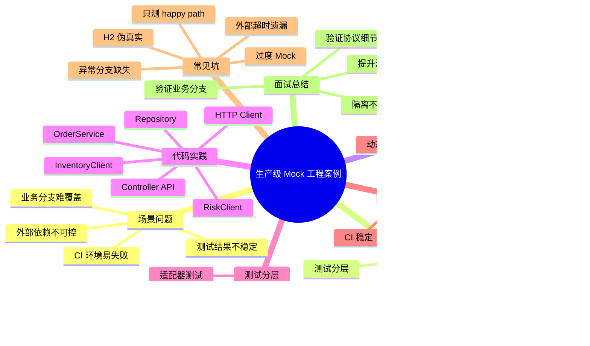
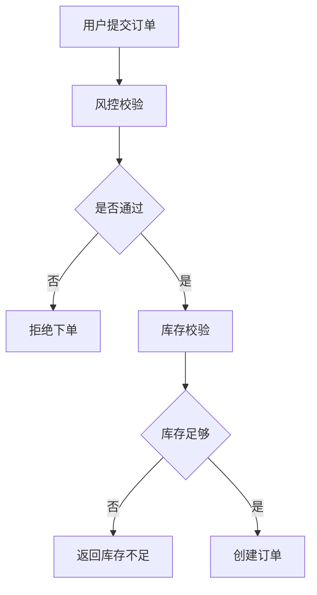
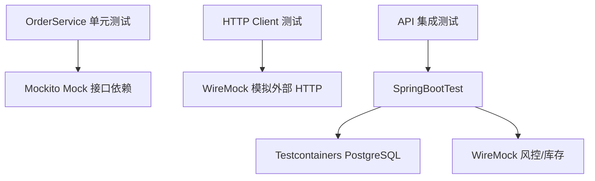
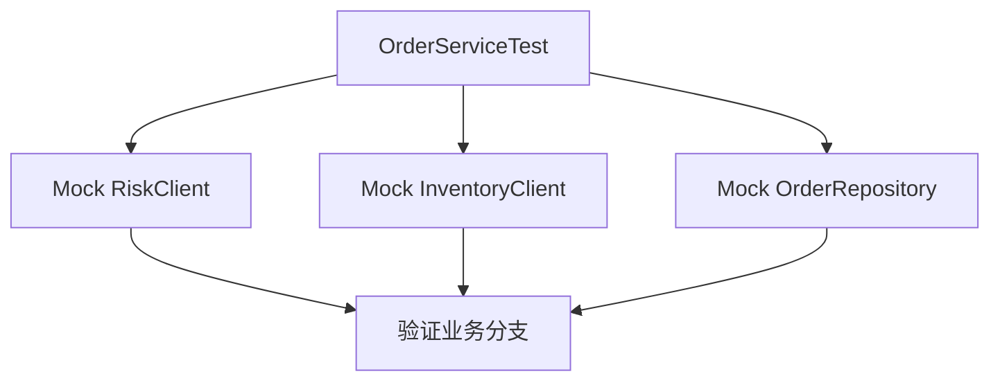
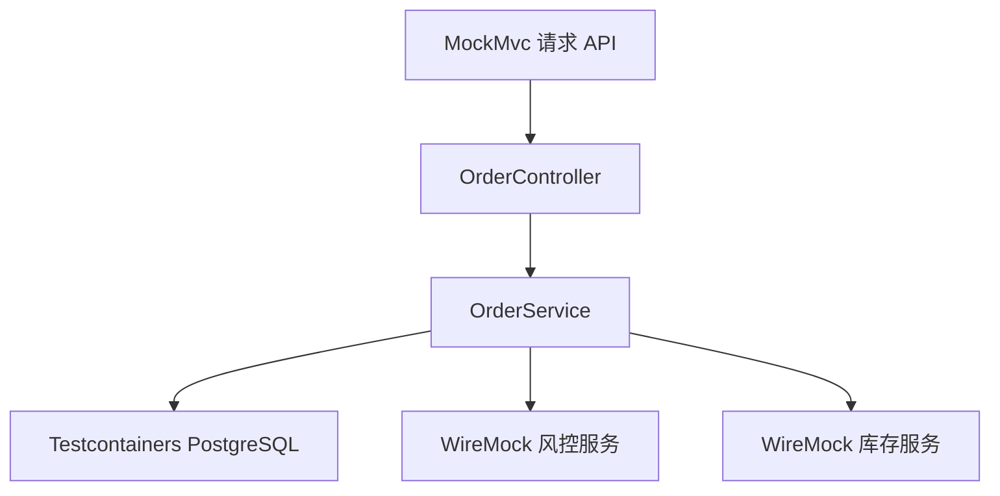

---

# 1. 场景问题：订单服务依赖风控和库存，测试很难稳定

## 1.1 业务背景

假设现在有一个订单服务。

用户提交订单时，服务需要完成：

1. 调用风控服务，判断用户是否允许下单。
    
2. 调用库存服务，判断商品库存是否足够。
    
3. 校验通过后，创建订单并写入数据库。
    

看起来很简单：



但是在真实项目里，测试这个流程会遇到几个问题。

|问题|具体表现|
|---|---|
|风控服务不可控|本地没有风控环境，CI 也不一定能访问|
|库存数据不可控|库存状态经常变化，测试结果不稳定|
|网络调用不稳定|偶发超时、500、连接失败|
|数据库行为需要验证|订单是否真正落库，不能只靠假对象|
|分支多|风控拒绝、库存不足、创建成功、外部异常都要覆盖|

所以这个案例的目标不是“学会一个 Mockito API”，而是建立一套接近生产项目的 Mock 测试体系。
基础案例可参考[xfgmock](https://bugstack.cn/md/road-map/mock.html)

---

# 2. 解决方法：业务逻辑、外部调用、基础设施分层测试

## 2.1 测试分层设计



这套设计分成三层：

|测试层级|测什么|工具|
|---|---|---|
|单元测试|业务编排逻辑|JUnit 5 + Mockito|
|HTTP 适配器测试|URL、参数、JSON、状态码|WireMock|
|集成测试|Controller → Service → DB → 外部 Mock|SpringBootTest + Testcontainers + WireMock|

核心原则：

> 业务层只依赖接口，不直接依赖 HTTP、Redis、数据库细节。  
> 外部系统通过 Client 接口隔离。  
> 测试时根据层级选择 Mockito、WireMock 或 Testcontainers。

---

# 3. 项目结构

```text
src/main/java/com/example/order
├── controller
│   └── OrderController.java
├── domain
│   ├── OrderService.java
│   ├── RiskClient.java
│   ├── InventoryClient.java
│   └── OrderRepository.java
├── infrastructure
│   ├── HttpRiskClient.java
│   └── HttpInventoryClient.java
└── model
    ├── CreateOrderCommand.java
    ├── Order.java
    └── OrderResult.java

src/test/java/com/example/order
├── domain
│   └── OrderServiceTest.java
├── infrastructure
│   └── HttpRiskClientTest.java
└── controller
    └── OrderApiIntegrationTest.java
```

---

# 4. Maven 依赖

```xml
<dependencies>
    <!-- Web API 与 RestClient 支持 -->
    <dependency>
        <groupId>org.springframework.boot</groupId>
        <artifactId>spring-boot-starter-web</artifactId>
    </dependency>

    <!-- 示例使用 JPA，真实项目中可替换成 MyBatis / MyBatis-Plus -->
    <dependency>
        <groupId>org.springframework.boot</groupId>
        <artifactId>spring-boot-starter-data-jpa</artifactId>
    </dependency>

    <!-- PostgreSQL 驱动 -->
    <dependency>
        <groupId>org.postgresql</groupId>
        <artifactId>postgresql</artifactId>
        <scope>runtime</scope>
    </dependency>

    <!-- Spring Boot 测试基础：JUnit、AssertJ、Mockito、Spring Test 等 -->
    <dependency>
        <groupId>org.springframework.boot</groupId>
        <artifactId>spring-boot-starter-test</artifactId>
        <scope>test</scope>
    </dependency>

    <!-- Mockito 与 JUnit 5 集成 -->
    <dependency>
        <groupId>org.mockito</groupId>
        <artifactId>mockito-junit-jupiter</artifactId>
        <scope>test</scope>
    </dependency>

    <!-- WireMock：模拟外部 HTTP 服务 -->
    <dependency>
        <groupId>org.wiremock.integrations</groupId>
        <artifactId>wiremock-spring-boot</artifactId>
        <version>3.10.0</version>
        <scope>test</scope>
    </dependency>

    <!-- Testcontainers：测试中启动真实 PostgreSQL -->
    <dependency>
        <groupId>org.testcontainers</groupId>
        <artifactId>postgresql</artifactId>
        <scope>test</scope>
    </dependency>
</dependencies>
```

---

# 5. 业务模型代码

## 5.1 下单命令

```java
package com.example.order.model;

import java.math.BigDecimal;

/**
 * 创建订单请求参数。
 * 真实项目中还可能包含：
 * - 幂等号 requestId
 * - 收货地址 addressId
 * - 优惠券 couponId
 * - 业务来源 channel
 */
public record CreateOrderCommand(
        Long userId,
        Long skuId,
        Integer quantity,
        BigDecimal amount
) {
}
```

---

## 5.2 下单结果

```java
package com.example.order.model;

/**
 * 订单创建结果。
 * success=false 时，通过 message 返回失败原因。
 */
public record OrderResult(
        boolean success,
        Long orderId,
        String message
) {
    public static OrderResult success(Long orderId) {
        return new OrderResult(true, orderId, "success");
    }

    public static OrderResult failed(String message) {
        return new OrderResult(false, null, message);
    }
}
```

---

## 5.3 订单实体

```java
package com.example.order.model;

import jakarta.persistence.*;

import java.math.BigDecimal;
import java.time.LocalDateTime;

/**
 * 订单实体。
 * 这里保留最少字段，突出 Mock 测试案例本身。
 */
@Entity
@Table(name = "t_order")
public class Order {

    @Id
    @GeneratedValue(strategy = GenerationType.IDENTITY)
    private Long id;

    private Long userId;

    private Long skuId;

    private Integer quantity;

    private BigDecimal amount;

    private LocalDateTime createdAt;

    protected Order() {
        // JPA 需要无参构造方法
    }

    public Order(Long userId, Long skuId, Integer quantity, BigDecimal amount) {
        this.userId = userId;
        this.skuId = skuId;
        this.quantity = quantity;
        this.amount = amount;
        this.createdAt = LocalDateTime.now();
    }

    public Long getId() {
        return id;
    }
}
```

---

# 6. 外部依赖抽象

## 6.1 风控 Client 接口

```java
package com.example.order.domain;

/**
 * 风控服务抽象。
 *
 * 业务层不关心风控服务底层是 HTTP、Dubbo、gRPC 还是 MQ。
 * 这样 OrderService 在单元测试中可以直接 Mock 这个接口。
 */
public interface RiskClient {

    /**
     * @return true 表示允许下单；false 表示风控拒绝
     */
    boolean allowOrder(Long userId, Long skuId);
}
```

---

## 6.2 库存 Client 接口

```java
package com.example.order.domain;

/**
 * 库存服务抽象。
 *
 * 这里故意只做“库存是否足够”的查询。
 * 真实电商系统中，还会有库存预占、扣减、释放、补偿等复杂动作。
 */
public interface InventoryClient {

    /**
     * @return true 表示库存充足；false 表示库存不足
     */
    boolean hasEnoughStock(Long skuId, Integer quantity);
}
```

---

## 6.3 订单仓储

```java
package com.example.order.domain;

import com.example.order.model.Order;
import org.springframework.data.jpa.repository.JpaRepository;

/**
 * 订单仓储。
 * 示例使用 JPA。
 * 如果项目中使用 MyBatis，可以替换成 OrderMapper。
 */
public interface OrderRepository extends JpaRepository<Order, Long> {
}
```

---

# 7. 核心业务代码：OrderService

```java
package com.example.order.domain;

import com.example.order.model.CreateOrderCommand;
import com.example.order.model.Order;
import com.example.order.model.OrderResult;
import org.springframework.stereotype.Service;
import org.springframework.transaction.annotation.Transactional;

/**
 * 订单核心业务服务。
 *
 * 这个类是 Mockito 单元测试的重点。
 * 需要验证：
 * 1. 风控拒绝时，不查库存、不落库。
 * 2. 库存不足时，不落库。
 * 3. 风控和库存都通过时，创建订单。
 */
@Service
public class OrderService {

    private final RiskClient riskClient;
    private final InventoryClient inventoryClient;
    private final OrderRepository orderRepository;

    public OrderService(
            RiskClient riskClient,
            InventoryClient inventoryClient,
            OrderRepository orderRepository
    ) {
        this.riskClient = riskClient;
        this.inventoryClient = inventoryClient;
        this.orderRepository = orderRepository;
    }

    @Transactional
    public OrderResult createOrder(CreateOrderCommand command) {
        // 1. 风控校验：风控拒绝时，直接返回失败，不继续执行后续逻辑
        boolean riskPassed = riskClient.allowOrder(command.userId(), command.skuId());
        if (!riskPassed) {
            return OrderResult.failed("RISK_REJECTED");
        }

        // 2. 库存校验：库存不足时，不创建订单
        boolean stockEnough = inventoryClient.hasEnoughStock(
                command.skuId(),
                command.quantity()
        );

        if (!stockEnough) {
            return OrderResult.failed("STOCK_NOT_ENOUGH");
        }

        // 3. 创建订单：只有所有前置校验通过，才允许落库
        Order order = new Order(
                command.userId(),
                command.skuId(),
                command.quantity(),
                command.amount()
        );

        Order savedOrder = orderRepository.save(order);

        return OrderResult.success(savedOrder.getId());
    }
}
```

---

# 8. 外部 HTTP 实现

## 8.1 风控 HTTP Client

```java
package com.example.order.infrastructure;

import com.example.order.domain.RiskClient;
import org.springframework.beans.factory.annotation.Value;
import org.springframework.stereotype.Component;
import org.springframework.web.client.RestClient;

/**
 * 风控 HTTP 适配器。
 *
 * 这个类不适合只用 Mockito 测。
 * 因为它真正需要验证的是：
 * - 请求路径是否正确
 * - Query 参数是否正确
 * - JSON 反序列化是否正确
 * - 外部服务异常时如何处理
 */
@Component
public class HttpRiskClient implements RiskClient {

    private final RestClient restClient;

    public HttpRiskClient(
            RestClient.Builder builder,
            @Value("${external.risk.base-url}") String baseUrl
    ) {
        this.restClient = builder.baseUrl(baseUrl).build();
    }

    @Override
    public boolean allowOrder(Long userId, Long skuId) {
        RiskResponse response = restClient.get()
                .uri(uriBuilder -> uriBuilder
                        .path("/api/risk/order-check")
                        .queryParam("userId", userId)
                        .queryParam("skuId", skuId)
                        .build())
                .retrieve()
                .body(RiskResponse.class);

        // 风控响应为空时，保守处理为不允许下单
        return response != null && response.allowed();
    }

    /**
     * 风控服务响应模型。
     */
    public record RiskResponse(
            boolean allowed,
            String reason
    ) {
    }
}
```

---

## 8.2 库存 HTTP Client

```java
package com.example.order.infrastructure;

import com.example.order.domain.InventoryClient;
import org.springframework.beans.factory.annotation.Value;
import org.springframework.stereotype.Component;
import org.springframework.web.client.RestClient;

/**
 * 库存 HTTP 适配器。
 *
 * 这里仅做库存查询。
 * 真实项目中库存扣减应由库存服务自己保证一致性。
 */
@Component
public class HttpInventoryClient implements InventoryClient {

    private final RestClient restClient;

    public HttpInventoryClient(
            RestClient.Builder builder,
            @Value("${external.inventory.base-url}") String baseUrl
    ) {
        this.restClient = builder.baseUrl(baseUrl).build();
    }

    @Override
    public boolean hasEnoughStock(Long skuId, Integer quantity) {
        StockResponse response = restClient.get()
                .uri(uriBuilder -> uriBuilder
                        .path("/api/inventory/stock-check")
                        .queryParam("skuId", skuId)
                        .queryParam("quantity", quantity)
                        .build())
                .retrieve()
                .body(StockResponse.class);

        // 库存响应为空时，保守处理为库存不足
        return response != null && response.enough();
    }

    /**
     * 库存服务响应模型。
     */
    public record StockResponse(
            boolean enough,
            Integer available
    ) {
    }
}
```

---

# 9. Controller 入口

```java
package com.example.order.controller;

import com.example.order.domain.OrderService;
import com.example.order.model.CreateOrderCommand;
import com.example.order.model.OrderResult;
import org.springframework.web.bind.annotation.*;

/**
 * 订单 API。
 *
 * 集成测试可以从这个入口打进来，
 * 验证 Controller -> Service -> Repository -> 外部 Mock 服务的完整链路。
 */
@RestController
@RequestMapping("/api/orders")
public class OrderController {

    private final OrderService orderService;

    public OrderController(OrderService orderService) {
        this.orderService = orderService;
    }

    @PostMapping
    public OrderResult createOrder(@RequestBody CreateOrderCommand command) {
        return orderService.createOrder(command);
    }
}
```

---

# 10. 单元测试：Mockito 验证业务分支

## 10.1 测试目标

OrderService 单元测试只关心业务逻辑。

不启动 Spring。

不访问数据库。

不发送 HTTP 请求。



---

## 10.2 风控拒绝：不查库存、不落库

```java
package com.example.order.domain;

import com.example.order.model.CreateOrderCommand;
import com.example.order.model.OrderResult;
import org.junit.jupiter.api.Test;
import org.junit.jupiter.api.extension.ExtendWith;
import org.mockito.InjectMocks;
import org.mockito.Mock;
import org.mockito.junit.jupiter.MockitoExtension;

import java.math.BigDecimal;

import static org.assertj.core.api.Assertions.assertThat;
import static org.mockito.Mockito.*;

/**
 * OrderService 纯单元测试。
 *
 * 这里不启动 Spring 容器。
 * 目的就是快速、稳定地验证业务分支。
 */
@ExtendWith(MockitoExtension.class)
class OrderServiceTest {

    @Mock
    private RiskClient riskClient;

    @Mock
    private InventoryClient inventoryClient;

    @Mock
    private OrderRepository orderRepository;

    @InjectMocks
    private OrderService orderService;

    @Test
    void should_reject_order_when_risk_not_passed() {
        // given：构造下单请求
        CreateOrderCommand command = new CreateOrderCommand(
                1001L,
                2001L,
                1,
                new BigDecimal("99.00")
        );

        // given：模拟风控拒绝
        when(riskClient.allowOrder(1001L, 2001L)).thenReturn(false);

        // when：执行下单
        OrderResult result = orderService.createOrder(command);

        // then：下单失败，原因是风控拒绝
        assertThat(result.success()).isFalse();
        assertThat(result.message()).isEqualTo("RISK_REJECTED");

        // then：风控拒绝后，不应该继续查询库存
        verifyNoInteractions(inventoryClient);

        // then：风控拒绝后，不应该创建订单
        verifyNoInteractions(orderRepository);
    }
}
```

---

## 10.3 库存不足：不创建订单

```java
@Test
void should_reject_order_when_stock_not_enough() {
    // given：构造下单请求
    CreateOrderCommand command = new CreateOrderCommand(
            1001L,
            2001L,
            3,
            new BigDecimal("299.00")
    );

    // given：风控通过
    when(riskClient.allowOrder(1001L, 2001L)).thenReturn(true);

    // given：库存不足
    when(inventoryClient.hasEnoughStock(2001L, 3)).thenReturn(false);

    // when：执行下单
    OrderResult result = orderService.createOrder(command);

    // then：下单失败，原因是库存不足
    assertThat(result.success()).isFalse();
    assertThat(result.message()).isEqualTo("STOCK_NOT_ENOUGH");

    // then：库存不足时，不应该保存订单
    verify(orderRepository, never()).save(any());
}
```

---

## 10.4 校验通过：创建订单

```java
@Test
void should_create_order_when_risk_passed_and_stock_enough() {
    // given：构造下单请求
    CreateOrderCommand command = new CreateOrderCommand(
            1001L,
            2001L,
            1,
            new BigDecimal("99.00")
    );

    // given：风控通过
    when(riskClient.allowOrder(1001L, 2001L)).thenReturn(true);

    // given：库存充足
    when(inventoryClient.hasEnoughStock(2001L, 1)).thenReturn(true);

    // given：模拟数据库保存行为
    when(orderRepository.save(any())).thenAnswer(invocation -> invocation.getArgument(0));

    // when：执行下单
    OrderResult result = orderService.createOrder(command);

    // then：下单成功
    assertThat(result.success()).isTrue();

    // then：订单保存一次
    verify(orderRepository, times(1)).save(any());
}
```

---

# 11. HTTP Client 测试：WireMock 模拟外部接口

## 11.1 为什么不用 Mockito 测 HTTP Client？

HttpRiskClient 的重点不是“返回 true 还是 false”这么简单。

它真正需要验证：

|验证点|说明|
|---|---|
|URL|是否请求 `/api/risk/order-check`|
|Query|是否传递 `userId`、`skuId`|
|JSON|是否能正确解析响应|
|状态码|500、404 时如何处理|
|超时|外部服务慢响应时如何处理|

这些都是 HTTP 协议层面的测试，适合 WireMock。

---

## 11.2 WireMock 测试风控 Client

```java
package com.example.order.infrastructure;

import org.junit.jupiter.api.Test;
import org.springframework.beans.factory.annotation.Autowired;
import org.springframework.boot.test.context.SpringBootTest;
import org.wiremock.spring.EnableWireMock;
import org.wiremock.spring.InjectWireMock;
import org.wiremock.spring.WireMockServer;

import static com.github.tomakehurst.wiremock.client.WireMock.*;
import static org.assertj.core.api.Assertions.assertThat;

/**
 * HttpRiskClient 测试。
 *
 * 测试目标：
 * - 不依赖真实风控服务
 * - 用 WireMock 模拟外部 HTTP 响应
 * - 验证请求路径、参数、响应解析
 */
@SpringBootTest(properties = {
        "external.risk.base-url=${wiremock.server.baseUrl}",
        "external.inventory.base-url=http://unused"
})
@EnableWireMock
class HttpRiskClientTest {

    @InjectWireMock
    private WireMockServer wireMockServer;

    @Autowired
    private HttpRiskClient riskClient;

    @Test
    void should_return_true_when_risk_service_allows_order() {
        // given：模拟风控服务返回通过
        wireMockServer.stubFor(get(urlPathEqualTo("/api/risk/order-check"))
                .withQueryParam("userId", equalTo("1001"))
                .withQueryParam("skuId", equalTo("2001"))
                .willReturn(okJson("""
                        {
                          "allowed": true,
                          "reason": "PASS"
                        }
                        """)));

        // when：调用风控 Client
        boolean allowed = riskClient.allowOrder(1001L, 2001L);

        // then：解析结果为 true
        assertThat(allowed).isTrue();

        // then：确认请求路径和参数正确
        wireMockServer.verify(getRequestedFor(urlPathEqualTo("/api/risk/order-check"))
                .withQueryParam("userId", equalTo("1001"))
                .withQueryParam("skuId", equalTo("2001")));
    }

    @Test
    void should_return_false_when_risk_service_rejects_order() {
        // given：模拟风控服务拒绝
        wireMockServer.stubFor(get(urlPathEqualTo("/api/risk/order-check"))
                .withQueryParam("userId", equalTo("1001"))
                .withQueryParam("skuId", equalTo("2001"))
                .willReturn(okJson("""
                        {
                          "allowed": false,
                          "reason": "BLACK_USER"
                        }
                        """)));

        // when
        boolean allowed = riskClient.allowOrder(1001L, 2001L);

        // then
        assertThat(allowed).isFalse();
    }
}
```

---

# 12. 集成测试：SpringBootTest + PostgreSQL + WireMock

## 12.1 集成测试目标

这层测试验证完整链路：



重点不是追求“全链路真实”，而是：

|部分|测试策略|
|---|---|
|当前服务代码|真实运行|
|数据库|Testcontainers 真实 PostgreSQL|
|外部风控|WireMock 模拟|
|外部库存|WireMock 模拟|
|HTTP API|MockMvc 请求入口|

---

## 12.2 集成测试代码

```java
package com.example.order.controller;

import com.github.tomakehurst.wiremock.WireMockServer;
import org.junit.jupiter.api.Test;
import org.springframework.boot.test.autoconfigure.jdbc.AutoConfigureTestDatabase;
import org.springframework.boot.test.autoconfigure.web.servlet.AutoConfigureMockMvc;
import org.springframework.boot.test.context.SpringBootTest;
import org.springframework.boot.testcontainers.service.connection.ServiceConnection;
import org.springframework.test.web.servlet.MockMvc;
import org.testcontainers.containers.PostgreSQLContainer;
import org.testcontainers.junit.jupiter.Container;
import org.testcontainers.junit.jupiter.Testcontainers;
import org.wiremock.spring.EnableWireMock;
import org.wiremock.spring.InjectWireMock;

import static com.github.tomakehurst.wiremock.client.WireMock.*;
import static org.springframework.http.MediaType.APPLICATION_JSON;
import static org.springframework.test.web.servlet.request.MockMvcRequestBuilders.post;
import static org.springframework.test.web.servlet.result.MockMvcResultMatchers.*;

/**
 * 订单 API 集成测试。
 *
 * 当前服务真实启动：
 * - Controller 真实
 * - Service 真实
 * - Repository 真实
 * - PostgreSQL 真实容器
 *
 * 外部服务用 WireMock 替代：
 * - 风控服务
 * - 库存服务
 */
@Testcontainers
@SpringBootTest(properties = {
        "external.risk.base-url=${wiremock.server.baseUrl}",
        "external.inventory.base-url=${wiremock.server.baseUrl}"
})
@AutoConfigureMockMvc
@AutoConfigureTestDatabase(replace = AutoConfigureTestDatabase.Replace.NONE)
@EnableWireMock
class OrderApiIntegrationTest {

    /**
     * 使用真实 PostgreSQL 容器。
     * 这样可以避免 H2 和生产数据库 SQL 方言不一致的问题。
     */
    @Container
    @ServiceConnection
    static PostgreSQLContainer<?> postgres =
            new PostgreSQLContainer<>("postgres:16-alpine");

    @InjectWireMock
    private WireMockServer wireMockServer;

    @Test
    void should_create_order_successfully_when_external_checks_passed(
            @org.springframework.beans.factory.annotation.Autowired MockMvc mockMvc
    ) throws Exception {
        // given：风控服务返回通过
        wireMockServer.stubFor(get(urlPathEqualTo("/api/risk/order-check"))
                .willReturn(okJson("""
                        {
                          "allowed": true,
                          "reason": "PASS"
                        }
                        """)));

        // given：库存服务返回库存充足
        wireMockServer.stubFor(get(urlPathEqualTo("/api/inventory/stock-check"))
                .willReturn(okJson("""
                        {
                          "enough": true,
                          "available": 100
                        }
                        """)));

        // when + then：从 API 入口发起下单请求
        mockMvc.perform(post("/api/orders")
                        .contentType(APPLICATION_JSON)
                        .content("""
                                {
                                  "userId": 1001,
                                  "skuId": 2001,
                                  "quantity": 1,
                                  "amount": 99.00
                                }
                                """))
                .andExpect(status().isOk())
                .andExpect(jsonPath("$.success").value(true))
                .andExpect(jsonPath("$.message").value("success"));

        // then：确认风控服务被调用
        wireMockServer.verify(getRequestedFor(urlPathEqualTo("/api/risk/order-check")));

        // then：确认库存服务被调用
        wireMockServer.verify(getRequestedFor(urlPathEqualTo("/api/inventory/stock-check")));
    }

    @Test
    void should_not_create_order_when_risk_rejected(
            @org.springframework.beans.factory.annotation.Autowired MockMvc mockMvc
    ) throws Exception {
        // given：风控服务返回拒绝
        wireMockServer.stubFor(get(urlPathEqualTo("/api/risk/order-check"))
                .willReturn(okJson("""
                        {
                          "allowed": false,
                          "reason": "BLACK_USER"
                        }
                        """)));

        // when + then：提交订单
        mockMvc.perform(post("/api/orders")
                        .contentType(APPLICATION_JSON)
                        .content("""
                                {
                                  "userId": 1001,
                                  "skuId": 2001,
                                  "quantity": 1,
                                  "amount": 99.00
                                }
                                """))
                .andExpect(status().isOk())
                .andExpect(jsonPath("$.success").value(false))
                .andExpect(jsonPath("$.message").value("RISK_REJECTED"));

        // then：风控拒绝后，不应该继续调用库存服务
        wireMockServer.verify(0, getRequestedFor(urlPathEqualTo("/api/inventory/stock-check")));
    }

    @Test
    void should_not_create_order_when_stock_not_enough(
            @org.springframework.beans.factory.annotation.Autowired MockMvc mockMvc
    ) throws Exception {
        // given：风控通过
        wireMockServer.stubFor(get(urlPathEqualTo("/api/risk/order-check"))
                .willReturn(okJson("""
                        {
                          "allowed": true,
                          "reason": "PASS"
                        }
                        """)));

        // given：库存不足
        wireMockServer.stubFor(get(urlPathEqualTo("/api/inventory/stock-check"))
                .willReturn(okJson("""
                        {
                          "enough": false,
                          "available": 0
                        }
                        """)));

        // when + then：提交订单
        mockMvc.perform(post("/api/orders")
                        .contentType(APPLICATION_JSON)
                        .content("""
                                {
                                  "userId": 1001,
                                  "skuId": 2001,
                                  "quantity": 2,
                                  "amount": 199.00
                                }
                                """))
                .andExpect(status().isOk())
                .andExpect(jsonPath("$.success").value(false))
                .andExpect(jsonPath("$.message").value("STOCK_NOT_ENOUGH"));

        // then：风控和库存都应该被调用
        wireMockServer.verify(getRequestedFor(urlPathEqualTo("/api/risk/order-check")));
        wireMockServer.verify(getRequestedFor(urlPathEqualTo("/api/inventory/stock-check")));
    }
}
```

---

# 13. 测试配置

```yaml
spring:
  jpa:
    hibernate:
      ddl-auto: create-drop
    properties:
      hibernate:
        format_sql: true

external:
  risk:
    base-url: http://localhost:18080
  inventory:
    base-url: http://localhost:18081
```

真实项目中要注意：

|配置项|建议|
|---|---|
|外部服务地址|测试环境中用 WireMock 动态地址覆盖|
|数据库|不建议用开发库跑自动化测试|
|ddl-auto|测试环境可以 create-drop，生产不能这样配|
|测试数据|每个测试用例保持隔离|
|CI|测试不应该依赖本机环境|

---

# 14. 生产级 Mock 的几个关键点

## 14.1 不要所有东西都 Mockito

Mockito 适合测业务分支。

但是它不适合验证 HTTP 细节。

错误示例：

```java
// 这种测试只能证明你 mock 了一个返回值，不能证明 HTTP 请求真的写对了
when(riskClient.allowOrder(1001L, 2001L)).thenReturn(true);
```

如果要验证外部 HTTP 调用，要用 WireMock。

---

## 14.2 不要把 H2 当成生产数据库

很多项目喜欢用 H2 做集成测试。

问题是：

|问题|说明|
|---|---|
|SQL 方言不同|PostgreSQL / MySQL 的语法 H2 不一定一致|
|索引行为不同|真实执行计划无法验证|
|字段类型不同|JSON、时间、枚举、数组等容易失真|
|锁行为不同|并发和事务测试意义有限|

更稳妥的方案是 Testcontainers 启动真实数据库。

---

## 14.3 不要只测成功路径

订单场景至少要测这些：

|用例|预期|
|---|---|
|风控通过 + 库存充足|创建订单|
|风控拒绝|不查库存，不落库|
|库存不足|不落库|
|风控服务 500|返回明确异常或降级结果|
|库存服务超时|返回明确异常或降级结果|
|JSON 格式异常|不应该产生脏订单|

---

## 14.4 Mock 不是越多越好

过度 Mock 会让测试变成“自娱自乐”。

坏味道：

```text
一个测试里 mock 了 10 个对象
测试代码比业务代码还复杂
测试只验证实现细节，不验证业务结果
重构一下代码，测试全部挂掉
```

好的测试应该优先验证：

```text
输入是什么
结果是什么
关键副作用是什么
不应该发生什么
```

比如：

```text
风控拒绝时，不应该查库存。
库存不足时，不应该保存订单。
创建成功时，订单应该落库。
```

---

# 15. 这个案例的验收清单

## 15.1 单元测试验收

|用例|是否必须|
|---|---|
|风控拒绝|必须|
|风控拒绝后不查库存|必须|
|风控拒绝后不落库|必须|
|库存不足|必须|
|库存不足后不落库|必须|
|校验通过创建订单|必须|

---

## 15.2 HTTP Mock 验收

|用例|是否必须|
|---|---|
|URL 正确|必须|
|Query 参数正确|必须|
|JSON 解析正确|必须|
|业务拒绝响应|必须|
|500 异常响应|建议|
|超时响应|建议|

---

## 15.3 集成测试验收

|用例|是否必须|
|---|---|
|API 下单成功|必须|
|风控拒绝 API 返回失败|必须|
|库存不足 API 返回失败|必须|
|数据库真实写入|必须|
|外部服务用 Mock 替代|必须|
|CI 可重复执行|必须|

---

# 16. 面试表达

可以这样讲：

> 我们在项目里不会简单地把 Mock 当成造假数据，而是把它作为测试分层和依赖隔离手段。  
> 对纯业务服务，比如 OrderService，我会用 Mockito Mock 掉 RiskClient、InventoryClient 和 Repository，重点验证业务分支，比如风控拒绝时不能继续查库存，库存不足时不能创建订单。  
> 对外部 HTTP 适配器，我不会只用 Mockito，因为那样验证不了 URL、Query 参数、Header 和 JSON 反序列化。我会用 WireMock 模拟外部服务，验证协议细节。  
> 对涉及数据库的链路，我倾向于用 Testcontainers 启动真实 PostgreSQL，而不是用 H2 代替生产数据库，避免 SQL 方言、字段类型和事务行为失真。  
> 最后在 CI 中跑 SpringBootTest + WireMock + Testcontainers，保证测试稳定、可重复，并且不依赖外部环境。

---

# 17. 总结

这篇 Mock 案例的核心可以压缩成一句话：

> 用 Mockito 隔离业务依赖，用 WireMock 模拟外部 HTTP，用 Testcontainers 验证真实基础设施，用 SpringBootTest 串起关键链路。

最终形成的测试分层是：

```text
OrderService 单元测试
    -> Mockito
    -> 验证业务分支

HttpRiskClient / HttpInventoryClient 测试
    -> WireMock
    -> 验证 HTTP 协议细节

OrderController 集成测试
    -> SpringBootTest
    -> Testcontainers PostgreSQL
    -> WireMock 外部服务
    -> 验证 API 到数据库的核心链路
```

真正的生产级 Mock，不是为了让测试“看起来通过”，而是为了让测试在复杂依赖环境下仍然稳定、可信、可重复。