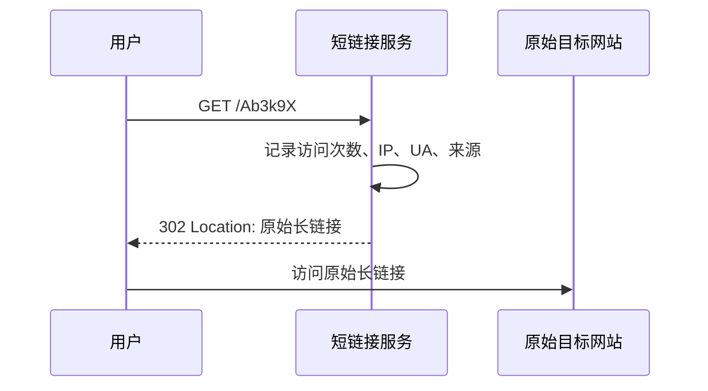
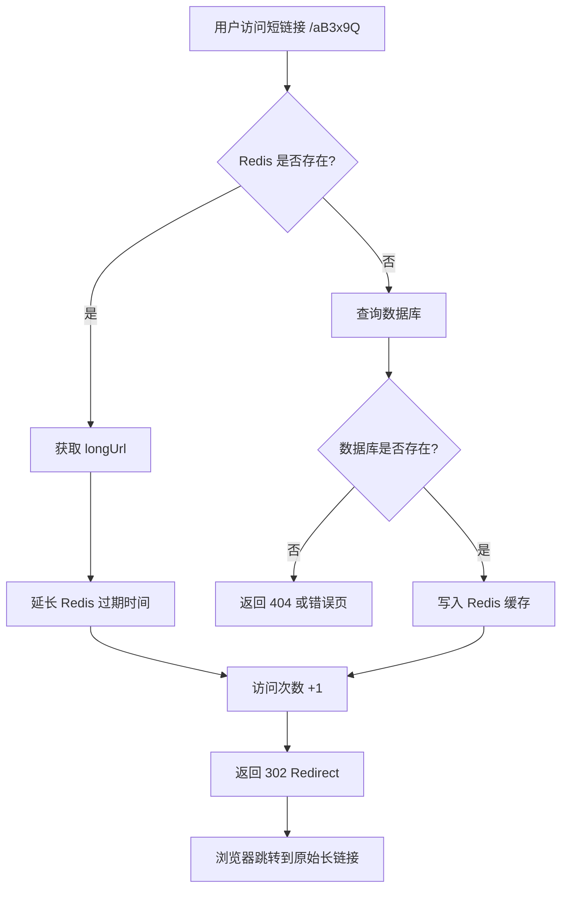
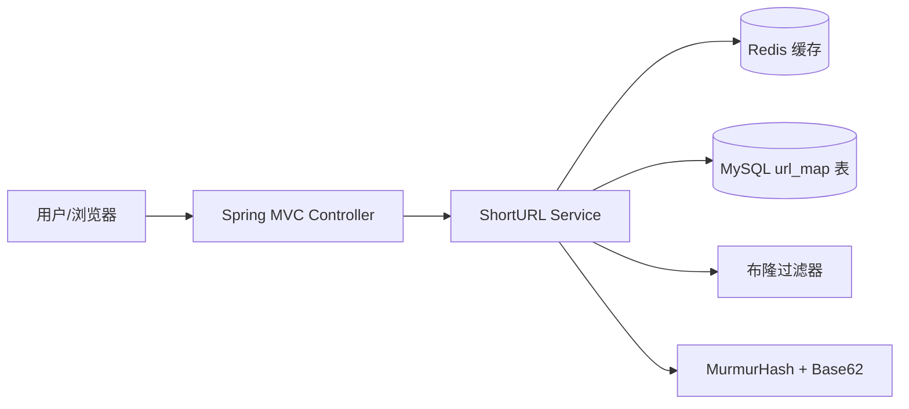
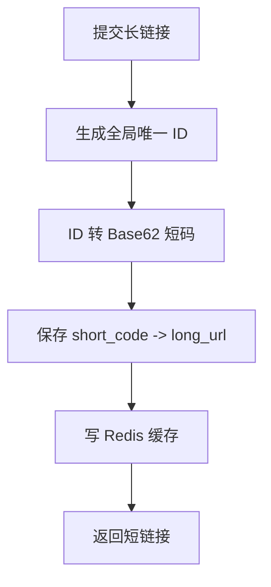

项目来源：https://github.com/Naccl/ShortURL

## 结论先说

`Naccl/ShortURL` 是一个典型的**短链接服务**：

> 输入一个长链接：  
> `https://example.com/article/detail?id=123456&utm_source=xxx&utm_campaign=yyy...`
> 
> 生成一个短链接：  
> `https://dwz.xxx/aB3x9Q`
> 
> 用户访问短链接时，服务端返回 **302 Redirect**，浏览器再跳转到原始长链接。

这个项目 README 明确写了：它的核心行为是“长链接生成短链接，访问短链接 302 重定向至原始长链接”。技术栈包括 Spring Boot MVC、Thymeleaf、MyBatis、Redis、Hutool 的 Hash 算法和布隆过滤器。([GitHub](https://github.com/Naccl/ShortURL "GitHub - Naccl/ShortURL:  短链接生成器，长网址转短网址 · GitHub"))

---

# 一、为什么要把长链接生成短链接？

## 1. 链接更短，方便传播

长链接常见于：

```text
https://example.com/product/detail?id=10086&utm_source=wechat&utm_medium=group&utm_campaign=spring_sale&tracking_id=abcxyz...
```

这种链接在短信、微博、微信、邮件、二维码里都不友好。

短链接可以变成：

```text
https://s.xxx/Ab3k9X
```

优势很直接：

- 更容易复制、展示、传播；
    
- 二维码更简单，识别率更高；
    
- 短信、推文等字符受限场景更合适；
    
- 对用户更“干净”，不会暴露一堆营销参数。
    

---

## 2. 可以统计点击数据

如果直接发原始长链接，用户点了多少次、什么时间点、从哪里来，服务端不一定知道。

短链接服务变成中间层后，流程是：



所以短链接不仅是“缩短 URL”，更是一个**流量入口控制点**。

可以统计：

- 点击次数；
    
- 独立访客；
    
- 地域；
    
- 设备；
    
- 浏览器；
    
- 来源渠道；
    
- 活动转化。
    

这个项目的数据库表里也有 `views` 字段，用来记录访问次数。([GitHub](https://github.com/Naccl/ShortURL/blob/master/dwz.sql "ShortURL/dwz.sql at master · Naccl/ShortURL · GitHub"))

---

## 3. 可以动态修改跳转目标

例如你发出去一个短链接：

```text
https://s.xxx/spring-sale
```

一开始跳转到 A 页面，后来活动页面迁移了，可以把它改成跳转到 B 页面。

如果发的是原始长链接，已经传播出去后就很难改。

短链接的本质是：

```text
短码 -> 长链接
```

只要服务端维护这个映射关系，就可以调整目标地址。

---

## 4. 可以做风控和治理

短链接服务可以在跳转前做一些控制：

- 链接是否过期；
    
- 链接是否被禁用；
    
- 是否命中黑名单；
    
- 是否需要登录；
    
- 是否需要地域限制；
    
- 是否需要防刷；
    
- 是否是恶意链接。
    

所以工业级短链接服务一般不是一个简单工具，而是一个**链接网关**。

---

# 二、这个项目具体是怎么做的？

根据 README，这个项目的生成逻辑是：

> 使用 MurmurHash 把原始长链接 hash 成 32 位散列值，再把散列值转成 62 进制字符串，作为短链接；生成后加入布隆过滤器，并写入 Redis 缓存；用户访问短链接时，优先查 Redis，命中则续期，未命中则查数据库，再写回缓存，然后 302 重定向到原始长链接。([GitHub](https://github.com/Naccl/ShortURL "GitHub - Naccl/ShortURL:  短链接生成器，长网址转短网址 · GitHub"))

可以拆成两个流程。

---

# 三、生成短链接流程

## 1. 用户提交长链接

例如：

```text
https://www.example.com/article/123456?utm_source=wechat
```

后端接收到这个长链接。

---

## 2. 对长链接做 Hash

项目使用的是 **MurmurHash**。

它不是加密算法，而是非加密 Hash 算法。项目 README 也说明了选择原因：短链接场景不需要解密，更关心运算速度和冲突概率；MurmurHash 相比 MD5、SHA 等常见 Hash 函数，在性能和随机分布特征上更适合该场景。([GitHub](https://github.com/Naccl/ShortURL "GitHub - Naccl/ShortURL:  短链接生成器，长网址转短网址 · GitHub"))

概念上类似：

```java
int hash = MurmurHash.hash32(longUrl);
```

得到一个 32-bit 整数。

32-bit 大约可以表达：

```text
2^32 = 4,294,967,296
```

也就是约 43 亿个不同值。

---

## 3. 把十进制 Hash 转成 Base62

如果直接用十进制数字，可能是：

```text
3849281042
```

还是有点长。

Base62 使用：

```text
0-9
a-z
A-Z
```

共 62 个字符。

所以可以把数字压缩成更短的字符串，例如：

```text
3849281042 -> aB3x9Q
```

项目 README 也写到：MurmurHash 生成的十进制数最长 10 位，转成 62 进制后最长约 6 个字符。([GitHub](https://github.com/Naccl/ShortURL "GitHub - Naccl/ShortURL:  短链接生成器，长网址转短网址 · GitHub"))

于是短链接变成：

```text
https://your-domain.com/aB3x9Q
```

---

## 4. 处理 Hash 冲突

Hash 一定可能冲突。

也就是说：

```text
longUrlA -> aB3x9Q
longUrlB -> aB3x9Q
```

两个不同长链接可能生成同一个短码。

这个项目用 **布隆过滤器**做快速判断：生成短码后，先查布隆过滤器中是否已经存在。如果存在，就在长链接后添加一个自定义字符串，重新 Hash，直到生成一个没有冲突的短码。README 对这一点有明确说明。([GitHub](https://github.com/Naccl/ShortURL "GitHub - Naccl/ShortURL:  短链接生成器，长网址转短网址 · GitHub"))

伪代码大概是：

```java
String generateShortCode(String longUrl) {
    String candidate = longUrl;

    while (true) {
        int hash = murmurHash32(candidate);
        String shortCode = base62(hash);

        if (!bloomFilter.contains(shortCode)) {
            bloomFilter.add(shortCode);
            return shortCode;
        }

        candidate = candidate + randomSalt();
    }
}
```

不过这里要注意：**布隆过滤器有误判率**。

布隆过滤器的特点是：

```text
它说不存在：一定不存在
它说存在：可能存在，也可能是误判
```

所以严谨的工业实现里，最终还是需要数据库唯一索引兜底。

这个项目的 `url_map` 表中，`surl` 字段有唯一索引，这就是数据库层面的最后防线。([GitHub](https://github.com/Naccl/ShortURL/blob/master/dwz.sql "ShortURL/dwz.sql at master · Naccl/ShortURL · GitHub"))

---

## 5. 保存映射关系

数据库表结构大概是：

```sql
CREATE TABLE `url_map` (
  `id` bigint NOT NULL AUTO_INCREMENT,
  `surl` varchar(255) NOT NULL COMMENT '短链接',
  `lurl` varchar(1000) NOT NULL COMMENT '长链接',
  `views` int NOT NULL COMMENT '访问次数',
  `create_time` datetime NOT NULL COMMENT '创建时间',
  PRIMARY KEY (`id`),
  UNIQUE INDEX `surl`(`surl`)
);
```

核心字段就是：

|字段|含义|
|---|---|
|`surl`|短链接码|
|`lurl`|原始长链接|
|`views`|访问次数|
|`create_time`|创建时间|

项目源码里的 `UrlMap` 实体也对应这些字段：`surl`、`lurl`、`views`、`createTime`。([GitHub](https://raw.githubusercontent.com/Naccl/ShortURL/master/src/main/java/top/naccl/dwz/entity/UrlMap.java "raw.githubusercontent.com"))

---

## 6. 写入 Redis 缓存

短链接一般有明显的“刚生成后短期内高频访问”的特征。

例如：

- 活动刚发出去；
    
- 群里刚分享；
    
- 短信刚推送；
    
- 公众号刚发布。
    

所以生成短链接后，直接把：

```text
shortCode -> longUrl
```

写入 Redis，并设置过期时间。

项目 README 也说明：生成短链接后向 Redis 添加带过期时间的缓存，用来减轻数据库压力。([GitHub](https://github.com/Naccl/ShortURL "GitHub - Naccl/ShortURL:  短链接生成器，长网址转短网址 · GitHub"))

---

# 四、访问短链接流程

用户访问：

```text
https://your-domain.com/aB3x9Q
```

服务端流程：



---

# 五、为什么用 302，而不是 301？

短链接跳转本质上是 HTTP Redirect。

项目使用的是 **302 临时重定向**。README 解释是：301 是永久重定向，302 是临时重定向；如果需要记录访问次数，或者后续需要修改、删除短链接，通常使用 302。([GitHub](https://github.com/Naccl/ShortURL "GitHub - Naccl/ShortURL:  短链接生成器，长网址转短网址 · GitHub"))

这点是合理的。

MDN 对 302 的定义是：请求资源临时移动到 `Location` 响应头指定的 URL，浏览器收到后会自动请求新 URL。([MDN Web Docs](https://developer.mozilla.org/en-US/docs/Web/HTTP/Reference/Status/302?utm_source=chatgpt.com "302 Found - HTTP - MDN Web Docs"))

而 301 表示资源已经永久移动，浏览器和搜索引擎都更倾向于缓存这个跳转关系。MDN 也说明，301 会把原始 URL 的 SEO 价值传递给新 URL。([MDN Web Docs](https://developer.mozilla.org/en-US/docs/Web/HTTP/Reference/Status/301?utm_source=chatgpt.com "301 Moved Permanently - HTTP - MDN Web Docs - Mozilla"))

所以短链接服务一般更偏向用：

```text
302 Found
```

而不是：

```text
301 Moved Permanently
```

原因是：

|对比项|301|302|
|---|---|---|
|语义|永久重定向|临时重定向|
|浏览器缓存|更容易被缓存|相对不容易永久缓存|
|是否方便统计点击|不利于每次都经过短链服务|更适合统计|
|是否方便修改目标地址|不适合|适合|
|短链接服务常用性|较少|更常见|

---

# 六、核心算法可以这样理解

短链接系统的本质不是“压缩字符串”。

它不是把长链接做可逆压缩：

```text
longUrl -> shortUrl -> 再解压回 longUrl
```

而是建立一个映射：

```text
shortCode -> longUrl
```

也就是：

```text
aB3x9Q -> https://www.example.com/article/123456?utm_source=wechat
```

用户访问短码时，服务端查表，再重定向。

---

# 七、这个项目的整体架构

可以简化成：



生成短链接时：

```text
Controller -> Service -> MurmurHash -> Base62 -> BloomFilter -> DB -> Redis
```

访问短链接时：

```text
Controller -> Redis -> DB fallback -> views +1 -> 302 redirect
```

---

# 八、这个项目的优点

## 1. 技术点完整

虽然项目不大，但覆盖了短链接系统的核心知识点：

- Hash 算法；
    
- Base62 编码；
    
- Hash 冲突；
    
- 布隆过滤器；
    
- Redis 缓存；
    
- MySQL 唯一索引；
    
- 302 重定向；
    
- 访问次数统计。
    

这类项目很适合放进 Java 后端简历。

---

## 2. 业务闭环清楚

它不是单纯 CRUD，而是有明确业务链路：

```text
生成短链 -> 存储映射 -> 访问短链 -> 查询映射 -> 跳转原链 -> 统计访问
```

比“学生管理系统”“图书管理系统”更有后端设计含量。

---

## 3. 可以自然扩展成高并发系统设计题

短链接是经典系统设计题，能继续扩展：

- 分布式 ID；
    
- Redis 缓存穿透；
    
- 热点 Key；
    
- 数据库分库分表；
    
- 防刷；
    
- 黑名单；
    
- 链接过期；
    
- 访问日志异步化；
    
- Kafka 统计点击流；
    
- 布隆过滤器持久化；
    
- 多节点一致性。
    

---

# 九、这个项目也有一些局限

从学习角度可以接受，但如果上生产，需要改进。

## 1. 32-bit Hash 空间偏小

32-bit 理论上约 43 亿空间，但随着数据量增大，冲突概率会上升。

工业级可以考虑：

- 64-bit MurmurHash；
    
- Snowflake ID + Base62；
    
- 数据库自增 ID + Base62；
    
- 发号器号段模式；
    
- Redis/Incr 生成序列；
    
- 多机分布式 ID。
    

---

## 2. JVM 本地布隆过滤器不适合多实例

README 提到使用 Hutool 工具包中基于 JVM 的布隆过滤器。([GitHub](https://github.com/Naccl/ShortURL "GitHub - Naccl/ShortURL:  短链接生成器，长网址转短网址 · GitHub"))

如果服务只有一个实例，问题不大。

但如果部署多个实例：

```text
App-1 有自己的 BloomFilter
App-2 有自己的 BloomFilter
App-3 有自己的 BloomFilter
```

它们之间状态不共享，就可能判断不一致。

工业方案一般会用：

- Redis Bloom；
    
- Guava/Caffeine + 定期同步；
    
- 服务启动时从数据库加载；
    
- 直接依赖数据库唯一索引兜底；
    
- 分布式 ID 避免 Hash 冲突问题。
    

---

## 3. `views +1` 不应该高频直接打数据库

访问一次就数据库自增一次，在高并发下会形成写热点。

更好的方式：

```text
用户访问 -> Redis incr -> 定时批量刷回数据库
```

或者：

```text
用户访问 -> 写 Kafka -> 消费者异步统计
```

---

## 4. 需要防止恶意链接

短链接容易被用来隐藏钓鱼、诈骗、恶意软件下载地址。

工业级短链服务必须加：

- URL 格式校验；
    
- 域名黑名单；
    
- 恶意链接检测；
    
- 管理后台封禁；
    
- 访问频控；
    
- 审计日志；
    
- 投诉处理。
    

---

# 十、如果你自己实现，推荐的更稳版本

对学习项目来说，可以保留这个项目思路：

```text
MurmurHash + Base62 + Redis + MySQL + 302
```

但如果是更稳的工程实现，我更推荐：

```text
数据库自增 ID / Snowflake ID -> Base62 -> 短码
```

原因是：它天然唯一，不需要靠 Hash 冲突处理。

示例：

```text
id = 12578901
base62(id) = "Rq3Kx"
shortUrl = https://s.xxx/Rq3Kx
```

数据表：

```sql
CREATE TABLE short_link (
    id BIGINT PRIMARY KEY,
    short_code VARCHAR(32) NOT NULL UNIQUE,
    long_url VARCHAR(2048) NOT NULL,
    status TINYINT NOT NULL DEFAULT 1,
    expire_time DATETIME NULL,
    create_time DATETIME NOT NULL,
    update_time DATETIME NOT NULL
);
```

核心流程：



这种方案比 Hash 方案更适合生产。

---

# 十一、面试表达版

你可以这样讲：

> 短链接服务的核心不是压缩 URL，而是维护一个短码到长链接的映射。生成时，可以通过 Hash 或分布式 ID 生成短码，再用 Base62 编码缩短长度，保存到数据库，并写入 Redis 缓存。访问短链接时，服务端根据短码先查 Redis，未命中再查数据库，然后返回 302 重定向到原始长链接。同时可以记录访问次数、来源、设备等统计数据。
> 
> 如果使用 Hash 方案，要处理 Hash 冲突，可以用布隆过滤器做快速判断，并用数据库唯一索引兜底。如果是生产级系统，我更倾向于使用 Snowflake ID 或发号器生成全局唯一 ID，再 Base62 编码，这样可以天然避免 Hash 冲突。

---

## 一句话总结

`Naccl/ShortURL` 做的是一个标准短链接系统：**用 MurmurHash + Base62 生成短码，用布隆过滤器降低冲突判断成本，用 Redis 缓存热点映射，用 MySQL 持久化短码和长链接关系，用户访问短码时返回 302 跳转到原始长链接。**