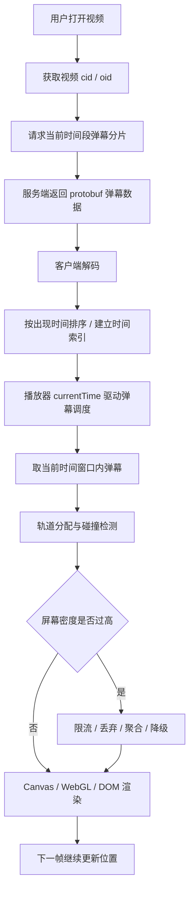

B站这种千万播放视频，**不会把几十万、上百万条弹幕一次性丢给播放器渲染**。

它大概率是按下面这套思路处理：

> **服务端按视频时间切片存储和下发弹幕；客户端只加载当前时间段附近的弹幕；播放器每一帧只计算和绘制“当前屏幕上应该出现的几十到几百条弹幕”；过载时做密度控制、碰撞规避、合并/丢弃/降级。**

公开资料和社区逆向都能看到，B站新版弹幕接口使用了 **protobuf 二进制格式**，并通过 `seg.so` 之类接口按 `segment_index` 分段拉取弹幕，而不是一次性拉完整 XML。社区资料提到每个弹幕分片大约覆盖数分钟视频时间，视频播放到后续时间段时再加载后续分片。([知乎专栏](https://zhuanlan.zhihu.com/p/392931611?utm_source=chatgpt.com "b站弹幕Protobuf 格式解析"))

---

# 1. 数据层：弹幕不是“按视频一次性加载”，而是“按时间段切片”

假设一个 2 小时视频有 100 万条弹幕，直接一次性返回会有几个问题：

|问题|后果|
|---|---|
|网络包巨大|首屏慢、移动端流量爆炸|
|解析成本高|JS 主线程卡顿|
|内存占用高|手机端容易崩|
|大部分弹幕当前用不到|浪费|

所以更合理的设计是：

```text
视频 cid / oid
  ├── segment_1：0 ~ 6min
  ├── segment_2：6 ~ 12min
  ├── segment_3：12 ~ 18min
  └── ...
```

客户端播放到某个时间点，只需要拉：

```text
当前分片 + 可能的下一个分片
```

而不是拉完整弹幕池。

B站公开可观察到的弹幕接口中，`/x/v2/dm/web/seg.so` 会带 `oid`、`type`、`segment_index` 等参数，请求的是某个视频的某个弹幕分段。社区资料也提到其响应是 protobuf 弹幕数据。([coderxi.com](https://coderxi.com/posts/vercel-deploy-simplified-bilibili-api/?utm_source=chatgpt.com "Vercel部署简易版的B站API - 汐涌及岸"))

---

# 2. 传输层：protobuf 代替 XML/JSON，降低体积和解析成本

早期弹幕很多是 XML 格式，类似：

```xml
<d p="1.23,1,25,16777215,...">这是一条弹幕</d>
```

这种格式可读性强，但缺点明显：

- 标签冗余大；
    
- 文本解析慢；
    
- 大量弹幕时体积很大；
    
- 移动端压力明显。
    

B站新版弹幕使用 **protobuf**，也就是二进制序列化格式。它的优势是：

|维度|XML/JSON|Protobuf|
|---|---|---|
|可读性|高|低|
|体积|大|小|
|解析速度|相对慢|快|
|适合大规模弹幕|一般|更合适|

社区分析也提到，B站将弹幕传输格式从 XML 改为 protobuf，主要优势就是传输效率更高、移动端网络压力更小。([知乎专栏](https://zhuanlan.zhihu.com/p/392931611?utm_source=chatgpt.com "b站弹幕Protobuf 格式解析"))

---

# 3. 客户端调度：播放器只关心“当前时间窗口”的弹幕

播放器不会每一帧遍历 100 万条弹幕。

更合理的数据结构类似：

```ts
interface Danmaku {
  time: number;      // 出现时间，单位秒
  text: string;
  mode: 'scroll' | 'top' | 'bottom';
  color: string;
  size: number;
  weight?: number;
}
```

加载完某个分片后，客户端会按 `time` 排序。社区逆向资料也提到，新版播放器会把弹幕按视频出现时间 `progress` 排序，方便渲染时查找。([GitHub](https://github.com/MotooriKashin/Bilibili-Old/issues/10?utm_source=chatgpt.com "关于新版弹幕· Issue #10 · MotooriKashin/Bilibili-Old"))

然后播放时用当前视频时间 `currentTime` 找出附近弹幕：

```text
currentTime = 125.3s

只取：
125.3s ~ 126.0s 之间应该入场的弹幕
```

实现上可以用：

- 排序数组 + 游标；
    
- 二分查找；
    
- 时间桶；
    
- 小顶堆 / 队列；
    
- 分片内索引。
    

核心思想是：

```text
不是每帧扫描全部弹幕
而是按播放进度顺序消费弹幕队列
```

---

# 4. 渲染层：屏幕上同时存在的弹幕数量是有限的

即使一个视频有 100 万条弹幕，也不代表同一秒都要显示。

真正影响渲染性能的是：

```text
同一帧屏幕上有多少条正在移动的弹幕
```

通常一个播放器可视区域内，同时显示的弹幕数量可能被限制在几十到几百条。

如果某一秒有几千条弹幕，播放器需要做 **密度控制**：

```text
原始弹幕：某 1 秒内 5000 条
实际显示：抽样 / 限制 / 优先展示其中 100~300 条
```

否则用户也看不清。

---

# 5. 排布算法：弹幕要避免互相遮挡

滚动弹幕不是随便放一行就行。播放器需要为每条弹幕分配轨道。

简化模型：

```text
屏幕高度 720px
弹幕字体高度 24px
可用轨道数 ≈ 720 / 24 = 30 行
```

每一条新弹幕进入时，系统尝试找一条不会碰撞的轨道：

```text
第 1 轨：上一条弹幕还没完全让出空间 → 不可用
第 2 轨：可用 → 放这里
第 3 轨：不用检查
```

碰撞判断大致考虑：

- 上一条弹幕的文本宽度；
    
- 上一条弹幕的速度；
    
- 当前弹幕的速度；
    
- 当前时间；
    
- 屏幕宽度；
    
- 两条弹幕是否会追尾。
    

伪代码大概是：

```ts
function findTrack(danmaku) {
  for (const track of tracks) {
    if (!willCollide(track.lastDanmaku, danmaku)) {
      return track;
    }
  }

  return null; // 没有空轨道，丢弃或延迟
}
```

如果轨道满了，一般有几种策略：

|策略|说明|
|---|---|
|丢弃低优先级弹幕|保证流畅|
|延迟显示|但会破坏时间同步|
|合并相似弹幕|比如“前方高能 x 233”|
|降低透明度/缩小字号|减少视觉拥挤|
|用户设置屏蔽密度|只显示 25%、50%、75%|

---

# 6. Canvas / WebGL 通常比 DOM 更适合大规模弹幕

简单弹幕可以用 DOM：

```html
<div class="danmaku">哈哈哈哈</div>
```

配合 CSS transform 移动。

但如果同时有几百条弹幕，每条都是 DOM 节点，会带来：

- 大量布局计算；
    
- 样式计算；
    
- 合成层压力；
    
- GC 压力；
    
- 主线程卡顿。
    

所以高性能播放器更常用：

|方案|特点|
|---|---|
|DOM + CSS|简单，适合少量弹幕|
|Canvas 2D|适合大量文字绘制|
|WebGL|适合更高性能、更复杂效果|
|OffscreenCanvas + Worker|可把部分绘制/计算挪到 worker 线程|

关于 Canvas 弹幕，张鑫旭的文章也明确指出，大量弹幕用 DOM 容易卡顿，Canvas 更适合复杂动画场景。([zhangxinxu.com](https://www.zhangxinxu.com/wordpress/2017/09/html5-canvas-video-barrage/comment-page-1/?utm_source=chatgpt.com "使用canvas实现和HTML5 video交互的弹幕效果"))  
而 OffscreenCanvas 可以把 Canvas 渲染上下文交给 Web Worker，提高并行性，更好利用多核系统。([web.dev](https://web.dev/articles/offscreen-canvas?hl=zh-cn&utm_source=chatgpt.com "OffscreenCanvas - 使用Web Worker 来加快画布操作| Articles"))

B站具体生产播放器内部实现细节没有完全公开，但从工程角度看，大规模弹幕播放器通常会组合使用这些策略。

---

# 7. 热门视频的特殊问题：不是“播放量高”，而是“同一时间点弹幕密度高”

千万播放本身不直接影响播放器压力。

真正危险的是这种情况：

```text
第 123.5 秒：
  “前方高能” 20000 条
  “哈哈哈哈” 10000 条
  “泪目” 5000 条
```

这种热点时间点会导致弹幕爆发。

服务端和客户端可以做：

## 服务端侧

- 分片压缩；
    
- 热点分片 CDN 缓存；
    
- protobuf 二进制传输；
    
- 按时间索引；
    
- 按用户屏蔽词/等级/设置过滤；
    
- 热门视频弹幕文件预生成；
    
- 分片增量更新。
    

## 客户端侧

- 当前分片缓存；
    
- 预加载下一分片；
    
- 弹幕密度限制；
    
- 轨道数限制；
    
- 同类弹幕聚合；
    
- 弱设备降级；
    
- 不可见时暂停绘制；
    
- 倍速播放时调整弹幕调度；
    
- 拖动进度条时取消旧分片请求。
    

---

# 8. 一个简化版架构图



---

# 9. 类比成后端系统会更好理解

你可以把弹幕系统理解成一个典型的高并发时间序列数据系统：

|弹幕系统|后端类比|
|---|---|
|视频时间轴|时间序列主键|
|弹幕分片|分库分表 / 时间分区|
|`segment_index`|分片编号|
|protobuf|高效 RPC / 二进制协议|
|当前播放时间|消费 offset|
|弹幕渲染队列|消息队列消费|
|屏幕轨道|有限资源池|
|弹幕限流|backpressure|
|高能片段弹幕爆发|流量尖峰|
|丢弃低优先级弹幕|降级策略|

所以它的核心不是“百万条怎么画出来”，而是：

> **百万条怎么分片、索引、压缩、调度；每一帧只画当前该画的一小部分。**

---

# 10. 如果你自己做一个 B站式弹幕系统，建议这样设计

## 服务端

```text
danmaku_table
  id
  video_id
  segment_index
  appear_time_ms
  mode
  font_size
  color
  user_id
  content
  created_at
```

核心索引：

```sql
(video_id, segment_index, appear_time_ms)
```

API：

```http
GET /api/videos/{videoId}/danmaku/segments/{segmentIndex}
```

返回 protobuf 或压缩 JSON：

```json
{
  "segmentIndex": 3,
  "duration": 360,
  "items": [
    {
      "time": 72130,
      "text": "前方高能",
      "mode": 1,
      "color": "#ffffff"
    }
  ]
}
```

## 客户端

核心模块：

```text
DanmakuLoader      // 分片加载
DanmakuDecoder     // protobuf/json 解码
DanmakuScheduler   // 按 currentTime 调度
TrackAllocator     // 轨道分配
DanmakuRenderer    // Canvas/WebGL/DOM 渲染
DensityController  // 密度控制
FilterEngine       // 屏蔽词/类型过滤
```

---

## 总结

B站大规模弹幕显示的核心可以概括为 6 个词：

> **分片、压缩、索引、调度、限流、降级。**

不是客户端硬画百万条弹幕，而是：

```text
服务端：
  按视频时间分片存储和下发

网络层：
  protobuf 二进制压缩传输

客户端：
  只加载当前时间段
  只调度当前时间窗口
  只渲染当前屏幕可见弹幕
  过载时限流、聚合、丢弃或降级
```

这和后端处理千万级消息、日志、时间序列数据的思路非常接近：**不要全量处理，要分片；不要无脑消费，要背压；不要追求全部展示，要保证体验稳定。**