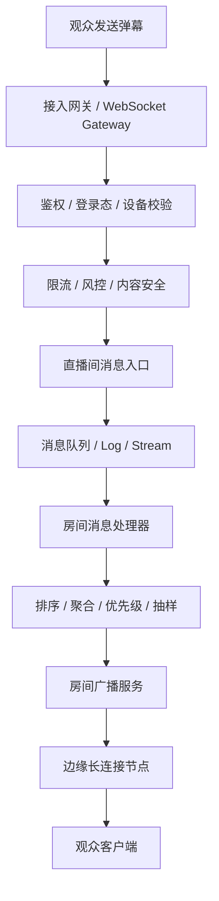
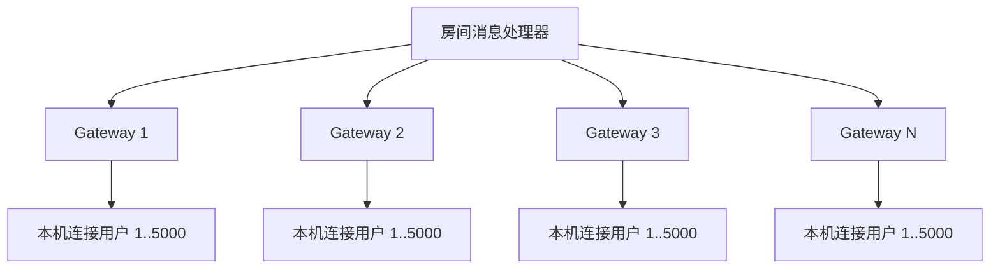
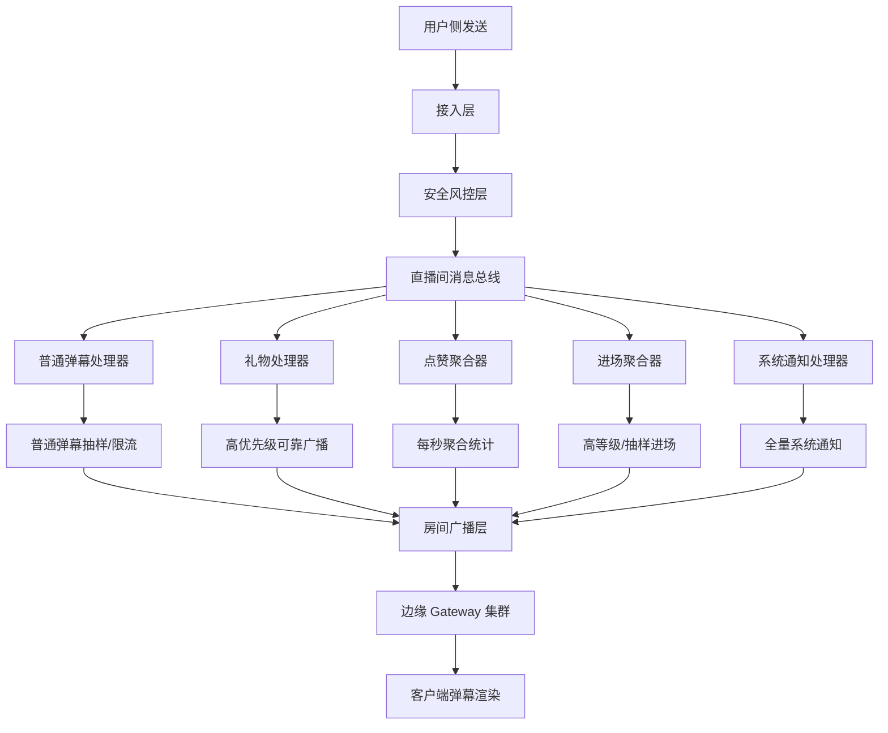

[[bilibili热门视频，可能有百万条弹幕，是如何处理的？]]
## 核心结论

抖音直播 10W+ 在线直播间的弹幕系统，和 B站录播视频弹幕不是一个模型。

B站录播弹幕更像：

```text
按视频时间轴分片读取历史弹幕
```

直播弹幕更像：

```text
海量实时消息进入直播间 → 经过风控/限流/排序/聚合 → 分层广播给观众 → 客户端只展示其中一部分
```

重点不是“10 万人每条弹幕都完整实时展示给所有人”，而是：

> **通过长连接、房间分片、消息队列、分层扇出、限流、抽样、优先级和客户端降级，把直播间弹幕变成一个可控的实时消息流。**

公开可见的抖音直播弹幕采集资料普遍显示，抖音直播间弹幕、礼物、点赞等实时事件通常通过 **WebSocket/WSS** 长连接传输，并使用 **protobuf** 这类二进制协议承载消息。抖音开放平台的互动数据能力也明确包含直播间评论、点赞、送礼等实时互动数据。([GitHub](https://github.com/zhonghangAlex/DySpider?utm_source=chatgpt.com "抖音直播间实时弹幕爬取，基于python，websocket，protobuf ..."))

---

# 1. 直播弹幕的真实压力在哪里？

假设一个 10W+ 在线直播间：

```text
在线人数：100,000
每秒发弹幕用户：2,000
平均每人每秒 1 条
原始弹幕写入：2,000 条/s
如果每条都发给 100,000 人：
广播量 = 2,000 × 100,000 = 2 亿条消息/s
```

这显然不现实。

所以直播弹幕系统的第一原则是：

> **不是所有观众都看到所有弹幕。**

大直播间里，用户实际看到的是一个经过平台筛选、限速、抽样、排序和降级后的弹幕流。

---

# 2. 整体架构：写入链路和广播链路分离

可以抽象成两条链路。



核心模块可以拆成：

|模块|作用|
|---|---|
|长连接网关|维护海量 WebSocket/TCP 连接|
|房间路由|判断用户在哪个直播间|
|消息入口|接收弹幕、点赞、礼物、进场等事件|
|风控审核|反垃圾、敏感词、账号风控|
|消息队列|削峰、解耦、回放短窗口|
|房间处理器|按直播间聚合处理消息|
|广播服务|把消息分发给该房间观众|
|客户端渲染器|控制展示密度和弹幕动画|

---

# 3. 长连接层：10W 观众不是连到一台机器

直播间 10W 在线，不会是：

```text
100,000 个客户端 → 1 台直播间服务器
```

而是：

```text
100,000 个客户端
  → 就近接入多个边缘长连接节点
  → 每个节点维护一部分用户连接
  → 中心房间服务只向这些节点推送一次
```

更接近：

```text
直播间 Room-123
  ├── Gateway-A：连接 8,000 人
  ├── Gateway-B：连接 12,000 人
  ├── Gateway-C：连接 9,000 人
  ├── Gateway-D：连接 15,000 人
  └── ...
```

每个 Gateway 负责自己机器上的连接。

这样中心服务不需要对 10W 个用户逐个发送，而是先把消息发给若干 Gateway，再由 Gateway 在本机内存里扇出给连接用户。

---

# 4. 扇出模型：从“用户级广播”变成“节点级广播”

最朴素模型：

```text
一条弹幕 → 发给 100,000 个用户
```

高并发模型：

```text
一条弹幕 → 发给 20 个长连接节点
20 个节点 → 各自发给本机上的 5,000 个用户
```

这就是分层扇出。



WebSocket 架构里，真正昂贵的不是接收一条消息，而是 **fan-out 扇出**。实时系统设计资料也普遍把扇出、背压、慢连接处理列为 WebSocket 大规模架构的关键问题。([Ably Realtime](https://ably.com/topic/websocket-architecture-best-practices?utm_source=chatgpt.com "WebSocket architecture best practices: Designing scalable ..."))

---

# 5. 消息不一定逐条广播，而是批量推送

直播弹幕不是每条都单独发一个网络包。

更常见的是微批：

```text
每 100ms / 200ms 聚合一批弹幕
一次推给客户端
```

例如：

```json
{
  "roomId": "123",
  "seq": 98234123,
  "messages": [
    {"type": "comment", "text": "哈哈哈", "user": "A"},
    {"type": "comment", "text": "主播看我", "user": "B"},
    {"type": "gift", "giftId": 1001, "count": 1}
  ]
}
```

优点：

|优点|说明|
|---|---|
|减少系统调用|不用每条消息都 write 一次|
|减少网络包数量|降低 TCP/IP 开销|
|客户端更好调度|一批消息统一排队渲染|
|方便限流|每批最多 N 条|

这里和 MQ 的 batch consume、Kafka pull batch 思路很像。

---

# 6. 消息有优先级：礼物 > 付费互动 > 普通弹幕

直播间消息并不是平等的。

一般会按业务价值排序：

|消息类型|优先级|处理策略|
|---|--:|---|
|大额礼物 / 连击礼物|最高|强展示、强实时、可能全房间广播|
|付费留言 / 高等级用户|高|优先展示|
|主播/管理员消息|高|必须送达|
|普通弹幕|中/低|可抽样、可丢弃、可限速|
|点赞飘心|低|强聚合，不逐个广播|
|进入直播间|低|只展示部分用户或高等级用户|

所以大直播间里，普通弹幕大概率是：

```text
尽力展示，不保证每条都送达每个人
```

而高价值消息是：

```text
更高优先级、更强送达、更强展示
```

---

# 7. 点赞、进入直播间这类事件一定会聚合

10W 人直播间，点赞可能非常夸张。

如果每个点赞都广播：

```text
用户点一次赞 → 所有人收到一次 like 消息
```

系统会爆炸，客户端也没意义。

所以会聚合成：

```text
过去 1 秒新增点赞：+12,430
当前总点赞：8,921,233
```

或者：

```json
{
  "type": "like_summary",
  "delta": 12430,
  "total": 8921233
}
```

进场消息也类似：

```text
普通用户进入：不展示或抽样展示
高等级用户进入：展示
粉丝团/会员进入：展示
```

这就是典型的 **事件聚合**。

---

# 8. 服务端限流：先保护直播间，再保护平台

弹幕系统至少有几层限流。

## 8.1 用户级限流

例如：

```text
同一用户每 1 秒最多 1~3 条普通弹幕
```

防刷屏。

## 8.2 账号信誉限流

新号、异常号、疑似机器人：

```text
更低频率
更严格审核
可能只对自己可见
```

## 8.3 房间级限流

如果直播间弹幕过载：

```text
每秒最多进入广播通道 1000 条普通弹幕
超过的普通弹幕进入抽样/丢弃
```

## 8.4 Gateway 级限流

某个长连接节点压力过高：

```text
减少普通弹幕推送
保留礼物、系统消息、主播消息
```

## 8.5 客户端级限流

用户手机性能差、网络差：

```text
降低弹幕密度
降低动画帧率
只展示部分消息
```

实时平台做分布式限流时，通常会在多节点之间做配额拆分、局部计数和近似控制，而不是所有请求都打到一个中心计数器。实时消息平台 Ably 的分布式限流文章也强调，水平扩展限流需要在精确性、性能和全局一致性之间取舍。([Ably Realtime](https://ably.com/blog/distributed-rate-limiting-scale-your-platform?utm_source=chatgpt.com "Building a distributed rate limiter that scales horizontally"))

---

# 9. 慢连接处理：不能让一个差网络用户拖垮房间

WebSocket 系统最怕慢消费者。

比如某个用户网络很差：

```text
服务端一直给他发
客户端收不动
连接发送缓冲区越来越大
服务器内存上涨
```

正确做法是：

```text
每个连接有发送队列上限
超过上限就丢弃低优先级消息
再严重就断开重连
```

伪代码：

```java
if (connection.pendingBytes() > HIGH_WATERMARK) {
    // 优先丢弃普通弹幕，保留礼物、系统通知等高优先级消息
    connection.dropLowPriorityMessages();
}

if (connection.pendingBytes() > DISCONNECT_WATERMARK) {
    connection.close("slow consumer");
}
```

这就是实时系统里的 **backpressure 背压**。

---

# 10. 客户端不会展示所有弹幕

即使服务端推了很多，客户端也不会全画。

客户端通常会控制：

|控制项|作用|
|---|---|
|最大同屏弹幕数|防止遮挡视频|
|最大每秒入场弹幕数|防止动画队列爆炸|
|弹幕轨道数|控制排布|
|弹幕速度|保持可读|
|弱机降级|保证帧率|
|用户设置|25%、50%、75%、100% 弹幕密度|
|屏蔽词/用户屏蔽|减少展示量|

10W+ 房间里，真实体验不是“所有弹幕完整飞过”，而是：

```text
观众看到一个高密度但可控的代表性弹幕流
```

客户端渲染侧可以用：

- 原生 TextView/SurfaceView；
    
- Canvas；
    
- OpenGL/Metal；
    
- 弹幕对象池；
    
- 文本宽度缓存；
    
- 轨道复用；
    
- 帧率自适应。
    

---

# 11. 顺序和一致性：直播弹幕通常不追求强一致

直播弹幕不是转账系统，不要求所有人看到完全相同顺序。

它更像：

```text
低延迟优先，最终一致/弱一致可接受
```

设计上可能只保证：

|范围|一致性|
|---|---|
|单个用户发送结果|尽量立即反馈|
|同一 Gateway 内|大致有序|
|同一直播间全局|通过 seq 尽量排序|
|所有观众看到完全相同内容|不保证|
|普通弹幕必达|不保证|
|礼物/系统消息|更强保证|

通常会给消息带序号：

```json
{
  "roomId": "123",
  "seq": 102938812,
  "timestamp": 1710000000000,
  "type": "comment",
  "payload": {}
}
```

客户端可以基于 `seq` 去重、丢弃过期消息、处理乱序。

---

# 12. MQ / Stream 在这里的作用

弹幕链路不一定每条都进传统数据库。

更合理的是：

```text
实时消息：进 Kafka / Pulsar / Redis Stream / RocketMQ
短期回放：保留几分钟或几小时
长期存储：异步落库 / 数仓 / 审计
```

普通弹幕的主链路目标是：

```text
低延迟广播
```

不是：

```text
强事务落库后再广播
```

可能的链路：

```text
发送弹幕
  → 网关校验
  → 风控
  → 写入房间 Stream
  → 房间消费者处理
  → 广播
  → 异步落库 / 审计 / 画像 / 推荐特征
```

---

# 13. 房间分片：超级大房间不能只靠一个房间处理器

10W 在线房间可能还好，如果是百万级在线直播间，仅一个房间处理器也会成为瓶颈。

可以进一步拆：

```text
Room-123
  ├── shard-0：处理部分普通弹幕
  ├── shard-1：处理部分普通弹幕
  ├── shard-2：处理礼物/高优消息
  └── shard-3：处理统计/点赞聚合
```

然后再汇聚成多个广播流：

```text
普通弹幕流
礼物流
系统通知流
点赞聚合流
进场聚合流
```

不同流使用不同策略：

|流|策略|
|---|---|
|普通弹幕流|高吞吐、可丢弃、可抽样|
|礼物流|高优先级、可靠性更高|
|点赞流|聚合后广播|
|进场流|抽样/高等级用户展示|
|系统流|必达优先|

---

# 14. 一个更真实的直播间消息分层模型



---

# 15. 为什么 10W+ 直播间仍然“看起来实时”？

因为它做了几个关键取舍：

## 15.1 对用户自己：立即反馈

你发一条弹幕，客户端本地可以先展示：

```text
自己发送成功 → 本地立即插入弹幕
```

这叫 optimistic UI。

即使服务端广播稍慢，你也感觉很快。

## 15.2 对其他观众：尽力广播

其他人是否都看到你的弹幕，不强保证。

## 15.3 对高价值消息：优先保证

礼物、付费、系统通知更可靠。

## 15.4 对低价值高频事件：聚合

点赞、进场、普通刷屏弹幕会被聚合、采样或限流。

---

# 16. 如果自己设计一个简化版 10W 直播间弹幕系统

## 后端模块

```text
live-gateway
  - WebSocket 长连接接入
  - 心跳
  - 用户鉴权
  - 连接房间绑定

live-message-service
  - 接收弹幕
  - 内容审核
  - 用户限流
  - 房间限流

live-room-router
  - roomId -> room shard
  - roomId -> gateway list

live-room-processor
  - 消息排序
  - 微批聚合
  - 优先级调度

live-broadcast-service
  - 分层广播
  - gateway fanout
  - 慢连接处理

live-storage-service
  - 异步落库
  - 审计
  - 数据分析
```

## Redis / MQ / DB 用法

|组件|用法|
|---|---|
|Redis|在线人数、房间状态、限流计数、短期缓存|
|Kafka/RocketMQ/Pulsar|弹幕事件流、削峰、异步消费|
|MySQL/PostgreSQL|直播间配置、用户关系、礼物订单|
|ClickHouse/Hive|弹幕分析、运营报表、风控样本|
|Elasticsearch|弹幕搜索、审核检索|
|CDN/边缘节点|就近接入、降低跨地域延迟|

---

# 17. Java 后端视角的关键点

如果让你面试讲这个系统，可以这样说：

> 直播弹幕是一个典型的实时消息系统。核心挑战不是单条消息处理，而是大房间高扇出、慢连接背压、热点房间倾斜和低延迟降级。设计上会把写入链路、房间处理链路和广播链路解耦；使用 WebSocket 长连接接入，MQ 做削峰和异步化，房间维度做分片处理，广播层采用 Gateway 分层扇出。普通弹幕采用限流、抽样和弱一致策略，礼物、系统通知等高优消息采用更强可靠性保障。客户端只展示有限密度的弹幕，并根据设备性能和网络状态动态降级。

这段可以直接作为系统设计面试答案。

---

## 总结

抖音直播 10W+ 直播间弹幕系统，本质是：

```text
高并发写入 + 超大规模实时扇出 + 弱一致展示 + 多级降级
```

核心设计关键词：

|关键词|含义|
|---|---|
|WebSocket/WSS|维持实时长连接|
|Protobuf|高效二进制传输|
|Gateway 集群|承载海量连接|
|房间路由|把用户和直播间映射到处理节点|
|MQ/Stream|削峰、解耦、异步化|
|分层扇出|中心服务发给 Gateway，Gateway 再发给用户|
|微批推送|多条消息合并发送|
|优先级队列|礼物/系统消息优先|
|限流抽样|普通弹幕不保证全量展示|
|聚合统计|点赞、进场等事件按窗口聚合|
|背压控制|慢连接丢低优消息或断开|
|客户端降级|控制同屏数量和渲染压力|

一句话：

> **10W+ 直播间不是靠“把每条弹幕发给每个人”撑住的，而是靠长连接集群、房间级消息流、分层广播、优先级调度、限流抽样和客户端密度控制，把一个不可承受的实时洪峰变成可消费的代表性消息流。**