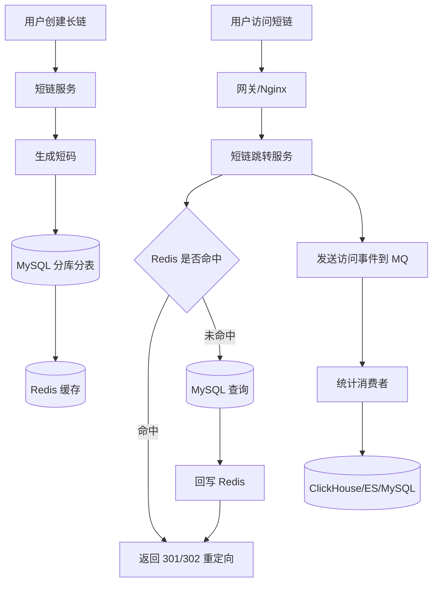

# 如何设计一个短链系统？

## 1. 一句话回答

短链系统本质是：

> 将一个长 URL 映射成一个全局唯一的短 Key，用户访问短链时，通过短 Key 查询原始 URL，然后进行 301/302 重定向。

核心难点不是“生成短字符串”，而是：

> **高并发生成、高并发跳转、唯一性、防刷、缓存、过期、统计、风控、可扩展。**

---

# 2. 先明确需求

## 2.1 功能需求

短链系统通常包括：

|功能|说明|
|---|---|
|创建短链|输入长 URL，生成短 URL|
|短链跳转|用户访问短链，重定向到原始 URL|
|自定义短链|支持用户指定短码，例如 `/abc123`|
|有效期|支持永久、7 天、30 天等|
|访问统计|PV、UV、IP、设备、地域、来源|
|风控|防止恶意链接、钓鱼链接、刷接口|
|后台管理|查询、禁用、删除、修改短链|

---

## 2.2 非功能需求

面试中要主动补充这些：

|指标|要求|
|---|---|
|高并发跳转|读多写少，跳转 QPS 远大于创建 QPS|
|低延迟|跳转链路要极短，最好 Redis 命中后直接返回|
|高可用|Redis、DB、服务都要容灾|
|唯一性|短码不能冲突|
|防刷|创建接口和跳转接口都可能被刷|
|可观测|要有监控、日志、告警、埋点|

---

# 3. 核心数据模型

## 3.1 短链映射表

```sql
CREATE TABLE short_url (
    id BIGINT PRIMARY KEY,
    short_code VARCHAR(32) NOT NULL,
    origin_url TEXT NOT NULL,
    user_id BIGINT,
    expire_time DATETIME,
    status TINYINT NOT NULL DEFAULT 1,
    create_time DATETIME NOT NULL,
    update_time DATETIME NOT NULL,
    UNIQUE KEY uk_short_code (short_code)
);
```

核心字段：

|字段|说明|
|---|---|
|`id`|全局唯一 ID|
|`short_code`|短码，例如 `aB93xK`|
|`origin_url`|原始长链接|
|`expire_time`|过期时间|
|`status`|正常、禁用、删除|
|`user_id`|创建者|
|`uk_short_code`|保证短码唯一|

---

## 3.2 访问统计表

不要把统计直接同步写进主表，否则跳转接口会被拖慢。

```sql
CREATE TABLE short_url_visit_log (
    id BIGINT PRIMARY KEY,
    short_code VARCHAR(32) NOT NULL,
    ip VARCHAR(64),
    user_agent VARCHAR(512),
    referer VARCHAR(512),
    device VARCHAR(64),
    browser VARCHAR(64),
    os VARCHAR(64),
    visit_time DATETIME NOT NULL
);
```

更推荐：

> 跳转接口只负责重定向，访问日志异步写入 MQ，再由消费者落库或写入 OLAP 系统。

---

# 4. 系统整体架构



---

# 5. 短码如何生成？

这是面试重点。

## 方案一：自增 ID + Base62 编码

这是最经典方案。

### 思路

1. 生成一个全局唯一数字 ID。
    
2. 将数字 ID 转成 Base62。
    
3. Base62 字符串作为短码。
    

Base62 字符集：

```text
0-9 a-z A-Z
```

例如：

```text
id = 125000000
Base62(id) = d3X9a
```

短链：

```text
https://pdd.cn/d3X9a
```

---

## 5.1 为什么用 Base62？

因为 URL 里可以安全使用数字、大小写字母。

|编码长度|可表达数量|
|---|--:|
|6 位 Base62|62^6 ≈ 568 亿|
|7 位 Base62|62^7 ≈ 3.5 万亿|
|8 位 Base62|62^8 ≈ 218 万亿|

所以 6 到 8 位短码通常已经足够。

---

## 5.2 Java 示例：Base62 编码

```java
public class Base62Encoder {

    /**
     * Base62 字符集：数字 + 小写字母 + 大写字母
     */
    private static final char[] BASE62 = 
            "0123456789abcdefghijklmnopqrstuvwxyzABCDEFGHIJKLMNOPQRSTUVWXYZ".toCharArray();

    /**
     * 将 long 类型 ID 编码成 Base62 字符串
     */
    public static String encode(long num) {
        if (num == 0) {
            return String.valueOf(BASE62[0]);
        }

        StringBuilder sb = new StringBuilder();

        while (num > 0) {
            int index = (int) (num % 62);
            sb.append(BASE62[index]);
            num /= 62;
        }

        // 反转后才是正常顺序
        return sb.reverse().toString();
    }
}
```

---

# 6. 全局唯一 ID 怎么生成？

## 6.1 数据库自增 ID

简单，但高并发下数据库压力大。

```text
insert into short_url(origin_url) values(...)
拿到 auto_increment id
Base62(id)
update short_url set short_code = ...
```

问题：

|问题|说明|
|---|---|
|两次 DB 操作|insert 后还要 update|
|数据库瓶颈|高并发创建时压力大|
|可预测|短码递增，容易被遍历|

---

## 6.2 Redis 自增 ID

```text
INCR short_url:id
```

优点：

|优点|说明|
|---|---|
|快|Redis 原子自增性能高|
|实现简单|适合中小规模|
|易接入|Java 后端容易实现|

缺点：

|缺点|说明|
|---|---|
|Redis 持久化风险|极端情况下 ID 回退|
|单点热点|需要 Redis 高可用|
|可预测|ID 仍然递增|

---

## 6.3 雪花算法 Snowflake

推荐面试重点说这个。

```text
符号位 | 时间戳 | 机器 ID | 序列号
```

优点：

|优点|说明|
|---|---|
|高性能|本地生成，不依赖 DB|
|趋势递增|对存储友好|
|分布式唯一|多机器可并发生成|
|工程成熟|Java 生态常见|

缺点：

|问题|说明|
|---|---|
|时钟回拨|需要处理|
|机器 ID 管理|需要注册中心或配置中心|
|仍可推测|可以加扰动解决|

---

## 6.4 面试推荐方案

可以这样回答：

> 我会采用 **Snowflake 生成全局唯一 ID，然后做 Base62 编码**。如果担心短码可预测，可以在编码前对 ID 做一次扰动，例如加盐哈希、Feistel 置换，或者打乱 Base62 字符集。

---

# 7. 如何避免短码冲突？

如果使用 Snowflake ID + Base62，理论上不会冲突。

但工程上仍然要兜底：

```sql
UNIQUE KEY uk_short_code (short_code)
```

写入流程：

```text
生成 short_code
插入 DB
如果唯一索引冲突，则重新生成
```

伪代码：

```java
public String createShortUrl(String originUrl) {
    for (int i = 0; i < 3; i++) {
        long id = idGenerator.nextId();
        String shortCode = Base62Encoder.encode(id);

        try {
            saveToDb(id, shortCode, originUrl);
            redis.set("short:" + shortCode, originUrl);
            return shortCode;
        } catch (DuplicateKeyException e) {
            // 极低概率冲突，重试即可
        }
    }

    throw new RuntimeException("短链生成失败");
}
```

---

# 8. 短链创建流程

```text
1. 参数校验
2. URL 标准化
3. 风控校验
4. 判断是否已存在
5. 生成短码
6. 写入数据库
7. 写入 Redis 缓存
8. 返回短链
```

## 8.1 URL 标准化

例如：

```text
https://example.com
https://example.com/
```

可能应该视为同一个链接。

需要处理：

|项|说明|
|---|---|
|协议|只允许 http/https|
|域名|解析并标准化|
|末尾斜杠|按规则统一|
|参数顺序|可选择是否排序|
|fragment|一般不参与服务端请求，可按业务处理|

---

## 8.2 是否复用已有短链？

两种策略：

|策略|说明|
|---|---|
|同一长链复用短链|节省资源，但统计维度较粗|
|每次创建都生成新短链|方便营销活动、渠道统计|

电商、营销场景一般倾向：

> 同一个长链在不同活动、不同用户、不同渠道下可以生成不同短链，方便统计和归因。

---

# 9. 短链跳转流程

```text
1. 用户访问 https://pdd.cn/abc123
2. 网关转发到短链服务
3. 根据 short_code 查 Redis
4. Redis 命中，校验状态和过期时间
5. 返回 301/302 Location: origin_url
6. 异步发送访问日志到 MQ
7. Redis 未命中时查询 MySQL
8. MySQL 命中后回写 Redis
9. MySQL 未命中则返回 404
```

---

# 10. 301 还是 302？

这是高频追问。

|状态码|含义|特点|
|---|---|---|
|301|永久重定向|浏览器和搜索引擎可能缓存|
|302|临时重定向|每次都可能重新访问短链服务|

## 推荐回答

大多数短链系统更推荐 **302**。

原因：

1. 方便统计每次访问。
    
2. 可以动态修改目标 URL。
    
3. 可以做风控拦截。
    
4. 可以处理过期、禁用、黑名单等状态。
    
5. 避免浏览器缓存导致服务端失去控制。
    

如果是固定永久短链，也可以用 301，但营销、活动、广告、风控场景一般用 302。

---

# 11. 缓存设计

短链系统是典型的读多写少系统，所以 Redis 很关键。

## 11.1 Redis Key 设计

```text
short:url:{shortCode} -> originUrl/status/expireTime
```

建议不要只存 URL，应该存一个结构体。

```json
{
  "originUrl": "https://xxx.com/product/123",
  "status": 1,
  "expireTime": "2026-12-31 23:59:59"
}
```

---

## 11.2 缓存过期时间

如果短链有业务过期时间：

```text
Redis TTL = expireTime - now
```

如果短链永久有效：

```text
TTL 可以设置较长，例如 7 天、30 天，然后定期续期
```

不建议所有永久短链都永不过期，否则 Redis 内存压力会持续增长。

---

## 11.3 缓存穿透

恶意用户可能大量访问不存在的短码：

```text
/pdd.cn/aaaaaa
/pdd.cn/aaaaab
/pdd.cn/aaaaac
```

如果每次都打到数据库，会造成缓存穿透。

解决方案：

|方案|说明|
|---|---|
|缓存空值|不存在的 shortCode 缓存空结果，TTL 设置短一点|
|布隆过滤器|判断 shortCode 是否可能存在|
|网关限流|对异常 IP 限流|
|WAF|拦截恶意扫描|

推荐组合：

> Redis 缓存空值 + Bloom Filter + 网关限流。

---

## 11.4 缓存雪崩

大量短链同时过期，会导致请求打爆 DB。

解决：

```text
TTL = 基础过期时间 + 随机偏移
```

例如：

```text
7 天 + random(0, 3600 秒)
```

---

## 11.5 缓存击穿

某个热门短链失效，大量请求同时打 DB。

解决：

|方案|说明|
|---|---|
|热点 Key 永不过期|逻辑过期，异步刷新|
|分布式锁|只有一个线程回源 DB|
|本地缓存|Caffeine 缓解 Redis 压力|

电商活动场景中，热门短链建议：

```text
Caffeine 本地缓存 + Redis + MySQL
```

---

# 12. 数据库分库分表设计

短链系统数据量可能很大，单表不够时需要分库分表。

## 12.1 按 short_code 哈希分表

```text
table_index = hash(short_code) % 64
```

优点：

|优点|说明|
|---|---|
|查询快|跳转时根据 short_code 精确定位|
|数据均匀|哈希分散|
|适合读路径|访问时天然只有 short_code|

缺点：

|缺点|说明|
|---|---|
|按用户查询麻烦|用户后台管理需要额外索引|
|按时间统计麻烦|需要异构存储|

---

## 12.2 按 user_id 分表

适合后台管理，但不适合跳转链路。

因为用户访问短链时只有：

```text
short_code
```

没有：

```text
user_id
```

所以还要先查路由关系。

---

## 12.3 推荐方案

主映射表按 `short_code` 哈希分表。

如果有用户后台，可以额外维护一张用户维度索引表：

```sql
CREATE TABLE user_short_url_index (
    user_id BIGINT,
    short_code VARCHAR(32),
    create_time DATETIME,
    PRIMARY KEY (user_id, short_code)
);
```

这样：

|场景|查询方式|
|---|---|
|用户访问短链|根据 short_code 查映射表|
|用户后台列表|根据 user_id 查索引表|
|统计分析|走 ClickHouse/ES/OLAP|

---

# 13. 访问统计如何设计？

不要在跳转接口里同步更新统计字段。

错误做法：

```sql
update short_url set pv = pv + 1 where short_code = ?
```

问题：

|问题|说明|
|---|---|
|高并发热点行|热门短链会导致行锁竞争|
|影响跳转延迟|用户重定向变慢|
|DB 压力大|访问量越大越危险|

---

## 13.1 推荐做法：异步统计

```text
跳转服务 -> MQ -> 统计消费者 -> ClickHouse/ES/MySQL
```

访问事件内容：

```json
{
  "shortCode": "abc123",
  "ip": "1.2.3.4",
  "userAgent": "Chrome...",
  "referer": "https://xxx.com",
  "visitTime": "2026-06-22 10:00:00"
}
```

---

## 13.2 统计指标

|指标|说明|
|---|---|
|PV|总访问次数|
|UV|独立访客数|
|IP 数|独立 IP 数|
|地域|根据 IP 解析|
|设备|PC / Mobile|
|浏览器|Chrome / Safari|
|来源|Referer|
|转化|点击后下单、注册等业务指标|

---

# 14. 高并发下的热点问题

短链系统最核心的高并发路径是：

```text
用户访问短链 -> 查缓存 -> 重定向
```

## 14.1 热点短链

比如拼多多大促活动链接：

```text
https://pdd.cn/618abc
```

可能瞬间几十万 QPS。

优化方案：

|层级|方案|
|---|---|
|CDN/Nginx|静态规则或边缘缓存部分跳转|
|本地缓存|Caffeine 缓存热门短码|
|Redis 集群|分片扩展|
|DB|只做兜底，不承载主流量|
|MQ|异步削峰统计日志|

---

## 14.2 本地缓存示例

```text
Caffeine 本地缓存 -> Redis -> MySQL
```

访问链路：

```text
1. 先查本地缓存
2. 本地未命中，再查 Redis
3. Redis 未命中，再查 MySQL
4. 回写 Redis 和本地缓存
```

注意：

> 本地缓存会带来一致性问题，所以适合缓存短链映射这种修改频率低的数据。对于禁用、风控拦截等状态，需要有主动失效机制，例如 MQ 广播删除本地缓存。

---

# 15. 安全和风控设计

短链系统很容易被滥用：

|风险|示例|
|---|---|
|钓鱼链接|伪装成正常短链|
|黄赌毒诈骗|恶意传播|
|批量生成|撞库、刷接口|
|SSRF|内网地址被包装成短链|
|扫描短码|枚举短链内容|

---

## 15.1 创建时风控

创建短链时需要校验：

|校验项|说明|
|---|---|
|URL 协议|只允许 http/https|
|域名黑名单|禁止恶意域名|
|内容安全检测|接入安全平台|
|内网地址过滤|禁止 127.0.0.1、localhost、内网 IP|
|用户限流|每个用户每天最多创建多少条|
|IP 限流|防止匿名接口被刷|

---

## 15.2 跳转时风控

访问短链时也要校验：

|校验项|说明|
|---|---|
|短链状态|是否禁用|
|过期时间|是否过期|
|黑名单|目标域名是否已被拉黑|
|访问频率|IP 是否异常|
|设备指纹|是否机器流量|
|安全中间页|高风险链接先展示提示页|

---

# 16. 接口设计

## 16.1 创建短链

```http
POST /api/short-urls
Content-Type: application/json
```

请求：

```json
{
  "originUrl": "https://www.example.com/product/123",
  "expireTime": "2026-12-31 23:59:59",
  "customCode": null
}
```

响应：

```json
{
  "shortUrl": "https://pdd.cn/aB93xK",
  "shortCode": "aB93xK"
}
```

---

## 16.2 跳转接口

```http
GET /{shortCode}
```

响应：

```http
HTTP/1.1 302 Found
Location: https://www.example.com/product/123
```

---

# 17. 创建短链核心伪代码

```java
@Service
public class ShortUrlService {

    private final IdGenerator idGenerator;
    private final ShortUrlRepository shortUrlRepository;
    private final RedisTemplate<String, String> redisTemplate;

    public CreateShortUrlResponse create(CreateShortUrlRequest request) {
        // 1. 校验 URL 合法性，防止非法协议、内网地址、恶意域名
        validateOriginUrl(request.getOriginUrl());

        // 2. 如果用户传了自定义短码，优先使用用户的短码
        String shortCode = request.getCustomCode();

        if (shortCode == null || shortCode.isBlank()) {
            // 3. 使用分布式 ID 生成器生成全局唯一 ID
            long id = idGenerator.nextId();

            // 4. 将数字 ID 转成 Base62 短码
            shortCode = Base62Encoder.encode(id);
        }

        // 5. 构造数据库实体
        ShortUrlEntity entity = new ShortUrlEntity();
        entity.setShortCode(shortCode);
        entity.setOriginUrl(request.getOriginUrl());
        entity.setExpireTime(request.getExpireTime());
        entity.setStatus(1);

        try {
            // 6. 依赖数据库唯一索引兜底，防止短码冲突
            shortUrlRepository.save(entity);
        } catch (DuplicateKeyException e) {
            throw new BizException("短码已存在");
        }

        // 7. 写入 Redis，提升跳转性能
        String cacheKey = "short:url:" + shortCode;
        redisTemplate.opsForValue().set(cacheKey, request.getOriginUrl(), calcTtl(request));

        return new CreateShortUrlResponse("https://pdd.cn/" + shortCode, shortCode);
    }
}
```

---

# 18. 跳转接口核心伪代码

```java
@GetMapping("/{shortCode}")
public void redirect(@PathVariable String shortCode,
                     HttpServletRequest request,
                     HttpServletResponse response) throws IOException {

    // 1. 先从 Redis 查询短链映射
    ShortUrlCache cache = shortUrlCacheService.get(shortCode);

    if (cache == null) {
        // 2. Redis 未命中，查询数据库
        ShortUrlEntity entity = shortUrlRepository.findByShortCode(shortCode);

        if (entity == null) {
            // 3. 防止缓存穿透，缓存空值
            shortUrlCacheService.cacheNull(shortCode);
            response.setStatus(HttpServletResponse.SC_NOT_FOUND);
            return;
        }

        // 4. 校验短链状态和有效期
        if (!entity.isAvailable()) {
            response.setStatus(HttpServletResponse.SC_GONE);
            return;
        }

        // 5. 回写 Redis
        cache = ShortUrlCache.from(entity);
        shortUrlCacheService.set(shortCode, cache);
    }

    // 6. 异步发送访问事件，不阻塞重定向
    visitEventProducer.sendAsync(buildVisitEvent(shortCode, request));

    // 7. 使用 302 临时重定向
    response.setStatus(HttpServletResponse.SC_FOUND);
    response.setHeader("Location", cache.getOriginUrl());
}
```

---

# 19. 面试官可能追问

## 19.1 如果短码被猜出来怎么办？

可以回答：

1. 不直接使用连续自增 ID。
    
2. 使用 Snowflake + Base62 后再做扰动。
    
3. 打乱 Base62 字符集。
    
4. 对敏感短链增加访问权限。
    
5. 扫描型访问做 IP 限流和风控。
    
6. 对不存在短码做空值缓存和黑名单策略。
    

---

## 19.2 如果 Redis 挂了怎么办？

分情况：

|场景|处理|
|---|---|
|Redis 单节点故障|Redis Cluster / Sentinel 高可用|
|Redis 全部不可用|降级查 DB，但要限流|
|热点短链|本地缓存兜底|
|DB 扛不住|返回降级页或限流|

面试表达：

> Redis 故障时不能让所有流量直接打到 DB，需要通过本地缓存、限流、熔断、热点短链预加载来保护数据库。

---

## 19.3 如何支持短链过期？

两层控制：

1. Redis TTL 控制缓存自动过期。
    
2. DB `expire_time` 做最终判断。
    

不能只依赖 Redis TTL，因为 Redis 数据可能丢失或被提前淘汰，DB 才是最终事实来源。

---

## 19.4 如何支持自定义短链？

自定义短链直接使用用户传入的 `customCode`。

但要做校验：

|校验项|说明|
|---|---|
|长度|例如 4 到 32 位|
|字符集|只允许数字、字母、短横线、下划线|
|保留词|禁止 `admin`、`api`、`login`|
|唯一性|数据库唯一索引保证|
|权限|只有高级用户可用|
|风控|防止抢注热门词|

---

## 19.5 如何做防重复提交？

创建短链可能被重复调用。

方案：

|方案|说明|
|---|---|
|幂等 Key|客户端传 `requestId`|
|长链唯一索引|对 `origin_url_hash + user_id + scene` 做唯一约束|
|Redis 分布式锁|防止短时间重复生成|
|业务策略|同一个用户、同一个长链、同一个场景复用|

推荐：

```sql
UNIQUE KEY uk_user_url_scene (user_id, origin_url_hash, scene)
```

---

# 20. 拼多多场景下要补充什么？

如果是拼多多面试，可以主动强调电商业务特征：

## 20.1 大促热点短链

拼多多的活动链路可能出现：

```text
百亿补贴
限时秒杀
砍一刀
直播间分享
商品详情页分享
优惠券分享
```

这些短链具备：

|特征|影响|
|---|---|
|流量突刺|需要本地缓存 + Redis + 限流|
|强统计诉求|需要异步埋点|
|风控复杂|需要防刷、防作弊|
|链接可能动态变化|更适合 302|
|渠道归因重要|不能简单复用同一个短链|

---

## 20.2 电商短链不能只做 URL 映射

更好的设计是把短链和业务场景绑定：

```text
short_code -> landing_page + campaign_id + channel_id + user_id + risk_policy
```

也就是说，短链不仅是：

```text
abc123 -> https://xxx.com/product/123
```

而是：

```text
abc123 -> 商品ID + 活动ID + 渠道ID + 创建人 + 风控策略 + 过期时间
```

这样后续才能支持：

|能力|说明|
|---|---|
|活动归因|判断哪个渠道带来转化|
|风控拦截|针对异常流量限流|
|AB 实验|不同用户跳不同落地页|
|灰度配置|动态调整目标页|
|数据分析|点击、下单、转化漏斗|

---

# 21. 最终面试版回答

可以这样组织语言：

> 我会把短链系统分成创建链路和跳转链路。创建时先对长 URL 做合法性和风控校验，然后通过 Snowflake 生成全局唯一 ID，再用 Base62 编码生成短码，最后把 `short_code -> origin_url` 写入 MySQL，并同步写入 Redis。数据库层通过 `short_code` 唯一索引兜底，避免冲突。
> 
> 用户访问短链时，服务从路径里解析 `short_code`，优先查本地缓存和 Redis，命中后校验状态和过期时间，然后返回 302 重定向；如果缓存未命中，再查 MySQL，并回写缓存。访问日志不在跳转链路同步落库，而是发送到 MQ，由消费者异步写入 ClickHouse 或 ES 做统计分析。
> 
> 高并发场景下，短链系统是典型读多写少，所以核心优化是缓存。对于热点短链，可以使用 Caffeine 本地缓存、Redis Cluster、热点 Key 预热、逻辑过期和限流来保护数据库。对于不存在的短码，要用空值缓存、布隆过滤器和网关限流防止缓存穿透。
> 
> 301 和 302 方面，我倾向使用 302，因为短链系统通常需要统计点击、风控拦截、动态修改目标 URL 和处理过期状态。如果使用 301，浏览器或搜索引擎可能缓存跳转结果，服务端后续就失去控制。
> 
> 如果是电商业务场景，我不会把它只设计成 URL 映射，而是会把活动 ID、渠道 ID、用户 ID、过期时间、风控策略一起建模，这样才能支持大促活动、渠道归因、AB 实验和转化分析。

---

# 22. 关键词总结

|关键词|面试价值|
|---|---|
|Snowflake + Base62|短码生成核心|
|Redis + MySQL|读多写少架构|
|Caffeine 本地缓存|热点短链优化|
|302 重定向|统计和风控友好|
|MQ 异步统计|跳转链路解耦|
|Bloom Filter|防缓存穿透|
|分库分表|海量短链存储|
|唯一索引兜底|防止短码冲突|
|风控校验|防钓鱼、防刷、防滥用|
|活动/渠道建模|电商场景加分项|

---

# 23. 面试加分点

最后可以补一句：

> 短链系统表面上是一个简单的 Key-Value 映射系统，但在高并发电商场景下，它更像一个“流量入口系统”。所以设计时要重点关注跳转链路的极致性能、活动流量突刺、访问统计异步化、恶意链接风控、热点 Key 缓存和渠道归因能力。