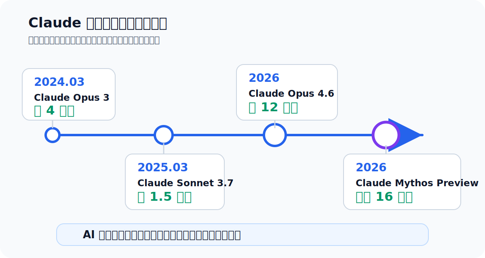
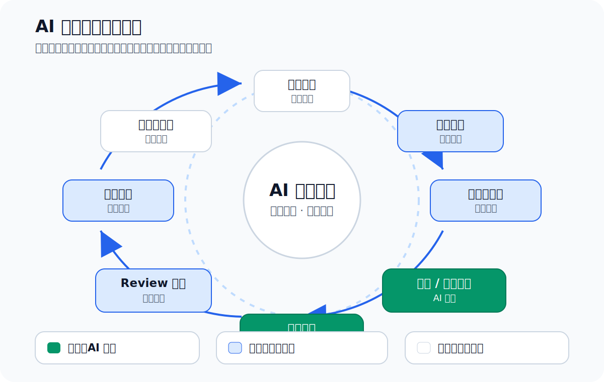
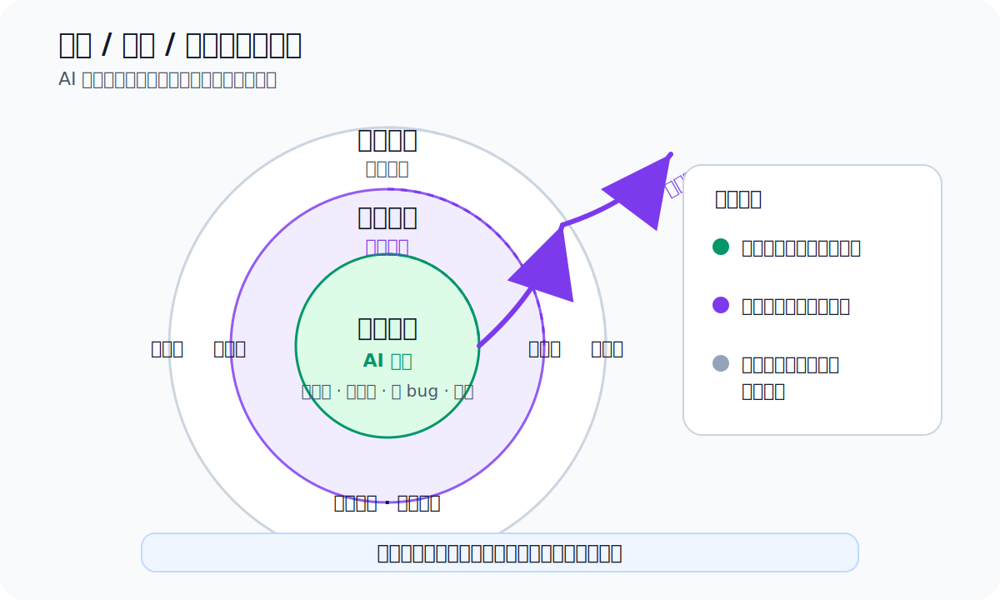
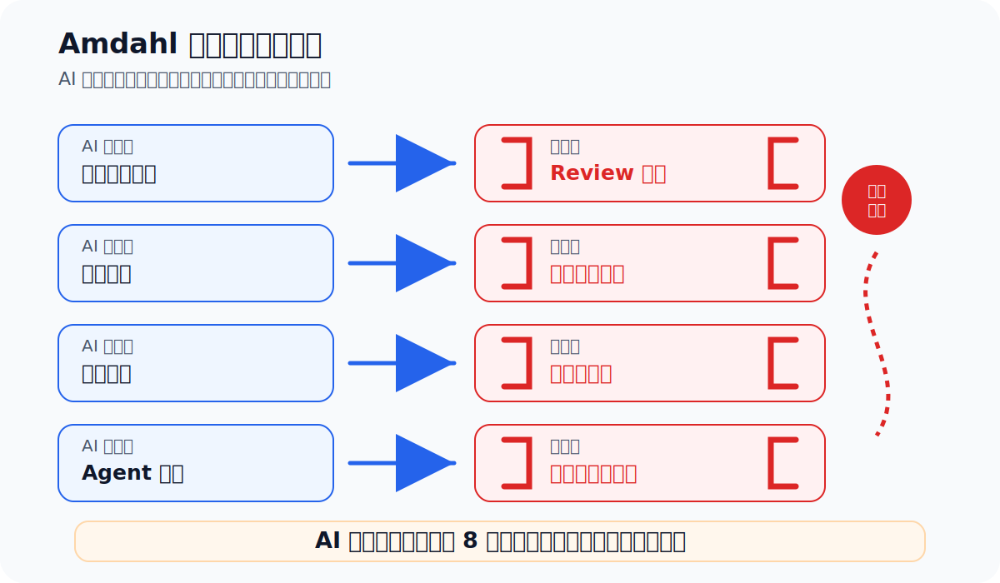
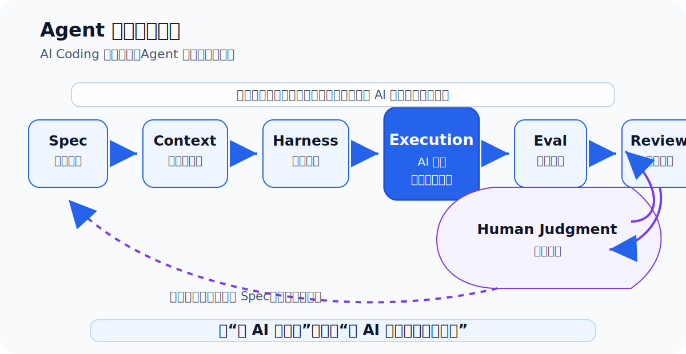

> 本文是基于 Anthropic Institute 文章《When AI builds itself》的工程视角解读。  
> 本文核心：当 AI 开始参与建造 AI，软件工程和 AI 研发的工作方式正在发生什么变化。

---

“我大概五个月没自己写过一行代码了。”

这句话不是出自一个被边缘化的工程师，也不是一个人在抱怨自己失去了工作价值。

它来自 Anthropic 内部一名工程师的陈述。

更准确地说，他不是不工作了，而是不再以传统方式工作了。他仍然在定义目标、拆解问题、审查结果、判断方向。只是代码本身，越来越多由 Claude 来写。

这句话真正刺痛工程师的地方，不是“AI 会写代码”这件事本身。这个事实大家已经接受了。真正刺痛的是：写代码正在从工程师的核心劳动，变成 Agent 工作流中的一个自动化步骤。

更有意思的是，Anthropic 文章里还有另一段员工引语：

> 有些天一切运转顺畅，我会觉得自己做什么都无所谓了，一切都被自动化了，而且比我更快更好。但另一些天，一切都崩了，我意识到我根本不知道发生了什么。

这两句话放在一起，就是当下 AI 工程的真实状态。

一面是生产力释放。  
另一面是系统失控感上升。

一面是代码、实验、调参、修 bug 变得越来越便宜。  
另一面是判断、验证、审计、治理变得越来越昂贵。

所以，Anthropic 这篇关于 recursive self-improvement 的文章，表面上是在讨论“AI 会不会自我进化”。但如果站在工程师视角看，它真正揭示的是另一件事：

> AI 已经进入研发主循环。  
> AI 自我进化不是从科幻开始的，而是从研发流程自动化开始的。

所谓“递归自我改进”，听起来像一个遥远的 AGI 概念：AI 设计下一代 AI，下一代 AI 再设计更强的 AI，如此循环，直到人类退出研发主流程。

但真正值得关注的，不是那个最终画面，而是它正在怎样一步步发生。

AI 不会在某一天突然按下一个“自我进化”的开关。更现实的过程是：研发闭环里的每一个环节，都逐渐出现一个可替代人类的 Agent 版本。

先是补全代码。  
然后是修改文件。  
然后是运行测试。  
然后是修复 bug。  
然后是跑实验。  
然后是自动 Review。  
然后是解释结果。  
最后才是判断下一步该做什么。

这篇文章想讲的，就是这个过程。

---

## 一、Anthropic 到底公开了什么

最近 Anthropic Institute 发布了一篇文章，标题是《When AI builds itself》。这篇文章讨论的是 Anthropic 在 recursive self-improvement 方向上的观察，以及这件事可能带来的影响。

文章最重要的地方，不是它给出了一个夸张预测，而是它公开了一组来自 Anthropic 内部的研发数据。

这些数据值得认真看。

第一，截至 2026 年 5 月，Anthropic 表示，合并进 Anthropic 代码库的代码中，超过 80% 可归因于 Claude。

这不是“Claude 偶尔帮工程师补几行代码”。

这是 AI 已经进入主干开发流程，成为代码生产的主要来源之一。

当然，这个数字不能被简单理解成“80% 的工程责任由 Claude 承担”。代码文本是谁生成的，和工程责任由谁承担，是两件事。现在的责任仍然在工程师、Reviewer、团队和组织系统里。

但这个数字说明了一件非常明确的事：

> 代码文本的生产者正在发生迁移。

过去，工程师亲手写代码。  
现在，工程师越来越多地描述目标、审查变更、管理 Claude 的执行过程。

第二，Anthropic 说，2026 年第二季度，典型工程师每天合并的代码量约为 2024 年的 8 倍。

这个数字也不能被粗暴理解为“生产力提升 8 倍”。Anthropic 自己也提醒，代码行数不是完美的生产力指标，因为它衡量的是数量，不是质量。

但是，即使把这个 caveat 放进去，它仍然说明了趋势：AI 正在显著提高工程组织中的代码流动速度。

更关键的是，这个变化不是因为工程师突然更努力，也不是因为工程流程突然变简单了，而是因为大量代码由 Claude 生成，工程师从“输入代码的人”变成了“指挥和审核代码生成过程的人”。

第三，在一个明确目标的代码优化任务中，Claude 的表现从 2025 年的约 3 倍加速，提升到 2026 年的约 52 倍。作为对照，熟练人类研究员在同类任务上大约能做到 4 倍。

这个数据非常关键，因为它说明 AI 最先形成压制的地方，不是“伟大原创思想”，而是明确目标下的高速试错。

给定一段代码。  
给定正确性检查。  
给定目标：让它跑得更快。  
然后不断重写、运行、计时、修改、再运行。

这正是 Agent 最擅长的工作。

它不需要灵感。  
不需要宏大方向判断。  
只需要在一个明确评价函数下持续试错。

这类任务过去是人类工程师和研究员最消耗时间的部分。现在，这部分正在被 AI 大幅压缩。

第四，Anthropic 提到一个 AI 安全研究任务：两个熟练人类研究员工作约一周，恢复了 23% 的性能缺口；而 Claude-powered agents 在 800 个累计小时、约 18000 美元算力成本下恢复了 97%。

这个结果也要谨慎看。原文明确说明，这个结果没有干净迁移到生产规模模型，而且问题和评分标准仍然由人类设定。

但即使如此，它仍然非常重要。

它说明：一旦人类给定问题边界和评价标准，Agent 已经可以在研究执行层面展开大规模试错，包括提出假设、测试假设、共享发现、并行迭代。

换句话说，AI 不只是写业务代码了。它开始进入研究流程。

第五，Anthropic 还做了一个“下一步判断”测试。他们找了一些真实 Claude Code 研究会话，在这些会话里，人类研究员曾经走过弯路。然后，Anthropic 把会话走偏之前的信息交给不同 Claude 模型，让模型判断下一步该怎么做。

结果是：2025 年 11 月的 Opus 4.5 在 51% 的情况下给出了比人类更好的下一步；到 2026 年 4 月，Mythos Preview 提升到 64%。

这个测试有明显限制。Anthropic 自己也说，这不是模型和人类判断能力的完全公平对比，因为样本特意选取了“人类选择有改进空间”的时刻。

但它仍然释放了一个强信号：

> AI 不只是在执行能力上进步，它也开始逼近判断能力。

而这件事，比 AI 写代码更值得认真对待。

因为写代码属于执行。  
判断下一步该做什么，已经开始接近 Research Taste。

所谓 Research Taste，就是判断什么问题值得做、什么结果可信、什么时候应该停下来的能力。

过去很多人以为，这类能力很难量化，也很难被 AI 学会。Anthropic 的数据不一定证明 AI 已经掌握了它，但至少说明：这类能力可以被测量，而且模型正在逼近。

所以，真正值得关注的不是某一个数字，而是这些数字共同指向的趋势：

> AI 还没有完整自我进化，但 AI 已经开始参与建造下一代 AI。  
> 这两件事之间的距离，正在缩短。

---

---

## 二、AI 自我进化不是奇点，而是研发闭环自动化

“递归自我改进”这个词很容易让人联想到科幻场景。

一个 AI 设计出下一代 AI。  
下一代 AI 又设计出更强的 AI。  
循环不断加速，直到人类无法理解、无法干预、无法控制。

这个画面当然重要，但它不是最适合工程师理解这件事的入口。

更好的理解方式是：

> 递归自我改进不是一个开关，而是一条连续谱。  
> 它不是某一天 AI 突然觉醒，而是研发闭环里的各个环节逐渐被自动化。

无论是软件工程，还是 AI 模型研发，底层都可以抽象成一个闭环：

目标定义 → 任务拆解 → 上下文获取 → 代码 / 实验执行 → 测试评估 → Review 审计 → 结果解释 → 下一步选择。

这个闭环不断循环。  
每循环一轮，系统就向前推进一点。

如果这个闭环完全由人类驱动，那就是传统研发。

如果 AI 只参与写一点代码，那叫 AI 辅助开发。

如果 AI 能执行大部分任务，但人类仍然定义目标、判断结果，那就是人机协作研发。

如果 AI 能自主定义目标、执行实验、判断结果、选择下一步，并用这个能力改进下一代 AI，那才接近完整的递归自我改进。

所以问题不应该是：

> AI 会不会自我进化？

更好的问题是：

> 这个研发闭环里的哪些环节已经被 AI 接管？  
> 哪些环节还需要人？  
> 还需要什么样的人？

我们可以把闭环拆成八个环节。

第一个环节是目标定义。

也就是：我们到底要解决什么问题？

这可能是一个 bug，也可能是一个性能问题，也可能是一次模型能力提升，也可能是一个安全研究方向。

目前这个环节仍然主要由人类主导。AI 可以辅助整理问题、拆解目标、补充背景，但“什么问题值得解决”仍然高度依赖人类判断。

这不是因为 AI 不会说话，而是因为目标定义本身包含价值判断、优先级判断、资源判断和风险判断。

第二个环节是任务拆解。

目标确定之后，要把它拆成一系列可执行任务。

这部分 AI 已经能做得不错。给它一个明确目标，它可以列出步骤、定位文件、生成计划，甚至把任务分发给子 Agent。

但这个环节的风险在于：目标稍微模糊，拆解就可能跑偏。Agent 会很认真地做事，但它认真做的，可能不是你真正想要的事。

第三个环节是上下文获取。

这是现在 AI 工程里被低估最多的环节。

人类工程师接到任务后，会自己判断该读哪些代码、哪些文档、哪些历史 issue、哪些日志、哪些测试。Agent 也需要这些上下文，但它不会天然知道哪些信息重要、哪些信息过期、哪些信息冲突。

给太少，它会乱猜。  
给太多，它会迷路。  
给旧文档，它会基于错误事实行动。  
给互相冲突的信息，它可能选一个看起来更顺的版本，然后自信地继续。

所以，Context Engineering 不是锦上添花，而是 Agent 能否稳定工作的基础设施。

第四个环节是代码 / 实验执行。

这是 AI 当前最强的环节。

只要目标明确、工具可用、评价函数清晰，Agent 可以写代码、改配置、跑测试、调参数、查日志、反复迭代。

Anthropic 的数据也说明，执行层已经不是人类最有优势的地方。无论是 80% 代码归因于 Claude，还是 52 倍代码优化加速，都指向同一个事实：

> 明确任务下的执行，正在快速变成 AI 的主场。

第五个环节是测试评估。

这个环节看起来也容易自动化：单元测试、集成测试、端到端测试、benchmark、静态检查，都可以变成自动化流程。

但真正的问题不是“有没有测试”，而是“测试是否代表真实完成”。

Agent 很擅长让已有测试通过。  
但如果测试本身覆盖不足，或者 Eval 设计错了，Agent 就会优化错误目标。

这就是为什么 Eval Engineering 会变得越来越重要。

第六个环节是 Review 审计。

Anthropic 已经让 Claude Reviewer 审查 Claude 写的代码，用来发现 bug、安全缺陷和其他问题。原文提到，回溯分析显示，如果过去每次变更都经过自动 Claude Review，大约三分之一导致历史生产事故的 bug 可能在上线前被拦截。

这个信息很有象征意义。

AI 写代码，然后 AI Review 代码。  
人类不再逐行处理所有低级问题，而是把注意力放在架构、业务语义、安全边界和长期维护风险上。

但这也带来一个新问题：AI Review 不是责任主体。它能过滤低级错误，却不能替组织承担工程责任。

第七个环节是结果解释。

实验跑完了，指标出来了，测试通过了，benchmark 提升了。然后呢？

这个结果意味着什么？

是真的变好了，还是过拟合？  
是通用能力提升，还是只针对某个数据集投机？  
是解决了根因，还是绕过了测试？  
是可以上线，还是还需要观察？

结果解释开始进入判断区。

AI 可以总结结果，可以画图，可以写报告，但判断结果是否可信，仍然需要人类的系统感。

第八个环节是下一步选择。

这是整个闭环中最关键的一环。

因为下一步选择决定了闭环是否能自己转起来。

如果 AI 只能执行任务，但下一步永远需要人类决定，那它是强大的研发助手。

如果 AI 可以稳定判断下一步做什么，知道哪些问题值得继续，哪些方向应该放弃，哪些结果不可信，那么它就开始接近真正的自主研发系统。

这也是递归自我改进真正的关键门槛。

不是 AI 能不能写代码。  
不是 AI 能不能跑测试。  
不是 AI 能不能修 bug。  
而是 AI 能不能自己决定下一步该做什么。

所以，递归自我改进不是某一天突然发生的奇点，而是这八个环节逐渐被自动化的过程。

现在的状态大致是：

| 研发环节 | 当前状态 | 人类还剩什么 |
|---|---|---|
| 目标定义 | 人类主导 | 判断什么值得做 |
| 任务拆解 | AI 已能辅助 | 防止方向跑偏 |
| 上下文获取 | 半自动化 | 控制 Context 质量 |
| 代码 / 实验执行 | AI 强势 | 设定边界和最终验收 |
| 测试评估 | 高度自动化 | 判断 Eval 是否正确 |
| Review 审计 | AI 开始承担 | 判断架构、风险、长期维护性 |
| 结果解释 | AI 逼近 | 判断结果是否可信 |
| 下一步选择 | 仍是核心缺口 | Research Taste |

这个表真正想表达的是：

> 执行环节已经不是瓶颈。  
> 上下文和判断，才是现在真正的战场。

---

---

## 三、真正的分界线：执行已经便宜，判断正在变贵

如果把上面的八个环节继续抽象，会发现 AI 能力扩张有一条非常清晰的路线：

> 先吃掉执行，再逼近判断。

执行类任务有几个共同特征。

目标相对明确。  
成功标准可以定义。  
结果可以通过测试、benchmark 或评分函数验证。  
失败可以重试。  
过程可以并行。

写代码是这样。  
跑测试是这样。  
修 bug 是这样。  
调参是这样。  
压测、优化、清理历史问题，也大多是这样。

这些任务过去很贵，不是因为它们都需要天才，而是因为它们消耗大量人类时间。

很多工程工作，本质上是“知道大概方向，然后反复试”。

找一个异常配置。  
定位一个慢 SQL。  
修一组 API bug。  
升级一批依赖。  
补一批测试。  
清理一类错误。  
验证一组实验组合。

这类工作最适合 Agent。

因为 Agent 不怕重复。  
不怕无聊。  
不怕切换上下文。  
不怕连续跑几十轮实验。  
不怕半夜继续干。  
也不需要向同事欠人情。

Anthropic 的那句员工评论很有意思：工作和生活过去运行在一种“人类小忙互助”的礼物经济里。你请别人帮你跑个脚本、查个问题、看个日志，这些小事会形成协作关系，也会形成彼此之间的债务感和连接感。

Claude 更快，而且不产生这种债务。

这听起来像效率提升，但它也意味着组织中的人类协作关系被重构了。

执行变便宜之后，问题会转移。

当写代码不再稀缺，稀缺的是：这个代码该不该写。  
当实验不再稀缺，稀缺的是：哪个实验值得跑。  
当文档不再稀缺，稀缺的是：哪份文档代表真实状态。  
当方案不再稀缺，稀缺的是：哪个方案值得执行。  
当 bug 修复不再稀缺，稀缺的是：这个修复有没有解决根因。

这就是判断类能力。

判断类能力包括：

- 什么问题值得做；
- 哪条路线值得继续；
- 一个结果是否可信；
- 一个指标提升有没有真实意义；
- 一个方案是否存在长期架构风险；
- 什么时候应该停止；
- 什么时候应该回滚；
- 什么时候应该承认方向错了。

这些能力和执行类能力不同。

它们通常没有清晰答案。  
没有标准测试可以完全验证。  
没有单一指标可以代表真实价值。  
它们依赖经验、系统感、风险意识、领域理解，以及对失败模式的长期记忆。

Anthropic 把其中一部分能力叫作 research taste and judgment。

这个词可以翻译成“研究品味与判断”，但不要把它理解得太玄。

Research Taste 不是神秘天赋。它在工程里可以拆成很具体的能力：

第一，识别真实进展。

一个 benchmark 提升了，是真的能力增强，还是刚好撞上了测试集？  
一个接口性能变好了，是整体系统变好，还是把压力转移到了下游？  
一个 Agent 任务完成了，是真的完成，还是只做了表面实现？

第二，判断结果可信度。

测试有没有覆盖关键路径？  
实验有没有控制变量？  
样本够不够代表性？  
指标有没有被错误优化？  
模型有没有通过投机方式拿到高分？

第三，感知路线价值。

这个方向值得继续投入吗？  
继续 debug 是必要的，还是已经进入沉没成本？  
这个技术方案是解决问题，还是制造新问题？  
这个自动化是不是值得做，还是为了自动化而自动化？

第四，选择下一步。

在多个可行方向中，哪个最值得先试？  
是继续优化当前方案，还是换一条路线？  
是修局部 bug，还是重构底层设计？  
是继续扩功能，还是先补测试和监控？

第五，知道什么时候停。

成熟工程师很重要的一项能力，就是知道什么时候该停。

不是所有问题都值得解决。  
不是所有优化都有业务意义。  
不是所有重构都值得冒险。  
不是所有自动化都能收回成本。  
不是所有漂亮结果都可信。

AI 最难学的，恰恰是这种“带着疤痕的判断”。

这里可以把研发闭环分成三层来看。

最内层是执行闭环。

接收任务，获取上下文，写代码，跑测试，修复失败，再跑测试。

这一层已经高度自动化。

中间层是实验闭环。

提出假设，设计实验，运行多组实验，分析指标，决定下一组实验。

这一层正在自动化。

最外层是战略闭环。

判断什么问题重要，制定路线，管理多个实验方向，识别真实进展，决定是否继续投入。

这一层仍然主要靠人。

所谓完整递归自我改进，并不是内层执行闭环自动化就够了，而是这三层闭环都能自主运转。

现在的情况是：

| 层级 | 内容 | 当前自动化程度 | 人类角色 |
|---|---|---|---|
| 执行闭环 | 写代码、跑测试、修 bug、调参 | 高 | 设定任务入口和最终验收 |
| 实验闭环 | 提假设、跑实验、分析指标、迭代方案 | 中高 | 判断实验设计和结果可信度 |
| 战略闭环 | 选问题、定路线、决定是否继续 | 低 | Research Taste、方向判断 |

所以，AI 对工程师的真正冲击不是“它会不会写代码”。

答案已经很清楚：会，而且会得越来越好。

真正的问题是：

> 当执行能力快速贬值，你的价值能不能上移到判断层？

如果你只是比 AI 更熟几个 API，更会写样板代码，更快补 Controller、Service、Mapper，那么这个优势会越来越薄。

但如果你能定义任务边界，控制上下文，设计 Eval，识别假完成，判断架构风险，知道什么时候该停，你的价值反而会变得更高。

因为当执行越来越便宜，判断就越来越昂贵。

---

---

## 四、Amdahl 定律：AI 写代码越快，团队越容易堵

很多团队引入 AI Coding 工具时，会有一个朴素预期：

既然代码生成快了，团队交付也应该自然变快。

这个预期是错的。

因为工程组织不是单点工具，而是一个系统。系统整体速度取决于最慢的环节，而不是最快的环节。

这就是 Amdahl 定律在 AI Coding 时代的新表现。

Amdahl 定律原本是计算机体系结构中的概念：一个系统整体能加速多少，取决于无法被加速的部分占比。

如果一个程序 90% 的部分可以并行加速 100 倍，但剩下 10% 完全不能加速，那么整体速度也不可能提升 100 倍。

放到工程组织里，道理一样。

代码生成快了，不代表需求定义快了。  
代码生成快了，不代表 Review 快了。  
代码生成快了，不代表测试质量提升了。  
代码生成快了，不代表部署风险降低了。  
代码生成快了，不代表业务判断更准了。

Anthropic 自己也遇到了这个问题。

原文提到，随着越来越多代码在组织里流动，人类 code review 变成了新的瓶颈。

这非常合理。

如果 AI 让代码生产速度提升 8 倍，那么理论上你也需要更高的 Review 能力、更强的测试体系、更完善的 CI、更好的发布机制、更严格的权限控制。

否则，代码生成越快，团队越堵。

更糟糕的是，很多瓶颈不是立即显现的。

刚开始，大家会觉得 AI 太爽了。  
需求做得快了。  
PR 变多了。  
文档也变多了。  
方案也变多了。  
测试也能补了。  

但过一段时间，新的问题开始出现。

PR 太多，没人认真看。  
文档太多，不知道哪份是真的。  
测试很多，但关键路径没覆盖。  
Agent 改了很多文件，但没人能说清楚整体影响。  
功能看起来完成了，但上线后发现只是 happy path。  
多个 Agent 并行工作，互相覆盖、重复修改、方向漂移。

这就是瓶颈迁移。

AI 加速的部分，并不会让系统自动健康。它只会把压力推到下一个薄弱环节。

可以看一张表：

| AI 加速的部分 | 新瓶颈 | 典型症状 |
|---|---|---|
| 代码生成 | Code Review | PR 太多，看不过来 |
| 自动测试 | 测试质量 | 测试通过，但业务没完成 |
| 文档生成 | 上下文治理 | 文档很多，但不知道哪份可信 |
| 多 Agent 并行 | 协调和冲突 | 重复修改、互相覆盖、方向漂移 |
| 实验自动化 | 结果解释 | 指标很多，但没有结论 |
| 自动修 bug | 回归验证 | 修了 A，炸了 B |
| 工具调用 | 权限治理 | Agent 能做太多，也可能破坏太多 |

这也是为什么很多人使用 AI Coding 工具时，会出现一种矛盾感：

单次任务看起来更快了。  
但整个项目并没有成比例变快。  
甚至在复杂项目里，还会更乱。

原因不是 AI 没用，而是你只加速了执行，没有升级承接执行结果的工程系统。

就像工厂里突然多了十倍产能，但质检、仓储、调度、供应链、售后都没变，结果不会是效率提升十倍，而是系统性拥堵。

所以，AI Coding 的下一个竞争点，不是谁生成代码更快，而是谁有更好的工程管道承接这些代码。

这包括：

- 更清晰的任务规格；
- 更准确的上下文管理；
- 更强的自动化测试；
- 更可靠的 Eval；
- 更高效的 Review Agent；
- 更安全的权限边界；
- 更明确的回滚机制；
- 更稳定的人类验收流程。

一句话：

> AI 不会自然让团队快 8 倍，它只会让团队更快暴露真正的瓶颈。

一个团队能从 AI 时代获益多少，不取决于它装了多少 AI 工具，而取决于它能多快识别和修复新瓶颈。

---

---

## 五、Agent 工程：普通工程师真正该学什么

讲到这里，问题就回到普通工程师身上。

如果 AI 正在进入研发主循环，如果执行正在变便宜，如果判断正在变贵，那么普通工程师到底该学什么？

答案不是“多用几个 AI 工具”。

也不是“让 AI 帮你写更多代码”。

真正应该学习的是 Agent 工程。

AI Coding 和 Agent 工程不是一回事。

AI Coding 是让 AI 写代码。  
Agent 工程是设计一套 AI 可以稳定工作的系统。

前者关注输出。  
后者关注闭环。

前者问：这段代码能不能生成？  
后者问：任务是否清楚？上下文是否正确？执行是否受控？结果是否可验证？失败是否可回滚？风险是否被审计？

如果未来大量代码都由 AI 生成，那么工程师的核心能力就不是“比 AI 写得快”，而是围绕 AI 执行过程建立控制系统。

这个控制系统至少包括五个模块：

Spec、Context、Harness、Eval、Review。

### 1. Spec：让 AI 知道任务边界

Spec 解决的是任务边界问题。

很多人用 AI 效果差，第一原因不是模型差，而是任务描述差。

“帮我优化这个功能。”  
“把这个页面改好看一点。”  
“修一下这个 bug。”  
“完善一下后端接口。”  
“把项目做完。”

这些描述对人类同事都不够清楚，对 Agent 更危险。

因为 Agent 不会像资深同事那样不断追问你真实意图。它会基于当前上下文猜一个方向，然后很认真地执行。

模糊的 Spec 会产出模糊的结果。

好的 Spec 至少应该包含：

- 背景：为什么要做这个任务；
- 目标：这次具体要达成什么；
- 非目标：这次明确不做什么；
- 输入输出：需要处理什么，产出什么；
- 约束：不能破坏什么，必须遵守什么；
- 验收标准：做到什么程度算完成；
- 风险点：哪些地方容易出错；
- 测试方式：必须跑哪些测试；
- 未确定事项：哪些内容仍需人工确认。

Spec 的意义不是写漂亮文档，而是把人的模糊意图转成机器可执行的约束。

未来工程师最重要的能力之一，就是把一句口语化需求，变成 Agent 能稳定执行的任务规格。

这件事本质上不是写文档，而是工程建模。

### 2. Context：给 AI 正确上下文

Context Engineering 解决的是信息供给问题。

Agent 做错事，很多时候不是因为它不聪明，而是因为它拿到的上下文不对。

上下文给太少，它会乱猜。  
上下文给太多，它会迷路。  
上下文过期，它会基于错误事实行动。  
上下文冲突，它会选择一个看起来顺的版本继续。  
上下文没有优先级，它不知道哪些规则必须遵守，哪些只是参考。

人类工程师在一个项目里工作久了，会自然形成上下文记忆：

这个模块以前为什么这么设计。  
这个字段不能随便改。  
这个接口兼容老客户端。  
这个测试虽然慢但必须跑。  
这个文档已经过期。  
这个 TODO 不能信。  
这个配置线上环境和本地不一样。

Agent 没有这种长期项目记忆，除非你把它工程化。

所以，普通工程师需要建立自己的上下文管理方式。

例如：

- 项目级规范常驻；
- 当前任务上下文精准注入；
- 历史决策按需检索；
- 旧文档明确标记状态；
- 关键约束放在 Agent 不容易忽略的位置；
- 每次任务结束后把新的事实写回项目文档；
- 避免把无关的大量资料一次性塞给 Agent。

Context Engineering 的目标不是“给越多越好”，而是“给得刚好”。

这件事非常像后端系统里的缓存和索引设计。

你不能让查询每次全表扫描。  
你也不能让缓存里充满脏数据。  
你需要知道哪些信息是热路径，哪些信息可延迟加载，哪些信息必须强一致，哪些信息可以最终一致。

Agent 的上下文管理也是一样。

### 3. Harness：限制 AI 的执行范围

Harness 解决的是执行约束问题。

一个没有 Harness 的 Agent，就像一个没有权限边界、没有测试、没有 Review 的初级工程师。

它可能很努力。  
它可能速度很快。  
它也可能把项目改乱。

Harness 的核心思想是：不要把 Agent 当成一个“聪明聊天框”，而要把它当成一个需要被约束的执行体。

它能读哪些目录？  
能改哪些文件？  
能不能执行删除命令？  
能不能访问密钥？  
能不能操作数据库？  
能不能改 CI 配置？  
能不能直接提交？  
高风险操作需不需要人工确认？  
失败后怎么回滚？  
每一步操作有没有日志？

这些都是 Harness 要解决的问题。

在普通工程实践中，Harness 可以很简单：

- 只允许 Agent 修改某些目录；
- 禁止破坏性命令；
- 所有修改必须经过 git diff；
- 必须先跑指定测试；
- 必须输出变更摘要；
- 必须列出未验证项；
- 必须说明回滚方式；
- 高风险文件需要人工确认。

在更复杂的 Agent 系统中，Harness 还包括沙箱、权限系统、工具调用白名单、审计日志、成本限制、超时控制、任务隔离、状态恢复等。

Harness 的价值在于：让 Agent 即使出错，也只能在可控范围内出错。

这就是工程化和玩具 Demo 的区别。

### 4. Eval：判断 AI 是否真的完成

Eval 解决的是验证问题。

Agent 说“完成了”，凭什么相信？

很多 AI Coding 事故都不是“模型不会写代码”，而是“人类相信了它说完成了”。

它可能：

- 只实现 happy path；
- 伪造一个看起来合理的实现；
- 绕过测试而不是解决问题；
- 改了测试让测试通过；
- 忽略边界条件；
- 漏掉权限校验；
- 没有考虑并发；
- 没有处理回滚；
- 把错误藏到另一个模块。

所以，没有 Eval，Agent 的“完成”只是一个声明，不是证据。

Eval 可以分层。

| Eval 类型 | 例子 |
|---|---|
| 单元测试 | 函数、服务方法、工具类 |
| 集成测试 | API、DB、MQ、Redis |
| 端到端测试 | 浏览器真实操作 |
| 静态检查 | lint、类型、依赖风险 |
| 回归用例 | 历史 bug 是否复现 |
| 业务验收 | 真实用户路径是否成立 |
| 语义评估 | 文档、文章、回答质量 |

对后端工程师来说，Eval 不应该只停留在单元测试。

例如一个订单超时取消功能，真正的 Eval 至少要覆盖：

- 未支付订单是否会被取消；
- 已支付订单是否不会被取消；
- 重复消息是否幂等；
- 事务提交前后状态是否一致；
- MQ 重试是否安全；
- Redis 缓存是否同步；
- 并发支付和取消是否有竞态；
- 取消后库存是否正确回滚；
- 失败日志是否可追踪。

这才叫“完成”的证据。

未来工程师要习惯一种工作方式：

> 写任务的同时，写 Eval。  
> 没有 Eval 的任务，不应该交给 Agent 自动执行。

### 5. Review：审计 AI 的输出和风险

Review 解决的是审计问题。

当 AI 生成越来越多代码，人类不可能按传统方式逐行 Review 所有内容。否则代码生成速度越快，人类越堵。

所以，Review 也需要分层。

AI Review 可以先处理量大但相对机械的问题：

- 明显 bug；
- 安全风险；
- 缺失测试；
- 重复代码；
- 低级逻辑错误；
- 风格不一致；
- 依赖风险；
- 敏感信息泄露。

人类 Review 应该聚焦更高价值的问题：

- 架构影响；
- 业务语义；
- 高风险变更；
- 权限变化；
- 新依赖引入；
- 长期维护成本；
- 是否存在假完成；
- 是否偏离原始目标。

Review Agent 不是替代人类 Review，而是把低级问题提前过滤掉，让人类审查集中在真正需要判断的地方。

这件事和传统 CI 很像。

CI 不是替代工程师，而是让工程师不再手工检查格式、编译、基础测试。  
Review Agent 也不是替代工程师，而是让工程师不再把注意力浪费在明显错误上。

最后，还有一个经常被忽略的能力：经验沉淀。

当你发现自己反复对 AI 说同样的话，就说明这不是一次性提示词，而是应该工程化的经验。

这些经验可以沉淀成：

- Prompt 模板；
- Skill；
- Hook；
- Plugin；
- Checklist；
- 验收脚本；
- 项目规范文档；
- Review 清单。

每一次重复输入，都是一次没有被工程化的经验。

普通工程师最现实的升级路径，不是一次性搭一个宏大的 Agent 平台，而是从自己最痛的环节开始沉淀：

经常任务跑偏，就补 Spec 模板。  
经常上下文混乱，就补 Context 结构。  
经常误改文件，就补 Harness。  
经常假完成，就补 Eval。  
经常漏风险，就补 Review Checklist。  
经常手动复制粘贴，就做 Skill、Hook 或 Plugin。

最终目标不是“让 AI 多写几行代码”，而是构建一个可控、可验证、可复盘的 AI 研发闭环。

可以用一张表总结工程师能力迁移：

| 正在贬值的能力 | 正在升值的能力 |
|---|---|
| 写代码速度 | Spec 规格化能力 |
| 熟记 API / 框架 | Context Engineering |
| 人工排查 bug | Eval 设计能力 |
| 单打独斗实现 | Agent 工作流编排能力 |
| 靠直觉验收 | Review 和审计能力 |
| 做一个项目 | 构建可复用的 AI 研发闭环 |

这才是普通工程师真正该学的新技能。

---

---

## 六、三种未来：Anthropic 真正在担心什么

Anthropic 在原文里提出了三种可能未来。

这部分很重要，因为它说明 Anthropic 并没有简单说“AI 一定会自我进化”，也没有说“现在已经失控”。它的判断更克制，也更工程化。

第一种未来：趋势停滞，但当前能力广泛扩散。

也就是说，当前这些指数曲线可能最终变成 S 曲线。模型能力可能遇到瓶颈，Transformer 架构可能需要新的替代方案，算力、电力、芯片、互联带宽也可能成为限制。

如果这种情况发生，AI 不会很快进入完整递归自我改进。

但这不代表影响很小。

即使模型能力冻结在今天，当前 AI 能力也足以改变大量行业。Anthropic 原文举了 Project Glasswing 的例子：Mythos Preview 在首批使用的数周内，发现了全球重要系统中的一万多个高危和严重软件漏洞。瓶颈从“发现漏洞”转移到“能否足够快地修补漏洞”。

这就是典型的 AI 时代瓶颈迁移。

哪怕模型不再继续变强，现有能力扩散到经济系统里，也会让很多小团队具备过去大团队才有的执行能力。

第二种未来：AI 实验室继续获得复合效率收益，但人类仍然掌握方向。

这是 Anthropic 认为更可能正在发生的路径。

在这个情景里，AI 承担越来越多执行工作：写代码、跑实验、修 bug、生成工具、分析结果。人类仍然负责设定研究方向、判断结果、决定路线。

这不是完整递归自我改进，但已经足够改变知识工作。

100 人团队可能具备过去 10000 人甚至 100000 人组织的执行能力。每个人都坐在一个 Agent 金字塔之上，下面是多个 AI 工具、多个执行 Agent、多个自动化流程。

这听起来很强，但也很危险。

因为能力扩张不是只用于好事。它也可以用于大规模监控、影响操作、网络攻击、自动化漏洞利用、舆论操纵，以及其他低成本高规模的有害用途。

更现实的是，即使在正常工程组织里，Amdahl 定律也会持续出现。AI 加速一个环节，就会暴露下一个瓶颈。

代码多了，Review 堵。  
实验多了，判断堵。  
想法多了，组织选择能力堵。  
工具多了，治理堵。

Anthropic 原文里也提到，员工借助高能力模型产生的新想法、工具和模拟，已经远超组织能追踪和推进的容量。

所以，在这个未来里，组织最重要的能力不是“拥有 AI 工具”，而是“持续发现和修复瓶颈”。

第三种未来：AI 系统实现完整递归自我改进，并开始构建自身后继版本。

这是最难预测的一种。

在这个情景里，AI 不仅执行研究任务，还能自主决定研究方向，设计后继模型，验证结果，修复问题，继续迭代。

模型研发速度可能主要由算力决定。人类从研发主循环中退出，转向监督、验证、治理和对齐。

这个未来最大的问题，不是“会不会更高效”，而是“人类是否还能理解和控制这个过程”。

如果模型足够对齐，并且拥有足够好的判断能力，它也许能帮助解决对齐问题本身，甚至在发现风险时主动停止。

但另一种可能是，当前模型中偶发的失对齐问题，在递归迭代中被放大。每一代模型都继承并强化某些不可见偏差，直到人类无法理解，也无法干预。

Anthropic 对这个情景没有给出确定预测。它明确表达了不确定性。

这点很重要。

真正严肃的技术判断，不是把未来说得特别确定，而是知道哪些地方不能确定。

文章后半部分，Anthropic 还讨论了“暂停”的问题。

它的大意是：如果可以有效放慢前沿 AI 发展，让社会结构和对齐研究跟上，这可能是好事。但单方面暂停意义有限，因为如果其他更不谨慎的参与者继续前进，整体风险未必降低。

一个有意义的暂停，需要满足几个条件：

- 多个前沿实验室参与；
- 多个国家协调；
- 停止条件一致；
- 可以互相核查；
- 能防止某个参与者偷偷继续；
- 有清晰触发条件和恢复条件；
- 有可信仲裁机制。

难点在于：AI 训练比导弹发射更难被发现。

导弹发射井、核设施、大型军备部署，至少有相对可观测的物理特征。AI 训练发生在数据中心里，输入是通用算力、电力和数据。它更容易隐藏，也更难外部核查。

所以，真正的问题不是“要不要停”，而是“谁能证明大家都真的停了”。

AI 治理不是原则声明，而是核查机制、触发条件、责任边界和技术基础设施。

这部分对普通工程师也有启发。

因为一个小团队内部的 Agent 治理，本质上也面对类似问题：

Agent 有没有越权？  
有没有偷偷修改不该修改的文件？  
有没有绕过测试？  
有没有产生不可追踪的副作用？  
有没有在无人知晓的情况下扩大影响范围？

大问题和小问题在结构上是相似的。

宏观上是前沿 AI 治理。  
微观上是 Agent 工程治理。

所以，不要把治理理解成政策领域才关心的事情。未来每个使用 AI Agent 的工程团队，都需要自己的小型治理机制。

---

## 七、结尾：当执行成本趋近于零

回到开头那位五个月没写代码的 Anthropic 工程师。

他不是没有价值了。  
他是在做一件比写代码更难的事。

他在管理一个 AI 研发闭环。

他要定义目标，控制上下文，检查结果，判断方向，识别风险，并在系统崩掉的时候找到原因。

另一位说“有些天我觉得自己做什么都无所谓”的工程师，也不是在夸张。他说出了很多工程师未来都会感受到的焦虑：

当 AI 写得比我快、跑得比我快、试得比我多，我还剩下什么？

答案不是拒绝 AI，也不是和 AI 比手速。

答案是重新找到自己在闭环中的位置。

如果你的位置仍然只是“执行者”，那么压力会越来越大。因为执行成本正在快速下降。

但如果你能成为闭环设计者、验证者、审计者和判断者，你的价值不会消失，反而会变得更稀缺。

AI 自我进化不是从某一天 AI 突然变聪明开始的，而是从研发闭环的每一个环节被逐一接管开始的。

现在，它已经走过执行层，正在穿越实验层，还没有完全抵达战略层。

这个过程不是突然发生的奇点。它是可测量的、可拆解的、可准备的工程变化。

未来工程师的核心竞争力，不是比 AI 写代码更快，而是能不能设计一套让 AI 高速工作，但仍然可控、可验证、可复盘的系统。

当执行成本趋近于零，真正昂贵的只剩下判断。

最后，留一个问题：

> 在你现在的工作流里，研发闭环中的哪个环节还完全靠你自己完成？  
> 它为什么还没有被 AI 接管？  
> 是因为 AI 还做不了，还是因为你还没有把它工程化？
