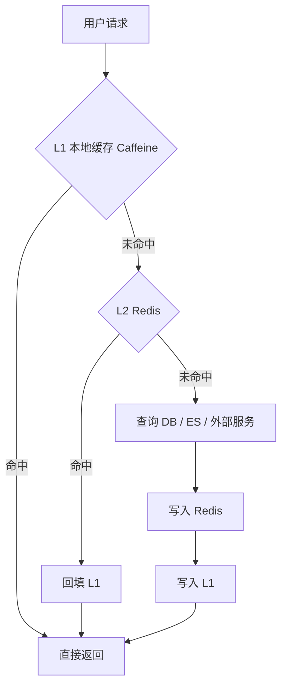
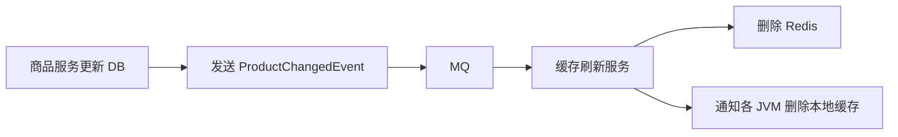
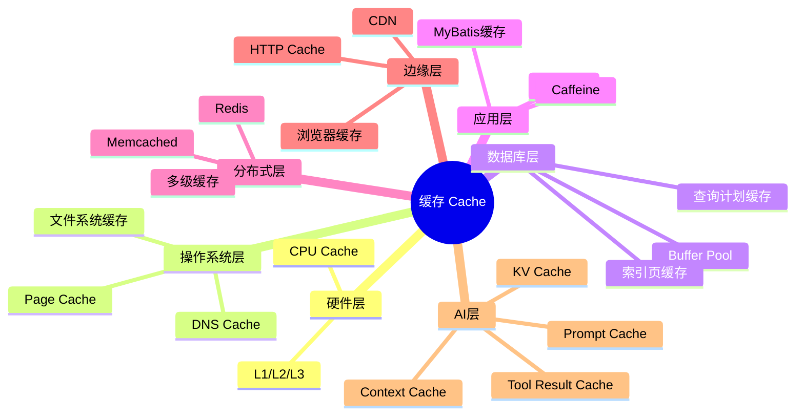

最近很多人在使用 DeepSeek、Claude Code、Codex、cc switch 这类 AI Coding 工具时，都会看到一个很震撼的现象：
 
> 大量输入 Token 并没有被重新计算，而是命中了缓存。

有些网上分享甚至提到 90% 以上的缓存命中率。这个数字看起来很夸张，但它背后的工程逻辑并不神秘。DeepSeek 官方文档中明确提到 Context Caching：当检测到重复输入时，可以复用已经缓存的内容，避免重复计算，从而降低延迟和成本；但它也是 best-effort，不保证 100% 命中，缓存不再使用后通常会在数小时到数天内自动清理。([DeepSeek API Docs](https://api-docs.deepseek.com/news/news0802?utm_source=chatgpt.com "DeepSeek API introduces Context Caching on Disk, cutting ..."))

对后端开发者来说，这件事应该很熟悉。

这不就是我们天天在后端系统里做的事情吗？

- 商品详情放 Redis，避免每次查 MySQL；
    
- 用户配置放 Caffeine，避免每次远程调用；
    
- 热门图片走 CDN，避免每次回源；
    
- 数据库 Buffer Pool 缓存数据页，避免每次读磁盘；
    
- 浏览器缓存静态资源，避免每次重新下载；
    
- 大模型缓存重复 Prompt 前缀，避免每次重新做上下文计算。
    

所以，缓存不是 Redis。Redis 只是缓存思想在后端系统中的一种典型实现。

真正值得理解的是：

> **缓存是一种跨越硬件、操作系统、数据库、后端架构、CDN、大模型推理和 AI Coding 的通用工程思想。**

---

# 一、缓存的本质：复用昂贵的重复计算

先给一个统一定义：

> **缓存的本质，是把昂贵、重复、可复用、并且允许一定时效性的计算结果保存下来，用空间、复杂度和一致性风险，换取性能、吞吐和成本优势。**

这句话里有几个关键词。

|关键词|含义|
|---|---|
|昂贵|CPU 贵、IO 贵、网络贵、数据库查询贵、LLM 输入 Token 贵|
|重复|同样的数据、同样的查询、同样的上下文被反复访问|
|可复用|结果在一段时间内仍然有效|
|时效性|可以接受短暂不一致，或者有失效机制|
|代价|内存、磁盘、缓存一致性、失效策略、复杂度|

所以判断一个东西该不该缓存，不是看“能不能缓存”，而是问三个问题：

1. **这个东西贵不贵？**
    
2. **这个东西会不会重复访问？**
    
3. **这个东西能不能接受短暂不一致？**
    

比如：

|场景|是否适合缓存|原因|
|---|---|---|
|商品详情|适合|读多写少，重复访问高|
|首页推荐配置|适合|变化不频繁，访问量大|
|用户权限|适合但要谨慎|需要处理权限变更后的失效|
|订单支付状态|谨慎|强业务一致性，不能长期脏读|
|秒杀库存|谨慎|高并发、高一致性、高风险|
|项目 README / 架构文档|适合 LLM Prompt Cache|AI Coding 中反复注入，内容稳定|
|每次都不同的错误日志|不适合作为稳定缓存前缀|重复性差|

这就是缓存设计的第一性原理。

---

# 二、计算机系统里到处都是缓存

缓存不是后端开发发明的东西。整个计算机系统的性能，几乎都建立在缓存之上。

### 1. 硬件层缓存

CPU 访问内存比访问寄存器慢，访问磁盘更慢。所以 CPU 有 L1、L2、L3 Cache。

```text
CPU Register
   ↓
L1 Cache
   ↓
L2 Cache
   ↓
L3 Cache
   ↓
Memory
   ↓
Disk
```

越靠近 CPU，速度越快，容量越小，价格越贵。

这就是最朴素的多级缓存思想。

后端系统里的 L1 本地缓存、L2 Redis、L3 数据库，本质上是在业务架构层面复刻了这个思想。

---

### 2. 操作系统层缓存

操作系统有 Page Cache。

你以为程序每次读文件都直接打磁盘，其实很多时候并不是。数据可能已经在操作系统的 Page Cache 里。

这对数据库尤其重要。

MySQL、PostgreSQL、Elasticsearch 这类系统都运行在操作系统之上。一次查询快，不一定只是 SQL 写得好，也可能是：

- 数据库自己的 Buffer Pool 命中了；
    
- 操作系统 Page Cache 命中了；
    
- 磁盘预读机制生效；
    
- 热点数据已经留在内存里。
    

所以很多性能测试第一次慢、第二次快，不一定是代码变快了，而是缓存热起来了。

---

### 3. 数据库内部缓存

以 MySQL InnoDB 为例，它有 Buffer Pool，用来缓存数据页和索引页。

当你执行：

```sql
SELECT id, order_no, status
FROM user_order
WHERE user_id = 10001
ORDER BY id DESC
LIMIT 20;
```

如果相关索引页、数据页已经在 Buffer Pool 中，那么查询会非常快。

如果不在，就可能触发磁盘 IO。

所以很多时候你以为自己是在“查数据库”，实际上是在“查数据库内存缓存”。

数据库不是每次都从磁盘搬数据。数据库本身就是一个高度依赖缓存的系统。

---

# 三、Java 后端里的缓存：从本地缓存到 Redis

后端开发者最熟悉的缓存，大概有两类：

1. **本地缓存**
    
2. **分布式缓存**
    

---

## 1. 本地缓存：Guava / Caffeine

本地缓存存在于应用 JVM 进程内。

典型代码如下：

```java
private final Cache<Long, UserProfile> userProfileCache = Caffeine.newBuilder()
        .maximumSize(100_000)
        .expireAfterWrite(Duration.ofMinutes(10))
        .build();

public UserProfile getUserProfile(Long userId) {
    return userProfileCache.get(userId, id -> userProfileRepository.findById(id));
}
```

本地缓存的优势非常明显：

- 速度极快；
    
- 不需要网络 IO；
    
- 不依赖 Redis；
    
- 适合缓存配置、字典、规则、低频变化对象。
    

但问题也很明显：

- 每个 JVM 一份缓存；
    
- 多实例之间不共享；
    
- 应用重启后缓存丢失；
    
- 数据变更后失效比较麻烦；
    
- 不适合存放强一致业务状态。
    

比如你有 5 个服务实例：

```text
OrderService-1: 本地缓存 A
OrderService-2: 本地缓存 B
OrderService-3: 本地缓存 C
OrderService-4: 本地缓存 D
OrderService-5: 本地缓存 E
```

如果用户权限变了，你需要让 5 个实例里的本地缓存都失效。否则某些实例可能还拿到旧权限。

这就是本地缓存的核心问题：

> **速度最快，但一致性最弱。**

---

## 2. 分布式缓存：Redis

Redis 是后端系统里最典型的分布式缓存。

```java
public ProductDetail getProductDetail(Long productId) {
    String key = "product:detail:" + productId;

    ProductDetail cached = redisTemplate.opsForValue().get(key);
    if (cached != null) {
        return cached;
    }

    ProductDetail detail = productRepository.queryDetail(productId);

    redisTemplate.opsForValue().set(key, detail, Duration.ofMinutes(30));

    return detail;
}
```

Redis 解决的问题是：

- 多个应用实例共享缓存；
    
- 减少数据库压力；
    
- 支撑热点数据高并发访问；
    
- 支持 TTL、分布式锁、计数器、排行榜、会话等场景。
    

但 Redis 不是银弹。

它会带来新的问题：

|问题|说明|
|---|---|
|缓存穿透|查询不存在的数据，缓存和数据库都没有|
|缓存击穿|热点 Key 过期，大量请求同时打到数据库|
|缓存雪崩|大量 Key 同时失效，数据库瞬间被打爆|
|缓存一致性|数据库更新了，缓存什么时候删？|
|热 Key|某个 Redis Key 请求过高，单点压力过大|
|大 Key|单个 Value 太大，影响网络和 Redis 性能|

后端工程里真正难的不是“会用 Redis”，而是知道：

> Redis 应该缓存什么，不应该缓存什么，什么时候删缓存，缓存挂了怎么办，缓存未命中时系统能不能扛住。

---

# 四、多级缓存：L1、L2、L3 的工程取舍

高并发业务里，经常会用多级缓存。

典型架构：



分层之后，每一层承担不同职责：

|层级|速度|一致性|容量|典型用途|
|---|--:|--:|--:|---|
|L1 本地缓存|极快|较弱|小|配置、字典、热点对象|
|L2 Redis|快|中等|中|商品详情、用户信息、会话|
|L3 DB / ES|慢|权威数据源|大|持久化数据|

这种结构的意义不是“显得架构复杂”，而是让请求尽量在更近、更便宜、更快的层级被拦截。

这和 CPU Cache 的设计思想是一样的：

```text
越靠近请求入口，越快，但容量越小，一致性越弱。
越靠近数据源，越慢，但容量越大，权威性越强。
```

---

# 五、用商品详情案例讲清多级缓存

假设有一个电商商品详情页，访问量很高，但商品基础信息变化不频繁。

我们可以设计：

- L1：Caffeine，本地缓存 1 分钟；
    
- L2：Redis，分布式缓存 30 分钟；
    
- L3：MySQL，权威数据源。
    

### 示例代码

```java
@Service
public class ProductQueryService {

    private final ProductRepository productRepository;
    private final RedisTemplate<String, ProductDetailDTO> redisTemplate;

    private final Cache<Long, ProductDetailDTO> localCache = Caffeine.newBuilder()
            .maximumSize(50_000)
            .expireAfterWrite(Duration.ofMinutes(1))
            .build();

    public ProductQueryService(ProductRepository productRepository,
                               RedisTemplate<String, ProductDetailDTO> redisTemplate) {
        this.productRepository = productRepository;
        this.redisTemplate = redisTemplate;
    }

    public ProductDetailDTO getProductDetail(Long productId) {
        // 1. 先查 L1 本地缓存
        ProductDetailDTO localResult = localCache.getIfPresent(productId);
        if (localResult != null) {
            return localResult;
        }

        String redisKey = "product:detail:" + productId;

        // 2. 再查 L2 Redis
        ProductDetailDTO redisResult = redisTemplate.opsForValue().get(redisKey);
        if (redisResult != null) {
            // Redis 命中后，回填本地缓存
            localCache.put(productId, redisResult);
            return redisResult;
        }

        // 3. 最后查 L3 数据库
        ProductDetailDTO dbResult = productRepository.queryProductDetail(productId);
        if (dbResult == null) {
            // 防止缓存穿透：缓存空值，但 TTL 要短
            ProductDetailDTO empty = ProductDetailDTO.empty(productId);
            redisTemplate.opsForValue().set(redisKey, empty, Duration.ofMinutes(3));
            localCache.put(productId, empty);
            return empty;
        }

        // 4. 写入 Redis，TTL 加随机扰动，降低缓存雪崩概率
        Duration ttl = Duration.ofMinutes(30 + ThreadLocalRandom.current().nextInt(1, 10));
        redisTemplate.opsForValue().set(redisKey, dbResult, ttl);

        // 5. 写入本地缓存
        localCache.put(productId, dbResult);

        return dbResult;
    }

    public void updateProduct(ProductUpdateCommand command) {
        // 1. 先更新数据库
        productRepository.updateProduct(command);

        Long productId = command.productId();
        String redisKey = "product:detail:" + productId;

        // 2. 再删除缓存，而不是直接更新缓存
        redisTemplate.delete(redisKey);
        localCache.invalidate(productId);
    }
}
```

这段代码里有几个关键点。

---

## 1. 为什么更新时通常是“删除缓存”，而不是“更新缓存”？

因为更新缓存容易产生并发覆盖问题。

假设两个线程同时更新商品：

```text
线程 A 更新商品价格为 100
线程 B 更新商品价格为 120
```

如果它们都更新缓存，可能出现：

```text
数据库最终是 120
缓存却被线程 A 后写成 100
```

所以很多业务里更推荐：

```text
更新数据库 → 删除缓存
```

下一次查询再从数据库加载新数据。

这不是绝对规则，但它是常见安全策略。

---

## 2. 为什么 TTL 要加随机值？

如果大量商品缓存都设置 30 分钟过期：

```text
product:detail:1   30min
product:detail:2   30min
product:detail:3   30min
...
```

那么 30 分钟后可能集中失效，瞬间打爆数据库。

所以更好的做法是：

```text
30min + random(1~10min)
```

让过期时间打散。

这和你之前理解分库分表时讲的“打散压力”是同一个思想。

---

## 3. 为什么空值也要缓存？

如果有人不断请求不存在的商品 ID：

```text
/product/999999999
/product/999999998
/product/999999997
```

这些数据 Redis 没有，数据库也没有。

如果不缓存空值，每次都会打数据库。

所以可以短时间缓存空结果：

```text
product:detail:999999999 -> EMPTY, TTL 3min
```

这就是防止缓存穿透。

---

# 六、缓存三大经典问题：穿透、击穿、雪崩

## 1. 缓存穿透

### 现象

请求的数据根本不存在。

```text
请求 → Redis 没有 → MySQL 也没有 → 每次都打 MySQL
```

### 解决方案

|方案|说明|
|---|---|
|参数校验|非法 ID 直接拦截|
|缓存空值|查不到也缓存短时间|
|布隆过滤器|先判断数据是否可能存在|

---

## 2. 缓存击穿

### 现象

某个热点 Key 过期，大量请求同时打到数据库。

```text
热点商品缓存过期
10000 个请求同时进来
全部发现 Redis 没有
全部查 MySQL
数据库被打爆
```

### 解决方案

|方案|说明|
|---|---|
|互斥锁|只有一个线程回源，其他线程等待|
|逻辑过期|旧值先返回，后台异步刷新|
|热点 Key 永不过期|通过主动刷新控制更新|
|限流降级|数据源压力过高时保护系统|

---

## 3. 缓存雪崩

### 现象

大量缓存同一时间失效，数据库压力暴涨。

### 解决方案

|方案|说明|
|---|---|
|TTL 加随机值|避免集中失效|
|多级缓存|本地缓存兜底|
|预热缓存|系统启动或活动前提前加载|
|限流熔断|数据源扛不住时降级|
|Redis 高可用|避免缓存层整体不可用|

---

# 七、缓存一致性：缓存系统真正难的地方

缓存最难的不是读，而是写。

读流程很简单：

```text
先查缓存
缓存没有再查数据库
查到后写缓存
```

难的是数据变更：

```text
数据库更新了，缓存怎么办？
```

常见策略有几种。

---

## 1. 先更新数据库，再删除缓存

这是最常见方案。

```text
update DB
delete cache
```

优点：

- 简单；
    
- 风险相对低；
    
- 下一次请求自然加载新数据。
    

缺点：

- 删除缓存失败会导致旧数据残留；
    
- 并发场景下仍可能短暂不一致。
    

---

## 2. 延迟双删

```text
delete cache
update DB
sleep 500ms
delete cache again
```

这个方案常见于一些并发读写场景，但它不优雅。

问题是：

- sleep 时间不好定；
    
- 会增加请求耗时；
    
- 不是严格一致性方案；
    
- 更像是工程补丁。
    

---

## 3. 基于消息队列异步失效

```text
业务更新 DB
发送商品变更消息
缓存服务消费消息
删除 Redis / 本地缓存
```

这种方式适合多服务、多实例、多缓存层场景。

比如：



优点：

- 解耦；
    
- 可扩展；
    
- 适合多实例缓存失效。
    

缺点：

- MQ 延迟会导致短暂不一致；
    
- 消息丢失要补偿；
    
- 消费失败要重试；
    
- 需要幂等。
    

---

## 4. 版本号机制

缓存 Value 中带版本号。

```json
{
  "productId": 10001,
  "name": "机械键盘",
  "price": 29900,
  "version": 17
}
```

当数据更新时，版本号增加。读取时如果发现缓存版本低于数据库版本，就丢弃旧缓存。

这种方案更复杂，但在一些一致性要求较高的系统中有价值。

---

# 八、缓存不是越多越好

缓存有一个常见误区：

> 只要系统慢，就加 Redis。

这是不成熟的架构思维。

缓存只能解决一类问题：

> 重复读、读多写少、可以接受短暂不一致的性能问题。

它解决不了：

- SQL 写得烂；
    
- 索引设计错误；
    
- 数据模型混乱；
    
- 事务边界不清晰；
    
- 服务拆分不合理；
    
- 强一致业务被错误缓存；
    
- 缓存击穿后数据库完全扛不住；
    
- 缓存数据错误导致业务事故。
    

有时候，正确方案不是加缓存，而是：

- 优化索引；
    
- 改 SQL；
    
- 拆表；
    
- 读写分离；
    
- 异步化；
    
- 预计算；
    
- 限流；
    
- 降级；
    
- 改数据模型。
    

缓存是性能工具，不是架构遮羞布。

---

# 九、大模型 Prompt Cache：不是缓存最终答案

现在回到 DeepSeek、OpenAI、Claude 这些大模型缓存。

很多人容易误解：

> Prompt Cache 是不是把上一次问题和答案缓存起来，下次直接返回？

不完全是。

更准确地说，Prompt Cache 通常缓存的是**重复输入上下文的中间计算结果**，尤其是长 Prompt 的公共前缀。

OpenAI 文档中提到，Prompt Caching 会缓存之前已经计算过的最长 Prompt 前缀，从 1024 tokens 开始，并以 128-token 增量增长；如果复用具有共同前缀的 Prompt，会自动应用缓存。([OpenAI](https://openai.com/index/api-prompt-caching/?utm_source=chatgpt.com "Prompt Caching in the API"))

可以粗略理解为：

```text
稳定的系统提示词
+ 稳定的工具定义
+ 稳定的项目文档
+ 稳定的历史上下文
+ 本轮新问题
```

如果前面大段内容没有变化，模型服务商就有机会复用之前已经计算过的部分。

这和 Redis 查询商品详情的逻辑有相似之处：

|后端缓存|LLM Prompt Cache|
|---|---|
|Key 是商品 ID / URL / Query Hash|Key 近似是 Prompt 前缀指纹|
|Value 是商品详情 JSON|Value 是已计算的上下文中间状态|
|命中后少查数据库|命中后少做 prefill 计算|
|TTL 后失效|缓存过期或被清理|
|Key 稳定，命中率高|Prompt 前缀稳定，命中率高|
|Key 变化，缓存失效|前缀变化，缓存命中下降|

所以，大模型缓存的重点不是“答案复用”，而是：

> **上下文计算复用。**

---

# 十、KV Cache 和 Prompt Cache 的关系

简单说：

- **KV Cache** 更多是模型推理过程内部为了避免重复计算注意力中的 Key / Value；
    
- **Prompt Cache / Context Cache** 更偏服务层能力，用来跨请求复用重复上下文的计算结果。
    

不用陷入推理系统细节。对后端开发者来说，只需要理解这个类比：

```text
单次请求内 KV Cache：
像一次方法调用内部的临时缓存。

跨请求 Prompt Cache：
像服务端缓存了公共输入前缀，后续请求可以复用。
```

在长上下文、多轮对话、AI Agent、AI Coding 场景中，后者特别重要。

因为这些场景会反复携带大量重复内容：

- 系统提示词；
    
- 工具定义；
    
- 项目规范；
    
- 架构文档；
    
- 代码文件；
    
- 之前的任务计划；
    
- 测试日志；
    
- 错误栈；
    
- diff 信息。
    

如果每轮都完整重新计算，成本会非常高。

---

# 十一、AI Coding 为什么特别依赖缓存？

AI Coding 的上下文有一个明显特点：

> 稳定内容很多，动态内容也很多。

稳定内容包括：

```text
System Prompt
项目技术栈
AGENTS.md / CLAUDE.md
代码规范
目录结构
架构约束
核心接口设计
已有实现文件
```

动态内容包括：

```text
当前用户指令
当前报错
当前 diff
当前测试输出
当前执行日志
```

如果上下文组织得很差，每次请求都把内容乱序拼接，缓存命中率就会下降。

比如错误做法：

```text
本轮错误日志
随机几个文件
用户新需求
系统提示词
项目规范
另一个日志
工具定义
```

这种结构的问题是：前缀不稳定。

更好的结构是：

```text
稳定部分放前面：
1. System Prompt
2. 项目总纲
3. 架构约束
4. 技术规范
5. 工具定义
6. 稳定代码上下文

动态部分放后面：
7. 当前任务
8. 当前错误
9. 当前 diff
10. 当前测试输出
```

这就是“缓存友好型上下文工程”。

它和后端缓存 Key 设计很像。

后端里 Key 设计混乱，命中率就低：

```text
user:1
User:1
profile:user:1
profile:1:user
```

LLM 里 Prompt 前缀混乱，缓存命中率也会低。

所以，AI Coding 的上下文管理，本质上已经很像缓存工程。

---

# 十二、从后端缓存到 AI Coding 的统一方法论

可以抽象成五个问题。

## 1. 缓存什么？

后端里问：

```text
商品详情要不要缓存？
用户信息要不要缓存？
权限数据要不要缓存？
库存数据要不要缓存？
```

AI Coding 里问：

```text
项目总纲要不要长期稳定注入？
AGENTS.md 是否应该保持稳定？
接口规范是否应该固定？
测试报告是否应该每次都放进去？
历史对话是否应该全部塞进去？
```

不是所有东西都值得缓存。

值得缓存的是：

- 稳定；
    
- 高频复用；
    
- 对当前任务有价值；
    
- 变更频率低；
    
- 能明显降低成本或提升质量。
    

---

## 2. Key 怎么设计？

后端缓存 Key 要稳定、清晰、可控：

```text
product:detail:10001
user:profile:20001
order:summary:30001
```

LLM Prompt Cache 里虽然你不直接设计底层 Key，但你可以通过稳定 Prompt 结构影响缓存：

```text
固定 System Prompt
固定工具定义顺序
固定项目文档顺序
固定上下文拼接模板
避免在前缀区域插入随机内容
```

这就是间接设计缓存 Key。

---

## 3. 什么时候失效？

后端里有：

- TTL；
    
- 主动删除；
    
- MQ 通知；
    
- 版本号；
    
- 定时刷新；
    
- 管理后台手动刷新。
    

AI Coding 里也有类似问题：

- 项目文档改了，旧上下文还能不能用？
    
- 架构规范变了，旧 Prompt 是否需要废弃？
    
- 代码结构变了，之前缓存的上下文是否误导模型？
    
- 测试结果过期了，是否还应该继续注入？
    

很多 AI Coding 翻车，本质上就是用了“过期上下文”。

模型看起来在认真推理，其实依据的是旧文档、旧接口、旧计划。

这和后端读到了脏缓存没有本质区别。

---

## 4. 未命中怎么办？

后端缓存未命中时：

```text
Redis 没有 → 查 DB → 写缓存
```

但如果未命中流量太大，DB 会被打爆。

所以要有：

- 限流；
    
- 熔断；
    
- 互斥锁；
    
- 逻辑过期；
    
- 预热；
    
- 降级。
    

AI Coding 也一样。

当上下文缓存命中率低时：

- 成本升高；
    
- 首 token 延迟增加；
    
- 长上下文处理变慢；
    
- 工具反复读文件；
    
- Agent 重复扫描项目；
    
- 模型更容易迷失重点。
    

对应策略是：

- 稳定项目文档；
    
- 控制上下文顺序；
    
- 减少无关内容；
    
- 把长期规则放在固定文件里；
    
- 把动态日志放在后面；
    
- 大任务拆小；
    
- 每个阶段生成明确的验收标准。
    

---

## 5. 如何兜底？

后端系统不能假设缓存永远可用。

Redis 挂了怎么办？

- 直接打数据库可能把数据库打死；
    
- 应该有限流、降级、本地缓存兜底；
    
- 核心链路要保护数据源。
    

AI Coding 也不能假设模型总能记住上下文。

应该有：

- 项目文档包；
    
- 任务计划；
    
- 验收标准；
    
- 测试脚本；
    
- CI；
    
- 代码审查；
    
- 人工确认真实页面效果。
    

这也是你之前在 AI Coding 项目里遇到的问题：

> Codex 说 Phase 1、2、3 都完成了，但实际接口没实现，页面不可用。

这不是单纯模型能力问题，也和“上下文、计划、验收、缓存、状态管理”有关。

Agent 一旦重启或上下文丢失，如果没有稳定的项目状态文档，它就会重新扫描项目、重新制定计划，甚至重复做无关修复。

从缓存角度看，这叫：

> 工作状态没有被可靠持久化，导致上下文复用失败。

---

# 十三、缓存、分表、MQ、限流其实是一组思想

你之前提过一个很好的主题：

> 从“打散压力”的角度理解 MySQL 水平分表、Kafka Partition、ES Shard、Redis Slot。

这次缓存可以和它形成一组更完整的架构认知。

|架构手段|核心思想|典型技术|
|---|---|---|
|缓存|提前拦截和复用请求|Caffeine、Redis、CDN、Prompt Cache|
|分片|把压力打散到多个承载单元|分库分表、Kafka Partition、ES Shard|
|MQ|把瞬时压力削峰填谷|RocketMQ、Kafka、RabbitMQ|
|限流|把超过系统承载的请求挡住|Sentinel、RateLimiter、网关限流|
|降级|牺牲非核心能力保护主链路|fallback、静态页、默认值|
|预计算|把在线计算提前到离线阶段|报表、推荐、排行榜|
|CDN|把内容推到离用户更近的地方|静态资源、图片、视频|

缓存对应的是：

> 不让请求继续向后打。

分片对应的是：

> 让请求打到不同地方。

MQ 对应的是：

> 不让请求同时打。

限流对应的是：

> 超过承载就不让打。

降级对应的是：

> 打不过就返回简化结果。

这些不是孤立技术，而是一套系统承压方法论。

---

# 十四、缓存命中率不是越高越好

看到 DeepSeek 或某些 AI Coding 工具的高 cache hit rate，很容易产生一个误解：

> 缓存命中率越高，系统就一定越好。

不一定。

缓存命中率要结合业务语义看。

后端里，99% 命中率可能很好，也可能很危险。

比如：

- 命中的是旧权限数据，可能导致越权；
    
- 命中的是旧价格，可能导致资损；
    
- 命中的是旧库存，可能导致超卖；
    
- 命中的是错误结果，可能扩大故障影响。
    

LLM 里也一样：

- cached tokens 很高，不代表回答质量高；
    
- Prompt Cache 命中高，不代表上下文组织合理；
    
- 缓存了旧项目文档，反而会误导 Agent；
    
- 缓存了错误计划，模型可能继续沿着错误方向执行。
    

所以缓存指标至少要看四个层面：

|指标|说明|
|---|---|
|命中率|有多少请求命中了缓存|
|命中价值|命中的是否是昂贵路径|
|数据正确性|命中结果是否仍然可信|
|未命中保护|缓存失效时系统是否能扛住|

这也是成熟工程师和初级工程师的区别。

初级工程师看：

```text
缓存命中率 95%，真高。
```

成熟工程师会问：

```text
命中的是什么？
未命中会怎样？
数据会不会脏？
失效链路是否可靠？
缓存挂了系统会不会雪崩？
```

---

# 十五、缓存设计的工程原则

最后总结成几条实际原则。

## 1. 读多写少，优先考虑缓存

典型场景：

- 商品详情；
    
- 用户基础资料；
    
- 系统配置；
    
- 字典数据；
    
- 首页模块；
    
- 热门文章；
    
- 项目文档；
    
- LLM 工具定义；
    
- AI Coding 项目规则。
    

---

## 2. 强一致状态，谨慎缓存

谨慎缓存：

- 支付状态；
    
- 账户余额；
    
- 实时库存；
    
- 风控结果；
    
- 权限变更；
    
- 订单核心状态。
    

这些不是绝对不能缓存，而是必须有明确一致性策略。

---

## 3. 缓存 Key 要稳定

后端里 Key 稳定，Redis 命中率才高。

AI Coding 里 Prompt 前缀稳定，Prompt Cache 才更容易命中。

所以：

```text
稳定内容放前面
动态内容放后面
文档顺序不要频繁变化
工具定义不要随机拼接
项目规范不要每轮重写
```

---

## 4. 缓存一定要有失效策略

没有失效策略的缓存，就是未来的事故。

至少要明确：

- TTL 多久；
    
- 谁负责删除；
    
- 删除失败怎么办；
    
- 是否需要 MQ 通知；
    
- 是否需要版本号；
    
- 是否允许读旧数据；
    
- 最大可接受不一致时间是多少。
    

---

## 5. 缓存未命中时要保护数据源

不能假设缓存永远命中。

要考虑：

- Redis 挂了；
    
- 热 Key 过期；
    
- 大量 Key 同时失效；
    
- 本地缓存被清空；
    
- LLM Prompt Cache 失效；
    
- Agent 重启后上下文丢失。
    

没有兜底机制的缓存系统，本质上是在透支数据源的稳定性。

---

# 十六、结论：缓存是一种系统设计思想

缓存不是 Redis。

Redis 只是缓存的一种外在形态。

真正的缓存思想，贯穿整个计算机系统：



从 Java 后端到大模型推理，从 Redis 到 DeepSeek Prompt Cache，背后的核心逻辑是一致的：

> **缓存 = 复用 + 局部性 + 分层 + 失效 + 一致性权衡。**

后端工程师如果真正理解缓存，就不只是会写：

```java
redisTemplate.opsForValue().get(key);
```

而是能理解：

- 为什么数据库查询第一次慢、第二次快；
    
- 为什么 Redis 能抗住高并发读；
    
- 为什么缓存会带来一致性问题；
    
- 为什么 CDN 可以扛住海量静态资源访问；
    
- 为什么 AI Coding 工具的 cached tokens 会显著影响成本；
    
- 为什么项目文档、System Prompt、工具定义的稳定性会影响大模型缓存效果；
    
- 为什么 Agent 重启后容易“失忆”和重复扫描项目；
    
- 为什么上下文工程，本质上越来越像一种缓存工程。
    

以前我们说后端架构要懂缓存，是为了抗并发、降延迟、保数据库。

现在到了大模型时代，缓存又多了一层意义：

> **它不仅影响系统性能，也影响 AI Coding 的成本、速度、上下文复用能力和工程稳定性。**

所以，缓存不是一个中间件知识点。

它是一种底层工程思维。