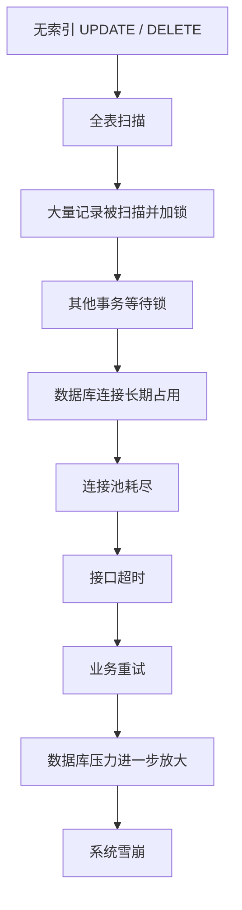

很多后端开发者都知道一句经验：

> 大表更新、删除时，`WHERE` 条件必须走索引。

但这句话背后的真实风险，往往被低估了。

无索引 SQL 的问题不是单纯“查询慢一点”，而是它可能让 InnoDB 扫描大量记录、持有大量锁、阻塞其他事务，最终导致连接池耗尽、请求堆积、数据库整体雪崩。

这类问题在生产环境里非常危险。

---

## 1. 先给结论

在 InnoDB 中，下面这些 SQL 如果条件字段没有合适索引：

```sql
UPDATE user_order
SET order_status = 2
WHERE order_no = 'ORD202605160001';
```

```sql
DELETE FROM user_order
WHERE order_no = 'ORD202605160001';
```

```sql
SELECT id, order_status
FROM user_order
WHERE order_no = 'ORD202605160001'
FOR UPDATE;
```

就会出现一个关键问题：

> MySQL 无法通过索引精确定位目标行，只能全表扫描。  
> 对于更新、删除、加锁查询这类“当前读”操作，扫描过程中可能对大量记录加锁，锁范围可能接近全表。

所以更准确的说法不是：

> 无索引就一定锁整张表。

而是：

> 无索引会导致扫描范围极大，写操作或加锁读可能锁住大量记录，业务效果上接近“锁表”，并引发严重阻塞。

这才是问题的本质。

---

## 2. 为什么普通查询慢，不一定会拖垮数据库？

先区分两类 SQL。

### 普通 SELECT

```sql
SELECT id, order_status
FROM user_order
WHERE order_no = 'ORD202605160001';
```

如果 `order_no` 没有索引，这条 SQL 会全表扫描。

它的主要问题是：

```text
CPU 消耗高
I/O 消耗高
Buffer Pool 被污染
响应时间变长
```

但普通 `SELECT` 在 InnoDB 的 MVCC 机制下，通常是**一致性读**，不会对扫描到的行加排他锁。

所以它危险，但还不是最危险。

---

### UPDATE / DELETE / SELECT FOR UPDATE

真正危险的是这类 SQL：

```sql
UPDATE user_order
SET order_status = 2
WHERE order_no = 'ORD202605160001';
```

```sql
DELETE FROM user_order
WHERE order_no = 'ORD202605160001';
```

```sql
SELECT id
FROM user_order
WHERE order_no = 'ORD202605160001'
FOR UPDATE;
```

它们不是普通快照读，而是当前读，会涉及加锁。

一旦没有索引，MySQL 就不能快速定位目标记录，只能从头到尾扫描整张表。

扫描过程中，为了保证更新、删除或加锁读的正确性，InnoDB 可能对大量扫描到的记录加锁。

这就是无索引写操作真正可怕的地方。

---

## 3. 用一个订单表看清楚问题

假设有一张订单表：

```sql
CREATE TABLE user_order (
    id BIGINT UNSIGNED NOT NULL AUTO_INCREMENT COMMENT '主键ID',
    order_no VARCHAR(64) NOT NULL COMMENT '订单号',
    user_id BIGINT UNSIGNED NOT NULL COMMENT '用户ID',
    order_status TINYINT NOT NULL COMMENT '订单状态',
    pay_amount DECIMAL(10, 2) NOT NULL COMMENT '支付金额',
    create_time DATETIME NOT NULL COMMENT '创建时间',
    update_time DATETIME NOT NULL COMMENT '更新时间',
    PRIMARY KEY (id)
) ENGINE=InnoDB DEFAULT CHARSET=utf8mb4;
```

现在表里有 1000 万条数据。

如果 `order_no` 没有索引，执行：

```sql
UPDATE user_order
SET order_status = 2,
    update_time = NOW()
WHERE order_no = 'ORD202605160001';
```

从业务角度看，你只是想更新一条订单。

但从数据库执行角度看，MySQL 可能要做的是：

```text
扫描第 1 行
判断 order_no 是否匹配

扫描第 2 行
判断 order_no 是否匹配

扫描第 3 行
判断 order_no 是否匹配

...

扫描第 1000 万行
判断 order_no 是否匹配
```

也就是说，业务上是“更新一条记录”，执行上却是“扫描整张大表”。

---

## 4. 为什么无索引更新会引发大量锁？

InnoDB 的行锁不是凭空加在“行”上的，而是加在**索引记录**上的。

如果条件命中索引：

```sql
CREATE UNIQUE INDEX uq_order_no ON user_order(order_no);
```

再执行：

```sql
UPDATE user_order
SET order_status = 2
WHERE order_no = 'ORD202605160001';
```

MySQL 可以通过 `uq_order_no` 精确定位到目标记录。

此时锁范围很小：

```text
通过 order_no 索引定位目标记录
只锁住目标索引记录和对应主键记录
更新完成
提交事务
```

但如果没有索引：

```text
没有 order_no 索引
只能扫描聚簇索引，也就是主键索引整棵树
扫描大量记录
判断每一行是否满足条件
过程中可能锁住大量记录
```

所以问题不是“有没有索引会不会影响查询速度”这么简单，而是：

> 有索引，锁可以精准命中。  
> 没索引，锁可能随着扫描范围扩大。

这就是线上事故的根源。

---

## 5. 它是怎么一步步拖垮数据库的？

假设事务 A 执行一条无索引更新：

```sql
BEGIN;

UPDATE user_order
SET order_status = 2
WHERE order_no = 'ORD202605160001';

-- 长时间未提交
```

因为 `order_no` 没有索引，这条 SQL 开始全表扫描，并在过程中持有大量锁。

此时事务 B 进来：

```sql
UPDATE user_order
SET order_status = 3
WHERE id = 10086;
```

注意，事务 B 明明用了主键 `id`，但如果这条记录已经被事务 A 扫描并锁住，事务 B 仍然会等待。

接下来更多请求进来：

```text
事务 C 等待锁
事务 D 等待锁
事务 E 等待锁
事务 F 等待锁
```

然后应用层开始出问题：

```text
数据库连接被长时间占用
连接池可用连接越来越少
业务请求排队
接口响应超时
上游系统开始重试
重试流量进一步放大压力
数据库 CPU / I/O / 锁等待继续升高
```

最后就会出现典型的雪崩链路：



所以你说“越执行越慢，最后拖垮数据库”，这个判断在生产环境中是成立的。

只是技术表述上要更精确：不是 MySQL 直接把整张表锁成表锁，而是无索引导致扫描范围巨大，行锁影响范围极大，最终业务效果接近锁表。

---

## 6. 最危险的几类 SQL

### 6.1 无索引 UPDATE

```sql
UPDATE user_order
SET order_status = 2
WHERE order_no = 'ORD202605160001';
```

如果 `order_no` 没索引，这是典型危险 SQL。

业务上看是更新一条订单，数据库可能扫完整张表。

---

### 6.2 无索引 DELETE

```sql
DELETE FROM user_order
WHERE user_id = 10001;
```

如果 `user_id` 没索引，也可能全表扫描。

删除比更新更危险，因为它还可能带来：

```text
大量 undo log
大量 redo log
长事务
锁等待
主从延迟
Buffer Pool 抖动
Binlog 膨胀
磁盘 I/O 压力
```

尤其是一次性删除大量历史数据时，非常容易引发线上事故。

---

### 6.3 无索引 SELECT FOR UPDATE

```sql
SELECT id, order_status
FROM user_order
WHERE order_no = 'ORD202605160001'
FOR UPDATE;
```

很多人以为这是查询，不危险。

但 `FOR UPDATE` 是加锁读。

如果条件字段没有索引，这类 SQL 一样可能大范围扫描并加锁。

---

### 6.4 低区分度索引更新

有索引也不一定绝对安全。

比如：

```sql
CREATE INDEX idx_order_status ON user_order(order_status);
```

然后执行：

```sql
UPDATE user_order
SET order_status = 9
WHERE order_status = 1;
```

如果表里 80% 的订单状态都是 `1`，那么这个索引区分度很低。

即使命中了索引，也可能锁住大量记录。

所以生产判断不能只看“有没有索引”，还要看：

```text
索引是否被执行计划使用
索引区分度是否足够
扫描行数是否可控
更新行数是否可控
事务是否足够短
是否会产生大范围锁等待
```

---

## 7. 用 EXPLAIN 判断危险程度

执行更新或删除前，至少要看执行计划。

```sql
EXPLAIN
UPDATE user_order
SET order_status = 2
WHERE order_no = 'ORD202605160001';
```

重点看几个字段：

|字段|危险信号|含义|
|---|---|---|
|`type`|`ALL`|全表扫描|
|`key`|`NULL`|没有使用索引|
|`rows`|很大|预计扫描大量行|
|`Extra`|`Using where`|扫描后再过滤|

如果看到类似：

```text
type = ALL
key = NULL
rows = 10000000
```

这类 SQL 不应该直接在线上执行。

尤其是：

```sql
UPDATE ...
DELETE ...
SELECT ... FOR UPDATE
```

比普通 `SELECT` 更要谨慎。

---

## 8. 正确做法：让写操作精准命中索引

如果经常根据订单号更新订单：

```sql
UPDATE user_order
SET order_status = 2
WHERE order_no = 'ORD202605160001';
```

那么 `order_no` 应该有唯一索引：

```sql
CREATE UNIQUE INDEX uq_order_no ON user_order(order_no);
```

如果经常根据用户查询订单：

```sql
SELECT id, order_no, order_status, create_time
FROM user_order
WHERE user_id = 10001
ORDER BY create_time DESC
LIMIT 20;
```

可以设计联合索引：

```sql
CREATE INDEX idx_user_id_create_time
ON user_order(user_id, create_time);
```

如果有定时任务扫描待处理订单：

```sql
SELECT id, order_no
FROM user_order
WHERE order_status = 1
  AND create_time < '2026-05-16 00:00:00'
ORDER BY id
LIMIT 100;
```

可以考虑：

```sql
CREATE INDEX idx_status_create_time_id
ON user_order(order_status, create_time, id);
```

核心原则：

> 写操作的 `WHERE` 条件必须具备可控的索引访问路径。

---

## 9. 大批量更新/删除必须分批

即使有索引，也不要轻易一次性操作大量数据。

危险写法：

```sql
DELETE FROM user_order
WHERE create_time < '2025-01-01';
```

如果命中几百万行，会产生长事务和大量日志。

更稳的写法是分批处理：

```sql
DELETE FROM user_order
WHERE create_time < '2025-01-01'
ORDER BY id
LIMIT 1000;
```

每次删除 1000 条，循环执行，每批单独提交。

更工程化的做法是先查主键，再按主键删除：

```sql
SELECT id
FROM user_order
WHERE create_time < '2025-01-01'
ORDER BY id
LIMIT 1000;
```

然后：

```sql
DELETE FROM user_order
WHERE id IN (...);
```

这样好处是：

```text
每批锁范围更小
事务时间更短
undo / redo 压力更可控
主从延迟更可控
失败后更容易恢复
```

---

## 10. 事务一定要短

很多线上问题不是 SQL 本身执行 1 秒，而是事务持锁 30 秒、1 分钟、甚至更久。

危险写法：

```sql
BEGIN;

UPDATE user_order
SET order_status = 2
WHERE order_no = 'ORD202605160001';

-- 事务中调用远程接口
-- 事务中处理文件
-- 事务中执行复杂业务逻辑
-- 很久以后才提交

COMMIT;
```

这会导致数据库锁长期不释放。

正确原则：

```text
事务里只放必要的数据库操作
不要在事务中做 RPC 调用
不要在事务中做文件上传
不要在事务中做复杂计算
不要在事务中等待用户操作
尽快提交或回滚
```

数据库锁的危险不只取决于“锁了多少行”，还取决于“锁了多久”。

---

## 11. 生产环境的基本规范

对 Java 后端开发来说，可以把这类规范写进团队 SQL 约束：

### 11.1 UPDATE / DELETE 必须带 WHERE

禁止：

```sql
UPDATE user_order
SET order_status = 9;
```

禁止：

```sql
DELETE FROM user_order;
```

---

### 11.2 WHERE 条件必须命中索引

高危：

```sql
UPDATE user_order
SET order_status = 2
WHERE order_no = 'ORD202605160001';
```

如果 `order_no` 没索引，禁止直接执行。

---

### 11.3 大表变更必须先 EXPLAIN

尤其是：

```text
UPDATE
DELETE
INSERT INTO ... SELECT
SELECT ... FOR UPDATE
批量状态修复 SQL
定时任务扫描 SQL
```

上线前必须确认执行计划。

---

### 11.4 大批量数据变更必须分批

禁止一次性大事务：

```sql
DELETE FROM user_order
WHERE create_time < '2025-01-01';
```

推荐分批、限速、可暂停、可恢复。

---

### 11.5 线上修数据必须有回滚方案

执行前至少准备：

```text
影响行数预估
执行计划
备份 SQL
回滚 SQL
分批脚本
执行窗口
监控指标
异常中断方案
```

线上修数据不是“跑一条 SQL”，而是一次小型变更发布。

---

## 12. 最终总结

无索引更新、删除、加锁查询的危险点不只是“SQL 慢”。

它真正的问题是：

```text
没有索引
↓
无法精确定位目标行
↓
只能大范围扫描
↓
写操作 / 加锁读过程中可能锁住大量记录
↓
其他事务被阻塞
↓
数据库连接被占用
↓
连接池耗尽
↓
业务请求超时
↓
重试流量放大
↓
数据库被拖垮
```

所以，生产环境里必须建立一个基本认知：

> 对大表来说，写操作的 WHERE 条件不走索引，就是严重风险。  
> 它不是简单的性能问题，而是锁、事务、连接池、重试流量共同放大的稳定性问题。

更适合面试或技术分享中的表达是：

> InnoDB 虽然是行锁引擎，但行锁依赖索引实现。如果更新、删除或 `SELECT FOR UPDATE` 的条件没有合适索引，数据库无法精准定位目标记录，只能全表扫描。扫描过程中可能对大量记录加锁，导致锁等待扩散。随着连接池被占满、请求超时和重试流量增加，最终可能拖垮数据库。因此，生产环境中的大表写操作必须确保 WHERE 条件命中合适索引，并且大批量变更要分批、短事务、可回滚。